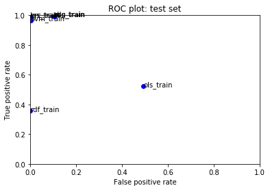
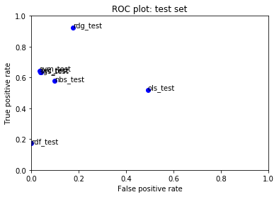

#  Assignment 1: Classification, natural language
### Machine Learning, PSAM 5020, Spring 2020 

## Iteration 1: Due Monday, March 9th

### 1. General approach and thoughts

My approach for the classification assignment on toxic Wikipedia comments is to identify a high recall model (low rate of false negatives). Given that the idea for the toxic comment classification task is to flag and and remove toxic comments, we want a model that has high rate of correctly identified positive classifications, and a low rate of false negatives (toxic comments that aren't flagged as toxic). However, we also want to reduce the amount of false positives so that non-toxic comments aren't over censored. 

The overall challenge that I'm trying to think through is that the models are already quite overfit to the dataset – using the source code I'm getting over 99% accuracy and very high precision and recall scores for most of the models. However, when applied to my test data, these high scores do not translate, meaning that our models are likely overfit. I tried making a lot of adjustments to to the bag of words feature extraction, as well as adding additional features using regular expressions and new symbol counts for exclammation marks and question marks, but was having trouble getting the accuracy, precision and recall to improve on the test data. 

Ultimately I chose the ridge regression model despite it having lower precision than other models, because the false negative rate was the lowest for this model. In an ideal scenario, I would be able to keep the false negative rate low while also decreasing the false positive rate.

### 2. Bag of words model: 
Here I decided to change the hashing vectorizer to a [count vectorizer](https://scikit-learn.org/stable/modules/generated/sklearn.feature_extraction.text.CountVectorizer.html) so that I could use n-grams or word groupings, instead of just individual words. I tried different numbers of word groupings from starting with 1-3 and up to 5. I also tried using a tfidf vectorizer (which combines the count vectorizer with tfidf transformer), however I got better results when using the count vectorizer with the tfidf transformer. 

``` python
count_vectorizer = CountVectorizer(max_features=10000)
    X_cv = count_vectorizer.fit_transform(toxic_data.comment_text)
    
    count_vectorizer2 = CountVectorizer(analyzer='word', ngram_range=(3, 5), max_features=200000)
    X_cv2 = count_vectorizer2.fit_transform(toxic_data.comment_text)
    
    transformer = TfidfTransformer(smooth_idf=False)
    X_tfidf = transformer.fit_transform(X_cv)
```

### 3. Adding new features

Here I added three new features, and ended up removing the two feautres that were in the starter code. 

First, I added a count of exclammation points for each comment. Next I added a count of uppercase words (two or more uppercase letters adjacent to each other) using a regular expression. Finally, I added a column with counts of three or more question marks grouped together in a comment.

``` python
# create regex for uppercase words 
    uppercase_pattern = '([A-Z]){2,}'

# create additional quantitative features
    # features from Amazon.csv to add to feature set
    toxic_data['exclam_count'] = toxic_data['comment_text'].str.count("\!")
    toxic_data['uppercase'] = len(re.findall(uppercase_pattern, str(toxic_data['comment_text'])))   
    toxic_data['questions'] = len(re.findall('(\?){3,}', str(toxic_data['comment_text'])))

    X_quant_features = toxic_data[["exclam_count", "uppercase", "questions"]]

```

### 4. Best model: Ridge Regression

As mentioned above, I chose this model because it had the lowest false negative rate. I'll need to make sure I can decrease the false positive rate using this model, or else I'll need to explore other models.

Results on the training data:
``` python
{'Pos': 13010, 'Neg': 114646, 'TP': 12930, 'TN': 102781, 'FP': 11865, 'FN': 80, 'Accuracy': 0.9064282133233064, 'Precision': 0.5214761040532365, 'Recall': 0.9938508839354343, 'desc': 'rdg_train'}
```

Results on the test data:
``` python
{'Pos': 3215, 'Neg': 28700, 'TP': 2976, 'TN': 23661, 'FP': 5039, 'FN': 239, 'Accuracy': 0.834623217922607, 'Precision': 0.37130380536494073, 'Recall': 0.9256609642301711, 'desc': 'rdg_test'}
```
Overall ROC plots for all models on test and training data:

Training:


Test:
