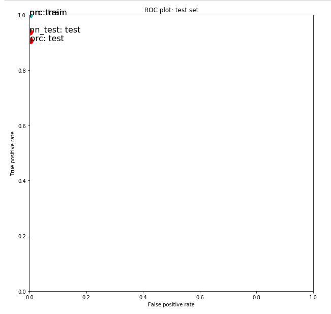

#  Assignment 2: Classification, images
### Machine Learning, PSAM 5020, Spring 2020 

## Iteration 1: Due Monday, April 6th

### 1. General approach and thoughts

My first instinct was to try to adjust the dimensions of the downsized image but this wasn't having much of an impact (although it improved slightly by downsizing it a bit more). I did a bit of [reading](https://kapernikov.com/tutorial-image-classification-with-scikit-learn/) and found that the histogram of oriented gradients was mentioned a lot for image recognition so I shifted to focus on adding this in for the feature extraction/image transformation. This immediately had a positive impact, and then my final steps were to adjust the perception and multilayer perceptron model parameters. Initially the perceptron model was performing better, but after tuning the parameters a bit more I decided to go with the multilayer perceptron.

### 2. Histogram of Oriented Gradients

Here I replaced the final image variable with the hog transformation instead of the canny edge detector. I also commented out the downscaling transformation – I initially thought it might make sense to still downsize the image, but I wasn't able to get the hog transformation to work with it (downscaling before or after the hog transformation). 

I also commented out the lines that were visualizing an example image since these were set specifically for the canny and downsized images in the starter code. I thought about trying to visualize the hog transformed images, but after talking to Aaron I decided it didn't really make sense since the images aren't meant to be 'human readable'.

I found that changing the number of orientations, pixels per cell, and cells per block had an impact on the performance of both models. I initially went quite high with these numbers, but ended up scaling them back down. The example in the article I saw for the hog transformation used 1,1 cells per block, but I didn't have good results with this. I found that if I went above 4,4 for this parameter I would get an error message so I kept it there.

```python
def image_manipulation(imname, imgs_path, imview=False):
    warnings.filterwarnings('ignore')
    imname = imgs_path + imname + '.png'
    img_raw = io.imread(imname, as_gray=False)
#     downscaled = transform.resize(img_raw, (dims[0], dims[1])) # downscale image
#     final_image = feature.canny(downscaled, sigma=1.0, low_threshold=0.0, high_threshold=0.4, mask=None, use_quantiles=True) # edge filter image with Canny algorithm
    final_image = feature.hog(img_raw, orientations=6, pixels_per_cell=(12, 12), cells_per_block=(4, 4), block_norm='L2-Hys' , visualize=False, transform_sqrt=False, feature_vector=True, multichannel=None)
    if imview==True:
        io.imshow(final_image)
    warnings.filterwarnings('always')
    return final_image
```

### 3. Multilayer Perceptron

My final step was to change the parameters of the models. Both of the models had perfect performance on my training data, but I decided to go with the multilayer perceptron because I was getting both low false positives (1) and false negatives (2) on the test data. 

I tried changing the number of hidden layers and neurons in each layer quite a bit, but this didn't seem to have a huge impact. Changing the beta_1 and beta_2 did have an impact. Still not 100% clear on all of the parameters despite reading the [MLPClassifier documentation](https://scikit-learn.org/stable/modules/generated/sklearn.neural_network.MLPClassifier.html).

``` python
nn = neural_network.MLPClassifier(hidden_layer_sizes=(7, 5), alpha=0.0000001, tol=0.0001, momentum=0.9, max_iter=2000, solver='adam', learning_rate_init=0.001, learning_rate='adaptive',  activation='tanh', beta_1=0.4, beta_2=0.5, verbose=True, n_iter_no_change=20)
```

This was my final performance on the training and test data:

``` python
TRAINING SET: 
{'Pos': 69, 'Neg': 4999, 'TP': 69, 'TN': 4999, 'FP': 0, 'FN': 0, 'Accuracy': 1.0, 'Precision': 1.0, 'Recall': 1.0, 'desc': 'nn', 'set': 'train'}
TEST SET: 
{'Pos': 32, 'Neg': 1658, 'TP': 30, 'TN': 1657, 'FP': 1, 'FN': 2, 'Accuracy': 0.9982248520710059, 'Precision': 0.967741935483871, 'Recall': 0.9375, 'desc': 'nn_test', 'set': 'test'}
```

And my final plot for both models on the training and test data: 




### 3. Notes/challenges

My biggest issue is that I seem to be hitting a wall with my multilayer perceptron in that it's generally performing pretty well with only 1-3 false positives or negatives but I can't seem to get it 0. I want to keep playing around with the model parameters and maybe the hog transformation parameters – possibly add another transformation before the hog? Not sure how this would work or if I should still try to downsize the image. 

Another issue was that the perceptron model was returning really different results every time I ran that cell. For example I could run it and get only 1 false positive and 0 false negatives on the test data, and then run it again without changing any parameters or features and get 8 false positives and 5 false negatives. I'm not sure if this means I'm doing something wrong with that model? 

I vaguely remember talking about getting really different results in the context of assignment one but I'm not sure. Anyhow, I've decided to go with the multilayer model for now but it would still be good to know why I'm getting such varied results for the other one. 