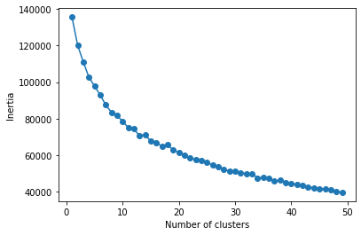
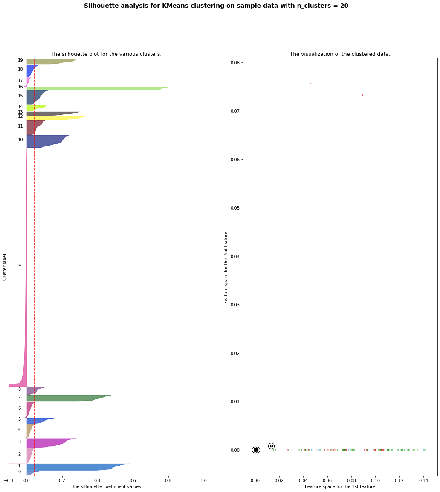
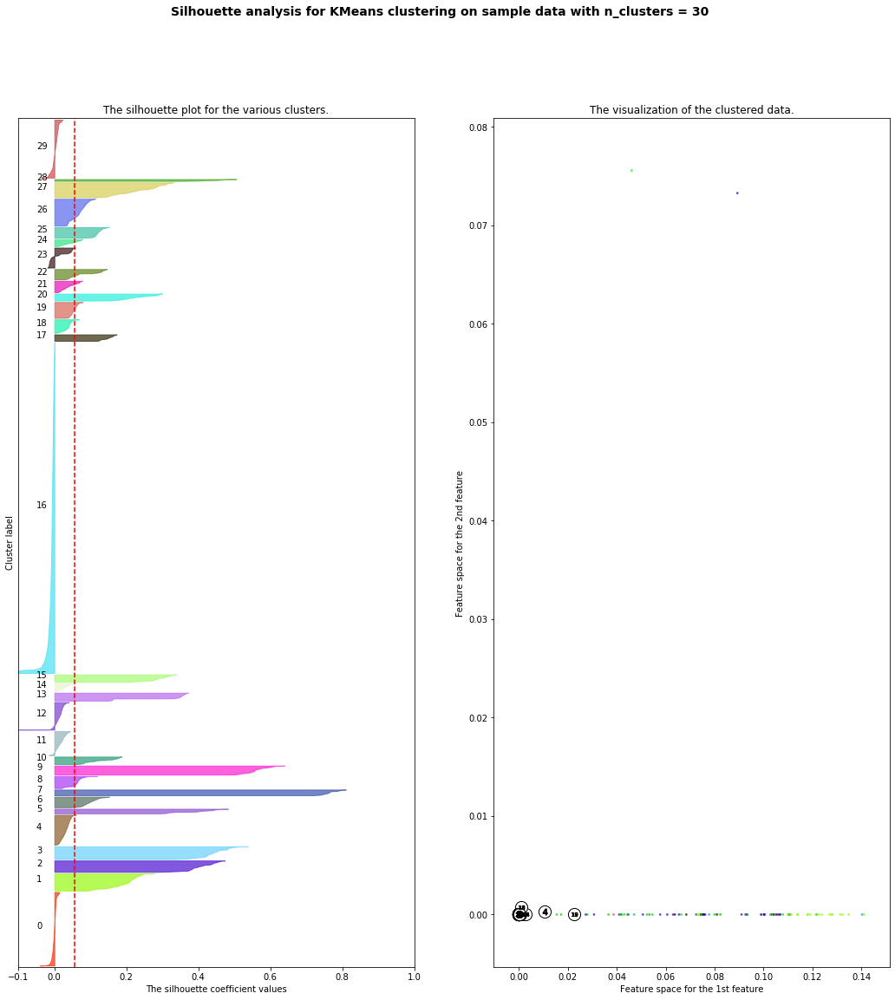
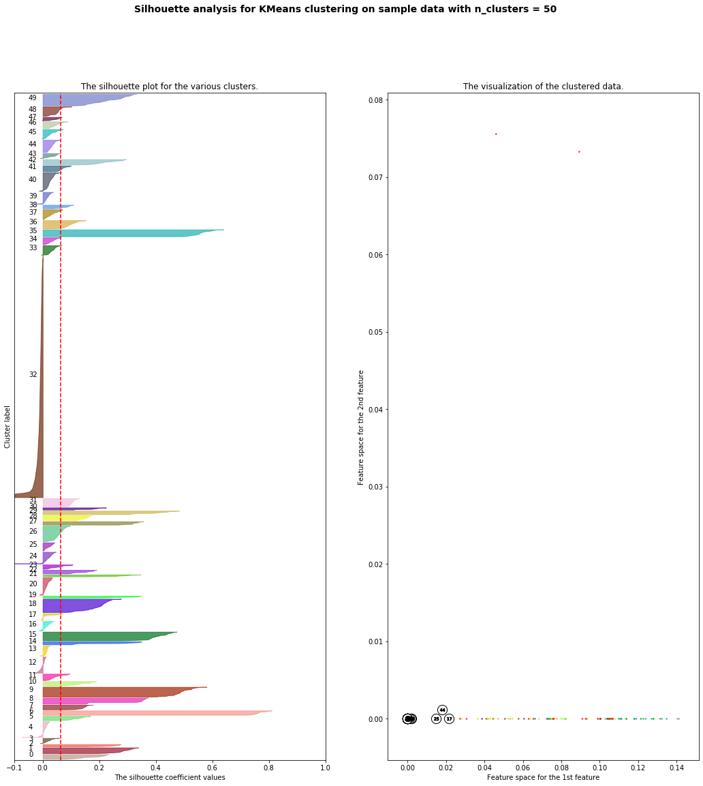
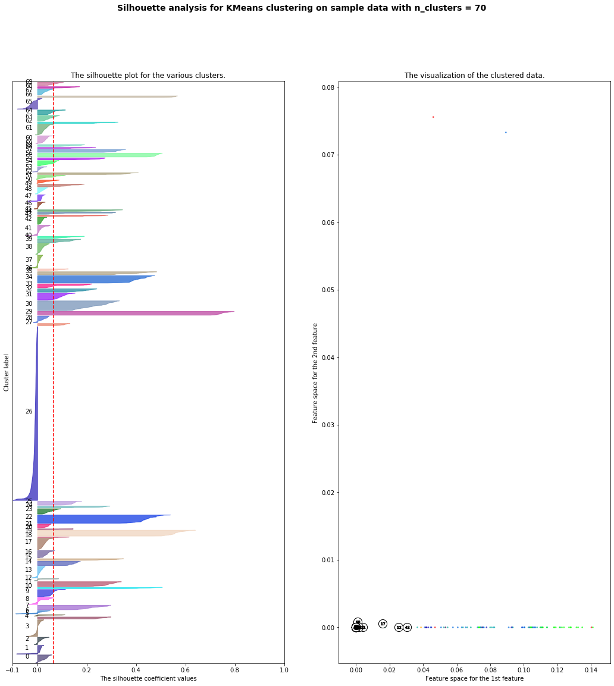

## Assignment 3: Option 3 - Food Recall Clustering

### tfidf vectorizer

I initially used the count vectorizer in the starter code but found that no matter how many clusters I had, I was still finding odd things grouped together (and that a lot of the descriptions had very long segments of repeating dates). I decided to use the tifidf to see if that would help reduce the influence of repeating words or ngrams

```python

from sklearn.feature_extraction.text import TfidfVectorizer

vectorizer = TfidfVectorizer(ngram_range=(1, 3))

corpus = raw_data['product_description']
X = vectorizer.fit_transform(corpus)

```

### Elbow plot 

Next I created an elbow/inertia plot to see if there were any points of inflection that could be useful in identifying a meaningful number of clusters. I initially did this for a cluster range of 1-100, but this plot shows from 1-50. I didn't find one major inflection point but rather a range between 5-15 in which the slope of the inertia plot really changes. However I found that using these numbers of clusters still resulting in confusing cluster contents (items that didn't seem to go together), so I raised the number of clusters.



### Silhouette plots 

Here are a few of my silhouette plots for clusters ranging from 10-70. I also went as high as 300 clusters, but didn't find this particularly useful. All of these cluster numbers has clusters of just 1 item and then some with hundreds, so I got a bit confused figuring out what was actually meaningful. I'm still not sure if I should keep trying to increase the number of clusters to see if the groupings make more sense.







### Final clusters

In the end I chose 30 as my number of clusters, but as I mentioned above I would still like to play around with this a bit. I noticed that there are a lot of ice creams and nut butters! Those tended to cluster well, while certain items like fruit bowls and salsa/onion mixes tended to get put together which didn't really make much sense to me. More to explore!

I printed all of the descriptions for each cluster:
``` python
for cluster in range(0,cluster_count):
    item_count = 0
    descriptions = []
    for i in range(0,len(km.labels_)):
        if km.labels_[i] == cluster:
            item_count += 1
#             print('item number:', i)
            descriptions.append(raw_data['product_description'][i])
    print('*****************************************************************')
    print('CLUSTER:', cluster)
    print('COUNT:', item_count)
    if item_count >= 5:
        print('DESCRIPTIONS: \n')
        print(*descriptions, sep = "\n---\n")
```

The following printout shows all of the contents of my clusters:

```python
*****************************************************************
CLUSTER: 0
COUNT: 133
DESCRIPTIONS: 

Fresh Frozen Grade A Speckled Butter Beans, Net Wt. 32 oz. (2 lb.) 907 g. Dist. By Fresh Frozen Foods, Inc., Jefferson, GA 30549, UPC 0-86069-20000-1; Fresh Frozen Grade A Specked Butter Beans, Net Wt. 80 Oz. (5 lb.) 2268g, Dist. By Fresh Frozen Foods, Inc., Jefferson, GA 30549,UPC 0-86069-50000-2; Fresh Frozen Speckled Butter Beans, Net Wt. 16 oz. (1 lb.) 454 g, UPC 0-86069-20001-8
---
Fresh Frozen Grade A Jalisco Style Blend, Net Wt. 32 Oz. (2 Lb.) 907g, Dist. By Fresh Frozen Foods, Inc., Jefferson, GA 30549, UPC 0-86069-20405-4
---
Fresh Frozen Grade A Country Blend, Net Wt. 32 Oz. (2 Lb.) 907g, Dist. By Fresh Frozen Foods, Inc., Jefferson, GA 30549, UPC 0-86069-20170-1
---
Fresh Frozen IQF Collards, Net Wt. 2 lb., Dist. By Fresh Frozen Foods, Inc., Jefferson, GA 30549, UPC 0-86069-25040-2
---
Fresh Frozen Grade A Whole Okra, Net Wt. 32 Oz. (2 lb.) 907g. Dist. By Fresh Frozen Foods, Inc., Jefferson, GA 30549, UPC 0-86069-20350-7, Fresh Frozen Grade A Whole Okra, Net Wt. 80 Oz. (5 Lb.) 2268g, Dist. By Fresh Frozen Foods, Inc., Jefferson, GA 30549, Fresh Frozen Whole Okra, Net Wt. 16 Oz. (1 Lb.) 454g, UPC 0-86069-20351-4
---
Fresh Frozen Grade A Crowder Peas, Net Wt. 32 oz. (2 lb.) 907g. Dist. By Fresh Frozen Foods, Inc., Jefferson, GA 30549, UPC 0-86069-20030-8; Fresh Frozen Grade A Crowder Peas,  Net Wt. 80 Oz. (5 lb.) 2268g, Dist. By Fresh Frozen Foods, Inc., Jefferson, GA 30549, UPC 0-86069-50030-9
---
Fresh Frozen Grade A Sliced Peaches, Net Wt. 16 Oz. (2 Lb.) (454g), Dist. By Fresh Frozen Foods, Inc., Jefferson, GA 30549, UPC 0-86069-10190-2
---
Fresh Frozen Chopped Spinach, Net. Wt. 12 Oz., Dist. By Fresh Frozen Foods, Inc., Jefferson, GA 30549, UPC 0-86069-25091-4, Fresh  Frozen Grade A Chopped Spinach, Net Wt. 32 Oz. (2 Lb.), Dist. Grade A Broccoli Cuts, Net Wt. 32 Oz, (2 Lb.) 907g, Dist. By Fresh Frozen Foods, Inc., Jefferson, GA 30549, UPC 0-86069-25090-7
---
Fresh Frozen Grade A Cut White Corn, Net Wt. 32 Oz, (2 Lb.) 907g, Dist. By Fresh Frozen Foods, Inc., Jefferson, GA 30549, UPC 0-86069-20102-2, Fresh Frozen Grade A Cut White Corn, Net Wt. 80 Oz. (5 Lb.) Dist. By Fresh Frozen Foods, Inc., Jefferson, GA 30549, UPC 0-86069-50102-3
---
Fresh Frozen Grade A Strawberries, Net Wt. 16 Oz. (2 Lb.) (454g), Dist. By Fresh Frozen Foods, Inc., Jefferson, GA 30549, UPC 0-86069-10180-3
---
Fresh Frozen Grade A Green Peas, Net Wt. 32 oz. (2 lb.) 907g. Dist. By Fresh Frozen Foods, Inc., Jefferson, GA 30549, UPC 0-86069-20061-2; Fresh Frozen Grade A Green Peas, Net Wt. 80 Oz. (5 Lb.) 2268g, Dist. By Fresh Frozen Foods, Inc., Jefferson, GA 30549, UPC 0-086069-50060-6, Steamables Green Peas Beans, Net Wt. 12 Oz , UPC 0-86069-11210-6
---
Fresh Frozen Grade A Diced Vidalia Onions, Net Wt. 32 Oz, (2 Lb.) 907g, Dist. By Fresh Frozen Foods, Inc., Jefferson, GA 30549, UPC 0-86069-20500-6, Fresh Frozen Chopped Vidalia Onions, Net Wt. 12 Oz., Dist. By Fresh Frozen Foods, Inc., Jefferson, GA 30549, UPC 0-86069-10530-6, Fresh Frozen Diced Onions, 2 Lb., Dist. By Fresh Frozen Foods, Inc., Jefferson, GA 30549 (no UPC)
---
Fresh Frozen Grade A Cut Okra, Net Wt. 32 oz. (2 lb.) 907g. Dist. By Fresh Frozen Foods, Inc., Jefferson, GA 30549, UPC 0-86069-20070-4, Fresh Frozen Grade A Cut Okra, Net Wt. 80 Oz. (5 Lb) 2268g, Dist. By Fresh Frozen Foods, Inc., Jefferson, GA 30549, UPC 0-86069-50240-2, Fresh Frozen Cut Okra, Net. Wt. 16 Oz. (1 Lb) 454g, UPC 86069-20071-1, The Inn Grade A Fancy Cut Okra, Net Wt. 48 Oz. (3 Lb) (1361g), Packed for Inn Foods Inc., 310 Walker St., Watsonville, CA 950076, UPC 0-86289-20139-0  
---
Fresh Frozen Grade A Blackberries, Net Wt. 16 Oz. (2 Lb.) (454g), Dist. By Fresh Frozen Foods, Inc., Jefferson, GA 30549, UPC 0-86069-10260-2
---
Fresh Frozen Grade A Boil Blend, Net Wt. 80 Oz. (5 Lb.), Dist. By Fresh Frozen Foods, Inc., Jefferson, GA 30549, UPC 0-86069-50265-5
---
Fresh Frozen Grade A Cut Green Beans, Net Wt. 32 oz. (2 lb.) 907g. Dist. By Fresh Frozen Foods, Inc., Jefferson, GA 30549, UPC 0-86069-20020-9; Fresh Frozen Grade A Cut Green Beans,  Net Wt. 80 Oz. (5 lb.) 2268g, Dist. By Fresh Frozen Foods, Inc., Jefferson, GA 30549, UPC 0-86069-50020-0; Fresh Frozen Cut Green Beans, Net. Wt. 16 Oz. (1 lb.) 454 g, UPC 0-86069-20021-6, Steamables Cut Green Beans, Net. Wt. 12 Oz., Distributed By Fresh Frozen Foods, Jefferson, GA 30549, UPC 0-86069-11200-7
---
Fresh Frozen Grade A Butter Peas, Net Wt. 32 oz. (2 lb.) 907g. Dist. By Fresh Frozen Foods, Inc., Jefferson, GA 30549, UPC 0-86069-20060-5; Fresh Frozen Butterpeas, Net Wt. 16 Oz (1 lb) 454g, UPC 0-86069-20063-6
---
Fresh Frozen Grade A Butter Beans, Net Wt. 32 oz. (2 lb.) 907g. Dist. By Fresh Frozen Foods, Inc., Jefferson, GA 30549, UPC 0-86069-20005-6; Fresh Frozen Butter Beans, Net Wt. 16 Oz (1 lb) 454g, UPC 0-86069-20006-3
---
Fresh Frozen Yam Patties, Net Wt. 2 Lb., Dist. By Fresh Frozen Foods, Inc., Jefferson, GA 30549, UPC 0-86069-20120-6, Fresh Frozen Sweet Potato Cuts, Net Wt. 28 Oz., Dist. By Fresh Frozen Foods, Inc., Jefferson, GA 30549, UPC 0-86069-20112-1
---
Fresh Frozen Grade A Blueberries, Net Wt. 12 Oz. (340g), Dist. By Fresh Frozen Foods, Inc., Jefferson, GA 30549, UPC 0-86069-10500-9
---
Fresh Frozen Grade A Summer Blend, Net Wt. 32 Oz. (2 Lb.) 907g, Dist. By Fresh Frozen Foods, Inc., Jefferson, GA 30549, UPC 0-86069-20330-9, Steamables Summer Blend, Net Wt. 12 Oz. (340.8g), Dist. By Fresh Frozen Foods, Inc., Jefferson, GA 30549, UPC 0-86069-11280-9 
---
Fresh Frozen Grade A Purple Hull Peas, Net Wt. 32 oz. (2 lb.) 907g. Dist. By Fresh Frozen Foods, Inc., Jefferson, GA 30549, UPC 0-86069-20041-4; Fresh Frozen Grade A Purple Hull Peas,  Net Wt. 80 Oz. (5 lb.) 2268g, Dist. By Fresh Frozen Foods, Inc., Jefferson, GA 30549, UPC 0-86069-50041-5
---
Fresh Frozen Grade A Stew Mix, Net Wt. 32 Oz. (2 Lb.) 907g, Dist. By Fresh Frozen Foods, Inc., Jefferson, GA 30549, UPC 0-86069-21270-7, Fresh Frozen Stew Mix, Net Wt. 16 Oz. (1 Lb.) 454g, Dist. By Fresh Frozen Foods, Inc., Jefferson, GA 30549, UPC 0-86069-21271-4
---
Fresh Frozen Grade A Vegetable Gumbo, Net Wt. 32 Oz. (2 Lb.) 907g, Dist. By Fresh Frozen Foods, Inc., Jefferson, GA 30549, UPC 0-86069-20150-3, Fresh Frozen Vegetable Gumbo, Net Wt. 16 Oz. (1 Lb.), Dist. By Fresh Frozen Foods, Inc., Jefferson, GA 30549, UPC 0-86069-20151-0 
---
Fresh Frozen Grade A Zipper Peas, Net Wt. 32 oz. (2 lb.) 907g. Dist. By Fresh Frozen Foods, Inc., Jefferson, GA 30549, UPC 0-86069-20042-1
---
Fresh Frozen Grade A Blackeye Peas, Net Wt. 32 oz. (2 lb.) 907g. Dist. By Fresh Frozen Foods, Inc., Jefferson, GA 30549, UPC 0-86069-20040-7; Fresh Frozen Grade A Blackeye Peas,  Net Wt. 80 Oz. (5 lb.) 2268g, Dist. By Fresh Frozen Foods, Inc., Jefferson, GA 30549, UPC 0-86069-50040-8, Fresh Frozen Blackeye Peas, Net Wt. 16 Oz. (1 lb) 454 g, UPC 0-86069-20043-8
---
Fresh Frozen Diced Red Pepper, Net Wt. 2 Lb., Dist. By Fresh Frozen Foods, Inc., Jefferson, GA 30549, (no UPC), Fresh Frozen Diced Green Pepper, Net Wt. 2 Lb., Dist. By Fresh Frozen Foods, Inc., Jefferson, GA 30549 (no UPC)
---
Fresh Frozen Grade A Stir Fry Vegetables, Net Wt. 32 Oz. (2 Lb.) 907g, Dist. By Fresh Frozen Foods, Inc., Jefferson, GA 30549, UPC 0-86069-20280-7
---
Fresh Frozen Grade A Vegetable Soup Blend with Tomatoes, Net Wt. 32 Oz. (2 Lb.) 907g, Dist. By Fresh Frozen Foods, Inc., Jefferson, GA 30549, UPC 0-86069-20160-2
---
Fresh Frozen Grade A Sliced Squash, Net Wt. 32 Oz, (2 Lb.) 907g, Dist. By Fresh Frozen Foods, Inc., Jefferson, GA 30549, UPC 0-86069-20300-2, Fresh Frozen Sliced Squash, Net. Wt. 80 Oz., (5 Lb.), Dist. By Fresh Frozen Foods, Jefferson, GA 30549, UPC 0-86069-50300-3, Fresh Frozen Sliced Yellow Squash, Net Wt. 16 Oz. (1 Lb.) Dist. By Fresh Frozen Foods, Inc., Jefferson, GA 30549, UPC 0-86069-20301-9
---
Fresh Frozen Grade A Triple Berry Blend, Net Wt. 12 Oz. (340g), Dist. By Fresh Frozen Foods, Inc., Jefferson, GA 30549, UPC 0-86069-10230-5
---
Fresh Frozen Butter Biscuits, Contains: 12 Biscuits, Net Wt. 25 Oz. (708g), Dist. By Fresh Frozen Foods, Inc., Jefferson, GA 30549, UPC 0-86069-95040-1
---
Fresh Frozen Grade A White Acre Peas, Net Wt. 32 oz. (2 lb.) 907g. Dist. By Fresh Frozen Foods, Inc., Jefferson, GA 30549, UPC 0-86069-20032-2
---
Fresh Frozen Chopped Mustard Greens, Net Wt. 16 Oz, (1 Lb.) 454g, Dist. By Fresh Frozen Foods, Inc., Jefferson, GA 30549, UPC 0-86069-25070-9, Fresh Frozen Mustard Greens, Net. Wt. 32 Oz.. (2 Lb.), Dist. By Fresh Frozen Foods, Inc., Jefferson, GA 39549, UPC 0-86069-25071-6
---
Fresh Frozen Grade A Broccoli Cuts, Net Wt. 32 Oz, (2 Lb.) 907g, Dist. By Fresh Frozen Foods, Inc., Jefferson, GA 30549, UPC 0-86069-20140-4, Fresh Frozen Grade A Broccoli Cuts, Net. Wt. 60 Oz. (5 Lb.) 2268g, Dist. By Fresh Frozen Foods, Inc., Jefferson, GA 30549, UPC 0-86069-50140-5, Fresh Frozen Broccoli Cuts, Net Wt.16 Oz. (1 Lb.) 454g, Dist. By Fresh Frozen Foods, Inc., Jefferson, GA 30549, UPC 0-86069-20142-8
---
Steamables California Blend, Net Wt. 10 Oz., Dist. By Fresh Frozen Foods, Inc., Jefferson, GA 30549, UPC 0-86069-11275-5,  Fresh Frozen California Blend, Net Wt. 16 Oz. (1 Lb.), Dist. By Fresh Frozen Foods, Inc., Jefferson, GA 30549, UPC 86069-20013-1, Fresh Frozen Grade A California Blend, Net. Wt. 32 Oz. (2 Lb.), Dist. By Fresh Frozen Foods, Jefferson, GA 30549, UPC 0-86069-20011-7, Fresh Frozen Grade A California Blend, Net Wt. 80 Oz. (5 Lb.) 2268g, Dist. By Fresh Frozen Foods, Jefferson, GA 30549, UPC 86069-50011-8, Fresh Frozen Grade A Premium California Blend, Net Wt. 32 Oz. (2 Lb.) 907g, Dist. By Fresh Frozen Foods, Inc., Jefferson, GA 30549, UPC 86069-20014-8, The Inn Grade A Fancy California Blend, Net Wt. 32 Oz. (2 LB) (907g), Packed For Inn Foods Inc., 310 Walker St., Watsonville, CA 95076, UPC 86289-20420-9 
---
Steamables Mixed Vegetables, Net. Wt. 12 Oz., Dist. By Fresh Frozen Foods, Inc., Jefferson, GA 30549, UPC 0-86069-11270-0, Fresh Frozen Mixed Vegetables, Net Wt. 16 Oz. (1 Lb.) 454g, Dist. by Fresh Frozen Foods, Inc., Jefferson, GA 30549, UPC 0-86069-20081-0, Fresh Frozen Grade A Mixed Vegetables, Net Wt. 80 Oz. (5 Lb.) 2268g, Dist. By Fresh Frozen Foods, Inc., Jefferson, GA 30549, UPC 86069-50080-4, Fresh Frozen Grade A Mixed Vegetables, Net Wt. 32 Oz. (2 Lb.) 907g, Dist. By Fresh Frozen Foods, Inc., Jefferson, GA 30549, UPC 86069-20080-3 
---
3" Corn on Cob 96 Ct., Dist. By Fresh Frozen Foods, Inc., Jefferson, GA 30549, Fresh Frozen Grade A Corn-on-Cob,  Net Wt. 32 Oz, (2 Lb.) 907g, UPC 0-86069-20200-5, Fresh Frozen Grade A Corn-on-Cobb, Net Wt. 80 Oz. (5 Lb.), Dist. By  Fresh Frozen Foods, Inc., Jefferson, GA 30549, UPC 0-86069-50250-1, Corn on Cobb 8 Count, Dist. By Fresh Frozen Foods, Inc., Jefferson, GA 30549 UPC 0-86069070100-3
---
Fresh Frozen Grade A Seasoning Blend, Net Wt. 32 Oz. (2 Lb.) 907g, Dist. By Fresh Frozen Foods, Inc., Jefferson, GA 30549, UPC 0-86069-20430-4, Fresh Frozen Grade A Seasoning Blend, Net Wt. 80 Oz. (5 Lb.) 2268g, Dist. By Fresh Frozen Foods, Inc., Jefferson, GA 30549, UPC 0-86069020432-0, Fresh Frozen Seasoning Blend, Net Wt. 16 Oz. (1 Lb.) 454g, Dist. By Fresh Frozen Foods,  Inc., Jefferson, GA 30549, UPC 0-86069-20431-3
---
Fresh Frozen Grade A Sliced Carrots, Net Wt. 32 Oz, (2 Lb.) 907g, Dist. By Fresh Frozen Foods, Inc., Jefferson, GA 30549, UPC 0-86069-20295-1, Fresh Frozen Sliced Carrots, Net Wt. 20 Lb., Dist. By Fresh Frozen Foods, Inc., Jefferson, GA 30549, Fresh Frozen Sliced Carrots, Net. Wt. 16 Oz. (1 Lb.) 454g, Dist. By Fresh Frozen Foods, Inc., Jefferson, GA 30549, UPC 0-86069-20296-8
---
Fresh Frozen Grade A Breaded Squash, Net Wt. 32 Oz, (2 Lb.) 907g, Dist. By Fresh Frozen Foods, Inc., Jefferson, GA 30549, UPC 0-86069-20270-8
---
Fresh Frozen Biscuits Southern Style, Contains 12 Biscuits, Net Wt. 25 Oz. (708g), Dist. By Fresh Frozen Foods, Inc., Jefferson, GA 30549, UPC 0-86069-95015-9
---
Fresh Frozen Grade A Cut Yellow Corn, Net Wt. 32 Oz. (2 Lb.) 907g. Dist. By Fresh Frozen Foods, Inc., Jefferson, GA 30549, UPC 0-86069-20100-8, Fresh Frozen Grade A Cut Corn, Net Wt. 80 Oz. (5 Lb.) 2268g , Dist. By Fresh Frozen Foods, Inc., Jefferson, GA 30549, UPC 0-86069-50100-9, Fresh Frozen Cut Yellow Corn, Net Wt. 16 Oz. (1 Lb.) 454 g, UPC 0-86069-20101-5,  Steamable Cut Yellow Corn, Net Wt. 12 Oz., Dist. By Fresh Frozen Foods, Jefferson, GA 30354 UPC 0-86069-11230-4
---
Fresh Frozen Chopped Vidalia Onions & Squash, Net Wt. 32 Oz, (2 Lb.) 907g, Dist. By Fresh Frozen Foods, Inc., Jefferson, GA 30549, UPC 0-86069-20510-5
---
Fresh Frozen Grade A Baby Lima Beans, Net Wt. 32 oz. (2 lb.) 907 g. Dist. By Fresh Frozen Foods, Inc., Jefferson, GA 30549, UPC 0-86069-20010-0; Fresh Frozen Grade A Baby Lima Beans,  Net Wt. 80 Oz. (5 lb.) 2268g, Dist. By Fresh Frozen Foods, Inc., Jefferson, GA 30549, UPC 0-86069-50010-1; Fresh Frozen Baby Lima Beans, Net Wt. 16 oz. (1 lb.) 454 g, UPC 0-86069-20012-4, Fresh Frozen Fordhook Lima Beans, Net Wt. 24 Oz., Dist. By Fresh Frozen Foods, Inc., Jefferson, GA 30549, UPC 0-86069-20016-2
---
Fresh Frozen Grade A Tejano Style Blend, Net Wt. 32 Oz. (2 Lb.) 907g, Dist. By Fresh Frozen Foods,  Inc., Jefferson, GA 30549, UPC 0-86069-20400-9
---
Fresh Frozen Grade A Italian Blend, Net Wt. 32 Oz. (2 Lb.) 907g, Dist. By Fresh Frozen Foods, Inc., Jefferson, GA 30549, UPC 0-86069-20285-2, Steamables Italian Blend, Net Wt. 10 Oz., Dist. By Fresh Frozen Foods, Inc., Jefferson, GA 30549, UPC 0-86069-11290-8
---
Fresh Frozen Southern Style Cheese Biscuits, Contains: 12 Biscuits, Net Wt. 25 Oz. (706g), Dist. By Fresh Frozen Foods, Inc., Jefferson, GA 30549, UPC 0-86069-95020-3
---
Fresh Frozen Grade A Fajita Blend, Net Wt. 32 Oz. (2 Lb.) 907g, Dist. By Fresh Frozen Foods, Inc., Jefferson, GA 30549, UPC 0-86069-20425-2
---
Fresh Frozen Grade A Field Peas with Snaps, Net Wt. 32 oz. (2 lb.) 907g. Dist. By Fresh Frozen Foods, Inc., Jefferson, GA 30549, UPC 0-86069-20050-6; Fresh Frozen Grade A Field Peas with Snaps,  Net Wt. 80 Oz. (5 lb.) 2268g, Dist. By Fresh Frozen Foods, Inc., Jefferson, GA 30549, UPC 0-86069-50050-7, Fresh Frozen Field Peas with Snaps, Net Wt. 16 Oz (1 lb) 454g, UPC 0-86069-20051-3
---
Fresh Frozen Grade A Peas and Carrots, Net Wt. 32 oz. (2 lb.) 907g. Dist. By Fresh Frozen Foods, Inc., Jefferson, GA 30549, UPC 0-86069-20290-6; Fresh Frozen Grade A Peas and Carrots, Net Wt. 80 Oz. (5 Lb.) 2268g, Dist. By Fresh Frozen Foods, Inc., Jefferson, GA 30549, UPC 0-086069-50290-7
---
Fresh Frozen Chopped Turnip Greens with Diced Turnips, Net Wt. 16 Oz. (454g), Dist. By Fresh Frozen Foods, Inc., Jefferson, GA 30549, UPC 0-86069-25061-7, Fresh Frozen Grade A Chopped Turnip Greens and Diced Turnips, Net Wt. 32 Oz. (2 Lb.) 908.8g, Dist. By Fresh Frozen Foods, Inc., Jefferson, GA 30549, UPC 0-86069-250060-0, IQF Turnip Greens, Net Wt. 2 Lb., Dist. By Fresh Frozen Foods, Inc., Jefferson, GA 30549, UPC 0-86069-25050-1, Fresh Frozen Turnip Greens, Net Wt. 1 Lb., Dist. By Fresh Frozen Foods, Inc, Jefferson, GA 30549, UPC 0-86069-25051-8
---
Fresh Frozen Grade A Breaded Okra, Net Wt. 32 oz. (2 lb.) 907g. Dist. By Fresh Frozen Foods, Inc., Jefferson, GA 30549, UPC 0-86069-20075-9, Fresh Frozen Grade A Breaded Okra, Net Wt. 80 Oz. (5 Lb) 2268g, Dist. By Fresh Frozen Foods, Inc., Jefferson, GA 30549, UPC 0-86069-50075-0, Fresh Frozen Breaded Okra, Net. Wt. 16 Oz. (1 Lb) 454g, UPC 86069-20076-6
---
Fresh Frozen Diced Celery, Net Wt. 2 lb., Dist. By Fresh Frozen Foods, Inc., Jefferson, GA 30549, (no UPC)
---
Fresh Frozen Grade A Sliced Zucchini, Net Wt. 32 Oz, (2 Lb.) 907g, Dist. By Fresh Frozen Foods, Inc., Jefferson, GA 30549, UPC 0-86069-20310-1
---
Fresh Frozen Grade A Italian Green Beans, Net Wt. 32 oz. (2 lb.) 907g. Dist. By Fresh Frozen Foods, Inc., Jefferson, GA 30549, UPC 0-86069-20340-8; Fresh Frozen Grade A Italian Green Beans,  Net Wt. 80 Oz. (5 lb.) 2268g, Dist. By Fresh Frozen Foods, Inc., Jefferson, GA 30549, UPC 0-86069-50340-9; Fresh Frozen Italian Green Beans, Net. Wt. 16 Oz. (1 lb.) 454g, UPC 0-86069-20341-5
---
Fresh Frozen Grade A Brussels Sprouts, Net Wt. 32 Oz, (2 Lb.) 907g, Dist. By Fresh Frozen Foods, Inc., Jefferson, GA 30549, UPC 0-86069-20355-2, Fresh Frozen Brussels Sprouts, Net Wt. 16 Oz. (1 Lb.) 454g, Dist. By Fresh Frozen Foods, Inc., Jefferson, GA 30549, UPC 0-86069-20356-9
---
Asher's Chocolate Co, White Confectionery Coating (67357) Cookie Cup 3 oz., 24/box. 
---
Asher's Chocolate Co. Dark Chocolate (14762) FK Almond Bark; 4 oz. (12/box) 
---
Asher's Chocolate Co. Milk Chocolate (67360) Candy Cup-Milk with MM's 4 oz.; 24 Piece/box;
---
Asher's Chocolate Co,  Milk Chocolate  (79510) Half-Dipped Apricot, Net Wt. 5 lb.,; Asher's Chocolate Co,  Milk Chocolate (86663) Goodies Apricot (half dipped), Net Wt. 5 lb.
---
Asher's Chocolate Co. Milk Chocolate (82015) Disney Almond Praline; Net Wt. 3 oz.;  
---
Asher's Chocolate Co. Milk Chocolate (82019); Disney Pecan Praline; 15 - 3 oz. pc box;  
---
Asher's Chocolate Co, Milk Chocolate Flavored Coating (14041) SF Smooth Bottom Almond Buttercrunch; Net Wt. 6 lb.; 
---
Asher's Chocolate Co. Milk Chocolate Flavored Coating (13741) NSA Almond Butter Crunch; Net Wt. 6 lbs.;  
---
Asher's Chocolate Co, Milk Chocolate (86650) Oreo Bark with Dark String; Net Wt. 4 lb.; 
---
Asher's Chocolate Co,  Milk Chocolate (08501) Nut Cup (large); Net Wt. 2.25 oz. (24/box); 
---
Asher's Chocolate Co, Milk Chocolate (99040) Coconut Cluster (Pack Size); Net Wt. 5  lb.; Asher's Chocolate Co, Milk Chocolate (03931) Coconut Cluster; Net Wt. 5  lb.; Asher's Chocolate Co, Milk Chocolate (03933) Coconut Cluster (Ultra); Net Wt. 5  lb.; 
---
Asher's Chocolate Co. Dark Chocolate (57916) Mini Pretzel with White Seed; Net Wt. 4 lbs.;  
---
Asher's Chocolate Co. Milk Chocolate (83425) Coconut Haystack; Net Wt. 3 lb.; 
---
Asher's Chocolate Co, White Confectionery Coating (11483) Pretzel Cluster; Net Wt. 5 lb.; 
---
Asher's Chocolate Co. Milk Chocolate (14770) FK Cashew Praline;  3 oz. (15/box) 
---
Asher's Chocolate Co. White Confectionery Coating (82018) Disney Macadamia Praline; 15 - 3 oz. pc. box;  Asher's Chocolate Co. White Confectionery Coating (75010) Macadamia Praline; 3 oz. (15/box);  
---
Asher's Chocolate Co,  Dark Chocolate (10892) Pecan Cluster; Net Wt. 5 lb.; 
---
Asher's Chocolate Co. Milk Chocolate (09611) Peanut Butter Cup 2.35 oz.; 24 pc./box.;   Asher's Chocolate Co. Milk Chocolate (09618) Peanut Butter Cup Mini; 4 lb..; Asher's Chocolate Co. Milk Chocolate (11806) Peanut Butter Cup; 2.35 oz. 24/box.; Asher's Chocolate Co. Milk Chocolate (82024) Disney Peanut Butter Cup 2; 24 piece box;  
---
Asher's Chocolate Co, Milk Chocolate (00971) Almond Cluster; Net Wt. 5 lb .; Asher's Chocolate Co, Milk Chocolate (99039) Almond Cluster (pack size); Net Wt. 5 lb.; 
---
Asher's Chocolate Co,  Milk Chocolate Flavored Coating (38605) English Toffee Slab; Net Wt. 5 lb; 
---
Asher's Chocolate Co. Milk Chocolate (09991) Peanut Cluster; Net Wt. 5 lb.; Fitzkee Peanut Clusters MK (80022); Asher's Chocolate Co. Milk Chocolate (99028) Peanut Cluster (pack size)
---
Asher's Chocolate Co, Milk Chocolate Flavored Coating (13511) NSA Almond Cluster; Net Wt. 5 lb.; 
---
Asher's Chocolate Co. White Confectionery coating (86665) Goodies Apricot (half dipped; Net Wt. 5 LB..; 
---
Asher's Chocolate Co, Milk Chocolate (86730) Goodies Almond Bark (scored); Net Wt. 5 lb.; 
---
Asher's Chocolate Co, Milk Chocolate (03171) Cashew Cluster; Net Wt. 5 lb.; Asher's Chocolate Co, Milk Chocolate (03001) Cashew Bark; Net Wt. 6 lb.;
---
Asher's Chocolate Co,  Dark Chocolate (86651) Goodies Oreo Bark with White String; Net Wt. 4 lb.; 
---
Asher's Chocolate Co, Milk Chocolate Flavored Coating (13521) NSA  Cashew Cluster; Net Wt. 5 lb.;   Asher's Chocolate Co, Milk Chocolate Flavored Coating (13625) NSA  Cashew Single; Net Wt. 5 lb.; 
---
Asher's Chocolate Co. Dark Chocolate Flavored (48153) SF Majestic Almond Cluster Cup; Net Wt. 5 lb.
---
Asher's Chocolate Co,  Half Dipped  in Dark Chocolate (79511) Glace Apricot, Net Wt. 5 lb.,; Asher's Chocolate Co,  Dark Chocolate (86664) Goodies Apricot (half dipped), Net Wt. 5 lb.        
---
Asher's Chocolate Co, White Confectionery Coating (09993) Peanut Cluster, Net Wt. 5 lbs.,               
---
Asher's Chocolate Co. Milk Chocolate (08005) Mint Souffle; Net Wt. 6 lb.; 
---
Asher's Chocolate Co, Milk Chocolate Flavored Coating (13981) Pretzels (3 Ring); Net Wt. 7 lb.;   
---
Asher's Chocolate Co, Milk Chocolate (14813) FK Molasses Pop; Net Wt. 2 oz. (24/box).; Asher's Chocolate Co, Milk Chocolate Coated (65901) Molasses Pop; Net Wt. 2 oz. (24/box).
---
Asher's Chocolate Co. Milk Chocolate Flavored (85019) Vermont NSA Almond Buttercrunch; 12 oz. (12/box)  
---
Asher's Chocolate Co. Milk Chocolate (10931) LWTN Potato Chip Clusters; Net Wt. 5 lbs.; 
---
Asher's Chocolate Co, Dark Chocolate (14843) Pa General Almond Bark with Sea Salt, Net Wt. 6 lb
---
Asher's Chocolate Co, Dark Chocolate (00972) Almond Cluster, Net Wt. 5 lb
---
Asher's Chocolate Co, White Confectionery Coating (83426) Coconut Haystack, Net Weight 3 lb; 
---
Asher's Chocolate Co. Dark Chocolate (65902) Molasses Pop; 2 oz. (24/box); 
---
Asher's Chocolate Co,  Milk Chocolate Flavored Coating  (13954) NSA Almond Caramel Pattie; Net Wt. 4 lb.; 
---
Asher's Chocolate Co, Milk Chocolate Flavored Coating (48154) SF Coconut Cluster (cupped) ; Net Wt. 5 lb.;   Asher's Chocolate Co, Milk Chocolate Flavored Coating (64631) SF Coconut Cluster; 4 oz. (12/box); 
---
Asher's Chocolate Co, Milk Chocolate (67220) Sour Cherry Cluster; Net Wt. 5 lb.; 
---
Asher's Chocolate Co,  Dark Chocolate (10803) Pecan Paw; Net Wt. 4 lb.; 
---
Asher's Chocolate Co White Confectionery (16006) Break-Up Scored; Net Wt. 7 lbs.; ; 
---
Asher's Chocolate Co, Milk Chocolate (16636) Macadamia Cluster; Net Wt. 5 lb.; 
---
Asher's Chocolate Co. Milk Chocolate (67365) Candy Cup with M and M's;      
---
Asher's Chocolate Co,  Dark Chocolate (67221) Sour Cherry Cluster, Net Wt. 5 lb., 
---
Asher's Chocolate Co, White Confectionery Coating (05003) Jumbo Coconut Haystack with Milk Bottom; Net Weight 3 lb.; Asher's Chocolate Co, White Confectionery Coating (67887) Coconut Haystack with Milk Bottom; 4 oz. (12/box); 
---
Asher's Chocolate Co, Milk Chocolate (00400) Almond Paw; Net Wt. 4 lb.; 
---
Asher's Chocolate Co, Milk Chocolate Flavored Coating (13901) SF Almond Butter Toffee; Net Wt. 6 lb.; 
---
Asher's Chocolate Co, Milk Chocolate (67355) Cookie Cup 3 oz.; Net Wt. 3 oz. (24 piece/box);
---
Asher's Chocolate Co. Milk Chocolate Flavored Coating (13667) Potato Chip; Sugar Free, Low Sodium; Net Wt. 3 lbs.;  
---
Asher's Chocolate Co. Milk Chocolate (75007) Almond Praline; 3 oz. (15/box); 
---
Asher's Chocolate Co, White Confectionery Coating (86652) Goodies Oreo Bark with Dark String, Net Wt. 4 lb.
---
Asher's Chocolate Co, Milk Chocolate Flavored Coating (13955) NSA Macadamia Caramel Pattie with Dark String; Net Wt. 4 lb.; 
---
Asher's Chocolate Co, Milk Chocolate (10891) Pecan Cluster; Net Wt. 5 lb.; 
---
Asher's Chocolate Co, Dark Chocolate (00401) Almond Paw, Net Wt. 4 lb
---
Asher's Chocolate Co. Milk Chocolate (75014) Pecan Caramel Roll; 2 oz. (24/box; 
---
Asher's Chocolate Co. Milk Chocolate Flavored (13371) SF Peanut Butter Cup 1.35 oz.; (48 Piece Box); 
---
Asher's Chocolate Co. Milk Chocolate (14651) FK Flip Flop (Decorated); 2 oz. (24/box);  
---
Asher's Chocolate Co, Milk Chocolate (11481) Pretzel Cluster; Net Wt. 5 lb.; Asher's Chocolate Co, Milk Chocolate (75261) Pretzel Cluster; 4 oz. (12/box).
---
Asher's Chocolate Co,  Dark Chocolate (83427) Coconut Haystack; Net Wt. 3 lb.; Asher's Chocolate Co,  Dark Chocolate (03932) Coconut Cluster; Net Wt. 5 lb.;  
---
Asher's Chocolate Co,  Dark Chocolate (11482) Pretzel Cluster; Net Wt. 5 lb.; 
---
Asher's Chocolate Co. Dark Chocolate (09612) Peanut Butter Cup 2.35 oz.; 24 pc./box.; Asher's Chocolate Co. Dark Chocolate (11807) Peanut Butter Cup; 2.34 oz (24/box).; 
---
Asher's Chocolate Co, White Confectionery Coating (06655) Macadamia Paw, Net Wt. 4 lbs.,                 
---
Asher's Chocolate Co, Milk Chocolate (03310) Cashew Paw; Net Wt. 4 lb.
---
Asher's Chocolate Co,  Dark Chocolate (09992) Peanut Cluster (Whole Nut); Net Wt. 5 lb.;  Asher's Chocolate Co, Dark Chocolate (99033) Peanut Cluster (pack size); Net Wt. 5 lb.; 
---
Asher's Chocolate Co, Milk Chocolate (02300) Caramel Corn Cluster; Net Wt. 3 lb.; 
---
Asher's Chocolate Co,  Dark Chocolate (00332) Almond Bark (Flat), Net Wt. 6 lb.; Asher's Chocolate Co,  Dark Chocolate (86731) Goodies Almond Bark (scored), Net Wt. 6 lb
---
Asher's Chocolate Co,  Dark Chocolate (03172) Cashew Clusters; Net Wt. 5 lb.;     
---
Asher's Chocolate Co,  Dark Chocolate (14814) FK Molasses Pop; Net Wt. 2 oz. (24/box).
---
Asher's Chocolate Co. White Confectionery Coating (82020) Disney Peanut Butter Cup with Milk Mickey Head;  Asher's Chocolate Co. White Confectionery Coating (75107) Peanut Butter Cup; 2.35 oz. (24/box);  
---
Asher's Chocolate Co. Milk Chocolate (82017) Disney Macadamia Praline; 15 - 3 oz. Piece box;    Asher's Chocolate Co. Milk Chocolate (75009) Macadamia Praline; 3 oz. (15/box);  
---
Asher's Chocolate Co. Milk Chocolate (82016) Disney Cashew Praline; 15 - 3 oz. Piece box;  Asher's Chocolate Co. Milk Chocolate (75008) Cashew Praline; 3 oz. (15/box)  
---
Asher's Chocolate Co. Milk Chocolate and Peanut Butter (12100) Large Sea Shell; 64 pieces per box; 
---
Asher's Chocolate Co. Milk Chocolate (09661) Peanut Butter Caramel Cup 2.25 oz.; 24 piece box.; 
*****************************************************************
CLUSTER: 1
COUNT: 114
DESCRIPTIONS: 

Lemon Perfection Custard, sold under Snoqualmie brand.  Product is sold in 16 oz. (pint) paper cartons;1.5 and 3 gallon plastic tubs.  No UPC.
---
Lemon Custard, sold under Snoqualmie brand.  Product is sold in 1.5 and 3 gallon plastic tubs.  No UPC.
---
19% Chocolate Ice Cream Mix, sold under Snoqualmie brand. Product is sold in 2.5 gallon clear flexible plastic bags. No UPC.
---
Creme Fraiche (without soy lecithin) Gelato, sold under Snoqualmie brand.  Product is sold in 16 oz (pint) paper cartons. No UPC.
---
Double Chocolate Custard, sold under Snoqualmie brand. Product is sold in 3 gallon plastic tubs.  No UPC.
---
Cherry Vanilla  Custard (with egg), sold under Snoqualmie brand. Product is sold in 16 oz. (pint) paper cartons.  No UPC.
---
5.5% Soft-Serve Ice Cream Mix, sold under Snoqualmie brand. Product is sold in 2.5 gallon clear flexible plastic bags. No UPC.
---
Lime Sorbet, sold under Snoqualmie brand.  Product is sold in 3 gallon plastic tubs. No UPC.
---
Gelato Mix, sold under Snoqualmie Ice Cream brand.  Product is sold in 2.5 gallon plastic bags. No UPC.
---
Lemon Lime Sorbet, sold under Snoqualmie brand.  Product is sold in 16 oz. (pint) paper cartons and 1.5 and 3 gallon plastic tubs. No UPC.
---
Strawberry Cosmo Lemon Twist Sorbet, sold under Snoqualmie brand.  Product is sold in 1.5 gallon plastic tubs. No UPC.
---
Grapefruit Sorbet, sold under Snoqualmie brand.  Product is sold in 3 gallon plastic tubs. No UPC.
---
Pear Sorbet, sold under Snoqualmie brand.  Product is sold in 3 gallon plastic tubs. No UPC.
---
Lemoncello-Mint Gelato, sold under Snoqualmie Ice Cream brand.  Product is sold in 1.5 gallon plastic tubs.  No UPC.
---
Apricot Mango Sorbet, sold under Snoqualmie brand.  Product is sold in 3 gallon plastic tubs. No UPC.
---
Vanilla High Protein Shake Ice Cream Mix, sold under Snoqualmie brand. Product is sold in 2.5 gallon clear flexible plastic bags. No UPC.
---
Chocolate Gelato, sold under Snoqualmie Ice Cream brand.  Product is sold in 1.5 gallon plastic tubs. No UPC.
---
Peach Champagne Sorbet, sold under Snoqualmie brand.  Product is sold in 1.5 and 3 gallon plastic tubs, in addition to a number of unknown sizes. No UPC.
---
Guava Sorbet, sold under Snoqualmie brand.  Product is sold in 3 gallon plastic tubs. No UPC.
---
Coconut Rum Sorbet, sold under Snoqualmie brand.  Product is sold in 3 gallon plastic tubs. No UPC.
---
Coconut Sorbet, sold under Snoqualmie brand.  Product is sold in 3 gallon plastic tubs. No UPC.
---
Passion Fruit Sorbet, sold under Snoqualmie brand.  Product is sold in 3 gallon plastic tubs. No UPC.
---
Cranberry Sorbet, sold under Snoqualmie brand.  Product is sold in 1.5 and 3 gallon plastic tubs. No UPC.
---
Honey Cinnamon Custard (with soy lecithin), sold under Snoqualmie brand.  Product is sold in 1.5 and 3 gallon plastic tubs.  No UPC.
---
Rosewater Pistachio Gelato, sold under Snoqualmie Ice Cream brand.  Product is sold in 1.5 gallon plastic tubs.  No UPC.
---
Cranberry Orange Sorbet, sold under Snoqualmie brand.  Product is sold in 3 gallon plastic tubs. No UPC.
---
Pistachio Gelato, sold under Snoqualmie Ice Cream brand.  Product is sold in 1 gallon plastic trays; 1.5 and 3 gallon plastic tubs and other unknown container type/sizes.  No UPC.
---
13% Ice Cream Mix, sold under Snoqualmie brand. Product is sold in 2.5 gallon clear flexible plastic bags. No UPC.
---
Mandarine/Tangerine Sorbet, sold under Snoqualmie brand.  Product is sold in 3 gallon plastic tubs. No UPC.
---
Raspberry Gelato, sold under Snoqualmie Ice Cream brand.  Product is sold in 1.5 gallon plastic tubs.  No UPC.
---
Chocolate Chip Cookie Dough Custard, sold under Snoqualmie brand. Product is sold in 1 gallon plastic trays and 3 gallon plastic tubs.  No UPC.
---
Honey Raspberry Gelato, sold under Snoqualmie Ice Cream brand.  Product is sold in 1.5 and 3 gallon plastic tubs.  No UPC.
---
19% Ice Cream Mix, sold under Snoqualmie brand. Product is sold in 2.5 gallon clear flexible plastic bags. No UPC.
---
Pear Ginger Sorbet, sold under Snoqualmie brand.  Product is sold in 1.5 gallon plastic tubs. No UPC.
---
English Toffee Custard, sold under Snoqualmie brand.  Product is sold in 3 gallon plastic tubs.  No UPC.
---
Blueberry Sorbet, sold under Snoqualmie brand.  Product is sold in 1.5 and 3 gallon plastic tubs. No UPC.
---
Champagne Sorbet, sold under Snoqualmie brand.  Product is sold in 1.5 and 3 gallon plastic tubs. No UPC.
---
Pumpkin Custard (with soy lecithin), sold under Snoqualmie brand.  Product is sold in 1.5 and 3 gallon plastic tubs.  No UPC.
---
Peppermint Stick (without lecithin) Gelato, sold under Snoqualmie brand.  Product is sold in 16 oz (pint) paper cartons.  No UPC.
---
Checkered Chocolate Custard, sold under Snoqualmie brand. Product is sold in 3 gallon plastic tub and 16 oz. (pint) paper cartons.  No UPC.
---
Cherry Sorbet, sold under Snoqualmie brand.  Product is sold in 3 gallon plastic tubs. No UPC.
---
Pear (Bartlett Pear) Sorbet, sold under Snoqualmie brand.  Product is sold in 1.5 and 3 gallon plastic tubs. No UPC.
---
Four Sorbets/Different ones, sold under Snoqualmie brand.  Product is sold in 3 gallon plastic tubs. No UPC.
---
Strawberry Basil Sorbet, sold under Snoqualmie brand.  Product is sold in 1.5 gallon plastic tubs. No UPC.
---
Sorbet Cosmo Lemon Twist, sold under Snoqualmie brand.  Product is sold in 1.5 gallon plastic tubs. No UPC.
---
Sorbet Base, sold under Snoqualmie brand.  Product is sold in 2.5 gallon plastic bags. No UPC.
---
Turkish Coast Coffee Custard, sold under Snoqualmie brand.  Product is sold in 1 gallon plastic trays. No UPC.
---
Mango Passion Fruit Sorbet, sold under Snoqualmie brand.  Product is sold in 1.5 and 3 gallon plastic tubs, in addition to a quantity of unknown sizes. No UPC.
---
Berry Ripple Sorbet, sold under Snoqualmie brand.  Product is sold in 1.5 gallon plastic tubs. No UPC.
---
Lemon Thyme Sorbet, sold under Snoqualmie brand.  Product is sold in 1.5 gallon plastic tubs. No UPC.
---
10% Soft-Serve Chocolate Ice Cream Mix, sold under Snoqualmie brand. Product is sold in 2.5 gallon clear flexible plastic bags.  No UPC.
---
Pomegranate Sorbet, sold under Snoqualmie brand.  Product is sold in 1.5 and 3 gallon plastic tubs. No UPC.
---
Creme Fraiche (with soy lecithin) Gelato, sold under Snoqualmie Ice  Cream brand.  Product is sold in 1.5 and 3 gallon plastic tubs.  No UPC.
---
Blackberry Sorbet, sold under Snoqualmie brand.  Product is sold in 1.5 and 3 gallon plastic tubs. No UPC.
---
Cookie Dough Custard, sold under Snoqualmie brand. Product is sold in 3 gallon plastic tubs.  No UPC.
---
Chocolate Brilliance Gelato, sold under Snoqualmie brand.  Product is sold in 16 oz (pint) paper cartons; 1.5 and 3 gallon plastic tubs. No UPC.
---
Berry Sorbet, sold under Snoqualmie brand.  Product is sold in 1 gallon plastic trays. No UPC.
---
Watermelon Sorbet, sold under Snoqualmie brand.  Product is sold in 3 gallon plastic tubs. No UPC.
---
Lemon Basil Sorbet, sold under Snoqualmie brand.  Product is sold in 1.5 and 3 gallon plastic tubs. No UPC.
---
Lavender Sorbet, sold under Snoqualmie brand.  Product is sold in 3 gallon plastic tubs. No UPC.
---
Lemon Sorbet with Lemon Swirl, sold under Snoqualmie brand.  Product is sold in 3 gallon plastic tubs. No UPC.
---
Double Chocolate Custard with Peanuts, sold under Snoqualmie brand. Product is sold in 3 gallon plastic tubs.  No UPC.
---
14% Ice Cream Mix with acme stabilizer, sold under Snoqualmie brand. Product is sold in 2.5 gallon clear flexible plastic bags. No UPC.
---
Double Chocolate Custard with Espresso, sold under Snoqualmie brand. Product is sold in 3 gallon plastic tubs.  No UPC.
---
Pear Champagne Sorbet, sold under Snoqualmie brand.  Product is sold in 3 gallon plastic tubs. No UPC.
---
Pomegranate Cranberry Sorbet, sold under Snoqualmie brand.  Product is sold in 3 gallon plastic tubs. No UPC.
---
Strawberry Rhubarb Sorbet, sold under Snoqualmie brand.  Product is sold in 3 gallon plastic tubs. No UPC.
---
Blood Orange Sorbet, sold under Snoqualmie brand.  Product is sold in 3 gallon plastic tubs. No UPC.
---
Coconut Pineapple Sorbet, sold under Snoqualmie brand.  Product is sold in 3 gallon plastic tubs. No UPC.
---
Orange Sorbet, sold under Snoqualmie brand.  Product is sold in 1.5 and 3 gallon plastic tubs. No UPC.
---
Pineapple Coconut Rum Sorbet, sold under Snoqualmie brand.  Product is sold in 3 gallon plastic tubs. No UPC.
---
Lemon Sorbet, sold under Snoqualmie brand.  Product is sold in 1 gallon plastic trays and 1.5 and 3 gallon plastic tubs. No UPC.
---
Blueberry Ginger Sorbet, sold under Snoqualmie brand.  Product is sold in 1.5 and 3 gallon plastic tubs. No UPC.
---
Peach Sorbet, sold under Snoqualmie brand.  Product is sold in 1 gallon trays; 1.5 and 3 gallon plastic tubs; and a number of unknown sizes. No UPC.
---
Lemon Meyer Sorbet (Meyer Lemon), sold under Snoqualmie brand.  Product is sold in 1.5 gallon or 3 gallon plastic tubs. No UPC and no labels provided
---
Apricot Sorbet, sold under Snoqualmie brand.  Product is sold in 1.5 and 3 gallon plastic tubs. No UPC.
---
Apple Cider Sorbet, sold under Snoqualmie brand.  Product is sold in 3 gallon plastic tubs. No UPC.
---
Cranberry Raspberry Sorbet, sold under Snoqualmie brand.  Product is sold in 1 gallon plastic trays; 1.5 and 3 gallon plastic tubs. No UPC.
---
Key Lime Sorbet, sold under Snoqualmie brand.  Product is sold in 3 gallon plastic tubs. No UPC.
---
Orange Pomegranate Sorbet, sold under Snoqualmie brand.  Product is sold in 1.5 and 3 gallon plastic tubs. No UPC.
---
Peppermint Stick (with lecithin) Gelato, sold under Snoqualmie Ice Cream brand.  Product is sold in 1 gallon plastic trays; 1.5 and 3 gallon plastic tubs.  No UPC.
---
Chocolate High Protein Shake Ice Cream Mix, sold under Snoqualmie brand. Product is sold in 2.5 gallon clear flexible plastic bags. No UPC.
---
French Vanilla Custard (with soy lecithin), sold under Snoqualmie brand.  Product is sold in 1.5 and 3 gallon plastic tubs.  No UPC.
---
Blackberry Cabernet Sorbet, sold under Snoqualmie brand.  Product is sold in 1.5 gallon plastic tubs. No UPC.
---
Strawberry Sorbet, sold under Snoqualmie brand.  Product is sold in 1.5 and 3 gallon plastic tubs. No UPC.
---
Pink Champagne Sorbet, sold under Snoqualmie brand.  Product is sold in 1.5 and 3 gallon plastic tubs. No UPC.
---
14% Ice Cream Mix (with soy lecithin), sold under Snoqualmie brand. Product is sold in 2.5 gallon clear flexible plastic bags. No UPC.
---
Raspberry Sorbet, sold under Snoqualmie brand.  Product is sold in 1 gallon plastic trays; 1.5 and 3 gallon plastic tubs. No UPC.
---
Pumpkin Gelato, sold under Snoqualmie Ice Cream brand.  Product is sold in 3 gallon plastic tubs.  No UPC.
---
Bold Espresso Custard, sold under Snoqualmie brand. Product is sold in 3 gallon plastic tubs and 16 oz. (pint) paper cartons.  No UPC.
---
5.5% Chocolate Ice Cream Mix, sold under Snoqualmie brand. Product is sold in 2.5 gallon clear flexible plastic bags. No UPC.
---
Honey Cinnamon Custard (without soy lecithin), sold under Snoqualmie brand.  Product is sold in 16 oz. (pint) paper cartons.  No UPC.
---
Egg Nog, sold under Snoqualmie brand. Product is sold in 1 gallon plastic trays and 3 gallon plastic tubs.  No UPC.
---
Chocolate Custard with Espresso Chips, sold under Snoqualmie brand. Product is sold in 3 gallon plastic tubs.  No UPC.
---
Reisling Sorbet, sold under Snoqualmie brand.  Product is sold in 1.5 and 3 gallon plastic tubs. No UPC.
---
Pumpkin Custard (without soy lecithin), sold under Snoqualmie brand.  Product is sold in 16 oz.(pint) paper cartons. No UPC.
---
10% Soft-Serve Vanilla Ice Cream Mix, sold under Snoqualmie brand. Product is sold in 2.5 gallon clear flexible plastic bags.  No UPC code.    
---
Pineapple Sorbet, sold under Snoqualmie brand.  Product is sold in 1.5 and 3 gallon plastic tubs. No UPC.
---
14% Special Ice Cream Mix (without soy lecithin), sold under Snoqualmie brand. Product is sold in 2.5 gallon clear flexible plastic bags. No UPC.
---
Mojito Sorbet, sold under Snoqualmie brand.  Product is sold in 1.5 gallon plastic tubs. No UPC.
---
Cherry Vanilla  Custard (without egg), sold under Snoqualmie brand. Product is sold in 1.5 and 3 gallon plastic tubs.  No UPC.
---
Hazelnut Gelato, sold under Snoqualmie Ice Cream brand.  Product is sold in 1.5 gallon plastic tubs, in addition to other unknown size/containers. No UPC.
---
Almond Buttercrunch Toffee Gelato, sold under Snoqualmie Ice Cream brand.  Product is sold in 1 gallon plastic trays. No UPC.
---
Pomegranate Raspberry Sorbet, sold under Snoqualmie brand.  Product is sold in 1.5 gallon plastic tubs. No UPC.
---
Mango Pistachio Gelato, sold under Snoqualmie Ice Cream brand.  Product is sold in 1.5 gallon plastic tubs.  No UPC.
---
French Vanilla Custard (without soy lecithin), sold under Snoqualmie brand.  Product is sold in 16 oz (pint) paper cartons.  No UPC.
---
Pineapple Basil Sorbet, sold under Snoqualmie brand.  Product is sold in 1.5 and 3 gallon plastic tubs. No UPC.
---
Mango Sorbet, sold under Snoqualmie brand.  Product is sold in 1.5 and 3 gallon plastic tubs. No UPC.
---
Raspberry Pomegranate Sorbet, sold under Snoqualmie brand.  Product is sold in 16 oz (pint) paper cartons; 1 gallon plastic trays; 1.5 and 3 gallon plastic tubs. No UPC.
---
Cucumber Lime Sorbet, sold under Snoqualmie brand.  Product is sold in 1.5 and 3 gallon plastic tubs. No UPC.
---
Custard Mix, sold under Snoqualmie brand. Product is sold in 2.5 gallon plastic bags.  No UPC.
---
Apple Sorbet, sold under Snoqualmie brand.  Product is sold in 1.5 gallon plastic tubs. No UPC.
---
Mixed Berry Sorbet, sold under Snoqualmie brand.  Product is sold in 1 gallon plastic trays, 1.5 and 3 gallon plastic tubs. No UPC.
---
Gianduja Gelato, sold under Snoqualmie Ice Cream brand.  Product is sold in 1 gallon plastic trays. No UPC.
*****************************************************************
CLUSTER: 2
COUNT: 123
DESCRIPTIONS: 

Sprouts, Natto Soybean, packed in clear plastic 1.0 lb bags, labeled in part *** Henry's Farm Inc. 5500 Fair Oak Lane, Woodward, VA 22580*** 
---
Sprouts, Soybean, packed in clear plastic 1.0 lb and 1.5 lb. bags, labeled in part *** Henry's Farm Inc. 5500 Fair Oak Lane, Woodward, VA 22580*** and also bulk packaged in unlabeled 10 lb black plastic bags.
---
Tempeh Super Starter Yeast, Rhizopus Oligosporus cultures, soybean rice flour, packaged in clear plastic packages in 30 gm, 50 gm, 250 gm, and 1000 gm sizes and labeled in part ***Indonesianfoodmart.com***
---
Tempeh Starter Yeast, Rhizopus Oligosporus cultures,  soybean rice flour, Original, packaged in clear plastic packages in 30gm, 50gm, 250 gm, and 1000 gm sizes and labeled in part ***Indonesianfoodmart.com***
---
RAW SUNFLOWER KERNEL, DARK RAISIN 50/50 MIX 24/l0 oz packaged in clear plastic wrap. 
---
Heavenly Blue, (Raw milk, salt, culture, coagulant ), Flat Creek Lodge,  367 Bishop Chapel Church Rd, Swainsboro, GA 30401. The raw milk blue cheese is packaged in clear plastic, with sizes ranging from 1/2 lb to whole wheels. 
---
Heavenly Blue cheese; Packaged in clear plastic in sizes ranging from 1/2 lb to whole wheels (approximately 8 lbs).  Labeled in part: "367 BISHOP CHAPEL CHURCH RD  SWAINSBORO, GA 30401***FLAT CREEK LODGE  HEAVENLY BLUE  Raw milk, salt,***130916XHB". 
---
Aztec Cheddar Cheese; Packaged in clear plastic in sizes ranging from 1/2 lb to whole wheels (approximately 13 lbs).  Labeled in part: "367 BISHOP CHAPEL CHURCH RD  SWAINSBORO, GA  30401***FLAT CREEK LODGE   AZTEC CHEDDAR  Raw milk, salt,***130823XCAZ"
---
Shelled walnuts, 8 oz., packed in a clear plastic container and sold under the Farmer's Market brand.
---
Ham & Cheddar Sandwiches, 10.5 oz .  The sandwiches are wrapped in plastic and then placed in a clear plastic clamshell.
---
Crema Guatemalteca (Guatemaltecan Style Cream) in individually soft poly/plastic bags labeled in part: Lacteos Santa Martha Crema Guatemalteca Guatemalan Style Cream Net WT 1 LB (16 oz)  
---
Crema Nica (Nica Cream) in individually soft poly/plastic bags labeled in part: Lacteos Santa Martha Crema Nica Grade A Cultured Cream  Net WT 1 LB (16 oz)  
---
Cuajada en Hoja (Fresh Curd Cheese) in individually soft poly/plastic bags labeled in part: Lacteos Santa Martha Cuajada en Hoja Queso Casero Hecho a Mano Fresh Curd Net Wt 12oz (340g) 
---
Queso Cuzcatlan (Salvadorean Flavor Cheese) in individually soft poly/plastic bags labeled in part: Lacteos Santa Martha Queso Cuzcatlan Salvadorean Flavor Cheese Net Wt 1LB (16oz) 
---
Crema Cuzcatlan (Salvadorean Style Cream) in individually soft poly/plastic bags labeled in part: Lacteos Santa Martha Crema Cuzcatlan Salvadorean Style Cream Net WT 1 LB (16 oz)  
---
Crema GuateLinda (Guatemalan Style Cream) in individually soft poly/plastic bags labeled in part: Lacteos Santa Martha Crema GuateLinda Guatemalan Style Cream Net WT 1 LB (16 oz)  
---
HonduCrema (Hunduran Olanchana Style Cream) in individually soft poly/plastic bags labeled in part: Lacteos Santa Martha HonduCrema Crema Olanchana Olanchana Style Soft Blend Dairy Spread Net WT 1 LB (16 oz)  
---
Queso Seco Hondureno (Honduran Style Dry Cheese) in individually soft poly/plastic bags labeled in part: Lacteos Santa Martha Queso Seco Hondureno Dry Cheese Net Wt 12oz (340g)
---
Crema Centroamericana (Centroamerican Style Soft Blend Dairy Spread) in individually soft poly/plastic bags labeled in part: Lacteos Santa Martha Crema Centroamericana Net Wt 1LB (16oz)  
---
Queso Fresco (Fresh Cheese) in individually soft poly/plastic bags labeled in part: Lacteos Santa Martha Queso Fresco Fresh Cheese Net Wt 12oz (340g) 
---
Queso Seco Olanchano (Olanchano Style Cheese) in individually soft poly/plastic bags  labeled in part: Lacteos Santa Martha Queso Seco Olanchano Dry Cheese Net Wt 1LB (16oz)
---
Macadamia Nuts in 8 oz and 16 oz clear plastic bags.
---
Quesito Casero (Fresh Curd Cheese) in individually soft poly/plastic bags labeled in part: Lacteos Santa Martha Quesito Casero Fresh Curd Net Wt 12oz. (340g)
---
My Queso (Latin Flavor Cheese) in individually soft poly/plastic bags labeled in part: Lacteos Santa Martha My Queso Latin Flavor Cheese Net Wt 1LB (16oz) 
---
Queso Seco Centroamericano (Cheese) in individually soft poly/plastic bags  labeled in part: Lacteos Santa Martha Queso Seco Centroamericano Dry White Cheese Net Wt 1LB (16oz)
---
Mantequilla Hondurena (Honduran Style Butter Cream) in individually soft poly/plastic bags labeled in part: Lacteos Santa Martha Mantequilla Hondurena Honduran Style Cream Net WT 1 LB (16 oz)  
---
Queso Para Freir (Cheese for Frying) in individually soft poly/plastic bags labeled in part: Lacteos Santa Martha Queso para Freir Cheese for Frying  Net Wt 1LB (16oz) 
---
Turkey & Swiss Sandwiches, 10.5 oz .  The sandwiches are wrapped in plastic and then placed in a clear plastic clamshell.
---
Mungbean Sprouts, net  wt. 0.8 lb., sold under brand Kkot Saem Winter Blossom Bean Sprouts brand. Product is packaged in clear plastic bag with blue letters on white background.  English and Korea letters on front of bag.  The UPC is 1 80036 83737 2.    Mungbean Sprouts, net  wt. 2 lbs., sold under brand Kkot Saem brand.  Product is packaged in clear plastic bag with no label.  The UPC is 0 94922 55334 8.    Mungbean Sprouts, net  wt. 5 lbs., sold under brand Kkot Saem brand.  Product is packaged in clear plastic bag with no label.  The is no UPC for this product.    Mungbean Sprouts, net  wt. 10 lbs., sold under brand Kkot Saem brand.  Product is packaged in clear plastic bag with orange and blue labeling in Korean and English on white background. .  The UPC is 0 94922 55331 7.
---
1-lb, 2-lb and 10-lb bags of Soybean Sprouts in clear plastic bags labeled GOODSEED Soy Bean Sprouts Keep Refrigerated  
---
Mung Bean sprouts, 1, 2 & 10-lb clear plastic bags labeled GOODSEED Mung Bean Sprouts, Keep Refrigerated 
---
1-lb, 2-lb and 10-lb bags of Mung Bean Sprouts in clear plastic bags labeled GOODSEED Mung Bean Sprouts Keep Refrigerated 
---
Soybean sprouts, 1, 2 & 10-lb clear plastic bags labeled GOODSEED Soy Bean Sprouts Keep Refrigerated
---
Organic Roquefort Papillon cheese packaged in clear plastic wrap
---
Bi-Lo, Mixed Fruit Bowl (in Medium, and Large containers), containing Strawberries, Grapes, Honeydew, Cantaloupe, Pineapple, Watermelon, Blueberries, Blackberries, Raspberries and Kiwi, various net wt., in clear plastic containers.
---
Bi-Lo, Walters Fruit Tray Cantaloupe (Cantaloupe, Grapes and Strawberries), various net wt., in clear plastic trays.
---
Bi-Lo, Mixed Melon Chunks (in Medium, and Large containers), containing Cantaloupe, Honeydew and Watermelon, various net wt. in clear plastic containers.
---
Bi-Lo, Fresh Cantaloupe, Chunks Medium Container, Chunks Large Container, Halves and Slices, various net wt., in clear plastic containers.
---
HC SUNFLOWER KERNEL 3 OZ. packaged in a clear plastic bag with attached green brown and yellow label that reads in part " Uncle Bucks Sunflower kernel" UPC code 752545070894
---
SWEET N SALTY MIX 7.5 oz. packaged in a clear plastic bag with brown and purple label with the UPC 052545013397
---
Cajun hot mix 6 OZ Family Choice Brand, packaged in a clear plastic bag with brown and blue sticky labile. UPC 052545012680
---
Grassfields Polkton Corners Cheese, cut and wrapped in clear plastic
---
Grassfields Fait Gras Cheese, cut and wrapped in clear plastic
---
Grassfields Leyden Cheese, cut and wrapped in clear plastic
---
Maytag Blue cheese cut and wrapped in clear plastic wrap at store level, sold in various sizes (approximately 3-4 oz pieces), labeled with company issued Maytag Blue cheese label and Schnuck Markets scale label, UPC 0021806200000.
---
Grassfields Lamont Cheddar Cheese, cut and wrapped in clear plastic
---
Polkton Corners  12 pound wheels, Six pound half wheels, and wedges of various sizes ranging from less than 12 pounds to 1/3 pound.  Wheels and half wheels are sold packaged in cheese paper and wedges are sold packaged in clear plastic cryovac.     Refrigerated, Organic raw milk cheese.
---
Onion n Garlic  12 pound wheels, Six pound half wheels, and wedges of various sizes ranging from less than 12 pounds to 1/3 pound.  Wheels and half wheels are sold packaged in cheese paper and wedges are sold packaged in clear plastic cryovac.     Refrigerated, Organic raw milk cheese.
---
Grassfields Country Dill Cheese, cut and wrapped in clear plastic
---
Lamont Cheddar  12 pound wheels, Six pound half wheels, and wedges of various sizes ranging from less than 12 pounds to 1/3 pound.  Wheels and half wheels are sold packaged in cheese paper and wedges are sold packaged in clear plastic cryovac.     Refrigerated, Organic raw milk cheese.
---
Leyden  12 pound wheels, Six pound half wheels, and wedges of various sizes ranging from less than 12 pounds to 1/3 pound.  Wheels and half wheels are sold packaged in cheese paper and wedges are sold packaged in clear plastic cryovac.     Refrigerated, Organic raw milk cheese.
---
Grassfields Edam Cheese, cut and wrapped in clear plastic
---
Edam  12 pound wheels, Six pound half wheels, and wedges of various sizes ranging from less than 12 pounds to 1/3 pound.  Wheels and half wheels are sold packaged in cheese paper and wedges are sold packaged in clear plastic cryovac.     Refrigerated, Organic raw milk cheese.
---
Grassfields Onion N Garlic Cheese, cut and wrapped in clear plastic
---
Gouda  12 pound wheels, Six pound half wheels, and wedges of various sizes ranging from less than 12 pounds to 1/3 pound.  Wheels and half wheels are sold packaged in cheese paper and wedges are sold packaged in clear plastic cryovac.     Refrigerated, Organic raw milk cheese.
---
Crofters  12 pound wheels, Six pound half wheels, and wedges of various sizes ranging from less than 12 pounds to 1/3 pound.  Wheels and half wheels are sold packaged in cheese paper and wedges are sold packaged in clear plastic cryovac.     Refrigerated, Organic raw milk cheese.
---
Fait Fras  12 pound wheels, Six pound half wheels, and wedges of various sizes ranging from less than 12 pounds to 1/3 pound.  Wheels and half wheels are sold packaged in cheese paper and wedges are sold packaged in clear plastic cryovac.     Refrigerated, Organic raw milk cheese.
---
Grassfields Gouda Cheese, cut and wrapped in clear plastic
---
Chili Cheese  12 pound wheels, Six pound half wheels, and wedges of various sizes ranging from less than 12 pounds to 1/3 pound.  Wheels and half wheels are sold packaged in cheese paper and wedges are sold packaged in clear plastic cryovac.     Refrigerated, Organic raw milk cheese.
---
Country Dill  12 pound wheels, Six pound half wheels, and wedges of various sizes ranging from less than 12 pounds to 1/3 pound.  Wheels and half wheels are sold packaged in cheese paper and wedges are sold packaged in clear plastic cryovac.     Refrigerated, Organic raw milk cheese.
---
Fajita Mixes, Net Wt.6oz, 9.5oz, 9.5oz, 10oz and 12oz, in clear plastic containers (sold under the Bi-Lo, Harris Teeter, Wal-Mart and Winn Dixie brand).
---
Pico De Gallo, Net Wt. 8oz, 10oz and 18oz, in clear plastic containers (sold under the Bi-Lo, The Spinz, Wal-Mart and Winn Dixie brand).
---
Shelled Pistachios 7.3 oz. packaged in a clear plastic tub, Central Market Shelled Pistachios 7.3 oz. packaged in a clear plastic tub, SunRidge Farms Pistachio Nuts Bulk PLU# 70289 
---
Diced Yellow Onion, Net Wt. 6oz, 8oz, 10oz, 16oz, 4/3 lb and 40oz, in clear plastic containers (sold under the Bi-Lo, Harris Teeter, Quik Trip The Spinx and Winn Dixie brand). 
---
Celery/Onion Dice, Net Wt. 6oz, in clear plastic containers (sold under the Bi-Lo and Winn Dixie brands)
---
Creole Mix, Net Wt. 6oz, packed in clear plastic containers (sold under the Bi-Lo and Winn Dixie brands)
---
Diced Tri-Peppers, Net Wt. 6oz and 12oz, in clear plastic containers (sold under the Bi-Lo, Harris Teeter, and Winn Dixie brand).
---
Limoncello Dolcini , In clear plastic cup, 72 individual servings, Store frozen
---
Healthy Living Fireside Roasted Nut Butter packaged in a clear plastic tub
---
SunRidge Farms Dark Chocolate Pistachios Bulk PLU# 70289 and retail units packaged in clear plastic tub.
---
Dark Chocolate Dolcini, In clear plastic cup, 72 individual servings, Store frozen
---
SunRidge Farms Women's Vitality Mix Bulk PLU#70610 and retail units packaged in a clear plastic tub.
---
Vulto Creamery Ouleout soft wash-rind raw milk cheese cut and wrapped in clear plastic
---
Vulto Creamery Walton Umber raw milk cheese cut and wrapped in clear plastic
---
Vulto Creamery Hamden raw milk cheese cut and wrapped in clear plastic
---
Vulto Creamery Miranda soft wash-rind raw milk cheese cut and wrapped in clear plastic
---
ChloroFields Micro-greens Asian Mix, Net Wt. 1.5 OZ, packed in clear plastic clamshells
---
Vulto Creamery Andes raw milk cheese cut and wrapped in clear plastic
---
Veggie Ranch Snack Pack. 7OZ  UPC 24191200000    Sold in Albertson's and Safeway Stores packed in clear plastic trays and cups.
---
Broccoli Carrots Cauliflower with Ranch Dip 330 cal, 9 oz..  UPC 24218800000    Sold in Albertson's and Safeway Stores packed in clear plastic trays and cups.
---
Round Vegetable Tray. 38 OZ  UPC 24222000000    Sold in Albertson's and Safeway Stores packed in clear plastic trays and cups.
---
Vegetables Steaming, 13 oz..  UPC 24214000000    Sold in Albertson's and Safeway Stores packed in clear plastic trays and cups.
---
Broccoli/Cauliflower,  14 oz..  UPC 24220900000    Sold in Albertson's and Safeway Stores packed in clear plastic trays and cups.
---
Yorgo's Foods TABOULE SALAD NET WT. 5 LBS 80 oz (2268g) UPC: 7 56248 10057 5; Yorgo's Foods TABOULE SALAD NET WT 7 OZ (198.4g) UPC: 7 56248 10001 8; Yorgo's Foods TABOULE SALAD NET WT 14 OZ (397g) UPC: 7 56248 10007 0; Product is packaged in a clear plastic container, keep refrigerated.   
---
Yorgos FOODS Baba Ghannouj  UPC: 7 56248 10006 3; Yorgo's Foods BABA GHANNOUJ NET WT. 16 OZ (454g) UPC: 7 56248 10006 3 - Product is packaged in a clear plastic container, keep refrigerated.     Yorgo's Foods BABA GHANNOUJ NET WT. 5 LBS 80 oz  (2268g)  
---
Yorgos FOODS Garlic Hommus  8 oz. (227g) UPC: 7 56248 10015 5 and 16 oz. (454g) UPC: 7 56248 10014 8. Yorgo's Foods GARLIC HOMMUS NET WT. 5 LBS 80 OZ (2268g)  Product is packaged in a clear plastic container, keep refrigerated.
---
Yorgo's Foods SUNDRIED TOMATO and BASIL HOMMUS NET WT 8 OZ (227g) UPC: 7 56248 10031 5.  Product is packaged in a clear plastic container, keep refrigerated.
---
Carrots/Broccoli/Cauliflower,  14 oz..  UPC 24220800000    Sold in Albertson's and Safeway Stores packed in clear plastic trays and cups.
---
Cauliflower Chopped, 8 oz.  UPC 24105000000    Sold in Albertson's and Safeway Stores packed in clear plastic trays and cups.
---
Vegetable Tray with Dip Grab n Go, 20 OZ  UPC 24282200000    Sold in Albertson's and Safeway Stores packed in clear plastic trays and cups.
---
Vegetables Steaming. 29 OZ  UPC 24214000000    Sold in Albertson's and Safeway Stores packed in clear plastic trays and cups.
---
Premium Vegetable Tray, 2 lb. 14 oz..  UPC 24210800000    Sold in Albertson's and Safeway Stores packed in clear plastic trays and cups.
---
Rectangular Vegetable Tray, 72 OZ  UPC 24222100000    Sold in Albertson's and Safeway Stores packed in clear plastic trays and cups.
---
Saut Kit with Sauce, 10 OZ  UPC 24261400000    Sold in Albertson's and Safeway Stores packed in clear plastic trays and cups.
---
Yorgo's Foods BLACK BEAN SALAD NET WT. 5 LBS 80 OZ (2268g) UPC: 7 56248 10069 and Yorgo's Foods BLACK BEAN SALAD NET WT. 12 OZ (340g)UPC: 7 56248 10062 9. Product is packaged in a clear plastic container, keep refrigerated.   
---
Broccoli Carrots Snap Peas & Dip 340 cal, 9 oz..  UPC 24219100000    Sold in Albertson's and Safeway Stores packed in clear plastic trays and cups.
---
Broccoli Carrots Grape Tomatoes & Dip 340 cal,10 oz..  UPC 24219000000    Sold in Albertson's and Safeway Stores packed in clear plastic trays and cups.
---
Yorgos FOODS Lemon Hommus  UPC: 7 56248 10018 6. Product is packaged in a clear plastic container, keep refrigerated.
---
Vegetable Tray w/Dip, 2lb 14OZ..  UPC 24250100000    Sold in Albertson's and Safeway Stores packed in clear plastic trays and cups.
---
Yorgo's Foods GRAPE LEAVES NET WT 8 OZ (227g) UPC: 7 56248 10004 9; Yorgo's Foods GRAPE LEAVES NET WT. 5 LBS 80 oz (2268g). Product is packaged in a clear plastic container, keep refrigerated.   
---
Yorgos FOODS Original Hommus  8 oz. (227g) UPC: 7 56248 10002 5 and 16 oz. (454g) UPC: 7 56248 10005 6; 32 OZ UPC: 7 56248 10010 0; NET WT. 5 LBS 80 oz (2268g) UPC: 7 56248 10100 8.  Product is packaged in a clear plastic container, keep refrigerated.
---
Premium Vegetable Tray. 46 OZ  UPC 24210800000    Sold in Albertson's and Safeway Stores packed in clear plastic trays and cups.
---
Broccoli Florets,  14 oz..  UPC 24221000000    Sold in Albertson's and Safeway Stores packed in clear plastic trays and cups.
---
Cauliflower,  10 oz..  UPC 24222400000    Sold in Albertson's and Safeway Stores packed in clear plastic trays and cups.
---
Tomatoes Broccoli Cheese & Ranch Dip 530 cal. 8OZ  UPC 24288700000    Sold in Albertson's and Safeway Stores packed in clear plastic trays and cups.
---
Broccoli Carrots & Celery w/ Ranch Dip 320 cal, 9 oz..  UPC 24218900000    Sold in Albertson's and Safeway Stores packed in clear plastic trays and cups.
---
Vegetable Medley W/Tomato Chipotle Butter, 12 OZ  UPC 24263200000    Sold in Albertson's and Safeway Stores packed in clear plastic trays and cups.
---
Saut Kit, 20 OZ  UPC 24261300000    Sold in Albertson's and Safeway Stores packed in clear plastic trays and cups.
---
Veggies w/ Dip, 8 oz.  UPC 24201200000    Sold in Albertson's and Safeway Stores packed in clear plastic trays and cups.
---
Yorgos FOODS Roasted Red Pepper Hommus  8 oz. (227g) UPC: 7 56248 10016 2 and 16 oz. (454g) UPC: 7 56248 10017 9 and NET WT. 5 LBS 80 oz (2268g). Product is packaged in a clear plastic container, keep refrigerated.
---
Yorgos FOODS Green Olive Hommus NET WT 8 OZ (227g)  UPC: 7 56248 10032 2. Product is packaged in a clear plastic container, keep refrigerated.
---
Yorgo's VEGAN HOPPIN SALAD NET WT. 12 OZ (340g) UPC: 7 56248 10064 3. Product is packaged in a clear plastic container, keep refrigerated.   
---
Yorgo's Foods FALAFEL NET WT. 5 LBS 80 oz (2268g). Product is packaged in a clear plastic container, keep refrigerated.
---
Party Tray: Yorgo's Foods PARTY TRAY ORIGINAL HOMMUS NET WT. 32 OZ UPC: 7 56248 10097 1 and Yorgo's Foods PARTY TRAY RED PEPPER HOMMUS NET WT. 32 OZ UPC: 7 56248 10016 2.   Product is packaged in a clear plastic container, keep refrigerated.   
---
Yorgo's Foods CHICKPEA SALAD NET WT. 5 LBS 80 OZ (2268g) UPC: 7 56248 10068 1 and Yorgo's Foods CHICKPEA SALAD NET WT. 12 OZ (340g)UPC: 7 56248 10061 2.  Product is packaged in a clear plastic container, keep refrigerated.   
---
Yorgo's Foods THREE BEAN SALAD NET WT. 5 LBS 80 oz (2268g) UPC: 7 56248 10071 1 and Yorgo's THREE BEAN SALAD NET WT. 12 OZ (340g) UPC: 7 56248 10063 6. Product is packaged in a clear plastic container, keep refrigerated.   
---
Yorgo's Foods GARLIC AND CHIVE HOMMUS	NET WT 8 OZ (227g) UPC: 7 56248 10034 6. Product is packaged in a clear plastic container, keep refrigerated.   
---
Yorgo's Foods VEGETABLE HOMMUS NET WT 8 OZ (227g) UPC: 7 56248 10008 7 and Yorgo's Foods VEGETABLE HOMMUS NET WT. 5 LBS 80 OZ(2268g).  Product is packaged in a clear plastic container, keep refrigerated.   
---
Yorgo's Foods CHIPOLTE PEPPER HOMMUS NET WT 8 OZ (227g) UPC: 7 56248 10019 3. Product is packaged in a clear plastic container, keep refrigerated.   
---
Tahini Sauce: TRADER JOE S TAHINI SAUCE NET WT 8 OZ (227g)  UPC: 0078 7239; Yorgo's Foods TAHINI SAUCE NET WT. 5 LBS 80 OZ (2268g)Product is packaged in a clear plastic container, keep refrigerated.
---
TRADER JOE S CILANTRO & CHIVE YOGURT DIPNET WT 8 OZ (227g) UPC: 0078 7208 and Yorgo's Foods CILANTRO & CHIVE YOGURT DIP  NET WT 8 OZ (227g) UPC: 7 56248 10049 0. Product is packaged in a clear plastic container, keep refrigerated.
---
Yorgos FOODS Spinach & Artichoke Hommus - UPC: 7 56248 10067 4. Product is packaged in a clear plastic container, keep refrigerated.
---
Yorgo's Foods TZATZIKI NET WT 8 OZ (227g) UPC: 7 56248 10053 7 and Yorgo's Foods TZATZIKI NET WT. 5 LBS 80 oz (2268g).  Product is packaged in a clear plastic container, keep refrigerated.   
*****************************************************************
CLUSTER: 3
COUNT: 73
DESCRIPTIONS: 

Smoked Coho Salmon Bellies is sold in vacuum packed plastic packages, net weight from 0.5 to 1 lb.,  with label located on the front that include the pack date and AK 604.    The label is read in parts: "***BIG BLUE FISHERIES, LLC***Smoked Coho Salmon Bellies***Ingredients: Wild Alaskan Salmon, Water, Sugar, Salt, & Soy Sauce***AK 604***Order online @ alaskasmokedfish.com***".
---
Hickory Smoked Coho Salmon is sold in vacuum packed plastic packages, net weight from 0.5 to 1 lb.,  with label located on the front that include the pack date and AK 604.    The label is read in parts: "***BIG BLUE FISHERIES, LLC***Hickory Smoked Coho Salmon***Ingredients: Wild Alaskan Salmon, Water, Sugar, Salt, & Soy Sauce***AK 604***Order online @ alaskasmokedfish.com***".
---
Pepper Smoked Coho Salmon is sold in vacuum packed plastic packages, net weight from 0.5 to 1 lb.,  with label located on the front that include the pack date and AK 604.    The label is read in parts: "***BIG BLUE FISHERIES, LLC***Pepper Smoked Coho Salmon***Ingredients: Wild Alaskan Salmon, Water, Sugar, Salt, Soy Sauce, & Pepper***AK 604***Order online @ alaskasmokedfish.com***".
---
Hickory Smoked Black Cod is sold in vacuum packed plastic packages, net weight from 0.5 to 1 lb.,  with label located on the front that include the pack date and AK 604.    The label is read in parts: "***BIG BLUE FISHERIES, LLC***Hickory Smoked Black Cod***Ingredients: Wild Alaskan Black Cod, Water, Sugar, Salt, & Soy Sauce***AK 604***Order online @ alaskasmokedfish.com***".
---
Smoked King Salmon Bellies is sold in vacuum packed plastic packages, net weight from 0.5 to 1 lb.,  with label located on the front that include the pack date and AK 604.    The label is read in parts: "***BIG BLUE FISHERIES, LLC***Smoked King Salmon Bellies***Ingredients: Wild Alaskan Salmon, Water, Sugar, Salt, & Soy Sauce***AK 604***Order online @ alaskasmokedfish.com***".
---
Variety Smoked Pack is sold in vacuum packed plastic packages, net weight 1.5 lbs.,  with label located on the front that include the pack date and AK 604.    No label was provided.
---
Smoked Wild Silver (Coho) Salmon Filet is sold in vacuum packed plastic packages, net weight from 1 lb. to 2.5 lbs.,  with label located on the front that include the pack date and AK 604.    NO label was provided.
---
Hickory Smoked King Salmon is sold in vacuum packed plastic packages, net weight from 0.5 to 1 lb.,  with label located on the front that include the pack date and AK 604.    The label is read in parts: "***BIG BLUE FISHERIES, LLC***Hickory Smoked King Salmon***Ingredients: Wild Alaskan Salmon, Water, Sugar, Salt, & Soy Sauce***AK 604***Order online @ alaskasmokedfish.com***".
---
Pepper Smoked King Salmon.  Product sold in vacuum packed plastic packages, net weight from 0.5 to 1 lb.,  with label located on the front that include the pack date and AK 604.    The label is read in parts: "***BIG BLUE FISHERIES, LLC***Pepper Smoked King Salmon***Ingredients: Wild Alaskan Salmon, Water, Sugar, Salt, Soy Sauce, & Pepper***AK 604***Order online @ alaskasmokedfish.com***".
---
Teriyaki Smoked Coho Salmon is sold in vacuum packed plastic packages, net weight from 0.5 to 1 lb.,  with label located on the front that include the pack date and AK 604.    The label is read in parts: "***BIG BLUE FISHERIES, LLC***Teriyaki Smoked Coho Salmon***Ingredients: Wild Alaskan Salmon, Water, Sugar, Salt, & Soy Sauce***AK 604***Order online @ alaskasmokedfish.com***".
---
Teriyaki Smoked King Salmon is sold in vacuum packed plastic packages, net weight from 0.5 to 1 lb.,  with label located on the front that include the pack date and AK 604.    The label is read in parts: "***BIG BLUE FISHERIES, LLC***Teriyaki Smoked King Salmon***Ingredients: Wild Alaskan Salmon, Water, Sugar, Salt, & Soy Sauce***AK 604***Order online @ alaskasmokedfish.com***".
---
Supreme brand Colossal Crab Meat, 16 oz;  Premium Pasteurized Crab Meat.  Product of Thailand.  Distributed by Supreme  Lobster and Seafood Company,   Villa Park, IL 60181
---
Supreme Choice brand Special, 16 oz;  Premium Pasteurized Crab Meat.  Product of Thailand.  Distributed by Supreme  Lobster and Seafood Company, Villa Park, IL 60181
---
Sebastian Supreme brand Super Lump  Crab Meat, 16 oz;  Premium Pasteurized Crab Meat.  Product of Thailand.  Distributed by Supreme  Lobster and Seafood Company, Villa Park, IL 60181
---
Supreme Choice brand Claw , 16 oz;  Premium Pasteurized Crab Meat.  Product of Thailand.  Distributed by Supreme  Lobster and Seafood Company, Villa Park, IL 60181
---
Supreme Choice brand Colossal, 16 oz;  Premium Pasteurized Crab Meat.  Product of Thailand.  Distributed by Supreme  Lobster and Seafood Company, Villa Park, IL 60181
---
Supreme Choice brand Super Lump, 16 oz;  Premium Pasteurized Crab Meat.  Product of Thailand.  Distributed by Supreme  Lobster and Seafood Company, Villa Park, IL 60181
---
Supreme Choice brand Jumbo Lump, 16 oz;  Premium Pasteurized Crab Meat.  Product of Thailand.  Distributed by Supreme  Lobster and Seafood Company, Villa Park, IL 60181
---
Blue Star Claw Crab Meat, 16 oz;  Premium Pasteurized Crab Meat.  Product of Thailand.  Distributed by Supreme  Lobster and Seafood Company, Villa Park, IL 60181
---
Supreme Choice brand Backfin, 16 oz;  Premium Pasteurized Crab Meat.  Product of Thailand.  Distributed by Supreme  Lobster and Seafood Company, Villa Park, IL 60181
---
Supreme brand Special Crab Meat, 16 oz;  Premium Pasteurized Crab Meat.  Product of Thailand.  Distributed by Supreme  Lobster and Seafood Company, Villa Park, IL 60181
---
Raw Frozen Tuna Loin    Product of Indonesia.    The bulk frozen tuna products can be identified from the Purchase Order Number (PO#) printed on each product carton box end panel.
---
Raw Frozen Tuna Chunks    Product of Indonesia.    The bulk frozen tuna products can be identified from the Purchase Order Number (PO#) printed on each product carton box end panel.
---
Raw Frozen Saku Tuna    Product of Indonesia.    The bulk frozen tuna products can be identified from the Purchase Order Number (PO#) printed on each product carton box end panel.
---
Raw Frozen Ground Tuna    Product of Indonesia.    The bulk frozen tuna products can be identified from the Purchase Order Number (PO#) printed on each product carton box end panel.
---
Raw Frozen Sliced Saku Tuna    Product of Indonesia.    The bulk frozen tuna products can be identified from the Purchase Order Number (PO#) printed on each product carton box end panel.
---
Refrigerated, Ready to Eat Herring in Brine under firms brand name FRESH SEAFOOD packaged in a 16.2 oz. (460g) plastic retail container  labeled in part ***FRESH**SEAFOOD**Herring Fillet in Oil**Net Wt. 16.2 oz. (460g)*** UPC # 825512 004984 
---
Refrigerated, Ready to Eat Herring in Brine under firms brand name FRESH SEAFOOD packaged in a 10.9 oz. (310g) plastic retail container  labeled in part ***FRESH**SEAFOOD**Herring Fillet in Oil Forelka Style**Net Wt. 10.0 oz. (310g)** UPC # 825512 004915 
---
Refrigerated, Ready to Eat Herring in Spicy Brine under firms brand name FRESH SEAFOOD packaged in a 46 oz. (1275g) plastic retail container  labeled in part ***FRESH**SEAFOOD**Herring in Spicy Brine**Net Wt. 46 oz. (1275g)***UPC # 825512008166 
---
Refrigerated, Ready to Eat Herring Fillets In Oil under firms brand name FRESH SEAFOOD packaged in a 28.2oz. (800g) plastic retail container  labeled in part ***FRESH**SEAFOOD**SUPER DUNAYSKAYA**Herring Fillets in Oil**Net Wt. 28.2 oz. (800g) 
---
Refrigerated, Ready to Eat Herring in Brine under firms brand name FRESH SEAFOOD packaged in a 16.2 oz. (460g) plastic retail container  labeled in part ***FRESH**SEAFOOD**Pacific Herring Fillet in Oil**Net Wt. 16.2 oz. (460g)*** UPC # 825512 004946 
---
Refrigerated, Ready to Eat Holland Herring in Oil under firms brand name FRESH SEAFOOD packaged in a 24 oz. (680g) plastic retail container labeled in part ***FRESH**SEAFOOD**Holland Herring in Oil**Net Wt. 24 oz. (680g)*** UPC # 825512008128 
---
Refrigerated, Ready to Eat Herring Fillets in Oil Lightly Salted under firms brand name FRESH SEAFOOD packaged in a 16 oz. (454g) plastic retail container labeled in part ***FRESH**SEAFOOD**Herring Fillets in Oil Lightly Salted**Net Wt. 16 oz. (454g)***UPC # 825512014044 
---
Refrigerated, Ready to Eat Herring Fillets Matjes under firms brand name FRESH SEAFOOD packaged in a 16.2 oz. (460g) plastic retail container  labeled in part ***FRESH**SEAFOOD**Herring Fillet Matjes**Net Wt. 16.2 oz. (460g)*** UPC # 825512004960 
---
Refrigerated, Ready to Eat Herring in Oil "Forelka Style" sold under the firm's FRESH SEAFOOD label, packaged in plastic retail containers (tub), Net Wt. 10.9 oz. (310g) - UPC 825512 004915, and Net Wt. 16.2 oz. (460g) -  UPC 825512 004922 --- Manufactured by R. S. B. New York, NY 10303    
---
Refrigerated, Ready to Eat Pacific Herring Fillet in Oil sold under the firm's FRESH SEAFOOD label in plastic retail containers (tub), Net Wt. 10.9 oz. (310g) - UPC 825512 004939, and Net Wt. 16.2 oz. (460g) - UPC 825512 004946 --- Manufactured By: R.S.B. Staten Island, NY 10303
---
Refrigerated, Ready to Eat Herring Fillets in oil Lightly Salted sold under the  FRESH SEAFOOD label, packaged in plastic retail container (tub), Net Wt. 16 oz. (454g) - UPC 825512 014044 --- Produced by Royal Seafood Baza U.S.A.
---
Refrigerated, Ready to Eat SUPER DUNAYSKAYA Herring Fillets in Oil sold under the FRESH SEAFOOD label, packaged in plastic retail containers (tub)  Net Weight 28.2 OZ./800 g
---
Refrigerated, Ready to Eat Herring in Brine, Herring Fillet Matjes" sold under the FRESH SEAFOOD label, packaged in plastic retail containers (tub), Net Wt. 10.9 oz. (310g) - UPC 825512 004953 and Net Wt. 16.2 oz. (460g) - UPC 825512 004960 -- Manufactured by R.S.B. NY 10303  
---
Refrigerated, Ready to Eat Herring in Spicy Brine sold under the  FRESH SEAFOOD label, packaged in a plastic retail container (tub) Net Wt. 46 oz. (1275g) - UPC 825512 008166 --- Produced By: R.S.B. New York, NY 11691
---
Refrigerated, Ready to Eat Herring Fillet in Oil sold under the FRESH SEAFOOD label, packaged in plastic retail containers (tub), Net Wt. 10.9 oz. (310g) - UPC 825512 004977, and Net Wt. 16.2 oz. (460g) - UPC 825512 004984 --- Manufactured by R.S.B., NY 10303
---
Refrigerated, Ready to Eat Pacific Herring Fillet in Oil sold under the FRESH SEAFOOD label, packaged in a plastic retail containers (tub) Net Wt. 9.3 oz. (265g) - UPC 825512 110258, and Net Wt. 16.2 oz. (460g) - UPC 825512 110265 --- Manufactured by R.S.B. Staten Island, NY 10303
---
Refrigerated, Ready to Eat Holland Herring in Oil sold under the FRESH SEAFOOD label, packaged in a plastic retail container (tub),  Net Wt. 24 oz. (680g) - UPC 825512 008128 --- Produced By: R.S.B. New York, NY 11691
---
Refrigerated, Ready to Eat Herring in Brine sold under the  FRESH SEAFOOD label, packaged in a plastic retail container (tub), Net Wt. 46 oz. (1275g) - UPC 825512 008173 --- Produced By: R.S.B New York, NY 11691
---
Refrigerated, ready-to-eat BAKED KIPPERED SALMON, in 8 oz. vacuum packages, UPC 0200000615659 -- KEEP REFRIGERATED 38 DEGREES or Below --- THE SMOKEHOUSE OF NY , MAMARONECK , NY 10543
---
Refrigerated, ready-to-eat, sliced, cold smoked, PASTRAMI SMOKED SALMON, HAND SLICED PACKS, in 4 oz., 8 oz., & whole sides in vacuum packages -- KEEP REFRIGERATED,  STORE AT 38 DEGREES F or Below --- THE SMOKEHOUSE OF NY,  MAMARONECK, NY 10543
---
Refrigerated, ready-to-eat, sliced, whole, split, hot SMOKED WHITEFISH in vacuum packages, labeled in part ,***  SMOKED WHITEFISH WHOLE *** -- KEEP REFRIGERATED 38 DEGREES F or Below --- THE SMOKEHOUSE OF NY , MAMARONECK , NY 10543
---
Refrigerated, ready-to-eat, sliced, cold smoked, GRAVLAX SALMON, HAND SLICED PACKS, in 4 oz., 8 oz., & whole sides in vacuum packages, UPC  0200000608415 -- KEEP REFRIGERATED,  STORE AT 38 DEGREES F or Below --- THE SMOKEHOUSE OF NY,  MAMARONECK, NY 10543
---
Refrigerated, ready-to-eat, sliced, hot  SMOKED TROUT fillets in 8 oz. vacuum packages -- KEEP REFRIGERATED-- 38 DEGREES F or Below --- THE SMOKEHOUSE OF NY, MAMARONECK, NY 10543
---
Refrigerated, ready-to-eat, sliced, hot SMOKED SABLE, BLACK COD, in 8 oz. vacuum packages, UPC 0200000810801 -- KEEP REFRIGERATED - 38 DEGREES F or Below --- THE SMOKEHOUSE OF NY , MAMARONECK , NY 10543
---
Refrigerated, ready-to-eat, sliced, cold smoked, SMOKED NORWEGIAN SALMON in 4 oz., 8 oz., & whole sides in vacuum packages -- KEEP REFRIGERATED, STORE AT 38 DEGREES F or Below --- THE SMOKEHOUSE OF NY,  MAMARONECK, NY 10543
---
Refrigerated, ready-to-eat, sliced, cold smoked salmon, CHOPPED TRIMMINGS in 8 oz. vacuum packages, UPC 0200000406622 -- KEEP REFRIGERATED,  STORE AT 38 DEGREES F or Below --- THE SMOKEHOUSE OF NY,  MAMARONECK, NY 10543
---
Refrigerated, ready-to-eat, sliced, cold smoked, IMPORTED SCOTTISH SMOKED, HAND SLICED PACKS, in 4 oz., 8 oz., & whole sides in vacuum packages, UPC 0200000620271 -- KEEP REFRIGERATED,  STORE AT 38 DEGREES F or Below --- THE SMOKEHOUSE OF NY,  MAMARONECK, NY 10543
---
Refrigerated, ready-to-eat, hot SMOKED STURGEON, HAND SLICED PACKS, 4 OZ. in vacuum packages, UPC 0200000309800 -- KEEP REFRIGERATED -- STORE AT 38 DEGREES F or Below --- THE SMOKEHOUSE OF NY , MAMARONECK, NY 10543
---
Refrigerated, ready-to-eat, sliced, cold smoked,  DOUBLE SMOKED IRISH SALMON, HAND SLICED PACKS, in 4 oz., 8 oz., & whole sides in vacuum packages, UPC 0200000519438 -- KEEP REFRIGERATED,  STORE AT 38 DEGREES F or Below --- THE SMOKEHOUSE OF NY,  MAMARONECK, NY 10543
---
Ready. Chef. Go! Trout Fillet;  UPC 234929    Items are made in store with generated scale label; sold as single, packaged items from refrigerated cases in the meat/seafood department or from mobile refrigerated merchandise cases. The scale label denotes the net weight of each product.
---
Ready. Chef. Go! Shrimp  16/20 count UPC 234361;  26/30 count UPC 234362;  41/50 count UPC 234363     Items are made in store with generated scale label; sold as single, packaged items from refrigerated cases in the meat/seafood department or from mobile refrigerated merchandise cases. The scale label denotes the net weight of each product.
---
Ready. Chef. Go! Snapper Fillet  UPC  234429    Items are made in store with generated scale label; sold as single, packaged items from refrigerated cases in the meat/seafood department or from mobile refrigerated merchandise cases. The scale label denotes the net weight of each product.
---
Ready. Chef. Go! 21/25 count Gulf Shrimp  UPC  234364    Items are made in store with generated scale label; sold as single, packaged items from refrigerated cases in the meat/seafood department or from mobile refrigerated merchandise cases. The scale label denotes the net weight of each product.
---
Ready. Chef. Go! Flounder Fillet;  UPC 231495    Items are made in store with generated scale label; sold as single, packaged items from refrigerated cases in the meat/seafood department or from mobile refrigerated merchandise cases. The scale label denotes the net weight of each product.
---
Ready. Chef. Go! Ocean Perch Fillet;  UPC 233009    Items are made in store with generated scale label; sold as single, packaged items from refrigerated cases in the meat/seafood department or from mobile refrigerated merchandise cases. The scale label denotes the net weight of each product.
---
Ready. Chef. Go! Haddock Fillet;  UPC 231864    Items are made in store with generated scale label; sold as single, packaged items from refrigerated cases in the meat/seafood department or from mobile refrigerated merchandise cases. The scale label denotes the net weight of each product.
---
Ready. Chef. Go! Swordfish Loins;  UPC 234745    Items are made in store with generated scale label; sold as single, packaged items from refrigerated cases in the meat/seafood department or from mobile refrigerated merchandise cases. The scale label denotes the net weight of each product.
---
Ready. Chef. Go! Tilapia Fillet;  UPC 234779    Items are made in store with generated scale label; sold as single, packaged items from refrigerated cases in the meat/seafood department or from mobile refrigerated merchandise cases. The scale label denotes the net weight of each product.
---
Ready. Chef. Go! Kingclip Fillet  UPC  239670    Items are made in store with generated scale label; sold as single, packaged items from refrigerated cases in the meat/seafood department or from mobile refrigerated merchandise cases. The scale label denotes the net weight of each product.
---
Ready. Chef. Go! Atlantic Salmon Fillet;  UPC 231727    Items are made in store with generated scale label; sold as single, packaged items from refrigerated cases in the meat/seafood department or from mobile refrigerated merchandise cases. The scale label denotes the net weight of each product.
---
Ready. Chef. Go! Mahi Mahi Fillet;  UPC 232426    Items are made in store with generated scale label; sold as single, packaged items from refrigerated cases in the meat/seafood department or from mobile refrigerated merchandise cases. The scale label denotes the net weight of each product.
---
Ready. Chef. Go! Cod Fillet  UPC 231201    Items are made in store with generated scale label; sold as single, packaged items from refrigerated cases in the meat/seafood department or from mobile refrigerated merchandise cases. The scale label denotes the net weight of each product.
---
Ready. Chef. Go! Halibut Fillet;  UPC 231694    Items are made in store with generated scale label; sold as single, packaged items from refrigerated cases in the meat/seafood department or from mobile refrigerated merchandise cases. The scale label denotes the net weight of each product.
---
Ready. Chef. Go! Organic Salmon Fillet;  UPC 233510    Items are made in store with generated scale label; sold as single, packaged items from refrigerated cases in the meat/seafood department or from mobile refrigerated merchandise cases. The scale label denotes the net weight of each product.
---
Ready. Chef. Go! Steelhead Trout Fillet  UPC  234702    Items are made in store with generated scale label; sold as single, packaged items from refrigerated cases in the meat/seafood department or from mobile refrigerated merchandise cases. The scale label denotes the net weight of each product.
---
Ready. Chef. Go!Tuna Loins ;  UPC 235116    Items are made in store with generated scale label; sold as single, packaged items from refrigerated cases in the meat/seafood department or from mobile refrigerated merchandise cases. The scale label denotes the net weight of each product.
---
Ready. Chef. Go! Catfish Fillet  UPC 239970    Items are made in store with generated scale label; sold as single, packaged items from refrigerated cases in the meat/seafood department or from mobile refrigerated merchandise cases. The scale label denotes the net weight of each product.
*****************************************************************
CLUSTER: 4
COUNT: 132
DESCRIPTIONS: 

Buttermilk, Lemon & Blueberry Frozen Yogurt Bucket, 814, Jeni's Splendid Ice Creams, LLC, 3 gallons, plastic bucket, individually packed, frozen.  Buttermilk, Lemon & Blueberry Frozen Yogurt Pint Case, 714, Jeni's Splendid Ice Creams, LLC, pint size, plastic container, 8 pints per case, frozen.  Buttermilk, Lemon & Blueberry Frozen Yogurt Pint, Jeni's Splendid Ice Creams, LLC, pint size, plastic container, individually packed, frozen.
---
Cinderella Pumpkin Ice Cream Bucket , 371, Jeni's Splendid Ice Creams, LLC, 3 gallons, plastic bucket, individually packed, frozen.    Cinderella Pumpkin Ice Cream Half Gallon, Jeni's Splendid Ice Creams, LLC, half gallon, plastic container, individually packed, frozen.    Cinderella Pumpkin Ice Cream Pint Case, Jeni's Splendid Ice Creams, LLC, half gallon, plastic container, 4 half gallons per case, frozen.    Cinderella Pumpkin Ice Cream Pint Case, 271, Jeni's Splendid Ice Creams, LLC, pint size, plastic container, 8 pints per case, frozen.
---
Cherry Lambic Ice Cream Bucket, 328, Jeni's Splendid Ice Creams, LLC, 3 gallons, plastic bucket, individually packed, frozen.    Cherry Lambic Ice Cream Pint Case, 228, Jeni's Splendid Ice Creams, LLC, pint size, plastic container, 8 pints per case, frozen.    Cherry Lambic Ice Cream Pint, Jeni's Splendid Ice Creams, LLC, pint size, plastic container, individually packed, frozen.  
---
Bergamot Frozen Yogurt Bucket, 348, Jeni's Splendid Ice Creams, LLC, 3 gallons, plastic bucket, individually packed, frozen.  Bergamot Frozen Yogurt Pint Case, 248, Jeni's Splendid Ice Creams, LLC, pint size, plastic container, 8 pints per case, frozen.  Bergamot Frozen Yogurt Pint, Jeni's Splendid Ice Creams, LLC, pint size, plastic container, individually packed, frozen.
---
Mango Lassi Frozen Yogurt Bucket, 391, Jeni's Splendid Ice Creams, LLC, 3 gallons, plastic bucket, individually packed, frozen.  Mango Lassi Frozen Yogurt Pint Case, 297, Jeni's Splendid Ice Creams, LLC, pint size, plastic container, 8 pints per case, frozen.  Mango Lassi Frozen Yogurt Pint, Jeni's Splendid Ice Creams, LLC, pint size, plastic container, individually packed, frozen.
---
Blue Ice Cream Bucket, 807, Jeni's Splendid Ice Creams, LLC, 3 gallons, plastic bucket, individually packed, frozen.    Blue Ice Cream Pint Case, 707, Jeni's Splendid Ice Creams, LLC, pint size, plastic container, 8 pints per case, frozen.    Blue Ice Cream Pint, Jeni's Splendid Ice Creams, LLC, pint size, plastic container, individually packed, frozen.  
---
Hot Toddy Sorbet Pint Case, 202, Jeni's Splendid Ice Creams, LLC, pint size, plastic container, 8 pints per case, frozen.    Hot Toddy Sorbet Pint, Jeni's Splendid Ice Creams, LLC, pint size, plastic container, individually packed, frozen. 
---
Yazoo Sue w/Rosemary Bar Nuts Ice Cream Bucket, 392, Jeni's Splendid Ice Creams, LLC, 3 gallons, plastic bucket, individually packed, frozen.  Yazoo Sue w/Rosemary Bar Nuts Ice Cream Pint Case, 292, Jeni's Splendid Ice Creams, LLC, pint size, plastic container, 8 pints per case, frozen.  Yazoo Sue w/Rosemary Bar Nuts Ice Cream Pint, Jeni's Splendid Ice Creams, LLC, pint size, plastic container, individually packed, frozen.
---
Black Currant Huckleberry, Brioche and Jam Ice Cream Bucket, 313, Jeni's Splendid Ice Creams, LLC, 3 gallons, plastic bucket, individually packed, frozen.    Black Currant Huckleberry, Brioche and Jam Pint Case, 215, Jeni's Splendid Ice Creams, LLC, pint size, plastic container, 8 pints per case, frozen.    Black Currant Huckleberry, Brioche and Jam pint, Jeni's Splendid Ice Creams, LLC, pint size, plastic container, individually packed, frozen.  
---
White Grapefruit Sorbet Pint, Jeni's Splendid Ice Creams, LLC, pint size, plastic container, individually packed, frozen.
---
Milk Chocolate Bombay N.3 Ice Cream Bucket, 364, Jeni's Splendid Ice Creams, LLC, 3 gallons, plastic bucket, individually packed, frozen.    Bombay, Milk Chocolate Ice Cream Pint Case, 264, Jeni's Splendid Ice Creams, LLC, pint size, plastic container, 8 pints per case, frozen.    Bombay, Milk Chocolate Ice Cream Pint, Jeni's Splendid Ice Creams, LLC, pint size, plastic container, individually packed, frozen.  
---
Pfeffernusse Bucket, Jeni's Splendid Ice Creams, LLC, 3 gallons, plastic bucket, individually packed, frozen.
---
Wintermint Sandwich Case, 506, Jeni's Splendid Ice Creams, LLC, 6oz sandwich, paper box, 14 boxes per case, frozen.
---
Bananas & Honey Ice Cream Bucket, 374, Jeni's Splendid Ice Creams, LLC, 3 gallons, plastic bucket, individually packed, frozen.
---
Apricot Frozen Yogurt Pint Case, 238, Jeni's Splendid Ice Creams, LLC, pint size, plastic container, 8 pints per case, frozen.    Apricot Frozen Yogurt Pint, Jenis Splendid Ice Creams, LLC, pint size, plastic container, individually packed, frozen. 
---
Black Currant Frozen Yogurt Bucket, 305, Jeni's Splendid Ice Creams, LLC, 3 gallons, plastic bucket, individually packed, frozen.  Black Currant Frozen Yogurt Pint Case, 217, Jeni's Splendid Ice Creams, LLC, pint size, plastic container, 8 pints per case, frozen.  Black Currant Frozen Yogurt Pint, Jeni's Splendid Ice Creams, LLC, pint size, plastic container, individually packed, frozen.
---
The Buckeye State Ice Cream Bucket, 309, Jeni's Splendid Ice Creams, LLC, 3 gallons, plastic bucket, individually packed, frozen.  The Buckeye State Ice Cream Indie Case, Jeni's Splendid Ice Creams, LLC, 6oz, plastic container, 18 containers per case, frozen.  The Buckeye State Ice Cream Indie, Jeni's Splendid Ice Creams, LLC, 6oz, plastic container, individually packed, frozen.  The Buckeye State Ice Cream Pint Case, 265, Jeni's Splendid Ice Creams, LLC, pint size, plastic container, 8 pints per case, frozen.  The Buckeye State Ice Cream Pint, Jeni's Splendid Ice Creams, LLC, pint size, plastic container, individually packed, frozen.
---
Raspberry Sorbet Pint, Jeni's Splendid Ice Creams, LLC, pint size, plastic container, individually packed, frozen.  Raspberry Sorbet Pint, Jeni's Splendid Ice Creams, LLC, pint size, plastic container, individually packed, frozen.
---
White Chocolate Peppermint Ice Cream Bucket, 375, Jeni's Splendid Ice Creams, LLC, 3 gallons, plastic bucket, individually packed, frozen.  White Chocolate Peppermint Pint Case, 275, Jeni's Splendid Ice Creams, LLC, pint size, plastic container, 8 pints per case, frozen.  White Chocolate Peppermint Pint, Jeni's Splendid Ice Creams, LLC, pint size, plastic container, individually packed, frozen.
---
Feuerzangenbowle Sorbet Pint, Jeni's Splendid Ice Creams, LLC, pint size, plastic container, individually packed, frozen.
---
Roxbury Road Ice Cream Bucket, 362, Jeni's Splendid Ice Creams, LLC, 3 gallons, plastic bucket, individually packed, frozen.  Roxbury Road Ice Cream Pint Case, 262, Jeni's Splendid Ice Creams, LLC, pint size, plastic container, 8 pints per case, frozen.  Roxbury Road Ice Cream Pint, Jeni's Splendid Ice Creams, LLC, pint size, plastic container, individually packed, frozen.
---
Passion Fruit Sorbet Pint Case, 289, Jeni's Splendid Ice Creams, LLC, pint size, plastic container, 8 pints per case, frozen.    Passion Fruit Sorbet Pint, Jeni's Splendid Ice Creams, LLC, pint size, plastic container, individually packed, frozen.    Passion Fruit Sorbet Pint Case, 289, Jeni's Splendid Ice Creams, LLC, pint size, plastic container, 8 pints per case, frozen.
---
Cherries Kickapoo Ice Cream Bucket, 356, Jeni's Splendid Ice Creams, LLC, 3 gallons, plastic bucket, individually packed, frozen.    Cherries Kickapoo Ice Cream Pint Case, 256, Jeni's Splendid Ice Creams, LLC, pint size, plastic container, 8 pints per case, frozen.    Cherries Kickapoo Ice Cream Pint, Jeni's Splendid Ice Creams, LLC, pint size, plastic container, individually packed, frozen.
---
Buttermilk, Grapefruit Frozen Yogurt Bucket, 338, Jeni's Splendid Ice Creams, LLC, 3 gallons, plastic bucket, individually packed, frozen.  Buttermilk, Grapefruit Frozen Yogurt Pint Case, 225, Jeni's Splendid Ice Creams, LLC, pint size, plastic container, 8 pints per case, frozen.  Buttermilk, Grapefruit Frozen Yogurt Pint, Jeni's Splendid Ice Creams, LLC, pint size, plastic container, individually packed, frozen.
---
Loveless Biscuits + Peach Jam Ice Cream Bucket, Jeni's Splendid Ice Creams, LLC, 3 gallons, plastic bucket, individually packed, frozen.  Loveless Biscuits + Peach Jam Ice Cream Pint Case, Jeni's Splendid Ice Creams, LLC, pint size, plastic container, 8 pints per case, frozen.    Loveless Biscuits + Peach Jam Pint, Jeni's Splendid Ice Creams, LLC, pint size, plastic container, individually packed, frozen.
---
Batdorf Black Coffee Bucket, 366, Jeni's Splendid Ice Creams, LLC, 3 gallons, plastic bucket, individually packed, frozen.  Batdorf Black Coffee Indie Case, Jeni's Splendid Ice Creams, LLC, 6oz, plastic container, 18 containers per case, frozen.  Batdorf Black Coffee Indie, Jeni's Splendid Ice Creams, LLC, 6oz, plastic container, individually packed, frozen.  Batdorf Black Coffee Pint Case, 266, Jeni's Splendid Ice Creams, LLC, pint size, plastic container, 8 pints per case, frozen.  Batdorf Black Coffee Pint, Jeni's Splendid Ice Creams, LLC, pint size, plastic container, individually packed, frozen.
---
Huckleberry Frozen Yogurt Bucket, 343, Jeni's Splendid Ice Creams, LLC, 3 gallons, plastic bucket, individually packed, frozen.  Huckleberry Frozen Yogurt Pint Case, 243, Jeni's Splendid Ice Creams, LLC, pint size, plastic container, 8 pints per case, frozen.  Huckleberry Frozen Yogurt Pint, Jeni's Splendid Ice Creams, LLC, pint size, plastic container, individually packed, frozen.
---
Lemon Frozen Yogurt Bucket, 315, Jeni's Splendid Ice Creams, LLC, 3 gallons, plastic bucket, individually packed, frozen.    Lemon Frozen Yogurt Indie Case, Jeni's Splendid Ice Creams, LLC, 6oz, plastic container, 18 containers per case, frozen.    Lemon Frozen Yogurt Indie, Jeni's Splendid Ice Creams, LLC, 6oz, plastic container, individually packed, frozen.    Lemon Frozen Yogurt Pint Case, 208, Jeni's Splendid Ice Creams, LLC, pint size, plastic container, 8 pints per case, frozen.    Lemon Frozen Yogurt Pint, Jeni's Splendid Ice Creams, LLC, pint size, plastic container, individually packed, frozen.
---
Wildberry Lavender Ice Cream Bucket, 327, Jeni's Splendid Ice Creams, LLC, 3 gallons, plastic bucket, individually packed, frozen.  Wildberry Lavender Ice Cream Pint Case, 220, Jeni's Splendid Ice Creams, LLC, pint size, plastic container, 8 pints per case, frozen.  Wildberry Lavender Ice Cream Pint, Jeni's Splendid Ice Creams, LLC, pint size, plastic container, individually packed, frozen.
---
Guava Buttermilk Frozen Yogurt Sandwich Case, 507, Jeni's Splendid Ice Creams, LLC, 5oz sandwich, paper box, 14 boxes per case, frozen.
---
Mini Dark Chocolate Hazelnut Sandwich, Jeni's Splendid Ice Creams, LLC, mini Sandwich, paper box, individually packed, frozen.    Mini Dark Chocolate Hazelnut Sleeve, Jeni's Splendid Ice Creams, LLC, mini Sandwich, paper box, 7 sandwiches per sleeve, frozen. 
---
Oregon Fir Ice Cream Bucket, 363, Jeni's Splendid Ice Creams, LLC, 3 gallons, plastic bucket, individually packed, frozen.    Oregon Fir Ice Cream Pint Case, 263, Jeni's Splendid Ice Creams, LLC, pint size, plastic container, 8 pints per case, frozen.    Oregon Fir Ice Cream Pint, Jeni's Splendid Ice Creams, LLC, pint size, plastic container, individually packed, frozen.
---
Cantaloupe & Sun Tea Sorbet Bucket, 360, Jeni's Splendid Ice Creams, LLC, 3 gallons, plastic bucket, individually packed, frozen.    Cantaloupe & Sun Tea Sorbet Pint Case, 260, Jeni's Splendid Ice Creams, LLC, pint size, plastic container, 8 pints per case, frozen.    Cantaloupe & Sun Tea Sorbet Pint, Jeni's Splendid Ice Creams, LLC, pint size, plastic container, individually packed, frozen.
---
Watermelon Buttermilk Frozen Yogurt Bucket, 817, Jeni's Splendid Ice Creams, LLC, 3 gallons, plastic bucket, individually packed, frozen.    Watermelon Buttermilk Frozen Yogurt Pint Case, 717, Jeni's Splendid Ice Creams, LLC, pint size, plastic container, 8 pints per case, frozen.  Watermelon Buttermilk Frozen Yogurt Pint, Jeni's Splendid Ice Creams, LLC, pint size, plastic container, individually packed, frozen.
---
Salty Caramel Macaroon Case, 504, Jeni's Splendid Ice Creams, LLC, 6oz sandwich, paper box, 14 boxes per case, frozen.    Salty Caramel Macaroon Sandwich, Jenis Splendid Ice Creams, LLC, 6oz sandwich, paper box, individually packed, frozen.     Mini Salty Caramel Macaroon Case, Jenis Splendid Ice Creams, LLC, mini Sandwich, paper box, 8 sleeves per case, frozen.      
---
Pistachio & Honey Ice Cream Bucket, 319, Jeni's Splendid Ice Creams, LLC, 3 gallons, plastic bucket, individually packed, frozen.    Pistachio & Honey Ice Cream Indie Case, Jeni's Splendid Ice Creams, LLC, 6oz, plastic container, 18 containers per case, frozen.    Pistachio & Honey Ice Cream Indie, Jeni's Splendid Ice Creams, LLC, 6oz, plastic container, individually packed, frozen.    Pistachio & Honey Ice Cream Half Gallon Case, Jeni's Splendid Ice Creams, LLC, half gallon, plastic container, 4 half gallons per case, frozen.    Pistachio & Honey Ice Cream Half Gallon, Jeni's Splendid Ice Creams, LLC, half gallon, plastic container, individually packed, frozen.    Pistachio & Honey Ice Cream Pint Case, 209, Jeni's Splendid Ice Creams, LLC, pint size, plastic container, 8 pints per case, frozen.    Pistachio & Honey Ice Cream Pint, Jeni's Splendid Ice Creams, LLC, pint size, plastic container, individually packed, frozen.
---
Red Currant Cloverton Bucket, 377, Jeni's Splendid Ice Creams, LLC, 3 gallons, plastic bucket, individually packed, frozen.    Red Currant Cloverton Pint Case, 277, Jeni's Splendid Ice Creams, LLC, pint size, plastic container, 8 pints per case, frozen.    Red Currant Cloverton Pint, Jeni's Splendid Ice Creams, LLC, pint size, plastic container, individually packed, frozen.
---
Sweet Potato w/Torched Marshmallows Ice Cream Bucket, 333, Jeni's Splendid Ice Creams, LLC, 3 gallons, plastic bucket, individually packed, frozen.  Sweet Potato w/Torched Marshmallows Ice Cream Pint Case, 233, Jeni's Splendid Ice Creams, LLC, pint size, plastic container, 8 pints per case, frozen.  Sweet Potato w/Torched Marshmallows Ice Cream Pint, Jeni's Splendid Ice Creams, LLC, pint size, plastic container, individually packed, frozen.
---
Orchid Vanilla Macaroon Sandwich, Jeni's Splendid Ice Creams, LLC, 5oz sandwich, paper box, individually packed, frozen.
---
Buttermilk, Mango Lassi Frozen Yogurt Bucket, 341, Jeni's Splendid Ice Creams, LLC, 3 gallons, plastic bucket, individually packed, frozen.  Buttermilk, Mango Lassi Frozen Yogurt Pint Case, 235, Jeni's Splendid Ice Creams, LLC, pint size, plastic container, 8 pints per case, frozen.  Buttermilk, Mango Lassi Frozen Yogurt Pint, Jeni's Splendid Ice Creams, LLC, pint size, plastic container, individually packed, frozen.
---
Snowy Coconut Macaroon Ice Cream Sandwich Case, 515, Jeni's Splendid Ice Creams, LLC, 6oz sandwich, paper box, 14 boxes per case, frozen.    Snowy Coconut Macaroon Ice Cream Sandwich, Jeni's Splendid Ice Creams, LLC, 6oz sandwich, paper box, individually packed, frozen. 
---
Yellow Bucket, 813, Jeni's Splendid Ice Creams, LLC, 3 gallons, plastic bucket, individually packed, frozen.  Yellow Pint Case, 713, Jeni's Splendid Ice Creams, LLC, pint size, plastic container, 8 pints per case, frozen.  Yellow Pint, Jeni's Splendid Ice Creams, LLC, pint size, plastic container, individually packed, frozen.
---
Goat Cheese w/Red Cherries Ice Cream Bucket, 312, Jeni's Splendid Ice Creams, LLC, 3 gallons, plastic bucket, individually packed, frozen.    Goat Cheese w/Red Cherries Ice Cream Half Gallon Case, Jeni's Splendid Ice Creams, LLC, half gallon, plastic container, 4 half gallons per case, frozen.    Goat Cheese w/Red Cherries Ice Cream Half Gallon, Jeni's Splendid Ice Creams, LLC, half gallon, plastic container, individually packed, frozen.    Goat Cheese w/Red Cherries Ice Cream Pint Case, 216, Jeni's Splendid Ice Creams, LLC, pint size, plastic container, 8 pints per case, frozen.    Goat Cheese w/Red Cherries Ice Cream Pint, Jeni's Splendid Ice Creams, LLC, pint size, plastic container, individually packed, frozen.
---
Banana Pudding Bucket, 811, Jeni's Splendid Ice Creams, LLC, 3 gallons, plastic bucket, individually packed, frozen.  Banana Pudding Pint Case, 711, Jeni's Splendid Ice Creams, LLC, pint size, plastic container, 8 pints per case, frozen.  Banana Pudding Pint, Jeni's Splendid Ice Creams, LLC, pint size, plastic container, individually packed, frozen.
---
Bitter Lemon Ice Bucket, 816, Jeni's Splendid Ice Creams, LLC, 3 gallons, plastic bucket, individually packed, frozen.    Bitter Lemon Ice Pint, Jeni's Splendid Ice Creams, LLC, pint size, plastic container, individually packed, frozen.  
---
Green Ice Cream Bucket, 805, Jeni's Splendid Ice Creams, LLC, 3 gallons, plastic bucket, individually packed, frozen.    Green Ice Cream Pint Case, 705, Jeni's Splendid Ice Creams, LLC, pint size, plastic container, 8 pints per case, frozen.    Green Ice Cream Pint, Jeni's Splendid Ice Creams, LLC, pint size, plastic container, individually packed, frozen.
---
Birch + Marshmallows Ice Cream Bucket, 379, Jeni's Splendid Ice Creams, LLC, 3 gallons, plastic bucket, individually packed, frozen.  Birch + Marshmallows Pint Case, 279, Jeni's Splendid Ice Creams, LLC, pint size, plastic container, 8 pints per case, frozen.  Birch + Marshmallows Ice Cream Pint, Jeni's Splendid Ice Creams, LLC, pint size, plastic container, individually packed, frozen.
---
Lemon & Blueberries Frozen Yogurt Bucket, 314, Jeni's Splendid Ice Creams, LLC, 3 gallons, plastic bucket, individually packed, frozen.  Lemon & Blueberries Frozen Yogurt Half Gallon Case, Jeni's Splendid Ice Creams, LLC, half gallon, plastic container, 4 half gallons per case, frozen.  Lemon & Blueberries Frozen Yogurt Half Gallon, Jeni's Splendid Ice Creams, LLC, half gallon, plastic container, individually packed, frozen.  Lemon & Blueberries Frozen Yogurt Pint Case, 267, Jeni's Splendid Ice Creams, LLC, pint size, plastic container, 8 pints per case, frozen.  Lemon & Blueberries Frozen Yogurt Pint, Jeni's Splendid Ice Creams, LLC, pint size, plastic container, individually packed, frozen.
---
Apricot, Brioche and Jam Bucket, 300, Jeni's Splendid Ice Creams, LLC, 3 gallons, plastic bucket, individually packed, frozen.  Apricot, Brioche and Jam Pint Case, 207, Jeni's Splendid Ice Creams, LLC, pint size, plastic container, 8 pints per case, frozen.  Apricot, Brioche and Jam Pint, Jeni's Splendid Ice Creams, LLC, pint size, plastic container, individually packed, frozen.
---
Sugar Plum Sorbet Pint, Jeni's Splendid Ice Creams, LLC, pint size, plastic container, individually packed, frozen.
---
Lemon ButtermilkFrozen Yogurt Bucket, 809, Jenis Splendid Ice Creams, LLC, 3 gallons, plastic bucket, individually packed, frozen.  Buttermilk, Lemon Frozen Yogurt Indie Case, 103, Jenis Splendid Ice Creams, LLC, 6oz, plastic container, 18 containers per case, frozen.  Buttermilk, Lemon Frozen Yogurt Indie, Jenis Splendid Ice Creams, LLC, 6oz, plastic container, individually packed, frozen.  Buttermilk, Lemon Frozen Yogurt Pint Case, 709, Jenis Splendid Ice Creams, LLC, pint size, plastic container, 8 pints per case, frozen.  Buttermilk, Lemon Frozen Yogurt Pint, Jenis Splendid Ice Creams, LLC, pint size, plastic container, individually packed, frozen.  
---
Ndali Estate Vanilla Bean Ice Cream Bucket, 326, Jeni's Splendid Ice Creams, LLC, 3 gallons, plastic bucket, individually packed, frozen.    Ndali Estate Vanilla Bean Ice Cream Indie Case, Jeni's Splendid Ice Creams, LLC, 6oz, plastic container, 18 containers per case, frozen.    Ndali Estate Vanilla Bean Ice Cream Indie, Jeni's Splendid Ice Creams, LLC, 6oz, plastic container, individually packed, frozen.    Ndali Estate Vanilla Bean Ice Cream Half Gallon Case, Jeni's Splendid Ice Creams, LLC, half gallon, plastic container, 4 half gallons per case, frozen.    Ndali Estate Vanilla Bean Ice Cream Half Gallon, Jeni's Splendid Ice Creams, LLC, half gallon, plastic container, individually packed, frozen.    Ndali Estate Vanilla Bean Ice Cream Pint Case, 240, Jeni's Splendid Ice Creams, LLC, pint size, plastic container, 8 pints per case, frozen.    Ndali Estate Vanilla Bean Ice Cream Pint, Jeni's Splendid Ice Creams, LLC, pint size, plastic container, individually packed, frozen.
---
Beet + Grapefruit Shrub Sorbet Pint Case, 205, Jeni's Splendid Ice Creams, LLC, pint size, plastic container, 8 pints per case, frozen.    Beet + Grapefruit Shrub Ssorbet Pint, Jeni's Splendid Ice Creams, LLC, pint size, plastic container, individually packed, frozen. 
---
Queen City Cayenne Ice Cream Bucket, 320, Jeni's Splendid Ice Creams, LLC, 3 gallons, plastic bucket, individually packed, frozen.    Queen City Cayenne Ice Cream Pint Case, 211, Jeni's Splendid Ice Creams, LLC, pint size, plastic container, 8 pints per case, frozen.    Queen City Cayenne Ice Cream Pint, Jeni's Splendid Ice Creams, LLC, pint size, plastic container, individually packed, frozen.
---
Black Currant Lambic Sorbet Bucket, 385, Jeni's Splendid Ice Creams, LLC, 3 gallons, plastic bucket, individually packed, frozen.    Black Currant Lambic Sorbet Pint Case, 285, Jeni's Splendid Ice Creams, LLC, pint size, plastic container, 8 pints per case, frozen.    Black Currant Lambic Sorbet Pint, Jeni's Splendid Ice Creams, LLC, pint size, plastic container, individually packed, frozen.
---
Red Raspberry Frozen Yogurt Bucket, Jeni's Splendid Ice Creams, LLC, 3 gallons, plastic bucket, individually packed, frozen.    Red Raspberry Frozen Yogurt Poppin' J Case, Jeni's Splendid Ice Creams, LLC, 6oz, plastic container, 25 containers per case, frozen.    Red Raspberry Frozen Yogurt Pint Case, 241, Jeni's Splendid Ice Creams, LLC, pint size, plastic container, 8 pints per case, frozen.    Red Raspberry Frozen Yogurt Pint, Jeni's Splendid Ice Creams, LLC, pint size, plastic container, individually packed, frozen.
---
Rum Ball Ice Cream Bucket, 384, Jeni's Splendid Ice Creams, LLC, 3 gallons, plastic bucket, individually packed, frozen.  Rum Ball Ice Cream Pint Case, 284, Jeni's Splendid Ice Creams, LLC, pint size, plastic container, 8 pints per case, frozen.  Rum Ball Ice Cream Pint, Jeni's Splendid Ice Creams, LLC, pint size, plastic container, individually packed, frozen.
---
Key Lime Bucket, 337, Jeni's Splendid Ice Creams, LLC, 3 gallons, plastic bucket, individually packed, frozen.    Key Lime Pint Case, 237, Jeni's Splendid Ice Creams, LLC, pint size, plastic container, 8 pints per case, frozen.    Key Lime Pint, Jeni's Splendid Ice Creams, LLC, pint size, plastic container, individually packed, frozen.
---
Sun-Popped Corn Bucket, 815, Jeni's Splendid Ice Creams, LLC, 3 gallons, plastic bucket, individually packed, frozen.  Sun-Popped Corn Pint, Jeni's Splendid Ice Creams, LLC, pint size, plastic container, individually packed, frozen.
---
Wintermint Bucket, 310, Jeni's Splendid Ice Creams, LLC, 3 gallons, plastic bucket, individually packed, frozen.
---
Saison Flax Bucket, 357, Jeni's Splendid Ice Creams, LLC, 3 gallons, plastic bucket, individually packed, frozen.  Saison Flax Pint Case, 257, Jeni's Splendid Ice Creams, LLC, pint size, plastic container, 8 pints per case, frozen.  Saison Flax Pint, Jeni's Splendid Ice Creams, LLC, pint size, plastic container, individually packed, frozen.
---
Guava Buttermilk Frozen Yogurt Bucket, 342, Jeni's Splendid Ice Creams, LLC, 3 gallons, plastic bucket, individually packed, frozen.
---
Dark Chocolate Ice Cream Bucket, 311, Jeni's Splendid Ice Creams, LLC, 3 gallons, plastic bucket, individually packed, frozen.    Dark Chocolate Ice Cream Indie Case, Jeni's Splendid Ice Creams, LLC, 6oz, plastic container, 18 containers per case, frozen.    Dark Chocolate Ice Cream Indie, Jeni's Splendid Ice Creams, LLC, 6oz, plastic container, individually packed, frozen.    Dark Chocolate Ice Cream Half Gallon Case, Jeni's Splendid Ice Creams, LLC, half gallon, plastic container, 4 half gallons per case, frozen.    Dark Chocolate Ice Cream Half Gallon, Jeni's Splendid Ice Creams, LLC, half gallon, plastic container, individually packed, frozen.    Dark Chocolate Ice Cream Pint Case, 201, Jeni's Splendid Ice Creams, LLC, pint size, plastic container, 8 pints per case, frozen.    Dark Chocolate Ice Cream Pint, Jeni's Splendid Ice Creams, LLC, pint size, plastic container, individually packed, frozen.
---
Riesling Poached Pear Sorbet Bucket, 321, Jeni's Splendid Ice Creams, LLC, 3 gallons, plastic bucket, individually packed, frozen.  Riesling Poached Pear Sorbet Half Gallon Case, Jeni's Splendid Ice Creams, LLC, half gallon, plastic container, 4 half gallons per case, frozen.    Riesling Poached Pear Sorbet Half Gallon, Jeni's Splendid Ice Creams, LLC, half gallon, plastic container, individually packed, frozen.    Riesling Poached Pear Sorbet Pint Case, 210, Jeni's Splendid Ice Creams, LLC, pint size, plastic container, 8 pints per case, frozen.    Riesling Poached Pear Sorbet Pint, Jeni's Splendid Ice Creams, LLC, pint size, plastic container, individually packed, frozen.
---
Rum Ball Split Case, Jenis Splendid Ice Creams, LLC, 6oz, plastic container, 18 containers per case, frozen.  Rum Ball Split, Jenis Splendid Ice Creams, LLC, 6oz, plastic container, individually packed, frozen.  
---
Mini Salty Caramel Sandwich, Jeni's Splendid Ice Creams, LLC, mini Sandwich, paper box, individually packed, frozen.    Mini Salty Caramel Sleeve, Jeni's Splendid Ice Creams, LLC, mini Sandwich, paper box, 7 sandwiches per sleeve, frozen. 
---
Black Bucket, 812, Jeni's Splendid Ice Creams, LLC, 3 gallons, plastic bucket, individually packed, frozen.  Black Pint Case, 712, Jeni's Splendid Ice Creams, LLC, pint size, plastic container, 8 pints per case, frozen.  Black Pint, Jeni's Splendid Ice Creams, LLC, pint size, plastic container, individually packed, frozen.
---
Dark Chocolate Hazelnut Macaroon Sandwich Case, 502, Jeni's Splendid Ice Creams, LLC, 6.2oz sandwich, paper box, 14 boxes per case, frozen.    Dark Chocolate Hazelnut Macaroon Sandwich, Jeni's Splendid Ice Creams, LLC, 6.2oz sandwich, paper box, individually packed, frozen.    Mini Dark Chocolate Hazelnut Macaroon Case, Jeni's Splendid Ice Creams, LLC, mini Sandwich, paper box, 8 sleeves per case, frozen.  
---
Gooey Buttercake Ice Cream Bucket, 820, Jeni's Splendid Ice Creams, LLC, 3 gallons, plastic bucket, individually packed, frozen.    Gooey Buttercake Ice Cream Pint Case, 720, Jeni's Splendid Ice Creams, LLC, pint size, plastic container, 8 pints per case, frozen.    Gooey Buttercake Ice Cream Pint, Jeni's Splendid Ice Creams, LLC, pint size, plastic container, individually packed, frozen.
---
Wheatgrass, Pear, & Vinho Verde Sorbet Bucket, 808, Jeni's Splendid Ice Creams, LLC, 3 gallons, plastic bucket, individually packed, frozen.  Wheatgrass, Pear, & Vinho Verde Sorbet Pint Case, 708, Jeni's Splendid Ice Creams, LLC, pint size, plastic container, 8 pints per case, frozen.
---
Double-Toasted Coconut Ice Cream Bucket, 349, Jeni's Splendid Ice Creams, LLC, 3 gallons, plastic bucket, individually packed, frozen.    Double-Toasted Coconut Ice Cream Pint Case, Jeni's Splendid Ice Creams, LLC, pint size, plastic container, 8 pints per case, frozen.    Double-Toasted Coconut Ice Cream Pint, Jeni's Splendid Ice Creams, LLC, pint size, plastic container, individually packed, frozen.
---
Orange Bucket, 806, Jeni's Splendid Ice Creams, LLC, 3 gallons, plastic bucket, individually packed, frozen.    Orange Pint Case, 706, Jeni's Splendid Ice Creams, LLC, pint size, plastic container, 8 pints per case, frozen.    Orange Pint, Jeni's Splendid Ice Creams, LLC, pint size, plastic container, individually packed, frozen.
---
Tart, Lemon Buttermilk Frozen Yogurt Bucket, 380, Jeni's Splendid Ice Creams, LLC, 3 gallons, plastic bucket, individually packed, frozen.    Tart, Lemon Buttermilk Frozen Yogurt Pint Case, 280, Jeni's Splendid Ice Creams, LLC, pint size, plastic container, 8 pints per case, frozen.    Tart, Lemon Buttermilk Frozen Yogurt Pint, Jeni's Splendid Ice   Creams, LLC, pint size, plastic container, individually packed, frozen.
---
Chocomole Ice Cream Bucket, 399, Jeni's Splendid Ice Creams, LLC, 3 gallons, plastic bucket, individually packed, frozen.    Chocomole Ice Cream Pint Case, 299, Jenis' Splendid Ice Creams, LLC, pint size, plastic container, 8 pints per case, frozen.    Chocomole Ice Cream Pint, Jeni's Splendid Ice Creams, LLC, pint size, plastic container, individually packed, frozen.
---
Sweet Cream w/ Molasses & Peanuts Ice Cream Bucket, 352, Jeni's Splendid Ice Creams, LLC, 3 gallons, plastic bucket, individually packed, frozen.  Sweet Cream w/ Molasses & Peanuts Ice Cream Half Gallon Case, Jeni's Splendid Ice Creams, LLC, half gallon, plastic container, 4 half gallons per case, frozen.  Sweet Cream w/ Molasses & Peanuts Ice Cream Half Gallon, Jeni's Splendid Ice Creams, LLC, half gallon, plastic container, individually packed, frozen.  Sweet Cream w/ Molasses & Peanuts Ice Cream Pint Case, 252, Jeni's Splendid Ice Creams, LLC, pint size, plastic container, 8 pints per case, frozen.  Sweet Cream w/ Molasses & Peanuts Pint, Jeni's Splendid Ice Creams, LLC, pint size, plastic container, individually packed, frozen.
---
Eggnog Special Pint, Jeni's Splendid Ice Creams, LLC, pint size, plastic container, individually packed, frozen.
---
Buttermilk, Red Raspberry Frozen Yogurt Bucket, 339, Jeni's Splendid Ice Creams, LLC, 3 gallons, plastic bucket, individually packed, frozen.  Buttermilk, Red Raspberry Frozen Yogurt Pint Case, 226, Jeni's Splendid Ice Creams, LLC, pint size, plastic container, 8 pints per case, frozen.  Buttermilk, Red Raspberry Frozen Yogurt Pint, Jeni's Splendid Ice Creams, LLC, pint size, plastic container, individually packed, frozen.
---
Cranberry Parfait Buttermilk Frozen Yogurt Bucket, 382, Jeni's Splendid Ice Creams, LLC, 3 gallons, plastic bucket, individually packed, frozen.  Cranberry Parfait Buttermilk Frozen Yogurt Pint Case, 282, Jeni's Splendid Ice Creams, LLC, pint size, plastic container, 8 pints per case, frozen.  Cranberry Parfait Buttermilk Frozen Yogurt Pint, Jeni's Splendid Ice Creams, LLC, pint size, plastic container, individually packed, frozen.
---
Brambleberry Crisp Ice Cream Bucket, 307, Jeni's Splendid Ice Creams, LLC, 3 gallons, plastic bucket, individually packed, frozen.    Brambleberry Crisp Ice Cream Pint Case, 290, Jeni's Splendid Ice Creams, LLC, pint size, plastic container, 8 pints per case, frozen.    Brambleberry Crisp Ice Cream Pint, Jeni's Splendid Ice Creams, LLC, pint size, plastic container, individually packed, frozen.  
---
Buttermilk, Lime Cardamom Frozen Yogurt Bucket, 306, Jeni's Splendid Ice Creams, LLC, 3 gallons, plastic bucket, individually packed, frozen.  Buttermilk, Lime Cardamom Frozen Yogurt Pint Case, 206, Jeni's Splendid Ice Creams, LLC, pint size, plastic container, 8 pints per case, frozen.  Buttermilk, Lime Cardamom Frozen Yogurt Pint, Jeni's Splendid Ice Creams, LLC, pint size, plastic container, individually packed, frozen.
---
Sweet Cream Biscuits w/ Jam Ice Cream Bucket, 359, Jeni's Splendid Ice Creams, LLC, 3 gallons, plastic bucket, individually packed, frozen.  Sweet Cream Biscuits w/ Jam Ice Cream Pint Case, 259, Jeni's Splendid Ice Creams, LLC, pint size, plastic container, 8 pints per case, frozen.  Sweet Cream Biscuits w/ Jam Ice Cream Pint, Jeni's Splendid Ice Creams, LLC, pint size, plastic container, individually packed, frozen.
---
Sweet Cream Ice Cream Half Gallon Case, Jeni's Splendid Ice Creams, LLC, half gallon, plastic container, 4 half gallons per case, frozen.    Sweet Cream Ice Cream Half Gallon, Jeni's Splendid Ice Creams, LLC, half gallon, plastic container, individually packed, frozen.     Sweet Cream Ice Cream Pint, Jeni's Splendid Ice Creams, LLC, pint size, plastic container, individually packed, frozen.
---
Salty Vanilla Custard Bucket, 336, Jeni's Splendid Ice Creams, LLC, 3 gallons, plastic bucket, individually packed, frozen.  Salty Vanilla Custard Pint Case, 236, Jeni's Splendid Ice Creams, LLC, pint size, plastic container, 8 pints per case, frozen.  Salty Vanilla Custard Pint, Jeni's Splendid Ice Creams, LLC, pint size, plastic container, individually packed, frozen.
---
Ohio Maple Brittle Ice Cream Half Gallon, Jeni's Splendid Ice Creams, LLC, half gallon, plastic container, individually packed, frozen.
---
White House Blueberry Pint, Jeni's Splendid Ice Creams, LLC, pint size, plastic container, individually packed, frozen.  
---
Sweet Corn & Black Raspberries Ice Cream Bucket, 324, Jeni's Splendid Ice Creams, LLC, 3 gallons, plastic bucket, individually packed, frozen.  Sweet Corn & Black Raspberries Ice Cream Pint Case, 219, Jeni's Splendid Ice Creams, LLC, pint size, plastic container, 8 pints per case, frozen.  Sweet Corn & Black Raspberries Ice Cream Pint, Jeni's Splendid Ice Creams, LLC, pint size, plastic container, individually packed, frozen.
---
Roasted Strawberry Buttermilk Ice Cream Bucket, 323, Jeni's Splendid Ice Creams, LLC, 3 gallons, plastic bucket, individually packed, frozen.  Roasted Strawberry ButtermilkIce Cream Indie Case, Jeni's Splendid Ice Creams, LLC, 6oz, plastic container, 18 containers per case, frozen.  Roasted Strawberry Buttermilk Ice Cream Indie, Jeni's Splendid Ice Creams, LLC, 6oz, plastic container, individually packed, frozen.  Roasted Strawberry Buttermilk Ice Cream Pint Case, 218, Jeni's Splendid Ice Creams, LLC, pint size, plastic container, 8 pints per case, frozen.  Roasted Strawberry Buttermilk Ice Cream Pint, Jeni's Splendid Ice Creams, LLC, pint size, plastic container, individually packed, frozen.
---
Middle West Whiskey Eggnog Ice Cream Bucket, 372, Jeni's Splendid Ice Creams, LLC, 3 gallons, plastic bucket, individually packed, frozen.    Middle West Whiskey Eggnog Ice Cream Half Gallon Case, Jeni's Splendid Ice Creams, LLC, half gallon, plastic container, 4 half gallons per case, frozen.    Middle West Whiskey Eggnog Ice Cream Half Gallon, Jeni's Splendid Ice Creams, LLC, half gallon, plastic container, individually packed, frozen.    Middle West Whiskey Eggnog Ice Cream Pint Case, 272, Jeni's Splendid Ice Creams, LLC, pint size, plastic container, 8 pints per case, frozen.    Middle West Whiskey Eggnog Ice Cream Pint, Jeni's Splendid Ice Creams, LLC, pint size, plastic container, individually packed, frozen.
---
Smoked Cassia Cinnamon Ice Cream Pint Case, 224, Jeni's Splendid Ice Creams, LLC, pint size, plastic container, 8 pints per case, frozen.    Smoked Cassia Cinnamon Ice Cream Pint, Jeni's Splendid Ice Creams, LLC, pint size, plastic container, individually packed, frozen. 
---
Buttercup Pumpkin w/Amaretti Cookies Ice Cream Bucket, 304, Jeni's Splendid Ice Creams, LLC, 3 gallons, plastic bucket, individually packed, frozen.    Buttercup Pumpkin w/Amaretti Cookies Ice Cream Pint Case, 204, Jeni's Splendid Ice Creams, LLC, pint size, plastic container, 8 pints per case, frozen.    Buttercup Pumpkin w/Amaretti Cookies Ice Cream Pint, Jeni's Splendid Ice Creams, LLC, pint size, plastic container, individually packed, frozen.
---
Cedarwood Vanilla Ice Cream Bucket, 398, Jeni's Splendid Ice Creams, LLC, 3 gallons, plastic bucket, individually packed, frozen.    Cedarwood Vanilla Ice Cream Pint Case, 298, Jeni's Splendid Ice Creams, LLC, pint size, plastic container, 8 pints per case, frozen.    Cedarwood Vanilla Ice Cream Pint, Jeni's Splendid Ice Creams, LLC, pint size, plastic container, individually packed, frozen.  
---
Smoked Dark Chocolate Macaroon Ice Cream Sandwich Case, Jeni's Splendid Ice Creams, LLC, 6-oz sandwich, paper box, 14 boxes per case, frozen.
---
Savannah Buttermint Ice Cream Bucket, 388, Jeni's Splendid Ice Creams, LLC, 3 gallons, plastic bucket, individually packed, frozen.  Savannah Buttermint Ice Cream Half Gallon Case, 411, Jeni's Splendid Ice Creams, LLC, half gallon, plastic container, 4 half gallons per case, frozen.  Savannah Buttermint Ice Cream Half Gallon, Jeni's Splendid Ice Creams, LLC, half gallon, plastic container, individually packed, frozen.  Savannah Buttermint Ice Cream Pint Case, 288, Jeni's Splendid Ice Creams, LLC, pint size, plastic container, 8 pints per case, frozen.  Savannah Buttermint Ice Cream Pint, Jeni's Splendid Ice Creams, LLC, pint size, plastic container, individually packed, frozen.
---
Pineapple Cake Frozen Yogurt Bucket, 358, Jeni's Splendid Ice Creams, LLC, 3 gallons, plastic bucket, individually packed, frozen.    Pineapple Cake Frozen Yogurt Pint Case, 258, Jeni's Splendid Ice Creams, LLC, pint size, plastic container, 8 pints per case, frozen.    Pineapple Cake Frozen Yogurt Pint, Jeni's Splendid Ice Creams, LLC, pint size, plastic container, individually packed, frozen.
---
Mini Lemon-Orchid Sandwich Case, Jeni's Splendid Ice Creams, LLC, mini Sandwich, paper box, 8 sleeves per case, frozen.    Mini Lemon-Orchid Sandwich Sleeve, Jeni's Splendid Ice Creams, LLC, mini Sandwich, plastic bag, 7 sandwiches per sleeve, frozen. 
---
Askinosie Dark Milk Chocolate Ice Cream Bucket, 353, Jeni's Splendid Ice Creams, LLC, 3 gallons, plastic bucket, individually packed, frozen.  Askinosie Dark Milk Chocolate Ice Cream Pint Case, 213, Jeni's Splendid Ice Creams, LLC, pint size, plastic container, 8 pints per case, frozen.  Askinosie Dark Milk Chocolate Ice Cream Pint, Jeni's Splendid Ice Creams, LLC, pint size, plastic container, individually packed, frozen.
---
Banana French Toast Bucket, 354, Jeni's Splendid Ice Creams, LLC, 3 gallons, plastic bucket, individually packed, frozen.  Banana French Toast Half Gallon, Jeni's Splendid Ice Creams, LLC, half gallon, plastic container, individually packed, frozen.  Banana French Toast Pint Case, 254, Jeni's Splendid Ice Creams, LLC, pint size, plastic container, 8 pints per case, frozen.  Banana French Toast Pint, Jeni's Splendid Ice Creams, LLC, pint size, plastic container, individually packed, frozen.
---
Seven Layer Bar Ice Cream Bucket, 393, Jeni's Splendid Ice Creams, LLC, 3 gallons, plastic bucket, individually packed, frozen.  Seven Layer Bar Ice Cream Pint Case, 293, Jeni's Splendid Ice Creams, LLC, pint size, plastic container, 8 pints per case, frozen.  Seven Layer Bar Ice Cream Pint, Jeni's Splendid Ice Creams, LLC, pint size, plastic container, individually packed, frozen.
---
Black Walnut Divinity Ice Cream Bucket, 373, Jeni's Splendid Ice Creams, LLC, 3 gallons, plastic bucket, individually packed, frozen.  Black Walnut Divinity Pint Case, 273, Jeni's Splendid Ice Creams, LLC, pint size, plastic container, 8 pints per case, frozen.  Black Walnut Divinity Pint, Jeni's Splendid Ice Creams, LLC, pint size, plastic container, individually packed, frozen.
---
Torrone Ice Cream Bucket, 378, Jeni's Splendid Ice Creams, LLC, 3 gallons, plastic bucket, individually packed, frozen.  Torrone Ice Cream Pint Case, 278, Jeni's Splendid Ice Creams, LLC, pint size, plastic container, 8 pints per case, frozen.  Torrone Ice Cream Pint, Jeni's Splendid Ice Creams, LLC, pint size, plastic container, individually packed, frozen.
---
The Milkiest Chocolate in the World Ice Cream Bucket, 325, Jeni's Splendid Ice Creams, LLC, 3 gallons, plastic bucket, individually packed, frozen.  The Milkiest Chocolate in the World Ice Cream Pint Case, 294, Jeni's Splendid Ice Creams, LLC, pint size, plastic container, 8 pints per case, frozen.  The Milkiest Chocolate in the World Ice Cream Pint, Jeni's Splendid Ice Creams, LLC, pint size, plastic container, individually packed, frozen.
---
Bangkok Peanut Ice Cream Bucket, 303, Jeni's Splendid Ice Creams, LLC, 3 gallons, plastic bucket, individually packed, frozen.  Bangkok Peanut Ice Cream Pint Case, 212, Jeni's Splendid Ice Creams, LLC, pint size, plastic container, 8 pints per case, frozen.  Bangkok Peanut Ice Cream Pint, Jeni's Splendid Ice Creams, LLC, pint size, plastic container, individually packed, frozen.
---
Pumpernickel Ice Cream Bucket, 376, Jeni's Splendid Ice Creams, LLC, 3 gallons, plastic bucket, individually packed, frozen.    Pumpernickel Ice Cream Pint Case, 276, Jeni's Splendid Ice Creams, LLC, pint size, plastic container, 8 pints per case, frozen.    Pumpernickel Ice Cream Pint, Jeni's Splendid Ice Creams, LLC, pint size, plastic container, individually packed, frozen.
---
Rainbow Frozen Yogurt Bucket, 344, Jeni's Splendid Ice Creams, LLC, 3 gallons, plastic bucket, individually packed, frozen.    Rainbow Frozen Yogurt Pint Case, 244, Jeni's Splendid Ice Creams, LLC, pint size, plastic container, 8 pints per case, frozen.    Rainbow Frozen Yogurt Pint, Jeni's Splendid Ice Creams, LLC, pint size, plastic container, individually packed, frozen.
---
Dark Chocolate Peppermint Ice Cream Bucket, 331, Jeni's Splendid Ice Creams, LLC, 3 gallons, plastic bucket, individually packed, frozen.    Dark Chocolate Peppermint Ice Cream Pint Case, 231, Jeni's Splendid Ice Creams, LLC, pint size, plastic container, 8 pints per case, frozen.    Dark Chocolate Peppermint Ice Cream Pint, Jeni's Splendid Ice Creams, LLC, pint size, plastic container, individually packed, frozen.
---
Grapefruit Frozen Yogurt Pint Case, 296, Jeni's Splendid Ice Creams, LLC, pint size, plastic container, 8 pints per case, frozen.    Grapefruit Frozen Yogurt Pint, Jeni's Splendid Ice Creams, LLC, pint size, plastic container, individually packed, frozen. 
---
Askinosie Dark Milk Chocolate Ice Cream Pint, Jeni's Splendid Ice Creams, LLC, pint size, plastic container, individually packed, frozen.
---
Moonshine Corn Syrup Custard & Pecans Bucket, 361, Jeni's Splendid Ice Creams, LLC, 3 gallons, plastic bucket, individually packed, frozen.    Moonshine Corn Syrup Custard & Pecans Pint Case, 261, Jeni's Splendid Ice Creams, LLC, pint size, plastic container, 8 pints per case, frozen.    Moonshine Corn Syrup Custard & Pecans Pint, Jeni's Splendid Ice Creams, LLC, pint size, plastic container, individually packed, frozen.
---
Intelligentsia Black Cat Espresso Ice Cream Bucket, 347, Jeni's Splendid Ice Creams, LLC, 3 gallons, plastic bucket, individually packed, frozen.    Intelligentsia Black Cat Espresso Ice Cream Indie Case, Jeni's Splendid Ice Creams, LLC, 6oz, plastic container, 18 containers per case, frozen.    Intelligentsia Black Cat Espresso Ice Cream Indie, Jeni's Splendid Ice Creams, LLC, 6oz, plastic container, individually packed, frozen.    Intelligentsia Black Cat Espresso Ice Cream Pint Case, 247, Jeni's Splendid Ice Creams, LLC, pint size, plastic container, 8 pints per case, frozen.    Intelligentsia Black Cat Espresso Ice Cream Pint, Jeni's Splendid Ice Creams, LLC, pint size, plastic container, individually packed, frozen.
---
Eclair Ice Cream Bucket, 810, Jeni's Splendid Ice Creams, LLC, 3 gallons, plastic bucket, individually packed, frozen.    Eclair Ice Cream Pint Case, 710, Jeni's Splendid Ice Creams, LLC, pint size, plastic container, 8 pints per case, frozen.    Eclair Ice Cream Pint, Jeni's Splendid Ice Creams, LLC, pint size, plastic container, individually packed, frozen.
---
Red Raspberry Sorbet Pint Case, 286, Jeni's Splendid Ice Creams, LLC, pint size, plastic container, 8 pints per case, frozen.    Red Raspberry Sorbet Pint, Jeni's Splendid Ice Creams, LLC, pint size, plastic container, individually packed, frozen. 
---
Brown Ice Cream Bucket, 803, Jeni's Splendid Ice Creams, LLC, 3 gallons, plastic bucket, individually packed, frozen.    Brown Ice Cream Pint, Jeni's Splendid Ice Creams, LLC, pint size, plastic container, individually packed, frozen.    Brown Ice Cream Pint Case, 703, Jeni's Splendid Ice Creams, LLC, pint size, plastic container, 8 pints per case, frozen.  
---
Batdorf Coffee w/ Cream & Sugar Bucket, 383, Jeni's Splendid Ice Creams, LLC, 3 gallons, plastic bucket, individually packed, frozen.  Batdorf Coffee w/ Cream & Sugar Pint, Jeni's Splendid Ice Creams, LLC, pint size, plastic container, individually packed, frozen.
---
Pfeffernusse Sandwich - NOT FOR SCOOP SHOP ORDERS, Jeni's Splendid Ice Creams, LLC, 6oz sandwich, paper box, individually packed, frozen.
---
Spiced Purple Yam Bucket, 329, Jeni's Splendid Ice Creams, LLC, 3 gallons, plastic bucket, individually packed, frozen.  Spiced Purple Yam Indie Case, Jeni's Splendid Ice Creams, LLC, 6oz, plastic container, 18 containers per case, frozen.  Spiced Purple Yam Indie, Jeni's Splendid Ice Creams, LLC, 6oz, plastic container, individually packed, frozen.
---
Whiskey & Pecans Ice Cream Bucket, 335, Jeni's Splendid Ice Creams, LLC, 3 gallons, plastic bucket, individually packed, frozen.  Whiskey & Pecans Ice Cream Pint Case, 234, Jeni's Splendid Ice Creams, LLC, pint size, plastic container, 8 pints per case, frozen.  Whiskey & Pecans Ice Cream Pint, Jeni's Splendid Ice Creams, LLC, pint size, plastic container, individually packed, frozen.
---
Buttermilk, Passion Fruit Frozen Yogurt Bucket, 340, Jeni's Splendid Ice Creams, LLC, 3 gallons, plastic bucket, individually packed, frozen.
---
Raspberry Red Currant, Brioche and Jam Bucket, 316, Jeni's Splendid Ice Creams, LLC, 3 gallons, plastic bucket, individually packed, frozen.  Raspberry Red Currant, Brioche and Jam Pint Case, 223, Jeni's Splendid Ice Creams, LLC, pint size, plastic container, 8 pints per case, frozen.  Raspberry Red Currant, Brioche and Jam Pint, Jeni's Splendid Ice Creams, LLC, pint size, plastic container, individually packed, frozen.
---
Stauf's Black Coffee Bucket, 355, Jeni's Splendid Ice Creams, LLC, 3 gallons, plastic bucket, individually packed, frozen.  Stauf's Black Coffee Pint Case, 203, Jeni's Splendid Ice Creams, LLC, pint size, plastic container, 8 pints per case, frozen.  Stauf's Black Coffee Pint, Jeni's Splendid Ice Creams, LLC, pint size, plastic container, individually packed, frozen.
---
Smoked Chocolate Bucket, Jeni's Splendid Ice Creams, LLC, 3 gallons, plastic bucket, individually packed, frozen.
---
Triumph Ice Cream Bucket, 381, Jeni's Splendid Ice Creams, LLC, 3 gallons, plastic bucket, individually packed, frozen.  Triumph Ice Cream Pint Case, 281, Jeni's Splendid Ice Creams, LLC, pint size, plastic container, 8 pints per case, frozen.  Triumph Ice Cream Pint, Jeni's Splendid Ice Creams, LLC, pint size, plastic container, individually packed, frozen.
---
Brown Butter Almond Brittle Ice Cream Bucket, 308, Jeni's Splendid Ice Creams, LLC, 3 gallons, plastic bucket, individually packed, frozen.    Brown Butter Almond Brittle Ice Cream Pint Case, 253, Jeni's Splendid Ice Creams, LLC, pint size, plastic container, 8 pints per case, frozen.    Brown Butter Almond Brittle Ice Cream Pint, Jeni's Splendid Ice Creams, LLC, pint size, plastic container, individually packed, frozen.
---
Orchid Vanilla Macaroon Ice Cream Sandwich Case, 503, Jeni's Splendid Ice Creams, LLC, 5oz sandwich, paper box, 14 boxes per case, frozen.    Mini Orchid Vanilla Macaroon Ice Cream Sandwich Case, Jeni's Splendid Ice Creams, LLC, mini Sandwich, paper box, 8 sleeves per case, frozen.
---
Pfeffernusse Macaroon Sandwich Case - for scoop shop orders, Jeni's Splendid Ice Creams, LLC, 6oz sandwich, paper box, individually packed, frozen.
---
Blackout Terrine Slice, Jeni's Splendid Ice Creams, LLC, Slice, plastic bag, individually packed, frozen.    Blackout Terrine Slice Case, Jeni's Splendid Ice Creams, LLC, Slice, plastic bag, 12 slices per case, frozen. 
---
Green Tomato Buttermilk Frozen Yogurt Buckets, Jeni's Splendid Ice Creams, LLC, 3 gallons, plastic bucket, individually packed, frozen.
---
Backyard Mint Ice Cream Bucket, 302, Jeni's Splendid Ice Creams, LLC, 3 gallons, plastic bucket, individually packed, frozen.  Backyard Mint Ice Cream Pint Case, 214, Jeni's Splendid Ice Creams, LLC, pint size, plastic container, 8 pints per case, frozen.  Backyard Mint Ice Cream Pint, Jeni's Splendid Ice Creams, LLC, pint size, plastic container, individually packed, frozen.
---
Salty Caramel Ice Cream Bucket, 301, Jeni's Splendid Ice Creams, LLC, 3 gallons, plastic bucket, individually packed, frozen.  Salty Caramel IIce Cream ndie Case, Jeni's Splendid Ice Creams, LLC, 6oz, plastic container, 18 containers per case, frozen.  Salty Caramel Ice Cream Indie, Jeni's Splendid Ice Creams, LLC, 6oz, plastic container, individually packed, frozen.  Salty Caramel Ice Cream Half Gallon Case, 400, Jeni's Splendid Ice Creams, LLC, half gallon, plastic container, 4 half gallons per case, frozen.  Salty Caramel Ice Cream Half Gallon, Jeni's Splendid Ice Creams, LLC, half gallon, plastic container, individually packed, frozen.  Salty Caramel Ice Cream Pint Case, 200, Jeni's Splendid Ice Creams, LLC, pint size, plastic container, 8 pints per case, frozen.  Salty Caramel Ice Cream Pint, Jeni's Splendid Ice Creams, LLC, pint size, plastic container, individually packed, frozen.
---
White Chocolate Coconut Bucket, 819, Jeni's Splendid Ice Creams, LLC, 3 gallons, plastic bucket, individually packed, frozen.  White Chocolate Coconut Pint, Jeni's Splendid Ice Creams, LLC, pint size, plastic container, individually packed, frozen.
---
Blood Orange Sorbet Bucket, 387, Jeni's Splendid Ice Creams, LLC, 3 gallons, plastic bucket, individually packed, frozen.    Blood Orange Sorbet Pint Case, 287, Jeni's Splendid Ice Creams, LLC, pint size, plastic container, 8 pints per case, frozen.    Blood Orange Sorbet Pint, Jeni's Splendid Ice Creams, LLC, pint size, plastic container, individually packed, frozen.
---
Blue Raspberry Ice Bucket, 818, Jeni's Splendid Ice Creams, LLC, 3 gallons, plastic bucket, individually packed, frozen.    Blue Raspberry Ice Pint, Jeni's Splendid Ice Creams, LLC, pint size, plastic container, individually packed, frozen.  
---
Cloverton Ice Cream Bucket, 351, Jeni's Splendid Ice Creams, LLC, 3 gallons, plastic bucket, individually packed, frozen.    Cloverton Ice Cream Pint Case, 251, Jeni's Splendid Ice Creams, LLC, pint size, plastic container, 8 pints per case, frozen.    Cloverton Ice Cream Pint, Jeni's Splendid Ice Creams, LLC, pint size, plastic container, individually packed, frozen.
*****************************************************************
CLUSTER: 5
COUNT: 92
DESCRIPTIONS: 

Sweet and Sour Stir Fry packaged under the following brand names and sizes:  Garden Highway Chef Essentials 10.5 oz;  Raley's 10.5 oz Safeway Farms 10.5 oz .    Manufactured by GH Foods CA LLC,  Rancho Cordova, CA.
---
Traditional Gourmet Portabella Mushrooms  Garden Highway Chef Essentials brand, 8 oz package .    Manufactured by GH Foods CA LLC,  Rancho Cordova, CA.
---
Southwest Crimini Mushrooms,  8.0 oz, packaged under Delish  brand name:  and 7 oz package under Chef Essentials Brand name.  Manufactured by GH Foods CA LLC,  Rancho Cordova, CA.
---
Southwest  Style Portabella Mushrooms: 8.0 oz  .  Packaged under the brand names of Garden Highway Chef Essentials, Raley's and Sprouts.  Manufactured by GH Foods CA LLC,  Rancho Cordova, CA.
---
Pacific Coast brand Pizza Stuffed Mushrooms, 8 oz package.   Manufactured by GH Foods CA LLC,  Rancho Cordova, CA.
---
Garden Highway brand Traditional Guacamole Kit, 3 lb package.  Manufactured by GH Foods CA LLC,  Rancho Cordova, CA.
---
Garden Highway Chef Essentials Pizza Crimini Mushrooms: 7.0 oz  .  Manufactured by GH Foods CA LLC,  Rancho Cordova, CA.
---
Mushroom Garlic Herb Steak Topper: 7.5 oz  packaged under the following brand names:  Garden Highway Chef Essentials, Safeway Farms.  Manufactured by GH Foods CA LLC,  Rancho Cordova, CA.
---
Garden Highway brand Caldo mix, 48 oz.;  Manufactured by GH Foods CA LLC,  Rancho Cordova, CA.
---
Garden Highway Chef Essentials Pizza Style Portabella Mushrooms: 8.0 oz  .  Manufactured by GH Foods CA LLC,  Rancho Cordova, CA.
---
Bean Dip Tray w/Salsa, 52 oz. packaged under Garden Highway label;  Fresh Bean Dip with Salsa, 40 oz under Garden Highway Label and Pacific Coast Directions Label  Manufactured by GH Foods CA LLC,  Rancho Cordova, CA.
---
Bean Dip Bowl, 20 oz, packaged under Garden Highway label.  Bean Dip snack tray, packaged under the brand names of Garden Highway  (24 oz) and Garden Highway Fresh Party Favorites 20 oz);  Bean Dip Tray under brand name of Pacific Coast Directions, 52 oz.  Manufactured by GH Foods CA LLC,  Rancho Cordova, CA.
---
Trader Joe's Diced Onions, Garlic & Shallots;  2 lb package.    Manufactured by GH Foods CA LLC,  Rancho Cordova, CA.
---
Garden Highway brand Spicy Corn Salsa, 7 oz package.  Manufactured by GH Foods CA LLC,  Rancho Cordova, CA.
---
Mushroom & Bleu Cheese Steak Topper: 7.5 oz  packaged under the following brand names:  Garden Highway Chef Essentials , Raley's, Sprouts  Manufactured by GH Foods CA LLC,  Rancho Cordova, CA.
---
Asian Stir Fry, packaged under the following labels and sizes:  Delish, 8.5 oz.  Albertson's Generic Label, 10 oz,  Chef Essentials - 10 oz.  Raley's, 10 oz.    Manufactured by GH Foods CA LLC,  Rancho Cordova, CA.
---
Raley's Mirepoix, 5 oz package..   Manufactured by GH Foods CA LLC,  Rancho Cordova, CA.
---
Stir Fry Vegetables, 10 oz package. Packaged under the brand names of Albertson's;s Garden Highway Chef Essentials, and Sprouts.  Manufactured by GH Foods CA LLC,  Rancho Cordova, CA.
---
Bean Dip Tray NO Salsa, 52 oz. packaged under Garden Highway label.  Manufactured by GH Foods CA LLC,  Rancho Cordova, CA.
---
Cacciatore Mix under the brand name of Garden Highway  Chef Essentials, Safeway Farms, 11 oz packages.   Manufactured by GH Foods CA LLC,  Rancho Cordova, CA.
---
Seasoned Squash, Onion & Dill sold under the following brand names and package sizes:  Albertson's - 10.5 oz  Chefs Essentials - 10.5 oz;  Raley's - 10.5 oz.  Safeway Farms - 10. 5 oz and    Manufactured by GH Foods CA LLC,  Rancho Cordova, CA.
---
Egg Salad Sandwich , 8.5 oz, packaged under Delish brand name:  Manufactured by GH Foods CA LLC,  Rancho Cordova, CA.
---
Garden Highway Green Peppers & Yellow Onion sliced 3/8"  2 lb package.    Manufactured by GH Foods CA LLC,  Rancho Cordova, CA.
---
Fresh Pico de Gallo packaged under the following brand names and sizes:  Albertson's - 12 oz container;  Garden Highway - 7 oz; 1 lb containers and Fresh Party Favorites 1 lb and 7 oz;  Natural Directions - 1 lb;  Pacific Coast Directions - 7 oz and 1 lb;  Raley's 7 oz and 1 lb  Manufactured by GH Foods CA LLC,  Rancho Cordova, CA.
---
Tuna Sandwich under Delish brand name; 8.5 oz.    Manufactured by GH Foods CA LLC,  Rancho Cordova, CA.
---
Fiesta Bean Dip Tray 20 oz. packaged under Garden Highway  and Pacific Coast Highway labels.  Manufactured by GH Foods CA LLC,  Rancho Cordova, CA.
---
Southwestern Snack Bites 5.0 oz, packaged under Delish brand name:  Manufactured by GH Foods CA LLC,  Rancho Cordova, CA.
---
Fajita Mix,  9.5 oz package; packaged under the following brand names:  Albertsons,   Garden Highway Chef Essentials, Raley's, Safeway , Marketside and Sprouts  Manufactured by GH Foods CA LLC,  Rancho Cordova, CA.
---
Garden Highway Chef Essentials Carrots, Celery, Onions, diced: 5 oz Natural Directions Carrots, Celery, onions deli cup , 5 oz;  Safeway Farms Carrots, Celery, onions. , 5 oz.  Manufactured by GH Foods CA LLC,  Rancho Cordova, CA.
---
Diced yellow onions, 5 oz cup packaged under the brand names of Garden Highway Chef Essentials, Natural Directions, Raley's.  5 lb under Garden highway label.    Manufactured by GH Foods CA LLC,  Rancho Cordova, CA.
---
Garden Highway Chef Essentials Celery, Onions, diced: 5 oz   Manufactured by GH Foods CA LLC,  Rancho Cordova, CA.
---
Signature Cafe Sandwich Philly Cheesesteak hot and cold;regular and large sizes.  All Signature Cafe Made to order sandwiches for which customers asked for optional green Pepper and yellow onion mix.  Manufactured by GH Foods CA LLC,  Rancho Cordova, CA.
---
Stuffed mushrooms,  packaged under the following brand names:  Delish - 7 oz package;  Garden Highway Chef Essentials - 7 oz package;  Pacific Coast Directions; 7 oz and 8 oz package  Raleys - 7 oz package;  Safeway - 7 oz package;  Sprouts - 7 oz package.  Manufactured by GH Foods CA LLC,  Rancho Cordova, CA.
---
Mango Salsa packaged in 7 oz clear plastic containers, manufactured by Sartori Inspirations, LLC, Lafayette, CO 80026.
---
Salsa Cream Cheese packaged in 7 oz clear plastic containers, manufactured by Sartori Inspirations, LLC, Lafayette, CO 80026.
---
Pimento Cheese packaged in 7 oz clear plastic containers, manufactured by Sartori Inspirations, LLC, Lafayette, CO 80026.
---
Jalapeno Pimento Cheese packaged in 7 oz clear plastic containers, manufactured by Sartori Inspirations, LLC, Lafayette, CO 80026.
---
Spinach Feta Dip packaged in 7 oz clear plastic containers, manufactured by Sartori Inspirations, LLC, Lafayette, CO 80026.
---
Tex Mex Smoked Gouda packaged in 7 oz clear plastic containers, manufactured by Sartori Inspirations, LLC, Lafayette, CO 80026.
---
Kalamata Tapenade packaged in 7 oz clear plastic and 5 lb white plastic capacity containers, manufactured by Sartori Inspirations, LLC, Lafayette, CO 80026.
---
Famous Thick Salsa packaged in 7 oz clear plastic containers, manufactured by Sartori Inspirations, LLC, Lafayette, CO 80026.
---
Smoked Gouda packaged in 7 oz clear plastic containers, manufactured by Sartori Inspirations, LLC, Lafayette, CO 80026.
---
Mediterranean Tapenade packaged in 7 oz clear plastic and 5 lb capacity white plastic tubs, manufactured by Sartori Inspirations, LLC, Lafayette, CO 80026.
---
Formula KB packaged in 1 FL OZ (29mL) droppers.  HoneyCombs Industries, 10671 6075 Road, Montrose, CO 81403.  
---
Formula L packaged in 1 FL OZ (29mL) droppers.  HoneyCombs Industries, 10671 6075 Road, Montrose, CO 81403.  
---
Expello-C packaged in 1 FL OZ (29mL) droppers.  HoneyCombs Industries, 10671 6075 Road, Montrose, CO 81403.  
---
Golden Seal Extract packaged in 1 FL OZ (29mL) droppers.  HoneyCombs Industries, 10671 6075 Road, Montrose, CO 81403.  
---
Formula IM packaged in 1 FL OZ (29mL) droppers.  HoneyCombs Industries, 10671 6075 Road, Montrose, CO 81403.  
---
Formula E packaged in 1 FL OZ (29mL) droppers.  HoneyCombs Industries, 10671 6075 Road, Montrose, CO 81403.  
---
Formula C&F packaged in 1 FL OZ (29mL) droppers.  HoneyCombs Industries, 10671 6075 Road, Montrose, CO 81403.  
---
2nd EXPANSION 5/31/2016  Roasted No Salt Ranch Sunflower Kernel, 45 lb. box.   Product of USA, Manufactured by SunOpta, Crookston, MN
---
1.  Roasted Not Salted Sunflower Kernel, 5 lbs (2.25 kgs) box, Manufactured by SunOpta, Crookston, MN;    2.  Roasted Not Salted Sunflower Kernels, 25 lbs (11.34 kgs) poly lined paper bag, Manufactured by SunOpta, Crookston, MN;   3. Roasted Not Salted SL-80 Sunflower Kernels, 45 lbs vacuum packed bag in box, Manufactured by SunOpta, Crookston, MN;    4.  Roasted Not Salted Sunflower Kernel, 50 lbs. bag, Product of USA, Manufactured by SunOpta, Crookston, MN;         EXPANDED 5/18/2016   Roasted Not Salted Sunflower Kernel, 2000 lbs. Poly Lined - Poly Woven Tote, Product of USA, Manufactured by SunOpta, Crookston, MN;  
---
2nd EXPANSION 5/31/2016   DAKOTA STYLE Ranch sunflower kernel 50 lb. plain bag.   Product of USA, Manufactured by SunOpta, Crookston, MN
---
2nd EXPANSION 5/31/2016  Roasted No Salt Sweet Onion & White Cheddar Sunflower Kernel, 45 lb. box.   Product of USA, Manufactured by SunOpta, Crookston, MN
---
2nd EXPANSION 5/31/2016    Product shipped OUS only.  Chili Limon Sunflower Kernel.  5 kg / 11 lb. box.   Product of USA, Manufactured by SunOpta, Crookston, MN
---
DAKOTA STYLE SAVORY BACON sunflower kernel 2000 lbs. Poly Lined - Poly Woven Tote, Product of USA, Manufactured by SunOpta, Crookston, MN
---
EXPANDED 5/18/2016   DAKOTA STYLE Salted Caramel sunflower kernel 2000 lbs. Poly Lined - Poly Woven Tote, Product of USA, Manufactured by SunOpta, Crookston, MN
---
2nd EXPANSION 5/31/2016   Product shipped OUS only.   Light Salt Sunflower Kernel, 5 kg / 11 lb. box.   Product of USA, Manufactured by SunOpta, Crookston, MN
---
Refrigerated, Ready to Eat Salad Izolda packaged in 25 Lb. bulk white plastic bucket labeled in part ***204129**SALAD IZOLDA BY LB*** 
---
2nd EXPANSION 5/31/2016   Blazin Hot sunflower kernel 1.2 oz. plastic bag.   Product of USA, Manufactured by SunOpta, Crookston, MN
---
Refrigerated, ready-to-eat SOUR CABBAGE BY LB packaged in a 25 Lb. bulk white plastic bucket labeled in part ***204023**MARINATED CABBAGE BY LB*** 
---
Refrigerated, Ready to Eat Marinated Opyata Mushrooms packaged in 4.5 Lb. bulk white plastic bucket labeled in part ***204136**MARINATED OPYATA MUSHROOMS BY LB *** 
---
Refrigerated, ready-to-eat marinated apples packaged in 15 Lb. bulk white plastic bucket labeled in part ***204022**MARINATED APPLES BY LB*** 
---
Refrigerated, ready-to-eat red tomatoes packaged in a 15 Lb. bulk white plastic bucket labeled in part ***204061**RED TOMATOES BY LB*** 
---
Refrigerated, Ready to Eat Herring in Brine with no brand name as packaged bulk in a plastic bucket labeled in part ***204311**HERRING SUPER DUNAYSKAYA BY PC***
---
Refrigerated, Ready to Eat Marinated Shitake Mushrooms packaged in 4.5 Lb. bulk white plastic bucket labeled in part ***204138**HERRING IVASI BY PC*** 
---
Refrigerated, Ready to Cabbage Boyarskaya packaged in 25 Lb. bulk white plastic bucket labeled in part ***204259**CABBAGE BOYARSKAYA BY LB*** 
---
Refrigerated, ready-to-eat marinated oyster mushrooms packaged in a 4.5 Lb. small clear plastic bucket labeled in part ***204139**MARINATED OYSTERS BY LB*** 
---
Refrigerated, Ready to Eat Salad Pikantniy packaged in 25 Lb. bulk white plastic bucket labeled in part ***204143**SALAD PIKANTNIY BY LB***
---
Refrigerated, ready-to-eat Korean Carrot Salad packaged in bulk 25 Lb. white plastic bucket labeled in part ***204034**SALAD KOREAN CARROT BY LB***
---
Refrigerated, Ready to Eat Herring Ivasi packaged in   Lb. bulk white plastic bucket labeled in part ***204183**HERRING IVASI BY PC*** 
---
Refrigerated, Ready to Eat Herring in Brine with no brand name as packaged bulk in a    plastic bucket labeled in part ***204709**HERRING FILLET SUPER DUNAYSKAYA BY PC***
---
Refrigerated, Ready to Eat Herring in Brine with no brand name as packaged bulk in a   plastic bucket labeled in part ***204883**HERRING DUNAYSKAYA BY PC***
---
Refrigerated, ready-to-eat sour pickles packaged in a 18 Lb. bulk white plastic bucket labeled in part ***204112**SOUR PICKLES BY LB*** 
---
Refrigerated, Ready to Eat Mushrooms Maslyata Korolevskie packaged in 4.5  Lb. bulk white plastic bucket labeled in part ***204394**MUSHROOMS MASLYATA KOROLEVSKIE POD RUMOCHKU BY LB *** 
---
Refrigerated, Ready to Eat Red Cabbage packaged in 18 Lb. bulk white plastic bucket labeled in part ***204070**RED CABBAGE BY LB*** 
---
Refrigerated, Ready to Eat Herring in Brine with no brand name as packaged bulk in a   plastic bucket labeled in part ***204857**HERRING NORWAY SUPER JUMBO BY PC*** 
---
Refrigerated, Ready to Eat Pickles Half Sour packaged in 18 Lb. bulk white plastic bucket labeled in part ***204062**PICKLES HALF SOUR BY LB***
---
Refrigerated, Ready to Eat Cherry Tomatoes packaged in 15 Lb. bulk white plastic bucket labeled in part ***204017**CHERRY TOMATOES BY LB*** 
---
Refrigerated, Ready to Eat Herring in Brine with no brand name, packaged in bulk 25 lb. white plastic bucket and labeled in part, ** 204250 ** HERRING ISLANDSKAYA JUMBO BY PC ** (label on the metal handle of bucket) 
---
Refrigerated, Ready to Eat Herring in Brine with no brand name, packaged in bulk 25 lb. white plastic bucket and labeled in part, ** 204883 ** HERRING DUNAYSKAYA BY PC ** (label on the metal handle of bucket)
---
Refrigerated, Ready to Eat Herring in Brine with no brand name, packaged in bulk 25 lb. white plastic bucket and labeled in part,  ** 204744 ** HERRING MALOSOLNAYA (20 in barrel) ** (label on the metal handle of bucket)
---
Refrigerated, Ready to Eat Herring in Brine with no brand name, packaged in bulk 25 lb. white plastic bucket and labeled in part, ** 204857 ** HERRING NORWAY SUPER JUMBO BY PC ** (label on the metal handle of bucket)
---
Refrigerated, Ready to Eat Herring in Brine with no brand name, packaged in bulk 25 lb. white plastic bucket and labeled in part ** 204311 ** HERRING SUPER DUNAYSKAYA BY PC ** (label on the metal handle of bucket)
---
Colby cheeses various, unlabeled, Manufactured for repack and relabel cheeses.
---
Monterey Jack various, unlabeled, Manufactured for repack and relabel cheeses.
---
Garlic Cheese Curds,  unlabeled, Manufactured for repack and relabel cheeses.
---
Feta, unlabeled, Manufactured for repack and relabel cheeses.
---
Udder Delight, unlabeled, Manufactured for repack and relabel cheeses.
---
Mineiro, unlabeled, Manufactured for repack and relabel cheeses.
---
Havarti Caraway,  unlabeled, Manufactured for repack and relabel cheeses.
---
Gouda, unlabeled, Manufactured for repack and relabel cheeses.
*****************************************************************
CLUSTER: 6
COUNT: 247
DESCRIPTIONS: 

Garden-Fresh,	Tomato Wedges,	1/3 lb.,		0 11596 50574 9,	10/28/2013;  Garden-Fresh,	Tomatoes Diced  , 	2/2.5 lb.,		0 11596 50572 5,	 10/31/2013;  Garden-Fresh,	Tomatoes Sliced 1/4",	2/2.5 lb.,		0 11596 50571 8,	                         11/5/2013 - 11/13/2013;  
---
Finest Traditions,	Smoked Imitation Salmon Spread,	1/8 lb.,		10 733147 10120 6,	11/25/2013 - 12/9/2013;  Finest Traditions,	Smoked Imitation Salmon Spread,	6/12 oz.,	7 33147 00127 1,	10 733147 10079 7,	11/25/2013 - 12/9/2013;  
---
Garden-Fresh,Hawaiian Salad,	1/5 lb.,	0 11596 55058 9,	11/25/2013 - 12/9/2013;  Our Own,	Hawaiian Salad,	1/4 lb,	0 11596 45068 1,	11/26/2013 - 12/9/2013;    
---
Weis,	Tuna Salad,	9/8 oz.,	0 41497 05345 2,	0 00 41497 05345 2,	11/26/2013 - 12/9/2013;  
---
Garden-Fresh,	Ranch Pasta Salad,	1/5 lb.,		0 11596 52202 9,	11/25/2013 - 12/6/2013  ;
---
Garden-Fresh, Fresh Creamy Cole Slaw Kit, 2/6 lb., 0 11596 63039 7, 11/8/2013 - 11/15/2013  
---
Garden-Fresh,	Red Potato & Herb Salad,	2/5 lb.,		0 11596 91014 7,	11/21/2013 - 12/10/2013;  
---
Roundy's	Bagel Spread, 12/12 oz., 0 11596 06156 6 , 0 00 11596 06156 6, 	11/22/2013 - 11/26/2013;  
---
Weis, Amish Macaroni Salad, 12/16 oz., 0 41497 05844 0, 0 00 41497 05844 0, 	11/25/2013 - 11/28/2013;  Weis, Amish Macaroni Salad, 4/3 lb.	0 41497 05905 8, 0 00 41497 05905 8,	11/21/2013 - 12/3/2013;  Weis, Amish Macaroni Salad, 2/5 lb.	, 0 11596 52105 3, 11/21/2013 - 12/3/2013;  ;
---
Finest Traditions,	Deluxe Potato Salad,	4/8 lb.,10 733147 10450 4,	11/20/2013 - 12/9/2013;  Finest Traditions,	Deluxe Potato Salad,	1/8 lb., 10 733147 10130 5,	11/20/2013 - 12/9/2013;    Finest Traditions,	Deluxe Potato Salad,	6/16 oz.,	7 33147 00007 6,10 733147 10133 6,	11/27/2013 - 12/11/2013;  
---
Garden-Fresh,	Whole Grain Penne with Spinach, Tomato & Feta,	1/5 lb,.		0 11596 52063 6,	11/26/2013 - 12/6/2013;  
---
Martin's,	Oriental Cabbage Kit,	1/10 lb.,		0 11596 53050 5,	11/9/2013 - 11/11/2013;  
---
Garden-Fresh,	Penne Pasta with Grape Tomatoes,	1/5 lb.,		0 11596 55625 3,	11/16/2013 - 11/23/2013;  
---
Finest Traditions,	Tuna Salad Spread,	2/4 lb.,		10 733147 10186 2,	11/30/2013 - 12/14/2013;  Holiday Pantry,	Tuna Salad Spread,	4/8 lb.,		10 733147 10780 2,	11/25/2013;  
---
Farmer's Market,	Fresh Salsa Jalapeno Mild,	6/15 oz.,	0 11596 06142 9,	0 00 11596 06142 9,	12/14/2013 - 12/15/2013  ;
---
Farmer's Market,	Fresh Salsa Serrano Spicy, 6/15 oz.,	0 11596 06143 6,	0 00 11596 06143 6,	12/14/2013 - 12/15/2013;  
---
Finest Traditions,	Deviled Egg Potato Salad, 1/8 lb.,10 733147 10992 9,11/11/2013 - 11/25/2013;  Grandpa's,	Deviled Egg Potato Salad, 2/5 lb., 	0 11596 51065 1,11/22/2013 - 12/10/2013;  Grandpa's,	Deviled Egg Potato Salad, 4/5 lb., 	0 11596 51065 1, 11/28/2013 -2/10/2013;  
---
Garden-Fresh, Cranberry Walnut Red Cabbage Slaw,1/8.25 lb., 0 11596 83028 5, 11/18/2013 - 12/6/2013  
---
Garden-Fresh,	Twice Baked Potato Salad Kit,	1/5.25 lb.,		0 11596 61069 6,	11/9/2013 - 11/13/2013;  
---
Finest Traditions, Creamy Cheddar Macaroni Salad, 1/8 lb., 	10 733147 10156 5, 11/20/2013 - 12/9/2013  
---
Garden-Fresh,	German Potato Salad,	2/5 lb.,		0 11596 91020 8,	11/21/2013 - 12/9/2013;  Garden-Fresh,	German Potato Salad,	12/16 oz,.	0 11596 14017 9,	0 11596 14017 9,	11/25/2013 - 12/5/2013;  Garden-Fresh,	German Potato Salad,	4/48 oz..,	0 11596 34319 8,	0 00 11596 44319 5,	11/21/2013 - 12/9/2013;  Grandpa's,	German Potato Salad,	2/5 lb.,		0 11596 91023 9,	12/5/2013 - 12/14/2013;  Grandpa's,	German Potato Salad,	12/16 oz.,	0 11596 14016 2,	0 00 11596 24016 9,	12/5/2013;  
---
Garden-Fresh	European Style Chocolate Mousse	1/5 lb.		0 11596 55085 5	11/16/2013 - 12/5/2013  
---
Martin's, Caesar Salad Kit, 1/3.625 lb., 0 11596 40182 9,              11/9/2013 - 11/16/2013  
---
Garden-Fresh, 	Dixie Cole Slaw, 	2/5 lb. 		0 11596 93007 7, 	11/21/2013 - 12/7/2013  
---
Garden-Fresh, Black Bean Couscous, 1/5 lb., 0 11596 55620 8,	11/18/2013 - 11/26/2013  
---
Dairy Fresh, Asiago Pasta Salad, 1/5 lb.,0 70163 50041 9,	11/26/2013;  Garden-Fresh,  Asiago Pasta Salad, 	2/5 lb., 0 11596 52069 8, 	11/21/2013 - 12/10/2013  
---
Garden-Fresh Creamy Cole Slaw Dressing, UPC 0 11596 43200 7, 4/2 lb., Product Code 3200. 10/26/2013 - 11/2/2013 
---
Garden-Fresh,	Greek Style Pasta with Feta,	1/5 lb.,		0 11596 52033 9,	11/22/2013 - 12/7/2013  
---
Garden-Fresh,	Southwestern Pasta,	1/5 lb.,		0 11596 52046 9,	11/25/2013 - 12/6/2013  
---
Garden-Fresh, Country Potato Salad, 2/5 lb. ,0 11596 51075 0, 12/5/2013  
---
Garden-Fresh, Lettuce Tossed, 1/5 lb., 0 11596 50149 9 ,   11/4/2013;  
---
Dairy Fresh	Baked Potato Salad, 2/5 lb., 0 70163 40659 6, 	12/1/2013 - 12/15/2013  
---
Weis,	Potato & Egg Salad,	12/16 oz.,	0 41497 05841 9,	0 00 41497 05841 9,	11/25/2013 - 12/3/2013;  Weis,	Potato & Egg Salad,	4/3 lb.,	0 41497 05902 7,	0 00 41497 05902 7,	11/21/2013 - 11/28/2013;  Weis,	Potato & Egg Salad,	2/5 lb.,		0 11596 51101 6,	11/21/2013 - 12/3/2013;  Dairy Fresh,	Potato Salad with Egg ,	2/5 lb.,		0 70163 89085 5	12/5/2013  
---
Garden-Fresh, 1/4" x 1" Yellow Pepper Sticks,2/2 lb., 0 11596 40587 2	                11/9/2013-11/11/2013  
---
Garden-Fresh,	Tomato Mozzarella Kit,	1/5 lb.,		0 11596 55163 0,	11/11/2013 - 11/26/2013;  
---
Garden-Fresh,	Summer Cole Slaw Kit,	1/3.875 lb.	,	0 11596 43041 6,	11/9/2013 - 11/16/2013;  
---
Dairy Fresh, Asian Vegetable Orzo, 	1/5 lb., 0 70163 50242 0, 	11/26/2013 - 12/10/2013;  Finest Traditions, Asian Vegetable Orzo, 1/5 lb., 10 733147 10976 9	12/2/2013 - 12/9/2013;  Garden-Fresh, Asian Vegetable Orzo, 1/5 lb.,  0 11596 52073 5	11/28/2013 - 12/6/2013;  
---
Finest Traditions,	Homemade-style Cole Slaw,	1/8 lb.,		10 733147 10170 1,	11/20/2013 - 12/4/2013;  Finest Traditions,	Homemade-style Cole Slaw,	6/16 oz.,	7 33147 00025 0,	10 733147 10165 7,	11/20/2013 - 12/4/2013;  
---
Weis,	Original Potato Salad,	12/16 oz.,	0 41497 05838 9,	0 00 41497 05838 9,	11/25/2013- 11/28/2013;  Weis,	Original Potato Salad,	4/3 lb.,	0 41497 05900 3,	0 00 41497 05900 3,	11/21/2013;  Weis,	Original Potato Salad,	2/5 lb.,		0 11596 51102 3,	11/21/2013 - 12/2/2013;  
---
Garden-Fresh, Genoa Chopped Salad Kit, 1/7.95 lb.	,0 11596 73037 0	11/9/2013 - 11/12/2013  
---
Finest Traditions, Broccoli Cauliflower Salad Base, 5/2.125 lb.	, 10 733147 10647 8, 11/20/2013 - 12/9/2013  
---
Finest Traditions,	Spinach Pasta Salad Base,	1/5 lb.,		10 733147 10978 3,	11/25/2013 - 12/9/2013  
---
Garden-Fresh, Creamy Tuna Salad	2/5 lb., 0 11596 55108 1, 	11/26/2013 - 12/10/2013  
---
Garden-Fresh, Broccoli Cranberry Cole Slaw Kit, 1/3.15 lb. ,0 11 11596 43029 0, 11/9/2013 - 11/11/2013  
---
Finest Traditions,	Fruit Dip,	6/11 oz.,		10 733147 10853 3	12/20/2013 - 12/27/2013  
---
Garden-Fresh,	Tropical Waldorf Salad Kit,	1/6.0625		0 11596 65047 0,	11/11/2013 - 11/13/2013;  
---
Garden-Fresh, Chopped Broccoli / Cauliflower Salad Base, 1/5 lb., 0 11596 55188 3, 11/27/2013 - 12/5/2013  
---
Finest Traditions,	Seafood Salad Louie,	1/5 lb.,		10 733147 10974 5,	11/20/2013 - 12/6/2013;  
---
Garden-Fresh,	Premium Tuna Salad,	1/5 lb.,		0 11596 55101 2,	11/26/2013 - 12/11/2013  
---
Garden-Fresh, Layered Taco Dip Kit,  1/8.125 lb.  ,0 11 11596 95162 7,	11/9/2013 - 11/20/2013  
---
Garden-Fresh, Bacon Mac & Cheddar Kit, 1/5.75 lb., 0 11596 62209 5, 	11/21/2103 - 12/6/2013  
---
Garden-Fresh, Cabbage Shredded with Carrot 1/8", 4/5 lb., 	0 11596 50105 5,    10/30/2013 ;  Martin's, Cabbage Shredded with Carrot 1/8", 2/4 lb., 0 11596 50112 3 ,                     11/13/2013 - 11/20/2013  
---
Finest Traditions, Baked Bread Pudding, 1/7 lb., 	10 733147 10099 5, 	11/21/2013 - 12/10/2013;  Garden-Fresh, Baked Bread Pudding, 6/12 oz., 0 11596 07034 6, 0 11596 07034 6, 	11/27/2013 - 12/7/2013;  
---
Garden-Fresh,  Amish Country Macaroni Salad, 	2/5 lb.,  0 11596 52010 0	11/22/2013 - 12/6/2013  
---
Finest Traditions,	Roasted Garlic Potato Salad,	1/8 lb.,		10 733147 10159 6,	11/25/2013 - 12/9/2013;  
---
Grandpa's,	Baked Beans, 	2/5 lb., 0 11596 55180 7, 	11/26/2013  - 12/9/2013  
---
Garden-Fresh, Creamy Cole Slaw Dressing, 4/2 lb., 0 11596 43200 7, 12/17/2013 - 12/27/2013  
---
Finest Traditions,	Pea & Cheese Pasta Salad,	1/8 lb.,		10 733147 10146 6,	11/25/2013 - 12/9/2013;  
---
Garden-Fresh, Lite Italian Pasta Salad, 1/5 lb., 	0 11596 55208 8,11/22/2013 - 12/10/2013  
---
Finest Traditions,	Spinach Dip	1/8 lb.,		10 733147 10123 7,	11/20/2013 - 12/9/2013  Finest Traditions,	Spinach Dip	6/8 oz.,	7 33147 10538 2,	10 733147 10539 6,	11/20/2013 - 12/11/2013  Grandpa's,	Spinach Dip,	1/5 lb.,		0 11596 55901 8,	12/23/2013- 12/31/2013  Our Own,	Spinach Dip	,1/5 lb.,		0 11596 55149 4,	12/1/2013 - 12/19/2013  Spoon River,	Spinach Dip	,1/5 lb.,		0 1159655681 9,	12/16/2013 - 12/31/2013  
---
Finest Traditions,	Steakhouse Potato Salad,	1/8 lb.,		10 733147 10773 4,	11/11/2013 - 12/9/2013  Grandpa's,	Steakhouse Potato Salad,	12/16 oz.	,0 11596 14068 1,	0 11596 24068 8,	11/25/2013 - 12/10/2013  Grandpa's,	Steakhouse Potato Salad,	2/5 lb.,		0 11596 55604 8,	11/21/2013 - 12/6/2013  
---
Garden-Fresh, Cheddar Pasta Salad Kit, 1/4.6 lb.	, 0 11596 62079 4, 	11/9/2013 - 11/16/2013  
---
Rogge's,	Sliced Extra Sweet Potato Salad,	2/5 lb.,		0 11596 51054 5,	11/27/2013;  
---
Garden-Fresh, Chopped Lettuce Romaine Blend 80/20, 4/5 lb., 0 11596 90150 3, 10/28/2013 - 11/6/2013  
---
Garden-Fresh,	Quinoa Natural Energy Salad,	1/8 lb.,		0 11596 82074 3,	12/2/2013;  
---
Garden-Fresh, Broccoli Cheese Salad Base,  1/5 lb., 	0 11596 55136 4, 11/25/2013 - 12/5/2013  
---
Martin's, Broccoli Bacon Salad Kit, 5.8675 lb. , 0 11596 55357 3  , 11/9/2013 - 11/11/2013  
---
Garden-Fresh, Creamy Seafood Salad, 2/5 lb., 	0 11596 55124 1, 0 00 11596 55124 1, 	11/21/2013 - 12/10/2013  
---
Martin's, Chef/Cobb Salad Kit, 1/4.625 lb.,0 11596 50180 2,                          11/9/2013 - 11/16/2013  
---
Garden-Fresh, Chipotle Ranch Potato Salad, 1/5 lb., 	0 11596 51002 6, 11/28/2013 - 12/10/2013  
---
Garden-Fresh,	Parmesan Peppercorn Pasta Salad Base,	1/5 lb.,,		0 11596 52086 5,	11/20/2013 - 12/1/2013;  
---
Garden-Fresh, Cookies & Crme Mousse, 1/5 lb., 0 11596 55062 6, 	0 00 11596 05062 1, 	11/25/2013 - 12/9/2013  
---
Marsh,	Signature Potato Salad,	2/5 lb.,		0 11596 51085 9,	11/22/2013 - 12/10/2013;  
---
Garden-Fresh,	Reduced Fat Cole Slaw,	1/5 lb.,		0 11596 53202 8,	12/6/2013 - 12/15/2013;  Garden-Fresh,	Reduced Fat Cole Slaw,	4/5 lb.,		0 11596 53500 5,	12/6/2013 - 12/14/2013;  
---
Garden-Fresh, Broccoli Florets, 1/5 lb., 0 11596 50515 2, 10/28/2013  
---
Garden-Fresh, American Potato Salad,,6/48 oz., 0 11596 34310 5, 0 11596 34310 5	12/3/2013 - 12/10/2013;  Garden-Fresh,  American Potato Salad, 2/5 lb., 	0 11596 51010 1	11/22/2013 - 12/5/2013;  Garden-Fresh,  American Potato Salad, 12/16 oz., 0 11596 14015 5, 0 11596 14015 5	11/21/2013 -12/10/2013;  Garden-Fresh,  American Potato Salad, 8/32 oz., 0 11596 24200 2, 0 11596 24200 2	11/25/2013 - 12/4/2013;  Spartan,  American Potato Salad, , 6/16 oz.,  0 11213 90320 0,   0 00 11213 90320 0	11/25/2013 - 12/2/2013;    Garden-Fresh,Large Diced American Potato Salad, 2/5 lb., 	0 11596 91018 5	11/22/2013 - 12/9/2013;  
---
Finest Traditions,	Pumpkin Mousse,	1/5 lb.,		0 00 11596 55053 4,	11/15/2013 - 12/4/2013  Garden-Fresh,	Pumpkin Mousse,	1/5 lb.,		0 11596 55053 4,	11/16/2013 -12/4/2013  
---
Finest Traditions,	Robust Pasta Salad,	1/8 lb.,		10 733147 10145 9,	11/20/2013 - 12/9/2013;  
---
Garden-Fresh,	Whole Grain Garden Pepper Pasta,	1/5 lb.,		0 11596 52207 4,	11/26/2013 - 11/29/2013;  
---
Grandpa's,	Fresh Salsa, 	1/5 lb.,		0 11596 55912 4,	12/1/2013 - 12/12/2013;  Grandpa's,	Fresh Salsa, 	4/5 lb.,		0 11596 55913 1,	12/1/2013 - 12/12/2013;  Our Own,	Fresh Salsa	, 1/5 lb.,		 0 11596 59021 9 ,	11/22/213 - 12/9/2013  ;
---
Garden-Fresh, Amish Country Cole Slaw,  2/5 lb.	, 0 11596 53010 9	11/21/2013 - 12/6/2013  
---
Garden-Fresh,	Wheat Berry Salad,	1/5 lb.,		0 11596 52118 3,	11/10/2013 - 11/18/2013;  
---
Garden-Fresh, 1/4" x 1" Red Pepper Sticks, 2/2 lb., 0 11596 40585 8	               11/9/2013-11/11/2013  
---
Garden-Fresh, Farm Stand Pasta Salad, 1/5 lb.,	0 11 11596 52204 9, 	11/21/2103 - 12/6/2013  
---
Garden-Fresh, Combo Bean Salad	2/5 lb., 0 11596 52013 1, 11/22/2013 - 12/31/2013  
---
Garden-Fresh,	Mediterranean Pasta Salad,	1/5 lb.,		0 11596 52071 1,	12/4/2103 - 12/10/2013,  
---
Garden-Fresh,  Amish Country Baked Beans,  2/5 lb.,  0 11596 55186 9	11/21/2013 - 12/9/2013  
---
Garden-Fresh,	Sun Garden Salad,	1/4 lb.,		0 11596 42059 2,	11/17/2013 - 12/1/2013;    Garden-Fresh,	Sun Garden Salad,	4/4 lb.,		0 11596 42502 3,	11/17/2013 - 11/27/2013;      
---
Dairy Fresh,	Sour Cream Mac & Cheddar.2/5 lb,	0 70163 50043 3,	11/26/2013;  Garden-Fresh,	Sour Cream Mac & Cheddar,	2/5 lb.,		0 11596 92031 3,	11/22/2013 - 12/7/2013;  
---
Garden-Fresh,	Rocky Road Dessert,	1/4 lb.,		0 11596 45029 2,	11/26/2013 - 11/29/2013;  
---
Garden-Fresh,	Italian Market Salad Kit,	1/5.25 lb.,		0 11596 62208 8,	11/25/2013;  
---
Garden-Fresh,	Whole Wheat Pasta with Sun Dried Tomatoes,	1/5 lb.,		0 11596 52094 0,	11/30/2013 -12/14/2013;  
---
Finest Traditions Tuna Salad Spread, Product Code 10 733147 10186 2	 	11/4/2013 - 11/24/2013	2/4 lb  Finest Traditions Tuna Salad Spread ,Product Code  7 33147 10487 3		11/2/2013 - 11/18/2013	6/12 oz  Holiday Pantry Tuna Salad Spread, Product Code 10 733147 10780 2		11/4/2013 - 11/18/2013	4/8 lb  
---
Garden-Fresh,	Parmesan Pepper Salad Kit,	1/6.3 lb.,		0 11596 73037 0,	11/9/2013 - 11/12/2013;  
---
Garden-Fresh, Deluxe BLT Pasta, 	1/5 lb., 0 11596 52039 1, 	11/26/2013 - 12/7/2013  
---
Garden-Fresh,	Wisconsin Cheddar & Pea Salad,	1/5 lb.,		0 11596 52021 6,	11/17/2013 - 12/1/2013;  
---
Garden-Fresh,	Pumpkin Bread Pudding,	1/7 lb.,		0 11596 75036 1,	11/21/2013 - 12/10/2013  Garden-Fresh,	Pumpkin Bread Pudding,	6/12 oz.,	0 11596 07036 0,	0 11596 07036 0,	11/27/2013 - 12/7/2013  
---
Knowlan's, 	Club Salad Base, 	1/8 lb., 10 733147 00201 5, 11/25/2013 - 12/92013  
---
Garden-Fresh, Anti Pasto Salad Kit, 1/6 lb., 0 11596 65634 2, 	11/8/2013 - 11/11/2013  
---
Dairy Fresh,	Pasta & Tomato Salad,	1/5 lb,.		0 70163 41000 8,	11/26/2013 - 12/3/2013;  
---
Spoon River	Buttermilk Ranch Dip	6/12 oz.	0 11596 05684 5	0 00 11596 05684 5	12/16/2013 - 12/31/2013  Spoon River, Buttermilk Ranch Dip, 1/5 lb., 0 11596 55685 7, 	12/16/2013 - 12/31/2013  
---
Garden-Fresh,	Spaghetti Salad,	1/5 lb.,		0 11 11596 52130 1,	11/22/2013 -12/6/2013  Garden-Fresh,	Spaghetti Salad,	4/5 lb.,		0 11596 52501 3,	11/22/2013 - 11/28/213  
---
Weis,	Old Fashioned Cole Slaw,	6/16 oz.,	0 41497 05849 5,	0 00 41497 05849 5,	11/21/2013 - 12/3/2013  Weis,	Old Fashioned Cole Slaw,	2/5 lb.,		0 11596 53100 7,	11/21/2013 - 12/2/2013  
---
Weis,	Spiral Pasta Salad,	1/5 lb.,		0 11596 52107 7,	11/21/2013 - 12/3/2013  
---
Garden-Fresh,	Seafood Pasta Salad,	1/5 lb.,		0 11596 55007 7,	11/25/2013 - 12/10/2013;  
---
Garden-Fresh, Beet & Onion Salad, 	1/5 lb., 0 11596 52018 2 ,	11/21/2013 - 12/5/2013  
---
Dairy Fresh,	Mustard Potato Salad,	2/5 lb.,		 0 70163 89090 9,	12/3/2013 - 12/10/2013;  Garden-Fresh,	Mustard Potato Salad,	2/5 lb.,		0 11596 51013 2,	11/26/2013 - 12/7/2013;  Garden-Fresh,	Mustard Potato Salad,	12/16 oz.,	0 11596 14010 0,	0 11596 14010 0,	11/21/2013- 12/9/2013;  Garden-Fresh,	Mustard Potato Salad,	8/32 oz.,	0 11596 24215 6,	0 11596 24215 6	11/25/2013 - 12/7/2013;  Garden-Fresh,	Mustard Potato Salad,	6/48 oz.,	0 11596 34313 6,	0 11596 34313 6	11/21/2013 - 12/10/2013;  Rogge's,	Mustard Potato Salad,	2/5 lb.,		0 11596 51053 8,	11/17/2013 - 12/4/2013;  Spartan,	Mustard Potato Salad,6/16 oz.,	0 11213 90319 4,	0 00 11213 90319 4,	11/26/2013 - 12/2/2013;  /2013 - 12/9/2013;  
---
Garden-Fresh,	Tuna Twist Salad,	1/5 lb.,		0 11596 55134 0,	11/21/2013 - 12/7/2013;  
---
Finest Traditions,	Strawberry Creme Dessert,	1/8 lb.,		10 733147 00021 9,	11/11/2013 - 11/25/2013;  
---
Dairy Fresh, Krab Salad, 1/5 lb., 0 70163 41001 5, 12/8/2013 - 12/14/2013;  Finest Traditions, Krab Salad, 1/8 lb.,	 10 733147 10172 5,	11/18/2013 - 12/2/2013;  Rogge's,	Krab Salad	2/5 lb.,  0 11596 55110 4, 11/22/2013 - 12/9/2013;  
---
Garden-Fresh, Bread Pudding, 1/7 lb., 0 11596 75034 7, 11/21/2013 - 12/10/2013  
---
Marsh,	Grandpa's Cole Slaw,	2/5 lb.,		0 11596 93021 3,	11/17/2013 - 12/1/2013  
---
Grandpa's	,Red Skin Potato Salad,	2/5 lb.,		0 11596 51080 4,	11/22/2013 - 12/10/2013;  Grandpa's,	Red Skin Potato Salad,	12/16 oz,.	0 11596 14061 2,	0 11596 24061 9,	11/25/2013 - 12/10/2013;    
---
Garden-Fresh, Green Onion Sliced, 	1/2.5 lb., 0 11596 50598 5, 	10/28/2013 - 11/16/2013  
---
Garden-Fresh,	Sweet & Sour Cucumber,	2/5 lb.,		 0 11596 52014 8,	11/15/2013 - 11/30/2013;  
---
Garden-Fresh	Fantastic Seafood Salad Kit	2/5 lb.		0 11596 95104 1	11/12/2013 - 11/19/2013  
---
Spoon River,	Western Veggie Dip,	1/5 lb.,		0 11596 55679 6,	12/16/2013 - 12/30/2013;  
---
Finest Traditions,	Southwest Taco Pasta,	1/8 lb.,		10 733147 10287 6,	11/20/2013 - 12/9/2013  
---
Garden-Fresh,	Peeled & Sliced Cucumbers,	1/7 lb.,		0 11596 70582 8,	                        11/11/2013;  
---
Finest Traditions,	Taco Dip,	6/8 oz.,	7 33147 10556 6,	10 733147 10557 0,	11/27/2013 - 12/9/2013  Grandpa's,	Taco Dip,	1/5 lb.,		0 11596 55903 2,	12/16/2013 - 12/31/2013  Maggie's,	Taco Dip,	6/12 oz.,	0 11596 06201 3,	0 00 11596 06201 3,	12/20/2013 - 12/30/2013  Roundy's,	Taco Dip,	6/12 oz.,	0 11150 52604 3,	0 00 11150 52604 3,	12/16/2013 - 12/24/2013  
---
Martin's,	Veggie Party Tray Kit,	1/9.3 lb.,		0 11596 90705 5,	                              11/9/2013 - 11/11/2013;  
---
Garden-Fresh,	Shrimp Salad,	1/5 lb.,		0 11596  55100 5,	11/25/2013 - 12/7/2013;  
---
Dairy Fresh	Macaroni Salad,	2/5 lb.,		0 70163 56415 2,	12/5/2013  Family Style	Macaroni Salad,	2/5 lb.,	0 11596 52060 5,	0 00 11596 52060 5,	11/22/2013 - 12/7/2013  Finest Traditions,	Macaroni Salad,	1/8 lb.,		10 733147 10286 9,	11/18/2013 - 12/4/2013,  Finest Traditions,	Macaroni Salad,	6/16 oz.,	7 33147 00018 2	10 733147 10157 2,	11/25/2013 - 11/25/2013  Garden-Fresh,	Macaroni Salad,	2/5 lb.,		0 11596 52005 6,	11/21/2013 - 12/7/2013  Garden-Fresh,	Macaroni Salad,	12/16 oz.,	0 11596 14018 6,	0 11596 14018 6,	11/25/2013 - 12/5/2013  Garden-Fresh,	Macaroni Salad,	8/32 oz.,	0 11596 24210 1,	0 11596 24210 1,	11/22/2013 - 12/7/2013  Garden-Fresh	Macaroni Salad	6/48 oz.	0 11596 34305 1	0 11596 34305 1	11/22/2013 - 12/6/2013  Grandpa's,	Macaroni Salad,	12/16 oz.,	0 11596 14066 7,	0 11596 24066 4,	11/25/2013  Rogge's,	Macaroni Salad,	2/5 lb.,		0 11596 52019 3,	11/11/2013  Spartan,	Macaroni Salad,	6/16 oz.,	0 11213 90321 7,	0 00 11213 90321 7,	11/25/2013 - 12/2/2013  
---
Finest Traditions, Blue Cheese Potato Salad, 1/8 lb., 10 733147 10137 4, 	11/11/2013 - 11/25/2013  
---
Dairy Fresh, Deluxe BLT Pasta Salad, 1/5 lb., 0 70163 50074 7 ,11/26/2013 - 12/10/2013  Finest Traditions, Deluxe BLT Pasta Salad, 1/8 lb.,10 733147 10770 3, 11/25/2013 - 12/9/2013  
---
Garden-Fresh, Egg Salad, 1/5 lb.	0 11596 52022 ,11/17/2013 - 12/5/2013;  Weis,	Egg Salad,	9/8 oz.,	0 41497 05365 0,	0 00 41497 05365 0,11/20/2013;  Weis, Egg Salad,  	1/5 lb.,	0 11596 55221 7, 11/16/2013 - 11/28/2013;  ;
---
Finest Traditions,  Apple Salad Base	1/2.5 lb., 	10 733147 11020 8	11/27/2013;      Garden-Fresh, Apple Salad Base, 1/2.5 lb., 	0 11596 25057 1	11/21/2013 - 12/9/2013  
---
D'Amico & Sons Smoked Paprika Rouille,Product Code  0 00 85239 10012 7	 	11/3/2013 - 11/8/2013	6/14 oz    
---
Garden-Fresh, Fat Free Broccoli with Rigatoni Salad, 2/4 lb.,	 0 11596 52064 3, 11/9/2013  
---
Copperwood Kitchens,	Chopped Cole Slaw,	2/5 lb.,		8 11839 01020 3,	11/21/2013 - 12/4/2013;  Dairy Fresh, Chopped Cole Slaw,	2/5 lb.,		0 70163 57363 5,	12/1/2013;  Family Style	, Cole Slaw,	2/5 lb.,		0 11596 53060 4,	11/26/2013 - 12/5/2013;  Grandpa's,	Cole Slaw,	2/5 lb.,		0 11596 93021 3,	11/21/2013 - 12/7/2013;  Grandpa's,	Cole Slaw,	12/16 oz.,	 0 11596 14028 5,	0 11596 24028 2,	11/26/2013 - 12/6/2013;  Grandpa's,	Cole Slaw,	12/16 oz.,	 0 11596 14028 5,	0 11596 24028 2,	11/25/2013 - 12/3/2013;  Grandpa's,	Cole Slaw,	4/48 oz.,	0 11596 34325 9,	0 00 11596 44325 6,	11/21/2013 - 12/7/2013;  Grandpa's,	Cole Slaw,	18/3.5 oz.,	0 11596 08006 2,	0 00 11596 08006 2,	11/21/2013 - 12/5/2013;  
---
Finest Traditions,	Pistachio Whip ,	1/8 lb.,		10 733147 00020 2,	11/11/2013 - 11/25/2013  
---
Finest Traditions, Creamy Country Cole Slaw,	1/8 lb.,	10 733147 10140 4, 11/20/2013 - 12/4/2013  
---
Garden-Fresh, Garden Salad Kit,	1/3 lb,. 0 11596 30177 8,	                     11/9/2013 - 11/14/2013;  
---
Finest Traditions,	Rigatoni Pasta Salad,	1/8 lb.,		10 733147 10148 0,	11/25/2013 - 12/9/2013;  
---
Finest Traditions, Cookies & Creme Dessert, 1/8 lb., 10 733147 00022 6, 	11/11/2013 - 11/25/2013  
---
Grandpa's, 	Artichoke Spinach Dip, 	1/5 lb., 0 11596 55902 5, 	12/21/2013;  Roundy's, 	Artichoke Spinach Dip, 	6/12 oz. ,	0 11596 06170 2, 	0 00 11596 16170 9, 	12/17/2013 - 12/24/2013  
---
Garden-Fresh,	Premium Potato Salad,	2/5 lb.,		0 11596 91019 2,	11/22/2013 - 12/9/2013;  Our Own,	Premium Potato Salad,	4/5 lb.,	0 11596 91045 1,	0 00 11596 91045 1,	11/20/2013 - 12/5/2013;  
---
Grandpa's,	Krab Dip,	1/5 lb.,	0 11596 55909 4, /26/2013 - 12/5/2013  
---
Garden-Fresh, Cabbage Chopped, 1/5 lb., 0 11596 50107 9, 	10/30/2013  - 11/6/2013;  Garden-Fresh, Cabbage Chopped, 	4/5 lb., 0 11596 50108 6	,   10/28/2013  - 11/5/2013;  Garden-Fresh, Cabbage Chopped 3/4", 4/5 lb.,  	0 11596 50115 4	  11/1/2013 ;  
---
Grandpa's, Sour Cream Cucumber Salad,	2/5 lb,		0 11596 52080 3,	11/11/2013 - 11/25/2013;    Rogge's,	Sour Cream Cucumber Salad,	2/5 lb,		0 11596 52027 5,	11/12/2013;  
---
Garden-Fresh,  Amish Country Mustard Potato Salad, 2/5 lb., 	0 11596 51015 6	11/22/2013 - 12/9/2013  
---
Grandpa's,	Fresh Bruschetta,	1/5 lb.,0 11596 55911 7,	12/1/2013 - 12/16/2013  
---
Garden-Fresh Poppy Seed Cole Slaw,  Product Code 0 11596 83016 2		10/31/2013 - 11/20/2013	1/8 lb  
---
Garden-Fresh,	Steakhouse Potato Salad Kit,	1/10.75 lb.	,	0 11596 51076 7,	11/21/2013 - 12/7/2013  
---
Finest Traditions,	Taco Spread,	2/4 lb.,		10 733147 11019 2,	12/18/2013 - 12/20/2013  Grandpa's,	Taco Spread,	2/4 lb.,		0 11596 55910 0,	12/24/2013 - 12/31/2013  ;  
---
Garden-Fresh,	Pineapple Dessert,	1/10 lb.,		0 11596 95050 1,	12/4/2013;  
---
Garden-Fresh, LCR Lettuce Tossed / Garni Bags, 4/5 lb., 	0 11596 50150 5  ,11/4/2013  
---
Weis,	Original Macaroni Salad,	6/16 oz.,	0 41497 05839 6,	0 00 41497 05839 6,	11/25/2013 - 12/3/2013;  Weis,	Original Macaroni Salad,	4/3 lb.,	0 41497 05904 1,	0 00 41497 05904 1,	11/21/2013 - 11/28/2013;  Weis,	Original Macaroni Salad,	2/5 lb.,		0 11596 52106 0,	11/21/2013 - 12/3/2013;  
---
Garden-Fresh,	Vegetable Blend,	1/2.5 lb.,		0 11596 50750 7,	          10/31/2103 - 11/18/2013;  
---
Garden-Fresh, Baked Egg Custard, 6/12 oz., 0 11596 07032 2, 0 11596 07032 2, 	11/25/2013 - 12/7/2013  
---
Knowlan's,	Mandarin Salad Base,	1/8 lb.,		10 733147 10153 4,	11/25/2013 - 12/92013  
---
Garden-Fresh,	Soup Mix 3/4".,	2/5 lb,..		0 11596 50763 7,	             10/31/2103 - 11/8/2013;  
---
Grandpa's,	Vegetable Bagel Spread,	1/5 lb.,		0 11596 55905 6,	11/11/2013 - 11/30/2013;  
---
Finest Traditions,	Egg Salad Spread,	2/4 lb.,		10 733147 10189 3,	11/15/2013 - 12/4/2013;  Finest Traditions,	Egg Salad Spread,	6/12 oz.,	7 33147 10491 0	10 733147 10492 4,	11/15/2013 - 12/7/2013;  Garden-Fresh,	Egg Salad Spread,	1/5 lb.,		0 11596 55168 5,	11/22/2013 - 11/30/2013;  
---
Marsh, Amish Potato Salad, 2/5 lb.,  	0 11596 51009 5, 11/21/2013 - 11/30/2013;  Weis, Amish Potato Salad, 12/16 oz, 0 41497 05845 7, 0 0041497 05845 7, 11/21/2013 - 12/3/2013;  Weis,Amish Potato Salad, 4/3 lb.,0 41497 05901 0,  0 00 41497 05901 0, 11/21/2013 - 11/28/2013;  Weis, Amish Potato Salad, 2/5 lb., 0 11596 51103 0 , 11/21/2013 - 11/29/2013;  
---
Garden-Fresh	Taffy Apple Salad Kit	1/5 lb.		0 11596 55049 7	11/11/2013 - 11/13/2013        
---
Finest Traditions, Club Salad Kit,	1/3.75 lb.,10 733147 10977 6, 11/20/2013 - 12/9/2013;  Garden-Fresh, Club Salad Kit, 1/3.75 lb., 0 11596 53043 7,	11/22/2013 - 12/2/2013  ;
---
Garden-Fresh,	Watergate Salad,	1/8 lb.,		0 11596 85086 3,	12/1/2013 - 12/19/2013;  
---
Grandpa's, Black Bean Salsa, 1/5 lb.	, 0 11596 55917 9, 12/7/2013;  Roundy's, Black Bean Salsa,12/15 oz., 0 11596 06118 4, 0 11596 06118 4, 12/1/2013 - 12/9/2013  ;
---
Maggie's,	White Fruit Dip,	6/12 oz.,	0 11596 06200 6,	0 00 11596 06200 6,	11/20/2013 - 12/4/2013;  
---
Garden-Fresh, Cheese Tortellini Salad Toscana, 	1/5 lb., 	0 11596 52075 9, 	11/2/2013 - 12/10/2013  
---
Garden-Fresh,	Seafood Salad,	1/5 lb.,		0 11596 55102 9,	11/30/2013 - 12/11/2013;  
---
Garden-Fresh, Cranberry Apple Relish, 1/5 lb., 	0 11596 17092 3, 12/16/2013  
---
Garden-Fresh,	Red Onions Diced 1/4",	1/5 lb.		0 11596 50352 3,	11/1/2013  Garden-Fresh,	Red Onions Sliced 1/4",	1/5 lb.		0 11596 50369 1,	10/28/2013 - 11/1/2103   Garden-Fresh,	Red Onions Sliced 1/8",	2/5 lb.		0 11596 50374 5,	10/29/213 - 10/31/2013  Garden-Fresh,	Red Onions Sliced 3/16"	,1/5 lb.		0 11596 50367 7,	10/28/213  
---
Spoon River,	Seafood Salad Kit,	1/5.5 lb.,		0 11596 55106,	11/21/2013 - 12/10/2013;  
---
Garden-Fresh,	Premium Egg Salad,,	1/5 lb.,		0 11596 52136 7,	11/16/2013 - 11/22/2013;  
---
Chef's Kitchen, Deluxe Egg Salad, 	1/5 lb., 0 11596 52044 5, 11/17/2013 - 12/4/2013;   Garden-Fresh , Deluxe Egg Salad ,	1/5 lb., 0 11596 52043 8 ,11/16/2013 - 12/2/2013  
---
Martin's,	White French Dressing,	4/2 lb.,		0 11596 55350 4,	11/16/2013 - 11/30/2013;  
---
Rogge's,	White Potato Salad,	2/5 lb.,		0 11596 51052 1,	11/17/2013 - 12/4/2013;  
---
Dairy Fresh,	Venetian Bow Tie Pasta,	1/5 lb.,		0 11596 50042 3,	11/26/2013;  Garden-Fresh,	Venetian Bow Tie Pasta,	1/5 lb.,		0 11596 52027 8,	11/21/2013 - 12/10/2013;  
---
Grandpa's,	Fresh Mango Salsa,	1/5 lb., 0 11596 55916 2,	12/9/2013 - 12/12/2013  
---
Our Own,	Homestyle Mustard Potato Salad,	4/5 lb.,	0 11596 51047 7,	0 00 11596 51047 7,	11/16/2013 - 12/5/2013;  
---
Our Own,	Fettucine Pasta Salad,	1/5 lb., 0 11596 52150 3,	11/21/2013 - 12/6/2013  
---
Finest Traditions,	Tuna Pasta Salad,	1/8 lb.,		10 733147 10067 4,	11/20/2013 - 12/9/2013;  
---
Finest Traditions,	Wild Rice Salad Base,	1/8 lb.,		10 733147 10182 4,	11/25/2013 - 12/9/2013;  
---
Finest Traditions,	Mock Crab Salad,	6/16 oz.,	7 33147 00027 4,	10 733147 10001 8,	11/20/2013 - 12/9/2013;  Finest Traditions,	Mock Crab Salad,	1/8 lb.,		10 733147 10287 6,	11/20/2013 - 12/9/2013;  
---
Garden-Fresh,	Kidney Bean Salad,	2/5 lb.,		0 11596 52016 2,	11/21/2013 - 12/4/2013;  
---
Garden-Fresh, Cranberry Ambrosia , 2/5 lb.,0 11596 55091 6, 11/25/2013 - 12/10/2013  
---
Dairy Fresh,	Red Skin Potato & Herb,	1/5 lb.,		0 70163 53370 7,	12/3/2013 - 12/10/2013;    
---
Finest Traditions, Cheddar & Bacon Potato Filling, 1/8 lb. ,	10 733147 10262 3	11/11/2013 - 11/18/2013  
---
Finest Traditions, Chipotle Potato Salad, 1/8 lb., 	10 733147 10281 4, 11/20/2013 - 12/9/2013  
---
Garden-Fresh,	Italian Pasta Salad,	1/8 lb.,		0 11596 92012 4,	11/21/2013 - 12/6/2013;  Old Tyme,	Italian Pasta Salad,	1/8 lb.,		0 94776 03412 3,	11/21/2013 - 12/6/2013;  
---
Family Style,	Potato Salad,	2/5 lb.,		0 11596 51061 3,	11/27/2013;  Grandpa's,	Potato Salad,	2/5 lb.,		0 11596 91026 0,	11/27/2013 - 12/10/2013;  Grandpa's,	Potato Salad,	12/16 oz.,	0 11596 14027 8,	0 11596 24027 5,	11/21/2013 - 12/10/2013;  Grandpa's,	Potato Salad,	12/16 oz.,	0 11596 14027 8,	0 11596 24027 5,	11/25/2013 - 12/9/2013;  Grandpa's,	Potato Salad,	4/48 oz.,.	0 11596 34326 6,	0 00 11596 44326 3,	11/21/2013 - 12/10/2013;  Grandpa's	Potato Salad,	18/3.5 oz.,	0 11596 08005 5,	0 00 11596 08005 5,	11/21/2013 - 12/9/2013;  Spoon River,	Potato Salad,	2/5 lb.,		0 11596 51032 3,	11/28/2013 - 12/5/2013;  
---
Our Own, 	Chili Con Queso Dip, 	1/5 lb., 0 11596 55189 0 ,	11/21/2013 - 12/9/2013  
---
Weis, Baked Lima Beans, 1/5 lb., 	0 11596 52111 4, 	11/21/2013 - 12/3/2013  
---
Garden-Fresh,	Lettuce Chopped 2",	4/5 lb.,		0 11596 50155 0,	10/22/2013 - 11/14/2013;  Garden-Fresh,	Lettuce Shredded 1/8",	4/5 lb.,		0 11596 50157 4,	10/30/2013 - 11/9/2013;  Garden-Fresh,	Lettuce Shredded 1/8",	1/5 lb.,		0 11596 50159 8,	10/30/2013 - 11/6/2013;  Garden-Fresh,	Lettuce Shredded 3/16",	4/2.5 lb.	,	0 11596 50169 7,	                     11/9/2013;  Garden-Fresh,	Lettuce Tossed,	1/5 lb.,		0 11596 50149 9 ,	  11/4/2013;  
---
Garden-Fresh, Layered Seafood Dip Base,,1/4 lb.,0 11596 55153 1, 11/21/2013 - 11/29/2013  
---
Finest Traditions,	Strawberry Yogurt Cheesecake Dessert,	1/5 lb.,		10 733147 11018 5,	11/20/2013 - 12/9/2013;  Garden-Fresh,	Strawberry Yogurt Cheesecake Dessert,	1/5 lb.,		0 11 11596 55028 8	11/25/2013 - 12/7/2013;  Old Tyme,	Strawberry Yogurt Cheesecake Dessert,	1/5 lb.,		0 94776 03303 4,	11/26/2013 - 11/29/2013  ;
---
Garden-Fresh,,1/4" x 1" Green Pepper Sticks, 2/2 lb., 0 11596 40586 5	                11/9/2013-11/11/2013;      Garden-Fresh, 	Green Pepper Sticks 3/16" , 1/15 lb. ,	0 11596 55835 6 	11/5/2013  Garden-Fresh, Green Peppers Diced 3/8", 1/5 lb., 0 11596 50549 7 ,	10/31/2013 - 11/5/2013  
---
Garden-Fresh, 	Celery Diced 1/2", 	2/5 lb., 		0 11596 50211 3, 	11/1/2103;  Garden-Fresh, 	Celery Diced 1/4", 	1/2.5 lb.,		0 11596 50202 1, 	10/31/2013;  Garden-Fresh,	Celery Diced 1/4",	2/5 lb.,		0 11596 50206 9,	                          11/13/2013;  Garden-Fresh,	Celery Diced 3/8",	2/5 lb.,		0 11596 02081 5,	10/28/2013 - 10/30/2013;  Wong's Wok,	Celery Diced 5/8",	2/10 lb.,		0 11596 50200 7 ,	 10/31/2013;  Garden-Fresh,	Celery Sliced 1/4",	1/5 lb.,,		0 11596 50215 1,	11/1/2103;  Garden-Fresh,	Celery Sticks,	2/5 lb.,		0 11596 50209 0,	10/28/2013 - 11/4/2013;  Garden-Fresh,	Celery Sticks  ,	1/5 lb.,		0 11596 50210 6,	11/1/2103 - 11/9/2013;  
---
Our Own,	Greek Village Salad,	1/5 lb.,		0 11596 52151 0,	11/30/2013 - 12/4/2013  
---
Garden-Fresh,	Rainbow Cabbage Shredded,	4/5 lb.,		0 11596 50101 7,	10/28/2013  - 11/5/2013;  
---
Finest Traditions, Fat Free Four Bean Salad,	1/8 lb.,10 733147 10180 0, 11/25/2013 - 12/9/2013   
---
Grandpas Roasted Corn & Black Bean Salsa,  5915		11/2/2013 - 11/20/2013	12 1/5 lb  
---
Finest Traditions,	Ties & Tomatoes Pasta Salad,	1/8 lb.,		10 733147 10686 7,	11/20/2013 - 12/9/2013;  
---
Garden-Fresh,	Spinach Pasta Salad Kit	1/5.25 lb.,		0 11596 62072 5,	11/21/2013 - 12/9/2013  
---
Garden-Fresh,	Red Potato & Spinach Salad,	1/5 lb.,		0 11596 52140 4,	11/28/2013 - 12/10/2013;  
---
Garden-Fresh,	Seafood Salad Rouille,	1/5 lb.,		0 11596 55187 6,	12/6/2013;  
---
Roundy's Bagel Spread, Product Code 0 11596 06156 6		11/2/2013 - 11/9/2013	6/12 oz  
---
Our Own,	Garden Pasta Salad,	1/5 lb.,		0 11596 52153 4,	11/22/2013 - 12/6/2013;  
---
Garden-Fresh,  Amish Country Potato Salad,  2/5 lb., 0 11596 51005 7	11/22/2013 - 12/9/2013  
---
Weis,	Seafood Salad Supreme	,1/5 lb.,		0 11596 55218 7,	11/21/2013 - 11/29/2013;  
---
Spoon River,	Signature Macaroni Salad,	2/5 lb.,		0 11596 55690 1,	11/21/2013 - 12/4/2013  
---
Garden-Fresh,	Minestrone Salad,	1/5 lb,.		0 11596 52085 8,	11/22/2013 - 12/5/2013  
---
Garden-Fresh, Bow Tie Salad Kit, 1/5 lb.,0 11596 50179 6,          11/9/2013 - 11/14/2013  
---
Our Own, Cheesecake Delight,  1/8 lb., 0 11596 85066 5	11/21/2013 - 12/9/2013  
---
Garden-Fresh,	Potatoes 1/2x1/2x1/2, Diced,	1/30 lb.,		0 11596 90415 3,	11/1/2013 - 11/5/2013;  Garden-Fresh,	Potatoes 1/2x1/2x1/2 Diced,	1/15 lb.,		0 11596 00415 0,	11/1/2013 - 11/5/2013;  Garden-Fresh,	Potatoes 3/4 x 3/4 x 3/4 Diced,	1/30 lb.,			11/1/2013 - 11/5/2013;  Vanee,	Potatoes 3/8x3/8x3/8 Diced White,	1/30 lb.,		0 11596 90453 5,	                      11/11/2013;  Garden-Fresh,	Potatoes Whole Peeled A,	1/30 lb.,		0 11596 90405 4,	11/1/2013 - 11/5/2013  ;
---
Weis, Creamy Cole Slaw, 4/3 lb., 	0 41497 05906 5, 0 00 41497 05906 5, 11/21/2013 - 11/28/2013;    Garden-Fresh, Creamy Cole Slaw,	4/8 lb.,0 11596 53005 5,	0 00 11596 53005 5,	11/26/2013 - 12/4/2013;  Weis, Creamy Cole Slaw, 6/16 oz.,	0 41497 05837 2, 0 00 41497 05837 2,	11/25/2013 - 12/3/2013;  Weis, Creamy Cole Slaw, 2/5 lb.,	0 11596 53101 4, 11/21/2013 - 12/3/2013;      Garden-Fresh, Creamy Shredded Cole Slaw,	2/5 lb., 	0 11596 93014 5,	11/21/2013 - 12/7/2013;  Garden-Fresh, Creamy Shredded Cole Slaw,	12/16 oz.,	0 11596 14022 3,	0 11596 14022 3,	11/21/213 - 12/6/2013;  Garden-Fresh, Creamy Shredded Cole Slaw	8/32 oz.,	0 11596 24203 3,	0 11596 24203 3,	11/25/2013 - 12/3/2013;  Garden-Fresh, Creamy Shredded Cole Slaw,	6/48 oz.,	0 11596 34309 9	0 11596 34309 9	11/27/2013 - 12/6/2013;  Spartan,	Creamy Shredded Cole Slaw,	6/16 oz.,	0 11213 90322 4,	0 00 11213 90322 4,	11/25/2013 - 12/2/2013;  Spartan,	Creamy Shredded Cole Slaw,	4/48 oz..,	0 11213 90327 9,	0 00 11213 90327 9,	11/26/2013;;      
---
Garden-Fresh,	Red Cabbage Shredded,	1/5 lb.,		0 11596 50590,  	Manufactured on 10/28/2013 - 11/6/2013;  Garden-Fresh,	Red Cabbage Shredded	4/5 lb.,		0 11596 50592 3,	10/28/2013 - 11/6/2013;  
---
Grandpa's	Garlic Herb Spread,	1/5 lb.,	0 11596 55907 0,	11/21/2013 - 11/29/2013  
---
Grandpa's, 	Cucumber Dill Dip, 	1/5 lb.,0 11596 55900 1, 12/23/2013- 12/28/2013  
---
Garden-Fresh,	Onions Diced 1/4",	4/5 lb.,		0 11596 50301 2,	11/1/2013 - 11/4/2013;  Garden-Fresh,	Onions Diced 1/4",	1/5 lb.,		0 11596 50302 8,	                11/11/2013;  Garden-Fresh,	Onions Diced 1/4",	1/2.5 lb.,		0 11596 50304 2,	10/31/2013;  Garden-Fresh,	Onions Diced 1/4",	2/5 lb.,		0 11596 50306 6	,        11/9/2013;  Garden-Fresh	Onions Diced 3/8",	1/5 lb.,		0 11596 50305 9,	10/30/2013 - 11/6/2013;  Garden-Fresh,	Onions Diced 3/8",	2/5 lb.,		0 11596 50329 5,	10/30/2013 - 11/6/2013;  Garden-Fresh,	Onions Julienne Cut,	2/2.5 lb.,		0 11596 50321 9,	11/6/2013 - 11/11/2013;  Garden-Fresh,	Onions Julienne Cut,	2/5 lb.,		0 11596 50340 0,	10/29/2013 - 11/1/2013;  Garden-Fresh,	Onions Sliced 1/4",	2/5 lb.,		0 11596 50314 ,	10/29/2013;  Garden-Fresh,	Onions Sliced 3/16",	1/5 lb.,		0 11596 50310 5 ,	        11/10/2013;  Garden-Fresh,	Onions Sliced 3/16",	2/5 lb.,		0 11596 50311 0,	10/31/2013 - 11/1/2013;  Garden-Fresh,	Onions Slivered,	1/5 lb.,		0 11596 50315 8,	10/30/2013 - 11/6/2013;  ;
---
Garden-Fresh,	Taco Pasta Salad,	1/5 lb.,		0 11596 52076 6	11/22/2013 - 12/17/2013  
---
Garden-Fresh,	Greek Salad Kit,	1/2.5 lb.,		0 11596 30178 5,	                    11/9/2013 - 11/14/2013  
---
Garden-Fresh,	Reduced Fat Mustard Potato Salad,	1/5 lb.,		0 11596 51202 0,	12/6/2013 - 12/16/2013;  
---
Finest Traditions, Creamy Fruit Salad, 1/8 lb., 10 733147 10101 5, 11/6/2013 - 11/25/2013  
---
Garden-Fresh,	Gourmet Dill Potato Salad,	2/5 lb.,		0 11596 55137 1,	11/27/2013 - 12/6/2013  
---
Finest Traditions,	Dill Dip,	1/8 lb.,		10 733147 10122 0	11/20/2013 - 12/9/2013;  Finest Traditions,	Dill Dip,	6/8 oz.,	7 33147 10554 2,	10 733147 10555 9,	11/27/2013 - 12/11/2013;  Roundy's,	Dill Dip,	6/12 oz.,	0 11150 52603 6,	0 00 11150 52603 6,	12/16/2013 - 12/24/2013;  Spoon River,	Dill Dip,	1/5 lb.,		0 11596 55680 2,	12/16/2013 - 12/30/2013;  
---
Garden-Fresh,	Poppy Seed Cole Slaw,	1/8 lb.,		0 11596 83016 2,	11/21/2013 - 12/5/2013;  
---
Garden-Fresh, Carrot Shredded 1/8"	4/5 lb., 0 11596 50274 8, 10/28/2013 - 11/6/2013;  Wong's Wok, Carrot Shredded 3", 1/5 lb., 0 11596 00270 5, 	10/29/2013;  Garden-Fresh, Carrot Sticks,2/5 lb.	, 0 11596 50259 5, 11/4/2013;  Garden-Fresh,Carrot Sticks 3.5"	, 1/5 lb., 	 0 11596 50260 1, 10/28/2013 - 11/6/2013;  Garden-Fresh, Carrots Diced 1/4",	1/5 lb. ,	11596 50252 6, 10/30/2013 - 11/5/2013;  Garden-Fresh, Carrots Diced 1/4",	1/10 lb., 	0 11596 50253 3, 11/5/2013;  Vanee, Carrots diced 3/4 x 3/4 x 3/4, 	1/25 lb ,                 11/11/2013;  Garden-Fresh, Carrots Shredded 1/8", 1/5 lb., 	 0 11596 50270 0, 10/28/2013  
---
Finest Traditions,	Homestyle Potato Salad,	1/8 lb.,		10 733147 10134 3,	11/20/2013 - 12/11/2013;  Finest Traditions,	Homestyle Potato Salad,	4/8 lb.,		10 733147 10452 8,	11/20/2013 - 12/9/2013;  Finest Traditions,	Homestyle Potato Salad,	6/16 oz.,	7 33147 00019 9,	10 733147 10175 6,	11/27/2013 - 12/11/2013;  Our Own,	Homestyle Potato Salad,	4/5 lb.,	0 11596 51042 2,	0 00 11596 51042 2,	11/16/2013 - 12/5/2013;  
---
Weis,	Red Potato Salad,	6/16 oz.,	0 41497 05848 8,	0 00 41497 05848 8,	11/25/2013 - 11/28/2013;  Weis,	Red Potato Salad,	2/5 lb.,		0 11596 51105 4,	11/21/2013 - 12/4/2013;  
---
Garden-Fresh, Baked Potato Salad Kit, 1/5.75 lb.	, 0 11596 61071 9, 	11/21/2013 - 12/6/2013;  Marsh, Baked Potato Salad Kit, 1/5.75 lb., 0 11596 51083 5, 	11/22/2013 - 12/6/2013  
---
Garden-Fresh, Health Salad, 	1/8 lb,.	0 11 11596 82114 2,	11/21/2013 - 12/5/2013;  
---
Garden-Fresh, Broccoli Cheese Salad Kit, 1/11.25 lb., 0 11596 93038 1	11/9/2013 - 11/13/2013  
---
Garden-Fresh, Caprese Pasta Salad Kit, 1/5 lb., 	0 11 11596 52701 3, 	11/11/2013 - 11/26/2013  
---
Garden-Fresh,	Seven Layer Salad Kit,	2/3.75 lb.,		0 11596 85161 7,	12/2/2013 - 12/14/2013;  
---
Garden-Fresh, Apple Harvest Cole Slaw Kit, 1/10.5 lb.,	0 11596 93032 9, 	11/8/2013 - 11/13/2013  
---
Garden-Fresh, Deviled Egg Salad,	1/5 lb., 0 11596 52122 0,	11/20/2013 - 12/5/2013;  Grandpa's,	Deviled Egg Salad,	6/16 oz.,	0 11596 14012 4, 0 00 11596 14012 4 ,	11/26/2013 - 12/9/2013;  ;
---
Finest Traditions,	Smoky Baked Beans,	4/8 lb.,		10 733147 10456 6,	11/25/2013 - 12/9/2013;  Finest Traditions,	Smoky Baked Beans,	6/16 oz.,	7 33147 00161 5,	10 733147 10243 2,	11/28/2013 - 12/9/2013;  Finest Traditions,	Smoky Baked Beans,	6/16 oz.,	7 33147 00161 5,	10 733147 10243 2,	11/20/2013 - 12/9/2013;   
---
Garden-Fresh,	Vinegar & Oil Cole Slaw,	1/8 lb.,		 0 11596 83000 1,	11/21/2013 - 12/6/2013;  Our Own,	Vinegar & Oil Cole Slaw	,1/8 lb.,		0 11596 83002 5,	11/21/2013 - 12/6/2013;  
---
Finest Traditions,	Garden Vegetable Spaghetti Salad,	1/8 lb.,		10 733147 10196 1,	11/25/2013 - 12/9/2013  ;
---
Garden-Fresh, California Pasta Salad, 2/5 lb., 	0 11596 82068 2	11/10/2013 - 11/20/2013  
---
Weis,	Pepper Cabbage,	2/5 lb.,		0 11596 53102 1,	11/21/2013 - 11/28/2013;  
---
Garden-Fresh Sweet And Sour Cucumber, Product Code  0 11596 52014 8	 	11/3/2013 - 11/10/2013	2/5 lb  
---
Our Own Chili Con Queso Dip, Product code  0 11596 55189 0		11/6/2013 - 11/20/2013	1/5 lb  
---
Grandpa's,	Roasted Corn & Black Bean Salsa,	1/5 lb.,		0 11596 55915 5,	11/29/2013 - 12/2/2013;  
---
Garden-Fresh, Calico Beans, 4/5 lb.	, 0 11596 52500 6, 11/22/2013 - 12/2/2013;  Garden-Fresh, Calico Beans, 1/5 lb.	, 0 11596 52596 9, 11/11/2013 - 12/2/2013;  
---
Finest Traditions,	Sour Cream & Chive Potato Filling,	1/8 lb,		10 733147 10261 6,	11/11/2013 - 11/18/2013;  
---
Finest Traditions,	Mint Chocolate Chip Cookie Mousse,	1/5 lb.,		10 733147 11017 8,	11/20/2013 - 12/9/2013;  Garden-Fresh,	Mint Chocolate Chip Cookie Mousse,	1/5 lb.,		0 11596 55069 5,	11/22/2013 - 12/9/2013;  
---
Finest Traditions,	Penne Pasta with Roma Tomatoes,	1/8 lb.,		10 733147 10286 9,	11/25/2013 - 12/9/2013;  
---
Garden-Fresh,	Romaine Chopped, 2",	4/2.5 lb.,		0 11596 50144 4,	  11/1/2013;  
---
Roundy's,	Salsa,	12/15 oz.,	0 11596 06117 7,	0 11596 06117 7,	12/1/2013 - 12/9/2013;  
---
Garden-Fresh,	Texa Style BBQ Beans,	1/5 lb.,		0 11596 55131 9,	11/25/2013 - 12/10/2013;  
---
Garden-Fresh,	Sweet Bow Tie Pasta with Bacon,	1/5 lb.,		0 11 11596 52047 2	11/22/2013 - 12/7/2013;  Old Tyme,	Sweet Bow Tie Pasta with Bacon,	1/5 lb.,		0 94776 03409 3,	11/22/2013 - 12/6/2013;  
---
Garden-Fresh,	Premium Asiago Pasta Salad,	1/4 lb.,		0 11596 45624 9,	12/2/2013 - 12/11/2013;  
---
Garden-Fresh Amish Country Cole Slaw, Product Code 0 11596 53010 9	 	11/4/2013 - 11/15/2013	2/5 lb  
*****************************************************************
CLUSTER: 7
COUNT: 96
DESCRIPTIONS: 

Frescolina and Mitica brand Ricotta Salata cheeses were cut into wedges, packaged in clear plastic wrap and sold with a Whole Foods Market scale label using PLU 293427 and PLU 294413, respectively.  All "sell by" dates through Oct. 2 are affected. 
---
Whole Foods Market Whole Catch Wild Alaskan Sockeye Smoked Salmon, Cold Smoked Sliced, Net Wt. 4 oz, Distributed by Whole Foods Market, Austin, TX 78703
---
Peanut Butter Power Chews sold as a bulk item through Whole Foods Market self serve bins, PLU 9663
---
Cream cheese/cold smoked salmon (Gravlox) spread in plastic containers.     A sample of product label (SELL BY and PACK DATES may differ): "0295307 014144  LOX & CREAM CHEESE WHOLE FOODS MARKET  CCOLD SMOKED SALMON (SALMON, SALT, SUGAR AND NATURAL HARDWOOD SMOKE).  CREAM CHEESE (PASTEURIZED MILK AND CREAM, CHEESE CULTURE, SALT.***SELL BY 02.06.13***PACK DATE: 01.30.13***"  There is a light blue water mark behind the ingredient statement that reads: "WHOLE FOODS MARKET"    
---
Treasure Trove Mix, sold from Whole Foods Market Bulk Bins PLU 6922
---
Chicken Spring Rolls Dist. by Whole Foods Market, UPC 225757203997
---
Cold-smoked salmon in plastic containers.  An example of the labeling follows, however, the "SELL BY:" and "PACK DATE" changes.  "0297629 015885  SOCKEYE SALMON LOX TRIM WHOLE FOODS MARKET  SALMON, SALT, SUGAR AND NATURAL HARDWOOD SMOKE.  CONTAINS: FISH***SELL BY: 02.06.13***PACK DATE: 01.30.13***"  There is a light blue water mark behind the ingredient statement that reads: "WHOLE FOODS MARKET"    
---
Peanut Sesame Noodles Dist. by Whole Foods Market, UPC 222099604192
---
Whole Foods Market Grilled Peaches, UPC/PLU 22703900000
---
Whole Foods Market Tart Large Square Fruit, UPC/PLU 28893200000; Whole Foods Market Tart Fruit Large, UPC/PLU 20189700000;  Whole Foods Market Tart Fruit Large Square, UPC/PLU 20611000000;  Whole Foods Market Tart Fruit Medium, UPC/PLU 26255;  Whole Foods Market Tart Fruit Medium, UPC/PLU 20189800000;  Whole Foods Market Tart Fruit Small, UPC/PLU 20189600000
---
Whole Foods Market HSH Kale Barley Peach Salad, UPC/PLU 22442300000
---
Whole Foods Market Scale-Yogurt Cup Peaches and Cream, UPC/PLU 96595
---
Whole Foods Market Caramelized Peach with Ricotta, UPC/PLU 20256300000
---
Whole Foods Market HSH Parfait-Blueberry, UPC/PLU 20659600000
---
Whole Foods Market Tea Hive-Orchard Peach Freeze, UPC/PLU 30868
---
Whole Foods Market Peaches, Feta with toasted almonds and Basil, UPC/PLU 20253800000
---
Whole Foods Market Heirloom Tomato & Peach Salad, UPC/PLU 28353400000/83534; UPC/PLU 20264900000
---
Whole Foods Market Grilled Shrimp and Nectarine Salad, UPC/PLU 20254100000
---
Whole Foods Market Smoothie-Immunity Boost 16 oz., UPC/PLU 50172;   Whole Foods Market Smoothie-Immunity Boost 24 oz., UPC/PLU 50173;  Whole Foods Market Smoothie-Immunity Boost 32 oz., UPC/PLU 50174
---
Whole Foods Market Smoothie-Apple Pie 16 oz (HSH), UPC/PLU 25113;  Whole Foods Market Smoothie-Apple Pie 24 oz (HSH), UPC/PLU 2007
---
Whole Foods Market Dip Peach Salsa, UPC/PLU 029648300000  Whole Foods Market Scale-Salsa Peach, UPC/PLU 96483  Whole Foods Market Peach Salsa MIN, UPC/PLU 96483  Whole Foods Market Peach Salsa XS, UPC/PLU 90614  Whole Foods Market Peach Salsa, UPC/PLU 25023900000  Whole Foods Market Dip Salsa Peach-LG, UPC/PLU 29648300000  Whole Foods Market Salsa Peach, UPC/PLU 29648300000
---
Whole Foods Market Grilled Salmon with Peach Ginger Jam, UPC/PLU 20217400000
---
Whole Foods Market Crispy BBQ Peach Tempeh, UPC/PLU 20253800000
---
Whole Foods Market Grilled Peaches and Cream, UPC/PLU 20253700000
---
Whole Foods Market 4" fresh fruit tart decorated with plums, UPC/PLU 0201189005002; Whole Foods Market 6" fresh fruit tart decorated with plums, UPC/PLU 0201898022000; Whole Foods Market 9" fresh fruit tart decorated with plums, UPC/PLU 0201897029000
---
Whole Foods Market Salsa Peach and Cucumber, UPC/PLU 29648300000
---
Whole Foods Market Cake Large Chantilly Peach, UPC/PLU 21617800000;   Whole Foods Market Cake Small Chantilly Peach, UPC/PLU 21617900000;  Whole Foods Market Cake Slice Chantilly Peach, UPC/PLU 21623200000
---
Whole Foods Market Tart Large Fresh Fruit, UPC/PLU 21633000000;   Whole Foods Market Tart Small Fresh Fruit, UPC/PLU 21633100000, Whole Foods Market Tart Small Fresh Fruit, UPC/PLU 24985200000; Whole Foods Market Tart Fresh Fruit Large, UPC/PLU 14450
---
Whole Foods Market Heirloom Tomato Peach and Mozzarella Salad, UPC/PLU 20253800000
---
Whole Foods Market FM Grill Tray Peach, UPC/PLU 025994200000
---
Whole Foods Market Cumin Lime Grilled Peach and Mozzarella Towers, UPC/PLU 20211600000
---
Whole Foods Market Grilled Spiced Peach and Kale Salad, UPC/PLU 20213300000
---
Whole Foods Market CC HSH Pear Crisp Slaw, UPC/PLU 25730500000
---
Whole Foods Market Grilled Salmon with Peach Rosemary Jam, UPC/PLU 20255600000
---
Whole Foods Market Peach Nectarine Lemonade, UPC/PLU 25104900000
---
Whole Foods Market Summer Splash, UPC/PLU 25102000000
---
Whole Foods Market Peaches, UPC/PLU 21085000000
---
Whole Foods Market BBQ Peach Tempeh, UPC/PLU 20254000000
---
Whole Foods Market Fresh Peachy Keen Juice 16 oz., UPC/PLU 29683800000
---
Whole Foods Market Tart Large Galette Seasonal Fruit, UPC/PLU 24987600000
---
Whole Foods Market MRH Peach Butter, UPC/PLU 20034900000
---
Whole Foods Market Salmon Fillet with Peach Salsa, UPC/PLU 29913800000
---
Whole Foods Market Peach Basil Glazed Smoked Salmon, UPC/PLU 29074000000
---
Whole Foods Market Peaches n Cream Cake 6", UPC/PLU 20733500000;  Whole Foods Market Peaches n Cream Cake 8", UPC/PLU 20733600000
---
Whole Foods Market Upside Down Cake-Peach Blueberry, UPC/PLU 25715800000, Whole Foods Market Cake Small Upside Down Peach Blue, UPC/PLU 24632500000
---
Whole Foods Market Chipotle Peach Turkey, UPC/PLU 29966100000
---
Whole Foods Market Parfait, UPC/PLU 20642800000
---
Whole Foods Market Peach Glazed Pork Loin, UPC/PLU 20249000000
---
Whole Foods Market Pie Large Peach, UPC/PLU 21759600000;  Whole Foods Market Pie Small 6" Peach, UPC/PLU 24032900000
---
Whole Foods Market Sweet Petites 2 For $3, UPC/PLU 21687700000
---
Whole Foods Market Pie-Peaches and Cream 8in, UPC/PLU 20139000000;Whole Foods Market Pie-Peaches and Cream 4in, UPC/PLU 20628800000; Whole Foods Market WFM Pie-Peaches and Cream Mini, UPC/PLU 20656900000
---
Whole Foods Market Peaches with Toasted Almonds and Basil (HSH), UPC/PLU 20250100000
---
Whole Foods Market Caramelized Peach, UPC/PLU 20256200000
---
Whole Foods Market Peach Basil Stuffed Salmon, UPC/PLU 25179600000
---
Whole Foods Market Peachy Palmer, UPC/PLU 15766
---
Whole Foods Market Tea Hive-Peach Julep Sparkler, UPC/PLU 30865
---
Whole Foods Market Grilled Peaches with Burrata & Balsamic, UPC/PLU 22206300000
---
Whole Foods Market Smoothie-Peach Pizazz 24 oz., UPC/PLU 50279;  Whole Foods Market Smoothie-Peach Pizazz 16 oz., UPC/PLU 50278;  Whole Foods Market Smoothie-Peach Pizazz 32 oz., UPC/PLU 50280
---
Whole Foods Market WFM Dess Bar Cobbler-Peach, UPC/PLU 20643100000
---
Whole Foods Market Ramekin Peach, UPC/PLU 20129300000
---
Whole Foods Market Cake Slice Chantilly Seasonal, UPC/PLU 21615600000; Whole Foods Market Cake Single Layer Chantilly Seasonal, UPC/PLU 24420800000; Whole Foods Market Cake Single Layer Chantilly Seasonal, UPC/PLU 28825800000
---
Whole Foods Market Mango Peach Salsa MIN, UPC/PLU 50195  Whole Foods Market Mango Peach Salsa XS, UPC/PLU 58122
---
Whole Foods Market Peachy Keen Cold Pressed 16 oz, UPC/PLU 29682700000
---
Whole Foods Market Fruit Kabobs for Grilling, UPC/PLU 29656500000
---
Whole Foods Market WF Bakery Parfait-Peach, UPC/PLU 20683800000; Whole Foods Market Peach Parfait, UPC/PLU 20690500000
---
Whole Foods Market Heirloom Tomato and Nectarine Salad, UPC/PLU 20253800000
---
Whole Foods Market Tart Peach 6", UPC/PLU 21704100000; Whole Foods Market WF Bakery Tart-Peach 4", UPC/PLU 20791000000; Whole Foods Market WF Bakery Tart-Peach 9", UPC/PLU 20791100000; Whole Foods Market WF Bakery Tart-Peach Mini, UPC/PLU 20791200000
---
Whole Foods Market Balsamic Chicken Breast & Peaches, UPC/PLU 20254100000
---
Whole Foods Market Cake-Peaches Cream 9", UPC/PLU 20179200000;  Whole Foods Market Cake-Peaches Cream 6", UPC/PLU 20931300000
---
Whole Foods Market Peach Stuffed Pork Loin, UPC/PLU 20216400000
---
Whole Foods Market Cobbler Peach, UPC/PLU 20136000000
---
Whole Foods Market Peach Goat Medallion, UPC/PLU 29535400000
---
Whole Foods Market FM Sangria Mix LG, UPC/PLU 29690300000
---
Whole Foods Market HSH Peach Chutney, UPC/PLU 22935500000
---
Whole Foods Market WF Bakery Parfait-Seasonal Fruit, UPC/PLU 20690500000
---
Whole Foods Market Peach Fruit Crisp, UPC/PLU 21222100000
---
Whole Foods Market Lime Infused Peaches and Raspberries, UPC/PLU 29178200000
---
Whole Foods Market Seasonal Fruit Tart 4", UPC/PLU 20900400000;  Whole Foods Market Seasonal Fruit Tart 6", UPC/PLU 20900600000  Whole Foods Market Seasonal Fruit Tart 9", UPC/PLU 20900700000
---
Whole Foods Market Cake Large Layer 1/4 Sheet Chantilly, UPC/PLU 21677200000;   Whole Foods Market Cake Individual Chantilly, UPC/PLU 21677400000
---
Whole Foods Market Tart Galette Peach, UPC/PLU 24070900000
---
Whole Foods Market Peach Basil Stuffed Blackened Salmon, UPC/PLU 29512800000
---
Whole Foods Market WFM Dess Bar-Peach Crumble, UPC/PLU 20666800000
---
Whole Foods Market Bleu Peach Pizza, UPC/PLU 20547600000
---
Cheese sold unde the brand name, MIXTRESS BLEATING HEART NEW JERSEY COW MILK RAW SHEEPS MILK  SALT CULTURES.  Sold with a Whole Foods Market scale label in clear plastic wrap. Variable weight item.
---
Cheese sold under the brand name, Goldette Tommette Bleating Heart, Ingredients:  Raw Jersey Cow Milk, Salt, Cultures Contains Milk:  032814. Sold with a Whole Foods Market scale label in clear plastic wrap. Variable weight item.
---
Cheese sold under the brand name, Fat Bottom Girl, Ingredients:  Raw sheeps' milk, salt, cheese cultures  Contains Milk:  071612. Sold with a Whole Foods Market scale label in clear plastic wrap. Variable weight item.
---
Cheese sold unde the brand name, EWELICIOUS BLEATING HEART RAW SHEEPS MILK SALT CULTURES. Sold with a Whole Foods Market scale label in clear plastic wrap. Variable weight item.
---
Cheese sold under the brand name, MOOLICIOUS BLUE BLEATING HEART RAW COW MILK SALT CULTURES. Sold with a Whole Foods Market scale label in clear plastic wrap. Variable weight item.
---
Cheese sold under the brand name, Sheperdista Bleating Heart, Ingredients:  Raw sheep milk, cultures, salt.  Contains Milk:  080414. Sold with a Whole Foods Market scale label in clear plastic wrap. Variable weight item.
---
Whole Foods Market Raw Macadamia Nuts packaged in 5.6 oz. clear plastic container with clear plastic lid; UPC: 7-23055-21415-3; 24 units per case
---
Whole Foods Market Organic Muchi Curry Seasoning packaged in a glass bottle, Net Wt 2.08 OZ (59 g), UPC 0 99482 44577 5. The responsible firm name on the label is Whole Foods Market, Austin, TX. 
---
WHOLE FOODS MARKET Raw MACADAMIA NUTS NET WT 11OZ (312g) Distributed by Whole Foods Market Austin, TX 78703
---
Whole Foods Market Raw Macadamia Nuts NET WT 11 oz (312g).  UPC: 0-76958-62059-1, Distributed by Whole Foods Market Austin, TX 78703
---
Whole Foods Market Maytag Blue Cheese, Maytag Blue Raw Milk, Maytag Iowa Blue Cheese cut and wrapped in clear plastic wrap, Dist. by Whole Foods Market 550 Bowie Street Austin, TX 78703, PLU: 0293308
---
Pecorino Aged in Walnut Leaves Mitica, PLU 0294239, Whole Foods, 95 Houston St. New York, NY 10002 wrapped in plastic wrap; Pecorino Aged in Walnut Leaves Product of Italy, PLU 290107, Dist. by Whole Foods Market 50 Bowie Street Austin, TX 78703, wrapped in plastic wrap.,
---
Raw Macadamias, 6 oz. clear plastic tubs, NET WT (170g)    Whole Foods:    Distributed by Whole Foods Market, Emeryville, CA:  Ingredients: Macadamia Nuts; contains tree nuts.  Product of Malawi:  UPC: 9 99482 00132 5    
*****************************************************************
CLUSTER: 8
COUNT: 229
DESCRIPTIONS: 

Egg Salads: Garden-Fresh Egg Salad, 5 lbs., 0 11596 52022 3 &  5 lbs.,  0 11596 52053       Weis Egg Salad, 8 oz., 0 41497 05365 0 &  5 lbs., 0 11596 55221 7  
---
Copperwood Kitchens Greek Style Pasta Salad 5 lbs.	8 11839 01032 6      Garden-Fresh Greek Style Pasta Salad	5 lbs.	0 11596 52035 3     
---
Italian Pasta Salad: 1) Garden-Fresh Italian Pasta Salad, 8 lbs., 0 11596 92012 4; 2) Market Pantry Italian Pasta Salad	     14 oz., 0 85239 20119 0    
---
Garden-Fresh Black Bean Couscous, 5 lbs., 0 11596 55620 8
---
Garden-Fresh Fresh Mango Salsa	5 lbs.	0 11596 59025 3    
---
Garden-Fresh Fresh Salsa, 15 oz., 0 11596 06137 5; 5 lbs.,0 11596 59010 3; 5 lbs., Roundys Fresh Salsa, 0 11596 59011 0; 15 oz., 0 11596 06117 7  
---
Garden-Fresh Seafood Pasta Salad, 5 lb., 0 11596 55007 7  
---
Garden-Fresh Creamy Cole Slaw Dressing , 2 lbs., 0 11596 43200 7     
---
Creamy Cole Slaw packaged under the following brand, salad name, container size, and UPC number:  1) Garden-Fresh Creamy Cole Slaw Kit , 6 lbs., 0 11596 63039 7;     2) Spartan Creamy Shredded Cole Slaw, 16 oz., 0 11213 90322 4, & 3 lbs., 0 11213 90327 9; 3) Garden-Fresh Creamy Shredded Cole Slaw, 16 oz., 0 11596 1402 3, 2 lb., 011596 24203 3, 5 lb., 0 11596 93014 5, 8 lb.,  0 11596 53005 5; 4) Weis Creamy Cole Slaw, 16 oz., 0 41497 05837 2 , 3 lb., 0 41497 059906 5, 5 lb., 0 1596 53101 4       
---
Garden-Fresh Family Style Macaroni Salad	2060 5 lbs	0 11596 52060 5 					    
---
Garden-Fresh Southwestern Pasta Salad, 5 lb., 0 11596 52046 9    
---
Garden-Fresh Anti Pasto Salad Base, Net Wt. 4 lbs., UPC 0 11596 65634 2         
---
Garden-Fresh Deluxe Egg Salad, 5 lbs., 0 11596 52043 8 &  5 lbs., 0 11596 52122 0;  
---
 Garden-Fresh Deviled Egg Salad, 5 lbs,  0 11596 521220
---
Garden-Fresh Baked Potato Salad Kit, 5 lb., 0 11596 61071 9  
---
Garden-Fresh Ranch Pasta Salad, 5 lb., 0 11596 52202 9   
---
Our Own Fettuccine Pasta Salad,  lb., 0 11596 52150         
---
Garden-Fresh Family Style Cole Slaw, 5 lb., 0 11596 53060 4    
---
Garden-Fresh Tomato Mozzarella Salad Kit	4 lbs.	0 11596 55163 0  
---
Garden-Fresh Potato Pancakes	4 lbs.	0 11596 40425 5								  
---
Garden-Fresh Black Bean Salsa, 15 oz., 0 11596 06118 4         Garden-Fresh Black Bean Salsa, 5 lbs., 0 11596 52587 7  
---
Garden-Fresh California Pasta Salad, 5 lbs, 0 11596 82068 2  Garden-Fresh California Pasta Salad, 5 lbs., 0 11596 52115 2   
---
Garden-Fresh Family Style Creamy Tuna Salad 5 lbs.   0 11596 55108 1                 
---
Garden-Fresh Amish Country Cole Slaw, 5 lbs., 0 11596 53010 9;  
---
Garden-Fresh Kidney Bean Salad , 5 lbs., 0 11596 52016   
---
Taco Pasta Salad: 1) Garden-Fresh Taco Pasta Salad, 5 lbs., 0 11596 52076 6; 2) Garden-Fresh Taco Pasta Salad, 5 lbs., 0 11596 52065 0    
---
Weis Spiral Pasta Salad, 5 lbs, 0 11596 52107 7  								  
---
#762 Salad - Large Garden Fresh	3/4 pounds  #761 Salad - Small Garden Fresh   3 oz.
---
Garden-Fresh Bacon Mac & Cheddar Salad Kit 5.75  lbs.	0 11596 62209 5  
---
Archer Farms Artichoke Spinach Dip, UC 0 85239 99015 5, 11 oz, Product Code 99015. Archer Farms Artichoke Spinach Dip, UPC 0 85239 69053 6, 18 oz, Product Code 69053. Roundy's Artichoke Spinach Dip , UPC 0 11596 06170 2, 12 oz. Product Code 6170. 
---
Archer Farms Spinach Dip, UPC 0 85239 69052 9, 11 oz, Product Code 99010. Archer Farms Spinach Dip, UPC 0 85239 69053 6, 18 oz, Product Code 69052. Finest Traditions Spinach Dip, UPC 7 33147 10538 2, 8 oz. Product Code 38992.  Our Own Spinach Dip, UPC 0 11596 55149 4, 1/5 lb., Product Code 5149
---
Garden-Fresh Gourmet Dill Potato Salad, UPC 0 11596 55137 1, 2/5 lb., Product Code 5137. 10/4/2013 
---
Garden-Fresh Broccoli Cheese Salad Base, UPC 0 11596 55136 4, 1/5.25 lb., Product Code 5136. 9/30/2013 - 10/4/2013 
---
Our Own Premium Potato Salad, UPC 0 11596 91045 1, 4/5 lb. , Product Code 1045. 9/28/2013-10/5/2013 
---
Garden-Fresh Creamy Cole Slaw, UPC 0 11596 14022 3, 16 oz, Product Code 4022. Weis Creamy Coleslaw, UPC 0 41497 05906 5, 3 lb., Product Code 05906. Weis Creamy Coleslaw, UPC 0 11596 53101 4, 2/5 lb., Product Code 3101. Copperwood Kitchens Creamy Chopped Cole Slaw, UPC 8 11839 01020 3, 2/5 lb., Product Code 01020. Garden-Fresh Creamy Shredded Cole Slaw, UPC 0 11596 24203 3, 2 lb., Product Code 4203. Garden-Fresh Creamy Shredded Cole Slaw, UPC 0 11596 34309 9, 3 lb.,Product Code 4309. Garden-Fresh Creamy Shredded Cole Slaw, UPC 0 11596 93014 5, 2/5 lb., Product Code 3014. 
---
Roundy's Taco Dip, UPC 0 11150 52604 3, 12 oz , Product Code 52604. Maggie's Taco Dip, UPC 0 11596 06201 3, 12 oz , Product Code 6201. Finest Traditions Taco Dip, UPC 7 33147 10556 6. 8 oz, Product Code 38984. 
---
Rogge's White Potato Salad, UPC 0 11596 51052 1, 2/5 lb. , Product Code 1052. 
---
Garden-Fresh Dixie Style Cole Slaw, UPC 0 11596 93007 7, 2/5 lb., Product Code 3007. 9/30/2013 - 10/10/2013 
---
Garden-Fresh Country Style Potato Salad, UPC 0 11596 51075 0, 2/5 lb., Product Code 1075. 10/10/2013 
---
Old Tyme Sweet Bow Tie Pasta with Bacon, UPC 0 94776 03409 3, 1/5 lb., Product Code 03409. Garden-Fresh Sweet Bow Tie Pasta with Bacon, UPC 0 11 11596 52047 2, 1/5 lb., Product Code 2047. 9/30/2013 - 10/9/2013 
---
Garden-Fresh Chopped Broccoli Cauliflower Salad Base, UPC 0 11596 55188 3, 1/5.25 lb., Product Code 5188. 10/1/2013 - 10/14/2013 
---
Grandpa's Red Skin Potato Salad, UPC 0 11596 14061 2, 16 oz, Product Code 4061. Weis Red Potato Salad, UPC 0 41497 05848 8, 16 oz, Product Code 05848. Portillo's Gourmet Red Skin Potato Salad, UPC 0 11596 14060 5, 16 oz, Product code4060. Weis Red Potato Salad, UPC 0 11596 51105 4, 2/5 lb., Product Code 1105. Grandpa's Red Skin Potato Salad, UPC 0 11596 51080 4, 2/5 lb., Product Code 1080
---
Market Pantry Tuna Salad, UPC 0 85239 24108 0, 12 oz., Product Code 24108. Weis Tuna Salad, UPC 0 41497 05345 2, 6 x 8 oz, Product Code 05345
---
Dairy Fresh Homemade Dixie Cole Slaw, UPC 0 70163 55890 8, 2/5 lb., Product Code 405890. 9/30/2013 - 10/6/2013 
---
Garden-Fresh Sour Cream Mac & Cheddar, UPC 0 11596 92031 3, 2/5 lb, Product Code 2031. 10/1/2013 - 10/10/2013 
---
Garden-Fresh Foods Broccoli Cheese Salad Kit, UPC 0 11596 93038 1, 1/11.25 lb., Product Code 3038. 9/30/2013 
---
Garden-Fresh Whole Wheat Pasta With Sun Dried Tomatoes,Product Code  0 11596 52094 0	,1/5 lb  
---
Garden-Fresh Taco Pasta Salad, UPC 0 11596 52076 6, 1/5 lb., Product Code 2076. 10/1/2013 
---
Finest Traditions Homestyle Potato Salad, UPC 7 33147 00019 9, 16 oz, Product Code 38860. Acme Homestyle Potato Salad, UPC 0 11596 91029 1, 2/5 lb. , Product Code 1029. Dairy Fresh Homemade Potato Salad, UPC XXXX, 2/5 lb., Product Code 410055. Finest Traditions Homestyle Potato Salad, UPC 7 33147 00031 1, 3 lb., Product Code 38980. Our Own Homestyle Potato Salad, UPC 0 11596 51042 2, 4/5 lb. , Product Code 1042
---
Dairy Fresh Homemade Mustard Potato Salad, UPC 0 70163 56700 9, 2/5 lb., Product Code 410059.  Our Own Homestyle Mustard Potato Salad, UPC 0 11596 51047 7, 4/5 lb., Product Code 1047. 
---
Garden-Fresh Seven Layer Salad Kit, UPC 0 11596 85161 7, 2/3.25 lb., Product Code 5161. 10/11/2013 
---
Maggie's White Fruit Dip, UPC 0 11596 06200 6, 12 oz, Product Code 6200. 
---
Weis Amish Macaroni Salad, UPC 0 41497 05844 0, 16 oz, Product Code 05844. Weis Amish Macaroni Salad, UPC 0 41497 05905 8, 3 lb. Product Code 05905. Weis Amish Macaroni Salad, UPC 0 11596 52105 3, 2/5 lb., Product Code 2105.  Garden-Fresh Amish Country Macaroni Salad, UPC 0 11596 52010 0, 2/5 lb., Product Code 2010
---
Garden-Fresh Pumpking Bread Pudding, Product Code 0 11596 75036 1,2013	1/7 lb  Garden-Fresh Pumpkin Bread Pudding,  Product Code 0 11596 07036 0,	6/12 oz  
---
Garden-Fresh Pickled Beet And Onion Salad, Product Code 0 11596 52018 2,	1/5 lb  
---
Grandpas Taco Dip, Product Code  0 11596 55903 2	1/5 lb;    Finest Traditions Taco Dip, Product Code 10 733147 10557 0, 6/8 oz;    Roundy's Taco Dip, Product Code 0 11150 52604 3,2013	6/12 oz;    Maggie's Taco Dip, Product Code  0 11596 06201 3,	6/12 oz        
---
Garden-Fresh Creamy Shredded Cole Slaw, Product Code 0 11596 53005 5,	4/8 lb  Garden-Fresh Creamy Shredded Cole Slaw,Product Code  0 11596 93014 5,	2/5 lb  Garden-Fresh Creamy Shredded Cole Slaw, Product Code 0 11596 14022 3,	12/16 oz  Garden-Fresh Creamy Shredded Cole Slaw,  Product Code 0 11596 24203 3,	8/2 lb  Garden-Fresh Creamy Shredded Cole Slaw, Product Code 0 11596 34309 9,	6/3 lb    Weis Creamy Cole Slaw , 0 41497 05837 2, 6/16 oz;  Weis Creamy Cole Slaw,  0 41497 05906 5, 4/3 lb;  Weis Creamy Cole Slaw , 0 11596 53101 4, 2/5 lb;  			  
---
Garden-Fresh Farm Stand Pasta Salad,Product Code  0 11 11596 52204 9, 1/5 lb  
---
Garden-Fresh Chipotle Ranch Potato Salad, Product Code 0 11596 51002 6, 5 lb.  
---
Garden-Fresh Amish Country Macaroni Salad, Product Code 0 11596 52010 0, 2/5 lb;  
---
Garden-Fresh American Potato Salad, Product Code 0 11596 51010 1, 2/5 lb.;   Garden-Fresh American Potato Salad,  Product Code 0 11596 14015 5, 12/16 oz.;  Garden-Fresh American Potato Salad,  Product Code 0 11596 24200 2, 7 8/2 lb. ;  Garden-Fresh American Potato Salad,  Product Code  0 11596 34310 5, 6/3 lb.;  Garden-Fresh Large Diced American Potato Salad,  Product Code 0 11596 91018 5	2/5 lb.      Market Pantry American Potato Salad,Product Code 0 85239 24102 8, 4/3 lb;  Market Pantry American Potato Salad, Product Code 0 85239 24107 3, 6/16 oz.;    Spartan American Potato Salad, Product Code 0 11213 90320 0, 6/16 oz;      			.  
---
Garden-Fresh Fantastic Seafood Kit,  Product Code 0 11596,	2/5 lb  
---
Market Pantry Reduced Fat Potato Salad, Product Code  0 85239 20115 2, 6/16 oz.  
---
Garden-Fresh Asiago Pasta Salad, Product Code 0 11596 52069 8, 	1/5 lb      Archer Farms Asiago Pasta Salad,Product Code 0 85239 02230 6, 6/5 oz  Archer Farms Asiago Pasta Salad,Product Code 0 85239 40201 6, 6/14 oz    Dairy Fresh Asiago Pasta Salad, Product Code 0 70163 50041 9,	1/5 lb  
---
Market Pantry Reduced Fat Macaroni Salad, Product Code 0 85239 20118 3, 6/16 oz.  
---
Garden-Fresh Seafood Pasta Salad, 0 11596 55007 7,	1/5 lb      
---
Family Style Creamy Tuna Salad, Product Code 0 11596 55108 1, 2/5 lb;  
---
Grandpas Black Bean Salsa, Product Code 5917,	1/5 lb;    Roundy's Black Bean Salsa , Product Code 0 11596 06118 4,	12/15 oz    
---
Garden-Fresh Calico Beans, 0 11596 52596 9, 	1/5 lb;  Garden-Fresh Calico Beans,  0 11596 52500 6, 	4/5 lb;  
---
Garden-Fresh Anti Pasto Salad Kit,       Product Code  0 11596 65634 2 ,	1/6 lb    
---
Rogges Sliced Extra Sweet American Potato, Product Code  0 11596 51054 5, 2/5 lb;  
---
Garden-Fresh Amish Country Mustard Potato Salad, Product Code  0 11596 51015 6, 	2/5 lb.  			.  	.  	
---
Garden-Fresh Amish Country Cole Slaw, UPC 0 11596 53010 9, 2/5 lb., Product Code 3010. 
---
Market Pantry Reduced Fat American Potato Salad, UPC 0 85239 20115 2, 16 oz, Product Code 201152. 
---
Market Pantry Coleslaw, UPC 0 85239 24106 6, 15 oz, Product Code 24106. Spartan Cole Slaw, UPC 0 11213 90322 4, 16 oz, Product Code 4072. Market Pantry Coleslaw, UPC 0 85239 24114 1, 44 oz., Product Code 24114. Family Style Cole Slaw, UPC 0 11596 53060 4, 2/5 lb., Product Code 3060. Grandpa's Cole Slaw, UPC 0 11596 08006 2, 3.5 oz, Product Code 8006. Grandpa's Cole Slaw, UPC 0 11596 24237 8, 2 lb., Product Code 4325. Grandpa's Cole Slaw, UPC 0 11596 34325 9, 3 lb., Product Code 4237. Grandpa's Cole Slaw, UPC 0 11596 93021 3, 2/5 lb., Product Code 3021. 
---
Weis Amish Potato Salad, UPC 0 41497 05845 7, 16 oz, Product Code 05845. Weis Amish Potato Salad, UPC 0 41497 05901 0, 3 lb., Product Code 05901. Weis Amish Potato Salad, UPC 0 11596 51105 4, 2/5 lb., Product Code 1103. Garden-Fresh Amish Country Potato Salad, UPC 0 11596 51005 7, 2/5 lb., Product Code 1005. 9/28/2013 
---
Garden-Fresh German Potato Salad, UPC 0 11596 14017 9, 16 oz, product code 4017 Code Date 9/25/2013 - 9/30/2013 
---
Garden-Fresh Sun Garden Salad, Product Code 0 11596 42059 2,	 1/4 lb  
---
Garden- Fresh Southwestern Pasta Salad, Product Code 0 11596 52046 9, 1/5 lb  
---
Grandpa's Potato Salad, UPC 0 11596 14027 8, 16 oz, Product Code 4027. Marsh Signature Potato Salad, UPC 0 11596 51085 9, 2/5 lb. , Product Code 1085. Family Style Potato Salad, UPC 0 11596 51061 3, 2/5 lb., Product Code 1061. Grandpa's Potato Salad, UPC 0 11596 24227 9, 2 lb., Product Code 4227. Grandpa's Potato Salad, UPC 0 11596 34326 6, 3 lb., Product Code 4326. Grandpa's Potato Salad, UPC 0 11596 91026 0. , 2/5 lb., Product Code 1026. Spoon River Potato Salad, UPC 0 11596 51032 3, 2/5 lb., Product Code 1032. 
---
Garden-Fresh Asiago Pasta, UPC 0 11596 52069 8, 1/5 lb., Product Code 2069. 10/1/2013 - 10/9/2013
---
Market Pantry Macaroni Salad, UPC 0 85239 24105 9, 16 oz, Product Code 24105. Weis Original Macaroni Salad, UPC 0 41497 05839 6, 16 oz, Product Code 5839. Spartan Macaroni Salad, UPC 0 11213 90321 7, 16 oz, Product Code 4073. Grandpa's Macaroni Salad, UPC 0 11596 14066 7, 16 oz, Product Code 4066. Finest Traditions Macaroni Salad, UPC 7 33147 00018 2, 16 oz, Product Code 38856. 9 Market Pantry Macaroni Salad, UPC 0 85239 24101 1, 3 lb. , Product Code 24101. Weis Original Macaroni Salad, UPC 0 41497 05904 1, 3 lb. Product Code 05904. Weis Original Macaroni Salad, UPC 0 11596 52106 0, 2/5 lb., Product Code 2106. Dairy Fresh Macaroni Salad, UPC 0 70163 56415 2, 2/5 lb. , Product Code 407364. Family Style Macaroni Salad, UPC 0 11596 52060 5, 2/5 lb., Product code 2060. Garden-Fresh Macaroni Salad, UPC 0 11596 34305 1, 3 lb., Product Code 4305. Garden-Fresh Macaroni Salad, UPC 0 11596 52005 6, 2/5 lb., Product Code 2005. Spoon River Signature Macaroni Salad, UPC 0 11596 55690 1, 2/5 lb., Product Code 5690. 
---
Chef's Kitchen Cucumber Dill Dip, UPC 0 11596 06180 1, 12 oz, Product Code 6180
---
Garden-Fresh Taco Pasta Salad,  Product Code 0 11596 52076 6, 1/5 lb  
---
Garden-Fresh Chopped Broccoli Cauliflower Salad Base, Product Code  0 11596 55188 3, 1/5.25lb  
---
Weis Amish Potato Salad, Product Code 0 41497 05845 7,12/16 oz;  Weis Amish Potato Salad  Product Code 0 41497 05901 0, 4/3 lb;  Weis Amish Potato Salad  Product Code  0 11596 51103 0, 2/5 lb.;    Marsh Amish Potato Salad, Product Code 0 11596 51009 5, 2/5 lb;    
---
Our Own Homestyle Mustard Potato Salad, Product Code  0 11596 51047 7, 4/5 lb;  ;  
---
Garden-Fresh Health Salad, Product Code 0 11 11596 82114 2,	1/8 lb  
---
Our Own Fresh Salsa,  Product Code 0 11596 59021 9 ,	1/5 lb  
---
Grandpa Vegetable Bagel Spread, Product Code 0 11596 55905 6, 	1/5 lb  
---
Garden-Fresh Deviled Egg Salad, Product Code 0 11596 52122, 1/5 lb;    
---
Garden-Fresh Combo Bean Salad, Product Code 0 11596 52013 1, 2/5 lb  
---
Cranberry Ambrosia, Product Code 0 11596 55091 6,	2/5lb  
---
Garden-Fresh Deluxe Egg Salad,Product Code  0 11596 52043 8, 1/5 lb;     Chefs Kitchen Deluxe Egg Salad, 0 11596 52044 5, 1/5 lb    
---
Spoon River Seafood Salad Kit, Product Code 0 11596 55106	 ,	1/5.5lb  
---
Cranberry Apple Relish, Product Code  0 11596 155097 8, 1/5 lb  
---
Our Own Greek Village Pasta Salad, Product Code 0 11596 52151 0,1/5 lb  
---
Garden-Fresh Creamy Seafood Salad , 0 11596 55124 1,	2/5 lb  
---
Garden-Fresh Parmesan Peppercorn Pasta Salad Base,  Product Code 0 11596 52086 5, 1/5 lb    
---
Garden-Fresh Watergate Salad, Product Code 0 11596 85086 3		10/31/2013 - 11/28/2013	1/8 lb  
---
Market Pantry Reduced Fat Macaroni Salad, UPC 0 85239 20118 3, 16 oz, product code 201183. 
---
Garden-Fresh Whole Grain Penne With Spinach , Tomato & Feta, Product Code 0 11596 52063 6, 1/5 lb  
---
Garden-Fresh Black Bean Couscous, Product Code 0 11596 55620 8, 1/5 lb  
---
Garden-Fresh Strawberry Yogurt  Cheesecake Dessert, Product Code  0 11 11596 55028 8, 	1/5 lb;    Lipari Old Tyme Strawberry Yogurt Cheesecake, Product Code  0 94776 03303 4, 1/5 lb    
---
Our Own Fettuccine Pasta Salad,0 11596 52150 3  ,1/5 lb  
---
Our Own Garden Pasta Salad, Product Code  0 11596 52153 4,	1/5 lb  
---
Garden-Fresh Red Potato Salad,  Product Code 0 11596 24205 7, 8/2 lb.    Weis Red Potato Salad, Product Code  0 41497 05848 8, 6/16 oz.     	.  	
---
Rogges Mustard American Potato Salad, Product Code  0 11596 51053 8, 2/5 lb;  
---
Garden-Fresh Layered Seafood Dip Base, Product Code  0 11596 55153 1,	1/4 lb  
---
Garden-Fresh Kidney Bean Salad, Product Code  0 11596 52016 2,	2/5 lb  
---
Grandpa's Deviled Egg Potato Salad , UPC 0 11596 14012 4, 16 oz, Product Code 4012. Grandpa's Deviled Egg Potato Salad, UPC 0 11596 51065 1, 2/5 lb., Product Code 1065. Grandpa's Deviled Egg Potato Salad, 0 00 11596 51065 1, 4/5 lb., Product Code 1068. 
---
Fresh Salsa Serrano Spicy, UPC 0 11596 06143 6, 15 oz, Product Code 6143
---
Garden-Fresh Confetti Bean Salad, Product Code 0 11596 52042 1,1/5 lb  
---
Dairy Fresh Homemade Dixie Cole Slaw,  Product Code 0 70163 55890 8,2/5 lb  
---
Garden-Fresh Minestrone Salad, Product Code  0 11596 52085 8, 1/5 lb  			  
---
Garden-Fresh Sour Cream Mac & Cheddar,Product Code 0 11596 92031 3, 2/5 lb    Dairy Fresh Sour Cream Mac & Cheddar, Product Code  0 70163 50043 3,	2/5 lb  
---
Dairy Fresh Homemade Macaroni Salad, Product Code 0 70163 89080 0,	2/5 lb  
---
Garden-Fresh Vinegar And Oil Cole Slaw,   Product Code 0 11596 83000 1,	1/8 lb;    Our Own Vinegar & Oil Cole Slaw,  Product Code 0 11596 83002 5, 1/8 lb;  
---
Dairy Fresh, Pasta & Tomatoes , Product Code 0 70163 41000 8, 1/5 lb  
---
Grandpas Deviled Egg Potato Salad, Product Code 0 11596 14012 4, 6/16 oz.;  Grandpas Deviled Egg Potato Salad, Product Code 0 11596 51065 1,  2/5 lb.;  Grandpas Deviled  Egg Potato Salad, Product Code 0 00 11596 51068 2,	4/5 lb.;    Finest Traditions Deviled Egg Potato Salad,Product Code 10 733147 10992 9,  1/8 lb;        			
---
Finest Traditions Homestyle Potato Salad, Product Code 10 733147 10452 8, 4/8 lb;  Finest Traditions Homestyle Potato Salad, Product Code 10 733147 10134 3,1/8 lb;  Finest Traditions Homestyle Potato Salad,Product Code 7 33147 00019 9, 6/16 oz;    Acme Homestyle Potato Salad, Product Code  0 11596 91029 1, 2/5 lb;    Our Own Homestyle Potato Salad,Product Code  0 11596 51042 2, 4/5 lb;    Dairy Fresh Homemade Potato Salad, Product Code 0 70163 56575 3, 2/5 lb;        
---
Our Own Cheesecake Delight , Product Code 0 11596 85066 5,	1/8 lb  
---
Weis Old Fashion Cole Slaw, UPC 0 41497 05849 5, 16 oz, Product Code 05849.  Weis Old Fashion Coleslaw, UPC 0 11596 53100 7, 2/5 lb., Product Code 3100.
---
Market Pantry Mustard Potato Salad , UPC 0 85329 24104 2, 16 oz, Product Code 24104. Garden-Fresh Mustard Potato Salad, UPC 0 11596 14010 0, 16 oz, Product Code 4010. Spartan Mustard Potato Salad, UPC 0 11213 90319 4, 16 oz, Product Code 4071. Garden-Fresh Mustard Potato Salad, UPC 0 11596 24215 6, 2 lb., Product Code 4215. Garden-Fresh Mustard Potato Salad , UPC 0 11596 34313 6, 3 lb., Product Code 4313. Garden-Fresh Mustard Potato Salad, UPC 0 11596 51013 2, 2/5 lb., Product Code 1013. Market Pantry Mustard Potato Salad, UPC 0 85239 24100 4, 3 lb., Product Code 24100. Dairy Fresh Mustard Potato Salad , UPC 0 70163 89090 9, 2/5 lb., Product Code 
---
Garden-Fresh Greek Style Pasta Salad, UPC 0 11596 52035 3, 1/5 lb., Product Code 2035. 9/30/2013 - 10/8/2013 
---
Market Pantry American Style Potato Salad, UPC 0 85239 24107 3, 16 oz, Product Code 24107. Garden-Fresh American Potato Salad, UPC 0 11596 14015 5, 16 oz, Product Code 4015. Spartan American Potato Salad, UPC 0 11213 90320 0, 16 oz, Product Code 4070. Market Pantry American Potato Salad, UPC 0 85239 24102 8, 3 lb. Product Code 24102. Garden-Fresh American Potato Salad, UPC 0 11596 24200 2, 2 lb., Product Code 4200. Garden-Fresh American Potato Salad, UPC 0 11596 34310 5, 3 lb, .Product Code 4310. Garden-Fresh American Potato Salad, UPC 0 11596 51010 1, 2/5 lb., Product Code 1010. Garden-Fresh Large Diced American Potato Salad, UPC 0 11596 91018 5, 2/5 lb., Product Code 1018
---
Weis Potato with Egg Salad, UPC 0 41497 05841 9, 16 oz, Product Code 05841. Weis Potato Salad with Egg, UPC 0 41497 05902 7, 3 lb., Product Code 05902. Weis Potato Salad with Egg, UPC 0 11596 51101 6, 2/5 lb., Product Code 1101
---
Garden-Fresh Greek Style Pasta Salad,Product Code 0 11596 52035 3	 ,1/5 lb  
---
Rogges Crab (seafood) Salad, Product Code 0 11596 55110 4, 11/1/2013	2/5 lb  
---
Garden-Fresh Baked Egg Custard, Product Code 0 11596 07032 2, 	6/12 oz  
---
Garden-Fresh Premium Potato Salad, Product Code 0 11596 91019 2, 2/5 lb.    Our Own Premium Potato Salad, Product Code 0 11596 91045 1 , 4/5 lb;     	
---
Grandpa's German Potato Salad, 16 oz, UPC 0 11596 14016 2, product code 4016. 
---
Finest Traditions Deluxe Potato Salad, UPC 7 33147 00007 6, 16 oz, Product Code 38768. Chef's Kitchen Deluxe Egg Salad, UPC 0 11596 52044 5, 1/5 lb., Product Code 2044. Finest Traditions Deluxe Potato Salad, UPC 7 33147 00030 4, 3 lb., Product Code 38768. Garden-Fresh Deluxe Egg Salad, UPC 0 11596 52043 8, 1/5 lb., Product Code 2043. 
---
Market Pantry Egg Salad, UPC 0 85239 24109 7, 12 oz., Product Code 24109, Weis Egg Salad, UPC 0 11596 55221 7, 1/5 lb., Product Code 5221. Garden-Fresh Egg Salad, UPC 0 11596 52022 3, 1/5 lb. , Product Code 2022. . 
---
Garden-Fresh Reduced Fat Cole Slaw, Product Code 0 11596 53202 8, 	1/5 lb  Garden-Fresh Reduced Fat Cole Slaw, Product Code 0 11596 53500 5, 	4/5 lb;      Market Pantry Reduced Fat Cole Slaw, Product Code 0 85239 20117 6, 6/15 oz;    
---
Garden-Fresh Red Potato And Herb Salad,Product Code  0 11596 91014 7, 10 lb.;    Dairy Fresh Red Potato & Herb Salad,Product Code 0 70163 53370 7, 1/5 lb;   
---
Garden-Fresh Deluxe Blt Pasta Salad,Product Code 0 11596 52039 1,	1/5 lb      Finest Traditions Deluxe Blt Pasta Salad, Product Code 10 733147 10770 3	,1/8 lb    Dairy Fresh Deluxe Blt Pasta Salad,  0 70163 50074 7		11/5/2013	1/5 lb    
---
Martins White French Dressing , Product Code 0 11596 55350 4,	4/2 lb  
---
Family Style Macaroni Salad, Product Code 0 11596 52060 5, 2/5 lb;      Garden-Fresh Macaroni Salad,Product Code 0 11596 52005 6, 2/5 lb;  Garden-Fresh Macaroni Salad, Product Code 0 11596 14018 6, 12/16 oz;  Garden-Fresh Macaroni Salad, Product Code 0 11596 24210 1, 8/2 lb;  Garden-Fresh Macaroni Salad, Product Code 0 11596 34305 1, 6/3 lb;      Grandpas Macaroni Salad, Product Code 0 11596 14066 7, 12/16 oz;  Grandpas Macaroni Salad,  Product Code 0 11596 52066 7,  2/5 lb;      Weis Original Macaroni Salad,Product Code  0 41497 05839 6, 12/16 oz;  Weis Original Macaroni Salad, Product Code 0 41497 05904 1, 4/3 lb;  Weis Original Macaroni Salad, Product Code 0 11596 52106 0, 2/5 lb;    Finest Traditions Macaroni Salad, Product Code  10 733147 10286 9, 1/8 lb;  Finest Traditions Macaroni Salad, Product Code 7 33147 00018 2, 6/16 oz;    Rogges Macaroni Salad, Product Code 0 11596 52019 3, 2/5 lb;    Dairy Fresh Macaroni Salad, Product Code 0 70163 56415 2, 	2/5 lb;    Spartan Macaroni Salad, Product Code 0 11213 90321 7, 6/16 oz;    Market Pantry Macaroni Salad,  Product Code  0 85239 24105 9, 6/16 oz.      
---
Grandpas Sour Cream Cucumber Salad,  Product Code 0 11596 52080 3, 2/5 lb  
---
Garden-Fresh Gourmet Dill Potato Salad,  Product Code 0 11596 55137 1, 2/5 lb.  	.  	.  	
---
Garden-Fresh Venetian Bow Tie Pasta, Product Code  0 11596 52027 8,	1/5 lb;    Dairy Fresh Venetian Bow Tie Pasta, Product Code 0 11596 50042 3 ,1/5 lb
---
Grandpas Fresh Bruschetta,  Product Code 5911	, 1/5 lb  
---
Grandpas Garlic Herb Spread, Product Code 0 11596 55907 0, 1/5 lb    
---
Garden-Fresh Wheat Berry Salad,Product Code 0 11596 52118 3, 1/4 lb  
---
Garden-Fresh Premium Asiago Pasta Salad,Product Code  0 11596 45624 9, 1/4 lb  
---
Garden- Fresh Steakhouse Potato Salad Kit, Product Code 0 11596 51076 7, 1/10.75lb.  		
---
Grandpas Baked Beans, Product Code 0 11596 55180 7, 	2/5 lb  
---
Garden-Fresh Reduced Fat Mustard Potato Salad, Product Code 0 11596 51202 0, 	1/5 lb.;    Market Pantry Reduced Fat Mustard Potato, Product Code 0 85329 20016 2,  /16 oz.  
---
Garden-Fresh Creamy Cole Slaw Dressing,  0 11596 43200 7,	4/2 lb  
---
Garden-Fresh Italian Market Salad Kit, Product Code 0 11596 62208 8  , 1/5.12lb      
---
Garden-Fresh Seven Layer Salad Kit, Product Code 	0 11596 85161 7,	2/3.25lb    
---
Garden-Fresh Shrimp Salad,  0 11596 55100 5, 1/5 lb  
---
Dairy Fresh Deluxe BLT Pasta Salad, UPC 0 70163 50074 7, 1/5 lb, Product Code .410074. Garden-Fresh Deluxe BLT Pasta Salad, UPC 0 11596 52039 1, 1/5 lb., Product Code 2039. 
---
Garden-Fresh Sweet Bow Tie Pasta With Bacon,Product Code  0 11 11596 52047 2,	1/5 lb    Lipari Old Tyme Sweet Bow Tie Pasta With Bacon, Product Code  0 94776 03409 3,	1/5 lb  
---
Dairy Fresh Homemade Mustard Potato Salad, Product Code 0 70163 56700 9, 2/5 lb;  
---
Garden-Fresh Pineapple Dessert, Product Code 0 11596 95050 1	 	11/3/2013	1/10 lb  
---
Market Pantry Reduced Fat Mustard Potato Salad, UPC 0 85329 20016 2, 16 oz, Product Code 200162
---
Garden-Fresh Foods Chopped Broccoli Cauliflower Salad Kit , UPC 0 11596 93046 6, 1/11.25 lb., Product Code 3046. 10/2/2013 
---
Market Pantry Italian Style Pasta Salad, UPC 0 85239 20119 0, 14 oz, Product Code 201190. 
---
Garden-Fresh Country Style Potato Salad,  Product Code 0 11596 51075 0, 2/5lb.  	
---
Grandpas Cucumber Dill Dip,  Product Code 0 11596 55900 1, 	1/5 lb;    Chefs Kitchen Cucumber Dill Dip, Product Code 0 11596 06180 1, 6/12 oz    
---
Garden-Fresh Amish Country Baked Beans, Product Code, 0 11596 55186 9, 2/5 lb;  
---
Garden-Fresh Ranch Pasta Salad,Product Code  0 11596 52202 9,1/5 lb  
---
Weis Amish Macaroni Salad, Product Code 0 41497 05844 0,	12/16 oz  Weis Amish Macaroni Salad, Product Code  0 41497 05905 8	,	4/3 lb  Weis Amish Macaroni Salad,Product Code  0 11596 52105 3 ,	2/5 lb  
---
Garden-Fresh Red Potato & Spinach Salad, Product Code 0 11596 52140 4, 5 lb.  
---
Archer Farms Four Bean Salad, Product Code 0 85239 24207 0, 6/14 oz  
---
Garden-Fresh Baked Bread Pudding, Product Code 0 11596 75034 7,	1/7 lb;  Garden-Fresh Baked Bread Pudding, Product Code  0 11596 07034 6,	6/12 oz;    Finest Traditions Baked Bread Pudding,  Product Code 10 733147 10099 5,,1/7 lb      
---
Weis Spiral Pasta Salad,  0 11596 52107 7,  1/5 lb  
---
Garden-Fresh Rocky Road Dessert,  Product Code 0 11596 45029 2, 	1/4 lb  
---
Garden-Fresh Tomato Mozzarella Salad Kit, Product Code 0 11596 55163 0,	1/5 lb    
---
Spoon River Signature Macaroni Salad, Product Code 0 00 11596 34212 2, 2/5 lb  
---
Garden-Fresh Spinach Pasta Salad Base, Product Code 0 11596 62072 5,1/5.25lb  
---
Dairy Fresh Potato Salad With Egg, Product Code  0 70163 89085 5, 2/5 lb;  
---
Garden-Fresh Seafood Salad Rouille,  0 11596 55187 6,	1/5 lb  
---
D'Amico & Sons Tortellini Salad, Product Code  0 85239 10128 5, 6/6 oz  D'Amico & Sons Tortellini Salad, Product Code 0 85239 12700 1, 6/14 oz  
---
Garden-Fresh Cheese Tortellini Salad Toscana,Product Code  0 11596 52075 9, 1/5 lb  
---
Weis Potato With Egg Salad, Product Code 0 41497 05841 9	, 12/16 oz;  Weis Potato With Egg Salad, Product Code 0 41497 05902 7	, 4/3 lb;  Weis Potato With Egg Salad, Product Code 0 11596 51101 6, 2/5 lb.    	
---
Garden-Fresh Mediterranean Pasta Salad, Product Code 0 11596 52071 1,	1/5 lb  
---
Grandpas Crab Like Cheese Ball, Product Code 0 11596 55906 3,	1/5 lb  
---
Rogges White Potato Salad, Product Code 0 11596 51052 1, 2/5 lb  
---
Garden-Fresh Cranberry Walnut Red Cabbage Slaw, Product Code  0 11596 83028 5,	1/8.25lb  
---
Dairy Fresh Mexicali Pasta Salad, Product Code 0 70163 55999 8, 1/5 lb  
---
Garden-Fresh Pumpkin Mousse, Product Code 0 11596 55053 4,	1/5 lb;    Finest Traditions Pumpkin Mousse, Product Code  0 00 11596 55053 4		10/30/2013 - 11/13/2013	1/5 lb      
---
Garden-Fresh Premium Tuna Salad, Product Code 0 11596, 	1/5 lb  
---
Garden-Fresh Amish Country Potato Salad,  Product Code 0 11596 51005 7, 2/5lb.   		.  	.  	
---
Garden-Fresh German Potato Salad, Product Code 0 11596 91020 8, 2/5 lb.;  Garden-Fresh German Potato Salad, Product Code 0 11596 14017 9, 12/16 oz.;  Garden-Fresh German Potato Salad,  Product Code 0 11596 34319 8, 4/3 lb.    Grandpas German Potato Salad, Product Code 0 11596 14016 2, 12/16 oz.;  Grandpas German Potato Salad , Product Code 0 11596 91023 9, 2/5 lb.;    Dominick's Grandpas German Potato Salad,Product Code 0 11596 14016 2, 12/16 oz        
---
Weis Original Potato Salad, UPC 0 41497 05838 9, 16 oz, Product Code 05383. Weis Original Potato Salad, UPC 0 41497 05900 3, 3 lb., Product Code 05900. 10/1/2013 - 10/10/2013 Weis Original Potato Salad, UPC 0 11596 51102 3, 2/5 lb., Product Code 1102. 10/1/2013 - 10/10/2013 
---
Archer Farms Steakhouse Potato, UPC 0 85239 40219 1, 16 oz, Product Code 402191. Archer Farms Steakhouse Potato, UPC 0 85239 40218 4, 8 oz, Product Code 402184. Grandpa's Steakhouse Potato Salad, UPC 0 11596 14068 1, 16 oz, Product Code 4068, 
---
Garden-Fresh Asian Vegetable Orzo,Product Code 0 11596 52073 5,	1/5 lb  
---
Grandpas Fresh Salsa, Product Code 5912,	1/5 lb;  Grandpas Fresh Salsa, Product Code 5913,	19 4/5 lb;      Roundy's Fresh Salsa Product Code 0 11596 06117 7, 12/15 oz  
---
Garden-Fresh Penne Pasta With Grape Tomatoes Product Code ,0 11596 55625 3,	1/5 lb  
---
Grandpas Red Skin Potato Salad, Product Code 0 11596 14061 2 12/16 oz.;  Grandpas Red Skin Potato Salad , Product Code 0 11596 51080 4, 2/5 lb.    		
---
Weis Baked Lima Beans , Product Code 0 11596 52111 4,	1/5 lb  
---
Garden-Fresh Italian Pasta Salad,Product Code  0 11596 92012 4, 1/8 lb  
---
Dairy Fresh Baked Potato Salad,  Product Code 0 70163 40659 6, 2/5 lb;   
---
Maggie's White Fruit Dip , Product Code 0 11596 06200 6,	6/12 oz  
---
Garden-Fresh European Style Chocolate Mousse,  Product Code 0 11596 55085 5,	1/5 lb  
---
Garden-Fresh Premium Egg Salad,Product Code 0 11596 , 1/5 lb  
---
Garden-Fresh Egg Salad ,Product Code  0 11596 52022 3, 1/5 lb;    Weis Egg Salad , Product Code 0 41497 05365 0	, 1/5 lb;  Weis Egg Salad,Product Code  0 11596 55221 7, 1/5 lb    
---
Spoon River Buttermilk Ranch Dip, Product Code 0 11596 55685 7,	1/5 lb      
---
Garden-Fresh Club Salad Kit, Product Code 0 11596 53043 7	 ,	1/3.75lb    
---
Dairy Fresh Sour Cream Mac & Cheddar, UPC 0 70163 50043 3, 2/5 lb., Product Code 410043. Garden-Fresh Sour Cream Mac & Cheddar, UPC 0 11596 92031 3, 2/5 lb. , Product Code 2031. 
---
Garden-Fresh Seafood Salad, 0 11596 55102 9, 1/5 lb;  
---
Garden-Fresh Bacon Mac & Cheddar Salad Kit,Product Code  0 11596 62209 5, 1/5.75lb  
---
Garden-Fresh Broccoli Cheese Salad Base,Product Code  0 11596 55136 4, 1/5.25lb  
---
Garden-Fresh California Pasta Salad,Product Code  0 11596 82068 2,	2/5 lb  
---
Garden-Fresh Cookies & Creme Mousse,  Product Code 0 11596 55062 6,	1/5 lb  
---
Garden-Fresh Lite Italian Pasta Salad , Product Code 0 11596 55208 8,	1/5 lb  
---
Garden-Fresh Dixie Style Cole Slaw, Product Code 0 11596 93007 7,	2/5 lb  
---
Garden-Fresh Mint Chocolate Chip Cookie Mousse,  Product Code 0 11596 55069 5,	1/5 lb  
---
Grandpas Spinach Dip,  0 11596 55901 8,	1/5 lb;    Archer Farms Spinach Dip, Product Code  0 85239 69052 9,	6/11 oz;  Archer Farms Spinach Dip, Product Code  0 85239 69052 9;	4/18 oz;    Finest Traditions Spinach Dip,Product Code   7 33147 10538 2, 6/8 oz;  Finest Traditions Spinach Dip, Product Code 10 733147 10123 7,2013	1/8 lb;    Spoon River Spinach Dip,  Product Code 0 1159655681 9.	1/5 lb;  Spoon River Spinach Dip,  Product Code 0 11596 06281 5,	6/12 oz;    Our Own Spinach Dip, Product code  0 11596 55149 4,	1/5 lb          
---
Garden-Fresh Spaghetti Salad, Product Code  0 11 11596 52130 1, 1/5 lb  
---
Family Style Cole Slaw, Product Code 0 11596 53060 4 ,	2/5 lb;    Grandpas Cole Slaw,  Product Code 0 11596 08006 2,	18/3.5oz;  Grandpas Cole Slaw,   Product Code 0 11596 14028 5,	12/16 oz;  Grandpas Cole Slaw,  Product Code 0 11596 24237 8,	8/2 lb;  Grandpas Cole Slaw,  Product Code 0 11596 34325 9,	4/3 lb;  Grandpas Cole Slaw,  Product Code 0 11596 93021 3,	2/5 lb;    Market Pantry Cole Slaw, Product Code 0 85239 24106 6, 6/15 oz;  Market Pantry Cole Slaw,  Product Code  0 85239 24114 1, 6/44 oz;    Dairy Fresh Chopped Cole Slaw,Product Code 0 70163 57363 5, 2/5 lb;    Spartan Cole Slaw,  Product Code 0 11213 90322 4, 6/16 oz;    Marsh's Grandpas Cole Slaw, Product Code  0 11596 93021 3, 2/5 lb;    Dominick's Grandpas Cole Slaw,  Product Code 0 11596 14028 5, 12/16 oz ;    			              
---
Garden-Fresh Baked Potato Salad Kit , Product Code 0 11596 61071 9, 1/5.75lb.;    Marsh Baked Potato Salad Kit, Product Code 0 11596 51083 5, 	1/5.75 lb.    	
---
Garden-Fresh Tuna Twist Salad , Product Code 0 11596 55134 0, 1/5 lb;  
---
Garden-Fresh Whole Grain Garden Pepper Pasta Salad,Product Code 0 11596 52207 4,	1/5 lb  
---
Garden-Fresh Hawaiian Salad , Product Code 0 11596 55058 9,	1/5 lb;  Our Own Hawaiian Salad, Product Code 0 11596 45068 1,	1/4 lb      
---
Garden-Fresh Caprese Pasta Salad Kit,Product Code  0 11 11596 52701 3,	1/5 lb  
---
Marsh Signature Potato Salad , Product Code  0 11596 51085 9, 2/5 lb;  	 
---
Grandpas Steakhouse Potato Salad , Product Code  0 11596 14068 1, 12/16 oz.;    Grandpas Steakhouse Potato Salad 	, Product Code 0 11596,  2/5 lb.;     Finest Traditions Steakhouse Potato Salad , Product Code 10 733147 10773 4		11/4/2013 - 11/18/2013	1/8 lb      	
---
Garden-Fresh Mustard Potato Salad, Product Code 0 11596 51013 2, 2/5 lb.  Garden-Fresh Mustard Potato Salad,	Product Code 0 11596 14010 0, 12/16 oz.  Garden-Fresh Mustard Potato Salad,	Product Code 0 11596 24215 6, 8/2.lb    Market Pantry Mustard Potato Salad, Product Code  0 85239 24100 4, 4/3 lb.  Market Pantry Mustard Potato Salad, Product Code  0 85329 24104 2, 6/16 oz.;    Spartan Mustard Potato Salad,Product Code 0 11213 90319 4, 6/16 oz;      			.  			
---
Grandpas Artichoke Spinach Dip, Product Code 0 11596 55902 5,	1/5 lb;    Archer Farms Artichoke Spinach Dip, Product Code  0 85239 99015 5,	6/11 oz;  Archer Farms Artichoke Spinach Dip, Product Code 0 85239 69053 6,	4/18 oz;    Roundy's Artichoke Spinach Dip, Product Code  0 11596 06170 2,	6/12 oz      
---
Garden-Fresh Wisconsin Cheddar & Pea Salad,  Product Code 0 11596 52021 6		11/1/2013 - 11/15/2013	1/5 lb  
---
Grandpa's Bacon Parmesan Dip, Product Code 5904, 1/5 lb.;    Archer Farms Bacon Parmesan Dip, Product Code 0 85239 99017 9,	6/11 oz.    
---
Garden-Fresh Quinoa Energy Salad, Product Code 0 11596 ,	1/4 lb  
---
Grandpas Potato Salad, Product Code  0 11596 08005 5, 18/3.5oz.;  Grandpas Potato Salad, Product Code  0 11596 14027 8, 12/16 oz.;  Grandpas Potato Salad, Product Code  0 11596 24227 9, 8/2 lb.;  Grandpas Potato Salad, Product Code  0 11596 34326 6, 4/3 lb.;  Grandpas Potato Salad , Product Code 0 11596 91026 0, 2/5 lb.      Weis Original Potato Salad, Product Code 0 41497 05838 9, 12/16 oz;   Weis Original Potato Salad, Product Code 0 41497 05900 3, 4/3 lb;  Weis Original Potato Salad, Product Code 0 11596 51102 3, 	2/5 lb.;    Spoon River Potato Salad,  Product Code 0 11596 51032 3, 3	2/5 lb;    Dominick's Grandpas Potato Salad , Product Code 0 11596 14027 8, 12/16 oz;    Family Style Potato Salad,  0 11596 51061 3, 2/5 lb          			
---
Garden Fresh Egg Salad, Code #2022, Net Wt. 5 lbs. (2.268 Kg)  UPC 11596-52022
---
Gold Coast Packing Broccoli Florets;    packed in the following configurations:  12 x 2 lb - Product code 508215 - Costco Canada;  1 x 40 lb.- Product code 504405  4 x 3 lb. - Product Codes 503401; 503409  4 x 3 lb. pizza cut -Product Code 503405  4 x 3 lb. - Mini florets - Product code 503412  2 x 5 lb. - Asian cut -Product code 505200;    Distributed by Gold Coast Packing Co., Santa Maria, CA 93454  
*****************************************************************
CLUSTER: 9
COUNT: 36
DESCRIPTIONS: 

Bueno GC 1.5 Hot 5-5# Z, Product Item Number 1096-3. Packaged in sealed poly film pouches.  All packed in cardboard shipper box that is then sealed with attached shipper label. Total package size  5 units of 5 lbs each per case, totaling 25 lbs.
---
Bueno GC NM Mild 28oz Z, Product Item Number 1034-2. Packaged in plastic containers.   All packed in cardboard shipper box that is then sealed with attached shipper label. Total package size of  6 units of 28 oz each per case totaling 10.5 lbs.
---
Bueno GC NM Hot 12-13 oz Z, Product Item Number 1022-1.  Packaged in plastic containers.   All packed in cardboard shipper box that is then sealed with attached shipper label. Total package size of  12 units of 13 oz each per case totaling 9.75 lbs.
---
Bueno GC NM Hot 28oz, Product Item Number 1032-2. Packaged in plastic containers.   All packed in cardboard shipper box that is then sealed with attached shipper label. Total package size of  6 units of 28 oz each per case totaling 10.5 lbs.
---
Bueno GC NM Mild 12-13 oz Z, Product Item Number 1024-1.  Packaged in plastic containers.   All packed in cardboard shipper box that is then sealed with attached shipper label. Total package size of  12 units of 13 oz each per case totaling 9.75 lbs.
---
Bueno GC NM Hatch Valley XXXHot 5-5# Z, Product Item Number 1020-3. Packaged in sealed poly film pouches.  All packed in cardboard shipper box that is then sealed with attached shipper label. Total package size  5 units of 5 lbs each per case, totaling 25 lbs.
---
GC NO LABEL Mild 5-5# Z, Product Item Number 1057-0. Packaged in sealed poly film pouches.  All packed in cardboard shipper box that is then sealed with attached shipper label. Total package size  5 units of 5 lbs each per case, totaling 25 lbs.
---
GC Autumn Roast NO LABEL Hot 5-5# Z, Product Item Number 1062-0. Packaged in sealed poly film pouches.  All packed in cardboard shipper box that is then sealed with attached shipper label. Total package size  5 units of 5 lbs each per case, totaling 25 lbs.
---
Bueno GC NM Hatch Valley Blakes SuperHot 5-5# Z, Product Item Number 1028-5. Packaged in sealed poly film pouches.  All packed in cardboard shipper box that is then sealed with attached shipper label. Total package size  5 units of 5 lbs each per case, totaling 25 lbs.
---
Bueno GC Whole Mild 2-12.5# Z, Product Item Number 1073-4. Packaged in sealed poly film pouches.  All packed in cardboard shipper box that is then sealed with attached shipper label.  Total package size of  2 units of 12.5 lbs. each per case, totaling 25 lbs.
---
Bueno GC NM Mild 2-12.5# Z, Product Item Number 1093-3. Packaged in sealed poly film pouches.  All packed in cardboard shipper box that is then sealed with attached shipper label.  Total package size of  2 units of 12.5 lbs. each per case, totaling 25 lbs.
---
Bueno GC NM Autumn Roast Hot 12-13 oz Z, Product Item Number 1026-1.  Packaged in plastic containers.   All packed in cardboard shipper box that is then sealed with attached shipper label. Total package size of  12 units of 13 oz each per case totaling 9.75 lbs.
---
Bueno GC NM Mild 5-5# Z, Product Item Number 1057-7. Packaged in sealed poly film pouches.  All packed in cardboard shipper box that is then sealed with attached shipper label. Total package size  5 units of 5 lbs each per case, totaling 25 lbs.
---
Bueno GC NM Mild 6-56oz Z, Product Item Number 1044-2. Packaged in plastic containers.   All packed in cardboard shipper box that is then sealed with attached shipper label. Total package size of  6 units of 56 oz each per case totaling 21 lbs.
---
Bueno GC NM Mild 5-5# Z, Product Item Number 1057-3. Packaged in sealed poly film pouches.  All packed in cardboard shipper box that is then sealed with attached shipper label. Total package size  5 units of 5 lbs each per case, totaling 25 lbs.
---
Bueno GC NM Autumn Roast Hot 5-5# Z, Product Item Number 1062-3. Packaged in sealed poly film pouches.  All packed in cardboard shipper box that is then sealed with attached shipper label. Total package size  5 units of 5 lbs each per case, totaling 25 lbs.
---
GC Exclusive Hot 5-5# Z, Product Item Number 1056-2. Packaged in sealed poly film pouches.  All packed in cardboard shipper box that is then sealed with attached shipper label. Total package size  5 units of 5 lbs each per case, totaling 25 lbs.
---
Bueno GC NM  Reserve Hot 5-5# Z, Product Item Number 1056-4. Packaged in sealed poly film pouches.  All packed in cardboard shipper box that is then sealed with attached shipper label. Total package size  5 units of 5 lbs each per case, totaling 25 lbs.
---
Bueno GC NM Hot 5-5# Z, Product Item Number 1056-3. Packaged in sealed poly film pouches.  All packed in cardboard shipper box that is then sealed with attached shipper label. Total package size  5 units of 5 lbs each per case, totaling 25 lbs.
---
Bueno GC Organic Mild 12-13 oz Z, Product item Number 1023-1.  Packaged in plastic containers.   All packed in cardboard shipper box that is then sealed with attached shipper label. Total package size of  12 units of 13 oz each per case totaling 9.75 lbs.
---
GC Medium 5-5# Z, Product Item Number 1055-3. Packaged in sealed poly film pouches.  All packed in cardboard shipper box that is then sealed with attached shipper label. Total package size  5 units of 5 lbs each per case, totaling 25 lbs.
---
Bueno GC NM Autumn Roast Exclusive Hot 5-5# Z, Product Item Number 1015-3. Packaged in sealed poly film pouches.  All packed in cardboard shipper box that is then sealed with attached shipper label. Total package size  5 units of 5 lbs each per case, totaling 25 lbs.
---
GC NO LABEL Hot 5-5# Z, Product Item Number 1056-0. Packaged in sealed poly film pouches.  All packed in cardboard shipper box that is then sealed with attached shipper label. Total package size  5 units of 5 lbs each per case, totaling 25 lbs.
---
Bueno GC NM  Hatch Valley Hot 5-5# Z, Product Item Number 1056-5. Packaged in sealed poly film pouches.  All packed in cardboard shipper box that is then sealed with attached shipper label. Total package size  5 units of 5 lbs each per case, totaling 25 lbs.
---
Bueno GC  NM XHot 12-13 oz Z, Product Item Number 1021-1.  Packaged in plastic containers.   All packed in cardboard shipper box that is then sealed with attached shipper label. Total package size of  12 units of 13 oz each per case totaling 9.75 lbs.
---
Bueno GC NM Hot 5-5# Z, Product Item Number 1056-7. Packaged in sealed poly film pouches.  All packed in cardboard shipper box that is then sealed with attached shipper label. Total package size  5 units of 5 lbs each per case, totaling 25 lbs.
---
Bueno GC NM Autumn Roast Hot 5-5# Z, Product Item Number 1062-7. Packaged in sealed poly film pouches.  All packed in cardboard shipper box that is then sealed with attached shipper label. Total package size  5 units of 5 lbs each per case, totaling 25 lbs.
---
Bueno GC NM Exclusive XHot 6-56oz Z, Product Item Number 1048-5. Packaged in plastic containers.   All packed in cardboard shipper box that is then sealed with attached shipper label. Total package size of  6 units of 56 oz each per case totaling 21 lbs.
---
BACA'S GC Hot 12-13oz Z, Product Item Number 1010-0. Packaged in plastic containers.   All packed in cardboard shipper box that is then sealed with attached shipper label. Total package size of  12 units of 13 oz each per case totaling 9.75 lbs.
---
Bueno GC NM Hot 2-12.5# Z, Product Item Number 1081-3. Packaged in sealed poly film pouches.  All packed in cardboard shipper box that is then sealed with attached shipper label.  Total package size of  2 units of 12.5 lbs. each per case, totaling 25 lbs.
---
Bueno GC NM Hatch Valley Autumn Roast Hot 12-13 oz Z, Product Item Number 1026-2.  Packaged in plastic containers.   All packed in cardboard shipper box that is then sealed with attached shipper label. Total package size of  12 units of 13 oz each per case totaling 9.75 lbs.
---
Bueno GC NM Reserve Mild 5-5# Z, Product Item Number 1057-4. Packaged in sealed poly film pouches.  All packed in cardboard shipper box that is then sealed with attached shipper label. Total package size  5 units of 5 lbs each per case, totaling 25 lbs.
---
Bueno GC NM Hatch Valley Mild 2-12.5# Z, Product Item Number 1077-6. Packaged in sealed poly film pouches.  All packed in cardboard shipper box that is then sealed with attached shipper label.  Total package size of  2 units of 12.5 lbs. each per case, totaling 25 lbs.
---
Bueno GC NM Hatch Valley Mild 5-5# Z, Product Item Number 1057-5. Packaged in sealed poly film pouches.  All packed in cardboard shipper box that is then sealed with attached shipper label. Total package size  5 units of 5 lbs each per case, totaling 25 lbs.
---
Bueno GC Exclusive Shot 5-5# Z, Product Item Number 1056-8. Packaged in sealed poly film pouches.  All packed in cardboard shipper box that is then sealed with attached shipper label. Total package size  5 units of 5 lbs each per case, totaling 25 lbs.
---
Bueno GC NM Hot 6-56oz Z, Product Item Number 1042-2. Packaged in plastic containers.   All packed in cardboard shipper box that is then sealed with attached shipper label. Total package size of  6 units of 56 oz each per case totaling 21 lbs.
*****************************************************************
CLUSTER: 10
COUNT: 46
DESCRIPTIONS: 

Blue Bell Mint Cookies 'n Cream One Pint (473 mL)
---
Blue Bell Buttered Pecan One Pint (473 mL)
---
Blue Bell Pecan Pralines 'n Cream One Pint (473 mL)
---
Blue Bell Chocolate Peanut Butter One Pint (473 mL)
---
Blue Bell Sherbet Rainbow Lime, Orange & Strawberry One Pint (473 mL)
---
Blue Bell Pistachio Almond One Pint (473 mL)
---
Blue Bell No Sugar Added Country Vanilla One Pint (473 mL)
---
Blue Bell Banana Split One Pint (473 mL)
---
Blue Bell Italian Cream Cake One Pint (473 mL)
---
Blue Bell Coconut Fudge One Pint (473 mL)
---
Blue Bell Red Velvet Cake One Pint (473 mL)
---
Blue Bell Orange Swirl One Pint (473 mL)
---
Blue Bell Creole Cream Cheese One Pint (473 mL)
---
Blue Bell Magic Cookie Bar One Pint (473 mL)
---
Blue Bell Ice Cream Butter Crunch One Pint (473 mL) and Half Pint Size
---
Blue Bell Cherry Vanilla  One Pint (473 mL)
---
Blue Bell Black Walnut One Pint (473 mL)
---
Blue Bell Marbled Cream Cheese Brownie One Pint (473 mL)
---
Blue Bell Rocky Mountain Road One Pint (473 mL)
---
Blue Bell Red, White, & Blue Bell One Pint (473 mL)
---
Blue Bell Ice Cream Banana Pudding Natural and Artificial Flavor Added One Pint (473 mL)
---
Blue Bell Chocolate Chip Cookie Dough  One Pint (473 mL) and Half Pint Size
---
Blue Bell Ice Cream Homemade Vanilla One Pint (473 mL) and Half Pint Size
---
Blue Bell Rocky Road One Pint (473 mL)
---
Blue Bell Mocha Almond Fudge One Pint (473 mL)
---
Blue Bell Southern Blackberry Cobbler One Pint (473 mL)
---
Blue Bell Ultimate Neopolitan One Pint (473 mL)
---
Blue Bell Strawberry One Pint (473 mL)
---
Blue Bell Lemon Bliss One Pint (473 mL)
---
Blue Bell Ice Cream Cookies n' Cream One Pint (473 mL) and Half Pint Size
---
Blue Bell Southern Peach Cobbler One Pint (473 mL)
---
Blue Bell The Great Divide One Pint (473 mL)
---
Blue Bell Krazy Kookie Dough One Pint (473 mL)
---
Blue Bell Milk & Cookies One Pint (473 mL)
---
Blue Bell Ice Mint Chocolate Chip One Pint (473 mL) and Half Pint Size
---
Blue Bell I Heart Chocolate One Pint (473 mL)
---
Blue Bell Strawberries & Homemade Vanilla One Pint (473 mL)
---
Blue Bell Happy Tracks One Pint (473 mL)
---
Blue Bell Ice Cream Moo-llennium Crunch One Pint (473 mL)
---
Blue Bell Cotton Candy One Pint (473 mL)
---
Blue Bell Sea Salt Caramel One Pint (473 mL)
---
Blue Bell Rum Raisin One Pint (473 mL)
---
Blue Bell Malt Shoppe One Pint (473 mL)
---
Blue Bell Rockslide Brownie One Pint (473 mL)
---
Blue Bell Mardi Gras King Cake One Pint (473 mL)
---
Blue Bell Banana Nut One Pint (473 mL)
*****************************************************************
CLUSTER: 11
COUNT: 68
DESCRIPTIONS: 

Nutrition bar. Crunch thinkThin Brand, Blueberry & Mixed Nuts, 40 grams. Packaged in plastic, labeled as:"Distributed by thinkproducts***Ventura, CA 93003***".    10 bars/carton, 12 cartons/case. 120 bars per case
---
Nutrition bar. Crunch thinkThin Brand, Cranberry Apple & Mixed Nuts, 40 grams. Packaged in plastic, labeled as:"Distributed by thinkproducts***Ventura, CA 93003***".    10 bars/carton, 12 cartons/case. 120 bars per case
---
Nutrition bar. Crunch thinkThin Brand, Mixed Nuts, 40 grams. Packaged in plastic, labeled as:"Distributed by thinkproducts***Ventura, CA 93003***".    10 bars/carton, 12 cartons/case. 120 bars per case
---
Nutrition bar. Crunch thinkThin Brand, Cherry & Mixed Nuts, 40 grams. Packaged in plastic, labeled as:"Distributed by thinkproducts***Ventura, CA 93003***".    10 bars/carton, 12 cartons/case. 120 bars per case
---
Nutrition bar. Crunch thinkThin Brand, White Chocolate Dipped Mixed Nuts, 40 grams. Packaged in plastic, labeled as:"Distributed by thinkproducts***Ventura, CA 93003***".    10 bars/carton, 12 cartons/case. 120 bars per case
---
Nutrition bar. Crunch thinkThin Brand, Caramel Chocolate Dipped Mixed Nuts, 40 grams. Packaged in plastic, labeled as:"Distributed by thinkproducts***Ventura, CA 93003***".    10 bars/carton, 12 cartons/case. 120 bars per case
---
Nutrition bar. Crunch thinkThin Brand, Chocolate Dipped Mixed Nuts, 40 grams. Packaged in plastic, labeled as:"Distributed by thinkproducts***Ventura, CA 93003***".    10 bars/carton, 12 cartons/case. 120 bars per case
---
OSCAR'S SMOKE HOUSE TANGY HORSERADISH CHEDDAR SPREAD, NET WT 7 OZS, keep refrigerated.  Distributed by: Oscar's Smoke House Warrensburg, NY 12885.
---
OSCAR'S SMOKE HOUSE BACON CHEDDAR SPREAD, NET WT 7 OZS, keep refrigerated.  Distributed by: Oscar's Smoke House Warrensburg, NY 12885.
---
OSCAR'S SMOKE HOUSE TANGY HORSERADISH CHEDDAR SPREAD, NET WT 7 OZS, keep refrigerated.  Distributed by: Oscar's Smoke House Warrensburg, NY 12885.
---
OSCAR'S SMOKE HOUSE GARLIC CHEDDAR SPREAD, NET WT 7 OZS, keep refrigerated.  Distributed by: Oscar's Smoke House Warrensburg, NY 12885.
---
OSCAR'S SMOKE HOUSE GARLIC CHEDDAR SPREAD, NET WT 7 OZS, keep refrigerated.  Distributed by: Oscar's Smoke House Warrensburg, NY 12885.
---
OSCAR'S SMOKE HOUSE PORT WINE CHEDDAR SPREAD, NET WT 7 OZS, keep refrigerated.  Distributed by: Oscar's Smoke House Warrensburg, NY 12885.
---
OSCAR'S SMOKE HOUSE BACON & HORSERADISH CHEDDAR SPREAD, NET WT 7 OZS, keep refrigerated.  Distributed by: Oscar's Smoke House Warrensburg, NY 12885.
---
OSCAR'S SMOKE HOUSE PLAIN CHEDDAR SPREAD, NET WT 7 OZS, keep refrigerated.  Distributed by: Oscar's Smoke House Warrensburg, NY 12885.
---
OSCAR'S SMOKE HOUSE CHEDDAR SPREAD & BLUE CHEESE, NET WT 7 OZS, keep refrigerated.  Distributed by: Oscar's Smoke House Warrensburg, NY 12885.
---
OSCAR'S SMOKE HOUSE JALAPENO PEPPER CHEDDAR SPREAD, NET WT 7 OZS, keep refrigerated.  Distributed by: Oscar's Smoke House Warrensburg, NY 12885.
---
OSCAR'S SMOKE HOUSE "MORE THAN" CHEDDAR SPREAD, NET WT 7 OZS, keep refrigerated.  Distributed by: Oscar's Smoke House Warrensburg, NY 12885.
---
artisanal cheese VULTO Creamery HANDMADE CHEESE, heinennellie, NET WT. 1) 1.25 lbs @ 5" diameter & 2) 2.00 lbs @ 7" diameter
---
artisanal cheese VULTO Creamery HANDMADE CHEESE, Ouleout, NET WT. 2 lbs
---
artisanal cheese VULTO Creamery HANDMADE CHEESE, Walton Umber, NET WT. 4 lbs
---
artisanal cheese VULTO Creamery HANDMADE CHEESE, Miranda, NET WT. 0.5 lbs, 
---
artisanal cheese VULTO Creamery HANDMADE CHEESE, Willowemoc, NET WT. 8-10 lbs @ 10" diameter
---
artisanal cheese VULTO Creamery HANDMADE CHEESE, ANDES, NET WT. 12-13 lbs
---
artisanal cheese VULTO Creamery HANDMADE CHEESE, Blue Blais
---
Fudge Brownie Collagen Protein Bar.  Each bar is packed in foil wrapper, net wt. per bar 1.58 oz (45g).  There 12 bars packed in a box and the net wt. per box is 18.96 oz (540g).    Individual Bar UPC 815709021498.  Box UPC 815709020811.
---
artisanal cheese VULTO Creamery HANDMADE CHEESE, Hamden, NET WT. 3.5 lbs
---
YouBar High Protein Bar Chocolate Almond   Bar. 12 bars per box   2 Grams Sugar, Non GMO, Vegan, Superfood  1.55 oz. (45g);  12 bars per box    Manufactured by YouBar Inc. Monterey Park, CA.
---
POZZIBLE Goji Crisp;   20 g protein bar; Gluten Free; no Sugar added    2.25 oz. (64 g)    YouBar Inc. Monterey Park, CA.
---
Reset360 - CASHEW CHOCOLATE CHIP Vegan Nutrition Bar;  Non GMO, Vegan;  2 g sugar, 8 g protein,10 g fiber  1.76 oz. (50 g)    YouBar Inc. Monterey Park, CA.
---
YouBar Coffee Bar, Carmel Macchiato;  Imagine Better Coffee:  Gluten Free, Fair Trade Coffee  12 bars per box     1.58 oz. (45g);  12 bars per box    Manufactured by YouBar Inc. Monterey Park, CA.
---
POZZIBLE Chocolate Chips;  20 g protein bar; Gluten Free; no Sugar added    2.43 oz. (69 g)    YouBar Inc. Monterey Park, CA.
---
OnPoint Chocolate Flavor Nutrition Bar;    Contains Grass fed whey protein, 20 g protein, High Fiber  2.46 oz.  YouBar Inc. Monterey Park, CA.
---
Rassel-Daigneault Family Chiropractic;   Vanilla Coconut Cacao Protein Bar  GMO, Vegan, Gluten Free  1.55 oz. (44g);  JD-RDVCC-WP-F-V1  YouBar Inc. Monterey Park, CA.
---
POZZIBLE - Vanilla Coconut;    20 g protein bar; Gluten Free; no Sugar added    2.29 oz. (65 g)    YouBar Inc. Monterey Park, CA.
---
Bhufit Bar Superfood Chocolate Chip Brownie Batter;  Vegan Organic Pea Protein;  Net Wt. 1.6 oz. (45G)
---
Lemon Cookie Collagen Protein Bar.  Each Bar is packed in foil wrapper, net wt. per Bar is 1.58 oz (45g).  There 12 bars packed in a box and the net wt. is 18.96 oz (540g).    Individual Bar UPC 815709021801.  Box UPC 815709021795.  
---
Bhufit Bar Apple Chunk Cinnamon Nutmeg;  Vegan Organic Pea Protein  Net Wt. 1.6 oz (45G)
---
Veganic Brownie Batter Bomb Nutrition Bar    Vegan, 15 g protein, Non GMO, Gluten Free  2.18oz. (62 g)    YouBar Inc. Monterey Park, CA.
---
Rassel-Daigneault Family Chiropractic;  Cashew Quinoa Cherry Chocolate Protein Bar  GMO, Vegan, Gluten Free  JD-RDCQC-WP-F-V1  1.55 oz. (44g);    YouBar Inc. Monterey Park, CA.
---
GDBA Protector Bar - Vanilla Coconut;  Your Choose the Ingredients, Your Name the Bar, You Enjoy it!  1.58 oz. (45g);  JT-JTGDBAVC-WP-F-V1  YouBar Inc. Monterey Park, CA.
---
Nutrifuel - Paleo Nutrition Bar    Gluten Free, All Natural, 15 g protein    1.90oz. (54 g)    YouBar Inc. Monterey Park, CA.
---
Koona Positive Nutrition - Zesty Lemon Cashew;  Plant Based protein Snack    2.11oz. (60 g)    YouBar Inc. Monterey Park, CA.
---
Nancy Adler Nutrition    Nancy's Cookie Bar  1.58 oz. (45g);  Please keep refrigerated  Handmade by  YouBar Inc. Monterey Park, CA.
---
Milk Drunk Energy Bar - Honey Almond Chocolate Chip;  The energy bar for breast feeding mama's    10 g protein, 12 g fiber, 220 calories, gluten Free, Non GMO    2.04oz. (58 g)    YouBar Inc. Monterey Park, CA.
---
YouBar, High Protein Cherry  Cashew Chia;  3 G Sugar, Non GMO, Vegan, Superfood  1.44 oz. (41 g);  12 bars per box    Manufactured by YouBar Inc. Monterey Park, CA.
---
Emmanuels Earthly Goods - Oatmeal Raisin Nutrition Bar;  Good Source of Protein, GMO Free, Gluten Free, Vegan;    1.51 oz. (43 g)    YouBar Inc. Monterey Park, CA.
---
YouBar Paleo Protein Vanilla Coconut  Protein Bar  Bar. 12 bars per box     1.58 oz. (45g);  12 bars per box    Manufactured by YouBar Inc. Monterey Park, CA.
---
Nutrifuel - Figgilicious Nutrition Bar    Gluten Free, All Natural,  Vegan, 9 g protein    1.76oz. (50 g)    YouBar Inc. Monterey Park, CA.
---
Vanilla Shortbread Collagen Protein Bar.  Each Bar is packed in foil wrapper, net wt. per Bar is 1.58 oz (45g).  There 12 bars packed in a box and the net wt. is 18.96 oz (540g).    Individual Bar UPC 815709021481.  Box UPC 815709020804.  
---
The Only Bar Cherry Cashew, Nutrition Bar   Gluten Free, Vegan, 9 grams of pant program, 100% Natural  1.55 oz. (44g);    YouBar Inc. Monterey Park, CA.
---
Nutrifuel - Chocolicious Nutrition Bar    Gluten Free, All Natural, 10 g protein    1.58 oz. (45 g)    YouBar Inc. Monterey Park, CA.
---
Too Busy To Eat - The Pure Protein Bar - Double Chocolate Chip;  Made with Grass fed whey protein, Gluten Free, 20 g fiber, 20 g protein  2.46 oz. (70 g)    YouBar Inc. Monterey Park, CA.
---
YouBar Whole Food Bar - Cashew Cherry (SKU YB-CHC-001)  Packed in a plain white synthetic packaging and under YouBar label.  12 bars per box.  Non GMO. Gluten Free, Vegan    1.58 oz. (45g):    Manufactured by YouBar Inc. Monterey Park, CA.
---
YouBar High Protein Bar, Vanilla Chocolate Chip;    1.51 oz. (43 g)  2G sugar, Non GMO, Vegan, Superfood;    Manufactured by YouBar Inc. Monterey Park, CA.
---
Nancy Adler Nutrition    Nancy's Granola Bar  1.58 oz. (45g)  Please keep refrigerated  Handmade by  YouBar Inc. Monterey Park, CA.
---
DR. MORRISON - COCONUT CACAO BAR:   Whole Food Bar,     Gluten Free, Non GMO, Vegan  1.69 oz. (48 g)    YouBar Inc. Monterey Park, CA.
---
YouBar  High Protein Coco-Coconut Protein Bar;  Gluten Free, High Fiber, No Sugar added  Bar. 12 bars per box     1.58 oz. (45g);  12 bars per box    Manufactured by YouBar Inc. Monterey Park, CA.
---
Nancy Adler Nutrition    Nancy's Nutrition Bar  1.58 oz. (45g);  Please keep refrigerated  Handmade by  YouBar Inc. Monterey Park, CA.
---
YouBar Whole Food Bar, Chocolate Peanut Butter;  1.58 oz. (45g);  Gluten Free, Non GMO, Vegan;  12 bars per box    Manufactured by YouBar Inc. Monterey Park, CA.
---
Rassel-Daigneault Family Chiropractic;  Double Chocolate Protein Bar  Paleo Friendly, 20 g or protein, Gluten Free  JD-RDDC-WP-F-V1  2.56 oz. (70g);    YouBar Inc. Monterey Park, CA.
---
All in Nutrition Wicked Maple Energy Bars  18 g protein, 9 g net carbs, Gluten Free, GMO Free, 100% natural  1.94 oz. (55g);    YouBar Inc. Monterey Park, CA.
---
Nutrifuel - Berrylicious Nutrition Bar    Gluten Free, All Natural, 15 g protein    2.04oz. (58 g)    YouBar Inc. Monterey Park, CA.
---
OutClass Nutrition Cranberry Cashew Protein Bar;  No Artifical Colors or flavors  2.15 oz. (65 g)    YouBar Inc. Monterey Park, CA.
---
Bhufit Bar Vanilla Almond Cashew,  Primal Grass-Fed Whey Protein:  Net. Wt. 1.6 oz. (45G)
---
Bhufit Bar Peanut Butter White Chocolate;  Vegan Organic Pea Protein:  Net Wt. 1.6 oz. (45G)
---
Bhufit Bar Chocolate Tart Cherry Pistachio;  Vegan Organic Pea Protein  Net Wt. 1.6 oz. (45G)
---
Bhufit Bar Peanut Butter Chocolate Chip;  Vegan Organic Pea Protein;Net Wt. 1.6 oz. (45G)
*****************************************************************
CLUSTER: 12
COUNT: 63
DESCRIPTIONS: 

Caramel Apples with red cinnamon, topped with peanuts packaged in the following configurations with Best By Date range - 8/25-11/23/2014,  Responsible firm name on label is appy Apple Inc., Washington, MO, and Orosi, CA, :  Happy Apples, 1 Apple, Net Wt. 3.75 oz., Happy Apples, Value 3 Pack, Net Wt. 9 oz., Happy Apples, 4 Pack, Net Wt. 15 os., K roger Candy Apples, Net Wt. 3.75 oz. with Best By Date range - 9/15-11/18/2014, and Kroger Candy Apples 3 Pack, Net Wt. 10.5 oz. with Best By Date range - 9/15 -11/18/2014.
---
Happy Apples Crunch Topping Caramel Apples, Net Wt. 3.5 oz., with Best By date range - 8/25-11/23/2014, Responsible firm name on label is Happy Apple Inc., Washington, MO., and Orosi, CA.  
---
Caramel Apples with Peanuts, with Best By date range - 8/25-11/23/2014, Responsible firm name on label is Happy Apple Inc., Washington, MO., and Orosi, CA., packaged in the following configurations:    Happy Apples, Net Wt. 3.75 oz.,   Happy Apples 3 Pack, Net Wt. 9 oz.,   Happy Apples 4 Pack, Net Wt. 16 oz.,   Happy Apples 8 Pack, Net Wt. 24 oz., and     Kroger 3 Apples, Net Wt. 10.5 oz., with Best By date range - 9/15-11/18/2014 and  Kroger 1 Apple, Net Wt. 3.5 oz., with Best By date range - 9/15-11/18/2014.
---
Caramel Apples packaged in the following configurations with Best By date range - 8/25-11/23/2014, Responsible firm name on label is Happy Apple Inc., Washington, MO., and Orosi, CA.,:    Happy Apples Simply Caramel Value 3 Pack, Net Wt. 9 oz.,   Happy Apples Simply Caramel 4 Pack, Net Wt. 14 oz.,   Happy Apples Simply Double Caramel Value 3 Pack, Net Wt. 11.25 oz.,   Happy Apples Double Caramel, Net Wt. 3.75 oz.,   Happy Apples Simply Caramel Net Wt. 3.5oz., and     Kroger, Simply Caramel, 3 Apples, Net Wt. 9 oz., with Best By date range - 9/15-11/18/2014,  
---
Caramel Apple Topped with Chocolate & Peanuts with Best By Date range - 8/25-11/23/2014, Responsible firm name on label is Happy Apple Inc., Washington, MO., and Orosi, CA., packaged in the following configurations:    Happy Apples Select 3 Pack, Net Wt. 12 oz.,   Happy Apples Select,  Net Wt. 4 oz.,   Grand Gourmet,  Net Wt. 11 oz.  
---
Happy Apples Cinnamon Crunch Caramel Apple, Net Wt. 3.5 oz., with Best By Date range - 8/25-11/23/2014, Responsible firm name on label is Happy Apple Inc., Washington, MO., and Orosi, CA.
---
Happy Apples Grand Gourmet Pecan Caramel Apple packaged in the following configurations with Best By Date range - 8/25-11/23/2014, Responsible firm name on label is Happy Apple Inc., Washington, MO., and Oro si, CA.,:    Grand Gourmet, Net WT. 11 oz. and  
---
UPC 071725728074, 	Natures Harvest Sunflower Kernels Ranch Flavored,  Best By/Date Code: 3/1/2017, 3/31/2017, 4/27/2017.
---
UPC 1373312015,  Meijer Peanut Butter Dark Chocolate Protein Bars,Best By/Date Code:  DEC 05 16,  JAN 04 17.    UPC 3225108607, Family Gourmet Peanut Butter Dark Chocolate Protein ,Bars Best By/Date Code: JAN 04 17.    UPC 3680039453,	Food Club Peanut Butter Dark Chocolate Protein Bars,Best By/Date Code: DEC 05 16, JAN 04 17.    UPC 4130304540,	Essential Everyday Peanut Butter Dark Chocolate Protein Bars,  Best By/Date Code:	DEC 05 16, JAN 04 17.    UPC 5042847944 , Gold Emblem Peanut Butter Dark Chocolate Protein Bars ,Best By/Date Code:  DEC 05 16, JAN 04 17, JAN 05 17.    UPC 7003863811, Best Choice Peanut Butter Dark Chocolate Protein Bars,Best By/Date Code: DEC 05 16,  JAN 04 17.    UPC 7025322720, Our Family Peanut Butter Dark Chocolate Protein Bars,Best By/Date Code: DEC 05 16, JAN 04 17.    UPC 7078447478,  Tops Peanut Butter Dark Chocolate Protein Bars, Best By/Date Code: JAN 04 17.    UPC 7874203428,  Great Value Peanut Butter Dark Chocolate Protein Bars, Best By/Date Code: 12 05 16, 12 06 16, 01 05 17, 01 06 17.    UPC 7989380098,  Eating Right (Lucerne) Peanut Butter Dark Chocolate Protein Bars, Best By/Date Code: DEC 05 16, JAN 05 17.          
---
UPC 639277286208	Salted Sunflower Seeds in Shell distributed by Greenbrier International, Inc., Best By/Date Code:2/25/2017,  2/28/2017,3/17/2017, 3/21/2017, 4/13/2017.        
---
UPC  071725748010,	Sunflower Seeds Roasted and Salted, Best By/Date Code: 11/27/2016.    UPC  007172524140,	Amport Roasted and Salted Sunflower Seeds, Best By/Date Code:11/26/2016.    639277348319,Naturally Select  Roasted and Salted Sunflower Seed, Best By/Date Code: 3/1/2017.    UPC  071725241351,	Amport Foods Sunflower Seeds Roasted & Salted, Best By/Date Code:12/3/2016,12/26/2016, 12/12/2016 .    UPC 071725748010,	Amport Foods Sunflower Seeds Roasted & Salted, Best By/Date Code:12/31/2016,12/26/2016, 1/14/2017 .    UPC 071725241405,	Amport Foods Sunflower Seeds Roasted & Salted, Best By/Date Code:1/7/2017 .        
---
UPC 071715727510 Nature's Harvest Sunflower Kernels Honey Roasted., Best By/Date Code:  12/20/2016, 1/21/2017.        
---
UPC 071725741042,	Amport Foods Trail Mix Raisin & Nut, Best By/Date Code: 4/4/2017 .    UPC 071725714688,	Amport Foods Trail Mix Raisin & Nut, Best By/Date Code: 1/14/2017 .        
---
UPC 049022880627 Delish Almond Berry Pistachio Premium Trail Mix., Best By/Date Code:  3/18/2017.        
---
UPC 071725713124,	Amport Foods Chocolatey Nut Trail Mix, Best By/Date Code: 1/8/2017 .    UPC 639277431417,	Naturally Select Chocolate & Nut Trail Mix, Best By/Date Code: 3/23/2017 .        
---
UPC 2113028372,  Signature Kitchen Peanut Chocolate Chunk Bars , Best By/Date Code: Dec 09 16.
---
UPC 041498131500,	Southern Grove Chopped Walnuts , Best By/Date Code: 3/22/2017.    
---
UPC 1115099114	Roundy Peanut Butter Dark Chocolate Bars, 	Best By/Date Code: DEC 05 16, JAN 04 17.  
---
UPC 075450041101Hy-Vee Santa Fe Trail Mix., Best By/Date Code:  3/31/2017.        
---
UPC 049022846524 Nice! Peanut Lovers Trail Mix., Best By/Date Code:  4/19/2017.        
---
Frozen mixed vegetables labeled as:  1. p$$t(TM) Mixed Vegetables, NET WT 16 OZ (1 LB) 453g, DISTRIBUTED BY THE KROGER CO., CINCINNATI, OH 45202, UPC 1111082605  BEST IF USED BY: Jan 2016 through Oct 2017; with Mfg Code ### # K # #    2. Pictsweet(R) Mixed Vegetable Family Size, NET WT. 24 OZ., 1 LB. 8 OZ. (680g), UPC 7056095011  BEST IF USED BY: Jul 22 2016, Aug 13 2016, Aug 17 2016, Sep 10 2016, Sep 11 2016, Sep 19 2016, Sep 26 2016, Oct 8 2016, Oct 9 2016, Oct 20 2016, Oct 21 2016, Oct 29 2016, Nov 7 2016, Nov 8 2016, Nov 18 2016, Nov 19 2016, Dec 8 2016, Dec 9 2016, Jan 4 2017, Jan 5 2017, Jan 12 2017, Jan 13 2017, Jan 21 2017, Jan 27 2017, Jan 28 2017, Feb 25 2017, Feb 26 2017, Nov 10 2017, Nov 17 2017, Jan 5 2018, Jan 12 2018, Mar 3 2018; with Mfg Code ### # K # #    3. Pictsweet(R) Mixed Vegetable Family Size, NET WT. 28 OZ., 1 LB. 12 OZ. (794g), UPC 7056095077  BEST IF USED BY: Jul 14 2016, Jul 30 2016, Aug 6 2016, Sep 5 2016, Sep 7 2016, Sep 8 2016, Sep 10 2016, Sep 16 2016, Sep 26 2016, Sep 27 2016, Oct 7 2016, Oct 12 2016, Oct 13 2016, Oct 21 2016, Nov 4 2016, Nov 6 2016, Nov 7 2016, Nov 23 2016, Dec 6 2016, Dec 7 2016, Dec 15 2016, Jan 4 2017, Jan 5 2017, Jan 7 2017, Jan 29 2017, Feb 5 2017, Feb 6 2017, Feb 23 2017, Feb 24 2017, Feb 25 2017; with Mfg Code ### # K # #    4. Pictsweet(R) Mixed Vegetables, NET WT 12 OZ. (340g), DISTRIBUTED BY THE PICTSWEET COMPANY, BELLS, TN 38305, UPC 7056095088  BEST IF USED BY: Aug 4 2016, Aug 6 2016, Sep 10 2016, Sep 16 2016, Oct 15 2016, Oct 16 2016, Nov 3 2016, Dec 5 2016, Dec 26 2016, Feb 19 2017, Feb 20 2017, Mar 22 2017, Mar 23 2017, Nov 4 2017, Nov 16 2017, Mar 12 2018, Mar 17 2018; with Mfg Code ### # K # #  
---
UPC 070038638285,  Best Choice Dark Chocolate Cranberry,  Best By/Date Code: 3/14/2017
---
UPC 1373312016,	Meijer Peanut Almond Dark Chocolate Protein Bars, Best By/Date Code:	DEC 07 16.    UPC 1373312016,	Meijer Peanut Almond Dark Chocolate Protein Bars Best By/Date Code:	JAN 07 17    UPC 4130304541,	Essential Everyday Peanut Almond Dark Chocolate Protein Bar, Best By/Date Code:	DEC 07 16.    UPC 7003863812,	Best Choice Peanut Almond Dark Chocolate Protein Bars, Best By/Date Code:	DEC 07 16, JAN 07 17.      UPC 7025322722,	Our Family Peanut Almond Dark Chocolate Protein Bars Best By/Date Code:	DEC 07 16.    UPC 7874203429,	Great Value Peanut Almond Dark Chocolate Protein Bars, Best By/Date Code: 12 06 16, 12 07 16, 01 06 17.    UPC 7989380097,	Eating Right (Lucerne) Peanut Almond Dark Chocolate Protein Bars, Best By/Date Code:	DEC 07 16, JAN 07 17.    UPC 1121302629   Spartan Peanut Almond Dark Chocolate Protein Bars Best By/Date Dec 07 16.        
---
UPC 075450040593 Hy-Vee Berry Trail Mix., Best By/Date Code:  3/19/2017.        
---
UPC 041498200190,	Southern Grove Adventure Trail Mix , Best By/Date Code: 3/28/2017.    
---
UPC 1373312032,  Meijer White Choc Chip Pretzel Bars, Best By/Date Code:  DEC 09 16.
---
UPC 041498114749,	Southern Grove  Dry Roasted No Salt Almond,  Best By/Date Code	3/4/2017.  
---
UPC 071725728166, 	Natures Harvest Afternoon Snack Blend, Best By/Date Code: 11/28/2016.
---
UPC 049022832275, 	Nice Sunflower Seeds Salted in Shell, Best By/Date Code: 3/4/2017, 4/15/2017.    
---
UPC 041498160982,	Southern Grove Cranberry & Nut Trail Mix , Best By/Date Code: 3/24/2017, 4/15/2017    UPC071725706133,  Amport Foods Cranberry Nut Trail Mix, , Best By/Date Code: 3/18/2017, 4/14/2017.  
---
UPC 041498200183 Southern Grove Unwind Trail Mix,  Best By/Date Code: 3/28/2017.        
---
UPC 071725749314 Nature's Harvest Dark Chocolate Covered Cashews,  Best By/Date Code: 1/6/2017.        
---
UPC 1115029456,	Roundy Sweet and Salty Almond Chewy Bars, Best By/Date Code:	DEC 08 16.    UPC 1116103436,	ShurFine Sweet and Salty Almond Chewy Bars, Best By/Date Code:	DEC 08 16.    UPC 1373312025,	Meijer Sweet and Salty Almond Bars, Best By/Date Code:	DEC 07 16, DEC 08 16.    UPC 1540016425,	Western Family Sweet and Salty Almond Bars,Best By/Date Code :	DEC 07 16.    UPC 2113028352,	Signature Kitchen Sweet & Salty Almond Bars, Best By/Date Code:  	Dec 08 16.    UPC 3680017921	Food Club Sweet and Salty Almond Bars, Best By/Date Code:  	DEC 07 16, DEC 08 16.    UPC 4130300139	Essential Everyday Sweet and Salty Almond Bars, Best By/Date Code:	DEC 08 16.    UPC 7025322712	Our Family Sweet and Salty Almond Bars, Best By/Date Code:	DEC 08 16.    UPC 7078447470	Tops Sweet and Salty Almond Bars, Best By/Date Code:	DEC 07 16.    UPC 7874207499.	Great Value Sweet & Salty Almond Bars, Best By/Date Code:	12 08 16, 	12 09 16.    UPC 8826749280	FoodHold Sweet and Salty Almond Bars,Best By/Date Code	DEC 07 16.    UPC 1121306657       Spartan Sweet and Salty Almond Bars, Best By/Date Dec 08 16.
---
UPC 7003860349,  Best Choice Trail Mix Fruit and Nut Bars Best By/Date Code: JAN 04 17.
---
UPC 049022880634 Delish Tropical Blend Premium Trail Mix., Best By/Date Code:  3/17/2017.        
---
UPC 032251046506 Family Gourmet Tropical Mix., Best By/Date Code:  3/16/2017 .        
---
UPC 639277187567,	Naturally Select Indulgent Trail Mix, Best By/Date Code: 3/24/2017 .        
---
UPC 071725711939,	Amport Foods Milk Chocolate Peanuts, Best By/Date Code: 1/7/2017 .            
---
UPC 1373312031,  Meijer Peanut Chocolate chunk Pretzel Bars, Best By/Date Code: DEC 09 16.
---
UPC 071725750167 Clover Valley Chocolatey Peanut Butter Trail Mix., Best By/Date Code:  3/25/2017 .        
---
UPC 071725712387,	Amport Foods Dark Chocolate Almond, Best By/Date Code: 1/7/2017 .          
---
UPC 071725241412,	Amport Foods Sunflower Seeds Roasted, Best By/Date Code: 11/26/2016 .    UPC 071725241504,	Amport Foods Sunflower Seeds Roasted, Best By/Date Code: 12/2/2016,12/25/2016, 12/11/2016  .      UPC 071725748003,	Amport Foods Sunflower Seeds Roasted & Unsalted, Best By/Date Code: 12/3/2016,1/6/2017  .    UPC ,071725748003, 	American Importing Company. Inc., Roasted No Salt Seeds , Best By/Date Code: 1/6/2017.
---
UPC 041498202057 Southern Grove Sunny Cranberry Trail Mix,  Best By/Date Code: 3/28/2017.        
---
UPC 041498205379,	Southern Grove Tuscan Trail Mix, Best By/Date Code: 4/28/2017 .  
---
UPC 071725728203 Nature's Harvest Sweet Nut & Berry Munch Trail Mix,  Best By/Date Code: 12/27/2016.        
---
UPC 041498132248,	Southern Grove Oven Roasted Almonds with Sea Salt, Best By/Date Code: 3/16/2017.    UPC 041498132248,	Southern Grove  Dry Roasted Sea Salt Almond,  Best By/Date Code	3/4/2017.    UPC 071725728791,	Nature's Harvest Almond Dry Roasted Sea Salted,  Best By/Date Code	3/16/2017.        
---
UPC 041498206765,	Southern Grove Roasted & Unsalted Sunflower Kernels, Best By/Date Code: 4/28/2016, 3/1/2017, 3/14/2017,3/28/2017 .      UPC 071725727503,	Nature's Harvest Sunflower Kernels Roasted & Unsalted, Best By/Date Code: 11/25/2016, 11/26/2016, 12/4/2016, 12/18/2016, 12/23/2016, 1/2/2017, 1/14/2017, 1/15/2017.
---
UPC 041498177829,	Southern Grove Nuts, Seeds & Raisins Trail Mix , Best By/Date Code: 3/23/2017, 4/13/2017.  
---
UPC 070038614142, 	Best Choice Mountain Trail Mix,  Best By/Date Code: 3/14/2017.    UPC 041498148447, Southern Grove Mountain Trail Mix, Best by Date Code: 4/4/2017, 4/26/2017.    UPC 075450016796, 	Hy-Vee Mountain Mix Trail Mix,  Best By/Date Code: 4/5/2017, 4/15/2017.    UPC 075450040739, 	Hy-Vee Mountain Trail Mix,  Best By/Date Code: 3/23/2017.
---
UPC 071725750198, Natures Harvest  Whole Almonds,  Best By/Date Code: 	3/3/2017  UPC 071725750266,	Natures Harvest  Slivered Almond,  Best By/Date Code: 	3/3/2017  UPC 071725750259,	Natures Harvest Sliced Almonds, Best By/Date Code: 	3/4/2017    UPC 041498121686, Southern Grove Sliced Almonds, Best By/Date Code:3/21/2017
---
UPC 071725711533,	Natures Harvest Southwest Trail MixBest By/Date Code:	11/28/2016,12/27/2016,12/30/2016,  1/17/2017 .    UPC 708615110434,	K&G Southwest Trail MixBest By/Date Code: 11/28/2016.  
---
Sunflower Kernels packaged in the following brands and sizes:      UPC 041498206680, Southern Grove Roasted and Salted Sunflower Kernels,   Best by/Date: 3/1/2017, 3/2/2017, 2/28/2017, 3/15/2017,3/28/2017, 4/29/2017 .    UPC 071725727497, Natures Harvest Roasted and Salted Sunflower Kernels, Best by/Date: 11/25/2016, 12/4/2016, 3/1/2017, 12/19/2016,12/20/2016, 12/25/2016, 1/2/2017,  1/3/2017, 1/16/2017, 1/20/17 .    USPC 883967300013,	Smart Sense Roasted and Salted Sunflower Kernels, Best by/Date: 3/4/2017.    USPC 050428353240,	Gold Emblem Roasted and Salted Sunflower Kernels, Best by/Date: 11/27/2016, 1/14/2017.    USPC 883967300013,	Smart Sense Roasted Salted Sunflower Kernels, Best by/Date: 3/16/2017.                          
---
UPC 639277431455,	Naturally Select Fruit & Nut Trail Mix, Best By/Date Code: 3/15/2017 .        
---
UPC 071725748034,	Amport Foods Yogurt Almonds, Best By/Date Code: 1/8/2017 .          
---
UPC 411014937907,	Fresh Finds Dried Tropical Mix, Best By/Date Code: 3/17/2017 .          
---
UPC 4130300137,  Essential Everyday Trail Mix Bars, Best By/Date Code: JAN 04 17.
---
UPC 049022880641 Delish Blueberry Nut Blend Premium Trail Mix., Best By/Date Code:  3/17/2017.        
---
UPC 071725728166 Nature's Harvest Afternoon Trail Mix., Best By/Date Code: 1/14/2017.        
---
UPC 071725750211,  Natures Harvest Pecans, Best By/Date Code :   3 /4/2017
---
UPC 041498211004,	Southern Grove PB & Pretzel Trail Mix, Best By/Date Code: 3/28/2017,4/5/2017 .  
---
UPC 075450040586 Hy-Vee Caramel Cashew Honey Crunch Trail Mix., Best By/Date Code:  4/5/2017.        
---
UPC 071725714688, 	Raisin and Nut Trail Mix, Best By/Date Code:11/28/2016.
---
UPC 071725711854,	Amport Foods Dark Chocolate Cranberry Trail Mix, Best By/Date Code: 1/2/2017 .    UPC 075450041354,	Hy-Vee Dark Chocolate Cranberry Trail Mix, Best By/Date Code: 4/14/2017 .    UPC 071725749062,	Nature's Harvest Dark Chocolate Cranberry Trail Mix, Best By/Date Code: 3/28/2017.              
*****************************************************************
CLUSTER: 13
COUNT: 204
DESCRIPTIONS: 

Reser's Meatloaf Glaze, Formula SA.19B36 packaged in 6/36-oz carton cases UPC 071117615012.  Reser's Fine Foods, Inc., Beaverton, OR.
---
Elbow Macaroni Salad, Formula MA.22, packaged under the following labels:    -West Creek Elbow Macaroni Salad packaged in 2/5-lb carton cases. Distributed by Performance Food Group, Richmond, VA.    -Cobblestreet Market Elbow Macaroni Salad packaged in 3/8-lb carton cases. Marketed by Independent Marketing Alliance, Houston, TX.    -Essential Everyday Classic Macaroni Salad packaged in 6/16-oz and 6/3-lb carton cases. Distributed by Supervalu Inc., Eden Prairie, MN.    -Little Salad Bar Macaroni Salad packaged in 3/32-oz carton cases. Distributed by ALDI Inc., Batavia, IL.    -Cross Valley Farms Elbow Macaroni Salad packaged in 2/8-lb carton cases. Distributed by US Foods, Rosemont, IL.    -Reser's Elbow Macaroni Salad packaged in 3/8-lb, 3/4-lb, 12/3.5-oz, 6/32-oz, 12/12-oz, 12/454 grams, 12/16-oz, 6/32-oz and 6/3-lb carton cases. Reser's Fine Foods, Inc., Beaverton, OR.    -King Soopers City Market Regular Macaroni Salad packaged in 3/4-lb carton cases.  Distributed by King Soopers Inc., Denver, CO.    -Yoder's Macaroni Salad Original Recipe packaged in 6/32-oz, 6/3-lb, 2/5-lb and 12/16-oz carton cases.  Distributed By Lipari Foods, Warren, MI.    -Sysco Classic Elbow Macaroni Salad packaged in 3/8-lb carton cases. Distributed By Sysco Corporation, Houston, TX.    
---
Southern Style Mustard Potato Salad, Formula PO.56, packaged under these labels:    The Deli Counter Southern Style Mustard Potato Salad packaged in 6/3-lb carton cases. Distributed by Safeway Inc., Pleasanton, CA.    -Cobblestreet Market Southern Style Mustard Potato Salad packaged in 3/8-lb carton cases. Marketed by Independent Marketing Alliance, Houston, TX.    -Cross Valley Farms Southern Style Mustard Potato Salad packaged in 2/8-lb carton cases. Distributed by U.S. Foodservice, Inc., Rosemont, IL.    -Reser's Southern Mustard Potato Salad packaged in 3/8-lb carton cases.  Reser's Fine Foods Inc., Beaverton, OR.
---
Yoder's Kidney Bean Salad, Formula VE.58, packaged in  2/5-lb (UPC 7347499042) carton cases. Distributed by Lipari Foods, Warren, MI.
---
Reser's Cole Slaw Dressing, Formula DR.93B20, packaged in 18/20-oz (UPC 071117061031) carton cases. Reser's Fine Foods, Inc., Beaverton, OR.    *This is a bagged dressing that does not have a pre-printed label. Ingredient statement and code date information is ink jet printed onto the bags at the facility. As such, it is not for retail sale.
---
Reser's Pea Salad, Formula VE.69, packaged in  2/5-lb (UPC 071117142198) carton cases. Reser's Fine Foods, Inc., Beaverton, OR
---
Dillons Macaroni with Cheese, Formula MA.86 packaged in 12/16-oz carton cases.  Distributed by Dillons Stores, Hutchinson, KS. UPC 071117182330          
---
Stonemill Kitchens Southern Style Potato Salad (Sam's), Formula PO.173, packaged in 6/4-lb carton cases. Distributed by Reser's Fine Foods, Beaverton, OR.  UPC 071117615869
---
Reser's Cookies and Cream Desserts, Formula DE.09, packaged in 2/6-lb  carton cases. Distributed by Reser's Fine Foods, Beaverton, OR.
---
Potato Salad with Egg, Formula PO.71, packaged under these labels:    -Reser's Fine Foods, Potato Salad with Egg, in 12/454-gm carton cases UPC 071117182439, 6/1.25-KG carton cases UPC 071117613216 and 3/8-lb container cases UPC 071117651355. Reser's Fine Foods, Inc., Beaverton, OR.    -Sysco, Potato W/ Egg Salad, in 3/8-lb container cases. Distributed by Sysco Corporation, Houston, TX. UPC 074865745291     -Little Salad Bar Potato Salad (Aldi), packaged in 6/32-oz carton cases. Distributed by ALDI Inc., Batavia, IL. UPC 041498128661       -Independent Marketing Alliance Diced Potato Salad with Egg, in 3/8-lb container cases. Marketed by Independent Marketing Alliance, Houston, TX. UPC 822486158859      -Cross Valley Farms, Potato Salad, in 2/8-lb container cases. Distributed by U.S. Foodservice, Inc., Rosemont, IL. UPC 758108301467   
---
Reser's Loaded Baked Potato Salad, Formula PO.54, packaged in 2/5-lb carton cases. Reser's Fine Foods Inc., Beaverton, OR.
---
Reser's Honey Chicken Salad Kit, Formula DR.107B32, packaged in 6/32-oz carton cases. Distributed by Reser's Fine Foods, Beaverton, OR.  UPC 071117147292  
---
Macaroni Reg CAD, Formula MA.50,  Macaroni Salad, packaged:    -7-Eleven Fresh to Go Macaroni Salad, 12/7-oz carton cases. Distributed by 7-11, Inc., Dallas, TX. UPC 052548517571       -Reser's Fine Foods Macaroni Salad, 6/4-lb (UPC 071117001631) Party Pack, 3/8-lb (UPC 071117002164) and 6/1.25-KG (UPC 071117613223) carton cases.      -King Soopers City Market Regular Macaroni Salad, 12/16-oz container cases. Distributed by King Soopers, Inc, Denver, CO. UPC 071117646078      -Sysco Classic Macaroni Salad, 3/8-lb container cases. Distributed by Sysco Corporation, Houston, TX.  UPC 074865208369   
---
Reser's Tuna Salad Supreme, Formula PT.137 packaged in 2/5-lb carton cases. Reser's Fine Foods, Inc., Beaverton, OR.  UPC 071117141382
---
Egg Salad, Formula PT.21, packaged under the following labels:    Cross Valley Farms Egg Salad packaged in 2/5-lb carton/cases. Distributed by Cross Valley Farms, Columbia, MD.  USPC 758108301634    Dreser's Egg Salad packaged in 2/5-lb carton/cases. Distributed by Dreser's Fine Foods, Beaver ton, OR.  USPC 071117114126   
---
Dillons Potato Salad, Formula PO.76, packaged in 6/4-lb, 12/16-oz and 6/32-oz carton cases. Distributed by Dillons Stores, Hutchinson, KS.
---
Seafood Salad, Formula PT.05 packaged under the following labels:    -Reser's Deluxe Seafood Salad packaged in 2/5-lb carton cases.  Reser's Fine Foods, Inc., Beaverton, OR. UPC 071117113969            -Block & Barrel Deluxe Seafood Salad packaged in 2/5-lb carton cases. Distributed by Sysco Corporation, Houston, TX. UPC 074865797368          
---
Tuna Salad, Formula PT.60 packaged under these labels:    -Essentail Everyday Tuna Salad packaged in 6/12-oz (UPC 041303820285) carton cases. Distributed by Supervalu Inc., Eden Prairie, MN.    -Reser's Gourmet Tuna Salad packaged in 2/5-lb carton cases.  Reser's Fine Foods, Inc., Beaverton, OR.  UPC 071117855067   
---
-Reser's Baja Cafe Margarita Salsa, Formula SA.40 packaged in 2/5-lb carton cases UPC 071117001327.  Reser's Fine Foods, Inc., Beaverton, OR.    Also labeled:  Casa Solana Margarita Salsa packaged in 2/5-lb carton cases UPC 074865776394. Distributed by Sysco Corporation, Houston, TX.
---
Yum Creamy Macaroni Salad, Formula MA.05, packaged in 3/8-lb carton cases. YUM! Brands, Louisville, KY.  
---
Reser's Homestyle Cole Slaw, Formula CS.104, packaged in 6/4.5-lb carton cases. Reser's Fine Foods, Inc., Beaverton, OR.
---
Red Potato Salad with Bacon & Chives, Formula PO.176, packaged in 2/5-lb carton cases.  Distributed by Reser's Fine Foods, Beaverton, OR.  UPC 079453214722 
---
Walmart Deli Tuna Salad, Formula PT.159 packaged in 12/12-oz (UPC 081131917559) carton cases. Distributed by Wal-Mart Stores, Inc., Bentonville, AR.
---
Dillon's Cole Slaw, Formula CS.86, packaged in 12/14-oz carton cases. Distributed by Dillons Stores, Hutchinson, KS.
---
Reser's Gourmet Red Potato Salad, Formula PO.40, packaged in 6/1.8 kg (UPC 071117001648) and 12/340-g (UPC 071117612097) carton cases. Distributed by Reser's Fine Foods, Beaverton, OR.
---
Reser's Classic Egg Salad, Formula PT.141 packaged in 2/3-lb (UPC 071117060492) and 2/5-lb (UPC 071117141344) carton cases. Reser's Fine Foods, Inc., Beaverton, OR.       
---
Reser's Broccoli Salad Kit, Formula DR.14B16, packaged in 2/1.75-lb carton cases. Distributed by Reser's Fine Foods, Beaverton, OR.  UPC 7111714820  
---
Stonemill Pesto Feta Orzo Salad, Formula KI.29, packaged in 2/5.18-lb carton cases. Reser's Fine Foods, Inc., Beaverton, OR.  
---
Pimento Spread, Formula CH.95, packaged under these labels:    -Homehill Pimento Salad packaged in 12/12-oz carton cases. Distributed by: Save-A-Lot Food Stores, Ltd., Earth City, MO.    -Cross Valley Farms Pimento Spread packaged in 2/5-lb carton cases. Distributed by Cross Valley Farms, Columbia, MD.    -Mrs. Weaver's Pimento Spread packaged in 12/7-oz , 12/12-oz and Family Pack 6/24 oz carton cases. Distributed by Reser's Fine Foods, Beaverton, OR.    -Reser's Pimento Cheese Spread packaged in 2/5lb and 6/16-oz carton cases. Distributed by Reser's Fine Foods, Beaverton, OR
---
 Deviled Egg Potato Salad, Formula PO.169, packaged under these labels:    -Essential Everyday Deviled Egg Potato Salad, packaged in 6/16-oz (UPC 41303820346) and 6/3-lb (UPC 041303820353) carton cases.  Distributed by Supervalu Inc., Eden Prairie, MN.    -Reser's Fine Foods Deviled Egg Potato Salad, packaged in 2/8-lb carton cases. Reser's Fine Foods, Beaverton, OR.  UPC 071117005578
---
-Reser's Pumpkin Mousse Dessert, Formula SE.71 packaged in 2/6-lb (UPC 071117157697) and 6/12-oz (UPC 071117182736) carton cases UPC 071117001518.  Reser's Fine Foods, Inc., Beaverton, OR.
---
Country Potato Salad, Formula PO.15, packaged under these labels:    - Cross Valley Farms Country Style Potato Salad with Egg, in 2/8-lb carton cases.  Distributed by U.S. Foodservice, Inc., Rosemont, IL.  UPC 758108301511     -Reser's Country Potato Salad, in 3/8-lb carton cases. . Reser's Fine Foods, Beaverton, OR.  UPC 071117001891    -Sysco Classic Country Potato Salad, in 3/8-lb carton cases. Distributed by Sysco Corporation, Houston, TX.  UPC 074865209113
---
-The Deli Counter BBQ Beans, Formula VE.103 packaged in  6/32-oz (UPC 021130069842) carton cases.  Distributed by Safeway Inc., Pleasanton, CA.
---
Dickey's Original Potato Salad, Formula PO.141, packaged in 3/8-lb carton cases.  Distributed by Dickey's Barbecue Restaurants, Inc.  UPC 071117115888
---
Yoder's My Premier Potato Salad, Formula PO.179, packaged in 6/3-lb carton cases. Distributed by Lipari Foods, Warren, MI.
---
Safeway Kitchens Seafood Salad, Formula PT.154 packaged in 6/12-oz carton cases. Distributed by Safeway Inc., Pleasanton, CA. UPC 021130124121        
---
The Deli Counter Classic Cole Slaw, Formula CS.52, packaged in 12/15-oz carton cases. Distributed by Safeway Inc., Pleasanton, CA.
---
Walmart Deli Macaroni Salad, Formula MA.12, packaged in 6/4-lb, 12/16-oz and 6/32-oz carton cases. Distributed By Wal-Mart Stores, Inc., Bentonville, AR.
---
West Creek Classic Coleslaw, Formula CS.100, packaged in 2/4.75-lb carton cases. Distributed by: Performance Food Group, Richmond, VA.
---
Homestyle Potato Salad, Formula PO.38, packaged under the following labels:    -Deluxe Homestyle Potato Salad, packaged in 3/8-lb carton cases (carton states Cobblestreet Market, Marketed by Independent Marketing Alliance, Houston, TX.  UPC 822486158835    -Reser's Fine Foods, Homestyle Potato Salad, packaged in 12/16-oz (UPC 071117183023), 2/5-lb (UPC 071117002119), 3/8-lb (UPC 071117004830)and 1/30-lb (UPC 7111700221) carton cases.  Reser's Fine Foods, Inc., Beaverton, OR.    -Sysco, Homestyle Potato Salad, packaged in 1/30-lb (UPC 7486575475) and 3/8-lb (UPC 074865188449) carton cases.    -West Creek, Homestyle Potato Salad, packaged in 2/5-lb carton cases.  UPC 806795286786
---
Reser's Chicken Salad Dressing, Formula DR.12, packaged in 2/8-lb carton cases. Distributed by Reser's Fine Foods, Beaverton, OR.  UPC 071117147612  
---
Reser's Baja Cafe Black Bean Salsa, Formula VE.16, packaged in  2/5-lb (UPC 071117001587) carton cases. Reser's Fine Foods, Inc., Beaverton, OR.
---
Reser's Fine Foods Desserts, Raspberry Parfait, Formula PF.78, packaged in 2/8-lb container cases.  
---
Potato Salad, Formula PO.65, packaged under the following labels:     -The Deli Counter Picnic Potato Salad packaged in 12/16-oz carton cases. Distributed by Safeway Inc., Pleasanton, CA.    -The Deli Counter Old Fashioned Potato Salad packaged in 3/8-lb carton cases. Prepared for Safeway Inc., Pleasanton, CA.
---
Stonemill Tuna Salad, Formula KI.25, packaged in 2/5.25-lb carton cases. Reser's Fine Foods, Inc., Beaverton, OR.  
---
Coleslaw, Formula CS.29, packaged under the following labels:  -Essential Everyday Cole Slaw packaged in 6/15-oz and 6/44-oz carton cases. Distributed by Supervalu Inc., Eden Prairie, MN.  -US Food Service Cross Valley Farms Cole Slaw packaged in 2/7-lb carton cases. Distributed by Cross Valley Farms, Columbia, MD.  -Reser's Homestyle Cole Slaw packaged in 2/7-lb, 6/15-oz and 6/2.75-lb carton cases. Reser's Fine Foods, Inc., Beaverton, OR.  
---
Reser's Seafood Salad Base, Formula DR.71B48, packaged in 2/6-lb carton cases. Distributed by Reser's Fine Foods, Beaverton, OR.  UPC 7111711464  
---
Reser's Homestyle Recipe Potato Salad with Egg, Formula PO.81, packaged  in 2/8-lb carton cases. Reser's Fine Foods, Inc., Beaverton, OR.
---
Tri-color Rotini Pasta Formula PA.54, packaged under these labels:  Resers Tr-Color Rotini Pasta in 6/3.1875 lb containers. Resers Fine Foods, Inc. Beaverton, OR.  
---
Jewel Chef's Kitchen Salsa Mild, Formula SA.27 packaged in 6/16-oz carton cases UPC 041280095560.  Reser's Fine Foods, Inc., Beaverton, OR.
---
Reser's Fine Foods Homestyle Potato Salad, Formula PO.198, packaged in 6/454gm carton cases.  Reser's Fine Foods, Beaverton, OR.  UPC 071117612516
---
Farmstyle Potato Salad, Formula PO.27, packaged in 3/8-lb carton cases. Packaged Exclusively for use by: Yum! Brands Global Restaurants, Louisville, KY.  UPC 885251252626
---
Cole Slaw, Formula CS.76, packaged under these labels:    -Sysco Classic Cole Slaw Salad packaged in 2/7-lb carton cases. Distributed by Sysco Corporation, Houston, TX.    -Reser's Cole Slaw packaged in 2/7-lb carton cases. Reser's Fine Foods, Inc., Beaverton, OR.
---
Four Bean Salad, Formula VE.28, packaged under these labels:    -Reser's Four Bean in  2/8-lb (UPC 071117002669 & 071117612813) carton cases. Reser's Fine Foods, Inc., Beaverton, OR.    -Cross Valley Farms Four Bean Salad packaged in 2/8-lb carton cases. Distributed by Cross Valley Farms, Columbia, MD.  UPC 758108301610            -Sysco Classic 4 Bean Salad packaged in 2/8-lb carton cases.  Distributed by Sysco Corporation, Houston, TX.  UPC 074865101165    
---
Reser's Creole Potato Salad, Formula PO.01, packaged in 2/8-lb carton cases. Reser's Fine Foods, Beaverton, OR.  UPC 071117070101
---
Reser's New England Potato Salad, Formula PO.03, packaged in 2/8-lb carton cases. Reser's Fine Foods, Beaverton, OR.
---
Reser's Buffalo Style Pasta & Chicken Kit, Formula KI.11, packaged in 1/4.75-lb carton cases. Reser's Fine Foods, Inc., Beaverton, OR.  
---
Reser's Originial Potato Salad (Sam's), Formula PO.20, packaged in 6/5-lb carton cases. Distributed by Reser's Fine Foods, Beaverton, OR.  UPC 071117616507 
---
Safeway Kitchens Cajun Krab Dip, Formula PT.152, packaged in 6/7-oz (UPC 021130124183) and 2/5-lb (UPC 071117169010) carton/cases. Distributed by Safeway Inc., Pleasanton, CA.  UPC 
---
Orval Kent Loaded Baked Potato Salad, Formula PO.174, packaged in 2/5-lb carton cases.  Orval Kent Foods, Wheeling, IL.  UPC 079453519223
---
Sysco Dixie Chopped Cole Slaw, Formula CS.39, packaged in 2/7-lb carton cases. Distributed by Sysco Corporation, Houston, TX.
---
Dillons Red Potato Salad, Formula PO.87, packaged in 12/16-oz carton cases. Distributed by Dillons Stores, Hutchinson, KS.
---
Market Pantry Potato Salad, Formula PO.191, packaged in 12/454 gm carton cases. Distributed by Target Canada, Mississauga, ON.
---
Italian Pasta Salad Formula PA.42, packaged under these labels:  Independent Marketing Alliance Italian Pasta Salad in 2/8 lb containers. Marketed by Independent Marketing Alliance Houston, TX.  Cross Valley Farms Fresh Salad in 2/8 lb containers. Distributed by U.S. Foodservice, Inc. Rosemont, IL.  Resers Pasta Salad in 2/8 lb containers. Resers Fine Foods, Inc. Beaverton, OR  SYSCO Classic Italian Pasta Salad in 2/8 lb containers. Distributed by Sysco Corporation, Houston, TX.  
---
Cucumber & Onion Salad, Formula VE.17, packaged under the following labels:    Reser's Fine Foods Cucumber & Onion Salad packaged in 2/8-lb (UPC 071117142839) carton/cases. Reser's Fine Foods, Inc., Beaverton, OR.    Cross Valley Farms Cucumber Salad packaged in 2/8-lb carton cases (UPC 758108301580) carton/cases.  Distributed by Cross Valley Farms, Columbia, MD.        
---
Reser's Four Bean Salad, Formula VE.79, packaged in 2/8-lb (UPC 071117141375) carton cases. Reser's Fine Foods, Inc., Beaverton, OR.
---
Coleslaw, Formula CS.08, packaged under these labels:    -Aldi Little Salad Bar Creamy Coleslaw packaged in 6/30-oz carton cases. Distributed by: ALDI Inc., Batavia, IL.    -Reser's Amish Cole Slaw packaged in 2/7-lb carton cases. Reser's Fine Foods, Beaverton, OR.    -Yoder's Cole Slaw packaged in 6/30-oz and 12/15-oz carton cases. Distributed by Reser's Fine Foods, Beaverton, OI&K Distributors, Delphos, OH.
---
Reser's Turkey Salad Dressing Kit, Formula KI.33, packaged in 6/3.375-lb carton cases. Reser's Fine Foods, Inc., Beaverton, OR.  
---
Walmart Deli Amish Macaroni Salad, Formula MA.11, packaged in 6/4-lb, 12/16-oz and 6/32-oz carton cases. Distributed By Wal-Mart Stores, Inc., Bentonville, AR.
---
Bow Tie Pasta Formula PA.71, packaged under these labels  Cross Valley Farms Bow Tie Pasta in 2/4.5 lb containers. Distributed by Cross Valley Farms, Columbia, MD.  Resers Bow Tie Florentine in 2/4.5 lb containers. Resers Fine Foods, Inc. Beaverton, OR.  Block and Barrel Bow Tie Florentine Pasta Salad in 2/4.5 lb containers. Distributed by Sysco Corporation, Houston, TX.  
---
Macaroni & Cheddar Salad, Formula MA.33, packaged under the following labels:    -Essential Everyday Macaroni & Cheese Salad packaged in 6/16-oz carton cases. Distributed by Supervalu Inc., Eden Prairie, MN.    -Cross Valley Farms Sour Cream & Cheddar Macaroni Salad packaged in 2/8-lb carton cases. Distributed by US Foods, Rosemont, IL.    -Reser's Gourmet Macaroni & Cheese Salad packaged in 2/8-lb carton cases. Reser's Fine Foods, Inc., Beaverton, OR.    -Sysco Block & Barrel Gourmet Pasta Salad with Cheddar Cheese packaged in 2/5-lb carton cases. Distributed By Sysco Corporation, Houston, TX.    
---
Stonemill Mandarin Wheatberry Salad, Formula KI.28, packaged in 2/5.188-lb carton cases. Reser's Fine Foods, Inc., Beaverton, OR.  
---
Walmart Deli Potato Salad, Formula PO.121, packaged in 12/16-oz (UPC 681131916783), 6/32-oz (UPC 681131916844) and 6/4-lb (UPC 681131916905) carton cases.  Distributed by: Wal-Mart Stores, Inc., Bentonville, AR.
---
Dixie Coleslaw, Formula CS.04, packaged under these labels:    -Cobblestreet Market Dixie Coleslaw packaged in 2/7-lb carton cases. Marketed by: Independent Marketing Alliance, Houston, TX.    -Yoder's Chopped Cole Slaw packaged in 2/4.5-lb carton cases. Reser's Fine Foods, Beaverton, OR.    -Reser's Pimento Dixie Fine Chopped Cole Slaw packaged in 2/7-lb carton cases. Distributed by Reser's Fine Foods, Beaverton, OR
---
Stonemill Kitchens Creamy Spinach Dip, Formula DI.46, packaged in 6/11-oz carton cases. Distributed by Reser's Fine Foods, Beaverton, OR. 
---
Reser's Oil & Vinegar Cole Slaw, Formula CS.50, packaged in 2/9-lb carton cases. Reser's Fine Foods, Inc., Beaverton, OR.
---
The Deli Counter Loaded Baked Potato Salad, Formula PO.163, packaged in 12/16-oz carton cases.  Distributed by Safeway Inc., P.O. Box 99, Pleasanton, CA. UPC 021130068463
---
Reser's American Harvest BBQ Beans, Formula VE.18, packaged in  2/8-lb (UPC 071117141757) carton cases. Reser's Fine Foods, Inc., Beaverton, OR.
---
FD's Potato Salad, Formula PO.182, packaged in 3/8-lb (UPC 071117116045) carton cases.  Reser's Fine Foods, Beaverton, OR.
---
Potato Salad with Deviled Egg, Formula PO.16, packaged under these labels:    -Reser's Fine Foods, Deviled Egg Potato Salad, in 6/454-gm UPC 071117612523, 6/16-oz UPC 071117190380 and 2/8-lb UPC 071117002256 container cases. Reser's Fine Foods, Inc., Beaverton, OR.    -Dillons Deviled Egg Potato Salad, in 12/16-oz UPC 71117182576 and 6/32-oz UPC 071117182576 carton cases. Distributed by: Dillons Stores, Hutchinson, KS.    -Stonemill Kitchens (Sam's Club) Potato Salad with Deviled Egg, packaged in 6/4-lb carton cases.  UPC 071117615876 
---
Walmart Deli Amish Potato Salad, Formula PO.120, packaged in 6/32-oz (UPC 681131917445), 12/16-oz (UPC 681131917469)and 6/4-lb (UPC 681131917049) carton cases. Distributed by Wal-Mart Stores, Inc., Bentonville, AR.
---
Carrot Raisin Salad, Formula VE.11 packaged under the following labels:    -Cross Valley Farms Carrot Raisin Salad packaged in  2/8-lb (758108301627) carton cases.  US Foodservice, Inc., Rosemont, IL.    -Reser's Carrot & Raisin Salad packaged in 2/8-lb (UPC 071117142105) carton cases. Reser's Fine Foods, Inc., Beaverton, OR.    -Sysco Classic Carrot & Raisin Salad packaged in 2/8-lb (UPC 074865101516) carton cases. Distributed by Sysco Corporation, Houston, TX.
---
Safeway The Deli Counter Ambrosia Dessert, Formula DE.50, packaged in 2/6-lb carton cases. Distributed by Safeway, Inc., Pleasanton, CA.
---
Reser's Three Potato Salad, Formula PO.68, packaged in 2/8-lb carton cases. Reser's Fine Foods, Inc., Beaverton, OR.
---
Pistachio Dessert, Formula DE.72, packaged under the following labels:    -Cross Valley Farms Pistachio Creme packaged in 2/6-lb carton cases. Distributed by Cross Valley Farms, Columbia, MD.    - Reser's Pistachio Delight packaged in 2/6-lb and 6/11-oz carton cases. Distributed by Reser's Fine Foods, Beaverton, OR.
---
Jewel Chef's Kitchen Dill Dip, Formula DI.101, packaged in 6/12-oz carton cases. Distributed by Reser's Fine Foods, Beaverton, OR.
---
Classic Macaroni Salad, Formula MA.55 packaged under the following labels:    The Deli Counter Classic Macaroni Salad packaged in 12/16-oz, 12/5.5-oz and 6/2.75-lb carton cases.  Distributed By Safeway Inc., Pleasanton, CA.    -(Reser's) The Deli Counter Classic Macaroni Salad in 3/8-lb carton cases.  Prepared for Safeway Inc., Pleasanton, CA.    
---
Roma Feta Pasta Salad, Formula PA.13, packaged under these labels:  Reser's Roma Feta Pasta Salad in 2/5 lb containers.  Reser's Fine Foods, Inc. Beaverton, OR  
---
The Deli Counter Premium Tuna Salad, Formula PT.61 packaged  in 6/15-oz (UPC 021130067428) and 2/3-lb (UPC 071117060362) carton cases. Distributed by Safeway Inc., Pleasanton, CA.
---
Tuna Salad, Formula PT.88 packaged under the following labels:    -Cobblestreet Market Tuna Salad packaged in 2/5-lb carton cases UPC 822486158866. Marketed by Independent Marketing Alliance.    -Cross Valley Farms Tuna Salad packaged in 2/5-lb carton cases UPC 758108301450. Distributed by Cross Valley Farms, Columbia, MD.    -Reser's Tuna Salad packaged in 2/5-lb carton cases UPC 071117114058.  Reser's Fine Foods, Inc., Beaverton, OR.    -Sysco Classic Tuna Salad packaged in 2/5-lb (UPC 074865800389) carton cases. Distributed by Sysco Corporation, Houston, TX.
---
Orval Kent Signature Refried Beans with Picante, Formula KI.70, packaged in 1/16-lb carton cases. Reser's Fine Foods, Inc., Beaverton, OR.  
---
Potato Salad, Formula PO.70, packaged under these labels:    -Reser's Fine Foods, Original Potato Salad, in 12/12-oz (UPC 071117182200), 6/32-oz (UPC 071117181500), 3/4-lb (UPC 071117002232), 3/8-lb (UPC 071117002157), 12/3.5-oz (UPC 071117170009), 12/5.5-oz (UPC 071117171006) and 2/10-lb (UPC 071117002782) container cases.  Also distributed in a 6/4-lb party pack (UPC 071117001624). Distributed by: Reser's Fine-Foods, Beaverton, OR.    -Yoder's American Potato Salad, in 6/32-oz (UPC 073474010462), 2/5-lb (UPC 073474550098), 6/3-lb  (UPC 073474010219) and 12/16-oz  (UPC 073474887385) carton cases.    -West Creek, Original Potato Salad, in 2/5-lb carton cases. (UPC 806795286793) Distributed by Performance Food Group, Richmond, VA.    -Essential Everday Original Potato Salad packaged in 6/16-oz (UPC 041303820131) and 6/3-lb (UPC 041303820209) carton cases. Distributed by Supervalu Inc., Eden Prairie, MN.    -7-11 Potato Salad, in 12/7-oz carton cases.  (UPC 052548517526) Distributed by 7-Eleven, Inc., Dallas, TX.    -Cross Valley Farms Family Style Potato Salad packaged in 2/8-lb carton cases. Distributed by US Foodservice, Inc., Rosemont, IL. UPC 758108373877    -Sysco Classic Potato Salad, in 3/8-lb carton cases.  (UPC 074865100915)    
---
Market Pantry Potato & Egg Salad, Formula PO.192, packaged in 12/454 gm carton cases. Distributed by Target Canada, Mississauga, ON.
---
The Deli Counter Mustard Potato Salad, Formula PO.52, packaged in 2/5-lb carton cases. Distributed by Safeway Inc., Pleasanton, CA.
---
Mrs. Giles Homestyle Potato Salad, Formula POG16, packaged in 2/5-lb carton cases. Reser's Fine Foods, Inc., Beaverton, OR.
---
Zesty Rotini with Mushrooms Formula PA.99, packaged under these labels:  Resers Pasta Salad in 2/8 lb containers. Resers Fine Foods, Inc. Beaverton, OR.
---
Essential Everyday Homestyle Potato Salad, Formula PO.137, packaged in 6/16-oz (UPC 041303820148) and 6/3-lb (UPC 041303820179) carton cases.  Distributed by Supervalu Inc., Eden Prairie, MN.
---
Red Potato Salad, Formula PO.37, packaged under these labels:    -Reser's Red Potato Salad, packaged in 6/16-oz (UPC 071117190052), 6/3-lb (UPC 071117004816) carton cases.    -Stonemill Kitchens, Country Red Potato Salad, packaged in 6/4-lb (UPC 071117616842) carton cases. Reser's Fine Foods, Beaverton, OR.
---
Reser's Fine Foods, Cheesy Macaroni Salad, Formula MA.66 packaged in 12/454-gm carton cases (UPC 071117182415) and 6/1.25-KG carton cases (UPC 071117612271) plastic containers. Reser's Fine Foods, Inc., Beaverton, OR.
---
Reser's Smokehouse BBQ Beans, Formula VE.99, packaged in 2/8-lb (UPC 071117141726) and 6/16-oz (UPC 71117183399) carton cases. Reser's Fine Foods, Inc., Beaverton, OR.
---
Cole Slaw, Formula CS.81, packaged under these labels:    -Sysco Classic Cole Shredded Slaw Salad packaged in 2/7-lb carton cases. Distributed by Sysco Corporation, Houston, TX.    -Reser's Shredded Cole Slaw packaged in 2/7-lb carton cases. Reser's Fine Foods, Inc., Beaverton, OR.
---
The Deli Counter Seafood with Shrimp Salad, Formula PT.44 packaged in 6/5-oz (UPC 021130067442) carton cases. Distributed by Safeway Inc., Pleasanton, CA
---
Safeway Kitchens Smoked Salmon Dip, Formula PT.155 packaged in 6/7-oz (UPC 021130124145) carton cases. Distributed by Safeway Inc., Pleasanton, CA.
---
Reser's Cole Slaw Dressing, Formula DR.14, packaged in 2/4-lb carton cases. Distributed by Reser's Fine Foods, Beaverton, OR.  UPC 071117147520    pH: 2.86 +/- 0.2
---
Jewel Chef's Kitchen Salsa Medium, Formula SA.28 packaged in 6/16-oz carton cases UPC 041280011263.  Distributed by Reser's Fine Foods, Inc., Beaverton, OR.
---
Reser's Baja Cafe Mango Salsa, Formula SA.10, packaged in 2/5-lb (UPC 071117002829) carton/cases. Reser's Fine Foods, Inc., Beaverton, OR.    
---
Stone Mill Foods Potato Salad, Formula PO.32, packaged in 3/8-lb carton cases. Reser's Fine Foods, Inc., Beaverton, OR.
---
Reser's Beet & Onion Salad, Formula DR.09, packaged in 2/9-lb carton cases. Distributed by Reser's Fine Foods, Beaverton, OR. UPC 07111700268
---
Yoder's Potato Salad, Formula PO.179, packaged in 2/5-lb (UPC 7347455031) and 6/3-lb (UPC 7347410067) carton cases.  Distributed by Lipari Foods, Warren, MI.
---
Pasta Spinachi with Cavatappi Formula PA.111, packaged under these labels:  Resers Pasta Spinachi with Cavatappi in 2/4.5 lb containers. Resers Fine Foods, Inc. Beaverton, OR.  
---
The Deli Counter Deviled Egg Potato Salad (Safeway Brand), Formula PO.51, packaged in 12/16-oz (UPC 021130066889), 6/32-oz (UPC 021130069835) and 3/8-lb (UPC 071117060195 ) carton cases.  Distributed by Safeway Inc., Pleasanton, CA.
---
Reser's Pistachio Delight, Formula DE.26, packaged in 2/5-lb  carton cases. Distributed by Reser's Fine Foods, Beaverton, OR.
---
Classic Mustard Potato Salad, Formula PO.58, packaged under the following labels:    -Reser's Classic Mustard Potato Salad, in 3/8-lb carton cases. Reser's Fine Foods, Inc., Beaverton, OR.    -Classic Sysco Mustard Potato Salad, in 3/8-lb carton cases. Distributed by Sysco Corporation, Houston, TX.  
---
Dickey's Barbecue Pit Old Fashioned Dill Potato Salad, Formula PO.142, packaged in 2/5-lb carton cases.  Reser's Fine Foods, Inc., Beaverton, OR.  UPC 071117115871
---
Stonemill Kitchens Curry Ginger Couscous, Formula PA.144, packaged in 2/5-lb container cases. Reser's Fine Foods, Inc., Beaverton, OR.
---
Mustard Potato Salad, Formula PO.58, packaged under these labels:     -Reser's Mustard Potato Salad, packaged in 3/8-lb carton cases.  Distributed by Reser's Fine Foods, Beaverton, OR.  UPC 071117002584    -Sysco Classic Mustard Potato Salad, packaged in 3/8-lb carton cases.  Distributed by Sysco Corporation, Houston, TX.  UPC 074865208352 
---
Yum Two Mustard Potato Salad, Formula PO.04, packaged in 3/8-lb carton cases. Packaged Exclusively for use by: Yum! Brands Global Restaurants, Louisville, KY.  UPC 885251033225
---
Jewel Chef's Kitchen Spinach Dip, Formula DI.39, packaged in 12/16-oz and 6/12-oz carton cases. Distributed by Reser's Fine Foods, Beaverton, OR. (16-oz package distributed by Jewel Food Stores, Inc., Melrose Park, IL.
---
Stonemill Kitchens Artichoke & Jalapeno Dip, Formula DIS.03, packaged in 6/10-oz carton cases. Distributed by Reser's Fine Foods, Beaverton, OR..
---
Red Skin Potato Salad, Formula PO.39, packaged under these labels:    West Creek Diced Red Skin Potato Salad packaged in 2/5-lb carton cases. Distributed by Performance Food Group, Richmond, VA.    -Reser's Red Skin Potato Salad packaged in 2/8-lb carton cases. Reser's Fine Foods, Inc., Beaverton, OR.    -Sysco Classic Red Potato Salad packaged in 2/8-lb carton cases. Distributed by Sysco Corporation, Houston, TX.
---
Yoder's Amish Baked Beans, Formula VE.61, packaged in  2/5-lb (UPC 7347488727) carton cases. Distributed by Lipari Foods, Warren, MI.
---
Mrs. Giles Amish Cole Slaw, Formula CSG.10, packaged in 2/5-lb carton cases. Distributed by Reser's Fine Foods, Beaverton, OR.
---
Reser's Creamy Spinach Dip, Formula DI.23, packaged in 2/8-lb and 12/454-gm carton cases. Distributed by Reser's Fine Foods, Beaverton, OR.
---
Reser's German Potato Salad, Formula PO.28, packaged in 2/8-lb carton cases. Reser's Fine Foods, Beaverton, OR.  UPC 071117141016
---
Stonemill Kitchens Southern Style Potato Salad, Formula PO.173, packaged in 6/4-lb carton cases.  Distributed by Reser's Fine Foods, Beaverton, OR.  UPC 071117615869 
---
Reser's Fine Foods Desserts, Strawberry Parfait, Formula PF.83, packaged in 2/8-lb container cases.  
---
Red Potato Salad, Formula PO.62, packaged under the following labels:     -Cross Valley Farms Red Royal Potato Salad packaged in 2/8-lb carton cases. Distributed by U.S. Foodservice, Inc., Rosemont, IL.    -Reser's Deluxe Red Skin Potato Salad packaged in 2/8-lb carton cases. Reser's Fine Foods, Inc., Beaverton, OR.    -Block & Barrel Deluxe Red Skinned Potato Salad packaged in 2/5-lb carton cases. Distributed by Sysco Corporation, Houston, TX.
---
Reser's Ranch Dip, Formula DI.78, packaged in 12/4-oz carton cases. Distributed by Reser's Fine Foods, Beaverton, OR..
---
Reser's Curry Chicken Recovery Kit, Formula DR.14B20, packaged in 6/25-oz carton cases. Distributed by Reser's Fine Foods, Beaverton, OR.  UPC 071117114935   
---
The Deli Counter Classic Potato Salad (Safeway brand), Formula PO.50, packaged in 12/5.5-oz (UPC 021130067169), 12/16-oz (UPC 021130066858), 6/3-lb (UPC 021130066902) and 3/8-lb (UPC 071117060058) carton cases. Distributed by Safeway Inc., Pleasanton, CA.
---
Jewel Chef's Kitchen The Ultimate French Onion Dip, Formula DI.100, packaged in 6/12-oz carton cases. Distributed by Reser's Fine Foods, Beaverton, OR.
---
Stonemill Kitchens Spinach & Artichoke Dip, Formula DIS.05, packaged in 6/10-oz carton cases. Distributed by Reser's Fine Foods, Beaverton, OR.
---
Krab Dip, Formula PT.152 packaged under these labels:    -Reser's Cajun Krab Dip packaged in 2/5-lb (UPC 071117169010) carton cases. Reser's Fine Foods, Inc., Beaverton, OR.       -Safeway Cajun Krab Dip packaged in 6/7-oz (UPC 021130124183) carton cases. Reser's Fine Foods, Inc., Beaverton, OR.
---
Stonemill Kitchens Texas Potato Salad, Formula PO.167, packaged in 6/5-lb, carton cases.  Distributed by Reser's Fine Foods, Beaverton, OR.  UPC 071117615586
---
Red Potato Salad with Sour Cream & Dill, Formula PO.80, packaged under these labels:    -Reser's Red Potato Salad with Sour Cream & Dill packaged in 2/8-lb carton cases. Reser's Fine Foods, Inc., Beaverton, OR.    -Block & Barrel Red Skinned Potato Salad with Sour Cream & Dill packaged in 2/5-lb carton cases.  Distributed by Sysco Corporation, Houston, TX.
---
Seafood Salad, Formula PT.48 packaged under these labels:    -Cross Valley Farms Seafood Salad packaged in 2/8-lb (UPC 758108301566) carton cases. Distributed by US Foodservice, Inc., Rosemont, IL.    -Reser's Seafood Salad Base packaged in 2/8-lb carton cases.  Reser's Fine Foods, Inc., Beaverton, OR.  UPC 071117114157   
---
Reser's Ambrosia Delight (Hawaiian Delight), Formula DE.36, packaged in 2/4-lb and 6/9-oz carton cases. Distributed by Reser's Fine Foods, Beaverton, OR.
---
Reser's Classic Tuna Salad, Formula PT.142 packaged in 2/5-lb (UPC 071117141337) carton cases.Reser's Fine Foods, Inc., Beaverton, OR.       
---
Walmart Deli Red Skin Potato Salad, Formula PO.184, packaged in 12/16-oz (UPC 681131916813), 6/32-oz (UPC 681131916875) and 6/4-lb (UPC 081131916934) carton cases. Distributed by: Wal-Mart Stores, Inc., Bentonville, AR. 
---
Reser's Chef's Choice Baked Potato Salad, Formula PO.113, packaged in 2/8-lb carton cases.  Reser's Fine Foods, Inc., Beaverton, OR.  UPC 071117111507
---
BLT Pasta Salad Formula PA.43, packaged under these labels:  Resers BLT Pasta Base in 2/3.25 lb containers. Resers Fine Foods, Inc. Beaverton, OR.  
---
Stonemill Kitchens Three Cheese Peperoncini Dip, Formula DI.38, packaged in 6/10-oz carton cases. Distributed by Reser's Fine Foods, Beaverton, OR.
---
Reser's Red Potato with Blue Cheese and Bacon Salad Kit, Formula PO.90, packaged  in 2/5.5-lb carton cases. Reser's Fine Foods, Inc., Beaverton, OR.
---
Yoder's Mustard Potato Salad, Formula PO.185, packaged in 2/5-lb carton cases. Distributed by Lipari Foods, Warren, MI.
---
Reser's Rotisserie Chicken Salad Base, Formula DR.62, packaged in 6/2-lb carton cases. Distributed by Reser's Fine Foods, Beaverton, OR.  UPC 071117147438  
---
Stonemill Tabouli Salad, Formula VE.105 packaged in  2/5-lb (UPC 071117114966) carton cases.  Reser's Fine Foods, Inc., Beaverton, OR.
---
Reser's Loaded Baked Potato Salad Base, Formula PO.161, packaged in 2/5.5-lb carton cases. Distributed by Reser's Fine Foods, Inc., Beaverton, OR.
---
Pasta Twist Base Formula PA.103, packaged under these labels:  Resers Baked Potato Salad in 2/2.5 lb containers. Resers Fine Foods, Inc. Beaverton, OR  
---
Reser's Fine Foods, Potato Salad, Formula PO.98, packaged in 12/454-gm carton cases (UPC 071117182422) and 6/1.25-KG carton cases (UPC 071117613209). Reser's Fine Foods, Inc., Beaverton, OR.
---
Reser's Buffalo Dressing and Pasta Kit, Formula KI.21, packaged in 1/4.75-lb carton cases. Reser's Fine Foods, Inc., Beaverton, OR.  
---
Millers Bar-B-Que Beans, Formula VE.33, packaged in  6/3-lb (UPC 071117141771) carton cases. Reser's Fine Foods, Inc., Beaverton, OR.
---
Yoder's Shredded Cole Slaw, Formula CS.103, packaged in 6/2.75-lb and 2/4.5-lb carton cases. Reser's Fine Foods, Inc., Beaverton, OR.
---
Reser's Fine Foods Seafood Salad Kit, Formula MO.54C15, packaged in 2/4.47-kg container cases. Reser's Fine Foods, Inc., Beaverton, OR.
---
-Reser's Baja Cafe Pico De Gallo Salsa, Formula SA.70 packaged in 2/5-lb carton cases UPC 071117001341.  Reser's Fine Foods, Inc., Beaverton, OR.
---
Coleslaw, Formula CS.38, packaged under the following labels:    -Sysco Classic Homestyle Shredded White Cole Slaw packaged in 2/7-lb carton cases. Distributed by Sysco Corporation, Houston, TX.    -US Food Service Cross Valley Farms Cole Slaw packaged in 2/7-lb carton cases. Distributed by Cross Valley Farms, Columbia, MD.    -Reser's Homestyle Cole Slaw packaged in 2/7-lb, 6/30-oz, 12/11-oz, 12/15-oz,  and 6/2.75-lb carton cases. Reser's Fine Foods, Inc., Beaverton, OR.  
---
Stonemill Kitchens Red Potato with Blue Cheese and Bacon Salad Kit, Formula PO.95, packaged in 12/16-oz carton cases. Distributed by Reser's Fine Foods, Inc., Beaverton, OR.
---
The Deli Counter Four Bean Salad, Formula VE.55, packaged in  2/8-lb (UPC 071117060089) carton cases. Distributed by Safeway, Inc., Pleasanton, CA.
---
Reser's German Chocolate Mousse Kit, Formula KI.36, packaged in 2/4.25-lb carton cases. Reser's Fine Foods, Inc., Beaverton, OR.  
---
Orval Kent Sliced Steakhouse Potato Salad, Formula PO.177, packaged in 2/5-lb carton cases. Orval Kent Foods, Wheeling, IL.  UPC  079453469252
---
Amish Macaroni Salad, Formula MA.8 packaged under the following labels:    -Reser's Amish Macaroni packaged in 3/8-lb (UPC 071117004410), 6/16-oz (UPC 071117190441) and 6/3-lb (UPC 071117193152) carton cases.  Reser's Fine Foods, Inc., Beaverton, OR.    -Yoder's Amish Macaroni Salad in 6/32-oz (UPC 073474010455) and 2/5-lb (UPC 073474887293) carton cases.  Distributed by Lipari Foods, Warren, MI.
---
Reser's Honey Chicken Salad Kit, Formula DR.105B32, packaged in 6/40-oz carton cases. Distributed by Reser's Fine Foods, Beaverton, OR.  UPC 7111711428
---
Reser's Crunchy Chinese Salad Kit, Formula DR.59B12, packaged in 2/1.25-lb carton cases. Distributed by Reser's Fine Foods, Beaverton, OR.  UPC 7111711469  
---
Walmart Mustard Potato Salad, Formula PO.105, packaged in 12/16-oz (UPC 681131916790), 6/32-oz (UPC 681131916851) and 6/4-lb (UPC 681131916912) carton cases. Distributed by Wal-Mart Stores, Inc., Bentonville, AR.
---
Egg Salad, Formula PT.21 packaged under the following labels:    -Cross Valley Farms Egg Salad packaged in 2/5-lb (UPC 758108301634) carton cases. Distributed by Cross Valley Farms, Columbia, MD.    -Reser's Fine Foods Egg Salad packaged in 2/5-lb carton cases. Reser's Fine Foods, Beaverton, OR. UPC  071117114126         
---
Stonemill Tomato Mozzarella Pasta Salad, Formula KI.31, packaged in 2/4.64-lb carton cases. Reser's Fine Foods, Inc., Beaverton, OR.  
---
Bacon Ranch Pasta Salad Formula PA.140, packaged under these labels:  Resers Bacon Ranch Pasta Salad in 2/8 lb, 6/16 oz, 6/3 lb containers. Resers Fine Foods, Inc. Beaverton, OR.
---
Reser's Apple Salad Base, Formula DE.44, packaged in 2/40-oz carton cases. Distributed by Reser's Fine Foods, Beaverton, OR.
---
Reser's Broccoli Salad Dressing, Formula DR.92B18, packaged in 18/18-oz (UPC 071117061024) carton cases. Reser's Fine Foods, Inc., Beaverton, OR.    *This is a bagged dressing that does not have a pre-printed label. Ingredient statement and code date information is ink jet printed onto the bags at the facility. As such, it is not for retail sale.
---
Reser's Loaded Antipasto Pasta Kit, Formula KI.10, packaged in 3/6.13-lb carton cases. Reser's Fine Foods, Inc., Beaverton, OR.  
---
Reser's Baked Potato Salad, Formula PO.06, packaged in 2/8-lb carton cases. Reser's Fine Foods, Inc., Beaverton, OR.
---
Reser's Fine Foods Ranch Potato Salad, Formula PO.156, packaged in 2/8-lb (UPC071117004854), 6/16-oz (UPC 071117190472) and 6/3-lb (UPC 071117193183) carton cases.  Distributed by Reser's Fine Foods, Beaverton, OR.
---
Reser's Classic Potato Salad, Formula PO.126, packaged in 2/8-lb carton cases.  Reser's Fine Foods, Inc., Beaverton, OR.  UPC 071117002102
---
Reser's Chef's Choice Baked Potato Salad, Formula PO.103 (UPC 071117005561), packaged in 2/5-lb carton cases. Reser's Fine Foods, Inc., Beaverton, OR.    Also labeled under:    -Supervalu Everday Essential Potato Salad, packaged 6/16-oz carton cases.  UPC 041303820360  Distributed by Supervalu Inc., Eden Prairie, MN.
---
Reser's Cranberry Ambrosia, Formula DE.27, packaged in 2/4-lb and 6/9-oz carton cases. Distributed by Reser's Fine Foods, Beaverton, OR.
---
Reser's Deluxe Baked Potato Salad, Formula PO.31, packaged in 2/8-lb carton cases. Reser's Fine Foods, Inc., Beaverton, OR.
---
Mustard Potato Salad, Formula PO.23, packaged under these labels:    -Yoder's Mustard Potato Salad, packaged in 6/3-lb, 6/32-oz and 2/5-lb carton cases. Distributed by Lipari Foods, Warren, MI.    -Sysco Classic Gourmet Mustard Potato Salad, packaged in 3/8-lb carton cases. Distribued by Sysco Corporation, Houston, TX.
---
Safeway Kitchens Krab & Cheese Dip, Formula PT.153 packaged in 6/7-oz (UPC 021130125197) carton cases. Distributed by Safeway Inc., Pleasanton, CA.
---
Stonemill Kitchens Red Potato Salad, Formula PO.07, packaged in 6/2.27 kg carton cases. Distributed by Reser's Fine Foods, Beaverton, OR. UPC 071117616293
---
Reser's Traditional Cole Slaw with Oil & Vinegar, Formula CS.11, packaged in 6/425-g carton cases. Reser's Fine Foods, Inc., Beaverton, OR.
---
Reser's Italian Dressing, Formula DR.97B32, packaged in 12/32-oz (UPC 071117061017) carton cases. Reser's Fine Foods, Inc., Beaverton, OR.      *This is a bagged dressing that does not have a pre-printed label. Ingredient statement and code date information is ink jet printed onto the bags at the facility. As such, it is not for retail sale.
---
Reser's Roasted Corn & Black Bean Salad, Formula VE.104 packaged in  2/5-lb (UPC 071117141955) carton cases.  Reser's Fine Foods, Inc., Beaverton, OR.
---
Wal-Mart Deli Cole Slaw, Formula CS.75, packaged in 12/15-oz and 6/30-oz carton cases. Distributed by Wal-Mart Stores, Inc., Bentonville, AR.
---
King Soopers City Market Old Fashioned Potato Salad, Formula PO.29, packaged in 3/4-lb and 12/1-lb carton cases. Distributed by King Soopers Inc., Denver, CO.
---
Mrs. Weaver's Jalapeno Pimento Spread, Formula CH.72, packaged in 12/7-oz carton cases. Distributed by Reser's Fine Foods, Beaverton, OR.
---
Cranberry Orange Relish, Formula GE.14, packaged under the following labels:    -Reser's Cranberry Orange Relish packaged in 6/12--oz (UPC 071117280029) and 2/8-lb (UPC 071117804003) carton cases. Distributed by Reser's Fine Foods, Beaverton, OR.      -Yoder's Cranberry Relish packaged in 2/5-lb carton cases. Orval Kent Foods, Wheeling, IL.  UPC 073474681143
---
Reser's Homestyle Seashell Macaroni Salad, Formula MA.36 packaged in 2/8-lb carton cases. Reser's Fine Foods, Inc., Beaverton, OR.
---
Reser's Chicken Salad Dressing, Formula DR.49B64, packaged in 5/4-lb (UPC 071117060355) carton cases. Reser's Fine Foods, Inc., Beaverton, OR.    *This is a bagged dressing that does not have a pre-printed label. Ingredient statement and code date information is ink jet printed onto the bags at the facility. As such, it is not for retail sale.
---
Mrs. Giles Spiced Apples, Formula DEG01, packaged in 2/5-lb and 6/11-oz carton cases. Distributed by Reser's Fine Foods, Beaverton, OR.
---
Homestyle Macaroni Salad, Formula MA.35, packaged under the following labels:    -Reser's Hommestyle Elbos Macaroni Salad packaged in 3/8-lb carton cases. Reser's Fine Foods, Inc., Beaverton, OR.    -Sysco Classic Homestyle Macaroni Salad packaged in 3/8-lb carton cases. Distributed By Sysco Corporation, Houston, TX.    
---
Pasta Artichoke, Formula PA.04, packaged under these labels:  Resers Pasta Salad in 2/8 lb carton cases. Resers Fine Foods, Inc. Beaverton, OR.  
---
Mustard Potato Salad, Formula PO.57, packaged under these labels:     -Reser's Mustard Potato Salad, packaged in 12/16-oz (UPC 071117190038 & 071117183344), 6/32-oz (UPC 071117181531 ), 6/3-lb (UPC 071117193039), 3/4-lb (UPC 071117002270 ) and 3/8-lb carton cases.  Also Reser's Deli Salads packaged in 6/3-lb carton cases. Distributed by Reser's Fine Foods, Beaverton, OR.    -Essentail Everyday Mustard Potato Salad, packaged in 6/16-oz (UPC 041303820162 ) and 6/3-lb (UPC 041303820193) carton cases.  Distributed by Supervalu Inc., Eden Prairie, MN.    -Cross Valley Farms Potato Salad, packaged in 2/8-lb carton cases. Distributed by U.S. Foodservice, Inc., Rosemont, IL. UPC 758108301597    -King Sooper's Mustard Potato Salad, packaged in 12/1-lb (UPC 071117654752) and 3/4-lb (UPC 071117646405) carton cases.    -West Creek Mustard Potato Salad, packaged in 2/5-lb  carton cases. Distributed by Performance Food Group, Richmond, VA.  UPC 806795286809    -Little Salad Bar Mustard Potato Salad (Aldi brand), packaged in 6/32-oz carton cases. Distributed by ALDI Inc., Batavia, IL.  UPC 041498182915    
---
Reser's Tuna Salad, Formula PT.151 packaged in 6/12-oz (UPC 071117190120) carton cases. Reser's Fine Foods, Inc., Beaverton, OR.       
---
Safeway The Deli Counter Southern Style Cole Slaw, Formula CS.46, packaged in 6/2.75-lb carton cases. Distributed by Safeway Inc., Pleasanton, CA.
---
Seafood Salad, Formula PT.130 packaged under labels:    -Essential Everyday Seafood Salad packaged in 6/12-oz carton cases. Distributed by Supervalu Inc., Eden Prairie, MN. UPC 041303820377            -Reser's Fine Foods Seafood Salad packaged in 6/12-oz carton cases. Distributed by Reser's Fine Foods, Beaverton, OR. UPC 071117190106          
---
Stonemill Kitchens Artichoke & Parmesan Dip, Formula DIS.01, packaged in 6/10-oz carton cases. Distributed by Reser's Fine Foods, Beaverton, OR..
---
Potato Salad, Formula PO.15, packaged under these labels:    - Cross Valley Farms Potato Salad packaged in 2/8-lb carton cases.  Distributed by U.S. Foodservice, Inc., Rosemont, IL. UPC 758108301511    -Reser's Potato Salad, packaged in 3/8-lb carton cases. Reser's Fine Foods, Beaverton, OR.  UPC 071117001891    -Classic Sysco Country Potato Salad, packaged in 3/8-lb carton cases. Distributed by Sysco Corporation, Houston, TX.  UPC 074865209113
---
-Reser's Baja Cafe Original Salsa, Formula SA.83 packaged in 2/5-lb carton cases UPC 071117001518.  Reser's Fine Foods, Inc., Beaverton, OR.
---
Jewel Chef's Kitchen Salsa Hot, Formula SA.29 packaged in 6/16-oz carton cases UPC 041280095539.  Distributed by Reser's Fine Foods, Inc., Beaverton, OR.
---
Reser's Texas Redskin Potato Salad, Formula PO.60, packaged in 3/8-lb carton cases. Reser's Fine Foods, Inc., Beaverton, OR.
---
California Pasta Salad PA.12, packaged under these labels:  West Creek California Pasta Salad in 2/5 lb containers. Distributed by Performance Food Group Richmond, VA.  Cross Valley Farms California Style Pasta Salad in 2/5 lb containers. Distributed by Cross Valley Farms Columbia, MD.  Resers California Pasta Salad in 2/5 lb containers. Resers Fine Foods, Inc. Beaverton, OR  Block and Barrel California Pasta Salad in 2/5 lb containers. Distributed by Sysco Corporation, Houston, TX.  
---
Amish Potato Salad, Formula PO.08, packaged under these labels:    -Reser's Fine Foods Amish Potato Salad, packaged in 6/16-oz (UPC 071117190458), 6/3-lb (UPC 071117193169) and 3/8-lb (UPC 071117004380) carton cases.  Distributed by Reser's Fine Foods, Beaverton, OR.    -Yoder's Amish Potato Salad, Original Recipe, packaged in 6/32-oz (073474010394), 6/3-lb (UPC 073474681631) and 2/5-lb (UPC 073474887286) carton cases. Distributed by Lipari Foods, Warren, MI.
---
Reser's Ambrosia Delight, Formula DE.03, packaged in 2/8-lb and 6/11-oz carton cases. Distributed by Reser's Fine Foods, Beaverton, OR.
---
Dillons Mustard Potato Salad, Formula PO.86, packaged in 6/4-lb, 12/16-oz and 6/32-oz carton cases. Distributed by Dillons Stores, Hutchinson, KS.
---
Reser's Strawberries and Cream Desserts, Formula DE.05, packaged in 2/6-lb  carton cases. Distributed by Reser's Fine Foods, Beaverton, OR.
*****************************************************************
CLUSTER: 14
COUNT: 97
DESCRIPTIONS: 

Vanilla Bean ice cream; Bulk product is labeled with flavor name and date code, which is affixed to the plastic container (1, 1.5 and 3 gallon).
---
Strawberry Sorbet; Bulk product is labeled with flavor name and date code, which is affixed to the plastic container (1, 1.5 and 3 gallon). 
---
Chocolate Cheesecake ice cream; Bulk product is labeled with flavor name and date code, which is affixed to the plastic container (1, 1.5 and 3 gallon).
---
Dirt ice cream; Bulk product is labeled with flavor name and date code, which is affixed to the plastic container (1, 1.5 and 3 gallon).
---
Lemon Bean ice cream; Bulk product is labeled with flavor name and date code, which is affixed to the plastic container (1, 1.5 and 3 gallon).
---
Celebration ice cream; Bulk product is labeled with flavor name and date code, which is affixed to the plastic container (1, 1.5 and 3 gallon).
---
Orange Sorbet; Bulk product is labeled with flavor name and date code, which is affixed to the plastic container (1, 1.5 and 3 gallon).
---
White Chocolate Raspberry ice cream; Bulk product is labeled with flavor name and date code, which is affixed to the plastic container (1, 1.5 and 3 gallon).
---
Pumpkin ice cream; Bulk product is labeled with flavor name and date code, which is affixed to the plastic container (1, 1.5 and 3 gallon).
---
Chocolate ice cream; Bulk product is labeled with flavor name and date code, which is affixed to the plastic container (1, 1.5 and 3 gallon).
---
Vegan Coconut Chunk ice cream; Bulk product is labeled with flavor name and date code, which is affixed to the plastic container (1, 1.5 and 3 gallon).
---
Muddy Cups ice cream; Bulk product is labeled with flavor name and date code, which is affixed to the plastic container (1, 1.5 and 3 gallon).
---
Vanilla Fudge Peanut Bruttle ice cream; Bulk product is labeled with flavor name and date code, which is affixed to the plastic container (1, 1.5 and 3 gallon).
---
Chocolate Brownie ice cream; Bulk product is labeled with flavor name and date code, which is affixed to the plastic container (1, 1.5 and 3 gallon).
---
Black Raspberry Ice Cream; Bulk product is labeled with flavor name and date code, which is affixed to the plastic container (1, 1.5 and 3 gallon). 
---
Horchata Ice Cream; Bulk product is labeled with flavor name and date code, which is affixed to the plastic container (1, 1.5 and 3 gallon).
---
Huckleberry ice cream; Bulk product is labeled with flavor name and date code, which is affixed to the plastic container (1, 1.5 and 3 gallon).
---
VCP ice cream; Bulk product is labeled with flavor name and date code, which is affixed to the plastic container (1, 1.5 and 3 gallon).
---
Chocolate Fudge Brownie ice cream; Bulk product is labeled with flavor name and date code, which is affixed to the plastic container (1, 1.5 and 3 gallon).
---
Coconut ice cream; Bulk product is labeled with flavor name and date code, which is affixed to the plastic container (1, 1.5 and 3 gallon).
---
ChCFCh ice cream; Bulk product is labeled with flavor name and date code, which is affixed to the plastic container (1, 1.5 and 3 gallon).
---
S'more ice cream; Bulk product is labeled with flavor name and date code, which is affixed to the plastic container (1, 1.5 and 3 gallon).
---
Licorice ice cream; Bulk product is labeled with flavor name and date code, which is affixed to the plastic container (1, 1.5 and 3 gallon).
---
Circus ice cream; Bulk product is labeled with flavor name and date code, which is affixed to the plastic container (1, 1.5 and 3 gallon).
---
Maple Nut ice cream; Bulk product is labeled with flavor name and date code, which is affixed to the plastic container (1, 1.5 and 3 gallon).
---
Vegan Strawberry ice cream; Bulk product is labeled with flavor name and date code, which is affixed to the plastic container (1, 1.5 and 3 gallon).
---
Peach ice cream; Bulk product is labeled with flavor name and date code, which is affixed to the plastic container (1, 1.5 and 3 gallon).
---
Chocolate Peanut Butter ice cream; Bulk product is labeled with flavor name and date code, which is affixed to the plastic container (1, 1.5 and 3 gallon).
---
Pretzel Berry ice cream; Bulk product is labeled with flavor name and date code, which is affixed to the plastic container (1, 1.5 and 3 gallon).
---
S'Morchata ice cream; Bulk product is labeled with flavor name and date code, which is affixed to the plastic container (1, 1.5 and 3 gallon).
---
Molasses Cookie ice cream; Bulk product is labeled with flavor name and date code, which is affixed to the plastic container (1, 1.5 and 3 gallon).
---
Pumpkin Cheese ice cream; Bulk product is labeled with flavor name and date code, which is affixed to the plastic container (1, 1.5 and 3 gallon).
---
Lemon Sorbet; Bulk product is labeled with flavor name and date code, which is affixed to the plastic container (1, 1.5 and 3 gallon).
---
Peanut Butter ice cream; Bulk product is labeled with flavor name and date code, which is affixed to the plastic container (1, 1.5 and 3 gallon).
---
Pear Sorbet; Bulk product is labeled with flavor name and date code, which is affixed to the plastic container (1, 1.5 and 3 gallon).
---
Passion Fruit ice cream; Bulk product is labeled with flavor name and date code, which is affixed to the plastic container (1, 1.5 and 3 gallon).
---
Dulce DeLeche ice cream; Bulk product is labeled with flavor name and date code, which is affixed to the plastic container (1, 1.5 and 3 gallon).
---
Mango Sorbet; Bulk product is labeled with flavor name and date code, which is affixed to the plastic container (1, 1.5 and 3 gallon).
---
Twix ice cream; Bulk product is labeled with flavor name and date code, which is affixed to the plastic container (1, 1.5 and 3 gallon).
---
Mexican Almond-ice cream; Bulk product is labeled with flavor name and date code, which is affixed to the plastic container (1, 1.5 and 3 gallon).
---
Strawberry Basil ice cream; Bulk product is labeled with flavor name and date code, which is affixed to the plastic container (1, 1.5 and 3 gallon).
---
Malties Falcon ice cream; Bulk product is labeled with flavor name and date code, which is affixed to the plastic container (1, 1.5 and 3 gallon).
---
Peppermint Candy ice cream; Bulk product is labeled with flavor name and date code, which is affixed to the plastic container (1, 1.5 and 3 gallon).
---
Mint Chip ice cream; Bulk product is labeled with flavor name and date code, which is affixed to the plastic container (1, 1.5 and 3 gallon).
---
Striation Creations ice cream; Bulk product is labeled with flavor name and date code, which is affixed to the plastic container (1, 1.5 and 3 gallon).
---
Bordeaux Cherry ice cream; Bulk product is labeled with flavor name and date code, which is affixed to the plastic container (1, 1.5 and 3 gallon).
---
Orange Ginger ice cream; Bulk product is labeled with flavor name and date code, which is affixed to the plastic container (1, 1.5 and 3 gallon).
---
Carmel Cashew Bruttle ice cream; Bulk product is labeled with flavor name and date code, which is affixed to the plastic container (1, 1.5 and 3 gallon).
---
Pepitas ice cream; Bulk product is labeled with flavor name and date code, which is affixed to the plastic container (1, 1.5 and 3 gallon).
---
Maple Bacon ice cream; Bulk product is labeled with flavor name and date code, which is affixed to the plastic container (1, 1.5 and 3 gallon).
---
Anvil ice cream; Bulk product is labeled with flavor name and date code, which is affixed to the plastic container (1, 1.5 and 3 gallon). 
---
Rhubarb Sorbet; Gallon containers.  Bulk product is labeled with flavor name and date code, which is affixed to the plastic container (1, 1.5 and 3 gallon). 
---
Ginger Peach Blackberry Sorbet; Bulk product is labeled with flavor name and date code, which is affixed to the plastic container (1, 1.5 and 3 gallon).
---
Vegan Coconut ice cream; Bulk product is labeled with flavor name and date code, which is affixed to the plastic container (1, 1.5 and 3 gallon).
---
Pistachio ice cream; Bulk product is labeled with flavor name and date code, which is affixed to the plastic container (1, 1.5 and 3 gallon).
---
Freshly Minted ice cream; Bulk product is labeled with flavor name and date code, which is affixed to the plastic container (1, 1.5 and 3 gallon).
---
Pear Huckleberry Sorbet;  Bulk product is labeled with flavor name and date code, which is affixed to the plastic container (1, 1.5 and 3 gallon). 
---
Cake Mix ice cream; Bulk product is labeled with flavor name and date code, which is affixed to the plastic container (1, 1.5 and 3 gallon).
---
Huckleberry Sorbet; Bulk product is labeled with flavor name and date code, which is affixed to the plastic container (1, 1.5 and 3 gallon).
---
Coconut Brownie ice cream; Bulk product is labeled with flavor name and date code, which is affixed to the plastic container (1, 1.5 and 3 gallon).
---
Chocolate Mint ice cream; Bulk product is labeled with flavor name and date code, which is affixed to the plastic container (1, 1.5 and 3 gallon).
---
Name Brand Cookie ice cream; Bulk product is labeled with flavor name and date code, which is affixed to the plastic container (1, 1.5 and 3 gallon).
---
Peanut Butter Fudge ice cream; Bulk product is labeled with flavor name and date code, which is affixed to the plastic container (1, 1.5 and 3 gallon).
---
Vegan Chocolate ice cream; Bulk product is labeled with flavor name and date code, which is affixed to the plastic container (1, 1.5 and 3 gallon).
---
Lemonder ice cream; Bulk product is labeled with flavor name and date code, which is affixed to the plastic container (1, 1.5 and 3 gallon).
---
Peanut Butter Bacon ice cream; Bulk product is labeled with flavor name and date code, which is affixed to the plastic container (1, 1.5 and 3 gallon).
---
Jungle Macademia Chip ice cream; Bulk product is labeled with flavor name and date code, which is affixed to the plastic container (1, 1.5 and 3 gallon).
---
Custom Flavors of ice cream; Bulk product is labeled with flavor name and date code, which is affixed to the plastic container (1, 1.5 and 3 gallon).
---
Chocolate Car Alarm ice cream; Bulk product is labeled with flavor name and date code, which is affixed to the plastic container (1, 1.5 and 3 gallon).
---
Mango ice cream; Bulk product is labeled with flavor name and date code, which is affixed to the plastic container (1, 1.5 and 3 gallon).
---
Rastachio ice cream; Bulk product is labeled with flavor name and date code, which is affixed to the plastic container (1, 1.5 and 3 gallon).
---
Egg Nog ice cream; Bulk product is labeled with flavor name and date code, which is affixed to the plastic container (1, 1.5 and 3 gallon).
---
Cardamom ice cream; Bulk product is labeled with flavor name and date code, which is affixed to the plastic container (1, 1.5 and 3 gallon).
---
Key Lime Sorbet; Bulk product is labeled with flavor name and date code, which is affixed to the plastic container (1, 1.5 and 3 gallon).
---
Coffee & Doughnuts ice cream; Bulk product is labeled with flavor name and date code, which is affixed to the plastic container (1, 1.5 and 3 gallon).
---
Palouse Crunch ice cream; Bulk product is labeled with flavor name and date code, which is affixed to the plastic container (1, 1.5 and 3 gallon).
---
Strawberry ice cream; Bulk product is labeled with flavor name and date code, which is affixed to the plastic container (1, 1.5 and 3 gallon).
---
Om Nom ice cream; Bulk product is labeled with flavor name and date code, which is affixed to the plastic container (1, 1.5 and 3 gallon).
---
Green Tea ice cream; Bulk product is labeled with flavor name and date code, which is affixed to the plastic container (1, 1.5 and 3 gallon).
---
Cookie Doe ice cream; Bulk product is labeled with flavor name and date code, which is affixed to the plastic container (1, 1.5 and 3 gallon).
---
Fudgie Buds ice cream; Bulk product is labeled with flavor name and date code, which is affixed to the plastic container (1, 1.5 and 3 gallon).
---
Wings Double Chocolate Stout ice cream; Bulk product is labeled with flavor name and date code, which is affixed to the plastic container (1, 1.5 and 3 gallon).
---
Salted Carmel ice cream; Bulk product is labeled with flavor name and date code, which is affixed to the plastic container (1, 1.5 and 3 gallon).
---
Raspberry Sorbet; Bulk product is labeled with flavor name and date code, which is affixed to the plastic container (1, 1.5 and 3 gallon).
---
Chipotle Chocolate ice cream; Bulk product is labeled with flavor name and date code, which is affixed to the plastic container (1, 1.5 and 3 gallon).
---
White Chocolate Macademia ice cream; Bulk product is labeled with flavor name and date code, which is affixed to the plastic container (1, 1.5 and 3 gallon).
---
Strawberry Banana ice cream; Bulk product is labeled with flavor name and date code, which is affixed to the plastic container (1, 1.5 and 3 gallon).
---
Cakey Dough ice cream; Bulk product is labeled with flavor name and date code, which is affixed to the plastic container (1, 1.5 and 3 gallon).
---
Strawberry Rhubarb Sorbet; Bulk product is labeled with flavor name and date code, which is affixed to the plastic container (1, 1.5 and 3 gallon). 
---
Coconut Fudge Car Alarm ice cream; Bulk product is labeled with flavor name and date code, which is affixed to the plastic container (1, 1.5 and 3 gallon).
---
Shake Base ice cream; Bulk product is labeled with flavor name and date code, which is affixed to the plastic container (1, 1.5 and 3 gallon).
---
Banana pudding ice cream; Bulk product is labeled with flavor name and date code, which is affixed to the plastic container (1, 1.5 and 3 gallon). 
---
Rice Krispy Treat ice cream; Bulk product is labeled with flavor name and date code, which is affixed to the plastic container (1, 1.5 and 3 gallon).
---
Rocky Road ice cream; Bulk product is labeled with flavor name and date code, which is affixed to the plastic container (1, 1.5 and 3 gallon).
---
Anvil Dark Chocolate ice cream; Bulk product is labeled with flavor name and date code, which is affixed to the plastic container (1, 1.5 and 3 gallon). 
---
Banana ice cream; Bulk product is labeled with flavor name and date code, which is affixed to the plastic container (1, 1.5 and 3 gallon). 
---
Bubble Gum ice cream; Bulk product is labeled with flavor name and date code, which is affixed to the plastic container (1, 1.5 and 3 gallon).
*****************************************************************
CLUSTER: 15
COUNT: 69
DESCRIPTIONS: 

Black Current Italian Ice  Product can be packaged in 2.5 gallon or 1.5 gallon plastic tubs or cardboard quart container.  Firm is unable to determine how batches were packaged.
---
Chocolate Chip Ice Cream.    Product can be packaged in 2.5 gallon or 1.5 gallon plastic tubs or cardboard quart container.  Firm is unable to determine how batches were packaged.
---
Ginger Ice Cream  Product can be packaged in 2.5 gallon or 1.5 gallon plastic tubs or cardboard quart container.  Firm is unable to determine how batches were packaged.
---
Truffle Mint Ice Cream.    Product can be packaged in 2.5 gallon or 1.5 gallon plastic tubs or cardboard quart container.  Firm is unable to determine how batches were packaged.
---
Mango Italian Ice Product can be packaged in 2.5 gallon or 1.5 gallon plastic tubs or cardboard quart container.  Firm is unable to determine how batches were packaged.
---
Cinnamon Ice Cream.    Product can be packaged in 2.5 gallon or 1.5 gallon plastic tubs or cardboard quart container.  Firm is unable to determine how batches were packaged.
---
Sweet Cream Ice Cream.    Product can be packaged in 2.5 gallon or 1.5 gallon plastic tubs or cardboard quart container.  Firm is unable to determine how batches were packaged.
---
Restaurant S.O. Italian Ice.    Product can be packaged in 2.5 gallon or 1.5 gallon plastic tubs or cardboard quart container.  Firm is unable to determine how batches were packaged.
---
Rocky Road Ice Cream.    Product can be packaged in 2.5 gallon or 1.5 gallon plastic tubs or cardboard quart container.  Firm is unable to determine how batches were packaged.
---
Lavender Peppermint Ice Cream   Product can be packaged in 2.5 gallon or 1.5 gallon plastic tubs or cardboard quart container.  Firm is unable to determine how batches were packaged.
---
Vanilla Bean Ice Cream.    Product can be packaged in 2.5 gallon or 1.5 gallon plastic tubs or cardboard quart container.  Firm is unable to determine how batches were packaged.
---
Lemon Custard Ice Cream   Product can be packaged in 2.5 gallon or 1.5 gallon plastic tubs or cardboard quart container.  Firm is unable to determine how batches were packaged.
---
Eggnog Ice Cream  Product can be packaged in 2.5 gallon or 1.5 gallon plastic tubs or cardboard quart container.  Firm is unable to determine how batches were packaged.
---
Marionberry Italian Ice.    Product can be packaged in 2.5 gallon or 1.5 gallon plastic tubs or cardboard quart container.  Firm is unable to determine how batches were packaged.
---
 Special Order (Other) Ice Cream.  Product can be packaged in 2.5 gallon or 1.5 gallon plastic tubs or cardboard quart container.  Firm is unable to determine how batches were packaged.
---
Butter Brickle Ice Cream.    Product can be packaged in 2.5 gallon or 1.5 gallon plastic tubs or cardboard quart container.  Firm is unable to determine how batches were packaged.
---
Blind Love Ice Cream.    Product can be packaged in 2.5 gallon or 1.5 gallon plastic tubs or cardboard quart container.  Firm is unable to determine how batches were packaged.
---
Marionberry Sherbet.  Product can be packaged in 2.5 gallon or 1.5 gallon plastic tubs or cardboard quart container.  Firm is unable to determine how batches were packaged.
---
Strawberry Ice Cream.    Product can be packaged in 2.5 gallon or 1.5 gallon plastic tubs or cardboard quart container.  Firm is unable to determine how batches were packaged.
---
Oreo Cookie Ice Cream.  Product can be packaged in 2.5 gallon or 1.5 gallon plastic tubs or cardboard quart container.  Firm is unable to determine how batches were packaged.
---
Macaroon Bisque.    Product can be packaged in 2.5 gallon or 1.5 gallon plastic tubs or cardboard quart container.  Firm is unable to determine how batches were packaged.
---
Dutch Malt Ice Cream  Product can be packaged in 2.5 gallon or 1.5 gallon plastic tubs or cardboard quart container.  Firm is unable to determine how batches were packaged.
---
Chocolate Ice Cream.    Product can be packaged in 2.5 gallon or 1.5 gallon plastic tubs or cardboard quart container.  Firm is unable to determine how batches were packaged.
---
Toasted Coconut Ice Cream.    Product can be packaged in 2.5 gallon or 1.5 gallon plastic tubs or cardboard quart container.  Firm is unable to determine how batches were packaged.
---
Black Forest Ice Cream.    Product can be packaged in 2.5 gallon or 1.5 gallon plastic tubs or cardboard quart container.  Firm is unable to determine how batches were packaged.
---
Coffee Ice Cream.    Product can be packaged in 2.5 gallon or 1.5 gallon plastic tubs or cardboard quart container.  Firm is unable to determine how batches were packaged.
---
Green Tea Ice Cream.     Product can be packaged in 2.5 gallon or 1.5 gallon plastic tubs or cardboard quart container.  Firm is unable to determine how batches were packaged.
---
Coffee Oreo Ice Cream.    Product can be packaged in 2.5 gallon or 1.5 gallon plastic tubs or cardboard quart container.  Firm is unable to determine how batches were packaged.
---
SWORCH Ice Cream.    Product can be packaged in 2.5 gallon or 1.5 gallon plastic tubs or cardboard quart container.  Firm is unable to determine how batches were packaged.
---
Strawberry Italian Ice.    Product can be packaged in 2.5 gallon or 1.5 gallon plastic tubs or cardboard quart container.  Firm is unable to determine how batches were packaged.
---
Pumpkin Ice Cream.  Product can be packaged in 2.5 gallon or 1.5 gallon plastic tubs or cardboard quart container.  Firm is unable to determine how batches were packaged.
---
Oreo Mint Ice Cream.  Product can be packaged in 2.5 gallon or 1.5 gallon plastic tubs or cardboard quart container.  Firm is unable to determine how batches were packaged.
---
Lavender White Chocolate Ice Cream   Product can be packaged in 2.5 gallon or 1.5 gallon plastic tubs or cardboard quart container.  Firm is unable to determine how batches were packaged.
---
Root Beer Float Ice Cream.    Product can be packaged in 2.5 gallon or 1.5 gallon plastic tubs or cardboard quart container.  Firm is unable to determine how batches were packaged.
---
White Chocolate Ice Cream.    Product can be packaged in 2.5 gallon or 1.5 gallon plastic tubs or cardboard quart container.  Firm is unable to determine how batches were packaged.
---
Gooseberry Italian Ice Product can be packaged in 2.5 gallon or 1.5 gallon plastic tubs or cardboard quart container.  Firm is unable to determine how batches were packaged.
---
Banana Ice Cream.  Product can be packaged in 2.5 gallon or 1.5 gallon plastic tubs or cardboard quart container.  Firm is unable to determine how batches were packaged.  
---
Chocolate Italian Ice.    Product can be packaged in 2.5 gallon or 1.5 gallon plastic tubs or cardboard quart container.  Firm is unable to determine how batches were packaged.
---
Amaretto Hazelnut Ice Cream.  Product can be packaged in 2.5 gallon or 1.5 gallon plastic tubs or cardboard quart container.  Firm is unable to determine how batches were packaged.
---
Brandied Apricot Ice Cream.    Product can be packaged in 2.5 gallon or 1.5 gallon plastic tubs or cardboard quart container.  Firm is unable to determine how batches were packaged.
---
Chocolate Almond Ice Cream.    Product can be packaged in 2.5 gallon or 1.5 gallon plastic tubs or cardboard quart container.  Firm is unable to determine how batches were packaged.
---
Date Nut Victoria Ice Cream  Product can be packaged in 2.5 gallon or 1.5 gallon plastic tubs or cardboard quart container.  Firm is unable to determine how batches were packaged.
---
Local Raspberry Ice Cream   Product can be packaged in 2.5 gallon or 1.5 gallon plastic tubs or cardboard quart container.  Firm is unable to determine how batches were packaged.
---
Spumoni Ice Cream.    Product can be packaged in 2.5 gallon or 1.5 gallon plastic tubs or cardboard quart container.  Firm is unable to determine how batches were packaged.
---
Raspberry Italian Ice.  Product can be packaged in 2.5 gallon or 1.5 gallon plastic tubs or cardboard quart container.  Firm is unable to determine how batches were packaged.
---
Licorice Ice Cream   Product can be packaged in 2.5 gallon or 1.5 gallon plastic tubs or cardboard quart container.  Firm is unable to determine how batches were packaged.
---
Mexican Chocolate Ice Cream.  Product can be packaged in 2.5 gallon or 1.5 gallon plastic tubs or cardboard quart container.  Firm is unable to determine how batches were packaged.
---
Lavender Lemon Custard Ice Cream   Product can be packaged in 2.5 gallon or 1.5 gallon plastic tubs or cardboard quart container.  Firm is unable to determine how batches were packaged.
---
Coconut Italian Ice.    Product can be packaged in 2.5 gallon or 1.5 gallon plastic tubs or cardboard quart container.  Firm is unable to determine how batches were packaged.
---
Vanilla Mint Ice Cream.    Product can be packaged in 2.5 gallon or 1.5 gallon plastic tubs or cardboard quart container.  Firm is unable to determine how batches were packaged.
---
Pineapple Raspberry Italian Ice.  Product can be packaged in 2.5 gallon or 1.5 gallon plastic tubs or cardboard quart container.  Firm is unable to determine how batches were packaged.
---
Espresso Chip Ice Cream  Product can be packaged in 2.5 gallon or 1.5 gallon plastic tubs or cardboard quart container.  Firm is unable to determine how batches were packaged.
---
Root Beer Ice Cream.    Product can be packaged in 2.5 gallon or 1.5 gallon plastic tubs or cardboard quart container.  Firm is unable to determine how batches were packaged.
---
Cranberry Italian Ice.    Product can be packaged in 2.5 gallon or 1.5 gallon plastic tubs or cardboard quart container.  Firm is unable to determine how batches were packaged.
---
Tiramisu Ice Cream.    Product can be packaged in 2.5 gallon or 1.5 gallon plastic tubs or cardboard quart container.  Firm is unable to determine how batches were packaged.
---
Pina Colada Italian Ice.  Product can be packaged in 2.5 gallon or 1.5 gallon plastic tubs or cardboard quart container.  Firm is unable to determine how batches were packaged.
---
Mint Chip Ice Cream.  Product can be packaged in 2.5 gallon or 1.5 gallon plastic tubs or cardboard quart container.  Firm is unable to determine how batches were packaged.
---
Cardamom Ice Cream.    Product can be packaged in 2.5 gallon or 1.5 gallon plastic tubs or cardboard quart container.  Firm is unable to determine how batches were packaged.
---
Peppermint Candy Ice Cream.  Product can be packaged in 2.5 gallon or 1.5 gallon plastic tubs or cardboard quart container.  Firm is unable to determine how batches were packaged.
---
Triple Citrus Italian Ice.    Product can be packaged in 2.5 gallon or 1.5 gallon plastic tubs or cardboard quart container.  Firm is unable to determine how batches were packaged.
---
Chocolate Chip Swirl Ice Cream.    Product can be packaged in 2.5 gallon or 1.5 gallon plastic tubs or cardboard quart container.  Firm is unable to determine how batches were packaged.
---
Apple Cider Italian Ice.  Product can be packaged in 2.5 gallon or 1.5 gallon plastic tubs or cardboard quart container.  Firm is unable to determine how batches were packaged.
---
Maple Walnut Ice Cream.  Product can be packaged in 2.5 gallon or 1.5 gallon plastic tubs or cardboard quart container.  Firm is unable to determine how batches were packaged.
---
Raspberry Sherbet.    Product can be packaged in 2.5 gallon or 1.5 gallon plastic tubs or cardboard quart container.  Firm is unable to determine how batches were packaged.
---
Ginger Snap Ice Cream  Product can be packaged in 2.5 gallon or 1.5 gallon plastic tubs or cardboard quart container.  Firm is unable to determine how batches were packaged.
---
Special Order (Other)Sherbet.  Product can be packaged in 2.5 gallon or 1.5 gallon plastic tubs or cardboard quart container.  Firm is unable to determine how batches were packaged.
---
Blueberry Italian Ice.    Product can be packaged in 2.5 gallon or 1.5 gallon plastic tubs or cardboard quart container.  Firm is unable to determine how batches were packaged.
---
Chocolate Almond Swirl Ice Cream.    Product can be packaged in 2.5 gallon or 1.5 gallon plastic tubs or cardboard quart container.  Firm is unable to determine how batches were packaged.
---
Vanilla Ice Cream.    Product can be packaged in 2.5 gallon or 1.5 gallon plastic tubs or cardboard quart container.  Firm is unable to determine how batches were packaged.
*****************************************************************
CLUSTER: 16
COUNT: 249
DESCRIPTIONS: 

Pierre Jamwich Crustless Peanut Butter & Jelly Sandwich, 2.8oz., AdvancePierre Foods, Inc., 9990 Princeton Glendale Road, Cincinnati, OH 45246.
---
Albertsons Brand Peanut Butter Cup Ice Cream, 1.5 Quarts (1.42L), commonly called a 48 fl oz container.     	Peanut Butter Cup Ice Cream,  (Vanilla ice cream with peanut butter cup pieces, fudge and peanut butter swirls); 1.5 QTS (1.42L), (UPC Code 0 41163 45891 8 for Albertsons Peanut Butter Cup)    Packaged in paper cardboard round oblong container. Labeled with a.	Buena Park (IMS Plant Number  06-20). Labeled as "Distributed by SUPERVALU INC. Eden Prairie, MN 55344".    	06-20 1024 RA (plant code, 24 hour time, operator initial)    	MFG 10/08/12 EXP 10/08/13 LOTE A (manufacturing month, day, year , expiration month, day, year, lot number)    	Code date is injected on the bottom of container in black ink  	UPC Code:    0 41163 45891 8 for Albertsons Peanut Butter Cup  
---
Pierre Peanut Butter & Grape Jelly on White Bread, 2.80oz, AdvancePierre Foods, Inc., 9990 Princeton Glendale Road, Cincinnati, OH 45246.
---
PB & J Jamz, 2.80oz., Distributed by: AdvancePierre Foods, Inc., 9990 Princeton Glendale Road, Cincinnati, OH 45246.
---
Serious Food... Silly Prices Organic No-Stir Peanut Butter, Crunchy, Net Wt. 16 oz, UPC 4792100439, Distributed by Newflower Farmers Market Boulder, CO 80301.  
---
Serious Food Silly Prices Peanut Butter Crunchy, 16 oz, UPC 847921004331.
---
Natural Honey Peanut Butter; 16 oz jars, UPC 855188003035; Natural Honey Peanut Butter Squeeze Packs 0.5 oz, UPC 894455000391, Natural Honey Peanut Butter Squeeze Packs 1.15 oz, UPC 855188003042.
---
Pierre Peanut Butter Cup, 1.11oz., AdvancePierre, Inc., 9990 Princeton Glendale Road, Cincinnati, OH 462476.
---
Snaclite Power PB, 16 oz, UPC 8506000004, Distributed by SNACLite, LLC, PO Box 830770, Birmingham, AL 35283. Labeling is peach, red and white with red, yellow, white, and black print writing.
---
Kirkland Natural Peanut Butter Creamy, 40 oz, UPC 096619124497.
---
Sunland Valencia Peanut Butter Creamy, 18 oz, UPC 48687229093; 6/2 oz UPC 48687866281.
---
Sunland Natural Peanut Butter Valencia Creamy 1.1 oz UPC 048687340729; 500 g UPC 48687867349.
---
Sunland Natural Peanut Butter Creamy Valencia No Stir, 16 oz, UPC 4868786906, Gluten Free, Produced by Sunland Inc, Portales, NM 88130.
---
Sunland Natural Peanut Butter, Creamy Raspberry Spread, 16 oz, UPC 4868761906, produced by Sunland Inc, Portales, NM 88130.
---
Heinen's All Natural Peanut Butter Creamy 16 oz, UPC 2060140048; made for and distributed by Heinen's Inc, 4540 Richmond Road, Warrensville Heights, Ohio 44128.  Labeling is red, yellow, and white with white, red, green and black print writing.
---
Trader Joe's Valencia Peanut Butter with Roasted Flaxseeds, Crunchy and Salted, 16 oz, UPC 989275, distributed and sold exclusively by : Trader Joe's, Monrovia, CA 91016.  Labeling is Maroon and tan with maroon, white, and red print writing.
---
Archer Farms No Stir Creamy Peanut Butter, 12 oz, UPC 085239021422. Labeling is green and yellow with white and black print writing. Manufactured for Target Corporation Minneapolis, MN 55403.
---
Yogurtland Dark Roast Peanut Butter with Flax, 45 lb, UPC 1A733.
---
Natural Value Organic Crunchy Peanut Butter with Salt, 15 lbs, UPC 910046.
---
Sunland Creamy Valencia Peanut Butter Cups, 72/2oz, UPC 72048687866165.
---
Arrowhead Mills Creamy Peanut Butter, 40 lb, UPC 47046.
---
Archer Farms Peanut Butter with Flax Seeds, 16 oz, packed in plastic jars with a plastic screw on lid, UPC 8523902333; labeling is yellow, maroon, green and red with yellow, black and red print writing, Distributed by Target Corporation, Minneapolis, MN 55403.
---
Sunland Organic Valencia Peanut Butter, Crunchy Chipotle Chile, 12 oz, UPC 4868747810, produced by Sunland Inc, Portales, NM 88130.
---
Sunland Organic Creamy Peanut Butter, 40 lb, UPC 4868730725, 40 lb UPC 4868722715; 5 lb UPC 4868732704; 32 lb 4868732723; 35 lb 4868732724. Produced by Sunland Inc, Portales, NM 88130.
---
Sunland Natural Peanut Butter, Creamy Chocolate Spread, 16 oz, UPC 4868773906, produced by Sunland Inc, Portales, NM 88130.
---
Arrowhead Mills Creamy Valencia Peanut Butter, 15 lb, UPC 074333470588. 
---
Trader Joe's Organic Creamy Peanut Butter, 16 oz, UPC 00819558.
---
Archer Farms Crunchy Peanut Butter, 16 oz, UPC 085239264508. Labeling is green, brown, and yellow with white and black print writing. Manufactured for Target Corporation Minneapolis, MN 55403.
---
Sunland Valencia Creamy Peanut Butter 500 g, UPC C22809.
---
Joseph's Salt-Free No Sugar Added New Crunchy Valencia Peanut Butter, 18 oz, UPC 3307915073, labeling is green white red and yellow with red, white, black, and green print writing. Manufactured for: Joseph's Lite Cookies 9422 N. US Hwy 1, Sebastian, FL 32958 USA.
---
Cadia All Natural Crunchy Peanut Butter, 18 oz, UPC 815369011600.
---
Fresh and Easy Goodness Valencia Creamy Peanut Butter, 12/8 1.1 oz, UPC 51379041625, produced for: Fresh and Easy Neighborhood Market, Inc, El Segundo, CA 80245.  
---
Sunland Banana Peanut Butter, 500 lb, UPC 060527; 50 lb UPC 060301.
---
Archer Farms Creamy Dark Chocolate Peanut Butter, 12 oz, UPC 085239021750. Labeling is green, blue, and yellow with white and black print writing. Manufactured for Target Corporation Minneapolis, MN 65403.
---
Organic Classic Peanut Butter 16 oz UPC 894455000117, 1.15 oz squeeze packs UPC 894455000087.
---
Sunland Creamy Peanut Butter, 12 oz, UPC 4868726910; 5 lb UPC 22704; 40 lb UPC 22705; 40 lb UPC 22725; 500 lb UPC 26527; 18 oz UPC 4868726909; 15 lb 4868732722; 500 lb UPC 36527; 30 lb UPC 47730; 40 lb UPC 081725; 35 lb UPC 4868786724; 50 lb UPC 086301.  Produced by Sunland Inc, Portales, NM 88130
---
Cadia All Natural Unsalted Crunchy Peanut Butter, 18 0z, UPC 815369011174.
---
Sunland Crunchy Natural Stabilized Peanut Butter, 40 lbs, UPC 87725, Produced by Sunland Inc, Portales, NM 88130.
---
Sunland Onion Parsley Peanut Butter, 375 g, UPC C47810.
---
Sunland Natural Creamy Peanut Butter, 18 oz, UPC 4868767909, 5 lb, UPC 48687009704, 500 lb UPC 22527. Produced by Sunland Inc, Portales, NM 88130.
---
Sprouts Farmers Market Creamy Almond Butter, 16 oz, UPC 7487500433, Manufactured Exclusively for Sprouts Farmers Market, Phoenix, Arizona 85028. 
---
Serious Food Silly Prices Organic Peanut Butter Crunchy, 16 oz, UPC 847921004379.
---
Sunland Valencia Natural Crunchy, 16 oz UPC 48687219063.
---
Sunland Roasted and Blanched Bar Ready Runner Peanuts, 30 lbs, UPC 4868763326, Sunland Inc, Portales, NM 88130. Bulk product.
---
Trader Joe's Almond Butter with Roasted Flaxseeds, Crunchy and Salted 16 oz, UPC 940795, distributed and sold exclusively by : Trader Joe's, Monrovia, CA 91016.  Labeling is green, tan and white with black, red, and green print writing.
---
Trader Joe's Valencia Creamy Salted Peanut Butter Made with Sea Salt, 16 oz, UPC 971119, distributed and sold exclusively by : Trader Joe's, Monrovia, CA 91016.  Labeling is Green and white with a photo of an elephant standing on a peanut; Writing on the label is red purple and black.
---
Natural Value Creamy Unsalted 100% Organic Peanut Butter, 18 oz, UPC 706173011019.
---
Natural Value Organic Creamy Peanut Butter, 5 lb UPC 90957; 15 lb UPC 909095.
---
Sunland Natural Crunchy Valencia No Salt Peanut Butter, 50 lb, UPC 21724.
---
Natural Value Crunchy Peanut Butter/Salt, Product of the USA, Net Wt. 15 lbs, UPC 910060.  Labeling is white with black print writing.
---
Archer Farms No Stir Crunchy Peanut Butter, 12 oz, UPC 085239015308. Labeling is green, brown, and yellow with white and black print writing. Manufactured for Target Corporation Minneapolis, MN 55403.
---
Sunland Organic Cinnamon Currant Creamy Peanut Butter, 375 g, UPC 048687528295.
---
Sunland Organic Valencia Peanut Butter Creamy Thai Ginger & Red Pepper, 12 oz, UPC 48687508105.
---
SunRidge Organic Crunchy Peanut Butter without salt  Packed in 35 pound tub  UPC code: 086700161869  Manufactured by Falcon Trading Company, Inc. dba SunRidge Farms  423 Salinas Road  Royal Oaks, CA 95076  
---
Cadia All Natural Unsalted Creamy Peanut Butter, 18 oz, UPC 815369011167.
---
Sunland Valencia Peanut Sauce, 36 oz, UPC 4868785920, Produced by Sunland Inc, Portales, NM 88130.
---
Sunland Organic Creamy No Stir Peanut Butter, 5 lb, UPC 4868788704.
---
Open Nature Crunchy Peanut Butter, Net Wt. 16 oz, UPC 7989311202, Distributed by Lucerne Foods, Inc, PO BOX 99, Pleasanton, CA 94566. Labeling is different shades of tan and maroon with white, yellow, and black print writing. 
---
Sunland Dark Chocolate Organic Creamy Peanut Butter, 10 oz, UPC 048687548132; 375 g, UPC 048687898299.
---
Naturally More Peanut Butter Crunchy, Net Wt. 16 oz, UPC 5859500033, Distributed by SNAClite LLC, PO BOX 661436, Birmingham, AL 35226.  Labeling is tan, yellow and white with photos of peanuts and red and black print writing.
---
Sunland Organic Thai Ginger Crunchy Peanut Butter, 375 g UPC 48687508105; UPC 50704.
---
Sunland Creamy Butter, 40 lb, UPC 26725.
---
Sunland Natural Peanut Butter Creamy Chocolate, 1.1 oz UPC 048687540723; 500 g UPC 048687547548.
---
Sunland Valencia Crunchy Organic Peanut Butter, 10 oz UPC 48687318131.
---
Sunland Natural Peanut Butter Creamy Caramel Spread, 16 oz, 048687599066.
---
Natural Value Creamy Peanut Butter/Salt, Product of the USA, Net Wt. 15 lbs, UPC 910053.  Labeling is white with black print writing.
---
Natural Classic Peanut Butter 16 oz UPC 855188003004, 1.15 oz Squeeze Packs UPC 855188003011.
---
Fresh and Easy Creamy Almond Butter, 16 oz, packed in plastic jars with a plastic screw on lid, UPC 20003395; labeling is green and white with white, green and black print writing. Produced for Fresh and Easy Neighborhood Market Inc, El Segundo, CA 90245.
---
Sunland Natural Tahini, Creamy Roasted Sesame, 16 oz, UPC 4868771906, produced by Sunland Inc, Portales, NM 88130.
---
Sunland Natural Peanut Butter, Creamy Banana Spread, 16 oz, UPC 4868760906, produced by Sunland Inc, Portales, NM 88130.
---
Sprouts Farmers Market Crunchy Peanut Butter, 16 oz, UPC 7487500337, Manufactured Exclusively for Sprouts Farmers Market, Phoenix, Arizona 85028. 
---
Organic Dark Chocolate Peanut Butter Cups 1.4 oz, UPC 894455000254.
---
Natural Value Organic Crunchy Peanut Butter, 5 lb UPC 909064; 15 lbs UPC 909101.
---
Sunland Extra Stabilized Organic Creamy Peanut Butter, 50 lbs, UPC 4868784301, Produced by Sunland Inc, Portales, NM 88130.
---
Serious Food... Silly Prices Organic Peanut Butter, Creamy, Net Wt. 16 oz, UPC 4792100436, Distributed by Newflower Farmers Market Boulder, CO 80301.  
---
Sunland Mixed Nuts Creamy Peanut Butter, 5 lb UPC 56704.
---
Organic Honey Peanut Butter 16 oz UPC 894455000001, 1.15 oz squeeze packs UPC 894455000094.
---
Serious Food Silly Prices Tahini, 12 oz, UPC 4792100444, Distributed by Newflower Farmers Market Boulder, CO 80301.  Labeling is red, yellow blue and white with yellow and black print writing.
---
Natural Value Crunchy Unsalted 100% Organic Peanut Butter, 18 oz, 706173011026.
---
Archer Farms Creamy Cinnamon Peanut Butter, 12 oz, UPC 085239021743. Labeling is green, red, and yellow with white and black print writing. Manufactured for Target Corporation Minneapolis, MN 65403.
---
Sun Harvest Organic Crunchy Peanut Butter, 16 oz, UPC 646670304330.
---
Naturally More Organic Peanut Butter, Net Wt. 16 oz, UPC 5859500020, Distributed by SNAClite LLC, PO BOX 661436, Birmingham, AL 35226.  
---
Sunland Organic Valencia Peanut Butter, Creamy Cherry Vanilla, 12 oz, UPC 4868755810, produced by Sunland Inc, Portales, NM 88130.
---
Sunland Organic Crunchy Peanut Butter, 35 lb UPC 4868731724; 32 lb UPC 4868731723.
---
Serious Food Silly Prices Cashew Butter Crunchy, 12 oz, UPC 847921004416.
---
Serious Food Silly Prices Cashew Butter Creamy, 12 oz, UPC 847921004409.
---
Sunland Valencia Organic Creamy Peanut Butter, 10 oz UPC 48687328130.
---
Natural Chocolate Peanut Butter 16 oz UPC 894455000476, 1.15 oz squeeze packs UPC 894455000506.
---
Fresh and Easy Crunchy Peanut Butter, 18 oz, packed in plastic jars with a plastic screw on lid, UPC 20003371; labeling is red, yellow, and white with yellow, white, and black print writing. Produced for Fresh and Easy Neighborhood Market Inc, El Segundo, CA 90245.
---
Tropical Traditions Coconut Peanut Butter, 26 oz UPC 891317002326; 16 oz UPC 891317002210.
---
SunRidge Organic Crunchy Peanut Butter with salt  Packed in 35 pound tub  UPC code: 086700161852   Manufactured by Falcon Trading Company, Inc. dba SunRidge Farms  423 Salinas Road  Royal Oaks, CA 95076  
---
Natural Value Creamy Salted Peanut Butter, 5 lb, UPC 910145.
---
Sunland Natural Crunchy Peanut Butter, 5 lb UPC 48687009778; 6 x 5 lb UPC 21704.
---
Sunland Creamy Peanut Butter with Sea Salt, 40 oz, UPC 4868709915, Gluten Free, Produced by Sunland Inc, Portales, NM 88130.
---
Arrowhead Mills Crunchy Valencia Peanut Butter, 15 lb, UPC 074333470380. 
---
Heinen's All Natural Peanut Butter Crunchy 16 oz, UPC 2060140047; made for and distributed by Heinen's Inc, 4540 Richmond Road, Warrensville Heights, Ohio 44128.  Labeling is red, yellow, and white with white, red, green and black print writing.
---
Sunland Natural Peanut Butter, 40 lb UPC 044725.
---
Sunland Organic Valencia Roasted and Blanched Peanuts, 30 lbs, UPC 41330, manufactured by: Sunland, Inc, Portales, NM 88130.  Labeling is white with black print writing.
---
Sunland TruePB Creamy Valencia Peanut Butter, 16 oz UPC 48687349708.
---
Kirkland Organic Creamy Peanut Butter, 28 oz, UPC 048687309177.
---
Sunland Organic Valencia Peanut Butter, Creamy, 12 oz, UPC 4868732810, produced by Sunland Inc, Portales, NM 88130.
---
Serious Food... Silly Prices Peanut Butter, Creamy, Net Wt. 16 oz, UPC 4792100432, Distributed by Newflower Farmers Market Boulder, CO 80301.  Labeling is orange, red, blue, white and yellow with black, orange, white and yellow print writing.
---
Fresh and Easy Organic Creamy Peanut Butter with Sea Salt, 16 oz, packed in plastic jars with a plastic screw on lid, UPC 20003357; labeling is green, blue and white with a photo of a peanut, writing on the label is green white and black.  Produced for Fresh and Easy Neighborhood Market Inc, El Segundo, CA 90245.
---
Archer Farms Creamy Almond Butter, 16 oz, packed in plastic jars with a plastic screw on lid, UPC 8523902334; stick on labeling is red, green, yellow, and maroon with yellow, red, and black print writing.  Distributed by Target Corporation, Minneapolis, MN 55403.
---
Sunland Organic Crunchy Peanut Butter with Salt 35 lb UPC 4868735724.
---
Sunland Creamy No Stir Peanut Butter, 5 lbs, UPC 4868786704, and 500 lb, UPC 086527. Produced by Sunland Inc, Portales, NM 88130.
---
Sunland Valencia Peanut Butter Crunchy, 18 oz, UPC 48687219094.
---
Sunland TruePB Crunchy Valencia Peanut Butter, 16 oz UPC 48687339709.
---
Sunland Creamy Almond Butter, 40 lb, UPC 072725
---
Sunland Organic Creamy Valencia Peanut Butter, 16 oz, UPC 048687329700;   500 g, UPC 48687328093.
---
Organic Milk Chocolate Peanut Butter Cups 1.4 oz, UPC 894455000247.
---
Sunland Pecan Deluxe Crunchy Peanut Butter, 40 lb, UPC 28725, Produced by Sunland Inc, Portales, NM 88130.
---
Sun Harvest Natural Crunchy Roasted Almond Butter, 16 oz, UPC 646670304279.
---
Sun Harvest Natural Creamy Roasted Almond Butter, 16 oz, UPC 646670304293.
---
Fresh and Easy Creamy Cashew Butter, 16 oz, UPC 51379022525, produced for: Fresh and Easy Neighborhood Market, Inc, El Segundo, CA 80245.  Labeling is brown, white, and yellow with white, black, and yellow print writing.
---
Sunland Organic Vanilla Cranberry Creamy Peanut Butter 375 g UPC 4868741325; 10 oz UPC 55813.
---
Sprouts Farmers Market Creamy Peanut Butter, No Salt, 16 oz, UPC 7487500334, Manufactured Exclusively for Sprouts Farmers Market, Phoenix, Arizona 85028. 
---
Natural Value Organic Creamy Peanut Butter with Salt, 15 lb, UPC 910039.
---
Pierre Peanut Butter & Straw. Jam on White Bread, 2.80oz, AdvancePierre Foods, Inc., 9990 Princeton Glendale Road, Cincinnati, OH 45246.
---
Peanut Butter & Jelly on Graham Wafers, 2.20oz., AdvancePierre Foods, Inc., 9990 Princeton Glendale Road, Cincinnati, OH 45246.
---
Archer Farms Creamy Cashew Butter, 16 oz, UPC 8523920335, Distributed by TARGET Corporation Minneapolis, MN 55403.  Labeling is Green, Maroon, Red with Yellow, red, and black print writing.
---
Sprouts Farmers Market Crunchy Almond Butter, 16 oz, UPC 7487500434, Manufactured Exclusively for Sprouts Farmers Market, Phoenix, Arizona 85028. 
---
Sunland Natural Almond Butter, Creamy Roasted Almond, 16 oz UPC 4868772906, Manufactured by: Sunland, Inc. Portales, NM 88130.
---
Sun Harvest Natural Crunchy Mixed Nut Butter, 16 oz, UPC 646670304972.
---
Natural Value Organic Crunchy Salted Peanut Butter, 5 lbs, UPC 910114.
---
Fairytale Brownies Brand Peanut Butter Brownies, 3.2 oz, 3" x 3" in clear wrap, UPC Code 606961100072. Labeling reads in part:"Fairytal Brownies***PEANUT BUTTER***Fairytale Brownies Phoenix, AZ 85040***".
---
Fresh and Easy Crunchy Almond Butter, 16 oz, packed in plastic jars with a plastic screw on lid, UPC 51379022518; labeling is maroon, green and white with green maroon, white, and black print writing.  Produced for Fresh and Easy Neighborhood Market Inc, El Segundo, CA 90245.
---
Fairytale Brownies Brand Peanut Butter Cookies, Net Wt 1.9 oz, 3.25" round in clear wrap, UPC Code 606961800071. Labeling reads in part:"Fairytale Cookies***PEANUT BUTTER***Fairytale Brownies Phoenix, AZ***".
---
Albertsons Peanut Butter Chocoate Ice Cream, 1.5 QTS (1.42 L),  (chocolate ice cream with a peanut butter swirl)
---
Sunland Organic Valencia Peanut Butter, Creamy Dark Chocolate, 12 oz, UPC 4868754810, produced by Sunland Inc, Portales, NM 88130.
---
Sun Harvest Organic Creamy Peanut Butter, 16 oz, UPC 646670304359.
---
Natural Value Crunchy Unsalted 100% Natural Peanut Butter, 18 oz, 706173011040.
---
Sprouts Farmers Market Creamy Peanut Butter, 16 oz, UPC 7487500336, UPC 7487500431. Manufactured Exclusively for Sprouts Farmers Market, Phoenix, Arizona 85028. 
---
Sunland Valencia Roasted Blanched Salted Peanuts, 30 lbs, UPC 41323, manufactured by Sunland Inc, Portales, NM 88130.
---
Harry and David Crunchy Almond and Peanut Butter, 12 oz, Made for: Harry and David, Medford, OR 97501.  Labeling is brown, green, and white with black print writing.  UPC 8099473873.
---
Fresh and Easy Creamy Peanut Butter, packed in 18 oz, UPC 20003364 and 6/2 oz, UPC 5051379032494 and 40 oz, UPC 51379026431; labeling is blue, yellow and white with yellow, white, and black print writing.  Produced for Fresh and Easy Neighborhood Market Inc, El Segundo, CA 90245.
---
Sprouts Farmers Market Crunchy Peanut Butter, No Salt, 16 oz, UPC 7487500335, Manufactured Exclusively for Sprouts Farmers Market, Phoenix, Arizona 85028. 
---
Sunland Natural Mixed Nut Butter, Crunchy Almonds and Peanuts, 16 oz, UPC 4868757906, produced by Sunland Inc, Portales, NM 88130.
---
Trader Joe's Organic Crunchy Unsalted Peanut Butter, 16 oz, UPC 00915816.
---
American Choice Crunchy Peanut Butter, 5 lb, UPC AC222. labeling is white and black print writing.
---
Sun Harvest Natural Creamy No Stir Peanut Butter, 18 oz, UPC 646670304316.
---
Cadia All Natural Unsalted Creamy Almond Butter, 18 oz, UPC 815369011181.
---
American Choice Creamy Peanut Butter, 5 lb, UPC AC223. labeling is white and black print writing.
---
Joseph's Salt-Free No Sugar Added New Creamy Valencia Peanut Butter, 18 oz, UPC 3307915072, labeling is orange,  white, red, and yellow with red, white, black, and green print writing. Manufactured for: Joseph's Lite Cookies 9422 N. US Hwy 1, Sebastian, FL 32958 USA.
---
Sunland Dark Roast Creamy Peanut Butter, 40 lb, UPC 62725, Produced by Sunland Inc, Portales, NM 88130.
---
Sunland Tahini Butter, 6 x 5 lb UPC 71704
---
Sunland Almond & Valencia Mixed Nuts Creamy Peanut Butter, 16 oz, UPC 59606.
---
Sunland Almond Butter, 5 lbs, UPC 72704, Produced by Sunland Inc, Portales, NM 88130.
---
Trader Joe's Organic Crunchy Peanut Butter, 16 oz, UPC 00819534.
---
Sunland Natural Peanut Butter Creamy Valencia Salt Free, 16 oz, UPC 4868722906, Gluten Free, Produced by Sunland Inc, Portales, NM 88130.
---
Sunland Creamy Dark Roast Peanut Butter, 500 lb, UPC 26570, Produced by Sunland Inc, Portales, NM 88130.
---
Fresh and Easy Creamy Peanut Butter Cups, 72/2 oz, UPC 3248, produced for: Fresh and Easy Neighborhood Market, Inc, El Segundo, CA 80245.  Labeling is white with black print writing. 
---
Cadia All Natural Creamy Peanut Butter, 18 oz, UPC 815369011594.
---
Serious Food Silly Prices Almond Butter Crunchy, 12 oz, UPC 847921004430.
---
Archer Farms Organic Creamy Peanut Butter, 12 oz, UPC 085239020203. Labeling is green, red, and yellow with white and black print writing.  
---
Sunland Organic Valencia Peanut Butter, Crunchy, 12 oz, UPC 4868731810, produced by Sunland Inc, Portales, NM 88130.
---
Cadia All Natural Creamy Peanut Butter No Stir, 18 oz, UPC 815369010993.
---
Naturally More Peanut Butter, Gluten Free Vegan, Net Wt. 26 oz, UPC 5859500055, 16 oz, UPC 5859500050 Distributed by SNAClite LLC, PO BOX 661436, Birmingham, AL 35226.  Labeling is tan, yellow and white with photos of peanuts and red and black print writing.
---
Peanut Butter Pave, UPC code 693868102117 & 69386905312, in the following sizes:   1) 5 Piece Peanut Butter Pave, 63 Grams per pack, 12 Packs per case.  2) 2 Piece Peanut Butter Pave, 26 Grams per pack, 10 Packs per case.  3) Bulk Peanut Butter Pave, 415 Grams per pack.
---
Serious Food... Silly Prices Almond Butter, Creamy, Net Wt. 12 oz, UPC 4792100442, Distributed by Newflower Farmers Market Boulder, CO 80301.  Labeling is yellow, blue, white and green with white, brown, black, yellow print writing. 
---
Serious Food... Silly Prices No-Stir Peanut Butter, Creamy, Net Wt. 16 oz, UPC 4792100434, Distributed by Newflower Farmers Market Boulder, CO 80301.  Labeling is orange, red, blue, white and yellow with black, orange, white and yellow print writing.
---
Sunland Natural Peanut Butter Crunchy Valencia No Stir, 16 oz, UPC 4868787906, Gluten Free, Produced by Sunland Inc, Portales, NM 88130.
---
Sun Harvest Natural Crunchy Peanut Butter, 18 oz, UPC 646670304378.
---
Archer Farms Creamy Peanut Butter, 16 oz, UPC 085239264409; UPC 085239023310. Labeling is green, blue, and yellow with white and black print writing. Manufactured for Target Corporation Minneapolis, MN 55403.
---
Sprouts Tahini Butter, 16 oz, UPC 874875004322.
---
Natural Value Organic Creamy Salted Peanut Butter 5 lbs, UPC 910121.
---
Natural Value Creamy Unsalted 100% Natural Peanut Butter, 18 oz, UPC 706173011033.
---
Archer Farms Almond, Peanut and Cashew Butter, 16 oz, UPC 8523902336, Distributed by TARGET Corporation Minneapolis, MN 55403.  Labeling is Green, Maroon, Yellow and tan with Yellow, pint, and black print writing.
---
Archer Farms Creamy Vanilla Cranberry Peanut Butter, 12 oz, UPC 085239020531. Labeling is green, red, and yellow with white and black print writing. Manufactured for Target Corporation Minneapolis, MN 55403.
---
Sunland Crunchy Peanut Butter, 15 lbs, UPC 4868721722; 40 lb UPC 21705; 18 oz UPC 48687259090; 15 lb 4898731722. Produced by Sunland Inc, Portales, NM 88130.
---
Sunland Creamy Sugar Butter, 5 lbs, UPC 26704, Produced by Sunland Inc, Portales, NM 88130.
---
Sun Harvest Natural Creamy Peanut Butter, 18 oz, UPC 646670304392.
---
Open Nature Old Fashioned Creamy Peanut Butter, Net Wt. 16 oz, UPC 7989311201, Distributed by Lucerne Foods, Inc, PO BOX 99, Pleasanton, CA 94566. Labeling is different shades of tan and orange with white, yellow, and black print writing. 
---
Sunland Organic Crunchy Valencia Peanut Butter 16 oz UPC 048687319701; 500 g UPC 048687318094.
---
Cadia All Natural Crunchy Peanut Butter No Stir, 18 oz, UPC 815369011006.
---
Serious Food... Silly Prices Organic No-Stir Peanut Butter, Creamy, Net Wt. 16 oz, UPC 4792100438, Distributed by Newflower Farmers Market Boulder, CO 80301.  Stick on labeling is green, white, with photos of peanuts, writing on the label is maroon, white, and black.
---
Heinen's Organic Peanut Butter Crunchy 16 oz, UPC 2060140045; made for and distributed by Heinen's Inc, 4540 Richmond Road, Warrensville Heights, Ohio 44128.  Labeling is green, yellow, and white with white, red, green and black print writing.
---
Sunland Organic Dark Chocolate Creamy Peanut Butter, 375 g, UPC 48687898299.
---
Fresh and Easy Organic Crunchy Peanut Butter with Sea Salt, 16 oz, packed in plastic jars with a plastic screw on lid, UPC 20003388; labeling is green, red, white, with a photo of a peanut.  Writing with green, white, black print writing.  Produced for Fresh and Easy Neighborhood Market Inc, El Segundo, CA 90245.
---
Sunland Crunchy Sugar Butter, 5 lb, UPC 025704.
---
Serious Food... Silly Prices No-Stir Peanut Butter, Crunchy, Net Wt. 16 oz, UPC 4792100435, Distributed by Newflower Farmers Market Boulder, CO 80301.  
---
Pierre Peanut Butter & Grape Jelly on Whole Grain, 2.80oz, AdvancePierre Foods, Inc., 9990 Princeton Glendale Road, Cincinnati, OH 45246.
---
Western Family "Creamery Select" Premium Ice Cream Peanut Butter Cup, 1.5 QTS (1.42 L), (vanilla ice cream with peanut butter cup pieces, fudge swirl, and peanut butter ribbon)
---
PB & Grape Jamwich, 2.80oz, AdvancePierre Foods, Inc., 9990 Princeton Glendale Road, Cincinnati, OH 45246.
---
Albertsons Peanut Butter Cup Ice Cream, 1.5 QTS (1.42 L)(vanilla ice cream with peanut butter cup pieces, fudge and peanut butter swirls)
---
Belfonte Mama's Choice Premium Ice Cream, Reverse Peanut Butter Pie, Peanut Butter Coated Fudge Filled Cups, Peanut Butter Flakes and Swirled Chocolate Cookie Pie Crust Ribbon in Peanut Butter Ice Cream, 56 oz. (1.66L) Belonite Ice Cream Company, Kansas City, MO
---
All Natural Boulder Ice Cream Peanut Butter Cup, 2.5 gallon, packed in plastic packaging, manufactured by Fresca Foods, CO.  All Natural Boulder Ice Cream Peanut Butter Cup, 1 pint, packed in semi flexible paper packaging, manufactured by Fresca Foods, CO.
---
Pierre Peanut Butter & Jelly Squarewich, 2.70oz., AdvancePierre Foods, Inc., 9990 Princeton Glendale Road, Cincinnati, OH 45246.
---
Pierre Peanut Butter & Strawberry Jelly on White Bread, 2.80oz, AdvancePierre Foods, Inc., 9990 Princeton Glendale Road, Cincinnati, OH 45246.
---
Pierre Peanut Butter & Straw Jam on Whole Grain, 2.80oz, AdvancePierre Foods, Inc., 9990 Princeton Glendale Road, Cincinnati, OH 45246.
---
Pierre Peanut Butter & Grape Jelly Cups., 1.50oz. and 2.80oz, AdvancePierre Foods, Inc., 9990 Princeton Glendale Road, Cincinnati, OH 45246. 
---
Archer Farms Organic Crunchy Peanut Butter, 16 oz, UPC 085239023327. Labeling is green, pink, and yellow with white and black print writing. Manufactured for Target Corporation Minneapolis, MN 55403.
---
Pierre On The Go PB Jamwich Honey, 2.00oz, AdvancePierre Foods, Inc., 9990 Princeton Glendale Road, Cincinnati, OH 45246.
---
PB & Grape Jelly on Whole Grain Graham Wafers, AdvancePierre Foods, Inc., 9990 Princeton Glendale Road, Cincinnati, OH 45246.
---
Pierre On The Go Peanut Butter + Strawberry Jam, Jamwich, 2.00oz, AdvancePierre Foods, Inc., 9990 Princeton Glendale Road, Cincinnati, OH 45246.
---
Heinen's Organic Peanut Butter Creamy 16 oz, UPC 2060140046; made for and distributed by Heinen's Inc, 4540 Richmond Road, Warrensville Heights, Ohio 44128.  Labeling is green, yellow, and white with white, red, green and black print writing.
---
Natural Value Crunchy Salted 100% Organic Peanut Butter, 18 oz, 706173011064.
---
Sunland Sesame Tahini, 40 lbs, UPC 4868771725, manufactured by Sunland, Inc, Portales, NM 88130.
---
Sunland Natural Peanut Butter Creamy Banana, 500 g UPC 048687607549; Squeeze Pack (1.1 oz) UPC 048687600724.
---
Sunland Natural Peanut Butter Valencia Crunchy, 500 g, UPC 048687877348.
---
Trader Joe's Organic Creamy Unsalted Peanut Butter, 16 oz, UPC 00915878.
---
Pierre Peanut Butter & Strawberry Jelly on White, 8/12PK, AdvancePierre Foods, Inc., 9990 Princeton Glendale Road, Cincinnati, OH 45246.
---
Peanut Butter Cup Ice Cream: 1) Velvet Supreme Peanut Butter Cup 1/2 gallon MFD BY VELVET ICE CREAM CO., INC UTICA, OHIO 43080 1-800-589-5000; UPC #70682-10119; 2) Velvet Peanut Butter Cup, 3 gal, UPC #70682-10539
---
Natural Value Creamy Salted 100% Organic Peanut Butter, 18 oz, UPC 70617301157.
---
Archer Farms Organic Chunky Peanut Butter, 12 oz, UPC 085239020302. Labeling is green, red, and yellow with white and black print writing. Manufactured for Target Corporation Minneapolis, MN 55403.
---
Albertsons Brand Peanut Butter Chocolate Ice Cream, 1.5 Quarts (1.42L), commonly called a 48 fl oz container.     	Peanut Butter Chocolate Ice Cream (Chocolate ice cream with a peanut butter swirl); 1.5 QTS (1.42L), (UPC Code:  0 41163 45903 8 for Albertsons Peanut Butter Chocolate)      Packaged in paper cardboard round oblong container. Labeled with a.	Buena Park (IMS Plant Number  06-20). Labeled as "Distributed by SUPERVALU INC. Eden Prairie, MN 55344".
---
Serano Gelato Chocolate Peanut Butter, 16 oz, contained in a semiflexible paper container, manufactured by Fresca Foods, CO.
---
Pierre Peanut Butter Jamwich & Banana on Whole Grain Bread, 2.80oz., AdvancePierre Foods, Inc., 9990 Princeton Glendale Road, Cincinnati, OH 45246.
---
Clemmy's Brand Peanut Butter Chocolate Chip Ice Cream, Pint Size, 16 OZ (437mL), UPC 8 94509 00231 9. Labeling reads in part: "CLEMMY'S RICH AND CREAMY PEANUT BUTTER CHOCOLATE CHIP*** 100% SUGAR FREE LACTOSE FREE GLUTEN FREE, 16 OZ (473mL)***DIST BY: Clemmy's Ice Cream P.O.Box 1746, Rancho Mirage, CA 92270**".    8pints per case.
---
Organic Gelato Chocolate Peanut Butter, 5 liter, contained in plastic packaging, manufactured by Fresca Foods, CO.
---
MaraNatha Roasted Crunchy Almond Butter, 16 oz., UPC 51651092012;  Whole Foods 365 Crunchy Almond Butter, 16 oz.., UPC 99482406561.
---
MaraNatha Organic Roasted Creamy Almond Butter, 16 oz., UPC 51651060219;  Whole Foods 365 Organic Creamy Almond Butter, 16 oz., UPC 99482405960.  
---
MaraNatha No Stir Raw Maple Creamy Almond Butter, 12 oz., UPC 51651093866.
---
MaraNatha Organic Raw Creamy Almond Butter, 8 oz., UPC 51651092630;  MaraNatha Organic Raw Creamy Almond Butter, 16 oz., UPC 51651092173.      
---
MaraNatha Organic Raw Crunchy Almond Butter, 16 oz., UPC 51651092128.  
---
Arrowhead Mills Organic Crunchy Peanut Butter No Salt Added, 16 oz., UPC 74333470328.
---
MaraNatha Organic Roasted Crunchy Almond Butter, 16 oz.,  UPC 51651092036.
---
MaraNatha No Stir Creamy Peanut Butter, 16 oz., UPC 51651092210;  MaraNatha No Stir Creamy Peanut Butter, 500 gram, UPC 51651093408.
---
MaraNatha Organic Roasted  Creamy Peanut Butter, 16 oz., UPC 51651092197;  Arrowhead Mills Organic Creamy Peanut Butter, 16 oz., UPC 74333470526.  
---
MaraNatha No Stir Crunchy Almond Butter low in sodium, 340 grams, UPC 51651093460.  
---
MaraNatha No Stir Crunchy Peanut Butter, 500 grams, UPC 51651093415.
---
MaraNatha Organic No Stir Roasted Crunchy Peanut Butter, 16 oz, UPC 51651092364.  
---
MaraNatha No Stir Creamy Almond Butter, 12 oz., UPC 51651093682;  MaraNatha No Stir Creamy Almond Butter, 340 grams, UPC 51651093453;  Kroger No Stir Creamy Almond Butter, 12 oz., UPC 11110791214;    
---
MaraNatha Raw Creamy Almond Butter, 16 oz., UPC 51651092180  Trader Joe's Raw Creamy Almond Butter Unsalted, 16 oz., UPC 00569958.  
---
MaraNatha Organic Creamy Peanut Butter with Hint of Sea Salt, 16 oz., UPC 51651092326;  MaraNatha Organic Creamy Peanut Butter with Hint of Sea Salt, 26 oz., UPC 51651092913;  MaraNatha Organic Creamy Peanut Butter, 500 grams, UPC 51651093309.
---
Safeway Open Nature Creamy Almond Butter Salted, 12 oz., UPC 79893113746  
---
MaraNatha Roasted Creamy Almond Butter, 16 oz., UPC 51651060325;  MaraNatha Roasted Creamy Almond Butter, 26 oz., UPC 51651092897;  Whole Foods 365 Creamy Almond Butter, 16 oz., UPC 99482406578.    
---
MaraNatha Organic Roasted Crunchy Peanut Butter Hint of Sea Salt, 16 oz., UPC 51651092333;  MaraNatha Organic Crunchy Peanut Butter Hint of Sea Salt, 26 oz., UPC 51651092920;  MaraNatha Organic Crunchy Peanut Butter, 500 gram, UPC 51651093316
---
Trader Joe's Raw Crunchy Almond Butter Unsalted, 16 oz., UPC 919890.  
---
Perfect Bar Peanut Butter, size 2.5 oz, UPC 8-55569-00302-9, 144 units/case	 
---
MaraNatha Organic Roasted Crunchy Peanut Butter, 16 oz., UPC 51651092203.
---
MaraNatha Roasted Creamy Almond Butter No Sodium, 737 grams, UPC 51651092869  
---
MaraNatha No Stir Crunchy Almond Butter, 12 oz., UPC 51651093699.
---
MaraNatha Organic No Stir Creamy Peanut Butter, 16 oz, UPC 51651092357.
---
Peanut Butter and Jelly ice cream, labeled in part, "***Full Tilt ice cream Peanut Butter and Jelly***Ingredients: Cream, milk, skim milk powder, sugar, vanilla, corn syrup solids, Strawberry Jam (strawberries, sugar, salt), Peanut Butter (peanuts, salt), carob bean gum, guar gum, soy lecithin, carrageenan***Seattle WA 98106 www.fulltilticecream.com***".      Ice cream is packaged in 16 oz paper containers, and 1.5 gallon and 3 gallon plastic tubs.  UPC code: 713757814225 for 16 oz container only  
---
1.5 oz PEANUT BUTTER COOKIES, 80/case
---
Peanut Butter Cookie Dough Ice Cream, 3 gallons; UPC 40994-42487
---
Nancy's Fancy Peanut Butter with Crunchy Peanuts Gelato  16 oz.  UPC Code 51005 00326
---
I.M. Healthy Blueberry Granola; Peanut Free; The SoyNut butter Company, Glenview, IL 60025
---
I.M. Healthy, Original Granola; Peanut Free; The SoyNut butter Company, Glenview, IL 60025
---
I.M. Healthy Raisin & Cranberry Granola; Peanut Free; The SoyNut butter Company, Glenview, IL 60025
---
I.M. Healthy, Honey Creamy SoyNut Butter; Peanut Free; The SoyNut butter Company, Glenview, IL 60025
---
I.M. Healthy, Creamy SoyNut Butter; Peanut Free; The SoyNut butter Company, Glenview, IL 60025
---
I.M. Healthy, Unsweetened SoyNut Butter; Peanut Free; The SoyNut butter Company, Glenview, IL 60025
---
I.M. Healthy Apple Granola; Peanut Free; The SoyNut butter Company, Glenview, IL 60025
---
I.M. Healthy, Chunky SoyNut Butter; Peanut Free; The SoyNut butter Company, Glenview, IL 60025
---
I.M. Healthy, Chocolate SoyNut Butter; Peanut Free; The SoyNut butter Company, Glenview, IL 60025
---
Almond Butter Roasted Natural
---
Almond Butter Roasted-Organic
*****************************************************************
CLUSTER: 17
COUNT: 87
DESCRIPTIONS: 

River Ranch brand Diced Grn Cabbage w/Color, 4 x 5lb bag, UPC: n/a; Product is a salad item; bagged in clear polyethylene film (foodservice) and polypropylene/polyethylene (retail). Refrigerate and consume within Best By date. Product is processed and packaged by River Ranch Fresh Foods, LLC Salinas, CA
---
Fresh n Easy brand Shred Grn Cabbage w/Color, 4 x 5 lb bag, UPC: n/a; Product is a salad item; bagged in clear polyethylene film (foodservice) and polypropylene/polyethylene (retail). Refrigerate and consume within Best By date. Product is processed and packaged by River Ranch Fresh Foods, LLC
---
River Ranch brand Three-Color Cole Slaw Mix, 16 oz bag, UPC:  45388-10046; Product is a salad item; bagged in clear polyethylene film (foodservice) and polypropylene/polyethylene (retail). Refrigerate and consume within Best By date. Product is processed and packaged by River Ranch Fresh Foods, LLC, Salinas, CA
---
River Ranch brand Spring Mix, 3 lb bag, UPC: n/a; Product is a salad item; bagged in clear polyethylene film (foodservice) and polypropylene/polyethylene (retail). Refrigerate and consume within Best By date. Product is processed and packaged by River Ranch Fresh Foods, LLC
---
River Ranch brand Shredded Red Cabbage, 4 x 5 lb bag, UPC: n/a; Product is a salad item; bagged in clear polyethylene film (foodservice) and polypropylene/polyethylene (retail). Refrigerate and consume within Best By date. Product is processed and packaged by River Ranch Fresh Foods, LLC
---
Hy Vee brand Italian Blend, 10 oz bag, UPC:  75450-12048; Product is a salad item; bagged in clear polyethylene film (foodservice) and polypropylene/polyethylene (retail). Refrigerate and consume within Best By date. Product is processed and packaged by River Ranch Fresh Foods, LLC, Salinas, CA
---
Fresh n Easy brand Garden with Romaine, 4 x 5 lb bag, UPC: n/a; Product is a salad item; bagged in clear polyethylene film (foodservice) and polypropylene/polyethylene (retail). Refrigerate and consume within Best By date. Product is processed and packaged by River Ranch Fresh Foods, LLC
---
Cross Valley brand Shredded Icebreg (1/4"), (1/8")  4 x 5 lb bag, UPC: n/a; Product is a salad item; bagged in clear polyethylene film (foodservice) and polypropylene/polyethylene (retail). Refrigerate and consume within Best By date. Product is processed and packaged by River Ranch Fresh Foods, LLC
---
Hy Vee brand Chopped Romaine, 10 oz bag, UPC:  75450-12055; Product is a salad item; bagged in clear polyethylene film (foodservice) and polypropylene/polyethylene (retail). Refrigerate and consume within Best By date. Product is processed and packaged by River Ranch Fresh Foods, LLC, Salinas, CA
---
The Farmers Market brand American Salad Blend, 12 oz bag, UPC:  30034-30105; Product is a salad item; bagged in clear polyethylene film (foodservice) and polypropylene/polyethylene (retail). Refrigerate and consume within Best By date. Product is processed and packaged by River Ranch Fresh Foods, LLC, Salinas, CA
---
The Farmers Market brand Parisian Salad Blend, 7 oz bag, UPC:  30034-30259; Product is a salad item; bagged in clear polyethylene film (foodservice) and polypropylene/polyethylene (retail). Refrigerate and consume within Best By date. Product is processed and packaged by River Ranch Fresh Foods, LLC, Salinas, CA
---
River Ranch brand Shred Grn Cabb w/Carr, 4 x 5 lb bag, UPC: n/a; Product is a salad item; bagged in clear polyethylene film (foodservice) and polypropylene/polyethylene (retail). Refrigerate and consume within Best By date. Product is processed and packaged by River Ranch Fresh Foods, LLC
---
Promark brand Shredded Icebreg (1/8"), 4 x 5 lb bag, UPC: n/a; Product is a salad item; bagged in clear polyethylene film (foodservice) and polypropylene/polyethylene (retail). Refrigerate and consume within Best By date. Product is processed and packaged by River Ranch Fresh Foods, LLC
---
The Farmers Market brand Garden Supreme, 12 oz bag, UPC:  30034-30146; Product is a salad item; bagged in clear polyethylene film (foodservice) and polypropylene/polyethylene (retail). Refrigerate and consume within Best By date. Product is processed and packaged by River Ranch Fresh Foods, LLC, Salinas, CA
---
The Farmers Market brand Cole Slaw, 16 oz bag, UPC:  30034-30013; Product is a salad item; bagged in clear polyethylene film (foodservice) and polypropylene/polyethylene (retail). Refrigerate and consume within Best By date. Product is processed and packaged by River Ranch Fresh Foods, LLC, Salinas, CA
---
River Ranch brand Classic Garden, 6 oz, 16 oz bags, UPCs: 45388-60001, 45388-60002; Product is a salad item; bagged in clear polyethylene film (foodservice) and polypropylene/polyethylene (retail). Refrigerate and consume within Best By date. Product is processed and packaged by River Ranch Fresh Foods, LLC, Salinas, CA
---
River Ranch brand Valley Blend, 6 x 2 lb bag, UPC: n/a; Product is a salad item; bagged in clear polyethylene film (foodservice) and polypropylene/polyethylene (retail). Refrigerate and consume within Best By date. Product is processed and packaged by River Ranch Fresh Foods, LLC
---
River Ranch brand Iceberg Shreds, 8 oz bag, UPC: 45388-60045; Product is a salad item; bagged in clear polyethylene film (foodservice) and polypropylene/polyethylene (retail). Refrigerate and consume within Best By date. Product is processed and packaged by River Ranch Fresh Foods, LLC, Salinas, CA
---
River Ranch brand Carrot Shreds, 4 x 5 lb bag, UPC: n/a; Product is a salad item; bagged in clear polyethylene film (foodservice) and polypropylene/polyethylene (retail). Refrigerate and consume within Best By date. Product is processed and packaged by River Ranch Fresh Foods, LLC
---
Hy Vee brand Garden Supreme ,12 oz bag, UPC:  75450-12046; Product is a salad item; bagged in clear polyethylene film (foodservice) and polypropylene/polyethylene (retail). Refrigerate and consume within Best By date. Product is processed and packaged by River Ranch Fresh Foods, LLC, Salinas, CA
---
Fresh n Easy brand Chopped Iceberg w/ Color, 4 x 5 lb bag, UPC: n/a; Product is a salad item; bagged in clear polyethylene film (foodservice) and polypropylene/polyethylene (retail). Refrigerate and consume within Best By date. Product is processed and packaged by River Ranch Fresh Foods, LLC
---
River Ranch brand California Blend, 4 x 5 lb bag, UPC: n/a; Product is a salad item; bagged in clear polyethylene film (foodservice) and polypropylene/polyethylene (retail). Refrigerate and consume within Best By date. Product is processed and packaged by River Ranch Fresh Foods, LLC
---
The Farmers Market brand Angel Hair Cole Slaw, 10 oz bag, UPC:  30034-30266; Product is a salad item; bagged in clear polyethylene film (foodservice) and polypropylene/polyethylene (retail). Refrigerate and consume within Best By date. Product is processed and packaged by River Ranch Fresh Foods, LLC, Salinas, CA
---
The Farmers Market brand Leafy Romaine Blend, 9 oz bag, UPC:  30034-30364; Product is a salad item; bagged in clear polyethylene film (foodservice) and polypropylene/polyethylene (retail). Refrigerate and consume within Best By date. Product is processed and packaged by River Ranch Fresh Foods, LLC, Salinas, CA
---
Sysco brand Iceberg Salad Mix, 4 x 5 lb bag, UPC: n/a; Product is a salad item; bagged in clear polyethylene film (foodservice) and polypropylene/polyethylene (retail). Refrigerate and consume within Best By date. Product is processed and packaged by River Ranch Fresh Foods, LLC
---
River Ranch brand Heritage Blend, 16 oz bag, UPC: n/a; Product is a salad item; bagged in clear polyethylene film (foodservice) and polypropylene/polyethylene (retail). Refrigerate and consume within Best By date. Product is processed and packaged by River Ranch Fresh Foods, LLC, Salinas, CA
---
River Ranch brand Iceberg Salad Mix, 4 x 5 lb bag, UPC: n/a; Product is a salad item; bagged in clear polyethylene film (foodservice) and polypropylene/polyethylene (retail). Refrigerate and consume within Best By date. Product is processed and packaged by River Ranch Fresh Foods, LLC
---
Hy Vee brand Caesar Salad Kit, 10 oz bag, UPC:  75450-12050; Product is a salad item; bagged in clear polyethylene film (foodservice) and polypropylene/polyethylene (retail). Refrigerate and consume within Best By date. Product is processed and packaged by River Ranch Fresh Foods, LLC, Salinas, CA
---
Hy Vee brand Shredded Lettuce, 8 oz bag, UPC:  75450-12053; Product is a salad item; bagged in clear polyethylene film (foodservice) and polypropylene/polyethylene (retail). Refrigerate and consume within Best By date. Product is processed and packaged by River Ranch Fresh Foods, LLC, Salinas, CA
---
The Farmers Market brand ColeSlaw Kit, 11 oz bag, UPC:  30034-99829; Product is a salad item; bagged in clear polyethylene film (foodservice) and polypropylene/polyethylene (retail). Refrigerate and consume within Best By date. Product is processed and packaged by River Ranch Fresh Foods, LLC, Salinas, CA
---
Cross Valley brand Iceberg / Romaine w/Color, 4 x 5 lb bag, UPC: n/a; Product is a salad item; bagged in clear polyethylene film (foodservice) and polypropylene/polyethylene (retail). Refrigerate and consume within Best By date. Product is processed and packaged by River Ranch Fresh Foods, LLC
---
Fresh n Easy brand Shredded Icebreg (1/4"), (1/8"), 4 x 5 lb bag, UPC: n/a; Product is a salad item; bagged in clear polyethylene film (foodservice) and polypropylene/polyethylene (retail). Refrigerate and consume within Best By date. Product is processed and packaged by River Ranch Fresh Foods, LLC
---
River Ranch brand Greener Garden, 12 oz bag, UPC: 45388-60040;Product is a salad item; bagged in clear polyethylene film (foodservice) and polypropylene/polyethylene (retail). Refrigerate and consume within Best By date. Product is processed and packaged by River Ranch Fresh Foods, LLC, Salinas, CA
---
Cross Valley brand Chopped Iceberg, 4 x 5 lb bag, UPC: n/a; Product is a salad item; bagged in clear polyethylene film (foodservice) and polypropylene/polyethylene (retail). Refrigerate and consume within Best By date. Product is processed and packaged by River Ranch Fresh Foods, LLC
---
Cross Valley brand Chopped Iceberg w/Color, 4 x 5 lb bag, UPC: n/a; Product is a salad item; bagged in clear polyethylene film (foodservice) and polypropylene/polyethylene (retail). Refrigerate and consume within Best By date. Product is processed and packaged by River Ranch Fresh Foods, LLC
---
Cross Valley brand Iceberg Salad Mix, 4 x 5lb bag, UPC: n/a; Product is a salad item; bagged in clear polyethylene film (foodservice) and polypropylene/polyethylene (retail). Refrigerate and consume within Best By date. Product is processed and packaged by River Ranch Fresh Foods, LLC
---
River Ranch brand Iceberg & Romaine European, 12 oz bag, UPC: 45388-60019;Product is a salad item; bagged in clear polyethylene film (foodservice) and polypropylene/polyethylene (retail). Refrigerate and consume within Best By date. Product is processed and packaged by River Ranch Fresh Foods, LLC, Salinas, CA
---
River Ranch brand Iceberg & Romaine 50/50, 4 x 5lb bag, UPC: n/a; Product is a salad item; bagged in clear polyethylene film (foodservice) and polypropylene/polyethylene (retail). Refrigerate and consume within Best By date. Product is processed and packaged by River Ranch Fresh Foods, LLC
---
Cross Valley brand Shred Grn Cabbage w/Color, 4 x 5 lb bag, UPC: n/a; Product is a salad item; bagged in clear polyethylene film (foodservice) and polypropylene/polyethylene (retail). Refrigerate and consume within Best By date. Product is processed and packaged by River Ranch Fresh Foods, LLC
---
Sysco brand Spring Mix, 3 lb bag, UPC: n/a; Product is a salad item; bagged in clear polyethylene film (foodservice) and polypropylene/polyethylene (retail). Refrigerate and consume within Best By date. Product is processed and packaged by River Ranch Fresh Foods, LLC
---
River Ranch brand Spring Mix, 24 oz bag, 48 oz bag, UPCs:  n/a; Product is a salad item; bagged in clear polyethylene film (foodservice) and polypropylene/polyethylene (retail). Refrigerate and consume within Best By date. Product is processed and packaged by River Ranch Fresh Foods, LLC, Salinas, CA
---
River Ranch brand Chopped Romaine w/ Liner, 6 x 2 lb bag, UPC: n/a; Product is a salad item; bagged in clear polyethylene film (foodservice) and polypropylene/polyethylene (retail). Refrigerate and consume within Best By date. Product is processed and packaged by River Ranch Fresh Foods, LLC
---
Marketside brand Classic Iceberg Salad, 6 oz, 12 oz, 24 oz bags, UPCs: 81131-32893, 81131-32894, 81131-32895; Product is a salad item; bagged in clear polyethylene film (foodservice) and polypropylene/polyethylene (retail). Refrigerate and consume within Best By date. Product is processed and packaged by River Ranch Fresh Foods, LLC Salinas, CA
---
River Ranch brand Chopped Romaine, 10 oz bag, UPC: 45388-88030;Product is a salad item; bagged in clear polyethylene film (foodservice) and polypropylene/polyethylene (retail). Refrigerate and consume within Best By date. Product is processed and packaged by River Ranch Fresh Foods, LLC, Salinas, CA
---
River Ranch brand Iceberg & Romaine, 4 x 5 lb bag, UPC: n/a; Product is a salad item; bagged in clear polyethylene film (foodservice) and polypropylene/polyethylene (retail). Refrigerate and consume within Best By date. Product is processed and packaged by River Ranch Fresh Foods, LLC
---
The Farmers Market brand Italian Salad Blend, 10 oz bag, UPC:  30034-30115; Product is a salad item; bagged in clear polyethylene film (foodservice) and polypropylene/polyethylene (retail). Refrigerate and consume within Best By date. Product is processed and packaged by River Ranch Fresh Foods, LLC, Salinas, CA
---
Hy Vee brand Romaine Garden Blend, 12 oz bag, UPC:  75450-12058; Product is a salad item; bagged in clear polyethylene film (foodservice) and polypropylene/polyethylene (retail). Refrigerate and consume within Best By date. Product is processed and packaged by River Ranch Fresh Foods, LLC, Salinas, CA
---
Farm Stand brand Iceberg Garden Salad, 16 oz bag, 24 oz bag, UPCs:  41163-45452, 41163-45453; Product is a salad item; bagged in clear polyethylene film (foodservice) and polypropylene/polyethylene (retail). Refrigerate and consume within Best By date. Product is processed and packaged by River Ranch Fresh Foods, LLC, Salinas, CA
---
River Ranch brand Angel Hair, 10 oz bag, UPC: 45388-10031;Product is a salad item; bagged in clear polyethylene film (foodservice) and polypropylene/polyethylene (retail). Refrigerate and consume within Best By date. Product is processed and packaged by River Ranch Fresh Foods, LLC, Salinas, CA
---
The Farmers Market brand European Salad Blend, 12 oz bag, UPC:  30034-30125; Product is a salad item; bagged in clear polyethylene film (foodservice) and polypropylene/polyethylene (retail). Refrigerate and consume within Best By date. Product is processed and packaged by River Ranch Fresh Foods, LLC, Salinas, CA
---
Sysco brand Chopped Iceberg w/ Color, 4 x 5 lb bag, UPC: n/a; Product is a salad item; bagged in clear polyethylene film (foodservice) and polypropylene/polyethylene (retail). Refrigerate and consume within Best By date. Product is processed and packaged by River Ranch Fresh Foods, LLC
---
The Farmers Market brand Iceberg Shredded, 8 oz, 16 oz bags, UPCs:  30034-30195, 30034-99888; Product is a salad item; bagged in clear polyethylene film (foodservice) and polypropylene/polyethylene (retail). Refrigerate and consume within Best By date. Product is processed and packaged by River Ranch Fresh Foods, LLC, Salinas, CA
---
River Ranch brand Romaine Garden, 10 oz bag, UPC: 45388-60044;Product is a salad item; bagged in clear polyethylene film (foodservice) and polypropylene/polyethylene (retail). Refrigerate and consume within Best By date. Product is processed and packaged by River Ranch Fresh Foods, LLC, Salinas, CA
---
Marketside brand Shredded Iceberg Lettuce, 8 oz bag, 16 oz bag, UPC: 81131-32896, 81131-53209; Product is a salad item; bagged in clear polyethylene film (foodservice) and polypropylene/polyethylene (retail). Refrigerate and consume within Best By date. Product is processed and packaged by River Ranch Fresh Foods, LLC Salinas, CA
---
The Farmers Market brand Romaine Garden Salad Blend, 12 oz bag, UPC:  30034-30220; Product is a salad item; bagged in clear polyethylene film (foodservice) and polypropylene/polyethylene (retail). Refrigerate and consume within Best By date. Product is processed and packaged by River Ranch Fresh Foods, LLC, Salinas, CA
---
River Ranch brand Restaurant-Style Cole Slaw, 16 oz bag, UPC: 45388-10024; Product is a salad item; bagged in clear polyethylene film (foodservice) and polypropylene/polyethylene (retail). Refrigerate and consume within Best By date. Product is processed and packaged by River Ranch Fresh Foods, LLC, Salinas, CA
---
River Ranch brand Italian Salad, 10 oz bag, UPC: 45388-60020;Product is a salad item; bagged in clear polyethylene film (foodservice) and polypropylene/polyethylene (retail). Refrigerate and consume within Best By date. Product is processed and packaged by River Ranch Fresh Foods, LLC, Salinas, CA
---
River Ranch brand Complete Caesar Salad Kit, 10 oz bag, UPC: 45388-60043;Product is a salad item; bagged in clear polyethylene film (foodservice) and polypropylene/polyethylene (retail). Refrigerate and consume within Best By date. Product is processed and packaged by River Ranch Fresh Foods, LLC, Salinas, CA
---
River Ranch brand Chopped Iceberg, 4 x 5 lb bag, UPC: n/a; Product is a salad item; bagged in clear polyethylene film (foodservice) and polypropylene/polyethylene (retail). Refrigerate and consume within Best By date. Product is processed and packaged by River Ranch Fresh Foods, LLC
---
Cross Valley brand Garden with Romaine, 4 x 5 lb bag, UPC: n/a; Product is a salad item; bagged in clear polyethylene film (foodservice) and polypropylene/polyethylene (retail). Refrigerate and consume within Best By date. Product is processed and packaged by River Ranch Fresh Foods, LLC
---
Shurfresh brand Romaine Garden Salad, 10 oz bag, UPC:  11161-40134; Product is a salad item; bagged in clear polyethylene film (foodservice) and polypropylene/polyethylene (retail). Refrigerate and consume within Best By date. Product is processed and packaged by River Ranch Fresh Foods, LLC, Salinas, CA
---
Sysco brand Chopped Iceberg, 4 x 5 lb bag, UPC: n/a; Product is a salad item; bagged in clear polyethylene film (foodservice) and polypropylene/polyethylene (retail). Refrigerate and consume within Best By date. Product is processed and packaged by River Ranch Fresh Foods, LLC
---
The Farmers Market brand Garden Salad, 6 oz, 12 oz, 24 oz  bags, UPCs:  30034-30012, 30034-30400, 30034-30363; Product is a salad item; bagged in clear polyethylene film (foodservice) and polypropylene/polyethylene (retail). Refrigerate and consume within Best By date. Product is processed and packaged by River Ranch Fresh Foods, LLC, Salinas, CA
---
The Farmers Market brand Romaine Chopped, 10 oz bag, UPC:  30034-30141; Product is a salad item; bagged in clear polyethylene film (foodservice) and polypropylene/polyethylene (retail). Refrigerate and consume within Best By date. Product is processed and packaged by River Ranch Fresh Foods, LLC, Salinas, CA
---
River Ranch brand Shredded Icebreg (1/4"), (1/8"),  4 x 5 lb bag, UPC: n/a; Product is a salad item; bagged in clear polyethylene film (foodservice) and polypropylene/polyethylene (retail). Refrigerate and consume within Best By date. Product is processed and packaged by River Ranch Fresh Foods, LLC
---
Hy Vee brand Garden Salad, 16 oz, 48 oz  bag, UPC:  75450-12052, 75450-12065;Product is a salad item; bagged in clear polyethylene film (foodservice) and polypropylene/polyethylene (retail). Refrigerate and consume within Best By date. Product is processed and packaged by River Ranch Fresh Foods, LLC, Salinas, CA
---
River Ranch brand Classic Garden, 32 oz bag, UPC: 45388-60011; Product is a salad item; bagged in clear polyethylene film (foodservice) and polypropylene/polyethylene (retail). Refrigerate and consume within Best By date. Product is processed and packaged by River Ranch Fresh Foods, LLC Salinas, CA
---
Promark brand Chopped Iceberg w/ Color, 4 x 5 lb bag, UPC: n/a; Product is a salad item; bagged in clear polyethylene film (foodservice) and polypropylene/polyethylene (retail). Refrigerate and consume within Best By date. Product is processed and packaged by River Ranch Fresh Foods, LLC
---
Sysco brand Shredded Iceberg (1/4"), (1/8") 4 x 5 lb bag, UPCs: n/a; Product is a salad item; bagged in clear polyethylene film (foodservice) and polypropylene/polyethylene (retail). Refrigerate and consume within Best By date. Product is processed and packaged by River Ranch Fresh Foods, LLC
---
River Ranch brand Shred Grn Cabbage w/Color, 4 x 5lb bag, UPC: n/a; Product is a salad item; bagged in clear polyethylene film (foodservice) and polypropylene/polyethylene (retail). Refrigerate and consume within Best By date. Product is processed and packaged by River Ranch Fresh Foods, LLC
---
Shurfresh brand Cole Slaw, 16 oz bag, UPC:  11161-49088; Product is a salad item; bagged in clear polyethylene film (foodservice) and polypropylene/polyethylene (retail). Refrigerate and consume within Best By date. Product is processed and packaged by River Ranch Fresh Foods, LLC, Salinas, CA
---
Hy Vee brand American Blend, 12 oz bag, UPC:  75450-12047; Product is a salad item; bagged in clear polyethylene film (foodservice) and polypropylene/polyethylene (retail). Refrigerate and consume within Best By date. Product is processed and packaged by River Ranch Fresh Foods, LLC, Salinas, CA
---
River Ranch brand Garden with Romaine, 4 x 5 lb bag, UPC: n/a; Product is a salad item; bagged in clear polyethylene film (foodservice) and polypropylene/polyethylene (retail). Refrigerate and consume within Best By date. Product is processed and packaged by River Ranch Fresh Foods, LLC
---
River Ranch brand Iceberg/Romaine w/Color, 4 x 5 lb bag, UPC: n/a; Product is a salad item; bagged in clear polyethylene film (foodservice) and polypropylene/polyethylene (retail). Refrigerate and consume within Best By date. Product is processed and packaged by River Ranch Fresh Foods, LLC
---
Sysco brand Shred Grn Cabbage w/ Color, 4 x 5 lb bag, UPC: n/a; Product is a salad item; bagged in clear polyethylene film (foodservice) and polypropylene/polyethylene (retail). Refrigerate and consume within Best By date. Product is processed and packaged by River Ranch Fresh Foods, LLC
---
River Ranch brand Diced Green Cabb w/Carrot, 4 x 5lb bag, UPC: n/a; Product is a salad item; bagged in clear polyethylene film (foodservice) and polypropylene/polyethylene (retail). Refrigerate and consume within Best By date. Product is processed and packaged by River Ranch Fresh Foods, LLC
---
Hy Vee brand Cole Slaw, 16 oz bag, UPC:  75450-12051; Product is a salad item; bagged in clear polyethylene film (foodservice) and polypropylene/polyethylene (retail). Refrigerate and consume within Best By date. Product is processed and packaged by River Ranch Fresh Foods, LLC, Salinas, CA
---
Fresh n Easy brand Chopped Iceberg, 4 x 5 lb bag, UPC: n/a; Product is a salad item; bagged in clear polyethylene film (foodservice) and polypropylene/polyethylene (retail). Refrigerate and consume within Best By date. Product is processed and packaged by River Ranch Fresh Foods, LLC
---
Shurfresh brand Iceberg Garden Salad, 16 oz bag, UPC: 11161-49092; Product is a salad item; bagged in clear polyethylene film (foodservice) and polypropylene/polyethylene (retail). Refrigerate and consume within Best By date. Product is processed and packaged by River Ranch Fresh Foods, LLC, Salinas, CA
---
River Ranch brand Iceberg & Romaine American, 12 oz bag, UPC: 45388-60042;Product is a salad item; bagged in clear polyethylene film (foodservice) and polypropylene/polyethylene (retail). Refrigerate and consume within Best By date. Product is processed and packaged by River Ranch Fresh Foods, LLC, Salinas, CA
---
Sysco brand Garden with Romaine, 4 x 5 lb bag, UPC: n/a; Product is a salad item; bagged in clear polyethylene film (foodservice) and polypropylene/polyethylene (retail). Refrigerate and consume within Best By date. Product is processed and packaged by River Ranch Fresh Foods, LLC
---
Shurfresh brand Greener Garden Salad, 12 oz bag, UPC:  11161-40133; Product is a salad item; bagged in clear polyethylene film (foodservice) and polypropylene/polyethylene (retail). Refrigerate and consume within Best By date. Product is processed and packaged by River Ranch Fresh Foods, LLC, Salinas, CA
---
River Ranch brand Shredded Romaine, 6 x 2 lb bag, UPC: n/a; Product is a salad item; bagged in clear polyethylene film (foodservice) and polypropylene/polyethylene (retail). Refrigerate and consume within Best By date. Product is processed and packaged by River Ranch Fresh Foods, LLC
---
Sysco brand Spring Mix,  48 oz bag, UPC: n/a; Product is a salad item; bagged in clear polyethylene film (foodservice) and polypropylene/polyethylene (retail). Refrigerate and consume within Best By date. Product is processed and packaged by River Ranch Fresh Foods, LLC, Salinas, CA
---
River Ranch brand Creamy Homestyle Cole Slaw Kit, 11.5oz bag, UPC:  45388-10037;Product is a salad item; bagged in clear polyethylene film (foodservice) and polypropylene/polyethylene (retail). Refrigerate and consume within Best By date. Product is processed and packaged by River Ranch Fresh Foods, LLC, Salinas, CA
---
Hy Vee brand European Blend, 12 oz bag, UPC:  75450-12049; Product is a salad item; bagged in clear polyethylene film (foodservice) and polypropylene/polyethylene (retail). Refrigerate and consume within Best By date. Product is processed and packaged by River Ranch Fresh Foods, LLC, Salinas, CA
---
Sysco brand Chopped Romaine, 6 x 2 lb bag, UPC: n/a; Product is a salad item; bagged in clear polyethylene film (foodservice) and polypropylene/polyethylene (retail). Refrigerate and consume within Best By date. Product is processed and packaged by River Ranch Fresh Foods, LLC
*****************************************************************
CLUSTER: 18
COUNT: 63
DESCRIPTIONS: 

Garlic Cold Pack Cheese sold under the following sizes and brands:    1.   Parkers Farm or Parkers label in 8 ounce (13008) cups with snap on lid; 10 lb. (11269) pail with snap on lid;     2.  Bucky Badger in 8 oz. (31811) and 14 oz. (41811) cups with snap on lid.     
---
Port Wine Cold Pack Cheese sold under the following sizes and brands:   1.  Parkers Farm or Parkers label in 8 ounce (14010), 14 ounce (17010), 5 lb. (11951), 10 lb. (12951), white tub with snap on lid;   2.  Amish Classic in 8 ounce cup with snap on lid (AC14010).     3.  Biery in 5 lb. pail with snap on lid (5010).     4.  Block & Barrel in 5.5 lb. pail with snap on lid (2388247).     5.  Bucky Badger in 8 oz. (31511), 12 oz. (51511), and 14 oz. (41311) cups with snap on lid.     6.  Central Markets in 8 oz cups with snap on lid (27057).     7.  Cobblestone Market in 5 lb. pail pails with snap on lid (42503).  8.  Dierks Waukesha in 5 lb. pail with snap on lid (11952).     9.  Happy Farms in 8 ounce cup with snap on lid (43316).    
---
Restaurant Bar Cheese sold under the following sizes and brands:  Parkers Farm or Parkers label in 5 lb. (21811) pails with snap on lids.    
---
Swiss & Cheddar Cold Pack Cheese sold under the following sizes and brands:    Parkers Farm or Parkers label in 8 ounce (13012) cups with snap on lid; and 10 lb. (81774) pail with snap on lid;    
---
Fire Roasted Salsa sold under the following sizes and brands:    1.  Parkers Farm or Parkers label in 16 ounce (51605) container with snap on lid, 1 gallon (11900) jug with screw on lid;     2.  San Pablo in 1 gallon jug with screw on lid (12827).  
---
Spicy Beer Cheese Spread sold under the following sizes and brands:    Parkers Farm or Parkers label in 5 lb. (01508) pails with snap on lid, Say Cheez Beer cheese - spicy (17050) in 14 oz. cups with snap on lid
---
Ranch Cheese Ball sold under the following sizes and brands: 1. Parkers Farm and Parkers label in 10 ounce balls (40406) in film overwrap.    
---
Peanut Butter sold under the following sizes, brands: Honey CREAMY (55200) Peanut Butter in 16 oz tubs with snap on lid.
---
Smokey Bacon Cheese Ball sold under the following sizes and brands: 1. Parkers Farm and Parkers label in 10 ounce ball (40206) in film overwrap.
---
Horseradish Cold Pack Cheese sold under the following sizes and brands:    1.   Parkers Farm or Parkers label in 8 ounce (13006), 14 ounce (17006), 16 ounce (17006UL) cups with snap on lid; 5 lb. (41550) and 10 lb. (42550 pail with snap on lid;     2.  Amish Classic in 8 ounce cup with snap on lid (AC13006).     3.  Block & Barrel in 5.5 lb. pail with snap on lid (2593424).     4.  Bucky Badger in 12 oz. (51311) cups with snap on lid.     5.  Central Markets in 8 oz cups with snap on lid (27055).     6.  Cobblestone Market in 5 lb. pail pails with snap on lid (42603).  7.   Dierks Waukesha in 5 lb. pail with snap on lid (41552).       
---
Black Bean & roasted Chili Salsa sold under the following sizes and brands:    1.  Parkers Farm or Parkers label in 32 ounce (80598) jug with screw on lid;       
---
Hot Salsa sold under the following sizes and brands:    1.  Parkers Farm or Parkers label in 16 ounce (51205) container with snap on lid, 32 ounce (10894) jug with screw on lid;     
---
Swiss Almond Cold Pack Cheese sold under the following sizes and brands:    1.   Parkers Farm or Parkers label in 8 ounce (14005), 13.5 ounce (17005) cups with snap on lid; 5 lb. (52244) and 10 lb. (53244) pail with snap on lid;     2.  Amish Classic in 8 ounce cup with snap on lid (AC14005).     3.  Block & Barrel in 5.5 lb. pail with snap on lid (2388270).     4.  Bucky Badger in 8 oz. (31711) cups with snap on lid.     5.  Central Markets in 8 oz cups with snap on lid (27058).     6.  Cobblestone Market in 5 lb. pail pails with snap on lid (42703).  7.  Dierks Waukesha in 5 lb. pail with snap on lid (52242).       
---
Peanut Butter sold under the following sizes, brands, and textures:    1.   16 oz tubs with snap on lid (12 tubs in box) Parkers Farm CREAMY (55100)  2.  34 oz. tubs with snap on lid (6 tubs in box) Parkers Farm CREAMY (55300)  3.  5 lb. pail (2 pails in box) Parkers Farm Creamy (55105)  4.  34 oz. tubs with snap on lid (8 tubs in box) Costco Peanut Butter (55300)  
---
Mild Salsa sold under the following sizes and brands:    1.  Parkers Farm or Parkers label in 16 ounce (51305) container with snap on lid, 32 ounce (10794) and 1 gallon (11600) jug with screw on lid;     2.  San Pablo in 16 ounce container with snap on lid (12826).  
---
Jalapeno Cold Pack Cheese sold under the following sizes and brands:    1.   Parkers Farm or Parkers label in 10 lb. pail (91347) with snap on lid; 5 lb. Cheeseball Base - Jalapeno (15551) pail with snap on lid;     2.  Bucky Badger in 8 oz. (31911) and 14 oz. (41911) cups with snap on lid.     
---
Cheddar Cheese Ball and Logs sold under the following sizes and brands:    1. Aldi label in 10 ounce balls (1087 / #7713) in film overwrap;     2.   Win Schuler Original label in 10 ounce balls (55560) and logs (55570) in film overwrap; 3. CP in 8 ounce cheese logs (CH111000) in film overwrap.  
---
Green Onion Cheeseball Base Cold Pack Cheese sold under the following sizes and brands:  Parkers Farm or Parkers label in 5 lb. (13331) pail with snap on lid;
---
HYTOP Jalapeno Pimento cheese spread in 12 ounce (952754) cups with snap on lid 
---
Garlic Cheese Spread sold under the following sizes and brands:  Bucky Badger label in 12 ounce (51811) cups with snap on lids.
---
Peanut Butter sold under the following sizes, brands, and textures:    1.   16 oz tubs with snap on lid (12 tubs in box) Parkers Farm CRUNCHY (55104),   2.  34 oz. tubs with snap on lid (6 tubs in box) Parkers Farm  CRUNCHY (55304)  
---
Smoked Cheddar Cold Pack Cheese sold under the following sizes and brands:    Parkers Farm or Parkers label in 8 ounce (13004) cups with snap on lid;  
---
Port Wine Cheese Ball and Logs sold under the following sizes and brands: 1. Parkers Farm and Parkers label in 10 ounce logs (40306) and balls (40606) in film overwrap.
---
Jalapeno Bacon Cheese Ball sold under the following sizes and brands: 1. Parkers Farm and Parkers label in 10 ounce ball (40906) in film overwrap.
---
Pimento Cheese Spread sold under the following sizes and brands:    1.   Parkers Farm or Parkers label in 12 ounce (20100) cup with snap on lid;     2.  Block & Barrel in 4 lb. pail with snap on lid (2382588).     3.  HYTOP label in 12 ounce (952549) and 20 ounce (952556) cups with snap on lid.
---
Beer Cheese Ball sold under the following sizes and brands: 1. Parkers Farm and Parkers label in 10 ounce ball (80408) in film overwrap and Say Cheez Beer cheese - Creamy (17051) in 14 oz. cups with snap on lid.  
---
Peanut Butter sold under the following sizes, brands: HONEY CRUNCHY (55204) Peanut Butter in 16 oz tubs with snap on lid.
---
Pimento Cheese Ball sold under the following sizes and brands: 1. Parkers Farm and Parkers label in 10 ounce ball (80208) in film overwrap.
---
Sharp Cheddar Cold Pack Cheese sold under the following sizes and brands:    1.  Parkers Farm or Parkers label in 8 ounce cups with snap-on lid (14001), 14 ounce cups with snap on lid (17001), and 16 ounce round or square plastic containers (tub with snap on lid) (17001UL), 5 lb. pail with snap on lid (11341 & 11441), 10 lb. pail with snap on lid (12341).     2.  Amish Classic in 8 oz. cups with snap on lid (AC14001)  3.  Biery in 5 lb. pail with snap on lid (5004).     4.  Block & Barrel in 5 lb. pail with snap on lid (2388254).     5.  Bucky Badger in 8 oz. (31411), 12 oz. (51411), and 14 oz. (41411) cups with snap on lid.     6.  Central Markets in 8 oz cups with snap on lid (27056).     7.  Cobblestone Market in 5 lb. pail (42403) and 30 lb. pails (42803) with snap on lid.  8.  Dierks Waukesha in 5 lb. pail with snap on lid (11442)  
---
Jalapeno Nacho Dip sold under the following sizes and brands:  Parkers Farm or Parkers label in 12 ounce (20200) cups with snap on lids.
---
Jalapeno Cheese Logs sold under the following sizes and brands: 1. Parkers Farm and Parkers label in 8 ounce logs (12208) in film overwrap.
---
Horseradish Cold Pack Cheese sold under the following sizes and brands: 1. Parkers Farm or Parkers label in 10 lb. pail with snap on lid (42550); 2.  Cobblestone Market in 5 lb. pail pails with snap on lid (42603). 
---
Fire Roasted Salsa sold under the following sizes and brands: 1. Parkers Farm or Parkers label in 16 ounce (51605) container with snap on lid.
---
Cheddar Cold Pack Cheese sold under the following sizes and brands:   1.  Parkers Farm or Parkers label in 8 ounce (10201) cup with snap on lid, and 10 lb. (12341OS), white tub with snap on lid;   2.  Win  Schuler in 10 lb. pail with snap on lid (01498)  
---
Garlic Cheddar Cheese Logs sold under the following sizes and brands: 1. Parkers Farm and Parkers label in 8 ounce logs (11108) in film overwrap.
---
Cheddar Ranch Cheeseball Base Cold Pack Cheese sold under the following sizes and brands:  Parkers Farm or Parkers label in 5 lb. (12221) pail with snap on lid.
---
Bacon Cold Pack Cheese sold under the following sizes and brands:    1.   Parkers Farm or Parkers label in 8 ounce (14002) and 14 ounce (17002) cups with snap on lid; 5 lb. Cheeseball Base - Bacon (14441) and 10 lb. (61760) pail with snap on lid;     2.  Bucky Badger in 8 oz. (31611) and 14 oz. (41611) cups with snap on lid.     
---
Sharp Cheddar Cheese Ball and Logs sold under the following sizes and brands: 1. Parkers Farm and Parkers label in 10 ounce logs (40506) and balls (40106) in film overwrap.
---
Onion Cheddar Cold Pack Cheese sold under the following sizes and brands:    Parkers Farm or Parkers label in 8 ounce (14003) cups with snap on lid;  
---
Bacon Cheese Spread sold under the following sizes and brands:  Bucky Badger label in 12 ounce (51611) cups with snap on lids.
---
Sharp Cheddar & Port Wine Cold Pack Cheese sold under the following sizes and brands:  Aldi label in 14 oz. (112699 / #7742) cup with snap on lid.
---
Garlic Salsa sold under the following sizes and brands:    1.  Parkers Farm or Parkers label in 16 ounce (51505) container with snap on lid, 32 ounce (41596) jug with screw on lid;     
---
Mild Salsa sold under the following sizes and brands: 1. Parkers Farm or Parkers label in 16 ounce (51305) container with snap on lid.
---
Hot Salsa sold under the following sizes and brands: 1. Parkers Farm or Parkers label in 16 ounce (51205) container with snap on lid.
---
Garlic Salsa sold under the following sizes and brands: 1. Parkers Farm or Parkers label in 16 ounce (51505) container with snap on lid.
---
Sharp Cheddar Cold Pack Cheese sold under the following sizes and brands: 1. Parkers Farm or Parkers label in 8 ounce cups with snap-on lid (14001), 14 ounce cups with snap on lid (17001), 10 lb. pail with snap on lid (12341). 2.  Central Markets in 8 oz cups with snap on lid (27056). 3. Cobblestone Market in 5 lb. pail (42403) with snap on lid. 8. Dierks Waukesha in 5 lb. pail with snap on lid (11442) 
---
Port Wine Cold Pack Cheese sold under the following sizes and brands:   1. Parkers Farm or Parkers label in 8 ounce (14010), 14 ounce (17010), and 5 lb. (11951) white tub with snap on lid;   2. 150+Central Markets in 8 oz cups with snap on lid (27057).   3. Cobblestone Market in 5 lb. pail pails with snap on lid (42503).   4. Dierks Waukesha in 5 lb. pail with snap on lid (11952). 
---
Olivia Swan Cheddar Cold Pack Cheese 10 lb. pail with snap on lid (12341os) 
---
Mango Gelato; 5 liter plastic trays.  Product is labeled with flavor name and production code.  
---
Coconut Fudge Gelato; 5 liter plastic trays. Product is labeled with flavor name and production code. 
---
Black Raspberry Gelato; 5 liter plastic trays. Product is labeled with flavor name and production code.
---
VCP Gelato; 5 liter plastic trays. Product is labeled with flavor name and production code. 
---
Chocolate Almond Fudge Gelato; 5 liter plastic trays. Product is labeled with flavor name and production code.
---
Anvil Espresso Gelato; 5 liter plastic trays. Product is labeled with flavor name and production code.
---
Tasty Black Raspberry Gelato; 5 liter plastic trays. Product is labeled with flavor name and production code. 
---
Pistachio Gelato; 5 liter plastic trays. Product is labeled with flavor name and production code. 
---
Huckleberry Gelato; 5 liter plastic trays. Product is labeled with flavor name and production code. 
---
Peppermint Gelato; 5 liter plastic trays. Product is labeled with flavor name and production code.
---
Raspberry Sorbetto; 5 liter plastic trays. Product is labeled with flavor name and production code. 
---
Chocolate Gelato; 5 liter plastic trays. Product is labeled with flavor name and production code.
---
Choc Mint Chip Gelato; 5 liter plastic trays. Product is labeled with flavor name and production code.
---
Dark Chocolate Gelato; 5 liter plastic trays. Product is labeled with flavor name and production code.
---
Salted Carmel Gelato; 5 liter plastic trays. Product is labeled with flavor name and production code. 
*****************************************************************
CLUSTER: 19
COUNT: 44
DESCRIPTIONS: 

Chocolate ice cream is packed in 2.5 gallon bulk, 1.5 gallon bulk, or half gallon retail size tubs.  Retail size ice cream flavor is labeled in part, "***Husky Ice Cream, Inc. 4721 California Ave SW Seattle, WA 98116  HUSKY "Cream of the Town" HALF GALLON ICE CREAM www.huskydeli.com INGREDIENTS: CREAM, MILK, SKIM MILK POWDER, SUGAR, CORN SYRUP SOLIDS, CAROB BEAN GUM, GUAR GUM, SOY LECITHIN, CARRAGEENAN".     No UPC code. 
---
Cappuccino Chip ice cream is packed in 2.5 gallon bulk, 1.5 gallon bulk, or half gallon retail size tubs.  Retail size ice cream flavor is labeled in part, "***Husky Ice Cream, Inc. 4721 California Ave SW Seattle, WA 98116  HUSKY "Cream of the Town" HALF GALLON ICE CREAM www.huskydeli.com INGREDIENTS: CREAM, MILK, SKIM MILK POWDER, SUGAR, CORN SYRUP SOLIDS, CAROB BEAN GUM, GUAR GUM, SOY LECITHIN, CARRAGEENAN".     No UPC code. 
---
Vanilla ice cream is packed in 2.5 gallon bulk, 1.5 gallon bulk, or half gallon retail size tubs.  Retail size ice cream flavor is labeled in part, "***Husky Ice Cream, Inc. 4721 California Ave SW Seattle, WA 98116  HUSKY "Cream of the Town" HALF GALLON ICE CREAM www.huskydeli.com INGREDIENTS: CREAM, MILK, SKIM MILK POWDER, SUGAR, CORN SYRUP SOLIDS, CAROB BEAN GUM, GUAR GUM, SOY LECITHIN, CARRAGEENAN".     No UPC code. 
---
Raspberry Decadence ice cream is packed in 2.5 gallon bulk, 1.5 gallon bulk, or half gallon retail size tubs.  Retail size ice cream flavor is labeled in part, "***Husky Ice Cream, Inc. 4721 California Ave SW Seattle, WA 98116  HUSKY "Cream of the Town" HALF GALLON ICE CREAM www.huskydeli.com INGREDIENTS: CREAM, MILK, SKIM MILK POWDER, SUGAR, CORN SYRUP SOLIDS, CAROB BEAN GUM, GUAR GUM, SOY LECITHIN, CARRAGEENAN".     No UPC code. 
---
Pralines and Cream ice cream is packed in 2.5 gallon bulk, 1.5 gallon bulk, or half gallon retail size tubs.  Retail size ice cream flavor is labeled in part, "***Husky Ice Cream, Inc. 4721 California Ave SW Seattle, WA 98116  HUSKY "Cream of the Town" HALF GALLON ICE CREAM www.huskydeli.com INGREDIENTS: CREAM, MILK, SKIM MILK POWDER, SUGAR, CORN SYRUP SOLIDS, CAROB BEAN GUM, GUAR GUM, SOY LECITHIN, CARRAGEENAN".     No UPC code. 
---
Mocha Almond Fudge ice cream is packed in 2.5 gallon bulk, 1.5 gallon bulk, or half gallon retail size tubs.  Retail size ice cream flavor is labeled in part, "***Husky Ice Cream, Inc. 4721 California Ave SW Seattle, WA 98116  HUSKY "Cream of the Town" HALF GALLON ICE CREAM www.huskydeli.com INGREDIENTS: CREAM, MILK, SKIM MILK POWDER, SUGAR, CORN SYRUP SOLIDS, CAROB BEAN GUM, GUAR GUM, SOY LECITHIN, CARRAGEENAN".     No UPC code. 
---
Rum Truffle ice cream is packed in 2.5 gallon bulk, 1.5 gallon bulk, or half gallon retail size tubs.  Retail size ice cream flavor is labeled in part, "***Husky Ice Cream, Inc. 4721 California Ave SW Seattle, WA 98116  HUSKY "Cream of the Town" HALF GALLON ICE CREAM www.huskydeli.com INGREDIENTS: CREAM, MILK, SKIM MILK POWDER, SUGAR, CORN SYRUP SOLIDS, CAROB BEAN GUM, GUAR GUM, SOY LECITHIN, CARRAGEENAN".     No UPC code. 
---
Red Raspberry Ribbon ice cream is packed in 2.5 gallon bulk, 1.5 gallon bulk, or half gallon retail size tubs.  Retail size ice cream flavor is labeled in part, "***Husky Ice Cream, Inc. 4721 California Ave SW Seattle, WA 98116  HUSKY "Cream of the Town" HALF GALLON ICE CREAM www.huskydeli.com INGREDIENTS: CREAM, MILK, SKIM MILK POWDER, SUGAR, CORN SYRUP SOLIDS, CAROB BEAN GUM, GUAR GUM, SOY LECITHIN, CARRAGEENAN".     No UPC code. 
---
Nutella ice cream is packed in 2.5 gallon bulk, 1.5 gallon bulk, or half gallon retail size tubs.  Retail size ice cream flavor is labeled in part, "***Husky Ice Cream, Inc. 4721 California Ave SW Seattle, WA 98116  HUSKY "Cream of the Town" HALF GALLON ICE CREAM www.huskydeli.com INGREDIENTS: CREAM, MILK, SKIM MILK POWDER, SUGAR, CORN SYRUP SOLIDS, CAROB BEAN GUM, GUAR GUM, SOY LECITHIN, CARRAGEENAN".     No UPC code. 
---
Dollar Mint ice cream is packed in 2.5 gallon bulk, 1.5 gallon bulk, or half gallon retail size tubs.  Retail size ice cream flavor is labeled in part, "***Husky Ice Cream, Inc. 4721 California Ave SW Seattle, WA 98116  HUSKY "Cream of the Town" HALF GALLON ICE CREAM www.huskydeli.com INGREDIENTS: CREAM, MILK, SKIM MILK POWDER, SUGAR, CORN SYRUP SOLIDS, CAROB BEAN GUM, GUAR GUM, SOY LECITHIN, CARRAGEENAN".     No UPC code. 
---
Coconut ice cream is packed in 2.5 gallon bulk, 1.5 gallon bulk, or half gallon retail size tubs.  Retail size ice cream flavor is labeled in part, "***Husky Ice Cream, Inc. 4721 California Ave SW Seattle, WA 98116  HUSKY "Cream of the Town" HALF GALLON ICE CREAM www.huskydeli.com INGREDIENTS: CREAM, MILK, SKIM MILK POWDER, SUGAR, CORN SYRUP SOLIDS, CAROB BEAN GUM, GUAR GUM, SOY LECITHIN, CARRAGEENAN".     No UPC code. 
---
Rocky Road ice cream is packed in 2.5 gallon bulk, 1.5 gallon bulk, or half gallon retail size tubs.  Retail size ice cream flavor is labeled in part, "***Husky Ice Cream, Inc. 4721 California Ave SW Seattle, WA 98116  HUSKY "Cream of the Town" HALF GALLON ICE CREAM www.huskydeli.com INGREDIENTS: CREAM, MILK, SKIM MILK POWDER, SUGAR, CORN SYRUP SOLIDS, CAROB BEAN GUM, GUAR GUM, SOY LECITHIN, CARRAGEENAN".     No UPC code. 
---
Licorice ice cream is packed in 2.5 gallon bulk, 1.5 gallon bulk, or half gallon retail size tubs.  Retail size ice cream flavor is labeled in part, "***Husky Ice Cream, Inc. 4721 California Ave SW Seattle, WA 98116  HUSKY "Cream of the Town" HALF GALLON ICE CREAM www.huskydeli.com INGREDIENTS: CREAM, MILK, SKIM MILK POWDER, SUGAR, CORN SYRUP SOLIDS, CAROB BEAN GUM, GUAR GUM, SOY LECITHIN, CARRAGEENAN".     No UPC code. 
---
 Butter Toasted Pecan ice cream is packed in 2.5 gallon bulk, 1.5 gallon bulk, or half gallon retail size tubs.  Retail size ice cream flavor is labeled in part, "***Husky Ice Cream, Inc. 4721 California Ave SW Seattle, WA 98116  HUSKY "Cream of the Town" HALF GALLON ICE CREAM www.huskydeli.com INGREDIENTS: CREAM, MILK, SKIM MILK POWDER, SUGAR, CORN SYRUP SOLIDS, CAROB BEAN GUM, GUAR GUM, SOY LECITHIN, CARRAGEENAN".     No UPC code. 
---
Oreo Cookie ice cream is packed in 2.5 gallon bulk, 1.5 gallon bulk, or half gallon retail size tubs.  Retail size ice cream flavor is labeled in part, "***Husky Ice Cream, Inc. 4721 California Ave SW Seattle, WA 98116  HUSKY "Cream of the Town" HALF GALLON ICE CREAM www.huskydeli.com INGREDIENTS: CREAM, MILK, SKIM MILK POWDER, SUGAR, CORN SYRUP SOLIDS, CAROB BEAN GUM, GUAR GUM, SOY LECITHIN, CARRAGEENAN".     No UPC code. 
---
 Thin Mint ice cream is packed in 2.5 gallon bulk, 1.5 gallon bulk, or half gallon retail size tubs.  Retail size ice cream flavor is labeled in part, "***Husky Ice Cream, Inc. 4721 California Ave SW Seattle, WA 98116  HUSKY "Cream of the Town" HALF GALLON ICE CREAM www.huskydeli.com INGREDIENTS: CREAM, MILK, SKIM MILK POWDER, SUGAR, CORN SYRUP SOLIDS, CAROB BEAN GUM, GUAR GUM, SOY LECITHIN, CARRAGEENAN".     No UPC code. 
---
French Orange ice cream is packed in 2.5 gallon bulk, 1.5 gallon bulk, or half gallon retail size tubs.  Retail size ice cream flavor is labeled in part, "***Husky Ice Cream, Inc. 4721 California Ave SW Seattle, WA 98116  HUSKY "Cream of the Town" HALF GALLON ICE CREAM www.huskydeli.com INGREDIENTS: CREAM, MILK, SKIM MILK POWDER, SUGAR, CORN SYRUP SOLIDS, CAROB BEAN GUM, GUAR GUM, SOY LECITHIN, CARRAGEENAN".     No UPC code. 
---
Spumoni ice cream is packed in 2.5 gallon bulk, 1.5 gallon bulk, or half gallon retail size tubs.  Retail size ice cream flavor is labeled in part, "***Husky Ice Cream, Inc. 4721 California Ave SW Seattle, WA 98116  HUSKY "Cream of the Town" HALF GALLON ICE CREAM www.huskydeli.com INGREDIENTS: CREAM, MILK, SKIM MILK POWDER, SUGAR, CORN SYRUP SOLIDS, CAROB BEAN GUM, GUAR GUM, SOY LECITHIN, CARRAGEENAN".     No UPC code. 
---
Stout ice cream is packed in 2.5 gallon bulk, 1.5 gallon bulk, or half gallon retail size tubs.  Retail size ice cream flavor is labeled in part, "***Husky Ice Cream, Inc. 4721 California Ave SW Seattle, WA 98116  HUSKY "Cream of the Town" HALF GALLON ICE CREAM www.huskydeli.com INGREDIENTS: CREAM, MILK, SKIM MILK POWDER, SUGAR, CORN SYRUP SOLIDS, CAROB BEAN GUM, GUAR GUM, SOY LECITHIN, CARRAGEENAN".     No UPC code. 
---
Root Beer ice cream is packed in 2.5 gallon bulk, 1.5 gallon bulk, or half gallon retail size tubs.  Retail size ice cream flavor is labeled in part, "***Husky Ice Cream, Inc. 4721 California Ave SW Seattle, WA 98116  HUSKY "Cream of the Town" HALF GALLON ICE CREAM www.huskydeli.com INGREDIENTS: CREAM, MILK, SKIM MILK POWDER, SUGAR, CORN SYRUP SOLIDS, CAROB BEAN GUM, GUAR GUM, SOY LECITHIN, CARRAGEENAN".     No UPC code. 
---
Strawberry ice cream is packed in 2.5 gallon bulk, 1.5 gallon bulk, or half gallon retail size tubs.  Retail size ice cream flavor is labeled in part, "***Husky Ice Cream, Inc. 4721 California Ave SW Seattle, WA 98116  HUSKY "Cream of the Town" HALF GALLON ICE CREAM www.huskydeli.com INGREDIENTS: CREAM, MILK, SKIM MILK POWDER, SUGAR, CORN SYRUP SOLIDS, CAROB BEAN GUM, GUAR GUM, SOY LECITHIN, CARRAGEENAN".     No UPC code. 
---
Blackberry Cheesecake ice cream is packed in 2.5 gallon bulk, 1.5 gallon bulk, or half gallon retail size tubs.  Retail size ice cream flavor is labeled in part, "***Husky Ice Cream, Inc. 4721 California Ave SW Seattle, WA 98116  HUSKY "Cream of the Town" HALF GALLON ICE CREAM www.huskydeli.com INGREDIENTS: CREAM, MILK, SKIM MILK POWDER, SUGAR, CORN SYRUP SOLIDS, CAROB BEAN GUM, GUAR GUM, SOY LECITHIN, CARRAGEENAN".     No UPC code. 
---
Strawberry Grand Marnier ice cream is packed in 2.5 gallon bulk, 1.5 gallon bulk, or half gallon retail size tubs.  Retail size ice cream flavor is labeled in part, "***Husky Ice Cream, Inc. 4721 California Ave SW Seattle, WA 98116  HUSKY "Cream of the Town" HALF GALLON ICE CREAM www.huskydeli.com INGREDIENTS: CREAM, MILK, SKIM MILK POWDER, SUGAR, CORN SYRUP SOLIDS, CAROB BEAN GUM, GUAR GUM, SOY LECITHIN, CARRAGEENAN".     No UPC code. 
---
Swiss Chocolate Orange ice cream is packed in 2.5 gallon bulk, 1.5 gallon bulk, or half gallon retail size tubs.  Retail size ice cream flavor is labeled in part, "***Husky Ice Cream, Inc. 4721 California Ave SW Seattle, WA 98116  HUSKY "Cream of the Town" HALF GALLON ICE CREAM www.huskydeli.com INGREDIENTS: CREAM, MILK, SKIM MILK POWDER, SUGAR, CORN SYRUP SOLIDS, CAROB BEAN GUM, GUAR GUM, SOY LECITHIN, CARRAGEENAN".     No UPC code. 
---
 Caramel Pecan Fudge ice cream is packed in 2.5 gallon bulk, 1.5 gallon bulk, or half gallon retail size tubs.  Retail size ice cream flavor is labeled in part, "***Husky Ice Cream, Inc. 4721 California Ave SW Seattle, WA 98116  HUSKY "Cream of the Town" HALF GALLON ICE CREAM www.huskydeli.com INGREDIENTS: CREAM, MILK, SKIM MILK POWDER, SUGAR, CORN SYRUP SOLIDS, CAROB BEAN GUM, GUAR GUM, SOY LECITHIN, CARRAGEENAN".     No UPC code. 
---
Peppermint ice cream is packed in 2.5 gallon bulk, 1.5 gallon bulk, or half gallon retail size tubs.  Retail size ice cream flavor is labeled in part, "***Husky Ice Cream, Inc. 4721 California Ave SW Seattle, WA 98116  HUSKY "Cream of the Town" HALF GALLON ICE CREAM www.huskydeli.com INGREDIENTS: CREAM, MILK, SKIM MILK POWDER, SUGAR, CORN SYRUP SOLIDS, CAROB BEAN GUM, GUAR GUM, SOY LECITHIN, CARRAGEENAN".     No UPC code. 
---
Coffee Oreo ice cream is packed in 2.5 gallon bulk, 1.5 gallon bulk, or half gallon retail size tubs.  Retail size ice cream flavor is labeled in part, "***Husky Ice Cream, Inc. 4721 California Ave SW Seattle, WA 98116  HUSKY "Cream of the Town" HALF GALLON ICE CREAM www.huskydeli.com INGREDIENTS: CREAM, MILK, SKIM MILK POWDER, SUGAR, CORN SYRUP SOLIDS, CAROB BEAN GUM, GUAR GUM, SOY LECITHIN, CARRAGEENAN".     No UPC code. 
---
Maple Walnut ice cream is packed in 2.5 gallon bulk, 1.5 gallon bulk, or half gallon retail size tubs.  Retail size ice cream flavor is labeled in part, "***Husky Ice Cream, Inc. 4721 California Ave SW Seattle, WA 98116  HUSKY "Cream of the Town" HALF GALLON ICE CREAM www.huskydeli.com INGREDIENTS: CREAM, MILK, SKIM MILK POWDER, SUGAR, CORN SYRUP SOLIDS, CAROB BEAN GUM, GUAR GUM, SOY LECITHIN, CARRAGEENAN".     No UPC code. 
---
Mocha ice cream is packed in 2.5 gallon bulk, 1.5 gallon bulk, or half gallon retail size tubs.  Retail size ice cream flavor is labeled in part, "***Husky Ice Cream, Inc. 4721 California Ave SW Seattle, WA 98116  HUSKY "Cream of the Town" HALF GALLON ICE CREAM www.huskydeli.com INGREDIENTS: CREAM, MILK, SKIM MILK POWDER, SUGAR, CORN SYRUP SOLIDS, CAROB BEAN GUM, GUAR GUM, SOY LECITHIN, CARRAGEENAN".     No UPC code. 
---
Reese's Peanut Butter ice cream is packed in 2.5 gallon bulk, 1.5 gallon bulk, or half gallon retail size tubs.  Retail size ice cream flavor is labeled in part, "***Husky Ice Cream, Inc. 4721 California Ave SW Seattle, WA 98116  HUSKY "Cream of the Town" HALF GALLON ICE CREAM www.huskydeli.com INGREDIENTS: CREAM, MILK, SKIM MILK POWDER, SUGAR, CORN SYRUP SOLIDS, CAROB BEAN GUM, GUAR GUM, SOY LECITHIN, CARRAGEENAN".     No UPC code. 
---
Kona Koka Rum ice cream is packed in 2.5 gallon bulk, 1.5 gallon bulk, or half gallon retail size tubs.  Retail size ice cream flavor is labeled in part, "***Husky Ice Cream, Inc. 4721 California Ave SW Seattle, WA 98116  HUSKY "Cream of the Town" HALF GALLON ICE CREAM www.huskydeli.com INGREDIENTS: CREAM, MILK, SKIM MILK POWDER, SUGAR, CORN SYRUP SOLIDS, CAROB BEAN GUM, GUAR GUM, SOY LECITHIN, CARRAGEENAN".     No UPC code. 
---
 Chocolate Fudge ice cream is packed in 2.5 gallon bulk, 1.5 gallon bulk, or half gallon retail size tubs.  Retail size ice cream flavor is labeled in part, "***Husky Ice Cream, Inc. 4721 California Ave SW Seattle, WA 98116  HUSKY "Cream of the Town" HALF GALLON ICE CREAM www.huskydeli.com INGREDIENTS: CREAM, MILK, SKIM MILK POWDER, SUGAR, CORN SYRUP SOLIDS, CAROB BEAN GUM, GUAR GUM, SOY LECITHIN, CARRAGEENAN".     No UPC code. 
---
Coffee ice cream is packed in 2.5 gallon bulk, 1.5 gallon bulk, or half gallon retail size tubs.  Retail size ice cream flavor is labeled in part, "***Husky Ice Cream, Inc. 4721 California Ave SW Seattle, WA 98116  HUSKY "Cream of the Town" HALF GALLON ICE CREAM www.huskydeli.com INGREDIENTS: CREAM, MILK, SKIM MILK POWDER, SUGAR, CORN SYRUP SOLIDS, CAROB BEAN GUM, GUAR GUM, SOY LECITHIN, CARRAGEENAN".     No UPC code. 
---
Macadamia Nut ice cream is packed in 2.5 gallon bulk, 1.5 gallon bulk, or half gallon retail size tubs.  Retail size ice cream flavor is labeled in part, "***Husky Ice Cream, Inc. 4721 California Ave SW Seattle, WA 98116  HUSKY "Cream of the Town" HALF GALLON ICE CREAM www.huskydeli.com INGREDIENTS: CREAM, MILK, SKIM MILK POWDER, SUGAR, CORN SYRUP SOLIDS, CAROB BEAN GUM, GUAR GUM, SOY LECITHIN, CARRAGEENAN".     No UPC code. 
---
Almond Joy ice cream is packed in 2.5 gallon bulk, 1.5 gallon bulk, or half gallon retail size tubs.  Retail size ice cream flavor is labeled in part, "***Husky Ice Cream, Inc. 4721 California Ave SW Seattle, WA 98116  HUSKY "Cream of the Town" HALF GALLON ICE CREAM www.huskydeli.com INGREDIENTS: CREAM, MILK, SKIM MILK POWDER, SUGAR, CORN SYRUP SOLIDS, CAROB BEAN GUM, GUAR GUM, SOY LECITHIN, CARRAGEENAN".     No UPC code. 
---
Chocolate Fudge Brownie ice cream is packed in 2.5 gallon bulk, 1.5 gallon bulk, or half gallon retail size tubs.  Retail size ice cream flavor is labeled in part, "***Husky Ice Cream, Inc. 4721 California Ave SW Seattle, WA 98116  HUSKY "Cream of the Town" HALF GALLON ICE CREAM www.huskydeli.com INGREDIENTS: CREAM, MILK, SKIM MILK POWDER, SUGAR, CORN SYRUP SOLIDS, CAROB BEAN GUM, GUAR GUM, SOY LECITHIN, CARRAGEENAN".     No UPC code. 
---
Caramel Swirl ice cream is packed in 2.5 gallon bulk, 1.5 gallon bulk, or half gallon retail size tubs.  Retail size ice cream flavor is labeled in part, "***Husky Ice Cream, Inc. 4721 California Ave SW Seattle, WA 98116  HUSKY "Cream of the Town" HALF GALLON ICE CREAM www.huskydeli.com INGREDIENTS: CREAM, MILK, SKIM MILK POWDER, SUGAR, CORN SYRUP SOLIDS, CAROB BEAN GUM, GUAR GUM, SOY LECITHIN, CARRAGEENAN".     No UPC code. 
---
Banana ice cream is packed in 2.5 gallon bulk, 1.5 gallon bulk, or half gallon retail size tubs.  Retail size ice cream flavor is labeled in part, "***Husky Ice Cream, Inc. 4721 California Ave SW Seattle, WA 98116  HUSKY "Cream of the Town" HALF GALLON ICE CREAM www.huskydeli.com INGREDIENTS: CREAM, MILK, SKIM MILK POWDER, SUGAR, CORN SYRUP SOLIDS, CAROB BEAN GUM, GUAR GUM, SOY LECITHIN, CARRAGEENAN".     No UPC code. 
---
Husky Flake ice cream is packed in 2.5 gallon bulk, 1.5 gallon bulk, or half gallon retail size tubs.  Retail size ice cream flavor is labeled in part, "***Husky Ice Cream, Inc. 4721 California Ave SW Seattle, WA 98116  HUSKY "Cream of the Town" HALF GALLON ICE CREAM www.huskydeli.com INGREDIENTS: CREAM, MILK, SKIM MILK POWDER, SUGAR, CORN SYRUP SOLIDS, CAROB BEAN GUM, GUAR GUM, SOY LECITHIN, CARRAGEENAN".     No UPC code. 
---
Chocolate Chip Cookie Dough ice cream is packed in 2.5 gallon bulk, 1.5 gallon bulk, or half gallon retail size tubs.  Retail size ice cream flavor is labeled in part, "***Husky Ice Cream, Inc. 4721 California Ave SW Seattle, WA 98116  HUSKY "Cream of the Town" HALF GALLON ICE CREAM www.huskydeli.com INGREDIENTS: CREAM, MILK, SKIM MILK POWDER, SUGAR, CORN SYRUP SOLIDS, CAROB BEAN GUM, GUAR GUM, SOY LECITHIN, CARRAGEENAN".     No UPC code. 
---
Banana Split ice cream is packed in 2.5 gallon bulk, 1.5 gallon bulk, or half gallon retail size tubs.  Retail size ice cream flavor is labeled in part, "***Husky Ice Cream, Inc. 4721 California Ave SW Seattle, WA 98116  HUSKY "Cream of the Town" HALF GALLON ICE CREAM www.huskydeli.com INGREDIENTS: CREAM, MILK, SKIM MILK POWDER, SUGAR, CORN SYRUP SOLIDS, CAROB BEAN GUM, GUAR GUM, SOY LECITHIN, CARRAGEENAN".     No UPC code. 
---
Strawberry Cheesecake ice cream is packed in 2.5 gallon bulk, 1.5 gallon bulk, or half gallon retail size tubs.  Retail size ice cream flavor is labeled in part, "***Husky Ice Cream, Inc. 4721 California Ave SW Seattle, WA 98116  HUSKY "Cream of the Town" HALF GALLON ICE CREAM www.huskydeli.com INGREDIENTS: CREAM, MILK, SKIM MILK POWDER, SUGAR, CORN SYRUP SOLIDS, CAROB BEAN GUM, GUAR GUM, SOY LECITHIN, CARRAGEENAN".     No UPC code. 
---
Lemon Custard ice cream is packed in 2.5 gallon bulk, 1.5 gallon bulk, or half gallon retail size tubs.  Retail size ice cream flavor is labeled in part, "***Husky Ice Cream, Inc. 4721 California Ave SW Seattle, WA 98116  HUSKY "Cream of the Town" HALF GALLON ICE CREAM www.huskydeli.com INGREDIENTS: CREAM, MILK, SKIM MILK POWDER, SUGAR, CORN SYRUP SOLIDS, CAROB BEAN GUM, GUAR GUM, SOY LECITHIN, CARRAGEENAN".     No UPC code. 
---
Oreo Mint ice cream is packed in 2.5 gallon bulk, 1.5 gallon bulk, or half gallon retail size tubs.  Retail size ice cream flavor is labeled in part, "***Husky Ice Cream, Inc. 4721 California Ave SW Seattle, WA 98116  HUSKY "Cream of the Town" HALF GALLON ICE CREAM www.huskydeli.com INGREDIENTS: CREAM, MILK, SKIM MILK POWDER, SUGAR, CORN SYRUP SOLIDS, CAROB BEAN GUM, GUAR GUM, SOY LECITHIN, CARRAGEENAN".     No UPC code. 
*****************************************************************
CLUSTER: 20
COUNT: 102
DESCRIPTIONS: 

Egg Salad Spreads: 1) Garden-Fresh Egg Salad Spread, 5 lbs.,  0 11596 52053 7; 2) Finest Traditions Egg Salad Spread, 12 oz., 7 33147 10491 0 &  4 lbs., 10 733147 10189             
---
German Potato Salads packaged under the following brand, dip name, container size, and UPC number:    1.  Copperwood Kitchens German Potato Salad, 5 lbs., 8 11839 01033 3;     2.  Garden-Fresh German Potato Salad, 16 oz., 0 11596 14017 9 ,3 lbs., 0 11596 34319 8 , 5 lbs., 0 11596 91020 8  3. Grandpa's German Potato Salad, 5 lbs., 0 11596 91023 9           
---
Finest Traditions Smoked Imitation Salmon, 12 oz., 7 33147 00127 1; 8 lbs., 10 733147 10120 6    
---
Finest Traditions Deluxe Potato Salad, 16 oz., 7 33147 00007 6, 3 lb., 7 33147 00030 4, 8 lb., 10 733147 10130 5, 8 lb., 10 733147 10450 4      
---
American Potato Salads: 1) Garden-Fresh American Potato Salad, 1 lb., 0 11596 14015 5, 2 lb., 0 11596 24200 2; 2) Market Pantry American Potato Salad, l lb., 0 85293 24107 3, 3 lb.,  0 85239 24102 8; 3) Spartan American Potato Salad, 3 lb., 0 11213 90325 5      
---
Dairy Fresh Special Recipe Potato Salad, 5 lbs., 0 70163 40659 7, 5 lbs.           
---
Potato Salad with Egg:  1) Acme Homestyle Egg Potato Salad, 16 oz. 0 11596 14005 3; 2) Weis Potato w/ Egg Salad, 16 oz., 0 41497 05841 9, 3 lb., 0 41497 05902 7, 5 lb., 0 11596 51101 6    
---
Spoon River Potato Salad, 5 lb., 0 11596 51032 3      
---
Mustard Potato Salads: 1) Copperwood Premium Mustard Potato Salad, 2 lbs., 8 11839 01001 2, 5 lbs.; 2) Dairy Fresh Mustard Potato Salad, 0 070163 89090 9, 5 lbs.; 3) Garden Fresh Mustard Potato Salad, l lb., 0 11596 14010 0, 2 lb. 0 11596 24215 6; 4) Market Pantry Mustard Potato Salad, 16 oz., 0 85239 24104 2, 3 lb., 0 85239 24100 4; 5) Spartan Mustard Potato Salad, 1 lb., 0 11213 90319 4, 3 lb., 0 11213 90324; 6) Spoon River Mustard Potato Salad, 3 lb., 0 11596 24207 8; 7) Rogges Mustard American Potato Salad, 5 lb., 0 11596 51053 3           
---
Deviled Egg Potato Salads: ) Grandpas Deviled Egg Potato Salad, 1 lb., 0 11596 14012 4; 5 lb., 0 11596 51065 1; 3.5 oz., 0 11596 08005 5; 2) Copperwood Kitchens Deviled Egg Potato Salad, 00295      
---
Finest Traditions Blue Cheese Potato Salad, 8 lb., 10 733147 10137 4      
---
Finest Traditions Creamy Country Cole Slaw, 8 lbs., 10 733147 10172 5;
---
Weis Original Potato Salad, 16 oz., 0 41497 05838 9, 3 lb., 0 41497 05900 3, 5 lb., 0 11596 51102 3      
---
Finest Traditions Fat Free Bean Salad, 8 lbs., 10 733147 10180 0  
---
Finest Traditions Creamy Cheddar Macaroni , 8 lbs., 10 733147 10156 5
---
Tuna Salad  packaged under the following brand name, container size, UPC code:    Finest Traditions Tuna Salad Spread	12 oz.	7 33147 10487 3  Finest Traditions Tuna Salad Spread	4 lbs.	10 733147 10186 2  Garden-Fresh Premium Tuna Salad	5 lbs.	0 11596 55101 2   Market Pantry Tuna Salad 	12 oz.	0 85239 24108 0  Weis Tuna Salad	8 oz.	0 41497 05345 2  
---
Finest Traditions Homemade-Style Cole Slaw, 8 lbs., 10 733147 10170 1;      Finest Traditions Homemade Style Cole Slaw, 16 oz., 7 33147 00025 0;      
---
Garden-Fresh Country Style Potato Salad, 5 lb., 0 11596 51075 0      
---
Macaroni Salads: 1) Garden-Fresh Macaroni Salad,     0 11596 14018 6, 16 oz., 4018, 0 11596 52005 6, 5 lbs., 20050 11596 34305 1, 3 lbs., 4305, 0 11596 24210 1, 2 lbs., 4210    2) Spartan Macaroni Salad	  11213903262	3 lbs		4373  11213903217	16 oz		4073  3) Finest Traditions Macaroni Salad, 16 oz., 7 33147 00018 2, 3 lb., 7 33147 00032 8 , 8 lb., 10 733147 10140 4  4) Market Pantry Macaroni Salad, 216240101, 3 lb., 4101 216240105, 16 oz., 24105		  					    
---
Finest Traditions XTRA Creamy Cole Slaw, 8 lbs., 10 733147 10017 9;     
---
Finest Traditions Wild Rice Salad Base, 8 lbs., 10 733147 10183 7  
---
Knowlan's Club Salad Base, 8 lb.,10 733147 10201 5      
---
Red Potato Salads: 1) Garden-Fresh Red Potato Salad, 2 lb., 0 11596 24205 7; 2) Weis Red Potato Salad, 16 oz., 0 41497 05848, 5 lb., 0 11596 51105 4      
---
Dairy Fresh Baked Potato Salad, 5 lb., 0 70163 40659      
---
Finest Traditions Rigatoni Pasta Salad, 8 lb., 10 733147 10148 0  
---
Rogges White Potato Salad, 5 lb., 0 11596 51052 1      
---
Reduced Fat Mustard Potato Salads: 1) Garden Fresh Reduced Fat Mustard Potato Salad, 5 lb., 0 11596 51202 0; 2) Market Pantry Reduced Fat Mustard Potato Salad, 16 oz., 0 85239 20016 2      
---
Marsh's Signature Potato Salad, 5 lb., 0 11596 51085 9      
---
Homestyle Potato Salads: 1) Acme Homestyle Potato Salad, 2 lbs.  0 11596 34209 2 ; 2) Finest Traditions Homestyle Potato Salad, 16 oz., 7 33147 00019 9, 3 lb., 7 33147 00031 1 , 8 lb., 10 733147 10134 3      
---
Acme Classic Potato Salad 16 oz. 0 11596 14030 5  
---
Finest Traditions Spinach Dip, 8 oz., 7 33147 10538 2  
---
Finest Traditions Roasted Garlic Potato Salad, 8 lb., 10 7 33147 10159 6      
---
Garden-Fresh Reduced Fat American Potato Salad, 5 lb., 0 11596 51201 2      
---
Garden-Fresh Large Diced American Potato Salad, 5 lb., 0 11596 91018 5       
---
Finest Traditions Fat Free Black Bean Salsa, 8 lb., 10 733147 10181 7    
---
Finest Traditions Macaroni Salad, 16 oz., 7 33147 00018 2, 3 lbs., 7 33147 00032 8 & 8 lbs., 10 733147 10140 4;     
---
Grandpas Red Skin Potato Salad, 5 lb., 0 11596 51080 4      
---
Finest Traditions Smokey Baked Beans, 8 lbs.,10 733147 10456 6, 16 oz., 7 33147 00161 5,  8 lbs., 10 733147 10231 9;       
---
Steakhouse Potato Salads: 1) Copperwood Steakhouse Potato Salad, 5 lbs., 8 11839 01001 7, 5 lb.; 2) Grandpas Steakhouse Potato Salad, 5 lb., 0 11596 55604 8; 3) Finest Traditions Steak House Potato Salad, 8 lb., 10 733147 10773 4      
---
Finest Traditions Pea & Cheese Pasta Salad, 8 lb., 10 733147 10146 6    
---
Garden-Fresh Gourmet Dill Potato Salad, 5 lb., 0 11596 55137 1      
---
Amish Potato Salads: 1) Garden-Fresh Amish Country Potato Salad, 5 lb., 0 11596 51005 7; 2) Weis Amish Potato Salad, 16 oz., 0 41497 05845 7, 3 lb., 0 41497 05901 0, 5 lb., 0 11596 51103 0      
---
Dairy Fresh Special  Recipe Mustard Potato Salad, 16 oz.., 0 70163 98105 8      
---
Garden-Fresh Family Style Potato Salad, 5 lb., 0 11596 51061 3      
---
Premium Potato Salads: 1) Copperwood Premium Potato Salad, 2 lb., 8 11839 01000 5, 5 lb., 8 11839 01016 6; 2) Our Own Premium Potato Salad, 5 lb., 0 11596 91045 1       
---
Grandpas Potato Salad, 16 oz., 0 11596 14027 8; 8.2 lb., 0 11596 24227 9; 3 lb., 0 11596 34326 6; 5 lb., 0 11596 91026 0      
---
Finest Traditions Garden Vegetable Spaghetti	8 lbs., 10 733147 10196 1  
---
Dairy Fresh Special  Recipe Potato Salad, 16 oz.., 0 70163 98135 5      
---
Finest Traditions Tuna Salad Spread, UPC 7 33147 10487 3 6 x 12 oz. Product code 38622. 
---
Finest Traditions,	Southwest Dip,	1/8 lb.,		10 733147 10125. 1,	12/4/2013;  Finest Traditions	Southwest Dip,	6/8 oz.,	7 33147 10540 5,	10 733147 10541 9,	11/20/2013 - 12/9/2013;  
---
Knowlans Club Salad Base,  Product Code 10 733147 00201 5,	1/8 lb    			 	 	 
---
Finest Traditions Homemade-Style Cole Slaw, UPC 7 33147 00025 0, 16 oz, Product Code 38858. 
---
Finest Traditions Cheddar & Bacon Potato Filling, Product Code 10 733147 10262 3, 1/8 lb.  
---
Finest Traditions Sour Cream & Chive Potato Filling, Product Code 10 733147 10261 6, 1/8 lb;   
---
Finest Traditions Robust Pasta Salad, Product Code  10 733147 10145 9		10/30/2013 - 11/18/2013	1/8 lb  
---
Finest Traditions Mint Chocolate Mousse, Product Code 10 733147 11017 8	 	11/4/2013 - 11/18/2013	1/5 lb  
---
Finest Traditions Krab Salad, Product Code 10 733147 10172 5		11/4/2013 - 11/11/2013	1/8 lb    Dairy Fresh Krab Salad , Product Code 0 70163 41001 5,	1/5 lb    
---
Finest Traditions Southwest Taco Pasta Salad,Product Code  10 733147 10287 6,	1/8 lb  
---
Finest Traditions Strawberry Yogurt Cheese,Product Code  10 733147 11018 5,	1/5 lb  
---
Finest Traditions Tuna Pasta Salad, Product Code 10 733147 10067 4,	1/8 lb  
---
Finest Traditions Fat Free Bean Salad, Product Code 10 733147 10180 0,	1/8 lb  
---
Finest Traditions Southwest Dip, UPC 7 33147 10540 5, 8 oz , Product Code 38996
---
Finest Traditions Fruit Dip ,Product Code  7 33147 10852 9,	6/11 oz        
---
Finest Traditions Strawberry Creme Delight, Product Code 10 733147 00021 9,	1/8 lb  
---
Finest Traditions Creamy Fruit Salad,  10 733147 10101 5,	1/8 lb  
---
Finest Traditions Pea & Cheese Pasta Salad, Product Code 10 733147 10146 6,	1/8 lb  ,
---
Dairy Fresh,	Homemade Mustard Potato Salad,	2/5 lb.,		0 70163 56700 9,	12/10/2013;  
---
Finest Traditions Smoky Baked Beans,UPC 7 33147 00161 5, 16 oz, Product Code 38854
---
Garden-Fresh Egg Salad Spread, Product Code 0 11596 55168 5, 1/5 lb;    Finest Traditions Egg Salad Spread, 	Product Code  10 733147 10189 3, 	2/4 lb;  Finest Traditions Egg Salad Spread,Product Code  7 33147 10491 0, 6/12 oz;    
---
Finest Traditions Homemade-Style Cole Slaw, 7 33147 00025 0, 6/16 oz;  Finest Traditions Homemade-Style Cole Slaw, 10 733147 10170 1, 1/8 lb;  
---
Finest Traditions Smokey Baked Beans,  10 733147 10456 6, 4/8 lb  Finest Traditions Smokey Baked Beans , 10 733147 10231 9, 1/8 lb  Finest Traditions Smokey Baked Beans,  7 33147 00161 5, 6/16 oz      
---
Grandpas Taco Spread,  Product Code 0 11596 55910 0,	2/4 lb;      Finest Traditions Taco Spread,  Product Code 10 733147 11019 2, 	2/4 lb  
---
Finest Traditions Smoked Imitation Salmon, 10 733147 10120 6,	1/8 lb  Finest Traditions Smoked Imitation Salmon 7 33147 00127 1,		6/12 oz    
---
Finest Traditions Garden Vegetable Spaghetti, Product Code 10 733147 10196 1,	1/8 lb  
---
Finest Traditions Dill Dip, Product Code 10 733147 10555 9, 6/8 oz;  Finest Traditions Dill Dip, Product Code  10 733147 10122 0, 1/8 lb;    Spoon River Dill Dip, Product Code 0 11596 55680 2, 1/5 lb;    Roundy's Dill Dip, Product Code 0 11150 52603 6, 6/12 oz      
---
Finest Traditions, Fresh Salsa Spicy,	6/11 oz.,	10 733147 10996 7,	12/9/2013  
---
Finest Traditions Seafood Salad Louie, 10 733147 10974 5		10/30/2013 - 11/18/2013	1/5 lb    
---
Finest Traditions Deluxe Potato Salad, Product Code  10 733147 10450 4, 4/8 lb;  Finest Traditions Deluxe Potato Salad, Product Code 10 733147 10130 5, 	1/8 lb;  Finest Traditions Deluxe Potato Salad, Product Code 7 33147 00007 6, 6/16 oz;  
---
Finest Traditions Penne Pasta With Roma, Product Code  10 733147 10286 9,	1/8 lb  
---
Apple Salad Base, Product Code 0 11596 25057 1,1/2.5lb;    Finest Traditions Apple Salad Base, 10 733147 11020 8, 1/5 lb      
---
Finest Traditions Blue Cheese Potato Salad, Product Code 10 733147 10137 4, 1/8 lb;  
---
Finest Traditions Southwest Dip , Product Code 7 33147 10540 5,	6/8 oz  Finest Traditions Southwest Dip ,Product Code  10 733147 10853 3,	1/8 lb  
---
Finest Traditions, Cheddar Cheese & Olive Spread,  2/4 lb.,	10 733147 10860 1,	11/25/2013  
---
Dairy Fresh, Homemade Macaroni Salad, 2/5 lb.,	0 70163 89080 0	12/8/2013;  ;
---
Knowlans Mandarin Salad Base, Product Code 10 733147 10153 4,	1/8 lb    	    
---
Finest Traditions Cookies & Creme Dessert,  Product Code 10 733147 00022 6,	1/8 lb  
---
Finest Traditions Roasted Garlic Potato Salad, Product Code 10 733147 10159 6,1/8 lb;  
---
Finest Traditions Rigatoni Pasta Salad, Product Code 10 733147 10148 0, 1/8 lb  
---
Finest Traditions,	Fresh Salsa Mild,	6/11 oz., 10 733147 109943,	12/9/2013;  
---
Finest Traditions Creamy Cheddar Macaroni, Product Code 10 733147 10156 5,	1/8 lb  
---
Finest Traditions Mock Crab Salad, 7 33147 00027 4, 6/16 oz  Finest Traditions Mock Crab Salad, 10 733147 10287 6,,1/8 lb    
---
Roundy's Dill Dip, UPC 0 11150 52603 6, 12 oz, Product Code 52603. Finest Traditions Dill Dip, UPC 7 33147 10554 2, 8 oz, Product Code 38988
---
Finest Traditions, Cranberry Relish, 	2/5 lb., 	10 733147 10862 5, 3/31/3014;  Finest Traditions ,Cranberry Relish, 	6/12 oz., 0 733147 10864 2, 10 733147 10863 2, 3/31/2014  
---
Finest Traditions Pistachio Whip, Product Code 10 733147 00020 ,1/8 lb  
---
Finest Traditions Ties & Tomatoes Pasta Salad,10 733147 10686 7,	1/8 lb  
---
Dairy Fresh,	Homemade Potato Salad,	2/5 lb.,		0 70163 56575 3,	12/6/2013;  
---
Finest Traditions, Black Olive Jalapeno Pepper Spread, 2/4 lb., 10 733147 10859 5, 11/25/2013  
---
Finest Traditions Creamy Country Cole Slaw,  10 733147 10140 4, 1/8 lb  
---
Finest Traditions Broccoli Cauliflower Dressing, 10 733147 10647 8,	5/2 lb  
---
MEIJER MACARONI SALAD 1 LB. plastic retail container
---
MEIJER POTATO SALAD AMISH 3 LB  plastic retail container
---
MEIJER MACARONI SALAD 3 LB. plastic retail container
*****************************************************************
CLUSTER: 21
COUNT: 44
DESCRIPTIONS: 

Publix 7 inch Whipped Topping 1/2 & 1/2 cake  Scale ID Number * 002-94420-00000 *The last five digits of the scale ID number contain the unit price. For example $4.99 would have the last five digits ending 00499. 
---
Publix 7 inch Chocolate with Buttercream layer cake  Scale ID Number * 002-95664-00000 *The last five digits of the scale ID number contain the unit price. For example $4.99 would have the last five digits ending 00499. 
---
Publix 7 inch Chocolate with Mocha layer cake  Scale ID Number * 002-95697-00000 *The last five digits of the scale ID number contain the unit price. For example $4.99 would have the last five digits ending 00499.
---
Publix 7 inch Buttercream Choc Dec cake  Scale ID Number * 002-943330-00000 *The last five digits of the scale ID number contain the unit price. For example $4.99 would have the last five digits ending 00499. 
---
Publix 7inch Dec. Cream Cheese Iced W/F cake  Scale ID Number * 002-19759-00000 *The last five digits of the scale ID number contain the unit price. For example $4.99 would have the last five digits ending 00499. 
---
Publix 7 inch Chocolate w Pistachio layer cake  Scale ID Number * 002-95657-00000 *The last five digits of the scale ID number contain the unit price. For example $4.99 would have the last five digits ending 00499. 
---
Publix Chocolate Ganache Supreme cake  Scale ID Number * 002-94085-00000 *The last five digits of the scale ID number contain the unit price. For example $4.99 would have the last five digits ending 00499. 
---
Publix 7 inch Dec. Butter cream w/Filling Cake  Scale ID Number * 002-19722-00000 *The last five digits of the scale ID number contain the unit price. For example $4.99 would have the last five digits ending 00499. 
---
Publix 7inch W/T Iced Chocolate Layer cake  Scale ID Number * 002-16467-00000 *The last five digits of the scale ID number contain the unit price. For example $4.99 would have the last five digits ending 00499. 
---
Publix 7 inch German Chocolate cake  Scale ID Number * 002-95958-00000 *The last five digits of the scale ID number contain the unit price. For example $4.99 would have the last five digits ending 00499. 
---
Publix 7inch Checkerboard Whole cake  Scale ID Number * 002-95325-00000 *The last five digits of the scale ID number contain the unit price. For example $4.99 would have the last five digits ending 00499. 
---
Publix 7inch Ice Cream 1/2 & 1/2 DEC cake  Scale ID Number * 002-94490-00000 *The last five digits of the scale ID number contain the unit price. For example $4.99 would have the last five digits ending 00499. 
---
Publix 7 inch Cookies Cream Layer Cake  Scale ID Number * 002-16466-00000 *The last five digits of the scale ID number contain the unit price. For example $4.99 would have the last five digits ending 00499. 
---
Publix 7 inch Dec. Whip Topping with filling cake  Scale ID Number * 002-19734-00000 *The last five digits of the scale ID number contain the unit price. For example $4.99 would have the last five digits ending 00499. 
---
Publix 7 inchW/T Black Forest layer cake  Scale ID Number * 002-95334-00000 *The last five digits of the scale ID number contain the unit price. For example $4.99 would have the last five digits ending 00499. 
---
Publix 7 inch Chocolate Cookies n Cream Cake  Scale ID Number * 002-13584-00000 *The last five digits of the scale ID number contain the unit price. For example $4.99 would have the last five digits ending 00499. 
---
Publix 7 inch Raspberry Sacher Torte   Scale ID Number * 002-94132-00000 *The last five digits of the scale ID number contain the unit price. For example $4.99 would have the last five digits ending 00499. 
---
Publix Midnight Fudge Fantasy cake  Scale ID Number * 002-94254-00000 *The last five digits of the scale ID number contain the unit price. For example $4.99 would have the last five digits ending 00499. 
---
Publix 7 inch Dec. Fudge iced w/filling cake  Scale ID Number * 002-19748-00000 *The last five digits of the scale ID number contain the unit price. For example $4.99 would have the last five digits ending 00499. 
---
Publix Peanut Butter Fudge Fix cake  Scale ID Number * 002-95628-00000 *The last five digits of the scale ID number contain the unit price. For example $4.99 would have the last five digits ending 00499. 
---
Publix Caramel Pecan Crunch cake  Scale ID Number * 002-94301-00000 *The last five digits of the scale ID number contain the unit price. For example $4.99 would have the last five digits ending 00499. 
---
Publix 7 inch Chocolate Ganache Grandeur cake  Scale ID Number * 002-94130-00000 *The last five digits of the scale ID number contain the unit price. For example $4.99 would have the last five digits ending 00499. 
---
Publix 7 inch Cream Cheese VAN DEC cake  Scale ID Number * 002-92096-00000 *The last five digits of the scale ID number contain the unit price. For example $4.99 would have the last five digits ending 00499. 
---
Publix Chocolate Ganache Bon Bon cake  Scale ID Number * 002-94098-00000 *The last five digits of the scale ID number contain the unit price. For example $4.99 would have the last five digits ending 00499. 
---
Publix 7inch Cream Cheese 1/2 & 1/2 DEC cake  Scale ID Number * 002-92099-00000 *The last five digits of the scale ID number contain the unit price. For example $4.99 would have the last five digits ending 00499. 
---
Publix Chocolate Ganache cake  Scale ID Number * 002-94078-00000 *The last five digits of the scale ID number contain the unit price. For example $4.99 would have the last five digits ending 00499. 
---
Publix 7inch Chocolate Shadow cake  Scale ID Number * 002-95323-00000 *The last five digits of the scale ID number contain the unit price. For example $4.99 would have the last five digits ending 00499. 
---
Publix 7 inch Whipped Topping Choc Dec cake  Scale ID Number * 002-94396-00000 *The last five digits of the scale ID number contain the unit price. For example $4.99 would have the last five digits ending 00499. 
---
Publix 7 inch Black Forest cake  Scale ID Number * 002-95970-00000 *The last five digits of the scale ID number contain the unit price. For example $4.99 would have the last five digits ending 00499. 
---
Publix Latte Blast cake  Scale ID Number * 002-94162-00000 *The last five digits of the scale ID number contain the unit price. For example $4.99 would have the last five digits ending 00499. 
---
Publix 7 inch Chocolate with Mint butter cream layer cake  Scale ID Number * 002-95955-00000 *The last five digits of the scale ID number contain the unit price. For example $4.99 would have the last five digits ending 00499. 
---
Publix 7 inch Cream Cheese CHOC DEC cake  Scale ID Number * 002-92097-00000 *The last five digits of the scale ID number contain the unit price. For example $4.99 would have the last five digits ending 00499. 
---
Publix Peanut Butter Fudge Fix cake  Scale ID Number * 002-94599-00000 *The last five digits of the scale ID number contain the unit price. For example $4.99 would have the last five digits ending 00499. 
---
Publix 7 inch Ripple layer cake  Scale ID Number * 002-95658-00000 *The last five digits of the scale ID number contain the unit price. For example $4.99 would have the last five digits ending 00499. 
---
Publix 7 inch Chocolate with Fudge layer cake  Scale ID Number * 002-95663-00000 *The last five digits of the scale ID number contain the unit price. For example $4.99 would have the last five digits ending 00499. 
---
Publix 7 inch Chocolate with Cherry Buttercream layer cake  Scale ID Number * 002-95767-00000 *The last five digits of the scale ID number contain the unit price. For example $4.99 would have the last five digits ending 00499. 
---
Publix 7 inch Fudge iced Choc DEC cake  Scale ID Number * 002-94432-00000 *The last five digits of the scale ID number contain the unit price. For example $4.99 would have the last five digits ending 00499. 
---
Publix 7inch Ice Cream Choc Dec cake  Scale ID Number * 002-94468-00000 *The last five digits of the scale ID number contain the unit price. For example $4.99 would have the last five digits ending 00499. 
---
Publix Dulce de Leche Bon Bon cake  Scale ID Number * 002-94003-00000 *The last five digits of the scale ID number contain the unit price. For example $4.99 would have the last five digits ending 00499. 
---
Publix 7 inch Buttercream 1/2-1/2 cake  Scale ID Number * 002-94502-00000 *The last five digits of the scale ID number contain the unit price. For example $4.99 would have the last five digits ending 00499. 
---
Publix 7 inch German Chocolate Layer cake  Scale ID Number * 002-95353-00000 *The last five digits of the scale ID number contain the unit price. For example $4.99 would have the last five digits ending 00499. 
---
Publix W/T Blackout layer cake  Scale ID Number * 002-95322-00000 *The last five digits of the scale ID number contain the unit price. For example $4.99 would have the last five digits ending 00499. 
---
Publix 7 inch Chocolate with Chocolate butter cream layer cake  Scale ID Number * 002-95954-00000 *The last five digits of the scale ID number contain the unit price. For example $4.99 would have the last five digits ending 00499. 
---
Publix Chocolate with Cheesecake torte 6" whole  Scale ID Number * 002-95770-00000 *The last five digits of the scale ID number contain the unit price. For example $4.99 would have the last five digits ending 00499. 
*****************************************************************
CLUSTER: 22
COUNT: 50
DESCRIPTIONS: 

Item Number: 374903  Item Description: TUB LG MIXED NUTS DELUXE W/S  Case Pack: 12  Package Size: 13 OZ 2-Piece Clear Plastic Tub (No Label on Top, Nutritional Label on Bottom)  UPC Number: 094776081707  
---
Item Number: 374103  Item Description: TUB LG ALMOND WHOLE RAW  Case Pack: 12  Package Size: 15 OZ 2-Piece Clear Plastic Tub (No Label on Top, Nutritional Label on Bottom)  UPC Number: 094776081820  
---
Item Number: 196291  Item Description: BAGS SM WALNUT HALVES & PIECES  Case Pack: 12  Package Size: 1 OZ Fully Preprinted Old Style Pic-A-Nut Bag  UPC Number: 070207015121  
---
Item Number: 193282  Item Description: BAG CLR CASHEW JUMBO N/SALT PP  Case Pack: 12  Package Size: 9 OZ Clear Plastic Bag (Pic-A-Nut Label on Front, Nutritional Label on Back)  UPC Number: 070207000288  
---
Item Number: 192993  Item Description: BAG CLR SESAME STX OAT BRAN PP  Case Pack: 12  Package Size: 4.75 OZ Clear Plastic Bag (Pic-A-Nut Label on Front, Nutritional Label on Back)  UPC Number: 070207000011  
---
Item Number: 364932  Item Description: BAGS PRETZELS YOGURT PP  Case Pack: 12  Package Size: 10 OZ Clear Plastic Bag (Black Label on Front, Nutritional Label on Back)  UPC Number: 094776110599  
---
Item Number: 193095  Item Description: BAGS LG SESAME STIX HONEY  Case Pack: 12   Package Size: 4.5 OZ Fully Preprinted New Style Pic-A-Nut Bag  UPC Number: 070207004484  
---
Item Number: 193333  Item Description: BAGS LG WALNUT HALVES & PIECES  Case Pack: 12  Package Size: 6.5 OZ Fully Preprinted Old Style Pic-A-Nut Bag  UPC Number: 070207015206  
---
Item Number: 364926  Item Description: BAGS PEAS WASABI PP  Case Pack: 12  Package Size: 10 OZ Clear Plastic Bag (Black Label on Front, Nutritional Label on Back)  UPC Number: 094776110582  
---
Item Number: 545803  Item Description: NATURAL SUNFLOWER KERNEL  Case Pack: 12  Package Size: 9 OZ 2-Piece Clear Plastic Tub (Alex's Natural Label on Top, Nutritional Label on Bottom)  UPC Number: 094776082995  
---
Item Number: 204145  Item Description: TUB PAN MD CASHEW JUMBO N/S  Case Pack: 12  Package Size: 10 OZ 2-Piece Clear Plastic Tub (Pic-A-Nut Label on Top, Nutritional Label on Bottom)  UPC Number: 070207005061  
---
Item Number: 333803  Item Description: TUB SM PISTACHIO MEAT RAW  Case Pack: 12  Package Size: 9 OZ 2-Piece Clear Plastic Tub (No Label on Top, Nutritional Label on Bottom)  UPC Number: 760208123818  
---
Item Number: 423622  Item Description: TUB MD MIX CHERRY BERRY  Case Pack: 12  Package Size: 12 OZ 2-Piece Clear Plastic Tub ('Cherry' Label on Top, Nutritional Label on Bottom)  UPC Number: 094776111404  
---
Item Number: 365163  Item Description: BAGS BANANA CHIPS PP  Case Pack: 12  Package Size: 10 OZ Clear Plastic Bag (Black Label on Front, Nutritional Label on Back)  UPC Number: 094776110186  
---
Item Number: 196325  Item Description: BAG CLR ALMOND SLIVERED  Case Pack: 12  Package Size: 9 OZ Clear Plastic Bag (Pic-A-Nut Label on Front, Nutritional Label on Back)  UPC Number: 070207000127  
---
Item Number: 193061  Item Description: BAG CLR ALMOND SLICED RAW PP  Case Pack: 12  Package Size: 9 OZ Clear Plastic Bag (Pic-A-Nut Label on Front, Nutritional Label on Back)  UPC Number: 070207000110  
---
Item Number: 364773  Item Description: BAGS PUMPKIN SEEDS NATURAL PP  Case Pack: 12  Package Size: 9 OZ Clear Plastic Bag (Black Label on Front, Nutritional Label on Back)  UPC Number: 094776110353  
---
Item Number: 365172  Item Description: BAGS MIX CHERRY BERRY DELIGHT PP  Case Pack: 12  Package Size: 9.5 OZ Clear Plastic Bag (Black Label on Front, Nutritional Label on Back)  UPC Number: 094776110209  
---
Item Number: 379235  Item Description: BAG CLEAR PINE NUTS  Case Pack: 12  Package Size: 3 OZ Clear Plastic Bag (Pic-A-Nut Label on Front, Nutritional Label on Back)  UPC Number: 094776110087  
---
Item Number: 101643  Item Description: TUB CHOC DD PEANUTS  Case Pack: 12  Package Size: 8 OZ 2-Piece Clear Tub (Zoppity Label on Top, Nutritional Label on Bottom)  UPC Number: 094776095575  
---
Item Number: 192976  Item Description: BAG CLR SUNFLOWER MEAT RAW PP  Case Pack: 12  Package Size: 7 OZ Clear Plastic Bag (Pic-A-Nut Label on Front, Nutritional Label on Back)  UPC Number: 070207000202	  
---
Item Number: 192874  Item Description: BAG CLR SUNFLOWER MEAT W/SLT  Case Pack: 12  Package Size: 7 OZ Clear Plastic Bag (Pic-A-Nut Label on Front, Nutritional Label on Back)  UPC Number: 070207000424  
---
Item Number: 395203  Item Description: TUB LG SUNFLOWER MEAT RAW  Case Pack: 12  Package Size: 14 OZ 2-Piece Clear Plastic Tub (No label on Top, Nutritional Label on Bottom)  UPC Number: 094776081738  
---
Item Number: 461564  Item Description: TUB PL LG SUNFLOWER SEED RAW   Case Pack: 12   Package Size: 14 OZ 2-Piece Clear Plastic Tub (Private Label on Top, Nutritional Label on Bottom)  UPC Number: 094776081738  
---
Item Number: 193894  Item Description: BAGS SM ALMONDS WHOLE RAW  Case Pack: 12  Package Size: 1.75 OZ Fully Preprinted New Style Pic-A-Nut Bag  UPC Number: 070207018405  
---
Item Number: 373703  Item Description: TUB LG ALMOND ROASTED N/SLT  Case Pack: 12  Package Size: 15 OZ 2-Piece Clear Plastic Tub (No Label on Top, Nutritional Label on Bottom)  UPC Number: 094776076116  
---
Item Number: 357642  Item Description: TUB SM ALMOND WHOLE RAW  Case Pack: 12  Package Size: 10 OZ 2-Piece Clear Plastic Tub (No Label on Top, Nutritional Label on Bottom)  UPC Number: 760208107450  
---
Item Number: 193044  Item Description: BAGS LG PECAN PIECES  Case Pack: 12  Package Size: 4 OZ Fully Preprinted Old Style Pic-A-Nut Bag  UPC Number: 070207016227  
---
Item Number: 545603  Item Description: NATURAL ALMONDS DARK CHOC  Case Pack: 12  Package Size: 11 OZ 2-Piece Clear Plastic Tub (Alex's Natural Label on Top, Nutritional Label on Bottom)  UPC Number: 094776082971  
---
Item Number: 368712  Item Description: TUB MD GOOD & PLENTY  Case Pack: 12  Package Size: 16 OZ 2-Piece Clear Plastic Tub (No Label on Top, Nutritional Label on Bottom)  UPC Number: 094776110032  
---
Item Number: 193673  Item Description: BAGS SM PEPITA SEEDS R/S  Case Pack: 12  Package Size: 1.75 OZ Fully Preprinted New Style Pic-A-Nut Bag  UPC Number: 070207025106  
---
Item Number: 366568  Item Description: TUB LG MIX DIET DELIGHT  Case Pack: 12  Package Size: 14 OZ 2-Piece Clear Plastic Tub (No Label on Top, Nutritional Label on Bottom)  UPC Number: 094776081769  
---
Item Number: 201612  Item Description: BAGS SM PISTACHIO SHELLED R/S  Case Pack: 12  Package Size: 0.75 OZ Fully Preprinted New Style Pic-A-Nut Bag  UPC Number: 070207020217  
---
Item Number: 368729  Item Description: TUB MD HAZELNUT/FILBERT RAW  Case Pack: 12  Package Size: 9 OZ 2-Piece Clear Plastic Tub (No Label on Top, Nutritional Label on Bottom)  UPC Number: 094776110049  
---
Item Number: 368768  Item Description: TUB LG SUNFLOWER MEAT R/NS  Case Pack: 12  Package Size: 14 OZ 2-Piece Clear Plastic Tub (No Label on Top, Nutritional Label on Bottom)  UPC Number: 094776081752  
---
Item Number: 193843  Item Description: BAGS SM ALMONDS SLICED RAW  Case Pack: 12  Package Size: 1.75 OZ Fully Preprinted Old Style Pic-A-Nut Bag  UPC Number: 070207018351  
---
Item Number: 193129  Item Description: BAGS LG CASHEW JUMBO R/S  Case Pack: 12  Package Size: 6 OZ Fully Preprinted New Style Pic-A-Nut Bag  UPC Number: 070207022853  
---
Item Number: 392103  Item Description: TUB LG CASHEW RAW WHOLE 320  Case Pack: 12  Package Size: 14 OZ  2-Piece Clear Plastic Tub (No Label on Top, Nutritional Label on Bottom)  UPC Number: 760208124983  
---
Item Number: 204128  Item Description: TUB PAN MD ALMOND ROASTED N/S  Case Pack: 12  Package Size: 11 OZ 2-Piece Clear Plastic Tub (Pic-A-Nut Label on Top, Nutritional Label on Bottom)  UPC Number: 070207005030  
---
Item Number: 193010  Item Description: BAGS SM CASHEW JUMBO R/S  Case Pack: 12  Package Size: 1 OZ Fully Preprinted Old Style Pic-A-Nut Bag  UPC Number: 070207022068  
---
Item Number: 192772  Item Description: BAG CLR SUNFLOWER R/SEA SALT  Case Pack: 12  Package Size: 11 OZ Clear Plastic Bag (Pic-A-Nut Label on Front, Nutritional Label on Back)  UPC Number: 070207018849  
---
Item Number: 193078  Item Description: BAGS SM SUNFLOWER SHELLED R/S  Case Pack: 12  Package Size: 4 OZ Fully Preprinted Old Style Pic-A-Nut Bag  UPC Number: 070207029029  
---
Item Number: 193775  Item Description: BAGS SM ALMOND SLIVERED  Case Pack: 12  Package Size: 1.75 OZ Fully Preprinted Old Style Pic-A-Nut Bag  UPC Number: 070207018412  
---
Item Number: 196274  Item Description: BAGS LG ALMOND SLICED  Case Pack: 12  Package Size: 3.25 OZ Fully Preprinted New Style Pic-A-Nut Bag  UPC Number: 070207018207  
---
Item Number: 192806  Item Description: BAG CLR PUMPKIN SD R/SEA SALT  Case Pack: 12  Package Size: 9 OZ Clear Plastic Bag (Pic-A-Nut Label on Front, Nutritional Label on Back)  UPC Number: 070207018832  
---
Item Number: 192959  Item Description: BAGS SM PEPITA SEEDS R/S  Case Pack: 12  Package Size: 2.75 OZ Clear Plastic Bag (Pic-A-Nut Label on Front, Nutritional Label on Back)  UPC Number: 070207022501  
---
Item Number: 545303  Item Description: NATURAL GINGER CRYSTALLIZED  Case Pack: 12  Package Size: 7 OZ 2-Piece Clear Plastic Tub (Alex's Natural Label on Top, Nutritional Label on Bottom)  UPC Number: 094776082940  
---
Item Number: 193435  Item Description: BAGS LG PUMPKIN SEEDS I/S R/S  Case Pack: 12  Package Size: 7 OZ Fully Preprinted New Style Pic-A-Nut Bag  UPC Number: 070207025151  
---
Item Number: 364761  Item Description: BAGS SUNFLOWER KERNEL RAW PP  Case Pack: 12  Package Size: 12 OZ Clear Plastic Bag (Black Label on Front, Nutritional Label on Back)  UPC Number:  094776110452  
---
Item Number: 208903  Item Description: TUB SM PEPITA ROASTED W/SALT  Case Pack: 12  Package Size: 8 OZ 2-Piece Clear Plastic Tub (No Label on Top, Nutritional Label on Bottom)  UPC Number: 760208113017  
*****************************************************************
CLUSTER: 23
COUNT: 130
DESCRIPTIONS: 

Spicy Chicken Marinade - Bake, item number 724444.01 Distributed by Kerry Ingredients & Flavours 3330 Millington Road, Beloit, WI 53511 Ingredients: salt, yeast extract, modified corn starch, dried chicken broth, onion powder, garlic powder, natural flavor, dried red pepper sauce (aged red peppers, vinegar, salt, garlic) maltodextrin, soybean oil, citric acid, paprika extract (color),  and less than 2% of calcium stearate to prevent caking.
---
ALFALFA SEED, NET WT. 50 LB. International Specialty Supply LLC, Cookeville, TN
---
Turkey Dripping Type Marinade X1, 50 lb. bags, Manufactured by Newly Weds Foods, Chicago, IL 60639, product G00988 
---
Italian Marinade, item number 725450.01 Distributed by Kerry Ingredients & Flavours 3330 Millington Road, Beloit, WI 53511 Ingredients: salt, dried garlic, sugar, corn syrup solids, maltodextrin, yeast extract, spices, dried onion, dried chicken stock, dried red bell pepper, paprika, lemon juice solids, chicken fat, garlic extract, citric acid, lemon oil, spice extracts, dried parsley, natural flavor, and less than 2% silicon dioxide and soybean oil (processing aids).
---
Sliced Beef Gravy Seasoning, item number B17806.02 Distributed by Kerry Ingredients & Flavours 3330 Millington Road, Beloit, WI 53511 This product contains milk, soy, wheat (contains sulfiting agents) Ingredients: modified corn starch, hydrolyzed soy protein, autolyzed yeast extract, whey wheat flour,  modified tapioca starch, onion powder, maltodextrin, guar gum, salt, caramel color, xanthan gum, natural flavor, disodium inosinate and disodium guanylate, spice.
---
Bourbon Seasoning 30458458, item number 30458458.01. Distributed by Kerry Ingredients & Flavours 3330 Millington Road, Beloit, WI 53511 Ingredients: brown sugar, maltodextrin, molasses, yeast extract, spices, dried tomato, worcestershire sauce (distilled vinegar, molasses, corn syrup, salt, caramel color, garlic powder, sugar, spices, tamarind, natural flavor, {contains Sulfiting Agents}), natural flavor, dried onion, gumacacia, malted barley flour, salt, sugar, corn syrup solids, citric acid, bourbon, and less than 2% of calcium stearate to prevent caking.
---
Thai Seasoning, item number 30502993.01 Distributed by Kerry Ingredients & Flavours 3330 Millington Road, Beloit, WI 53511 Ingredients: sugar, yeast extract, fructose, garlic powder, salt, maltodextrin, corn starch, modified corn starch, spices, dried red bell pepper, citric acid, vinegar, dextrose, dried red pepper sauce (aged red peppers, vinegar, salt, garlic) sodium deacetate, natural flavor, paprika extract (color), annatto extract (color), and less than 2% silicon dioxide to prevent caking.
---
Beef Patty Seasoning, item number B17187.01 Distributed by Kerry Ingredients & Flavours 3330 Millington Road, Beloit, WI 53511 contains soy Ingredients: hydrolyzed soy protein, salt, partially hydrogenated soybean and cottonseed oils, onion powder, dextrose, sugar, tomato powder, autolyzed yeast extract, disodium inosinate and disodium guanylate, vinegar, corn syrup solids, and less than 2% silicon dioxide (anti-caking agent).
---
Torn and Glasser Salted Roasted Jumbo Virginia, 50 lb, Item 533.
---
Spicy Chicken Marinade, item number 724435.01. Distributed by Kerry Ingredients & Flavours 3330 Millington Road, Beloit, WI 53511 Ingredients: salt, modified corn starch, yeast extract, garlic powder, spice, onion powder, chicken fat, natural flavor, soybean oil, maltodextrin, citric acid, vinegar, and less than 2% silicon dioxide (to prevent caking).
---
Prime Rib Rub, item number B18527.01. Distributed by Kerry Ingredients & Flavours 3330 Millington Road, Beloit, WI 53511 Ingredients: salt, dextrose, yeast extract, malted barley extract, onion powder, garlic powder, spice, maltodextrin, spice extract,  and less than 2% silicon dioxide (to prevent caking).
---
Sunland Chocolate PB, 50 lb UPC 073301; 500 lb UPC 073301.
---
Sunland Raw In-Shell peanuts, 50 lb UPC 0-48687-10101-6  .
---
Sunland Raw Shelled Organic Peanuts, 30 lb Item 403.
---
Ground limestone also known as calcium carbonate. Omya's food grade ground limestone products. All bulk with no product labeling.     Product	                    Container Size  Omya-Cal FG-10 AZ	50 lb. bags                                             2500 lb. bulk bags                                             2000 lb. bulk bags    Omya-Cal FG-4 AZ	50 lb. bags                                               Omya-Cal FG-15 AZ	2500 lb. bulk bags  
---
Natural Value Raw Peanuts, 30 lb Item number 910169.
---
Sunland Raw Organic Valencia Peanuts, 50 lb UPC 4868700103  
---
Sunland Shelled Split Peanuts, 50 lb Item 401.
---
Sunland Raw Virginia Reg Jumbo InShell, 50 lb UPC 0-48687-76101-2  
---
Frozen Crab Bites,  oz, Bulk 100 x 0.5oz, Net Wt: 50 oz, Packed by 3fish, Inc.
---
Treasured Harvest Valencia Peanuts, 50 lb item 212.
---
Sunland Raw Valencia Peanuts - Export, 50 lbs UPC 4868700101.  
---
Sunland Raw Shelled Peanuts, 50 lbs, Item 400.
---
Vitanut Pro IC, 50 g
---
Bean Sauce Seasoning, IFF Code: 76185, Net Weight 25 lb, Production date:04/26/2012, For Manufacturing use only.  
---
Nat Flavor Beef Marrow, IFF Code: ULL681883, Net Weight 50 lb, Batch 0004684926, Production Date 04/25/2012, For Manufacturing Use Only.  
---
Beef, IFF code: SN418156, Net Weight 50 lb, Batch 0004714076, Production date 04/23/2012, For Manufacturing use only.
---
Nat Beef FF, Iff Code ULL89721, Net Weight 50 Lb, Batch 0004696310, Production Date 04/23/2012, For Manufacturing Use Only.
---
Nat Flv Beef FF, IFF Code 13580894, Net Weight 50 lb, Batch 0004702577, Production Date 04/23/2012, For Manufacturing Use Only.  
---
Grilled Chicken Marinade, IFF Code 3559317, Net Weight 50 Lb, Batch 0004700696, 004705802, and 004722458, Production Date 04/20/2012 and 05/01/2012, For Manufacturing Use Only. 
---
Natural Chicken Flavor Seasoning, IFF Code: 3714201, Net Weight 50 lbs, Batch 0004706362, Production Date 04/25/2012, For Manufacturing Use Only.
---
Maple flavored lipid-based inclusions.  Maple NT-RF and Maple NT-MF, NET WT: 50 lbs, Ingredients: Sugar, vegetable oil (palm, palm kernel), wheat flour, cocoa powder, glucose, extractives of foenugreek, maple sugar, caramel color, soy lecithin.  SensoryEffects , 136 Fox Run Dr., Defiance, OH 43512
---
Jalapeno Nut Seasoning, Elite Code # 35076A2, 50 lb poly-lined cartons labeled in part ***Elite Spice Inc. 7151 Montevideo Road, Jessup MD. 20794***
---
Mexican Style Mild Chorizo, Elite Spice # 32582A9, 24 lb poly-lined carton, labeled in part ***Elite Spice Inc. 7151 Montevideo Road, Jessup MD. 20794***
---
ORGANIC TRADITIONS CHIA SEEDS; NET WT. 8 oz., 16 oz. and 50 lb., UPC 854260006131, UPC 854260006148, no UPC for 50 lb. 
---
Chipotle Nut Seasoning, Elite Code # 38113A2, 50 lb poly-lined cartons labeled in part ***Elite Spice Inc. 7151 Montevideo Road, Jessup MD. 20794***
---
Jalapeno Ground 40, Elite Spice Code #JP9520, 50 lb poly-lined cartons labeled in part ***Elite Spice Inc. 7151 Montevideo Road, Jessup MD. 20794***
---
ORGANIC TRADITIONS SPROUTED CHIA & FLAX SEED POWDER; NET WT. 8 oz., 16 oz and 50 lbs, UPC 854260006216, item AHM621, UPC 854260005479, item number AHM547 and item number BLK622
---
Ole Hot Chorizo Seasoning, Elite Spice # 32581A9, 32 lb poly-lined carton, labeled in part ***Elite Spice Inc. 7151 Montevideo Road, Jessup MD. 20794***
---
Jalapeno Burger Seasoning, Elite Spice # 32680B2, 50 lb poly-lined carton, labeled in part ***Elite Spice Inc. 7151 Montevideo Road, Jessup MD. 20794***
---
Thien Minh Cashew Kernels, Net Wt. 50 lb.  Product of Vietnam
---
ORGANIC TRADITIONS SPROUTED CHIA SEED POWDER NET WT. 8 oz. and 16 oz., UPC 854260006162, item number AHM616 and UPC 854260005462, item number AHM546
---
ORGANIC SPROUTED DARK SPROUTED CHIA SEED POWDER BULK; NET WT. 50 lb; item number BLK548
---
Item Number 717548.01, Kerry 96002542,  Sage Sausage Seasoning,  50 Lb (22.68 KG),  Lots: 0329460107, 0428424311  
---
Item Number B00584.01, Kerry, Breakfast Sausage Seasoning, Net WT  50 lb (22.68 KG),  Lot Number: 0417424306
---
Item Number B17416.01, Kerry,  Rosemary & Olive Oil Seas Baptistas Item # 00391, Net WT 50.0 lb (22.68 KG),  Lot Number: 0416424101, 0501424101
---
Organic Southwest Seasoning, Item no. 12785 and Organic Southwestern Seasoning, Item no. 12835, Net Wt. 50 lbs. (22.6 kg).    The product is labeled in parts: "***Organic Southwest Seasoning***12785 ***OREGON SPICE COMPANY***13320 NE Jarrett St. Portland, Oregon 97230***".     The product is labeled in parts: "***Organic Southwestern Seasoning***12835 ***OREGON SPICE COMPANY***13320 NE Jarrett St. Portland, Oregon 97230***". 
---
Item Number 30600397.01, 96005094, Kerry,  Chicken Noodle Soup Seasoning, Net WT  40 Lb (18.18 KG),  Lot Number: 0418409102
---
Item Number 30511785.01, Kerry  Breakfast Sausage Seas, Net Wt  50 Lb (22.68 Kg),  Lot Number: 0329460108  
---
Item Number B18780.01, Kerry Breakfast Sausage Seasoning, Net WT  50 Lb (22.68 KG),  Lot Number: 0407424305
---
Kerry 52-0189-02 All Purpose Beef & Chicken Meatball Seasoning, Net WT 43.42 lbs (19.69 Kg) , B18517.01. 
---
Item Number 723297.01,Kerry  80529TR PC NEW ENGLISH BANG, Net WT 6.7 KG, Lot Number: 0402437604, 0403437502, 0430437506, 0506437603.  
---
Item Number 30499117.0, Kerry CI 96004320,  Sausage Crumble 30499117,  40.05 lbs (18.16 KG)  Lot Number : 0401423904  
---
Clover, Crimson, Net Wt. 50 LB. PRODUCT OF USA, International Specialty Supply, 1011 Volunteer Drive, Cookeville, TN  28506
---
 Item Number B17017.02, 96051707, Kerry  Chicken Noodle Soup Seas 17017, 29.0 LB ( 13.18 KG),  Lot Number : 0402409101  
---
Item Number 721698.01, Kerry,  Breakfast Sausage Seasoning, Net WT  50 Lb (22.68 KG),  Lot Number: 0417424307
---
Item Number 30590439.01, Kerry,  Brown Butter 30590439.01, Net WT 50 lb (22.68 KG),  Lot Number: 0416424102
---
Jumbo, In-shell, Bulk Hazelnuts packed in 50-lb poly weave plastic sacks.  No UPC.
---
Navajo Pride Bleached All Purpose Flour in 50 lb, 25 lb, and 5 lb Cloth Bags by Navajo Agricultural Products Industry. 
---
M & M brand Number 2 Florida Avocados, packed in 50 lb cardboard boxes
---
-Frozen IQF  Chopped Organic Spinach     Packed in Bulk in 1,000 lb tote bins     Each tote bin is tagged with a label containing the following information, item number, lot code, production date, weight, and SKU number.    00SP0241T10  Organic Spinach Cut Leaf  Lot #  1431930067  Quantity: 1  Net Weight: 1,000 lbs  Prod Date 11/15/2014  Product of USA  Coastal Green Vegetable Co., LLC  Oxnard, CA 93030  Prod Date  11/15/2014  1,000.00 lbs  1431930067  X0SPO241110 Organic Spinach Cut Leaf
---
-Frozen IQF 1/2 Chopped Spinach    Packed in Bulk in 40 lb cases    Each case is tagged with a label containing the following information, item number, lot code, production date, weight, and SKU number.    00SP0241T10  Organic Spinach Cut Leaf  Lot #  1431930067  Quantity: 1  Net Weight: 1,000 lbs  Prod Date 11/15/2014  Product of USA  Coastal Green Vegetable Co., LLC  Oxnard, CA 93030  Prod Date  11/15/2014  1,000.00 lbs  1431930067  X0SPO241110 Organic Spinach Cut Leaf
---
-Frozen IQF Conventional Chopped Spinach    Packed in Bulk in 1,000 lb tote bins or 40 lb cases    Each case and/or tote bin is tagged with a label containing the following information, item number, lot code, production date, weight, and SKU number.    00SP0241T10  Organic Spinach Cut Leaf  Lot #  1431930067  Quantity: 1  Net Weight: 1,000 lbs  Prod Date 11/15/2014  Product of USA  Coastal Green Vegetable Co., LLC  Oxnard, CA 93030  Prod Date  11/15/2014  1,000.00 lbs  1431930067  X0SPO241110 Organic Spinach Cut Leaf
---
-Frozen IQF Cut Leaf Organic Spinach    Packed in Bulk in 1,000 lb tote bins     Each tote bin is tagged with a label containing the following information, item number, lot code, production date, weight, and SKU number.    00SP0241T10  Organic Spinach Cut Leaf  Lot #  1431930067  Quantity: 1  Net Weight: 1,000 lbs  Prod Date 11/15/2014  Product of USA  Coastal Green Vegetable Co., LLC  Oxnard, CA 93030  Prod Date  11/15/2014  1,000.00 lbs  1431930067  X0SPO241110 Organic Spinach Cut Leaf
---
Vietnamese LP Cashew Kernels, 50 lbs. bulk cartons, HONG DUC COMPANY LIMITED, FDA No. 16153193186  --- The imported cashews are shelled and raw, and were distributed in bulk cartons/cases weighing 50 lbs. ---  NOTE: The shelf life is 12 months from pack date which is November 3, 2014.  
---
Clasen Quality Coatings NH Atlas 1M Creamy Peanut Drop, Item # 12649, Net Wt. 50 lbs (22.68 KG)
---
Heartland Flax 14 Mesh Brown RCM Flax Certified Organic, Net WT 50 lbs. Product packaged in 50 lb Food Grade Plastic bags. 
---
Heartland Flax Meal, Net Wt. 50 lbs.
---
Air dried Organic Spinach Powder  packaged in 50 lb. polyethylene liner inside of a cardboard box.
---
Chuka Ika Sansai ECO - International name and Natural Chuka Ika Sansai for US (Seasoned Squid Salad);  Net Wt.: 4.4 lbs. (2 kg) for US customer:  2.2 lbs. (1 kg) for European customer.    Second lot:  Net Wt. 2.2 lbs (8 pkg/1 kg) for European customer  4.4.lbs (2 kg)    Shelf life is 24 months for US, 18 months for EU customer per request.    Perishable/Keep frozen Until Use;  Thaw under refrigeration immediately before use.    Ingredients: Squid (Peru. Wild), Yamakurage (lettuce stem) Kikurage Mushroom, Bamboo Shoot, Seasoned Ginger (ginger, water, cane sugar, salt, distilled white vinegar, citric acid), Sesame Seed, Sugar, Natural Vinegar, White Soy Sauce (water, salt, soybeans, wheat), Sweet Rice Wine, Natural Rice Wine, Sesame Oil, Sorbitol (2 g per 100g serving) Salt, Kelp Extract, Bonito Extract, Red Pepper, Dextrose, Yeast Extract, Xanthan Gum, Annatto, Sodium Phosphate.  Allergen Information: Contains Squid, Fish Extract (Bonito) Sesame See, Soy, Wheat.    Manufactured by: Azuma Foods International Inc., U.S.A.  Hayward, CA 94545  Processed in the U.S. A.
---
Chuka Ika Sansai ECO - International name and Natural Chuka Ika Sansai for US (Seasoned Squid Salad);  Net Wt.: 4.4 lbs. (2 kg) for US customer:  2.2 lbs. (1 kg) for European customer.    Second lot:  Net Wt. 2.2 lbs (8 pkg/1 kg) for European customer  4.4.lbs (2 kg)    Shelf life is 24 months for US, 18 months for EU customer per request.    Perishable/Keep frozen Until Use;  Thaw under refrigeration immediately before use.    Ingredients: Squid (Peru. Wild), Yamakurage (lettuce stem) Kikurage Mushroom, Bamboo Shoot, Seasoned Ginger (ginger, water, cane sugar, salt, distilled white vinegar, citric acid), Sesame Seed, Sugar, Natural Vinegar, White Soy Sauce (water, salt, soybeans, wheat), Sweet Rice Wine, Natural Rice Wine, Sesame Oil, Sorbitol (2 g per 100g serving) Salt, Kelp Extract, Bonito Extract, Red Pepper, Dextrose, Yeast Extract, Xanthan Gum, Annatto, Sodium Phosphate.  Allergen Information: Contains Squid, Fish Extract (Bonito) Sesame See, Soy, Wheat.    Manufactured by: Azuma Foods International Inc., U.S.A.  Hayward, CA 94545  Processed in the U.S. A.
---
IQF 1/4 x 1/4 Yellow Onion Dice, item number 102654, bulk cases, net wt. 40 lbs.    Onion 1/4 x1/4 Dice, Item number 103205, bulk cases, net wt. 45 lbs.  
---
Bulk flour bland breader packaged into 15, 30, and 50 lb bags or boxes. 
---
COMMERCIAL WHEAT GERM 274000, 50.00 lbs. (22.68 kg); UPC Code: 0-26938-46535-3
---
IQF 3/4" Yellow Onion Dice, Frozen, item number 101430, bulk tote, net wt. 1200 lbs.  
---
3/8" White Onion Dice- FRESH, item number 105197, bulk tote, net wt. 1250 lbs.	  
---
IQF 1/4" Frozen WHITE Onion Dice, item number 103342, bulk cases, net wt. 45 lbs.
---
Expanded Recall:    50 lb Wondra Enriched Unmalted Flour	  Unit UPC	100-16000-54380  Code Dates/Production Dates	04NOV2015KC, 05NOV2015KC  	  
---
ALFALFA SEED, NET WT. 50 LB. International Specialty Supply LLC, Cookeville, TN
---
Diced Carrots, Brand Northwest Growers Select, Net Wt 20 lb, UPC 20100  Organic Diced Carrots, Brand Northwest Growers Select, Net Wt 50 lb, UPC 4635800019  Shoestring Carrots, Brand Northwest Growers Select, Net Wt 20 lb, UPC 4635800027  Organic Diced Carrots, Brand Organic by Nature , Net Wt 50 lb, UPC 20191  Carrots, Brand Chef Maxwell, Net Wt 30 lb, UPC 635302-5004  Diced Carrots, Brand Farmer's Bounty, Net Wt 50 lb, UPC 4635800029  Slice Carrots, Brand Farmer's Bounty, Net Wt 30 lb, UPC 463580008  Diced Carrots, Brand The Inn, Net Wt 20 lb, UPC	8628920742  Crinkle Cut Carrots, Brand Parade, Net Wt 16 oz, UP 5070030668  Crinkle Cut Carrots, Brand Safeway Kitchens, Net Wt 24 oz, UPC 2113009109  Crinkle Cut Carrots, Brand Signature Kitchens, Net Wt 16 oz, UPC 2113009945  Crinkle Cut Carrots, Brand Signature Kitchens, Net Wt 24 oz, UPC 2113009945    *******BULK containers***************    Organic Carrots, Brand Hain, Net Wt 1250 lb    Carrots, Brand MRB Foods Sources, Net Wt 50 lb    Organic Carrots, Brand Pacific Foods, Net Wt 50 lb  Organic Carrots, Brand Pacific Foods, Net Wt 1600 lb    Organic Carrots, Brand Primal Pet Food Inc, Net Wt 50 lb  Organic Carrots, Brand Primal Pet Food Inc, Net Wt 1500 lb  
---
3/8" White Onion Strip-FRESH, item number 105196, bulk totes, net wt. 1200 lbs.	
---
705000 IQF 3/8" Dice Yellow Onion, item number 101472, bulk tote, net wt. 1250 lbs.    IQF 3/8" Yellow Onion Dice, item number 103330, 103341, bulk cases, net wt. 20 lbs.    IQF 3/8" Yellow Onion Dice, item numbers 101578, 104147, and 104193, bulk cases, net wt. 45 lbs.    IQF 3/8" Yellow Onion Dice, item number 101578, bulk container      
---
Deli-Food Ancho Chile Powder 50 lb corrugated boxes x 45 each.
---
IQF 3/8" Yellow Onion Strip, Frozen, Item number 103331, bulk tote, net wt. 1150 lbs.    IQF 3/8" Yellow Onion Strip, Frozen, item number	103368, bulk case, net wt. 40 lbs.	  Onion, Strips 3/8" 103369 40#, item number 103369, bulk case, net wt. 40 lbs.     IQF 3/8" Yellow ORGANIC Onion Strip, Item number 103356, bulk tote, net wt. 1150 lbs.      
---
IQF 1/4" Yellow Onion Dice, frozen, item numbers: 103364, 103381, and 104831, bulk cases, net wt. 45 lbs.;    11244CH Onion Dice 1/4, frozen, item number 103381, bulk cases, net wt. 45 lbs.    Onion, Diced 1/4" IQF 45#CS, item number 104155, bulk cases, net wt. 45 lbs.  
---
IQF 3/8" Un-Blanched Yellow Onion Dice, Frozen, item number 103349, bulk cases, net wt. 45 lbs.  
---
100% Org. Sesame Seeds natural, 50 LBS, Product of Uganda  The sesame seeds are packed in multi ply paper bags. 
---
Guy's Sour Cream & Cheddar Chip Seasoning. Product Code: T3040A. 50 lb box      
---
FH Parmesan. Product Code: T206486-50. 50 lb bags    
---
Triple Cheese Blend - No Color. Product Code: T4008. 50 lb bags                      
---
French Onion Seasoning ASI. Product Code: T3933. 33 lb bags                
---
N-C Chai Tea Flavor, Nat & Art, NET WEIGHT: 50 LBS, FONA International, Inc., 1900 Averill road, Geneva, IL 60134
---
Broccoli Cheese Soup /  Comfort Foods. Product Code: T3872. 50 lb bags  
---
White Cheddar Jalapeno Snack Seasoning / Barrel O' Fun. Product Code: T3840. 50 lb bags   
---
FH White Cheddar 2410. Product Code: T206209-50. 50 lb bags    
---
Vanilla Type Flavor, Nat & Art, NET WEIGHT: 22.68 KGS, FONA International, Inc., 1900 Averill road, Geneva, IL 60134
---
Super Otirod. Product Code: T3188. 50 lb bags          
---
Spicy Nacho. Product Code: T3552. 50 lb bags            
---
United Food Ingredients, Inc. Blue Cheese Snack Seasoning, NET WT. 50.0 lbs., 15W700 South Frontage Road, Burr Ridge, IL 60527 
---
Nat Cream Flavor Powder (WONF), NET WEIGHT 50 LBS, FONA International, Inc., 1900 Averill road, Geneva, IL 60134
---
Super Nacho (No-Pho, Gluten Free). Product Code: T4034. 50 lb bags.                            
---
Truco Nacho, NET Wt. 50 lbs (22.73kg)
---
Blueberry Donut , ST8300-50, NET WT. 50 LBS
---
CCF Butter Popcorn Seasoning, NET Wt. 1000 lbs, Gluten Free
---
Biscuits & Gravy Seasoning CR/ Barrel O' Fun. Product Code: T3669. 50 lb bags  
---
Jalapeno Popper Snack Seasoning / Shearer's Foods LLC. Product Code: T3873. 50 lb bags
---
Buttermilk Ranch Snack Seasoning / Meat Chips. Product Code: T3760. 50 lb box  
---
Habanero Ranch Seasoning / Shearer's. Product Code: T4053. 50 lb bags
---
Nacho Snack Seasoning / Harvest Pride /Tom Smith. Product Code: T3809. 50 lb bags  
---
N-C Butter Flavor Nat WONF, NET WEIGHT: 50 LBS, FONA International, Inc., 1900 Averill road, Geneva, IL 60134
---
Non Fat Dry Milk, Grade A - High Heat in 50 # bags , manufactured by Valley Milk Products. Stasburg, Virginia 22657 , Permit No. 51-4136  Net Weight - 50 LBS
---
Sharp Cheddar Cheese Seasoning, #125121, Net Weight 50 lbs. bags
---
Cheese Puff Seasoning / Kay's Naturals. Product Code: T3852. 50 lb bags  
---
Sweet Cream Buttermilk Powder in 50 # bags , manufactured by Valley Milk Products. Stasburg, Virginia 22657  Plant No. 519410  Net Weight - 50 LBS
---
Natural Ranch Seasoning, NET Wt. 50 lbs (22.73kg)
---
Danish Base, ST1250B-50, NET WT. 50 LBS
---
Condor Snacks Sour Cream & Onion W/O MSG. Product Code: T3235. 50 lb bags            
---
Non-GMO Sour Cream & Onion / Deep River Snacks. Product Code: T3527. 50 lb bags  
---
N-C Butter Flv Nat & Art , NET WEIGHT 50 LBS, FONA International, Inc., 1900 Averill road, Geneva, IL 60134
---
Smoky Bacon Blue Cheese, Net Wt. 50 lbs (22.73 kg), Item Number 16168803
---
United Food Ingredients, Inc. Ranch Seasoning Complete, NET WT. 50 lbs., 15W700 South Frontage Road, Burr Ridge, IL 60527 
---
Kustard Kwik Mix  50 Lb. Paper Bags
---
Butterscotch Drops - MB 1000 [or 4000] Count; NET WT: 50 LBS
---
Soureliette cheese, Net Wt 3.969 lb (case)/ Net Wt 1.323 lb per unit,  Item number 707116
---
Creamy Ranch, Net Wt. 50 lbs (22.73 kg), Item Number 16131505
---
Tomme Brebis Fedou, Net Wt. 9.7lb (case)/Net Wt 4.85 lb per unit, Item number 702084
---
Safeguard Flour product code 5122286 packaged in 50 lb bags
---
SHEILA G'S EGGLESS BROWNIE BRITTLE MIX  Item 02403038  50 lb bag
---
Chili Seasoning 50 lbs INGREDIENTS: Chili Pepper, Minced Onion, Wheat Flour***CONTAINS: WHEAT spicetec FLAVORS & SEASONINGS 195 Alexandra Way Carol Stream, IL 60188 (630) 582-5608
---
PRIMO MOLINO ITALIAN STYLE ENRICHED FLOUR, 50 lb, Packaged in paper bags, Store at Ambient Temperature, produced on 10/31/16, Product code 15031
*****************************************************************
CLUSTER: 24
COUNT: 53
DESCRIPTIONS: 

Rompope Bolis - 4 oz.;  Also packages in six pack boxes. (9 oz cups)    Helados La Tapatia  Fresno, CA 93706
---
Guava Fruit Bar, 3 oz.,.    Helados La Tapatia  Fresno, CA 93706
---
Peach Yogurt Milk Bars, 3 oz;    Helados La Tapatia  Fresno, CA 93706
---
Vanilla Milk Bars, 3 oz;  Also packaged as Vanilla Ice Cream container.    Helados La Tapatia  Fresno, CA 93706
---
Banana Milk Bars, 3 oz;    Helados La Tapatia  Fresno, CA 93706
---
Dozen Mix Bag Bolis - 4 oz.    Helados La Tapatia  Fresno, CA 93706
---
Fresa Fruit Bar,4 oz.,;  Also packaged as Bolis 4 oz. and 4 oz. milk bar.    Helados La Tapatia  Fresno, CA 93706
---
Pecan Ice Cream container .    Helados La Tapatia  Fresno, CA 93706
---
Strawberry Milk Bars, 3 oz.  Also packaged as six pack boxes;  Canada 4 oz. HLT and ice cream containers.    Helados La Tapatia  Fresno, CA 93706
---
Lemon Fruit Bar, 3 oz.,.  Also packaged in six pack box.    Helados La Tapatia  Fresno, CA 93706
---
Coconut  Milk Bars, 3 oz.  Also packaged as six pack boxes of 9 oz cups..    Helados La Tapatia  Fresno, CA 93706
---
Choco-Coco Milk Bar, 4 oz;  Also packages as Canada 4 oz. HLT..     Helados La Tapatia  Fresno, CA 93706
---
Watermelon Fruit Bar, 3 oz.,.  Also packaged in 9 oz. cups.    Helados La Tapatia  Fresno, CA 93706
---
Chocolate Milk Bars, 3 oz;  Also packaged as 4 oz, bars and in ice cream containers;  Helados La Tapatia  Fresno, CA 93706
---
Pica de Gallo Fruit Bar, 3 oz.,.    Helados La Tapatia  Fresno, CA 93706
---
Pistachio Almond Milk Bar, 4 oz;  Also packages as Canada 4 oz. HLT..     Helados La Tapatia  Fresno, CA 93706
---
Sandia Fruit Bar,4 oz.,;      Helados La Tapatia  Fresno, CA 93706
---
Orange n  Cream Milk Bar, 4 oz.     Helados La Tapatia  Fresno, CA 93706
---
Coffee Milk Bars, 3 oz;    Helados La Tapatia  Fresno, CA 93706
---
Cookie Milk Bars, 3 oz;    Helados La Tapatia  Fresno, CA 93706
---
Strawberry Fruit Bar, 3 oz.,    Helados La Tapatia  Fresno, CA 93706
---
Cappuccino  9 oz cups      Helados La Tapatia  Fresno, CA 93706
---
Coffee Bolis - 4 oz.    Helados La Tapatia  Fresno, CA 93706
---
Esquimal Milk Bars, 3 oz;    Helados La Tapatia  Fresno, CA 93706
---
Coco Bolis - 4 oz.;  Also packaged in 4 oz. milk bars and ice cream container.    Helados La Tapatia  Fresno, CA 93706
---
Changunga/Nance 9 oz cups      Helados La Tapatia  Fresno, CA 93706
---
Vanilla Sundae Cup.    Helados La Tapatia  Fresno, CA 93706
---
Vainilla con Membrillo Milk Bar, 4 oz.     Helados La Tapatia  Fresno, CA 93706
---
Cookies n Cream Ice Cream container .  Also packaged as 4 oz. milk bar (cookies n Cream french),  Canada 4 oz. HLT and six pack of 9 oz cups.    Helados La Tapatia  Fresno, CA 93706
---
Walnut  Milk Bars, 3 oz;    Helados La Tapatia  Fresno, CA 93706
---
Chicle Fruit Bar,4 oz.,.    Helados La Tapatia  Fresno, CA 93706
---
Eggnog  Milk Bars, 3 oz;    Helados La Tapatia  Fresno, CA 93706
---
Pineapple Fruit Bar, 3 oz.,.  Also packaged in 9 oz. cup,  4 oz. HLT packaged for Canadian distribution and 4 pack 9 oz. cups.    Helados La Tapatia  Fresno, CA 93706
---
Elote 9 oz cups      Helados La Tapatia  Fresno, CA 93706
---
Pink Lemonade Fruit Bar,4 oz.,    Helados La Tapatia  Fresno, CA 93706
---
Mamey  Milk Bars, 3 oz;  Also packaged in 9 oz. cups six pack.    Helados La Tapatia  Fresno, CA 93706
---
Jamaica Fruit Bar, 3 oz.,.    Helados La Tapatia  Fresno, CA 93706
---
Rice  Milk Bars, 3 oz;    Helados La Tapatia  Fresno, CA 93706
---
Mango c/chile Chamoy Bolis - 4 oz.    Helados La Tapatia  Fresno, CA 93706
---
Mandarina Fruit Bar,4 oz.,;  also packaged in 9 oz. cups and 4 pack of 9 oz cups    Helados La Tapatia  Fresno, CA 93706
---
Nuez Pecan Milk Bar, 4 oz;    Helados La Tapatia  Fresno, CA 93706
---
Nance Fruit Bar, 3 oz.,.    Helados La Tapatia  Fresno, CA 93706
---
Bubblegum  Fruit Bar, 3 oz.,.  Also packaged in six pack boxes and Bolis 4 oz.    Helados La Tapatia  Fresno, CA 93706
---
Lemon Lime (french) Fruit Bar,4 oz.,;  Also packaged for Canada 4 oz. HLT.    Helados La Tapatia  Fresno, CA 93706
---
Lemonade 9 oz cups  Also packaged in 4 pack 9 oz cups;      Helados La Tapatia  Fresno, CA 93706
---
Tamarindo Fruit Bar, 3 oz.,.  Also packaged in 9 oz. cup and Bolis 4 oz.    Helados La Tapatia  Fresno, CA 93706
---
Granola for  Canada 4 oz. HLT..     Helados La Tapatia  Fresno, CA 93706
---
Coconut Frutero;    Helados La Tapatia  Fresno, CA 93706
---
Pina Colada Milk Bars, 3 oz;, 4 oz.    Helados La Tapatia  Fresno, CA 93706
---
Limon Bolis - 4 oz.    Helados La Tapatia  Fresno, CA 93706
---
Vanilla Ice Cream Sandwich    Helados La Tapatia  Fresno, CA 93706
---
Manhattan Tropical for  Canada 4 oz. HLT..     Helados La Tapatia  Fresno, CA 93706
---
Mango  Milk Bars, 3 oz;  also packed in ice cream containers and Canada 4 oz. HLT.    Helados La Tapatia  Fresno, CA 93706
*****************************************************************
CLUSTER: 25
COUNT: 121
DESCRIPTIONS: 

Chicken Salad on White Bread, Net Wt. 4.00 oz., UPC 7-01248-00104-9, MFG Code 105; Deluxe Chicken Salad on Toast, Net Wt. 5.00 oz., UPC 7-01248-01019-5, MFG Code 1716; Chicken Salad on White, Net Wt. 4.30 oz., UPC 7-01248-01101-7, MFG Code 1817    
---
Ham & Turkey Hoagie, Net Wt. 5.30 oz., UPC 7-01248-00148-3, MFG Code 166  
---
Turkey and Swiss on Croissant, Net Wt. 5.50 oz., UPC 7-01248-01092-8, MFG Code 1808
---
Pimento Cheese on White, Net Wt. 4.30 oz., UPC 7001248-01099-7, MFG Code 1815  
---
Jumbo Breakfast (Sausage, Ham, Egg & Cheese on Bun), Net Wt. 5.25 oz., UPC 7-01248-00507. MFG Code 607  
---
Turkey Breast & Bacon on Wheat (Wedge), Net Wt. 4.80 oz. UPC 7-01248-01072-0, MFG Code 1787
---
BBQ Pork on Bun, Net. Wt. 5.35 oz., UPC 7-01248-00880-2, MFG Code 1587
---
Ham & Cheese on Wheat, Net Wt. 3.00 oz., UPC 7-01248-00827-7, MFG Code 1035; Ham & Cheese on Wheat, Net Wt. 3.80 oz., UPC 7-01248-01095-9, MFG Code 1811  
---
Cherry Crunch Cake, Net Wt. 4.50 oz. UPC 7-01248-01038-6, MFG Code 1750
---
Turkey & Swiss on 12 Grain, Net. Wt. 6.75 oz., UPC 7-01248-01017-1, MFG Code 1714
---
Deli Ham and Cheese, Net Wt. 6.00 oz. , UPC 7-01248-00518-4, MFG Code 618
---
All American Hoagie w/Turkey Ham, Bologna & Cheese, Net. Wt. 7.75 oz., UPC 7-01248-01087-4, MFG Code 1803
---
Grilled Chicken Pretzel Roll, Net Wt. 7.00 oz., UPC 7-01248-01082-9, MFG Code 1798
---
Oven Roasted Turkey & Cheese on Wheat Sub, Net Wt. 6.50 oz., UPC 7-01248-01112-3, MFG Code 1827
---
Ham & Cheese on Bun, Net Wt. 3.70 oz., UPC 7-01248-01050-8, MFG Code 1762
---
Pineapple, Net Wt. 3.75 oz. UPC 7-01248-01073-7, MFG Code 1788
---
Bologna and Cheese Sub, Net Wt. 6.75 oz., UPC 7-01248-01108-6, MFG Code 1823
---
Egg Salad on White, Net. Wt. 3.30 oz., UPC 7-01248-01103-1, MFG Code 1819
---
Deluxe Caesar Salad, Net Wt. 3.24 oz.,UPC 7-01248-00946-5, MFG Code 1655; Caesar Salad, Net Wt., 3.25 oz., UPC 7-01248-01028-7, MFG Code 1740; Caesar Salad, Net Wt. 3.25 oz., UPC 7-01248-00623-5, MFG Code 1522      
---
Sausage & Egg w/Rice, Net Wt. 7.50 oz., UPC 7-01248-00609-9, MFG Code 1508 
---
Turkey on Wheat, Net Wt. 3.40 oz., UPC 7-01248-00110-1, MFG Code 111
---
Sunrise Sandwich (French Toast, Sausage & Egg), Net Wt. 3.60 oz., UPC 7-01248-01059-1, MFG Code 1773
---
Strawberry Shortcake, Net Wt. 5.25 oz. UPC 7-01248-00549-8, MFG Code 648
---
Cheese Cubes with Crackers (Vac Pack), Net Wt. 3.50 oz., UPC 7-01248-00160-5, MFG Code 1049
---
Single All Beef Hot Dog, Net Wt. 2.50 oz., UPC 7-01248-00172-8, MFG Code 286
---
BBQ Chicken on 100% Wheat Roll w/Baby Carrots, Net Wt. 7.80 oz., UPC 7-01248-010775-5, MFG Code 1792
---
Combo Sandwich (Ham, Bologna & Cheese), Net Wt. 4.00 oz., UPC 7-01248-00532-0, MFG Code 638  
---
Fried Chicken w/Bone Sandwich, Net Wt. 9.50 oz., UPC 7-01248-00333-3, MFG Code 284
---
Twin Ham Biscuits, Net Wt. 2.50 oz. and 3.00 oz., UPC 7-01248-00124-7, MFG Code 125  
---
Pork Ribette (on Bun), Net Wt. 6.00 oz., UPC 7-01248-00805-5, MFG Code 653  
---
Spicy Chicken Sandwich, Net Wt. 5.15 oz., UPC 7-01248-00940-3, MFG Code 1649
---
Turkey and Cheese on Wheat, Net. Wt. 3.80 oz., UPC 7-01248-01091-1, MFG Code 1807
---
Two 1/2 Foot Ham & Turkey Sub, Net Wt. 11.30 oz., UPC 7-01248-00939-7, MFG Code 1648
---
Grilled Cheese, Net. Wt. 1.65 oz., UPC 7-01248-00883-3, MFG Code 1593   
---
Ham and Cheese Omelet on Toast, Net Wt. 5.25 oz., UPC 7-01248-01078-2, MFG Code 1793 
---
Ham and Cheese Sub, Net Wt. 6.75 oz., UPC 7-01248-01109-3, MFG Code 1824
---
Chicken, Egg and Cheese Biscuit, Net. Wt. 6.10 oz., UPC 7-01248-01003-4, MFG Code 1712  
---
Peach Cobbler, Net Wt. 5.10 oz. UPC 7-01248-00848-2, MFG Code 695
---
French Toast w/Sausage, Net Wt. 4.00 oz., UPC 7-01248-00607-5, MFG Code 1506      
---
Ham & Cheese on White, Net Wt. 3.00 oz., UPC 7-01248-00301-2, MFG Code 1034; Ham & Cheese on White, Net Wt. 3.80 oz., UPC 7-01248-01096-6, MFG Code 1812; Grilled Ham & Cheese Sandwich, Net Wt. 3.00 oz., UPC 7-01248-00156-8, MFG Code 270
---
Ham & Cheese Croissant, Net Wt. 5.50 oz., UPC 7-01248-01097-3, MFG Code 1813
---
Fried Red Hot Link w/Cheese on Bun, Net Wt. 3.50 oz., UPC 7-01248-01048-5, MFG Code 1760
---
Chicken Finger Sub w/Honey Mustard Sauce, Net. Wt. 5.35 oz., UPC 7-01248-01015-7, MFG Code 1719
---
Honeydew Melon, Net Wt. 3.75 oz. UPC 7-01248-01074-4, MFG Code 1789
---
Turkey and Cheese on White, Net. Wt. 3.80 oz., UPC 7-01248-01090-4, MFG Code 1806
---
Ham & Swiss on Sourdough, Net. Wt. 6.10 oz., UPC 7-01248-00916-8, MFG Code 1630
---
Chicken Tenders, Net Wt. 8.00 oz., UPC 7-01248-00942-7, MFG Code 1651 
---
Potato Wedges, Net Wt. 5.50 oz. UPC 7-01248-00924-5, MFG Code 1636
---
Grilled Chicken Croissant, Net Wt. 6.00 oz., UPC 7-01248-01098-0, MFG Code 1814
---
Chicken Salad on Wheat, Net Wt. 4.00 oz., UPC 7-01248-00809-3, MFG Code 1563; Chicken Salad on Wheat, Net Wt. 4.30 oz., UPC 7-01248-01102-4, MFG Code 1818
---
Ham & Cheddar on 100% Whole Wheat Roll, Net Wt. 5.30 oz., UPC 7-01248-01060-7, MFG Code 1774 
---
Skippy Peanut Butter and Grape Jelly w/White Bread Net Wt. 1.50 oz., UPC 7-01248-01114-7, MFG Code 1597 
---
Single Plain Hot Dog, Net Wt. 2.50 oz., UPC 7-01248-00837-6, MFG Code 283; Single Plain Hot Dog, Net Wt., 2.10 oz., UPC 7-01248-00837-6, MFG Code 283 
---
Hamburger, Net Wt. 3.00 oz., UPC 7-01248-00884-0, MFG Code 1591
---
Fried Bologna Sandwich (on bun), Net Wt. 3.80 oz., UPC 7-01248-00329-6, MFG Code 275
---
Chili Mac, Net Wt. 7.50 oz., UPC 7-01248-00639-6, MFG Code 1537
---
Turkey and Provolone on Marble Rye, Net Wt. 4.55 oz., UPC 7-01248-01088-1, MFG Code 1804
---
Double Cheeseburger, Net Wt. 5.20 oz., UPC 7-01248-00140-7, MFG Code 158; Cheeseburger, Net Wt. 3.50 oz., UPC 7-01248-00306-7, MFG Code 1037
---
Chicken Salad Croissant, Net Wt. 5.75 oz., UPC 7-01248-00918-2, MFG Code 1632
---
Double Cheese Dogs, Net WT., 6.40 oz., UPC 7-01248-00802-4, MFG Code 650  
---
Fried Chicken Leg Quarter w/Bone on Bread, Net Wt. 7.00 oz., UPC 7-01248-01046-1, MFG Code 1758
---
Ham and Cheese Omelet on Toast, Net Wt. 5.25 oz., UPC 7-01248-01078-2, MFG Code 1793
---
Jello with Fruit, Net Wt. 7050 oz., UPC 7-01248-01026-3, MFG Code 1738
---
Two 1/2 Foot Turkey & Cheese Hoagies, Net Wt. 11.50 oz., UPC 7-01248-00950-2, MFG Code 1659
---
Sausage, Egg & Cheese Croissant, Net Wt. 5.00 oz., UPC 7-01248-00523-8, MFG Code 623
---
Ham & Cheese Pretzel Roll, Net Wt. 7.50 oz., UPC 7-01248-01082-9, MFG Code 1798
---
Robust Spaghetti w/Meat Sauce, Net Wt. 8.00 oz., UPC 7-01248-00806-2, MFG Code 1560
---
Country Link Sausage (on bun), Net Wt. 3.50 oz., UPC 7-01248-00120-9, MFG Code 121      
---
Chicken Fillet w/Swiss Cheese (on bun), Net Wt. 5.50 oz., UPC 7-01248-00150-6, MFG Code 168
---
Stawberry Yogurt & Granola, Net Wt. 8.50 oz, UPC 7-01248-01040-9, , MFG Code 1752
---
Cheesy Eggs w/Link Sausage & Dinner Roll, Net Wt. 7.50 oz., UPC 7-01248-00619-8, MFG Code 1518  
---
Turkey and Provolone on Whole Wheat Sub, Net Wt. 8.00 oz., UPC 7-01248-01104-8, MFG Code 1820
---
Western Omelet, Net WT. 8.25 oz., UPC 7-01248-00650-1, MFG Code 1551 
---
Deluxe Garden Salad, Net Wt. 5.80 oz., UPC 7-01248-00945-8, MFG Code 1654; Garden Salad, Net Wt. 5.80 oz., UPC 7-01248-01027-0, MFG Code 1739; Garden Salad, Net Wt. 5.80oz,, UPC 7-01248-00323-4, MFG Code 280
---
Ham & Turkey on Multi Grain, Net. Wt. 10.00 oz., UPC 7-01248-01016-4, MFG Code 1728
---
Turkey and Swiss Sub, Net Wt. 6.75 oz., UPC 7-01248-01093-5, MFG Code 1809
---
Deluxe Chicken Salad on 100% Whole Wheat Roll, Net Wt. 5.30 oz., UPC 7-01248-016063-8, MFG Code 1777
---
Grapes, Net Wt. 4.50 oz., UPC 7-01248-01068-3, MFG Code 1783  
---
Ham & Swiss on Sourdough w/Baby Carrots, Net. Wt. 10.30 oz., UPC 7-01248-00957-1, MFG Code 1666
---
Jumbo Chili Cheese Burger w/ Potato Wedges, Net. Wt. 9.75 oz., UPC 7-01248-00904-1, MFG Code 1620
---
Bacon Cheese Burger, Net Wt. 3.50 oz., UPC 7-01248-01049-2, MFG Code 1761;  Jumbo Bacon Cheeseburger, Net Wt. 5.20 oz., UPC 7-01248-01080-5, MFG Code 1795; Junior Bacon Cheeseburger, Net Wt., 3.40 oz. UPC 7-01248-01079-9, MFG Code 1794   
---
Broccoli & Cauliflower with Buttermilk Ranch Dressing, Net Wt. 2.50 oz., UPC 7-01248-01069-0, MFG Code 1784  
---
Single Hot Dog w/Chili, Net Wt., 3.10 oz., UPC 7-01248-00800-0, MFG Code 285 
---
Philly-Style Cheese Steak, Net Wt. 5.75 oz., UPC 7-01248-00194-0, MFG Code 237    
---
Gourmet Sub (Ham, Bologna & Cheese), Net Wt. 4.00 oz., UPC 7-01248-00307-4, MFG Code 1048
---
Ham & Cheese Omelet on Toast w/Hash Brown, Net Wt. 7.25 oz., UPC 7-01248-00955-7, MFG Code 1664   
---
Ham & Cheese Club, Net Wt. 6.50 oz., UPC 7-01248-01018-8, MFG Code 1715
---
Watermelon, Net Wt. 3.75 oz., UPC 7-01248-01075-1, MFG Code 1790 
---
Strawberries, Net Wt. 2.50 oz. UPC 7-01248-01067-6, MFG Code 1782
---
Sausage Dog, Net Wt. 4.2 oz., UPC 7-01248-00337-1, MFG Code 1042, Sausage Dog, Net Wt. 4.25 oz., UPC 7-01248-00337-1, MFG Code 1042 
---
Fried Bologna & Egg on Bun, Net Wt. 5.40 oz., UPC 7-01248-00804-8, MFG Code 652
---
Buffalo Chicken Salad on 100% Whole Wheat Roll, Net. Wt. 5.50 oz., UPC 7-01248-01061-4, MFG Code 1775
---
Barbecue Beef, Net Wt. 4.30 oz., UPC 7-01248-00176-6, MFG Code 294
---
Celery with Peanut Butter, Net Wt. 2.50 oz. UPC 7-01248-01071-3, MFG Code 1786
---
Pancake w/Sausage, Net Wt. 4.50 oz., UPC 7-01248-00628-1, MFG Code 1528 
---
Blazing Sausage Dog, Net Wt. 5.50 oz., UPC 7-01248-01065-2, MFG Code 1780
---
Smoking Joe (Smoked Sausage on Bread), Net Wt. 5.25 oz., UPC 7-01248-00122-3, MFG Code 123
---
Turkey & Swiss on Wheat Bread, Net. Wt. 4.00 oz., UPC 7-01248-00531-3, MFG Code 637; Turkey and Swiss on 100% Whole Wheat, Net Wt. 5.25 oz., UPC 7-01248-01062-1, MFG Code 1776      
---
Ham Omelet with Dinner Roll, Net Wt. 5.80 oz., UPC 7-01248-00855-0, MFG Code 1582 
---
Deli Ham and Cheese on Marble Rye, Net Wt. 5.55 oz., UPC 7-01248-01094-2, MFG Code 1810
---
Lasagna, Net Wt. 10.00 oz., UPC 7-01248-00818-5, MFG Code 1572
---
Fresh Bites Pimento Cheese, Net Wt. 3.50 oz., UPC 7-01248-00114-8, MFG Code 115  
---
Deluxe Chef Salad, Net Wt. 5.10 oz., UPC 7-01248-00944-1, MFG Code 1653; Chef Salad, Net Wt. 5.10 oz, UPC 7-01248-00603-7, MFG Code 1502    
---
Zesty Chicken Parmigiana w/Spaghetti, Net Wt. 9.50 oz., UPC 7-01248-00808-6, MFG Code 1562
---
Blueberry Crunch Cake, Net Wt. 4.50 oz. UPC 7-01248-01037-9, MFG Code 1749
---
Macaroni & Cheese w/Smoked Sausage, Net Wt. 7.50 oz., UPC 7-01248-01020-5, MFG Code 1717
---
Oven Roasted Turkey Breast on Pretzel Roll, Net Wt. 6.75 oz., UPC 7-01248-01081-2, MFG Code 1797
---
Hot Smoked Sausage on Bun, Net Wt. 3.70 oz., UPC 7-01248-010857-7, MFG Code 1769
---
Chicken Finger Sub w/Potato Wedges, Net. Wt. 8.75 oz., UPC 7-01248-00903-8, MFG Code 1619
---
Bologna and Cheese on White, Net Wt. 4.80 oz., UPC 7-01248-01106-2, MFG Code 1821
---
Carrots with Buttermilk Ranch Dressing, Net Wt. 2.50 oz. UPC 7-01248-01070-6, MFG Code 1785
---
Sausage & Egg on Croissant w/Hash Brown Patty, Net. Wt. 7.00 oz., UPC 7-01248-00961-1, MFG Code 1670
---
Shaved Ham & Cheese, Net Wt. 4.00 oz., UPC 7-01248-00100-1, MFG Code 101
---
Sausage & Egg (on bun), Net Wt. 3.75 oz., UPC 7-01248-00130-8, MFG Code 131
---
Twin Sausage Biscuits, Net Wt. 3.50 oz., UPC 7-01248-00126-1, MFG Code 127
---
Egg Salad, Net Wt. 3.30 oz., UPC 7-01248-00116-2, MFG Code 117  
---
Apple Cobbler, Net Wt. 3.75 oz., UPC 7-01248-01041-6, MFG Code 1729  
---
Barbecue Chicken (on bun), Net Wt. 4.60 oz., UPC 7-01248-00144-5, MFG Code 162  
---
Fried Chicken Strips Hero, Net Wt. 5.80 oz., UPC 7-01248-01110-9, MFG Code 1825
---
Bologna & Cheese, Net Wt. 3.00 oz., UPC 7-01248-00309-9, MFG Code 1038; Thick Bologna & Cheese, Net Wt. 4.50 oz., UPC 7-01248-00913-7, MFG Code 258    
---
Deluxe Italian Salad, Net Wt. 5.50 oz., UPC 7-01248-00927-4, MFG Code 1596
*****************************************************************
CLUSTER: 26
COUNT: 2896
DESCRIPTIONS: 

Delish Fruit Burst 10 oz.(283 g)  Enjoy by: 8/28/12 Distributed by: Walgreen Co. 200 Wilmot Road, Deerfield, IL 60015 Distributed by Walgreens UPC 049022 55862 5
---
Garden Pure Holiday Fruit Bowl 4 lbs (1.81kg) Best By: 8/28/12 and before   F& S Produce Co. Inc. Headquarters, Rosenhayn, NJ 08532      UPC 6 01172 00264 1
---
Fresh Fruit Product is labeled in part:  "***Fresh Island Medley***1 LB (454g)***Best If Sold By***Ingredients:  Pineapple, Mango, Papaya.***Packed in its own juice***Distributed by:  Winn-Dixie Stores Inc. Jacksonville, FL 32254***For Nutrition Information Call 1-888-449-9386***P-009***0 21140 01696 6***PERISHABLE KEEP REFRIGERATED***"
---
Ready Pac Gourmet Fruit Bowl, 64oz , UPC 7774522620, Use by dates 9/9/2012 or earlier and 9/7/2012 & 9/8/2012.
---
Onion Slab Cut.  Products are labeled in part:  "***Onions Yellow Slab***Ready To Eat Product***LB***"         "***FP CENTRAL FL. FRESHCUTS ONIONS, FC YELLOW SLAB***RT # FC***"    Item # 514064 ONIONS, FC YELLOW SLAB 1/16" 2/5#  Item # 514058 ONIONS, FC YELLOW SLAB 1/4" 4/5#;   Item # 514034 ONIONS, FC YELLOW SLAB 3/8" NO 4/5#;  Item # 481155 ONIONS, FC YELLOW SLAB CUT 1/8 2/5#.          
---
MIX w/yellow onions used as an ingredient.  Product may be labeled in part:  "***Mixes Tropical Salsa***Ready To Eat Product 2/5 LB***"    "***FP CENTRAL FL. FRESHCUTS MIXES, FC TROPICAL SALSA***2/5#***RT # FC***"    Item # 597778  MIXES, FC TROPICAL SALSA	
---
MIX w/yellow onions used as an ingredient.  Product may be labeled in part:  1) "***Pico De Gallo 3/8" Cut***Ready To Eat Product***2/5 LB***", "***FP CENTRAL FL. FRESHCUTS MIXES, FC PICO DE GALLO 3/8#***2/5#***RT # FC***", Item # 511511  MIXES, FC PICO DE GALLO 3/8"  2) "***FP CENTRAL FL. FRESHCUTS MIXES, FC T.G.I. PICO 3/8" SMALL PACK***4/2.5LB***RT # FC***", Item # 481603  MIXES, FC T.G.I. PICO 3/8" SMA      
---
Onions Julienne Sliced.  Products are labeled in part:  "***Onions Yellow Julienne Sliced***Ready To Eat Product***4/5 LB***"         "***FP CENTRAL FL. FRESHCUTS ONIONS, FC YELLOW JUL SLICED 1/4"***4/5 #***RT # FC***"    Item #  514098 ONIONS, FC YELLOW JUL SLICED 1/4"  4/5 #.                      
---
Yellow Onion.  Product is labeled in part:  "***FC Salsa Pico de Gallo"***Refrigerate at 34 F***"      Item #   302945 FC SALSA PICO DE GALLO 2/5#.      Product is fresh made - Ready To Eat.      
---
MIX w/yellow onions used as an ingredient.  Product may be labeled in part:  "***FP CENTRAL FL. FRESHCUTS***MIXES, FC SHEPPARD PIE MIX RR***2/5#***RT # FC***"    Item # 481273  MIXES, FC SHEPPARD PIE MIX RR	
---
Yellow Onion.  Product is labeled in part:  "***FC Mix Stir Fry "D"***Refrigerate at 34 F***"      Item #  301280 FC MIX STIR FRY "D" 4/5#.        Fresh Made - Ready To Eat.    
---
Salsa in 12 oz., 16 oz., and 5 lb. plastic containers.  The product labels reads as follows: PREMIUM QUALITY Private Selection Natural***SALSA NO PRESERVATIVES KEEP REFRIGERATED NET WT 12 OZ (340g)***INGREDIENTS: Tomatoes***Jalapeno***DISTRIBUTED BY: INTER-AMERICAN PRODUCTS, CINCINNATI, OHIO 45202***1-800-697-2448***" and PREMIUM QUALITY Private Selection Natural PICO DE GALLO NO PRESERVATIVES KEEP REFRIGERATED NET WT 12 OZ (340g)***INGREDIENTS: Tomatoes***Jalapeno***DISTRIBUTED BY: INTER-AMERICAN PRODUCTS, CINCINNATI, OHIO 45202***1-800-697-2448*** and heinens" Fresh***Salsa All Natural Net. Wt. 16oz. (1lb) 454g***Ingredients: Tomatoes***Jalapeno***PACKED FOR HEINENS BY CLUB CHEF, LLC and heinens" Fresh Bruschetta All Natural Net. Wt. 16oz. (1lb) 454g ***Ingredients: Tomatoes***Jalapeno***PACKED FOR HEINENS BY CLUB CHEF, LLC
---
1/4" Diced Red Onions, 5 LB. Bag
---
Ready Pac Fruit & Chocolate  Platter, 40oz , UPC 7774523673, Use by dates 9/6/2012 & 9/7/2012
---
Fruit Mixes: 1) Dining In Super Fruit Medley,10.5oz, UPC 1122508396, Use by date 9/6/2012; 2) Ready Pac Super Fruit Blend, 6oz , UPC 7774523076, Use by Dates 9/8/2012 or earlier, 9/6/2012 & 9/7/2012; 3) Ready Pac Super Fruit Medley, 10.5oz, UPC 7774523746, Use by dates 9/8/2012 or earlier, 9/6/2012 & 9/7/2012.  Ready Pac Super Fruit Medley, 298g , UPC 7774524023, Use by dates 9/8/2012 or earlier and 9/8/2012.
---
MIX w/yellow onions used as an ingredient.  Product may be labeled in part:  "***LSG Pico De Gallo***Ready To Eat Product***2/5LB***"    Item # 481744  MIXES, FC LSG PICO.      
---
Yellow Onion.  Product is labeled in part:  "***FC Mix Fajita (Jul Mix Pep/Yo)***ORB***Orthodox Rabbinical Board of Broward and Palm Beach Counties***Refrigerate at 34 F***"      Item #  301255 FC MIX FAJITA (JUL MIX PEP/YO) 4/5#.           Product is rinsed to reduce microbial load, dried and vacuum sealed.    
---
"***Queso del Pais***TRIDAS***Pasta y Queso "Mango"***"
---
Yellow Onion.  Product is labeled in part:  "***Onion Yellow Julienne***ORB***Orthodox Rabbinical Board of Broward and Palm Beach Counties***Refrigerate at 34 F***"      "***FC Onion Yellow Julienne***ORB***Orthodox Rabbinical Board of Broward and Palm Beach Counties***Refrigerate at 34 F***"        Item # 301570 FC ONION YELLOW JULIENNE 3/8" 2/5#.    Item # 301590 FC ONION YELLOW JULIENNE 1/4"  4/5#.               
---
Ready Pac Sweet Sunshine  Platter, 37oz, UPC 7774524204, Use by dates 9/8/2012 or earlier and 9/6/2012 & 9/7/2012.
---
Walmart Super Fruit Blend, 10oz, UPC 7774523327, Use by dates 9/6/2012 & 9/7/2012.
---
GB Select Roast Meat Type Flavor Net Wt. 55 lbs.(25 kg) Product of the Netherlands further processed in China and the US
---
Diced Red Tomatoes, 5lbs tray, "Nourish & Delight", no UPC.
---
Onions Cubed.  Products are labeled in part:  "***Onions Yellow Cubed 1"***Ready To Eat Product***LB***".           FP CENTRAL FL. FRESHCUTS ONIONS, FC YELLOW CUBED 1"***2/5#***RT # FC***"    Item # 514061 ONIONS, FC YELLOW CUBED 1" 2/5# .       
---
MIX w/yellow onions used as an ingredient.  Product may be labeled in part:  "***Stir Fry Mix D***Ready To Eat Product***4/5 LB***"    Item # 513450  MIXES, FC STIR FRY"D"  
---
Diced Celery and Onion, 7 oz, UPC 643550000429;    Diced Celery and Onion, 19 oz, UPC 643550000351;  Diced Celery and Onions, 8oz,  UPC 643550000504, clear plastic containers sold in Wegmans;  Diced Celery & Onions, Celeri et oignons frais, en des, 198g, UPC 643550000467.  Diced Celery and Onions, 5lbs, "Crossvalley" label, no UPC.  
---
Onions Diced.  Products are labeled in part:  "***Onions Yellow Diced***Ready To Eat Product***4/5 LB***Slot Location***".      "***FP CENTRAL FL. FRESHCUTS ONIONS, FC YELLOW DICED***4/5#***RT # FC***"    Item # 599104 ONIONS, FC YEL DICED 1/4" CORONADO 4/5# bags;    Item # 599645 ONIONS, FC YELLOW DICED 1/2"  4/5#  bags;    Item # 514524 ONIONS, FC YELLOW DICED 1/4" FC  4/5#  bags;   Item # 481258 ONIONS, FC YELLOW DICED 1/4" FL HO 4/5# bags;    Item # 481271 ONIONS, FC YELLOW DICED 1/4" FW 4/5#  bags;    Item # 599997 ONIONS, FC YELLOW DICED 3/4" 4/5# bags;     Item # 514007 ONIONS, FC YELLOW DICED 3/8" 4/5# bags;   Item # 514012 ONIONS, FC YELLOW DICED 1/4" 1# BA 10/1#.              
---
Slivered Red Onions, 5 oz, UPC 643550000009.    Slivered Red Onions, 5lbs, "Gills Onions" label, no UPC;  Slivered Red Onions, 5lbs, "Markon" label, no UPC.  Slivered Red Onions, 5lbs, "Sysco" label, no UPC;  Slivered Red Onions, 5lbs, "Crossvalley", no UPC.
---
Red Onion Puree, 38lbs, "Gills Onions" label, no UPC.
---
Starbucks Seasonal Harvest Fruit Blend, 6oz, UPC 6211171390, Use by dates 8/22/2012 through 9/7/2012 and 9/4/2012 & 9/5/2012.
---
4 Piece Wedge Cutted Onions, 28lbs, "Gills Onions" label, no UPC.
---
Dickey's BBQ Bean Sauce,  48oz pouches,  refrigerated  Product Code: DI2063    
---
Diced Yellow Onions, 7oz, UPC 643550000405, Gills Onions Label;  Diced Yellow onions, 5lb bag, UPC 898634001018, True Leaf label;  Diced Yellow onions, 8oz, UPC 643550000498, clear plastic containers sold in Wegmans stores;  Diced Yellow Onions, Oignons jaunes frais, en des, 198 grams, UPC 643550000443, Gills Onions Label.    Diced Yellow Onions, 5lbs, "Gills Onions" label, no UPC.
---
MIX w/yellow onions used as an ingredient.  Product may be labeled in part:  "***FP CENTRAL FL. FRESHCUTS MIXES, FC BLACK BEAN/CORN SALSA***2/5#***RT # FC***".      Item # 511536  MIXES, FC BLACK BEAN/CORN SALS      
---
Yellow Onion Puree, 38lbs, "Gills Onions" label, no UPC.
---
Whole peeled Yellow onions, 30 lbs, UPC 02060042553, "Western Onion" label;  Whole peeled yellow onions, 1400lbs and 1200 bins, "Gills Onions" label, no UPC  Whole peeled Yellow onions, 20lbs, "Gills Onions"  label;  25lbs, "Crossvalley" label; 30lbs, "Sysco" label; 30lbs, "Crossvalley" label; 30lbs, "Markon" label.  
---
Kroger Raw #4 Macadamia Nuts. UPC 2 04192 51053 2 Dist. by the Kroger Company Cincinnati, Ohio 45202
---
Carrot juice. Labeling reads in part:"***LIQUID GOLD 24K CARROT JUICE***JUICE CONNECTION LOS ANGELES CALIFORNIA 90058*** 7 62313 00130 0***INGREDIENTS: PASTEURIZED CARROT JUICE***".
---
Banner Mountain Sprouts;Alfalfa Broccoli Sprouts;  California Certified Organic Sprouts.  100% certified organic seeds used.  Sacramento, Ca 95820.    Net Wt. 4 oz; Rinse and Eat; Perishable, Keep refrigerated.  UPC  4 oz size: 0- 9691172840 9;   
---
Banner Mountain Sprouts; Clover Sprouts:  California Certified Organic Sprouts.  100% certified organic seeds used.  Sacramento, Ca 95820.    Net Wt. 4 oz and 1 lb containers; Rinse and Eat; Perishable, Keep refrigerated.  UPC  4 oz size: 0- 96911 72843 0;   UPC - 1 lb size: 0 96911 72851 5.
---
Conch Salad w/onions.  Product is labeled in part:  "***KEYS FISHERIES CONCH SALAD***Ingredients Ground Conch, Fresh tomatoes, Fresh Cucmber, Mojo (grapefruit juice, lime juice, orange juice, extra virgin olive oil, garlic, onion, sugar, spices, cumin) Tomatoe juice, Line juice, Parsley, Black pepper, Salt, Spices, Paprika.***FRESH PRODUCT KEEP REFRIGERATED***"    CODE: 07294144950    Product was packaged in 5 lb plastic containers with 4 per case.    Onions used in the manufacture of the above item is subject to recall for Listeria monocytogenes.
---
MIX w/yellow onions used as an ingredient.  Product may be labeled in part:  "***Mixes***RP, Cel, YO Diced 1/4:***Ready To Eat Product***2/5 LB***"    "***FP CENTRAL FL. FRESHCUTS MIXES, FC RP, CEL, YO DICED 1/4"***2/5 LB***RT # FC***"    Item # 481240  MIXES, FC RP,CEL,YO DICED 1/4"  
---
Firewood Grill Seasoning X2, 25 lb. bags, Manufactured by Newly Weds Foods, Chicago, IL 60639, product G51189 
---
Romaine Lettuce tied with a rubber band
---
Fresh Cut Fruit Mango Chunks 1/5 lbs  Best Use By: 08/28/12  and before   F& S Produce Co. Inc. Headquarters, Rosenhayn, NJ 08532      No UPC
---
Seasonal Berries with the Item # 028-02071 and the  UPC for case 0 45009 02063 5, UPC for package 0 45009 02017 8;  Case label reads in part "***ALASKA CARROT Seasonal Berries 6/8 oz *** Packed By:  Charlie's Produce, Anchorage, AK***";  Package label reads in part "***Seasonal Berries Blueberry:  USA Strawberry, Mango:  Mexico Kiwi:  New Zealand***" .      Seasonal Berries with the item # 028-02063, and the UPC for case 0 45009 02063 5, UPC for package 0 45009 0206305;  Case label reads in part "***ALASKA CARROT Seasonal Berries 6/16oz *** Packed By:  Charlie's Produce, Anchorage, AK***";  Package label reads in part "*** 16 oz Seasonal Berries Blueberry: USA Pineapple:  Costa Rica Mango:  Mexico Kiwi:  New Zealand***" .  
---
Clams, Frozen Boiled Baby, in shell, 10 oz packages, 24 pkgs/carton, item #20699K. UPC 081652 206996.
---
Diced Organic Yellow Onions, 5lbs, "Gills Onions" label, no UPC.  
---
Yellow Onion.  Product is labeled in part:  "***FC Salsa Chunky Tomato"***Refrigerate at 34 F***"      Item #  302920  FC SALSA CHUNKY TOMATO 2/5#.        Fresh made - Ready to Eat..    
---
4/5 SYS SLICED YELLOW ONIONS, 720621 SUPC 1232222, Distributed by: SYSCO
---
Yellow Onion.  Product is labeled in part:  "***FC Salsa Mango"***Refrigerate at 34 F***"      Item #   302940 FC SALSA MANGO 2/5#.        Product is fresh made - Ready To Eat.      
---
Cut N Clean Greens Comfort Greens Kit, Ready-to-Cook Kit, 24 oz. Packaged in 24 oz plastic clamshell at 6 per case.    This product is sold as a 24oz clamshell (plastic container with lid) cooking greens kit. Product is identifiable by the UPC Number 028764000616 this is located on the back label of the product.     Product labeling reads in part:" Cut N Clean Greens COMFORT GREENS KIT Complete with collard, mustard and turnip greens, bacon, red cabbage, sweet onion and seasoning  Ready-to-Cook Kit NET WT 680g 24 oz***Produce of U.S.A.***SAN MIGUEL PRODUCE, INC. Grown in Ventura County, California U.S.A.***".
---
Hannaford Meatball Panini - cold, UPC # 941260723096  Hannaford Meatball Panini - hot, UPC # 94126072102  Packaged in 10 oz plastic clamshell
---
Leafy Romaine; Romaine Lettuce & Leaf Lettuces;  10 oz plastic bag.  Best if used by date: June 19, 2012.    Packaged under brand names of:  Kroger Fresh Selections,  UPC 0 11110 91046 2,  Distributed by the Kroger Co., Cincinnati, OH 45202    and  Marketside  UPC: 6 81131 02781 6  Distributed by Wal-Mart Stores, Inc.  Bentonville, AR 72716
---
Medium Chopped Peanut Granules,  Product Code #410016, packaged in 30 lb. vacuum packed plastic bags within cardboard shipping boxes. The total packaging size is 2100 lbs = 70 x 30 lb boxes.
---
"***Queso Blanco del Pais***TRIDAS***Receta Original***"
---
Diced Red Onions, 7oz, UPC 643550000412;  Diced Red Onions, Oignons rouge frais, en des, 198 grams, UPC 643550000450.  Diced Red Onions, 5lbs., "Gills Onions" Label, no UPC;  Diced Red Onions, 5lbs, "Crossvalley" label, no UPC.  Diced Red Onions, 5lbs, "Markon" label, no UPC.  Diced Red Oninos, 5lbs, "Cisco" label, no UPC.
---
Yellow Onion.  Product is labeled in part:  "***Onion Yellow Whole***ORB***Orthodox Rabbinical Board of Broward and Palm Beach Counties***Refrigerate at 34 F***"      Item # 159760 ONION YELLOW WHOLE PEELED 4/5#.             
---
Diced Yellow Onion.  1) Product is labeled in part:  "***Onion Yellow Diced***ORB***Orthodox Rabbinical Board of Broward and Palm Beach Counties***Refrigerate at 34 F***"       "***FC Onion Yellow Diced***ORB***Orthodox Rabbinical Board of Broward and Palm Beach Counties***Refrigerate at 34 F***"  Item # 159280 Onion Yellow Diced 1/4" 4/5#.       Item # 301540 FC ONION YELLOW DICED 1/2" 4/5#.       Item # 301560 FC ONION YELLOW DICED 1/4" 2/7#.       Item # 301580 FC ONION YELLOW DICED 3/4" #.    2) Yellow Onion.  Product is labeled in part:  "***FC Onion Diced 1/4" EVB***ORB***Orthodox Rabbinical Board of Broward and Palm Beach Counties***Refrigerate at 34 F***"      Item # 301565 FC ONION DICED 1/4" EVB.            
---
MIX w/yellow onions used as an ingredient.  Product may be labeled in part:  "***Pico De Gallo***Ready To Eat Product***2/5 LB***"      Item # 512514  MIXES, FC PICO DE GALLO  
---
Cut Tropical Mixed Fruit has the item #028-00165 and the UPC is 0 45009 00165 8.    Metropolitan Market Label is read in part " Cut Mango / Papaya w/ Lime Net Weight 10 oz (284 g.) Distributed By metropolitan market *** Seattle, WA***". 
---
Cut Seasonal Fruit -Item # 028-00172 - Net Weight 20 oz  UPC  045009 00172 6;  Cut Seasonal Fruit - Item # 028-00173 - Net Weight 10 oz  UPC 0 45009 00173 3;  Label reads in part "CUT SEASONAL FRUIT Ingredients:  Pineapple, Mango, Papaya, Strawberries, Grapes & Kiwi*** Distributed By metropolitan market *** Seattle, WA***";    Seasonal Fruit - Item # 028-06037 - Net Weight 10 oz UPC 0 45009 06037 2;  Seasonal Fruit - Item # 028-06454 - Net Weight 20 oz UPC 0 45009 06454 7.  Label reads in part "SEASONAL FRUIT Ingredients:  Pineapple, Mango, Papaya, Strawberries, Grapes & Kiwi*** Produced by: Real Foods *** Kent, WA***"    Use By 7/21/12 through 8/29/12  
---
Mango Spears: 1) Delish Mango Spears Net Wt. 5 oz. (142 g) Enjoy by: 8/28/2012 and before Prepared for Walgreens Inc. Deerfield, Illinois 60015 Distributed by Walgreens UPC 0 49022 53700 2; Delish Mango Spears 1 lb .(454 g) UPC 0 49022 58823 3  2) Mango Spears Best if Sold By: 08/28/12 and before  16 oz (1 lb) Distributed by Wal-Mart Stores, Inc. Bentonville, AR 72716  
---
Fresh Fruit Product is labeled in part:  "***Fruit Burst Bowl***1 LB (454g)***Best If Sold By***Ingredients:  Watermelon, Cantaloupe, Pineapple, Honeydew, Grapes, Mango, Blueberries.***Packed in its own juice***Distributed by:  Winn-Dixie Stores Inc. Jacksonville, FL 32254***For Nutrition Information Call 1-888-449-9386***P-009***0 21140 01701 7***PERISHABLE KEEP REFRIGERATED***"    Recalled Products:    UPC 0 21140 01701 7 1 LB and UPC 0 21149 01707 9 1.5 LB
---
Wellsley Farms 1 LB Nova Salmon  
---
Garden Highway Fresh Fruit Mango Medley 1 lb .(454 g)  Best if sold by: 8/28/12 and before Renaissance Food Group LLC Rancho Cordova, CA 95670   UPC 8 26766 21437 2
---
Ready Pac Seasons Choice", 32oz, UPC 7774524276, Use by dates 9/8/2012 or earlier and 9/7/2012 & 9/8/2012.
---
Processed Yellow Onions - Whole Peeled
---
Kabob Kit, packaged in 24-oz. plastic containers, 2 containers per case, UPC 815970011792.  The firm name on the label is Cool Creations, LLC, North Kansas City, MO.
---
Cool Creations Fajita Mix Deluxe packaged for food service in 5-lb. plastic trays, 4 per case (item #15741).
---
Yellow onions: Julienne 1/4", packaged in 5-lb. plastic bags, 4 per case (item 19540)  The firm name on the label is Cool Creations, LLC, North Kansas City, MO.  
---
Vegetable Medley, packaged in 20-oz. plastic containers, 2 containers per case, UPC 815970011259.  The firm name on the label is Cool Creations, LLC, North Kansas City, MO.
---
NO LABEL.  Sub sandwiches are prepared fresh - made to order - wrapped in paper and then a generic label applied.  The scale label would only state 1/2 sub or whole sub and the price from the Publix Deli.     Publix does not have a mechanism to track sub sandwiches prepared with fresh onions.
---
Nature's Eats Natural Pistachios NET WT 8 OZ (227g) packaged in clear cello bag and Bulk RAW PISTACHIO - 25 LBS and Bulk RAW PISTACHIO - 5 LBS packaged in corrugated box
---
Organic traditions SPROUTED FLAX SEED POWDER, NET WT. 8 oz/227g, UPC 854260006261 --- The product is packed in a sealed flexible plastic bag.
---
Organic traditions SPROUTED CHIA & FLAX SEED POWDER, NET WT. 8 oz./227g (UPC barcode 854260006216), and NET WT. 16oz./454g bag (UPC barcode 85426000547) --- The product is packed in a sealed flexible plastic bag.
---
Fiesta garden Fresh Salsa, Garlic, packaged in 16-oz. plastic containers, 6 per case, UPC 829595000062.  Distributed by Vanscoy Industries, Cedar Rapids, IA.
---
Wellements Baby Move Prune Concentrate with Prebiotics, 4oz., 12 units per case, SKU# 141161, UPC 729609019878.
---
4/5 SYS DICED YELLOW ONIONS, 720611 SUPC 7750243, Distributed by: SYSCO
---
Banner Mountain Sprouts; Sprout Salad:  Alfalfa, Peas, Garbanzo, Adzuki, Lentil, Clover, Radish;   California Certified Organic Sprouts.  100% certified organic seeds used.  Sacramento, Ca 95820.    Net Wt. 4 oz; Rinse and Eat; Perishable, Keep refrigerated.  UPC  4 oz size: 0- 96911 72846 1;   
---
Product is labeled in part:  "***LEASA Living Alfalfa Sprouts***CHOLESTEROL FREE***PRESERVATIVE FREE***KEEP REFRIGERATED***NET WT. 6 OZ. (168 g)***"         Product is packaged in 6 oz clear plastic containers with UPC 75465-55912.  UPC Code and expiration date are located on the side of the container.
---
Light Dry Roasted Unsalted Split Peanuts, Product Code:  400260,  packaged in 30 lb. vacuum packed plastic bags placed inside cardboard shipping boxes. The total packaging size is 2100 lbs = 70 x 30 lb boxes.
---
Costa Asian Stir- Fry Blend (Item #SAL3) 5 lb poly bag  Spanish Onions {1/4" Sliced), Red Onions, Green Peppers. Red Peppers, Zucchini, Carrots, Broccoli, Broccoli Stems, Green Cabbage, Pea Pods, Bok Choy  Packed by: Fresh Ideas Co., 18 Bunker Hill Industrial Park, Boston, MA 02129  
---
Cheese and red onion enchilada, 2 oz packaged in 240/2oz case, net weight 30 lbs. Product labeling reads in part:" REAL MEX FOODS Item # 14800 CHEESE & RED ONION ENCHILADA***KEEP REFRIGERATED*** PACK SIZE: 240/2 OZ. NET WEIGHT:30.00 LBS Real Mex Foods 3305 E. Vernon Ave. Vernon, Ca 90058.***"
---
Apple Slices & Fat Free Caramel Dip contained in the Armour Active Packs Cheese Pizza Lunch Kit
---
Costa Kabob Cut White Onions 1" x 1", 5 lb poly bag  (Item #00275)  Packed by: Fresh Ideas Co., 18 Bunker Hill Industrial Park, Boston, MA 02129  
---
Organic Lemon Myrtle packed in a 12.5kg plastic bag inside of a cardboard box. 
---
Processed Yellow Onions - Yellow Julienne 1/8", 1/4", 3/4" and 3/8"
---
Fiesta garden Fresh Salsa, Black Beans & Corn, packaged in 16-oz. plastic containers, 6 per case, UPC 829595000055.  Distributed by Vanscoy Industries, Cedar Rapids, IA.
---
Pico de Gallo salsa, 2 lbs pouch, packaged in a case of 5/2 lbs. Product labeling reads in part:" REAL MEX FOODS ITEM # 15102 "MILD" PICO DE GALLO*** PACK SIZE: 5/2 LBS. NET WEIGHT: 10 LBS Real Mex Foods 3305 Vernon Ave. Vernon, Ca 90058***".
---
Cucumbers packed in 1 1/9 cardboard bushel boxes (~55-lb) and 1000-lb cardboard bins.  Refrigerate at 40-60 degF. Pick date of 12/15/2015.
---
Seasons Choice Prince Edward Medley   Net Wt. 16 oz.  Distributed by: Aldi Inc.  Batavia, IL 60510    Product of Netherlands  UPC will be entered.
---
1) COMPOUNDED ASAFOETIDA POWDER L.G., NET WT. 50g (1.75OZ.), MANUFACTURED BY: LALJEE GODHOO & CO. 213, Samuel Street, Mumbai - 400 003, (INDIA) MANUFACTURED AT: LALJEE GODHOO & CO. Plot No. 53/4, Road 7/15, M.I.D.C.,Andheri (E). Mumbai - 400 093. (INDIA)   Lot No., Pkd & Best Before See Bottom LOT NO. 2323"    2) COMPOUNDED ASAFOETIDA POWDER L.G, NET WT. 100g (3.5OZ.), MANUFACTURED BY: LALJEE GODHOO & CO. 213, Samuel Street, Mumbai - 400 003, (INDIA) MANUFACTURED AT: LALJEE GODHOO & CO. Plot No. 53/4, Road 7/15, M.I.D.C., Andheri (E). Mumbai - 400 093. (INDIA)   Lot No., Pkd & Best Before See Bottom LOT NO. 2323"
---
Tartar Sauce sold under the following brand names: 1) Golden Corral Tartar Sauce, 1 gallon,refrigerated  Product Code: GD2517; 2) Fatz Tartar Sauce, 1 gallon cases, refrigerated, Product Code FD0666; 3) Ken's Tartar Sauce, 1 gallon cases refrigerated, Product Code: KE0666, 1.5 oz. cups, Product Code: KE066A5  
---
Banner Mountain Sprouts;Alfalfa Sprouts;  California Certified Organic Sprouts.  100% certified organic seeds used.  Sacramento, Ca 95820.    Net Wt. 4 oz; 1 lb and 2 lb packages.  Rinse and Eat; Perishable, Keep refrigerated.  UPC  4 oz size: 0- 9691172842 3;   UPC  1 lb size: 0 96911 72850 8
---
Dole brand Hearts of Romaine;  Net Wt. 10 oz.  UPC 71430 00956;  Dole
---
3/8" Diced Red Onions, 5 LB. Bag  
---
"***Queso del Pais***TRIDAS***Pasta y Queso "Guayaba"***"
---
Grillers Potato & Mushroom, packaged in 12-oz. foil trays, 4 trays per case, UPC 815970011334.  The firm name on the label is Cool Creations, LLC, North Kansas City, MO.
---
Processed Yellow Onions Veg. Ratatouille Mix
---
Fresh Choices Survivor Mix NET WT 4.75 OZ (135g) packaged in clear cello bag and Nature's Eats Survivor Mix NET WT 10 OZ (284g) packaged in clear cello bag and Southern Grove Survival Trail Mix NET WT 10 OZ (283g) packaged in clear cello bag
---
Onions Yellow Fajita.  Products are labeled in part:  "***Onions Yellow Slab***    "***FP CENTRAL FL. FRESHCUTS ONIONS, FC YELLOW FAJITA***LB***"    Item # 513996 ONIONS, FC YELLOW FAJITA        
---
Yellow Onion.  Product is labeled in part:  "***FC Salsa Pineapple & Papaya"***Refrigerate at 34 F***"      Item #   302950 FC SALSA PINEAPPLE 2/5#.        Product is fresh made - Ready To Eat.      
---
Nature's Eats Austin's Nutty All-Terrain NET WT 12 OZ (340g) packaged in clear cello bag
---
Garden Highway Tropical Mango Spinach Salad with Zesty Orange Vinaigrette 7 oz .(198 g)  Best if sold by: 8/28/12 and before   Distributed by:  Renaissance Food Group LLC Rancho Cordova, CA 95670   UPC 8 26766 801850 5
---
Fresh Tropical Fruit Mix has the Item # 027-01480, and the UPC is  0 45009 01480 1.     Haggen Label reads in part "HAGGAEN'S ORIGINAL *** Tropical Mixed Fruit *** Ingredients:  Fresh Pineapple, Papaya, Mango & Kiwi ***Distributed with Pride by:  Haggen, Inc., Bellingham, WA *** Net Weight 8 oz. ( 227 g.)***".
---
Walmart Seasonal Blend ,16oz, UPC 7774523761, Use by dates 9/6/2012 & 9/7/2012.   Walmart Seasonal Blend, 32oz, UPC 7774523765, Use by dates 9/6/2012 & 9/7/2012.
---
Slivered Yellow Sweet Onions, 5 oz, UPC 643550000092.      Slivered Yellow Onions, 5lbs, "Gills Onions" label, no UPC.    Slivered Yellow Onions, 5lbs, "Crossvalley" label, no UPC;  Slivered Yellow Onions, 5lbs, "Sysco" label, no UPC.  Slivered Yellow Onions, 5lbs, "Markon" label, no UPC.  Slivered Yellow Onions, 5lbs, "Nourish & Delight" label, no UPC.
---
Pasteurized liquid whole eggs
---
Processed Yellow Onions - Yellow Sliced 1/8", 1/4" and 3/16"
---
Bean dip packaged in the following configurations:    1.  Bean Dip Bowl, packaged in 10-oz. plastic bowls, 4 bowls per case,  UPC 815970011198;    2.  Bean Dip Bowl, packaged in 20-oz. plastic bowls, 4 bowls per case, UPC 815970010368;    3.  Bean Dip Tray, packaged in 20-oz. foil pans, 4 per case, UPC 815970011648; and    4.  Bean Dip Platter, packaged in 45-oz. trays, 2 per case, UPC 815970010375.    The firm name on the label is Cool Creations, LLC, North Kansas City, MO.
---
Processed Yellow Onions - Veg. Fajita Mix II & III Julienne
---
Costa:  1/2" Diced Onions (Item #C228);  3/4" Diced Onions (Item  #C244)  1/4" Diced Onions (Item#C32)  5 lb poly bags  Packed by: Fresh Ideas Co., 18 Bunker Hill Industrial Park, Boston, MA 02129  Legal Seafood Diced Onions 1/16" (Item #L163) 10 lb poly bag  OB Double Diced Onions 1/8" (item #OB2), 2  lb poly tub      
---
NORVEN herring in oil, Net Wt. 17.6 oz. (500g), UPC barcode 856687004196, and Net Wt. 10.6 oz. (300g), UPC barcode 856687004189 -- Product of Ukraine -- Distributed by: OLMA-XXI Inc. 204 28th Street, Brooklyn, NY 11232
---
21st Century Foods Soy Tempeh, packaged in 12 lb plastic bags and 8 oz containers
---
Onions Peeled.  Products are labeled in part:  "***Onions ***Yellow Whole Peeled***Read To Eat Product***4/5 LB***".      "***FP CENTRAL FL. FRESHCUTS ONIONS, FC YELLOW COLOSSAL PEELED***4/5#***RT # FC***"    Item # 515670 ONIONS, FC YELLOW COLOSSAL PEELED 4/5#;    Item # 514003 ONIONS, FC YELLOW WHOLE PEELED FC 4/5#;    Item # 480142 ONIONS, FC YELLOW WHOLE PLD UNIVER 1 1/5#  Item # 514035 ONIONS, FC YELLOW WHOLE PEELED 2/10#.         
---
Lee's Cole Slaw Dressing 40oz pouches  Product Code: FQ2103  	
---
Onion Rings.  Products are labeled in part:  "***FP CENTRAL FL.  FRESHCUTS***ONIONS FC YELLOW COLOSSAL RINGS 1/2 IN***LB***".      Item # 481253 ONIONS, FC YELLOW COLOSSAL RIN 4/5#.    
---
Yellow Onion.  Product is labeled in part:  "***Onion Yellow Ring***ORB***Orthodox Rabbinical Board of Broward and Palm Beach Counties***Refrigerate at 34 F***"      "***FC Onion Yellow Ring***ORB***Orthodox Rabbinical Board of Broward and Palm Beach Counties***Refrigerate at 34 F***"        Item # 301586 FC ONION YELLOW RING 1/4" TRAY.  Item # 301587 FC ONION YELLOW RING 3/16" .            
---
Organic Chamomile Tea Bag Cut (TBC) bulk sold in original cases (25kg bags), Bulk product 25 kg craft paper bags    "L 0609-13681-238641-01 ORGANIC CHAMOMILE TBC CERTIFIED ORGANIC MATRICARIA CHAMOMILLA 25KG NET ORIGIN: COSOVO WORLEE HAMBURG"
---
Mango: 1) Dining In Mango ,10.5oz , UPC 1122508640, Use by Date 9/7/2012; 2) Wawa Mango, 8oz, UPC  2619106437, Use by dates 9/6/2012 or earlier.
---
Nature's Eats Hill Country Ramblin' NET WT 15 OZ (425g) packaged in clear cello bag
---
Macadamia Diced Nuts packaged under the following brands:    1) Shurfine, Item no. 86635, 5 OZ (142 g) plastic bags, packed 12 bags per case, UPC 0 15400 86635 4.  Distributed by Western Family Foods, Inc., Portland OR.     2) Western Family, 5 OZ (142 g) plastic bags, packed 12 per case, UPC 0 15400 16635 5.  Distributed by Western Family Foods, Inc., Portland, OR.     3)  HyVee, 2 OZ (57 g) plastic bags, packed 12 per case, UPC 0 75450 13287 8.  Distributed by HyVee, Inc., West Des Moines, IA.     4) Market Pantry, 2.25 OZ (64 g) plastic bags, packed 12 bags per case, UPC 0 85239 52108 3.  Distributed by Target Corp., Minneapolis, MN.    5) Pear's Gourmet, 16 OZ (454 g) plastic bags, UPC 0 75049 42186 4.  Pear's Gourmet, Bellevue, NE 68005.    6) CWD, 5 LBS. (2.27 kg) per 1-count case, UPC 06509.  Packed for and distributed by Cash-Wa Distributing Co. Kearney, North Platte, Sidney, NE.    and  7) Nutpro C.C. Macadamia Nuts Style #5, 25 LBS., bulk case item no. N0609.  The responsible firm is Nutpro South Africa.
---
Garden Pure Fresh Cut Mango 9 oz .(255 g) Best By: 08/28/12  and before Packed by F& S Produce Co. Inc. Headquarters, Rosehayn, NJ 06532    UPC 8 01172 20149 5
---
Ready Pac Sliced Mango, 10.5oz , UPC 7774523751, Use by dates 9/8/2012 or earlier, 9/6/2012 & 9/7/2012.  Ready Pac Sliced Mango, 32oz, UPC 0000088356, Use by dates 9/6/2012 & 9/7/2012. Ready Pac Sliced Mango, 32 oz, UPC 7774522859, Use by dates 9/8/2012 or earlier and 9/6/2012 & 9/7/2012.  
---
33 Kopobbi A WHOLE MILK CHEESE, Ricotta, Net Weight: 17.14 lb.
---
Nature's Eats Almond & Pistachio Duo NET WT 6 OZ (170g) packaged in clear cello bag
---
Tex Mex Sliced Vegetable Blend, Item #TMEX  Red Pepper, Green Pepper, Spanish Onion {1/4" Sliced) 5 lb poly bag
---
Calico bean Salad  5  lbs Poly Tub (Item #01409) packaged under Costa and Stop & Shop brand,  Item T1407, C1407, 5 lb Poly Bag  Black eye peas , water, salt, calcium chloride  and disodium EDTA to preserve color), Chick Peas (cooked  dried chick peas, water,salt), Kidney Beans (kidney beans,  water. salt, CaCI2), Black Beans (black beans, water. salt,  CaCI2, ferrous gluconate), Italian Dressing (distilled vinegar,  soy bean oil, water, com syrup,salt. onion, red bell pepper,  xantham gum. spice and oleo resin paprika, calcium disodium EDTA). Apple Cider Vinegar, Celery, Green Pepper, Red Pepper, Onion
---
Delish Mango & Berry Mix 10 oz.(283 g)  Enjoy by: 8/28/12 Distributed by: Walgreen Co. 200 Wilmot Road, Deerfield, IL 60015 Distributed by Walgreens UPC 0 49022 63779 5
---
ProBalance Protein To Go(TM), Caffeinated French Vanilla Latte, Dietary Supplement, Net Wt 2.5 fl oz   (Responsible firm on labeling:  Pro Balance LLC, 4070 Tampa Road, Oldsmar, FL  34677)
---
Delish Pineapple, Mango and cantaloupe Spears Net Wt. 5 oz.  Enjoy by: 8/28/2012  and before Prepared for: Walgreens Inc. Deerfield, Illinois, 60015 Distributed by Walgreens UPC 0 49022 537019 
---
Fruit Bowls: 1) Seasonal Fruit Bowl (Walmart) Item # 028-06480***" and the UPC of the package is  0 45009 06480 6 and Case UPC is 0 45009 06480 6.  Case label reads in part "***ALASKA CARROT Seasonal Fruit Bowl 6/40 oz *** Packed By:  Charlie's Produce, Anchorage, AK***" Use By 7/21/12 through 8/31/12; Package label reads in part "*** Fruit Bowl Gold Pineapple, Cantaloupe, Red Grapes, Strawberry Mango and Kiwi *** PRODUCT OF:  Blueberry:  USA Strawberry:  Mexico Mango:  Mexico Kiwi:  New Zealand  2) Gourmet Fruit Bowl has the Item # 028-006693, and UPC 6 97327 06693 4.  Label reads in part "*** ALASKA CARROT *** FRESH Sliced FRUIT *** ANCHORAGE, AK***" "*** 64oz Gourmet Fruit Bowl Gold Pineapple, Cantaloupe, Red Grapes, Strawberry Mango and Kiwi***" "PRODUCT OF:  Pineapple - COSTA RICA Cantaloupe - USA Red Grapes - USA Mangoes - Mexico Kiwi - NEW ZELAND Strawberry - USA ***" "*** Packed By:  Charlie's Produce, Anchorage, AK***".  
---
Fruit Cup has Item # 028-07140, and the UPC 0 45009 07140 8.    Label reads in part "*** ALASKA CARROT Fruit Cup Mango / Red Grape 42/4 oz *** Packed By:  Charlie's Produce, Anchorage, AL***".    Use By 8/22/12 through 9/01/12.  
---
Menno Beachy, Cresco, IA Certified Organic Grape Tomato packaged in 1-pint square-shaped clear plastic clamshell containers, UPC 044419310176, 12/1-pint. containers per case.
---
Fiesta garden Fresh Salsa, Hot, packaged in 16-oz. plastic containers, 12 per case, UPC 829595000048.  Distributed by Vanscoy Industries, Cedar Rapids, IA.
---
Dannon Fruit on the Bottom, Mixed Berry flavor.  6oz form fill seal cup yogurt with predominantly blue labelling.
---
Kroger Fresh Selections Greener Supreme;  Iceberg lettuce, Romaine lettuce, Carrots and Red Cabbage;  12 oz plastic bag.  Best if used by date: June 19, 2012:  UPC 0 11110 91039 4    Distributed by the Kroger Co., Cincinnati, OH 45202
---
Trader Joe's Tropical Fruit Medley, 16 oz, Best By: 08/28/12 and before Dist. & Sold exclusively by: Trader Joe's, Monorovia, CA 91016 UPC 00949361
---
Delish Tropical Medley 10 oz.(283 g)  Enjoy by: 8/28/12 and before Distributed by: Walgreen Co. 200 Wilmot Road, Deerfield, IL 60015 Distributed by Walgreens UPC 04 902253699 9
---
Tropical Salsa Product is labeled in part:  "***FRESH***Garden Highway***Fresh Party Favorites!***PERISHABLE***KEEP REFRIGERATED***Tropical Salsa***Net Wt. 11 oz (312 g)***Best if Sold By***Renaissance Food Group LLC***Rancho Cordova, CA 95670***1-888-4 -HWYFUN***www.gardenhighway.com***"    
---
Protein Wave 15 grams of protein, Tropical Fruit Gelatin (Responsible firm on label:  Nutritional Resources, Inc., 5003 Wrightsboro Road, Grovetown, GA  30813)
---
"SAFEWAY farms White Sliced Mushrooms***DISTRIBUTED BY SAFEWAY INC.***PLEASATON, CA***PRODUCT OF CANADA***NET WT 8 OZ (227g)"  UPC 0 21130 28443 6
---
Wegmans Apples, Granola, & Low Fat Vanilla Yogurt, 4.3 OZ (122g) Distributed by: Wegmans Foods Markets, Inc. Rochester, NY 14603  On or before August 18; UPC 7789026737  
---
Nature's Eats Simply Go Raw NET WT 8 OZ (227g) packaged in clear cello bag
---
Banner Mountain Sprouts;Zesty Greens - Clover, Radish; California Certified Organic Sprouts.  100% certified organic seeds used.  Sacramento, Ca 95820.    Net Wt. 4 oz; Rinse and Eat; Perishable, Keep refrigerated.  UPC  4 oz size: 0- 96911 72845 4;   
---
Processed Yellow Onions - Yellow Colossal Ring
---
SIgnature Cafe Fruit Basket Medley, 30 oz, Use By: AUG 28 12 and before   Distributed by Lucerne Foods, Inc., PO Box 99, Pleasonton, CA 94566-0009 1-877-232-4271  UPC 0 2113006918 7
---
Whole Cantaloupe.  Both unlabeled and labeled "MIDWEST BEST" PRODUCE INC. HOMEGROWN CANTALOUPE   #4319 PRODUCT OF THE USA
---
Garden Pure Mixed Fruit Net Wt. 48 oz (1.36 kg) Best By: 8/28/12 and before   F& S Produce Co. Inc. Headquarters, Rosenhayn, NJ 08532      6 001172 00264 1
---
Ready Pac Fruit Tray Bien, 907g UPC 7774523415 and Use by date 9/8/2012. Ready Pac Fruit Tray Bien 32oz UPC 7774521606, Use by date 9/8/2012 or earlier.
---
UNH Stir Fry: 5 lbs ply bag   Broccoli. Bock Choy. Spanish Onions (1" x 1" cut). Celery  Packed by: fresh Ideas Co., 18 Bunker Hill Industrial Park, Boston, MA 02129  Item # 00137
---
Fajita Mix-Red Pepper, Green Pepper, Spanish Onion {1/4" Sliced)  Item #SAL4,  5 lb poly bag  
---
Protein Shots, Orange Sunshine Flavor, 2.9 fl oz (Responsible firm on label: Body Choice Nutrition, Inc., 1595 Peachtree Park Way, Suite 204, Cumming, GA  30041)
---
ProBalance Protein To Go(TM), Milk Chocolate Shake, Dietary Supplement, Net Wt 2.5 fl oz  (Responsible firm on labeling:  Pro Balance LLC, 4070 Tampa Road, Oldsmar, FL  34677)
---
Processed Yellow Onions - Yellow Slivered
---
Eat Smart Broccoli & Cauliflower, 9x12oz.  Item # 10068.  Code Dates: B07208, B08208.  
---
Ready Pac Mango Fandango", 32oz, UPC 7774524099, Use by dates 9/8/2012 or earlier and 9/6/2012 & 9/7/2012.
---
Rogges Sour Cream Cuke Salad, 5 lbs., UPC 0 11596 52057 5  
---
Ready Pac Ready Snax Apples, Granola, & Yogurt Snack Pac Net Wt 4.3 OZ.  Distributed By Ready Pac Foods, Inc. Irwindale, CA 91706 USA 1-800-800-7822 www.readypac.com  On or before August 18; UPC 7774523089  
---
Processed Yellow Onions - Veg. Mirepoix
---
Cool Creations Pico de Gallo packaged for food service in 5-lb. trays, 2 per case (item 17502), and Pico de Gallo packaged for retail sale in 16-oz plastic containers, 4 per case, UPC 815970011013; and 8-oz. plastic containers, 4 per case, UPC 815970010252.  The firm name on the label is Cool Creations, LLC, North Kansas City, MO.
---
Grillers Squash Medley, packaged in 12-oz. foil trays, 4 trays per case, UPC 815970011389.  The firm name on the label is Cool Creations, LLC, North Kansas City, MO.
---
Grillers Fajita Mix, packaged in 10-oz. foil trays, 4 trays per case, UPC 815970011341.  The firm name on the label is Cool Creations, LLC, North Kansas City, MO.
---
Julienne Onions, Item #J705 4.0 lbs poly  tub; Legal Onion Strings (Item #L165), 5 lb poly bag    Packed by: Fresh Ideas Co., 18 Bunker Hill Industrial Park, Boston, MA 02129  Item # 00254
---
Dannon Fruit on the Bottom, Raspberry flavor.  6oz form fill seal cup yogurt with predominantly blue labelling.
---
Standard Process, Pancreatrophin PMG (Product # 6650), 90 Tablets, Proprietary Blend: Bovine pancreas PMG extract, dried alfalfa (whole plant) juice, nutritional yeast, porcine duodenum, deflated wheat (gem) , dried buckwheat (leaf) juice and buckwheat (seed). Other Ingredients: Arabic gum and calcium stearate. Standard Process Inc., PO Box 904, Palmyra, WI  59158, UPC 8 12122 01153 2 12.
---
Fresh Express Hearts of Romaine  Crunchy and Sweet 100% Hearts of Romaine Lettuce.  10 oz. plastic bag  UPC 71279 26102.  Fresh Express, Salinas, CA.
---
Roundy's Old Fashioned Cream Dill Dip, 12 oz., 0 11150 52603 6      
---
Trader Joe's, Balela (A savory Middle Eastern salad with chickpeas, black beans and tomatoes). 8 ounces (227g). in clear rigid plastic containers with snap on lids.
---
Gills Onions were used in this product.     The Tuna With Cranberries Salad Sandwich is sold at the chef's case, self serve counter, or packaged.    Packaged product is labeled as listed below:    "***WHOLE FOODS MARKET***TUNA SALAD WITH CRANBERRIES (TUNA ( TUNA, WATER, VEGETABLE BROTH (CARROTS & PEAS), SALT), ONIONS....***"  
---
Processed Yellow Onions  -Yellow Diced 1/4", 1/2" 3/4", 3/8", and 1/8"
---
Yellow onions: Sliced 1/4", packaged in 5-lb. plastic bags, 4 per case (item 19500) and 1 per case (item 19505)  The firm name on the label is Cool Creations, LLC, North Kansas City, MO.  
---
Processed Yellow Onions Cubed 1"
---
Wawa protein power pack Net Wt 7.8 OZ  Distributed by: Wawa, Inc. Wawa, PA 19063 wawa.com  On or before August 11; UPC 261902565  
---
Conch Salad is labeled as listed below:    "***SALAD CONCH***INGREDIENTS: GROUND CONCH, MOJO (GARLIC, ONION, GRAPEFRUIT JUICE (100% SQUEEZE D),  OANGE JUICE (100% SQUEEZED) , LIME JUICE (100% PASTEURIZED ), ONION, EXTRA VIRGIN OLIVE OIL, CUMIN), BLACKENING SEASONING (SALT, SPICES, PAPRIKA, GARLIC, ONION POWDER ( CALCIUM STERATE ), SUGAR, CHILI POWDER ( CHILI PEPPER, SPICES, SALT, SILICON DIOXIDE, SOYBEAN OIL) , SUGAR, 100% PASTEURIZED LIME JUICE, FLORIDA BAY SEASONING ( SALT, SPICES, PAPRIKA ), SALT, TOMATO JUICE ( TOMATO CONCENTRATE (WATER, TOMATO PASTE ), SALT, VITAMIN C ( ASCORBIC ACID ), CUCUMBER, TOMATO, ONION, GREEN PEPPER, BLACK PEPPER, PARSLEY. CONTAINS: SHELLFISH, SOY.*** SELL BY: 08/08/12***NET WT 0.95 LB***550 BOWIE ST. AUSTIN, TX 78703***"  
---
21) Wawa Chicken salad sandwich Net Wt. 7.8 OZ (221g)  Distributed by: Wawa, Inc. Wawa, PA 19063 wawa.com  On or before August 10; UPC 261905670  
---
Cole Slaws: 1) Spartan Cole Slaw, 1 lb., 0 11213 90322 4,  & 3 lbs., 0 11213 90327 9; 2) Market Pantry Cole Slaw, 15 oz., 0 85329 24106 6, & 44 oz., 0 85239 24114; 3) Spoon River Cole Slaw, 3 lb., 0 11596 34238 2    
---
Diced Red Onions, 7oz clear plastic clamshell labeled Gills Onions with the May 17, 2012 use by date,      United States UPC 6 43550 00041 2.    Fresh Diced Red Onions, Oignons rouges frais, en des, 198 grams, Canadian UPC 6 43550 00045 0.     
---
Wegmans Apples, Celery, Raisins, & Peanut Butter Net Wt 4 oz. (113g) Distributed by: Wegmans Food Markets, Inc. Rochester, NY 14603  On or before August 18; UPC 7789026744  
---
Grillers Asparagus Medley, packaged in 10-oz. foil trays, 4 trays per case, UPC 815970011440.  The firm name on the label is Cool Creations, LLC, North Kansas City, MO.
---
Fiesta garden Fresh Salsa, Pineapple, packaged in 16-oz. plastic containers, 6 per case, UPC 829595000079.  Distributed by Vanscoy Industries, Cedar Rapids, IA.
---
Processed Yellow Onions - Veg. Harvest Hash Mix
---
Yellow onions:  Whole peeled, packaged in 10-lb. plastic bags, 1 per case (item 19530).      The firm name on the label is Cool Creations, LLC, North Kansas City, MO.
---
Cilantro, 2.5 dozens, 30 bunches/case
---
Fresh Whole Honey Dew Melons, packed in paper cartons labeled, Southeastern Growers Association, Fresh Melons. Individual melons were not labeled.
---
Costa Whole Peeled Onions (Item #00841, #B841) 25 lb poly bag Packed by: Fresh Ideas Co., 18 Bunker Hill Industrial Park, Boston, MA 02129  Item # 00254
---
Whole Fresh Cantaloupe, PLU# 4319, Burch Farms, Faison, NC 28341. On 8/2/2012 the recall was expanded to include cantaloupes labeled, Cottle Strawberry, Inc., #4319, Faison, NC. (Cottle Farms is not involved in this recall). 
---
Dole Mushroom,  packaged in a retail package, net wt. 8 oz. The UPC is 0 33383 67600 5.
---
Eat Smart Snap Peas, 14x2lbs, 6x8oz , 12x8oz.  Item # 18786, 22216, 10094, UPC 7 09351 00035 5, 7 09351 00901 3  
---
) Wawa fruit & cheese Net Wt  6 OZ  Distributed by: Wawa, Inc. Wawa, PA 19063 wawa.com  On or before August 11; UPC 261902567  
---
Chef's Kitchen Deluxe Egg Salad, 5 lbs., 0 11596 52044 5
---
Fresh Select Brussels Sprouts, 6x8oz, 9x12oz.  Item # 22986, 22707, UPC 0 11110 91610  5, 7 09351 32222 8.
---
Flavored cheddar cheese, vacuum packed in weights ranging from 0.25-0.50 pounds, labeled and batch coded by firm.  Cheese labeled in part:  "Medium Cheddar Red Pepper with Onion & Garlic Pasteurized whole milk, salt, culture, vegetable rennet, spices.  r-BST free.***GOLDEN GLEN CREAMERY 15098 Field Road  Bow, WA 98232***887"
---
McDonalds M Diced Apples Net Wt. 0.02 oz (26g)  On or before August 19; no upc code  
---
Wegmans Apples, Cheese & Caramel Dip, 4 OZ  (113g) Distributed by: Wegmans Foods Markets, Inc. Rochester, NY 14603  On or before August 15; UPC 7789026743  
---
Gills Onions were used in this product.     The Thousand Island Surimi Salad is sold at the chef's case, self serve counter, or packaged.    Packaged product is labeled as listed below:    "***WHOLE FOODS MARKET***THOUSAND ISLAND SURIMI SALAD***SURIMI ( FISH, PROTEIN ( POLLOCK AND/OR PACIFIC WHITING), WATER, SUGAR, WHEAT STARCH, EGG WHITE, POTATO STARCH....***"  
---
Gills Onions were used in this product.     The Thousand Island Potato Salad is sold at the chef's case, self serve counter, or packaged.It is also sold as "Family Sized Savings Thousand Island Potato Salad".    Packaged product is labeled as listed below:    "***WHOLE FOODS MARKET***THOUSAND ISLAND POTATO SALAD***POTATOES, CAGE-FREE HARD COOKED EGGS (EGGS, WATER, CITRIC ACID), THOUSAND ISLAND DRESSING....***"  
---
McDonalds M Apple Slices Net Wt 1.2 oz (34g)  On or before August 19; no upc code  
---
Wawa apple caramel dipper Net Wt 6.7 OZ (191g) Distributed by: Wawa, Inc. Wawa, PA 19063 wawa.com  On or before August 16; UPC 261900394  
---
Ready Pac fruit frenzy Net Wt. 32 OZ (2 LB) 907 g  Distributed by Ready Pac Foods, Inc. Irwindale, CA 91706 USA 1-800-800-782  www.readypac.com  On or before August 18; UPC 7774523086  
---
Hannaford Apple, Granola, & Yogurt Snack Pac, Net Wt. 4.3 oz (122g),  Distributed by Hannaford Bros. Co., Scarborough, ME 04074 10-800-213-9040 www.hannaford.com.   On or before August 18 UPC 4126817195  
---
Garden-Fresh Cranberry Walnut Red Cabbage Slaw Base, 8 lbs., 0 11596 83028 5;          
---
Copperwood Kitchens Deviled Egg Potato Salad, 00295, 8/15/2012-8/20/2012  
---
Wawa apple peanut butter dipper Net Wt. 6.5 OZ (183g) Distributed by: Wawa, Inc  Wawa, PA 19063 wawa.com  On or before August 15; UPC 261900268  
---
Gills Onions were used in this product.     The Thousand Island Chicken Salad Sandwich is sold at the chef's case, self serve counter, or packaged.    Packaged product is labeled as listed below:    "***WHOLE FOODS MARKET***THOUSAND ISLAND CHICKEN SALAD SANDWICH***CHICKEN ( CHICKEN, SEASONING ( SALT, GRANULATED ONIONS & GARLIC, WHITE PEPPER, BLACK PEPPER), THYME), OR TURKEY, CAGE-FREE EGGS (EGGS, WATER, CITRIC ACID), CABBAGE, CARROTS, THOUSAND ISLAND DRESSING ( CANOLA MAYONNAISE ( CANOLA OIL, EGGS, FILTERED WATER, HONEY, VINEGAR, SEA SALT, DRY MUSTARD, LEMON JUICE), SWEET PICKLE RELISH ( CUCUMBERS, CRYSTALLIZED CANE JUICE, WATER, DISTILLED VINEGAR, SALT, DEHYDRATED PEPPERS, CALCIUM CHLORIDE, XANTHAN GUM, NATURAL SPICE FLAVORS, GUM ARABIC), SWEET THAI CHILI SAUCE ( CUCUMBERS, SUGAR, VINEGAR, SEA SALT, XANTHAN GUM, CALCIUM CHLORIDE, DEHYDRATED BELL PEPPERS, SPICES ( CELERY SEED), NATURAL FLAVORS ( CASSIA, CLOVE), CITRIC ACID), ONION, RED HOT SAUCE ( AGED CAYENNE RED PEPPERS, VINEGAR, WATER, SALT, GARLIC POWDER), ....***"  
---
Ready Pac Sweet Sunshine Platter Net Wt 37 OZ )2 LB 5 OZ)  1.05 Kg Dist. by Ready Pac Foods, Inc., Irwindale, CA 91706 USA 1-800-800-7822 www.readypac.com  On or before August 16; UPC 7774524204  
---
Hannaford Apples & Caramel Snack Pack Net Wt. 4 oz (113g) Distributed By: Hannaford Bros. Co., Scarborough, ME 04074 1-800-213-9040.  www.hannaford.com  On or before August 18 UPC 4126817191  
---
McDonalds M fruit & walnut snack with vanilla lowfat yogurt Net Wt 5.75 OZ (163g)  On or before August 20; no upc code  
---
Ready Pac fruit tray bien Net Wt. 32 OZ (2 LB) 907 g Distributed By Ready Pac Foods, Inc. Irwindale, CA 91706 USA 1-800-800-7822 www.readypac.com  On or before August 18; UPC 7774521606   
---
Ready Pac Ready Snax Apples & Cheese with Caramel Dip Snack Pac Net Wt. 4 OZ (113g) Distributed By Ready Pac Foods, Inc. Irwindale, CA 91706 USA 1-800-800-7822 readypac.com  On or before August 18; UPC 7774523896  
---
Highline Mushrooms Sliced, white mushrooms 8 oz.
---
Ready Pac Ready Snax Apples, Celery, Raisins with Peanut Butter Snack Pac Net Wt 4 oz (113g) Distributed By Ready Pac Foods, Inc. Irwindale, CA 91706 USA 1-800-800-7822 www.readypac.com   On or before August 18; UPC 7774523897  
---
Grandpas Sour Cream Cucumbers Salad,  5 lbs.,  UPC 0 11596 52080 3;     
---
Garden-Fresh Pickled Beet And Onion Salad, Net Wt. 5 lbs., UPC  0 11596 52051 3	
---
Wawa Chicken salad Snack Net Wt. 6.7 oz Distributed by: Wawa, Inc. Wawa, PA 19063 wawa.com  On or before August 12; UPC 261902760  
---
New York City Corned Beef on Rye sold at the chef's case, or packaged.    Packaged product is labeled as listed below:    "WHOLE FOODS MARKET***FANCY REUBEN SANDWICH WITH PASTRAMI OR CORNED BEEF***PASTRAMI OR CORNED BEEF (BEEF, WATER, SEA SALT, SUGAR, BEET POWDER, GARLIC POWDER, SPICES, GARLIC, BAY LEAF, MUSTARD SEED, ALLSPICE) HONEY MUSTARD COLESLAW ( GREEN & RED CABBAGE, CARROTS), HONEY MUSTARD DRESSING ( DIJON MUSTARD (DISTILLED VINEGAR, WATER, MUSTARD SEED, SALT, WHITE WINE, CITRIC ACID, TARTARIC ACID, SPICES, TURMERIC), WHOLEGRAIN MUSTARD ( WATER, GRAIN VINEGAR, MUSTARD SEED, SALT, SPICES), LEMON JUICE, CANOLA MAYONNAISE ( CANOLA OIL, EGGS, HONEY, VINEGAR, SALT, SPICES, LEMON JUICE), HONEY), OR CLASSIC COLESLAW ( GREEN & RED CABBAGE, CARROTS, CANOLA MAYONNAISE, HORSERADISH ( HORSERADISH, WATER, VINEGAR, SALT, NATURAL FLAVORINGS), SUGAR, FENNEL, LEMON PEPPER, CELERY SEED, APPLE CIDER VINEGAR (APPLE CIDER VINEGAR, WATER), SWISS CHEESE ( PART SKIM MILK, CHEESE CULTURE, SALT, ENZYMES), BREAD CIABATTA (ENRICHED WHEAT FLOUR ( WHEAT FLOUR, MALTED BARLEY FLOUR, NIACIN, REDUCED IRON, THIAMIN MONONITRATE, RIBOFLAVIN, FOLIC ACID), WATER, CANOLA OIL, EXTRA VIRGIN OLIVE OIL, RYE SOURDOUGH FLAVOR, SALT, YEAST). CONTAINS: MILK, EGGS, SOY, WHEAT.***"  
---
Wawa red grapes Net Wt 3 OZ (85g) Distributed by: Wawa, Inc. Wawa, PA 19063 wawa.com  On or before August 13; UPC 2619102518  
---
Trader Joe's Roasted Butternut Squash, Red Quinoa and Wheatberry Salad, 9.5 oz. Product packaged in plastic tray with plastic lid. 18 units/basket.
---
Processed Yellow Onions - Veg. Mix Asp/On/Ryg Pep Jul
---
Dole Italian Blend; Romaine, Radicchio;  10 oz plastic bag (283g);  UPC:7143000819.  Dole, Monterey, CA 93942.
---
Costa Four Bean Salad  4.50 lbs Poly Tub (Item #01385  Green Beans, Kidney Beans (kidney beans, water, salt,  CaCI2), Chick Peas (chick peas. water. salt, EDTA to promote  color retention), Black Eyed Peas (black eye peas, water, salt,  calcium chloride and disodium EDTA to preserve color). White  Onions, Red Peppers , Italian Dressing (distilled vinegar. soy  bean oil. water, com syrup, salt, onion. red bell pepper.  xantham gum, spice and oleo resin paprika, calcium disodium EDTA), Red Peppers (peppers, water, sugar. salt, citric acid, CaCI2). Onion. While Vinegar and Garlic Powder
---
Small Soup Vegetable Mix:-(Item #CC4)  Spanish Onions {1/4" dice), Carrots, Celery  Medium Soup Mix Vegetables (Item #CC5)  Spanish Onions (1/2" dice), Carrots. Celery  5 lb poly bags  Packed by: Fresh Ideas Co., 18 Bunker Hill Industrial Park, Boston, MA 02129  Item # 00254
---
Ranch Dressing No Oil Added sold at the chef's case, self service bar, or packaged.  Packaged product is labeled as listed below:    "WHOLE FOODS MARKET***RANCH DRESSING NO OIL ADDED***TOFU ( WATER, SOYBEANS, ISOLATED SOY PROTEIN, GLUCONOLACTONE & CALCIUM CHLORIDE), OAT MILK, LEMON JUICE, ONION, WHITE VINEGAR, DIJON MUSTARD ( DISTILLED VINEGAR, WATER, MUSTARD SEED, SALT, WHITE WINE, CITRIC ACID, TARTARIC ACID, SPICES, TURMERIC), NUTRITIONAL YEAST, BASIL, GARLIC, CILANTRO, GREEN ONION, DILL, PARSLEY, PEPPER, CRUSHED RED PEPPER. CONTAINS : SOY***"  
---
Gills Onions were used in this product.     The Tuna With Sun-Dried Cranberries & Lemon  is sold at the chef's case, self serve counter, or packaged.    Packaged product is labeled as listed below:    "***WHOLE FOODS MARKET***TUNA WITH SUN-DRIED CRANBERRIES AND LEMON*** TUNA ( TUNA, WATER, VEGETABLE BROTH (CARROTS & PEAS), SALT), ONIONS....***"  
---
Russian Coleslaw is sold at the chef's case, self serve counter, or packaged.    Packaged product is labeled as listed below:    "***WHOLE FOODS MARKET***RUSSIAN COLESLAW***CABBAGE, CARROTS, THOUSAND DRESSING ( CANOLA MAYONNAISE ( CANOLA OIL, EGGS, FILTERED WATER, HONEY, VINEGAR, SEA SALT, DRY MUSTARD, LEMON JUICE), SWEET PICKLE RELISH ( CUCUMBERS, CRYSTALLIZED CANE JUICE, WATER, DISTILLED VINEGAR, SALT, DEHYDRATED PEPPERS, CALCIUM CHLORIDE, XANTHAN GUM, NATURAL SPICE FLAVORS, GUM ARABIC), SWEET THAI CHILI SAUCE ( SUGAR, WATER, CHILI, VINEGAR, GARLIC, SALT, GUAR GUM, CITRIC ACID), ONION, RED HOT SAUCE ( AGED CAYENNE PEPPERS, VINEGAR, WATER, SALT, GARLIC POWDER), LIQUID AMINOS ( FORMULATED SOY PROTEIN, WATER), PAPRIKA, KETCHUP ( TOMATO PUREE, EVAPORATED CANE JUICE, SUGAR, WHITE VINEGAR, SALT, ONION POWDER & SPICES). CONTAINS: EGG, SOY***"  
---
Acme Homestyle Cole Slaw, 16 oz., 0 11596 14304 3    
---
Ready Pac super fruit blend Net Wt 6 oz (170g)   Distributed By Ready Pac Foods Inc., Irwindale, CA 91706 USA 1-800-800-7822 www.readypac.com  On or before August 17; UPC 7774523076  
---
Miso Dressing sold at the chef's case, self service bar, or sold packaged.  Packaged product is labeled as listed below:    "WHOLE FOODS MARKET***MISODRESSING***WHITE MISO (WATER, RICE, WHOLE SOYBEAN, SEA SALT, KOJI STARTER), TOFU (FILTERED WATER, (NON-GMO) SOYBEANS, NATURAL COAGULANTS (CALCIUM CHLORIDE (NIGARI), CALCIUM SULFATE), EXTRA VIRGIN OLIVE OIL, WATER, APPLE CIDER VINEGAR (APPLE CIDER VINEGAR, WATER), ONIONS, TAMARI (WATER, SOYBEANS, SALT, ALCOHOL (TO PRESERVE FRESHNESS)), PARSLEY CONTAINS: SOY***"  
---
Garden-Fresh Amish Country  macaroni Salad, 2010, 5 lbs,  011596520100    Weis Amish Macaroni Salad:  05844,  16 oz,  41497058440. 				  2105,   5 lbs,   11596521053      05905, 3 lbs,   41497059058 		    
---
Meatless Burger: 1) Veggie Patch Ultimate Meatless Burger - Net Wt. 9 oz. tray, UPC Code 6-10129-00211-5; 2) Veggie Patch The Ultimate Meatless Burger  - Le burger sans-viande ultime, Net Wt 1.02Kg/ 2.25 Lb, UPC Code: 6-10129-08477-7      
---
 Wawa baby carrots Net Wt 3 oz (85g) Distributed by: Wawa, Inc. Wawa, PA 19063 wawa.com  On or before August 16; UPC 2619102517  
---
DF Special Recipe Macaroni Salad, 16 oz.,  0 70163 98110 2 
---
Acme Creamed Cabbage, Net Wt. 16 oz., UPC 0 11596 14025 1
---
Archer Farms Four Bean Salad, 14 oz., 0 85239 24207 0  
---
Beef Stew Kit, packaged in 32-oz. plastic containers, 2 containers per case, UPC 815970011150.  The firm name on the label is Cool Creations, LLC, North Kansas City, MO.
---
Processed Yellow Onions - Veg. Asian Bias Mix
---
Fiesta garden Fresh Salsa, Mild, packaged in 16-oz. plastic containers, 12 per case, UPC 829595000017.  Distributed by Vanscoy Industries, Cedar Rapids, IA.
---
Dippin' Stix Sliced Apples & Caramel with Peanuts
---
#318 Grilled Chicken Pasta Salad	318	5 pounds  
---
The Thousand Island Chicken Salad Roll is sold at the chef's case, self serve counter, or packaged.    Packaged product is labeled as listed below:    "***WHOLE FOODS MARKET***1000 ISLAND CHICKEN SALAD ROLL 2 FOR 5***BREAD ( UNBLEACHED UNBROMATED WHEAT OR WHOLE WHEAT FLOUR, WATER, FLORIDA CRYSTALS SUGAR, PALM OIL, EGGS, NON FAT DRY MILK, ASCORBIC ACID, SALT, YEAST, CULTURED WHEAT FLOUR, SOY LECITHIN & NATURAL ENZYMES), CHICKEN ( CHICKEN, WATER, RICE STARCH, SALT), OR TURKEY, CAGE-FREE EGGS (EGGS, WATER, CITRIC ACID), CANOLA OIL, EGGS, FILTERED WATER, HONEY, VINEGAR, SEA SALT, DRY MUSTARD, LEMON JUICE, CUCUMBERS, CRYSTALIZED CANE JUICE, WATER, DISTILLED VINEGAR, SALT, DEHYDRATED PEPPERS, CALCIUM CHLORIDE, XANTHAN GUM, NATURAL SPICE FLAVORS, GUM ARABIC, CALCIUM CHLORIDE, DEHYDRATED BELL PEPPERS, SPICES (CELERY SEED), NATURAL FLAVORS ( CASSIA, CLOVE), CITRIC ACID, ONION, AGED CAYENNE RED PEPPERS, GARLIC POWDER, LIQUID AMINOS ( FORMULATED SOY PROTEIN, WATER), PAPRIKA, KETCHUP ( TOMATO PUREE, EVAPORATED CANE JUICE, SUGAR, WHITE VINEGAR, SALT, ONION POWDER & SPICES), CAPERS ( CAPERS, VINEGAR  SALT), GARLIC, EXTRA VIRGIN OLIVE OIL, DILL, CABBAGE, CARROTS, SUGAR, CHILI, SALT, GUAR GUM, CITRIC ACID), AGED CAYENNE RED PEPPERS, PAPRIKA CONTAINS: WHEAT, EGGS, MILK, SOY.***"  
---
Dixie Cole Slaws:1) Garden-Fresh Dixie Cole Slaw, 5 lbs., 0 11596 93007 7 ; 2) DF Special Recipe Dixie Cole Slaw, 16 oz. 0 70163 98115 7        
---
 DF Homemade macaroni Salad, 5 lbs.,  0 70163 89080 0 ;     
---
SP Standard Process, Cataplex C, Dietary Supplement,  (Product # 1650 and 1655) , 90 & 360 Tablets, Proprietary Blend: Veal bone PMG extract, bovine adrenal, dried buckwheat (leaf) juice, buckwheat (seed), nutritional yeast, dried alfalfa( whole plant) juice, alfalfa flour, mushroom , magnesium citrate, bovine bone, deflated wheat (germ), calcium acid phosphate, Echinacea(root), carrot (root), veal bone, soybean lecithin, mixed tocopherols (soy , and rice (bran)., Other Ingredients calcium lactate, honey, aerola (berry), camu camu (berry), manloc (root), calcium stearate, and arabic gum, UPC 8 12122 01029 0 16.
---
Yellow onions Diced 3/8", packaged in 25-lb. plastic bags, 1 per case (item 19551); Diced 1/4", packaged in 5-lb. bags, 2 per case (item #19516), 4 per case (item 19510), and 1 per case (item 19515). Diced yellow onion packaged in 5-oz. plastic containers, 4 per case, UPC 815970010153, and 10-oz. plastic containers, 4 per case, UPC 815970011082, for retail sale.    The firm name on the label is Cool Creations, LLC, North Kansas City, MO.  
---
Costa 1/16" Sliced Onions, 5 lb poly bag (Item # 00254);  Costa 1/4" Sliced Onions, 5 lb poly bag (Item #C50)  Packed by: Fresh Ideas Co., 18 Bunker Hill Industrial Park, Boston, MA 02129  
---
Costa Multiple Bean Salad  4.5  lbs Poly Tub (Item #01407)  Black Beans (black beans, water. salt, calcium chloride, ferrous gluconate), Kidney Beans (kidney beans, water. salt, CaCI2), Black Eyed Peas(blackeye peas. water, sail. calcium chloride and disodium EDTA to preserve color). Chick Peas (chick peas, water, salt, EDTA to promote color retention), Italian Dressing (distilled vinegar. soy bean oil, water, com syrup, salt, onion, red bell pepper, xantham gum, spica and oleo resin paprika, calcium disodium EDTA), Red Peppers (peppers, water, sugar, salt, citric acid, CaCI2), Onion, White Vinegar and Garlic Powder
---
Trader Jose's, Mild Salsa, 16 ounce (1 lb) 454g), in clear rigid plastic containers with snap on lids.
---
Harry and David and Cushman's Original Gift Baskets
---
Safeway farms Complete Apple, Blue Cheese & Pecan Total Net Wt. 8.75 OZ (248g) Salad & Toppings 6.75 OZ (191g) Dressing 2 OZ (!.83 FL OZ) 54 mL  Distributed by Safeway Inc. PO Box 90 Pleasonton, CA 94506-0009  1-800-SAFEWAY/www.safeway.com  On or before August 18; UPC 2113033680  
---
Cranberry Tuna Salad Roll sold at the chef's case, self service bar, or packaged.    Packaged product is labeled as listed below:    "WHOLE FOODS MARKET***CRANBERRY TUNA SALAD ROLL 2 FOR 5***BREAD (UNBLEACHED UNBROMATED WHEAT OR WHOLE WHEAT FLOUR, WATER, FLORIDA CRYSTALS SUGAR, PALM OIL, EGGS, NON FAT DRY MILK, ASCORBIC ACID, SALT, YEAST, CULTURED WHEAT FLOUR, SOY LECITHIN & NATURAL ENZYMES), TUNA (TUNA, WATER, VEGETABLE BROTH (CARROTS & PEAS), SALT), ONIONS, SUN-DRIED CRANBERRIES (CRANBERRIES, EVAPORATED CANE SUGAR), CANOLA MAYONNAISE (CANOLA OIL, EGGS, FILTERED WATER, HONEY, VINEGAR, SEA SALT, DRY MUSTARD, LEMON JUICE), LEMONS, TOMATO, LETTUCE CONTAINS: WHEAT, EGGS, MILK, SOY, FISH***"  
---
Bow Tie Pastas: 1) Copperwood Kitchens Venetian Bow Tie Pasta, 5 lbs., 8 11839 01031 9; 2) Garden-Fresh Venetian Bowtie Pasta, 5 lbs., 0 11596 520278                              
---
SP Standard Process, Cataplex ACP (Product #0700 and 0750) , Dietary supplement,  90 & 360 Tablets, Proprietary Blend: Dried buckwheat ( leaf) juice, buckwheat  (seed), carrot (root), calcium lactate, nutritional yeast, bovine adrenal, bovine kidney, alfalfa flour, dried alfalfa, (whole plant) juice, magnesium citrate, mushroom, bovine bone, Echinacea (root, deflated wheat, (germ), oat flour, soybean lecithin, yeast bone, calcium acid, phosphate, mixed tocopherols, (soy), rice (bran), and carrot oil., Other ingredients: Honey ascorbic acid, calcium stearate, arabic, gum, starch, sucrose, vitamin A palmate., UPC 8 12122 01003 0 18.
---
#011 Zucchini Stir,Fry		0.75 pounds  
---
#745 Sandwich - Ham & Cheese	sandwich  
---
#411 MME Chicken Parmesan No Meat	each  
---
Evolution Fresh brand Cinnamon and Apple Almond Butter Sandwiches in plastic wrap, NET WT 5.75 oz., UPC 726111926371.  Label reads in part, perishable. keep refrigerated. CINNAMON APPLE & ALMOND BUTTER SANDWICH; MANUFACTURED FOR EVOLUTION FRESH, INC. 
---
#358 Savory Seasoning		5 pounds  
---
#362 Ham & Onion Cheeseball	12 ounces  
---
Macadamia Nuts  Style 2, RAW, SHELLED.    DESCRIPTION OF CARTON FROM GUATEMALA:    LOT 2 70 JUNE 25/12 423, 43 1 NORMAL/BIG . 				  		
---
#301 Creamy Redskin Potato Salad	5 pounds  
---
#425 08 oz Tilapia w/Lemon Orzo  
---
Late July Organic Mini Peanut Butter Sandwich Crackers  packaged in :   5oz box  UPC 890444000700  8ct carton/1.125oz (single serve caddy) & 1.125oz pack (single serve pack UPC: 890444000724 & 890444000717
---
Crown Program BK Fresh Apple Slices, 2 oz  On or before August 13; no upc code    
---
Sunland Salted Organic Peanuts, 1 lb UPC 0-48687-20206-5            
---
Chocolate, confections. Bulk Dark Mini BigMouth, item number 094. Each case contains 15 pieces.
---
Sunland Valencia Raw Peanuts, 25 lb UPC 0-48687-10102-3; 10 lb UPC 10103; 2 lb UPC 0-48687-10105-4; 5 lb UPC 0-48687-10104-7.
---
#334 Ambrosia Salad		5 pounds  
---
#029 Snow Peas		7 ounces  
---
#372 Fruit Dip - Pre-Pack	8 ounces  
---
#380 2 lb Hearty Mac & Beef	2 pounds  
---
#360 VG's Caesar Salad Dressing 	5 pounds  
---
#350 Olive Oil  
---
#441 12 oz Spaghetti in Cherry Tomato Sauce	12 ounces  
---
#438 10 oz Three Cheese Cheddar & Mac	10 ounces  
---
Wawa turkey & cheese sandwich Net Wt 7.7 OZ (219g) Distributed by: Wawa, Inc. Wawa, PA 19063 wawa.com  On or before August 10; UPC 261905622  
---
The Shrimp Salad Sandwich is sold at the chef's case, self serve counter, or packaged.    Packaged product is labeled as listed below:    "***WHOLE FOODS MARKET***SHRIMP SALAD SANDWICH***SHRIMP, CANOLA MAYONNAISE ( CANOLA OIL, EGGS, FILTERED WATER, HONEY, VINEGAR, SEA SALT, DRY MUSTARD, LEMON JUICE), CELERY, ONIONS, CARROTS, PARSLEY, KOSHER SALT, PEPPER, SPINACH WRAP ( UNBLEACHED UNBROMATED ENRICHED WHEAT FLOUR ( WHEAT FLOUR, NIACIN (VITAMIN B3), REDUCED IRON, THIAMINE MONONITRATE (VITAMIN B1), RIBOFLAVIN (VITAMIN B2), FOLIC ACID ( VITAMIN B 9), MALTED BARLEY FLOUR),  WATER, SUNFLOWER OIL, CONTAINS: 2% OR LESS OF: CULTURED WHEAT FLOUR ADDED WITH VINEGAR, SALT, LECITHIN, DRIED SPINACH POWDER, YEAST, GUAR GUM, LEAVENINGS ( SODIUM ACID PYROPHOSPHATE, SODIUM BICARBONATE, CORN STARCH, MONOCALCIUM PHOSPHATE), CITRIC ACID), GREENLEAF LETTUCE, TOMATO. CONTAINS: EGGS, SHELLFISH, WHEAT.***"  
---
Garden-Fresh Sweet and Sour cucumber, 5 lbs., UPC  0 11596 52014 8; 
---
#765 Salad - Seven Layer	7/8 pounds  
---
#305 Homemade Cole Slaw	7 pounds  
---
#320 Mediterranean Orzo Salad	320	5 pounds  
---
#338 Tortellini Primavera		5 pounds  
---
#322 Chicken Salad Base	5 pounds  
---
Cushman's New All Fruit Basket 
---
#010 Broccoli Stir Fry 0.75 pounds  
---
#448 10 oz Three Green Veggies	10 ounces  
---
Fruit Tray, Generic Label Sold at Wal-Mart Stores, 1 lb 14 oz, UPC 8.26766-25588.7.  Ingredients Pineapple, Apples,{ Apples calcium ascorbate (a blend of calcium and vitamins to maintain color)}, Cantaloupe, Mango, Grapes 
---
Beet Dressing sold at the chef's case, self service bar, or sold packaged.  Packaged product is labeled as listed below:    "WHOLE FOODS MARKET***BEET DRESSING***RED BEETS, HONEY, GARLIC, ONIONS, CANOLA MAYONNAISE (CANOLA OIL, EGGS, HONEY, VINEGAR, SALT, SPICES, LEMON JUICE), APPLE CIDER VINEGAR (APPLE CIDER VINEGAR, WATER) CONTAINS: EGGS***"  
---
Wawa apple slices Net Wt 3.5 OZ (99g) Distributed by: Wawa Inc. Wawa, PA 19063 wawa.com  On or before August 16; UPC 261902232  
---
#383 2 lb Shredded Chicken Enchilada & Rice	 4 each  
---
#460 10 oz Broccoli Augratin	10 ounces  
---
***Publix***Hearts of Romaine***Chopped Hearts of Romaine***Triple Washed***& Ready to Eat***No Preservatives***NET WT 10 OZ (284g)***
---
#356 Tuna Spread	5 pounds  
---
#421 12 oz Chicken Parmesan w/Linguini	each  
---
Pound Cake		12 ounces  
---
Harry and David Fresh Fruit Gift Basket and Fresh Fruit Gift Basket Deluxe
---
Ready Pac Bistro Apple Bleu Pecan Salad Net Wt. 4.75 OZ (135g)  Dist. by Ready Pac Foods, Inc., Irwindale, CA 91706 USA  1-800-800-7822 www.readypac.com  On or before August 12; UPC 7774529497  
---
Ready Pac super fruit medley Net Wt 10.5 OZ (298g)  Dist. by Ready Pac Foods, Inc., Irwindale, CA 91706 USA 1-800-800-7822 www.readypac.com  On or before August 16; UPC 7774523746  
---
#315 Greek Feta Pasta Salad	315	5 pounds  
---
#336 Spaghetti Salad		5 pounds  
---
#022 Salad Topper		8 ounces  
---
#742 Sandwich - Tuna Spread	sandwich  
---
#025 Diced Colored Peppers	9 ounces  
---
#766 Salad - Chicken Caesar	3/4 pounds  
---
#329 Three Bean Salad	5 pounds  
---
#331 Italian Rotini Salad 	5 pounds  
---
#073 Fruit Cup: Cantalope Honeydew		15.8 ounces  
---
#340 Mashed Potatoes		5 pounds  
---
#060 Fruit Cup Watermelon	9 ounces  #072 Fruit Cup: Watermelon 15.8 ounces   
---
Newman's Own Organics brand Newman-O's Peanut Butter Creme Filled Chocolate Cookies    8oz/6 pack, Unit UPC#7 57645 02170 8, Case UPC#7 57645 02171 5;    13oz/6 pack, Unit UPC# 7 57645 02150 0, Case UPC#7 57645 02151 7;    9oz/6 pack, Unit UPC#7 57645 02288 0, Case UPC # 7 57645 02388 7;    16oz/ 12 pack, Unit UPC# 7 57645 02239 2, Case UPC # 7 57645 02339 9;	    Product is manufactured by J&J Snack Foods, 5353 Downey Rd., Vernon, CA and distributed by Newman's Own Organics, Aptos, CA
---
#804 Salad - No Meat Chicken Caesar	3/4 pounds  
---
#326 Pot Pie Mix	5 pounds  
---
#412 MME Coconut Chicken No Meat	8 ounces  
---
Sunland Shelled Roasted Valencia Peanuts, 18 oz, UPC 0-48687-14909-4.
---
Belfonte Home Run Sundae Ice Cream, A Baseball Nut Blend of Chocolate Peanuts, Chocolate Coated Pretzels, and a Thick Fudge Swirl in Peanut Butter/Chocolate Ice Cream, 56 oz. (1.66L) Belonite Ice Cream Company, Kansas City, MO
---
Jamba Juice brand Chunky Strawberry Topper; All sizes (small, medium, large); A Blend Of: Strawberries, Bananas, Nonfat Plain Yogurt (Contains Milk), Soymilk (Contains Soy), Organic Pumpkin Flax Seed Granola  (Contains Soy & Wheat), Peanut Butter (Contains Peanuts); Product is processed and packaged by Jamba Juice Co.        
---
Dole American Blend;  Iceberg, Romaine, Red Cabbage, Carrots and Radishes.  Net Wt. 12 oz. (340g)  UPC 0 71430 00933 8  Distributed by Dole Fresh Vegetables, Monterey, CA 93940
---
#330 Neptune Salad	5 pounds  
---
#024 Diced Pepper & Onions	9 ounces  
---
Veggie Patch Falafel Chickpea Balls, Net Wt 9 oz tray, Refrigerated  UPC code 6-10129-06619-3  	     
---
#343 Dill Dip		5 pounds  
---
#446 2 ct Triple Cheese Twice Bake	12 ounces  
---
#701 Panini - California Turkey	sandwich  
---
#306 Asian Style Cole Slaw	306	5 pounds  
---
#764 Salad - Large Chef	3/4 pounds  #763 Salad - Small Chef                    1/4 pound
---
#744 Sandwich - Sandwich Spread	sandwich  
---
 Mango Spears, packaged in 1 lb containers. Labeled in part: "***Mango Spears***Ingredients: Mango***Packed in its own juice***Grown in: Mexico ***"
---
Garden Highway, fresh, Mango spears,  packed in its Own Juice, Grown In: Mexico Net Wt 1 lb (454g), 1.5 lbs(680 g); 2 lbs (32 oz);   Delish Mango Spears  (5 oz, 1 lb) for Walgreens ;   Generic Label Mango Spears  for Kroger (1 lb)
---
#442 10 oz Spinach Artichoke Manicotti	10 ounces  
---
#702 Panini - American Club	sandwich  
---
#068 Fruit Cup: Cantalope	15.8 ounces  
---
#748 Chicken Spread Sandwich on White	each  
---
Multiple Organics Certified Organic Valencia Peanuts-Dry Roasted, 30 lbs, UPC 5VR3023099.
---
#052 and #053, Party Tray with Fruit and Dip, 30 and 50 oz.
---
#415 MME Grilled Salmon No Meat	 each  
---
#353 Triple Cheese Potato - 8 count Pan	8 each  
---
#312 Seafood Pasta Salad	312	5 pounds  
---
#802 Salad - No Meat Large Chef	3/4 pounds  #801 Salad - No Meat Small Chef   1/4 pound  
---
#311 Fruit & Nut Wild Rice Salad	311	5 pounds  
---
#371 Taco Layer Dip - 30 oz., #370 Taco Layer Dip, 15 oz.  
---
Peanut Butter Fudge 3 oz bag, manufactured from 6-28-12 thru 9-20-12
---
Archer Farms Layered Taco Dip Kits - Taco Dip, kit, 0 11 11596 36300 4       
---
#337 Smoked Mozzerella Salad	5 pounds  
---
Daniella Mangoes  May be identified by Daniella sticker with a PLU code of   3114, 4051, 4311, 4584 or 4959. 
---
deLISH, fresh, Mango & Berry Mix, 10oz., UPC 0.49022-63779.5,  Prepared for Walgreen, Inc.  Deerfield, IL 60015, Ingredients: Mango, strawberries, blueberries packed in its Own Juice.
---
#061 Fruit Cup:Cantalope,Honeydew,Grape,Strawberry	9 ounces  
---
#233 Bulk Pineapple Chunks, 3 pounds; #076 Pineapple Chunks Fruit Cup, 9 oz.
---
Fresh Island Medley, packaged in 1 lb containers. Labeled in part: "***Island Medley***Ingredients: Pineapple, Mango, Papaya***Packed in its own juice****"
---
#747 Egg Salad Sandwich on White
---
Ricotta Salata Frescolina Brand Soft Cheese.  Product is packaged in a retail package, wedge shaped, size ranges from 6-7 oz.    The product is labeled in parts: "***Frescolina Ricotta Salata MARTE***IMPORTED BY FOREVER CHEESE,NY 11106***PRODUCT OF ITALY***"
---
#341 Spinach Dip	5 pounds  
---
#332 Tuna Noodle Salad 5 pounds  
---
#743 Sandwich - Chicken Spread on Wheat	each  
---
Signature Cafe Fruit Basket Medley 30 oz (1 lb 14 oz), UPC 8.26766-06918, Ingredients Grapes,Pineapple, Cantaloupe, Mango, Watermelon, apples 
---
Starbuck Protein Bistro Box, 6.80 oz. package, UPC 762111881502.      The Starbuck Protein Bistro Box contains the 0.5 oz. single-serve Honey Peanut Butter Blend squeeze pack with the UPC 894455000391.  
---
#033 Sugar Snap Peas	7 ounces  
---
#304 Bacon Cheddar Potato Salad	304	5 pounds  
---
Peanut Butter Bars Cara Mella,  3.0 oz, Two-Bar Box, Caramella, UPC Code 837305005047, Manufactured by Sweet's Candy Company, Salt Lake City, UT; 2) .45 oz., Change Makers, UPC Code 837305005xxx; 3) 4 oz., Gable Box, UPC Code 837305005733
---
Harry and David Creamy Banana Peanut Spread, 12 oz, Made for: Harry and David, Medford, OR 97501.  Labeling is Yellow, green, and white with black print writing.  UPC 8099473871.
---
#055 10"  Party Tray  with No Dip	30 ounces  
---
#327 Kay Potato Salad		5 pounds  
---
Fresh Fruit Burst fruit cup, packaged in 1 and 1.5 lb containers. Labeled in part: "***Fruit Burst***Ingredients: Watermelon, Cantaloupe, Pineapple, Honeydew, Grapes, Mango,  Blueberries. Packed in its own juice***"
---
#075 Fruit Cup: Mixed Fruit		15.8 ounces  #066 Fruit Cup: Mixed Fruit		9 ounces    
---
#384 1/2 Broccoli Quiche	0.5 each  
---
#064 Fruit Cup: Cantaloupe Honeydew Water Straw	9 ounces  
---
#333 Caribbean Fruit Salad	5 pounds  
---
Evolution Fresh brand Almond Butter in individual 2-oz containers, UPC 726111926838.  Label reads in part, perishable. keep refrigerated. ALMOND BUTTER, NET WT 2 OZ, MANUFACTURED FOR EVOLUTION FRESH, INC. 
---
#345 Chili Con Queso Dip	5 pounds  
---
#319 Cherry Chicken Penne Salad	319	5 pounds  
---
#063 Fruit Cup: Cantaloupe Honeydew Watermelon	9 ounces  
---
#357 Egg Spread	5 pounds  
---
Peanut Butter Bars Original: 3.0 oz, Two-Bar Box,  UPC Code 837305005023, Manufactured by Sweet's Candy Company, Salt Lake City, UT; 2) 1.5 oz, One-Bar Box, UPC Code 837305006235; 3) .45 oz, Change Makers, UPC  Code 837305005832; 4) 4 oz., Gable Box, UPC Code 837305005795
---
SunRidge  Chocolate Double Decker Chew  Packed in 10 pound case.  UPC code: 086700211175  Manufactured by Falcon Trading Company, Inc. dba SunRidge Farms  423 Salinas Road  Royal Oaks, CA 95076  
---
#443 10 oz Roasted Potatoes with Dill	10 ounces  
---
#426 08 oz Grilled Salmon w/Couscous	8 ounces  
---
#067 Fruit Cup: Pineapple Chunks		9 ounces  #054 Cored Pineapple	                                          16 ounces  #076 Fruit Cup: Pineapple Chunks		15.8 ounces    
---
#048 Mixed Fruit Tray	20 ounces and  #049 Mixed Fruit Tray	42 ounces  
---
#008 Red-Yellow-Green Peppers, Onions	0.75 pounds  
---
#346 Mexicana Dip	5 pounds  
---
Carol's Cuts, mangos cubed, item # 71035, packaged in 5-lb, black plastic tray, heat sealed with a film lid, single-use package. The responsible firm name on the label is Carol's Cuts, Kansas City, KS
---
#009 Colored Peppers		0.76 pounds  
---
SunRidge Candy - Energy Nuggets; the flavor bursting and hearty unity of energy packed nuts, seeds, Peanut Butter, Carob. sweetened with honey! a SunRidge Farms tradition! conveniently chewable bite-sized squares baked and cut fresh in-house.  Packed in 10 pound case.  UPC code: 086700221600    Manufactured by Falcon Trading Company, Inc. dba SunRidge Farms  423 Salinas Road  Royal Oaks, CA 95076  
---
Moon Pie(R) Crunch Peanut Butter, CRUNCHY chocolate cookie sandwich, NET WT 2.4 oz and 9.6 oz , Baked by Chattanooga Bakery, Inc., Chattanooga, TN  37401  
---
Private Selections Organic Baby Spinach,  5 oz plastic clamshell,  UPC 0-11110-91128-5;    Marketside Baby Spinach Organic,  10 oz plastic clamshell,  UPC: 6-8113132900-2
---
#436 10 oz Italian Sausage Penne	10 ounces  
---
#321 Sonoma Chicken Salad	321	5 pounds  
---
#429 10 oz Beef Burrito	 10 ounces  
---
#455 12 oz Fried Rice with Pineapple	12 ounces  
---
#335 Sunshine Salad		5 pounds  
---
#342 Vegetable Dip		5 pounds  
---
#363 Cheddar Free Ham & Onion Cheeseball	12 ounces  
---
#231 Bulk Cantalope	231	3 pounds  
---
#447 2 ct Bacon Twice Bake	12 ounces  
---
Garden Highway,Watermelon Mango Medley, Net Wt  7oz, UPC 8.26766-24062.3, Ingredients: Watermelon, Mango, Blueberries  in its Own Juice
---
#020 Vegetable Tray with Dip - 3 lb	0-11213-08488	3 pounds  #016 Vegetable Tray with Dip	0-11213-90381	30 ounces  #013 Vegetable Bowl w/Dip - Large 0-11213-08487	1.5 pounds  #012 Vegetable Bowl w/Dip	0-11213-08489	0.59 pounds  
---
#309 Macaroni Salad, Old Fashioned	309	5 pounds  
---
#449 10 oz Roasted Corn with Fresh Basil Butter	10 ounces  
---
Garden Highway,Chef Essentials  fresh, Tropical Salsa, Net Wt  8 oz, UPC 8.26766-42195.4.  Ingredients: Mango, Papaya, Red Onion, Pineapple, Red Bell Pepper, Lime Juice Cilantro, Jalapeno in its Own Juice
---
#704 Panini - Reuben	sandwich  
---
#328 Kay Macaroni Salad		5 pounds  
---
#017 Vegetable Tray with No Dip	2 pounds  
---
#391 1/2 Roasted Vegetable Quiche	0.5 each  
---
#070 Fruit Cup: Honeydew	15.8 ounces  
---
Nice, Fruit Mango, Product of Mexico, single, 6 ct; UPC 0.4902252988.5
---
#232 Bulk Honeydew	232	3 pounds  
---
#416 MME Tilapia No Meat	each  
---
#027 Diced White Onions	6 ounces and   #026 Diced Red  Onions	6 ounces    
---
#385 1/2 Asparagus Quiche	0.5 each  
---
#234 Bulk Watermelon	234	2.5 pounds  and #050 Watermelon Tray	16 ounces    
---
Cushman's Fruit and Flower Basket 
---
Sunland Organic Valencia Roasted Blanched and Salted Peanuts, 30 lbs UPC 83326.
---
Sunland Roasted Valencia Peanuts, 2 oz, UPC 48687112166.
---
Chocolate, confections. Bulk Dark BigMouth, item number 232. 8 peices per cases.
---
Sunland Organic Roasted In Shell Peanuts, 25 lb UPC 11109, 2 lb UPC 48687791057.
---
Chocolate, confections. Bulk Mini Peanut Butter Crunch LadybuG, item number 115. 24 pieces per case.
---
Sunland Shelled Salted Valencia Peanuts, 18 oz, UPC 0-48687-15909-3.  
---
Harry & David Creamy Caramel Peanut Spread, 12 oz. jars, labeled in part: "HARRY & DAVID CREAMY CARAMEL PEANUT SPREAD***NET WT 12 OZ (340g)***INGREDIENTS: ROASTEDPEANUTS, SUGAR, CARAMEL COMPOUND***MADE FOR: HARRY AND DAVID MEDFORD, OR 97501***7 80994 75786 8***"    The 12 oz. jars are sold individually and also as gift add-ons for gift baskets.     The gift baskets are listed below:    Harry & David Apple Snack Box;  Wolferman's Bee Sweet Gift Basket;  Wolferman's Hearty Snack Gift Basket;  Wolferman's All-Day Assortment Gift Basket;  Wolferman's Fathers Day Basket      
---
#459 12 oz Sour Cream & Chive Redskin Potatoes	12 ounces  
---
#361 VG's Fat Free Caesar Dressing	5 pounds  
---
#439 10 oz Very Green Pasta	12 ounces  
---
#705 Panini - Rotisserie Chicken		sandwich  
---
#314 Parmesan Roasted Turkey Salad	314	5 pounds  
---
#308 Sour Cream Mac & Cheddar	308	5 pounds  
---
#303 Red White & Bleu Potato Salad	5 pounds  
---
#023  Soup Starter	8 ounces  
---
Label reads in part "***CASCADE GLACIER CHOCOLATE PEANUT BUTTER ***3 GALLONS (11.36 l) Plant 41-90 DISTRIBUTED BY OREGON ICE CREAM CO. EUGENE OR 97402"  upc 0 72609 60082 0.
---
Fairytale Brand Peanut Butter Sprites, Net Wt 1.6 oz, 3" x 1.5" in brown wrap,UPC Code 606961200079. Labeling reads in part:"Fairytale Sprites SNACK-SIZE FAIRYTALE BROWNIES PEANUT BUTTER***800FAIRYTALE***BROWNIES.COM***Fairytale Brownies Phoenix, AZ***".
---
Peanut Power Butter, Original Formula Net Wt. 16 oz, UPC 5855200003, Manufactured for PB, Inc,. PO BOX 661346, Birmingham, AL 35216. Labeling is black, yellow and white with white, black, yellow and red print writing. Also, Net Wt. 4 lb, UPC 5855200007, Distributed by SNACLite LLC, PO Box 830770, Birmingham, AL 35283.
---
Sunland Roasted and Blanched Granulated Peanuts, 30 lb UPC 4868741325.
---
#440 12 oz Asparagus Linguini with Lemon Cream	12 ounces  
---
#741 Sandwich - Egg Salad on Wheat sandwich  
---
#803 Salad - No Meat 7 Layer	7/8 pounds  
---
Sunland Organic Valencia Roasted and Blanched Bar Ready Peanuts, 30 lb UPC 41331.
---
#386 1/2 Farmer's Quiche	1/2 each  
---
Seasonal Blend Fresh Fruit, 16 oz (1 lb), UPC 8.26766-25534.4 and 32 oz (2 lb), UPC 8.26766.26805.4.Generic Label Sold at Wal-Mart Stores Ingredients Pineapple, Cantaloupe, Honeydew, Strawberries, Grapes, Mango 
---
#427 10 oz Shepherd's Pie	10 ounces  
---
#317 Ham & Cheese Salad	317	5 pounds  
---
#347 Sandwich Spread	5 pounds  
---
#445 12 oz  Asiago & Artichoke Mashed Potatoes	12 ounces  
---
#451 12 oz Cheezy Potatoes	12 ounces  
---
#324 Baked Beans		5 pounds  
---
Peanut Butter Bars Toffee: 1)  3.0 oz, Two-Bar Box, Toffee, UPC Code 837305005054, Manufactured by Sweet's Candy Company, Salt Lake City, UT; 2)  4 oz., Gable Box, PC Code 837305005733
---
Sunland Organic Valencia Roasted and Blanched Granulated Peanuts, 30 lb UPCs 41333 & 41334.
---
Kilwins Sugar Free S/F PEANUT BUTTER FUDGE,  Nt. Wt. 7-oz (198 g)
---
#767 Salad - Asian Chicken	3/4 pounds  
---
DeLish, Garden Highway and Generic brands of Fruit Burst,  Ingredients: cantaloupe, pineapple, honeydew, watermelon, grapes, strawberries, mango,  blueberries packed in its Own Juice;   deLISH (Brand), fresh, ,  Prepared for Walgreen, Inc.  Deerfield, IL 60015, 10oz.   Generic (Brand ) Sold at Wal-Mart Stores: Fruit Burst:  16 oz (1 lb)  and 48 oz( 3 lbs); Garden Highway Brand 10 oz. , 16 oz (1 lb); 32 oz (2 lb)    
---
#703 Panini - Little Italy	sandwich  
---
#390 1/2 Ham Quiche		0.5 each  
---
#373 Nippy Cheese - Pre-Pack	9 ounces  
---
deLISH, fresh, Pineapple, mango, & cantaloupe spears ( 5 oz), UPC 0.49022-53701.9 and tropical medley, (10 oz), UPC 0.49022-53699.9. Prepared for Walgreen, Inc.  Deerfield, IL 60015. Ingredients: Cantaloupe, Mango, Pineapple, Packed in its Own Juice, Grown In USA, Mexico, Costa Rica 
---
#002 Broccoli, Cauliflower		0.75 pounds  
---
#354 Bacon Potato - 8 count Pan		8 each  
---
Garden Highway, Chef Essentials, Mango Salsa, Net Wt  7 oz, UPC 8.26766-42208.1, Ingredients: Mango, Lime Juice, Red Onion, Mint, Jalapeno Pepper, Packed in It's Own Juice
---
Harry & David Creamy Caramel Peanut Spread, 12 oz, UPC 780994757868.
---
Sunland Valencia Roasted and Blanched Bar Ready Peanuts, 30 lb 41321.
---
Jer's Squares 16 oz Gable Box, Original/Pretzo, UPC Code 837305006136, Manufactured by Sweet's Candy Company, Salt Lake City, UT.
---
Sunland Raw Valencia Peanuts, 25 lb Item 104; 1 lb UPC 0-48687-10206-8; 2 lb UPC 0-48687-10215-0.  
---
Green & Black's Organic Peanut & Sea Salt Milk Chocolate Bar NET WT. 3.5 oz (100g).  UPC 708656 100562.
---
Chocolate Peanut Butter Non-Dairy Frozen Dessert is sold under brand Luna & Larry's Organic Coconut Bliss.  It is packaged in One Pint (473ml) StanPac paperboard container, 8 cups per case.  The UPC code 8 96767 00121 9.    The product is labeled in parts: "***CHOCOLATE PEANUT BUTTER NON-DAIRY FROZEN DESSERT***Luna & Larry's ORGANIC COCONUT BLISS***1 PINT 473mL***".
---
Peanuts in Shell, R Unsalted, 8oz, Item#305, 12pk/case, UPC 070334003053.  Peanuts in Shell, R Unsalted, 8oz, Item#308, 36pk/case, UPC 070334003053.  Peanuts in Shell, R Unsalted, 16oz, Item#318, 24pk/case, UPC 070334003189.  Peanuts in Shell, R Unsalted-Display Ready, 8oz, Item#361, 12pk/case, UPC 070334003053.  Peanuts in Shell, R Unsalted, 3lbs, Item#384, 8pk/case, UPC 070334003848.  Peanuts in Shell, R Unsalted-Caddies, 3oz, Item#535, 8/12pk/case, UPC 070334005354.
---
Cherry tomatoes packaged in 1 pint clear, plastic clamshells. The clamshells are packaged either 9/1-pint clamshells or 12/1-pint clamshells per case.
---
Cascadian Farm Organic peanut butter chip Chewy Granola Bars, 6-1.2 oz (35g) bars, Net Wt 7.4 oz (210g).  UPC 21908-14631
---
Label reads in part "*** ORGANIC Alden's ICE CREAM PEANUT BUTTER 'n CHIP 1.5 QTS ***" upc 0 72609 74191 2.    
---
Justin's Classic Peanut Butter, 5 lb, Material Number F0004701, 45 lb Material number F0033001.
---
Naturally More Almond Butter, Net Wt. 16 oz, UPC 5859500019, Distributed by SNAC Lite LLC, PO BOX 661436, Birmingham, AL 35226.  
---
Prime Time brand Buckeye Bites Ice Cream in a paper carton   48 oz containers and 3 gallon tubs
---
Organic Toffee Peanuts;Bulk packaging - 20 pound cases;  Ingredients: Organic Peanuts, Organic Sugar, Salt.
---
Earth Balance Natural Almond Butter with Flaxseed, 16 oz, packed in plastic jars with a plastic screw on lid, UPC 3377610090; stick on labeling is green, yellow and blue with maroon, green, and white print writing.  Owned and Distributed by Earth Balance, 7102 La Vista Place, Suite 200, Niwot, CO 80503.
---
SunRidge  Chocolate Brownie Squares  Packed in 10 pound case.  UPC code: 086700211168   Manufactured by Falcon Trading Company, Inc. dba SunRidge Farms  423 Salinas Road  Royal Oaks, CA 95076  
---
Tropical Fruit Medley, Ingredients Pineapple, Mango & Papaya; Garden Highway ( brand)  Net Wt 1 lb, UPC 8.26766-26848.1  Trader Joe's, Nt. Wt. 16 oz (1 lb) 454 g, UPC 00949361  deLISH (brand) Nt. Wt. 10 oz.(285g), UPC 49022 53699  
---
#450 10 oz Garden Veggies	10 ounces  
---
#302 Old Fashioned Potato Salad	302	5 pounds  
---
#746 Sandwich - Turkey Cheddar	each  
---
#423 12 oz Shredded Chicken Enchilada	12 ounces  
---
#805 Salad - No Meat Asian	3/4 pounds  
---
Nesquik Chocolate Powder, 1) 6x40.7oz, UPC 0 28000 68230 9. 2) 12x21.8oz, UPC 0 28000 68090 9.  3) 12x10.9oz, UPC 0 28000 67990 3.
---
Product labeled in part: ***PARAMOUNT RESERVE***PRODUCT OF CHILE FARM RAISED ATLANTIC SALMON PACKED BY: ALIMENTOS MULTIEXPORT S.A. *** DISTRIBUTED BY MULTIEXPORT FOODS INC. 703 WATERFORD WAY (NW 62ND AVE) SUITE 510, MIAMI, FL 33126***
---
Celery Stick 2" 80/2 oz clear plastic bag, Item #70648 USED BY: 11/21/12
---
Red Grapes 80/1.5 oz (3,402g) bag Item #71305 BEST USED BY: 11/21/12
---
Waldorf Salad Kit 5.19lb (2,345g) bag Item #74802 INGREDIENTS: APPLES***MAYONNAISE***CELERY, WALNUTS CONTAINS: SOYBEAN OIL, EGG, TREE NUTS (WALNUTS) BEST USED BY: 11/23/12 TC: 13171319 15:43
---
Mega Raw Oriental Produce Wholesaler- Virginia Peanuts, No UPC, Item numbers M76101.
---
Velvet Buckeye Classic MFD BY VELVET ICE CREAM CO., INC UTICA, OHIO 43080 1-800-589-5000  56 oz  (UPC #70682-10038), 3 gallon (UPC #70682-10519)  and pints (UPC #70682-10423) 
---
Kentucky Rose, blue cheese  Sizes could be 8oz packages, 1.5lbs packages, 3.5lbs packages, 7lbs packages, or 15lb wheel  Packaging could be vacuum packed bags, paper wrap, or plastic wrap
---
Organic Peanut Butter, Item Number 342-007, Pack size 12/14oz tubs. No UPC code. Product labeling:" ".
---
Longhorn Bar Peanut Butter Trail Mix (1.80 oz), 144 units per case.  The bars are in packaging labeled as Longhorn Bars and have a picture of roasted peanuts and trail mix.  
---
Mini BigMouth: Chocolate, confections. 1) Bulk Milk Mini BigMouth, item number 093. 15 pieces per case; 2) 4-Piece Mini BigMouth, item number 284, 48 pieces per case: 3) 6-Piece Mini BigMouth, item number 002, 72 pieces per case
---
Harry & David Crunchy Almond and Peanut Butter, 12 oz. jar., labeled in part: "HARRY & DAVID CRUNCHY ALMOND AND PEANUT BUTTER***NET WT. 12 OZ. (340g)***INGREDIENTS: ROASTED ALMONDS, ROASTED PEANUTS, SEA SALT.***MADE FOR HARRY AND DAVID MEDFORD, OR 97501***7 80994 73873 7***"    The 12 oz. jars are sold individually and also as gift add-ons for gift baskets.     The gift baskets are listed below:    Harry & David Apple Snack Box;  Wolferman's Bee Sweet Gift Basket;  Wolferman's Hearty Snack Gift Basket;  Wolferman's All-Day Assortment Gift Basket;  Wolferman's Fathers Day Basket      
---
Sunland Salted Valencia Peanuts, 50 lb UPC 0-48687-12101-4; 25 lb UPC 0-48687-12102-1; 10 lb UPC 0-48687-12103-8; 5 lb UPC 0-48687-12104-5; 12 oz UPC 0-48687-12210-3; 2 lb UPC 0-48687-12215-8; 2 oz UPC 0-48687-12216-5; 4 oz UPC 0-48687-12217-2.                        
---
Chocolate, confections. Bulk Peanut Butter LadybuG, item number 296.15pieces per case.
---
Sunland Shelled Raw Valencia Peanuts 3 lb UPC 0-48687-13212-6.  
---
Peanuts in Shell, R&S, 8oz, Item#304, 12pk/case, UPC 070334003046.  Peanuts in Shell, R&S, 8oz, Item#304P, 12pk/case, UPC 170334003046.  Peanuts in Shell, R&S, 8oz, Item#307, 36pk/case, UPC 070334003046.  Peanuts in Shell, R&S, 16oz, Item#317, 24pk/case, UPC 070334003176.  Peanuts in Shell, R&S Clip Strips, Item#327, 8oz, 4/12 pk/case, UPC 070334003046.  Peanuts in Shell, R&S, 4.5oz, Item#334, 12pk/case, UPC 070334003305.  Peanuts in Shell, R&S, Display Ready, 8oz, Item#360, 12pk/case, UPC 070334003046.  Peanuts in Shell, R&S, 3lbs, Item#383, 8pk/case, UPC 070334003831.  Peanuts in Shell, R&S, 3lbs, Item#530, 60pk/case, UPC 170334005309.  Peanuts in Shell, R&S, 3lbs, Item#530V, 60pk/case, UPC 070334005309.  Peanuts in Shell, R&S, 3lbs, Item#530VP, 60pk/case, UPC 070334005309.  Peanuts in Shell, R&S, 7.5lbs, Item#1950, 24pk/case, UPC 052679019500.
---
Sunland Roasted Blanched Honey Peanuts, 30 lbs UPC 16326.
---
Sunland Valencia Roasted and Blanched, 30 lb, UPC 41320.
---
SunRidge Candy - Peanut Butter Power Chews.   Packed in 10 pound case.  UPC code: 086700902004    Manufactured by Falcon Trading Company, Inc. dba SunRidge Farms  423 Salinas Road  Royal Oaks, CA 95076  
---
SunRidge  Farms Treasure Trove Mix.  Packed in 20 pound case.  UPC code: 086700301104    Manufactured by Falcon Trading Company, Inc. dba SunRidge Farms  423 Salinas Road  Royal Oaks, CA 95076  
---
Peanut Butter Bars Pretzo-Chango: 1) 3.0 oz, Two-Bar Box, UPC Code 837305005030, Manufactured by Sweet's Candy Company, Salt Lake City, UT; 2) 1.5 oz. One-Bar Box, UPC code 837305006242; 3) .45 oz., Change Makers, UPC 837305005825; 4) 4 oz., Gable Box, UPC 837305005771
---
Sunland Roasted Blanched Organic Spanish Peanuts, 30 lb UPC 2370230000.
---
Wawa mixed fruit with kiwi Net Wt 9.7  oz (275 g) in rigid plastic trays Distributed by: Wawa, Inc. Wawa, PA 19063 UPC 726191069304
---
Wawa melon mix Net Wt 11 oz (312 g) in rigid plastic trays Distributed by: Wawa, Inc. Wawa, PA 19063 UPC 726191061148
---
Sliced White Mushroom, Champ's Mushroom, net wt. 8 oz.  The UPC is 0 33383 67600 5.
---
Dole brand Sliced Mushrooms, Net Wt. 8 OZ. (227G), UPC: 0 33383 67600 5,  in a plastic container over-wrapped with plastic film.   Labeled in part: Dole Sliced Mushrooms, Distributed by Oakshire Mushroom Sales, LLC under license Kennett Square, PA 19348 1-866-355-2077, Product of Canada 
---
Mango & Cucumber Salsa item # 71784 UPC 0 20728 71784 4, Best if Used By July 30 to September 2;    Label reads in part "***MANGO 7 CUCUMBER SALSA ***Ingredients:  Mangos, English Cucumber, Pineapple Vinaigrette:  Vinegar (Cider, Distilled), Water, Soybean Oil, High Fructose corn Syrup, Brown Sugar, Honey, Dijon Mustard (Water, Mustard Seed, Vinegar, Salt, White Wine, Citric Acid, Tartaric Acid, Spices), Corn Syrup, Mango Puree, Pineapple Juice Concentrate, Tomato Paste, Sugar, Salt Mustard Flour, Xanthan Gum, Garlic Powder, Onion Powder, Spices, Chipotle Peppers, Red Bell Peppers, Potassium Sorbate and Calcium Disodium EDTA used to Protect Quality, Molasses, Color Added, Tamarind, Natural Flavor, Red Bell Pepper, Shallots, Jalapeno Peppers, Cilantro.  CONTAINS:  SOY.  *** Pacific Coast Fruit Portland, OR 97232***"
---
Tumulo Farms, Pondhopper Cheese; any cut or partial wheels, wrapped in cheese paper with with type of cheese marked with magic marker and a Tomales Bay Foods sticker applied.  Product is cut and packaged by Tomales Bay Foods, Petaluma, CA   
---
Market Day, Peanut Butter & Jelly Grahamwich, 12/2.20oz., Manufactured for: Market Day, Inc., Itasca, IL 60143. 
---
Red Apples DICED 3/4" 5/1# (4,536G) bag Item #71707 Ingredients: Apples (Apples, Calcium Ascorbate), BEST USED BY: 11/25/12 TC: 1 317 2359 15:40 PRODUCT OF: USA
---
Kentucky Blue, bleu cheese  Sizes could be 8oz packages, 1.5lbs packages, 3.5lbs packages, 7lbs packages, or 15lb wheel  Packaging could be vacuum packed bags, paper wrap, or plastic wrap
---
Grape Tomatoes, 199 cartons x 12 packages x 1 pint.
---
Longhorn Bar Roasted Peanut with Chocolate (1.23 oz), 144 units per case.  The bars are in packaging labeled as Longhorn Bars and have a picture of roasted peanuts and chocolate.  
---
Ice Cream - label reads in part "*** Lovin' SCOOPFUL CHURNED LIGHT ICE CREAM *** SUPER DUPER PEANUT BUTTER CUP***
---
Salted in-shell Peanuts under the following.    Salted in Shell PeanutsGless Ranch Label, Item Number 450-175, Pack Size 24/12 oz bags, UPC Code 72488980310.    Salted in Shell PeanutsSun Harvest Label, Item Number 450-248, Pack Size 24/16 oz bags, UPC Code 646670306785.    Salted in-shell Peanuts, Item Number 450-195, 50 lb Bulk Bag, UPC Code none.    Salted in-shell PeanutsTorn and Glasser bulk case, Item Number 450-185,  25 lb Bulk Case, UPC Code none.    Salted in-shell PeanutsTorn and Glasser retail label, Item Number 450-245, Pack Size 24/1 lb, UPC Code 72488858664.    Salted in Shell PeanutsSprouts label, Item Number SP450-185, Pack Size 25 lb case/12bags, UPC Code 206561XXXXXX (last 6numbers change for each package -random weight).                        
---
Wawa pineapples, strawberries & mango  Net. Wt. 9 oz. rigid plastic tray   Distributed by: Wawa, Inc. Wawa, PA 19063 UPC 726191061155
---
Wawa Large mixed fruit Net Wt 12 oz (340 g) in rigid plastic trays Distributed by: Wawa, Inc. Wawa, PA 19063 UPC 726191069250.  Wawa Small mixed fruit Net Wt 7.5 oz (213 g) in rigid plastic trays Distributed by: Wawa, Inc. Wawa, PA 19063 UPC 726191069243
---
Sunland Valencia Roasted & Salted Peanuts, 2lb UPC 0-48687-12105-2.
---
Sunland Salted and Roasted Valencia Peanuts, 1 lb, UPC 48687122066.
---
Chocolate, confections. Bulk Peanut Butter Crunch LadybuG, item number 090. 15 peices per case.
---
Jamba Juice brand Peanut Butter Moo'd Smoothie; All sizes (small, medium, large); A Blend Of: Nonfat Vanilla Yogurt (Contains Milk), Chocolate Moo'd Base (Contains Milk), Soymilk (Contains Soy), Ice, Bananas, Peanut Butter (Contains Peanuts); The product is processed and packaged by Jamba Juice Co.
---
Su-Nun Crushed Roasted Thai Red Pepper, 10.58 oz. 12 jars/case. Packaged in clear plastic jars, red plastic screw on lid, with a red and yellow label. The principal display label has a red background with a yellow oval that reads in part:"SU-NUN***BRAND***HOT***CRUSHED ROASTED THAI RED PEPPER". Label on the back reads in part:"MANUFACTURED BY KHUN NAN CURRY PASTE FACTORY 149/375 Moo 13, Soi Pacific, Settakit Road, omm-Noi, Kratumband, Samutsakhon, 74130, Thailand***".    No expiration date listed.
---
1/4" Diced Red Onions, 5lb, 2/5lb, 4/5lb;   3/8" Diced Red Onions, 2/5 lb, 4/5lb;    
---
HT Premium Lobster Cake (fresh), 3 oz @ 2x8ct, Net Wt: 3 lbs, Packed by 3fish, Inc. 
---
CANTALOUPE, HONEY DEW, GRAPES (CHG) UNDER THE FOLLOWING BRANDS:     USF  0811125  FRUIT MIX CHG RECEPTION  25#	  Manufactured by Cut Fruit Express Mpls., MN 55076.    The following products Distributed By H. Brooks & Co. Mpls MN 55112:    Festival Best of the Season Medley Fruit Cup  H.Brooks 31907 Net Wt 5.5 oz. (156g) 6 units per case    158 UPC# 0 3823231907 2.    H.Brooks 31907 Medley Fruit Cup  Net Wt 5.5 oz. (156g) 6 units per case    158 UPC# 0 3823231907 2.    Holiday Pantry 32096 Fruit Medley Mix Net Wt 5.5 OZ (1256G) 24 units per case UPC# 0 3823232096 2.    H.Brooks 37647  MIXED FRUIT CHG  Net Wt 12oz( 340g)	4 per case	173 UPC# 0 3823237647 1.    Festival Foods-Best Of The Season H. Brooks 37655 MIXED FRUIT CHG Net Wt 16oz(454g)  4 per case 174 UPC# 0 3823237655 6.      
---
Wawa mango and yogurt parfait Wt 7.5  oz (213 g) in rigid plastic trays Distributed by: Wawa, Inc. Wawa, PA 19063 UPC 726191070751
---
Fruit Mango diced, peeled halves or spears    1) United Salad Co. brand Mango Diced 5 lb no UPC  2) United Salad Co brand Mango Peeled Halves 1 lb not UPC  3) Garden Highway Plant Code:  P-002 Mango Spears 24 oz UPC 826766-214068  
---
Awe Brie  Sizes could be 8oz packages, 1.5lbs packages, 3.5lbs packages, 7lbs packages, or 15lb wheel  Packaging could be vacuum packed bags, paper wrap, or plastic wrap
---
Sunland Roasted and Blanched Granulated Runner Peanuts, 30 lb UPC 4868763329.
---
Arrowhead Mills Organic Sesame Tahini, 16 oz, UPC 074333470052.
---
Mango Salsa    1) Garden Highway Plant Code:  P-002 brand Mango Salsa 9 oz UPC 826766-422005  2) Mary's Select brand Tropical Salsa 16 oz UPC 9250474578  3) Mary's Select brand Tropical Salsa 16 oz UPC 9250474569  4) Garden Highway Plant Code:  P-002 brand Salsa Tropical Fresh 11 oz UPC 826766-422104
---
Cut Cantaloupe: G.O Fresh:	0379729	4/5# CANTALOUPE CHUNKS (PACKER) 130250   BEST BY 9/16/12.    SYSCO Imperial: 	2229268	4/5#  MELON CANTALOUPE 3/4" 130249 & 130250 BEST BY  9/15/12 & 9/16/12 UPC# 1007 4865593455.    SYSCO Imperial:	6520878	1/5#  PAIL CANTALOUPE  CHUNK 3/4" 130249 & 130250 BEST BY 9/15/12 & 9/16/12 UPC# 1007 4865393345.    SYSCO Imperial 8628554 1/5# CANTALOUPE DICE 1/2" HC 130250 BEST BY 09/16/12,  UPC # 0007 4865537049.    SYSCO Imperial	O325852	1/10#  CANTALOUPE W/P & HALVED 130249 & 130250, BEST BY 9/15/12 & 9/16/12, UPC# 0007 4865941983.     SYSCO Imperial	O325852	1/10# WHOLE/HALVED 	
---
SYSCO Imperial	9498072	FRUIT W/GOLD PINEAPPLE KIT 4/1.5#	130250	BEST BY 9/16/12, UPC# 1007 4865871287.   
---
Charl Crab Cake Bulk (fresh), #81873, 2x8ct, 4 oz, Net Wt. 4 lbs, Packed by 3fish, Inc.
---
florAlign Prebiotic Formula, sizes: 90g, 180g, 270g
---
Kerry Organic Pure 900, Organic Soy Protein Isolate, Item #722234.454, packaged in 20-kg. bags.  The firm name on the label is Kerry China, Shanghai, China.
---
SooNyeoWon Silken Tofu; 14 oz. plastic container, UPC 0 28346 09113 1.  Manna Organics Inc. 170 Avenue 'L', Newark, NJ 07105; MSB West, LLC 622 South Anderson Street, Los Angeles, CA 90023
---
Labeled in Korean as Healthy Tofu, 5-pieces and 10 pieces,  UPC 028346091292.  Manna Organics Inc. Newark, NJ. 
---
HT Signature Lump Crab Cake (Fresh), #81791, 4 oz @ 2x8ct, Net wt. 4 lbs, Packed by 3fish, Inc.
---
SYSCO Imperial	47340104/5# 	FRUIT MIX W/ORANGE WEDGES	130250 BEST BY 9/16/12, UPC# 0007 4865498029. 
---
Mixed Fruit w/ Grapes: SYSCO Imperial	1210321	4/5# FRUIT MIX CHUNK W/GRAPES 130250	BEST BY 9/16/12.    SYSCO Imperial	2665156	4/5# MIX MELON W/ REDGRAPES	130249 & 130250 BEST BY 	9/15/12 & 9/16/12, UPC# 1007 4865599914.    SYSCO Imperial	3278165	1/5#  FRUIT MIX CHUNK WI/GRAPE 130249 & 130250, BEST BY 9/15/12 & 9/16/12, UPC# 1007 4865618960.    
---
Wawa pineapple Net Wt. 7 oz (198 g) rigid plastic tray Distributed by: Wawa, Inc. Wawa, PA 19063 UPC 726191069328  
---
CANTALOUPE,  PINEAPPLE AND WATERMELON:    H.Brooks & Company	33531 FRUIT MIX  CPW SPEARS 	15oz (425g) 4 per case UPC# 0 3823233531 7. 	    Distributed by H. Brooks & Co Mpls. MN55112.	
---
SooNyeoWon Soybean Sprouts (5 lbs., 10 lbs., and 16-ounce packages - all packaged in plastic bags). 16-oz bag UPC 0 28346 07121 8; Manna Organics Inc. 170 Avenue 'L', Newark, NJ 07105; MSB West, LLC 622 South Anderson Street, Los Angeles, CA 90023
---
SYSCO Imperial	4835718	30/4.5 OZ  FRUIT MIX CANT/PINE/REDGRAPES	130249 & 130250	BEST BY 9/15/12 & 9/16/12.    SYSCO Imperial	7068657 4/5# FRUIT MIX 	CANT/PINE/RED GRAPE	130250 BEST BY	9/16/12.  
---
SYSCO Imperial	1/5# PAIL MELON MIX HONEY-CANT W/ GRAPE 7225071	1/5#MELON W/GRAPE	130249 BEST BY 9/15/12, UPC# 0007 4865448475.
---
1/4" Slivered Yellow Onions, 2/5lb, 4/5lb.    1/8" Slivered Yellow Onions,  2/5lb, 4/5lb.    3/16" Slivered Yellow Onions, 2/5lb, 5/2lb, 4/5lb.    3/8" Slivered Yellow Onions, 2/5 lb.    3/8" Slivered Julienne Yellow Onions, 4/5lb.
---
CANTALOUPE, HONEYDEW, GRAPE, PINEAPPLE, STRAWBERRY:     Festival Foods-Best Of The Season  32299	H. Brooks FRUIT BOWL CHPGS  3#  Net Wt 48 oz (1362g) K280	2 per case UPC# 0 3823232299 7.    Distributed by H.Brooks & Co Mpls MN 55112
---
CANTALOUPE, HONEY DEW, PINEAPPLE AND GRAPES (CHPG) UNDER THE FOLLOWING BRANDS:    Indianhead	Foods 13105  FRUIT MIX CHPG 5#	  Manufactured by Cut Fruit Express Mpls, MN 55076    Following products Distributed by H. Brooks & Co. Mpls, MN 55112:    H.Brooks & Company	31165  MIXED FRUIT CHPG  4/16OZ  16oz 4 per case UPC# 0 3823231165 6.  	  Festival Foods-Best Of The Season  31165	MIXED FRUIT CHPG  4/16OZ 16oz  4 per case  UPC# 0 3823231165 6.    Kitchen Cravings Kwik Trip #1 31595 FRUIT CUP MIX Chunks   5.5oz 24 per case UPC# 0 3977955262 5.  	  Kitchen Cravings Kwik Trip #31616 Fruit Tray 16 oz 12 per case UPC#0 3977955265 6.    Supermom's /Super America-Goodies-to go!	31595 FRUIT  MIX CHPG 5.5 oz 24 per case UPC# 76391390250 1.   	    H.Brooks 	34382	MIXED FRUIT CHPG Net Wt 8 oz(227g)  6 per case 19 UPC# 0 3823234382 4.  		  H.Brooks 37663 FRUIT MIXED  CHPG  Net Wt 12oz(340g) 4 per case	175 UPC# 0 3823237663 1.    	
---
CANTALOUPE,  HONEYDEW:    Festival Foods-Best Of The Season  46981	H. Brooks Fruit Mix CH Net Wt 5.5 oz (156g) 6 per case  384 UPC# 0 3823246981 4.	    H.Brooks 46981	46981	H. Brooks Fruit Mix CH Net Wt 5.5 oz (156g) 6 per case  384 UPC# 0 3823246981 4.	    Distributed by H. Brooks & Co. Mpls. MN 55112.	  
---
Soy Milk, 1.3 gallon, packaged in a white plastic pail, UPC 0 28346 07140 9.  Produced by Manna Organics Inc. 170 Avenue 'L', Newark, NJ 07105.
---
Shepherd's Way Big Woods Blue cut wrapped in cheese paper with with type of cheese marked with magic marker and a Tomales Bay Foods sticker applied.    Product is cut and packaged by Tomales Bay Foods, Petaluma, CA   
---
1/2" Diced Yellow Onions, 2/5lb, 4/5lb, 20lb.    1/4" Diced Yellow Onions, 1/5 lb, 2/5lb, 4/5lb.    1/8" Diced Yellow Onions, 4/5lb.    3/16" Diced Yellow Onions, 4/5lb.    3/8" Diced Yellow Onions, 1/5lb, 2/5lb, 4/5lb.
---
Champ's Sliced White Mushrooms, 227 g/8 oz, in a styrofoam container with shrink wrap, UPC 0 33383 67600 5.      Labeled in part: "CHAMP'S MUSHROOMS  Sliced White Mushrooms,  Product of Canada, 227g/8 oz, 0 33383 67600 5  KEEP REFRIGERATED
---
Bolthouse Farms Carrot Chips (Croustilles Aux Carottes).  No Preservatives. Product of the U.S.A.  Net Wt. 16 oz (1 lb) 454 b poids net.  UPC 71464 17209  Product was also packed under brand names of Safeway Farms,  UPC 21130 70217   and Farm Stand (private label for SuperValue).  Bolthouse Farms, Bakersfield, CA
---
Monterey Jack , Sizes could be 8 oz, 5lbs, 10lb, or 25lbs- vacuum packed
---
Elvis Ice Cream, 2.5 gallon, packed in a plastic container, manufactured by Fresca Foods, CO.
---
SooNyeoWon Healthy Soybean Sprouts, 16 ounce package; Manna Organics Inc. 170 Avenue 'L', Newark, NJ 07105; MSB West, LLC 622 South Anderson Street, Los Angeles, CA 90023  
---
Fresh Express Leafy Green Romaine;  Crunchy Romaine Lettuce & Tender Green Leaf Lettuce  9 oz. bag, Keep refrigerated, no  preservatives.  UPC 71279-26112.  Fresh Express Incorporated  Salinas, CA.
---
Maryland Crab Cake Bulk (fresh), #81868, 4oz @2x8ct, Net Wt. 4 lbs, Packed by 3fish, Inc.
---
Crab Stuffing  Bucket (fresh and frozen), #84480, 5 lb Tub, Net St: 5 lbs, Packed by 3fish, Inc.
---
Sliced Green Apples READY TO EAT 14 oz Innerlock Bag UPC 95829 20042 Use By: 12/3/12, Item #71736
---
Spence &amp;amp; Co  New York-Style  Nova Lox 4oz  , refrigerated  Spence &amp;amp; Co Smoked Salmon Trimmings, 2lb bulk (bag)
---
SooNyeoWon and Jinga brand Soft Tofu 16 oz. in square, plastic containers, UPC 0 28346 07814 9 (SooNyeoWon).  Manna Organics Inc. 170 Avenue 'L', Newark, NJ 07105; MSB West, LLC 622 South Anderson Street, Los Angeles, CA 90023
---
Harris Teeter, Stuffed Tilapia 8ct (Fresh)
---
CANTALOUPE,  HONEYDEW, WATERMELON:    Festival Foods-Best Of The Season  37461 H. Brooks  Melon Medley Chunk  Net Wt 16 oz (454g) 4  per case  135 UPC 0 3823237461 3.	    H. Brooks  Melon Medley Chunk  Net Wt 16 oz (454g) 4  per case  135 UPC 0 3823237461 3..	  	    Distributed by H. Brooks & Co. Mpls. MN 55112.	  
---
SYSCO Imperial	6520795	1/5# FRUIT MIX CHUNKS 3/4"	130249 & 130250	BEST BY 9/15/12 & 9/16/12, UPC# 1007 4865393314.    	
---
Harris Teeter, Stuffed Flounder 8ct (Fresh).
---
Carolina Style Crab Cakes (Frozen), 2 x 8ct  INGLES, Net Wt 4 lbs, Packed by 3fish, Inc.
---
Sunland Salted In Shell Bulk Organic in Box, 25 lb UPC 0-48687-12110-6.                
---
Sunland Roasted In Shell Peanuts, 25 lb, UPC 0-48687-11102-2  
---
Product is a liquid dietary supplement packaged in white plastic bottles with a shrink wrap sleeve label.  The product comes in 3 sizes, 2 oz, 16oz. and 33.8oz.  The product label reads in part:  "Fast Absorbing Liquid 1-OZ A DAY***WELLESSE***Digestive 3-in-1 Health Soluble Fiber Prebiotics Aloe Vera Promotes Gentle Regularity Supports Health Bacteria Balances Stomach Acidity***Isomaltooligosaccharides (Prebiotic Fiber),***Galactooligosaccharides***Other Ingredients:  Purified Water***Manufactured By: Botanical Laboratories, Inc. Ferndale, WA 98248 USA***"  
---
Sunland Roasted Valencia Peanuts, 50 lb UPC 0-48687-11101-5; 10 lb UPC 0-48687-11103-9; 5 lb UPC 0-48687-11104-4; 2 lb UPC 0-48687-11105-3; 1 lb UPC 0-48687-11206-7; 12 oz UPC 0-48687-11210-4; 2 lb UPC 0-48687-11215-9; 4 oz UPC 0-48687-11217-3.                
---
Sunland Organic Raw Inshell, 25 lb, UPC 10107.
---
Harry & David Creamy Banana Peanut Spread, 12 oz. jars labeled in part: "HARRY & DAVID CREAMY BANANA PEANUT SPREAD***NET WT. 12 OZ. (340g)***INGREDIENTS: ROASTED PEANUTS, SUGAR, BANANA COMPOUND***MADE FOR: HARRY AND DAVID MEDFORD, OR 97501***7 80994 73871 3***"    The 12 oz. jars are available and sold individually and also as gift add-ons for gift baskets.     The gift baskets are listed below:    Harry & David Apple Snack Box;  Wolferman's Bee Sweet Gift Basket;  Wolferman's Hearty Snack Gift Basket;  Wolferman's All-Day Assortment Gift Basket;  Wolferman's Fathers Day Basket      
---
Sunland Salted In-Shell Bulk in Box, 25 lb UPC 0-48687-12108-3.                
---
Chocolate, confections. Bulk Dark Peanut Butter Cup, item number 273. 24 pieces per case.
---
The Nut Shop Salted and Roasted Valencia Peanuts, 7 oz, Item 22602.
---
Harry & David Creamy Raspberry Peanut Spread, 12 oz. jars, labeled in part: "HARRY & DAVID CREAMY RASPBERRY PEANUT SPREAD***NET WT. 12 OZ. (340g)***INGREDIENTS: ROASTED PEANUTS, SUGAR, RASPBERRY COMPOUND***MADE FOR: HARRY AND DAVID MEDFORD, OR 97501***7 80994 73872 0***"    The 12 oz. jars are sold individually and also as gift add-ons for gift baskets.     The gift baskets are listed below:    Harry & David Apple Snack Box;  Wolferman's Bee Sweet Gift Basket;  Wolferman's Hearty Snack Gift Basket;  Wolferman's All-Day Assortment Gift Basket;  Wolferman's Fathers Day Basket      
---
Marte brand Frescolina Ricotta Salata. Matured and packed by: Fattorie Chiarappa SRL VIA Dell'ulvio, 5 Conversano (BA) - Italy. --- Product is vacuum packaged and is labeled with a round label. Product may also be cut into smaller wedges, but will still have the same Frescolina Ricotta Salata label.
---
Farm Rich Better For You Pizza Dippers-Pizza Dough Stuffed with Reduced Fat Mozzarella Cheese, Net Wt 25-LBS (5 X 5-LB), UPC Code 10041322652338, Product Code 65233.    
---
Marathon brand- 4 kilo boxes, label on the mango says "MARATHON...PRODUCE OF MEXICO", 952 ctns. of number 6 mangos, 714 ctns. of number 7's, 1186 ctns. of number 8's, 952 ctns. of number 9's, 714 ctns. of number 10's, 476 ctns. of number 12's.  
---
Tomales Bay Foods brand Artisan Cheese in PARTIAL WHEELS of Cheese,   from cheese makers in US (VA, VT, Ca, WI, OR, WA and UT) and Ireland, Italy, Switzerland, France, Holland and Greece.  Varieties include Appalachian, Coolea, Cabot clothbound Cheddar, Big Rock Blue, Goat Gouda, Holey Cow, Big Woods Blue, Fiore Sardo,, Valdeon, Pecorino Romano, Sottocenere, Capriago, Capricious, Cave Aged Gruyere, Cave Aged Marisa, Fenacho, Pondhopper, Comte, L'Amuse Signature Gouda, Dante Waxed Rind, Dry Jack Special Reserve, Mezzo Secco,  Extra Mature Bandage Cheddar,  San Joaquin Gold, Flagship Reserve Truckle, Fontina Vallet Pietro, Grana Padano, Parmigiano Reggiano Organic,  Taleggio Organic,  Comte Reserve Ete, Loma Alta,  Mt. Viko Barrel Aged Feta,  Pepato, San Andreas Bellwether Farms, Reading, Tarentaise, Seahive, St. George, Toma and Wagon Wheel.  Cheese is cut per order and wrapped in cheese paper and marked with a magic marker indicating the type of cheese, poundage and pack date as well as a Tomales Bay Foods label. There are no code numbers or expiration dates marked on the product.
---
Soon Tofu, 30-pieces packaged in large, white, plastic bucket.   Manna Organics Inc. Newark, NJ 
---
CANTALOUPE, WATERMELON, HONEY DEW, RED GRAPES:     Festival Foods-Best Of The Season 30787 H.Brooks Melon Mix Slices Net Wt. 12 oz. (340g) 3 units per case   331 UPC# 0 3823230787 1.     	
---
Mild Cheddar , Sizes could be 8 oz, 5lbs, 10lb, or 25lbs- vacuum packed
---
Chipotle Colby , Sizes could be 8 oz, 5lbs, 10lb, or 25lbs- vacuum packed
---
CANTALOUPE:     UPPER LAKES Foods 	142901	CANTALOUPE CHUNK  2/3#    UPPER LAKES Foods	142800	CANTALOUPE HALVED/PEELED 2/5# & 5#	  USF	4259982	CANTALOUPE DICED 1/2" X 1/2"  2/5# CCP	    USF	4384418	CANTALOUPE CHUNKS 25#	    USF	8138646	CANTALOUPE CHUNK 4/5#	    USF	5985015	CANTALOUPE CHUNK 5#	    USF	0900001	CANTALOUPE PLD & HALVED 	10#    Manufactured by Cut Fruit Express, Mpls MN 55076.      The following products Distributed by H Brooks & Co Mpls MN 55112:    H.Brooks 37575	CANTALOUPE CHUNK Net WT 16 oz (454g)		4 per case	57 UPC# 03823237575 7.  	  H.Brooks 	33326	CANTALOUPE CHUNK  5# Net Wt 80 oz (2268g)	1 per case	02 UPC# 0383233326 9.    Festival Foods-Best Of The Season H.Brooks 	33326	CANTALOUPE CHUNK  5# Net Wt 80 oz (2268g)	1 per case	02 UPC# 0383233326 9.  	  H.Brooks 31931	CANTALOUPE FRUIT CUP 6/5.5	Net Wt 5.5oz(16g)	6 per case	164 UPC# 03823231931 7.    Festival Foods-Best of the Season 31931 H.Brooks 31931 CANTALOUPE FRUIT CUP 6/5.5	Net Wt 5.5oz(16g)	6 per case	164 UPC# 03823231931 7.    H.Brooks 	37567	CANTALOUPE CHUNK 4/12OZ	Net Wt 12oz(340g) 	4 per case	46 UPC# 0 3823237567 2.    H.Brooks 	26868	CANTALOUPE SLICES Net Wt 10 oz (284g) 	3 per case	214 UPC# 0 3823226868 4.    	  Reinhart Marshall  	32774	CANTALOUPE DICE 40/1/2Cup	  Net Wt 3 oz (85g) 	40 per case  360  CCP.    Holiday Pantry	31561 Cantaloupe Chunks 	 Net Wt 5.5oz (156g) 	24 per case	309 UPC# 0 3823231561 6.    Kitchens Cravings Cantaloupe 	Kwik Trip 	31561	CANTALOUPE  Chunks 	5.5oz	24 per case UPC# 03977955259 5.	      		 	  
---
Harris Teeter, Atlantic Stuffed Salmon 8ct (Fresh)
---
SYSCO Imperial	2232734	4/5# FRUIT VARIETY CHUNK 3/4"	130249 & 130250 BEST BY  9/15/12 & 9/16/12, UPC# 1007 4865593493.     	
---
Publix 7 Yellow Special Blend Layers, Net Wt. 14.25 lbs. (24 count), frozen in bulk paper cartons to be frosted and sold individually at the retail stores.
---
Mango Peeled Halved and Cored, wrapped in plastic and refrigerated.    Distributed by  FreshPoint Central California, Turlock, CA
---
Wawa watermelon Net Wt 8 oz (227 g) in rigid plastic trays Distributed by: Wawa, Inc. Wawa, PA 19063 UPC 726191069274
---
SooNyeoWon and Jinga brand Firm Tofu;  Net Wt. 16 oz., in square white plastic container, UPC 0 28346 07812 5 and  0 28346 09112 4, respectively.  Manna Organics Inc. 170 Avenue 'L', Newark, NJ 07105; MSB West, LLC 622 South Anderson Street, Los Angeles, CA 90023
---
CANTALOUPE, HONEYDEW, PINEAPPLE AND RED GRAPE,  DIP:    H.Brooks 33478 FRUIT TRAY w/dip  2.5# Net Wt 40 oz (1134 g) 292	2 per case UPC# 0 3823233478 5.    H.Brooks 38279	FRUIT TRAY w/Dip 3# Net Wt 48 oz (1361g) 	2 per case 101 UPC# 03823238279 3.    H.Brooks 38287	FRUIT TRAY w/Dip 2# DIP Net Wt 32 oz (907g) 	4 per case 17 UPC# 0 3823238287 8.    Distributed By H. Brooks & Co. Mpls MN 55112    
---
FRESH SELECTIONS by Kroger" Tender Spinach NET WT 10 OZ (283g) BEST IF USED BY 09/16/12 Product of USA 10:09 HarvestMark.com, 1104 A244 0105 KN01 INGREDIENTS: SPINACH DISTRIBUTED BY THE KROGER COM. CINCINNATI OHIO 45202
---
SYSCO Imperial	5370204	30/4.5 OZ/ ,30# FRUIT VARIETY GARDEN-TO-GO 	130249 & 130250	BEST BY 9/15/12 & 9/16/12 .    
---
Jalapeno Salmon Cake 3oz (Fresh), 4 oz @ 2x8ct, Net Wt: 3 lbs, Packed by 3fish, Inc.
---
Fruit Medley -  1) Zupan's brand Island Medley 12 oz UPC 92504723497  2) Mary's Select brand Island Fruit Medley - 12 oz UPC 9250473497  3) Mary's Select brand Fruit Mix Ensalada - 12 oz UPC 9250473216  4) Trader Joe's Plant Code: P-002 brand - Tropical Fruit Medley - 1 lb UPC 0094-9361  
---
Ground Hot Pepper Chillies, 5 oz. plastic jars, 24 jars/case; jars labeled in part ***Imported and distributed by Nina International Inc., P.O. Box 2176, Hyattsville, MD 20784***Product of Ghana***
---
Pierre On The Go PB Jamwich Grape, 2.00oz, Pierre On The Go PB Jamwich Grape, 2.00oz, AdvancePierre Foods, Inc., 9990 Princeton Glendale Road, Cincinnati, OH 45246.
---
Tomme de Nena  Sizes could be 8oz packages, 1.5lbs packages, 3.5lbs packages, 7lbs packages, or 15lb wheel  Packaging could be vacuum packed bags, paper wrap, or plastic wrap
---
Chocolate, confections. Bulk Peanut Butter Jewel, item number 096. 24 pieces per case.
---
Chocolate, confections. Packaged in gift box cartons. 4-Piece Peanut Butter Truffles, item number 079. Labeling reads in part:"ALL NATURAL LadybuG Peanut Butter truffles*** www.XanConfections.com Distributed by: Xan Confections Irvine, CA 92614 U.S.A.***".    4 pieces in each gift box @ 12 in a case  total  48 pcs
---
Mega Raw Oriental Produce Wholesaler- Valencia Peanuts, No UPC, Item numbers M10101.
---
Sunland Raw In-Shell, 25 lb UPC 10108.
---
Chocolate, confections. Bulk Milk BigMouth, item number 233. 8 piece per case. 
---
Sunland 100% Organic Raw Valencia Peanuts, 1 lb, UPC 48687182060.
---
PureFit Peanut Butter Bars, size 2 oz (56.7g) and box of 15 bars in 1 box/carton.    UPC 812787001008, 812787002005
---
Fresh Express, Hearts of Romaine, 18 oz, Fresh Express Incorporated, packed in clear flexible plastic package. 
---
Earthbound Farms Organic Baby Spinach Grab & Go Salad; with sesame, soy vinaigrette and peanuts. USDA Organic  3.5 oz. Clamshell package.  UPC 0 32601 08875 0  Natural Selection Foods  San Juan Bautista, CA.
---
Baugher's Apple Cider, one gallon and half gallon plastic jugs, with plastic caps labeled in part ***Fresh*** Preservatives added-keep under refrigeration***. Jugs are labeled in part ***FDA Required Warning: This product has not been pasteurized and therefore may contain harmful bacteria that can cause serious illness in children, the elderly, and persons with weakened immune systems***.
---
Holiday Fruit Delight Kit 5.1875 lbs (2,353g) INGREDIENTS: APPLES***RED GRAPES, STRAWBERRY GLAZE***MARSHMELLOW***WALNUTS, ALLERGENS: WALNUTS (TREE NUTS) BEST USED BY 11/23/12 TC: 13171319 15:42
---
Colby , Sizes could be 8 oz, 5lbs, 10lb, or 25lbs- vacuum packed
---
Wegmans Organic Spinach & Spring Mix --- Product is packaged in clam shell in two sizes: 5oz and 11oz.
---
Alaskan Wild Smoked Sockeye Salmon in vacuum packed plastic package, labeled in part: &amp;amp;amp;amp;quot;MICHAEL'S WILD SOCKEYE SMOKED SALMON***INGREDIENTS: WILD ALASKAN SOCKEYE SALMON, SALT, SUGAR, NATURAL HARDWOOD SMOKE.***KEEP FROZEN UNTIL USE/THAWED UNDER REFRIGERATION IMMEDIATELY BEFORE USE.***DISTRIBUTED BY: MICHAEL'S SEAFOOD INC. 500 NE 185TH STREET, MIAMI FL 33179.***&amp;amp;amp;amp;quot;READY TO EAT WITHIN 3 DAYS AFTER OPENING OR BEFORE SELL BY DATE.***&amp;amp;amp;amp;quot;
---
Fresh Express brand, Fresh Spinach, 9 oz.
---
Pineapple Chunks 80/2 oz (4.536g) bag Item #71607, BEST USED BY: 11/21/12 TC: 1 217 2359
---
SHREDDED BROCCOLI FRUIT SALAD 6.19# (2,807 g) Ingredients: Broccoli, Cauliflower, Apples, Pears, Cole Slaw Dressing***Cranberry***Raisins CONTAINS: Soybean, egg BEST USED BY: 11/23/12 TC: 13171319 15:59***
---
Red Apple Slices 2.4 oz, Item #71746, 20 oz, Item # 71729  14 oz, Item # 71735. Item #71729 is sold under the brand name Sonic  UPC 95829 20000.  The other two packages are in clear plastic bags.
---
The Nut Shop Roasted Valencia Peanuts, 7 oz, Item 22601.
---
Chocolate, confections. Bulk Milk Peanut Butter Cup, item number 254. 24 pieces per case.
---
Mango Medley, 16 oz (contains cantaloupe, honeydew, mango, grapes), distributed by Fresh Food Mfg, 2500 Love Road, Freedom, PA  15042, UPC 3003430338 (4 -16 oz clear plastic containers per case)
---
Radish Sliced 80/2oz bag Item #74605 BEST USED BY: 11/21/12 TC: 1 317 2359 15:45
---
3/16" Slivered Red Onions, 1/5 lb;   1/4" Slivered Red Onions, 2/5lb, 4/5lb;
---
Mango Chunks, 5# tub    Distributed by  FreshPoint Central California, Turlock, CA
---
Organic NuttZo Omega-3 SEVEN Nut & Seed Butter, Net Wt. 16 oz (1lb) 454 g, UPC  894697002030.
---
VA Kit New Gourmet Fruit Salad 7.75#.  Item # 70006, UPC is 0 20728 70006 8.    Label reads in part "***VA KIT NEW GOURMET FRUIT SALAD 7.75# *** Ingredients:  INGREDIENTS:  Watermelon, Honeydew, Cantaloupe, Mangos, Kiwi, Blue Berries. *** Pacific Coast Fruit Portland, OR 97232 ***".
---
Coast Tropical Brand Whole Mangoes, Kent & Keitt's varieties, 10 lb box.    The recalled mangos were sold between July 7, and August 30, 2012 and can be identified by the brand sticker along with one of the following numbers: 3114, 4051, 4311, 4584, and 4959 and the words PRODUCT OF MEXICO.    Packed in carboard open carton tray.
---
Pico De Gallo in a plastic container labeled: "Pineapple/Mango Pico De Gallo Roma Tomato, Pineapple, Mango, Red Onion, Green Bell Pepper, Anaheim Pepper, Cilantro Lime Juice, jalapeno Pepper, Salt  88694 83987  Keep Refrigerated  Best used by: 09/10/12 Packed by Spokane Produce, Inc 1905 S Geiger Blvd Spokane, WA 16 oz (454g)"
---
ShanTea Enlightened Mind Mate/Kukicha (UPC 794504284102) USDA Organic.
---
Little Mermaid Brand Pickled Herring.    
---
Little Mermaid Brand Smoked Herring.    
---
Sold as In-House brand iced tea: Garbanzo Mediterranean Grill Organic Lemongrass Ginger Green Tea, 3 oz. packages 
---
Bean Sprouts:  Keep Refrigerated: Ingredients: Mung Beans  Net WT: 10 lbs (4.54 KG);  Alfred Louis Inc., Bakersfield, CA 93309  Product of the USA.  UPC 00000 20001
---
Publix Deli Tri Fruit and Grain Salad with red rice, red wheat, quinoa, apricots, cranberry and raisins 12oz. In a clear plastic container.
---
Tausi Brand Salted Black Beans, 180g (6.34oz), 100 cans/carton This product is in a two piece can with a single seam. This 6.34 oz can is wrapped with a label containing, red, yellow, and black text labeled in part "Tausi Brand Salted Black Beans***Distributed by: V8 Commercial Co, Inc. San Juan, Metro Manila Produc of the Phillipines***Ingredients: Black Beans, water, Iodized salt, sugar and caramel Net wt. 180g(6.34oz)**BB:___"
---
Publix 7 Chocolate Split Layers, Net Wt. 12.75 lbs. (24 count), frozen in bulk paper cartons to be frosted and sold individually at the retail stores.
---
Green Pepper Strips 3/8" 80/2oz (4,536g) bag Item #73032 BEST USED BY: 11/21/12 TC: 1 317 2359 15:45
---
Wawa Mango Net Wt. 8 oz (227 g) Distributed by Wawa, Inc. Wawa, PA 19063 UPC 726191069267  
---
MD Crab Cakes - Value Tray Pack (Frozen), 6  4x3oz, Customer Item: 504583, Packed by 3fish, Inc.
---
Carrot coin 1/4" 80/2oz bag Item #70263 BEST USED BY 11/21/12 TC: 1 317 2359 15:43
---
Gluten Free Cafe Chocolate Sesame Bar.  The Retail Carton has a UPC 70795-03450 and the Individual Bar has a UPC 70795-03550.    The product is labeled in parts: "***Chocolate Sesame Bars With Flax Seeds & Roasted Peanuts***gluten free cafe***NET WT .95 OZ (27g); myglutenfreecafe.com; glutenfreechoices.com
---
Gluten Free Cafe Cinnamon Sesame Bar.  The Retail Carton has a UPC 70795-03451 and the Individual Bar has a UPC 70795-03551.    The product is labeled in parts: "***Cinnamon Sesame Bars With Flax Seeds & Roasted Peanuts***gluten free cafe***NET WT .95 OZ (27g); myglutenfreecafe.com; glutenfreechoices.com
---
Yoki Bliss Peanut Butter frozen yogurt, 1 gallon, packaged in plastic containers, manufactured by Fresca Foods, CO.
---
Krinos TAHINI ground sesame seeds, 1) Net. Wt. 1 lb (454g) in glass jars with gold lids packed 12 jars per case - UPC Code 0-75013-28500-3, 2) Net. Wt. 2 lb in glass jars with gold lids packed 12 jars per case - UPC Code 0-75013-28510-2 and 3) Net. Wt. 40 lb (18 kg) in plastic tub packed 1 tub per case-UPC Code 0-75013-04018-3.
---
Tausi Brand Salted Black Beans, 180g (6.34oz), 100 cans/carton This product is in a two piece  can with a single seam. This 6.34 oz can is wrapped with a label containing, red, yellow, and  black text labeled in part "Tausi Brand Salted Black Beans***Distributed by: V8 Commercial Co,  Inc. San Juan, Metro Manila Produc of the Phillipines***Ingredients: Black Beans, water, Iodized  salt, sugar and caramel Net wt. 180g(6.34oz)**BB:___"
---
Tausi Brand Salted Black Beans, 180g (6.34oz), 100 cans/carton This product is in a two piece can with a single seam. This 6.34 oz can is wrapped with a label containing, red, yellow, and black text labeled in part "Tausi Brand Salted Black Beans***Distributed by: V8 Commercial Co, Inc. San Juan, Metro Manila Produc of the Phillipines***Ingredients: Black Beans, water, Iodized salt, sugar and caramel Net wt. 180g(6.34oz)**BB:___"
---
Organic Pea Shoots are  packaged in a 3 oz. or 4 oz packages.  Product is sold under the Life Force or Trader Joe's brand.    The Life Force, 3 oz,  has UPC 8 51042 00414 9.  The Trader Joe's, 4 oz, has UPC 0092 7567.      The Life Force, 3 oz, is labeled in parts: "***Organic Pea Shoots***Life Force foods***KEEP REFRIGERATED***NET WT. 3.0 oz***DISTRIBUTED BY: LIFEFORCE FOODS, LLC***BALTIMORE, MD 21202***".      The Trader Joe's, 4 oz,  is labeled in parts: "***ORGANIC PEA SHOOTS***TRADER JOE'S***PERISHABLE, KEEP REFRIGERATED***RINSE BEFORE USING***NET WT. 4 OZ***SKU# 92756***DIST. & SOLD EXCLUSIVELY BY: TRADER JOE'S, MONROVIA, CA 91016***".  
---
Chocolate bridge mix in 10 oz, 3 oz, and 3.5 oz bags 
---
Sweetie Sugar Free/ NSA Chocolate Peanuts in plastic bag 2 lb, UPC 0 17598 94259 9, 5 lb, UPC 0 17598 04259 6 
---
B. A. Sweetie Double Dip Peanuts in plastic bags 2 lb, UPC 0 17598 90687 4, 5 lb, UPC 0 17598 00687 1; & Dave's Market Chocolate Double Dip Peanuts in plastic bags, 4 oz, UPC 017598 70687 0
---
Wheatgrass is packaged in a pint or cup, 16 oz. bag, or 5 lb. Flat cardboard box and sold under the Sprouters Northwest brand.     The Wheatgrass in a pint or cup has UPC 0 79566 12380 5;  The wheatgrass in 16 oz. bag or 5 lb. Flat cardboard box does not have any UPC.      The wheatgrass, Sprouters Northwest, pint or cup., is labeled in parts: "***Wheatgrass***CERTIFIED ORGANIC***Pint***Sprouters NORTHWEST, INC.***KENT, WA 98032***".      The wheatgrass in 16 oz. bag is labeled in parts: "***ORGANIC WHEATGRASS***SKU# 16OZCW***Keep Refrigerated***Not For Retail Sales as Packaged***".      The wheatgrass in 5 lb. Flat cardboard box is labeled in parts: "***Wheatgrass***1 Ea. 21"X21" Wheatgrass/case***Item 40019***".
---
3 Bean Munchies sprouts is a mixture of Green Peas, Cow Peas, Red Lentils and Garbanzo Beans.  Product is packaged in a 4 oz clamshell container and sold under the Sprouters Northwest brand.  Product has UPC 8 15098 00204 7.      The 3 Bean Munchies sprouts, 4 oz., is labeled in parts: "***3 BEAN MUNCHIES***a blend of sprouts from green peas, cow peas, red and green lentils, and adzuki beans***KEEP REFRIGERATED***NET WT. 4.0 oz.***DISTRIBUTED BY: SPROUTERS NORTHWEST, INC.,  KENT, WA 98032***www.SproutersNorwthest***".      
---
No Sugar Added Milk Chocolate Peanuts in 10 oz and 3 oz bags
---
Iced Broccoli crown, 20lbs.
---
CULINARY Creations (brand) CHEESY BROCCOLI SOUP, 3F3080, CONTAINS: 20/2 LB. CHUBS, NET WT. 40 LBS. 91816 KG), DIVERSIFIED FOODS AND SEASONINGS, INC, 1115 N. CAUSEWAY BLVD. STE.200, MANDEVILLE, LA 70471 1-800-835-3374, FOR INSTITUTIONAL USE ONLY,  UPC 00732628330803
---
Whole bagels and half bagels w/ cream cheese/cold smoked salmon spread wrapped in plastic.    An example of the whole bagel label (in part): "0298437 003996  BAGEL FULL LOX CREAM CHEESE CAPERS  BAGEL (ORGANIC WHEAT FLOUR, ORGANIC WHITE WHOLE WHEAT FLOUR, ORGANIC SUGAR, ORGANIC WHEAT GLUTEN, ORGANIC WHOLE WHEAT FLOUR, ORGANIC OAT FLOUR, YEAST, SALT, ORGANIC OAT FIBER, ORGANIC HIGH***SELL BY: 02.02.13***PACK DATE: 01.30.13***Whole Foods Market Inc., Bellevue, WA 98005***"  There is a light blue water mark behind the ingredient statement that reads: "WHOLE FOODS MARKET"    An example of the half bagel label (in part): "0292811 001998  HALF BAGEL WITH LOX CAPERS AND CREAM CHEESE CAPERS  BAGEL (ORGANIC WHEAT FLOUR, ORGANIC WHITE WHOLE WHEAT FLOUR, ORGANIC SUGAR, ORGANIC WHEAT GLUTEN, ORGANIC WHOLE WHEAT FLOUR, ORGANIC OAT FLOUR, YEAST, SALT, ORGANIC OAT FIBER, ORGANIC HIGH OELIC SUNFLOWER OIL, ORGANIC RAISIN JUICE CONCENTRATE, ORGANIC BARLEY FLOUR, ORGANIC GUAR GUM, ORGANIC CULTURED WHEAT***SELL BY: 02.02.13***PACK DATE: 01.30.13***"  There is a light blue water mark behind the ingredient statement that reads: "WHOLE FOODS MARKET"
---
Knott's FINE FOODS, CHICKEN SALAD (sandwich), KNOTT's WHOLESALE FOODS, INC. 125 North Blakemore, Paris, TENNESSEE  38242, (731) 642-1961 www.knotsfoods.com, UPC 011984011326
---
Chocolate Peanut Butter Cup Gelato.  The product was distributed to retail stores throughout the United States between September 2011 and September 2012 and is packaged in clear, plastic One Pint (473ml) containers with UPC code 1 86852  00094 5 printed on the back of the container and "Best By" date range of 3/21/13 through 3/26/14 printed on the bottom of the container.  The firm also sold the product in a 5 QT size with UPC code 1-8685200090-7 and best by range 03/21/13 through 03/26/2014.
---
Glory Foods Mixed Greens, Verduras Mixtas 16 oz 
---
Tausi Brand Salted Black Beans, 180g (6.34oz), 100 cans/carton    This product is in a two piece can with a single seam.  This 6.34 oz can is wrapped with a label containing, red, yellow, and black text labeled in part "Tausi Brand Salted Black Beans***Distributed by: V8 Commercial Co, Inc. San Juan, Metro Manila Produc of the Phillipines***Ingredients: Black Beans, water, Iodized salt, sugar and caramel Net wt. 180g(6.34oz)**BB:___"
---
Farm Rich Better For You Pizza Dippers-Pizza Dough made with Whole Wheat Flour and Stuffed with Mozzarella Cheese and Reduced Fat Mozzarella Cheese, Net Wt. 27-LBS (10 X 2.7-LB), UPC Code 00041322652782, Product Code 65278.
---
Taylor Farms Hearts of Romaine Lettuce, All Natural, Fresh Hand Selected, Triple Washed and Ready to Enjoy. 10 oz. bags.  Taylor Farms, Salinas, CA.  UPC 0 30223 04032 3
---
GoldCoast Salads Lobster & Shrimp Spread (8oz and 16oz in flexible plastic cup with flexible plastic lids - keep refrigerate at 38 or below)
---
Brocco sprouts is broccoli sprouts, packaged in a 4 oz. clamshell container or 85 gram package.      The Brocco sprouts, 4oz., distributed BRASSICA, has UPC 8 15098 00025;  The Brocco sprouts, 85 gram, produced for LIFE FORCE, has UPC  8 51042 00400 2.    The Brocco sprouts, 4oz, is labeled in parts: "***BROCCO SPROUTS***broccoli sprouts***Keep Refrigerated***NET WT. 4.0 oz.***DISTRIBUTED BY: BRASSICA PROTECTION PRODUCTS LLC, BALTIMORE, MD 21224***Growers***Sprouters Northwest (Kent, WA)***www.BroccoSprouts.com***".      The LifeForce, 85 gram, is labeled in parts: "***BROCCO SPROUTS***broccoli sprouts***Keep Refrigerated***NET WT 85 g***PRODUCED FOR: LIFE FORCE FOODS LLC, BALTIMORE, MD 21202***www.BroccoSprouts.com***".
---
Mung Bean sprouts is packaged in a 8 oz clamshell container or 5 lb. bag and sold under the Sprouters Northwest or Life Force brand.      The Life Force foods, 8 oz,  has UPC 8 15098 00107 1;  The Sprouters Northwest, 5 lb., has UPC 0 33383 70258 2.      The Life Force foods, 8 oz., is labeled in parts: "***MUNG BEAN SPROUTS***KEEP REFRIGERATED***NET WT. 4 OZ.***MANUFACTURED FOR: BRASSICA SPROUT GROUP, BALTIMORE, MD 21202***www.broccosprouts.com***".      The Sprouters Northwest, 5 lb., is labeled in parts: "***BEAN SPROUTS***KEEP REFRIGERATED***NET WT. 5 LBS***Sprouters NORTHWEST***KENT, WA 98032***".
---
Brocco Sprouts Sandwich Blend, packaged in a 4 oz. clamshell container, the UPC is 8 15098 00028 9.     The product is labeled in parts: "***BROCCO SPROUTS SANDWICH BLEND***broccoli & clover sprouts***NET WT. 4.0 oz***DISTRIBUTED BY: BRASSICA PROTECTION PRODUCTS LLC, BALTIMORE, MD 21224***www.BroccoSprouts.com***"Growers***Sprouters Northwest (Kent, WA)***".       
---
B. A. Sweetie Chocolate Bridge Mix in plastic bags 2 lb, UPC 0 17598 90609 6, 5 lb, UPC 0 17598 00609 3; & Dave's Markets Chocolate Bridge Mix in plastic bags, 4 oz, UPC 017598 70609 2.
---
Farm Rich Stuffed Crust Pizza Dippers-Pizza Dough Stuffed with Mozzarella Cheese, Net Wt. 27-LBS (10 X 2.7-LB), UPC Code 10041322652659, Product Code 65265; Net Wt. 25-LB (1 X 25-LB) UPC Code 10041322652680, Product Code 65268.
---
ARO PISTACHIO/ ORANDI FARMS PISTACHIO HALVES N PIECES 30LB WHITE CORRUGATED BOXES-Pistachios Raw
---
Homestead Creamery Artisan Cheese, Flory's Favorite, whole raw jersey milk, packaged in 1-lb or 1/2-lb block/plastic packs.
---
Spicy Sprouts, packaged in a 4 oz. clamshell container or 85 gram package.  The product is sold under Sprouters Northwest or LifeForce brand.    The Sprouters Northwest, 4 oz., has UPC is 8 15098 00202 3.   The LifeForce, 85 gram, has  UPC 8 51042 00401 9.    The Sprouters Northwest, 4 oz., is labeled in parts: "***SPICY SPROUTS***a blend of clover and radish sprouts***Sprouters NORTHWEST, INC.***KEEP REFRIGERATED***NET WT. 4.0 oz.***DISTRIBUTED BY: SPROUTERS NORTHWEST, INC., KENT, WA 98032***SproutersNorthwest.com***".    The LifeForce, 85 gram, is labeled in parts: "***SPICY SPROUTS***a blend of clover and radish sprouts***LifeForce***KEEP REFRIGERATED***NET WT 85g***PRODUCED FOR: LIFE FORCE FOODS LLC, BALTIMORE, MD 21202***www.BroccoSprouts.com***".          
---
Egyptian Parsley Flakes, Weight:  10kg Net.
---
Alfalfa sprouts, packaged in a 4 oz. clamshell container or 85 gram package.  Product is sold under Sprouters Northwest or LifeForce brand.    The Sprouters Northwest, 4oz., has UPC 8 15098 00108 8;  The LifeForce, 85 gram, has UPC  8 51042 00402 6.    The Sprouters Northwest, 4oz, is labeled in parts: "***ALFALFA SPROUTS***Sprouters NORTHWEST****KEEP REFRIGERATED***NET WT. 4.0 oz.***DISTRIBUTED BY: SPROUTERS NORTHWEST, KENT, WA 98032***www.SproutersNorthwest.com***".    The LifeForce, 85 gram, is labeled in parts: "***ALFALFA SPROUTS***LifeForce foods***KEEP REFRIGERATED***NET WT 85g***PRODUCED FOR: LIFE FORCE FOODS LLC, BALTIMORE, MD 21202***www.BroccoSprouts.com***".
---
Deli sprouts is a mixture of Clover, Fenugreek, Lentils, an Radish sprouts.  Product is packaged in a 4 oz. or 5 oz clamshell container. Product is sold under the Sprouters Northwest brand.      The Deli sprouts, 4 oz., has UPC 8 79566 12305 4.  The Deli sprouts, 5 oz.,  as UPC  0 79566 12360 7.    The Deli sprouts, 4 oz., is labeled in parts: "***DELI SPROUTS***INGREDIENTS: CLOVER, FENUGREEK, LENTILS, AND RADISH***KEEP REFRIGERATED***NET WT. 4.0 oz.***DISTRIBUTED BY: SPROUTERS NORTHWEST, INC.,  KENT, WA 98032***www.SproutersNorwthest***".      The Deli sprouts, 5 oz., is labeled in parts: "***DELI***INGREDIENTS: CLOVER, FENUGREEK, LENTILS, AND RADISH***KEEP REFRIGERATED***NET WT. 5 oz.***Sprouters NORTHWEST, INC.  KENT, WA 98032***".
---
GoldCoast Salads Marine Lobster Spread (8oz and 16oz in flexible plastic cup with flexible plastic lids - keep refrigerate at 38 or below)
---
Goldenbrook Farms Peanut Butter Bash Ice Cream, 1/2 gallon carton with UPC code 0009282530538
---
Trois Comtois Morbier Cheese labeled as follows:  Morbier Raw Milk PLU 293358; Morbier AOC Le Trois PLU 293608; Morbier Raw Milk French Cheese PLU 293358; and Morbier Les Trois Comtois PLU 293608, Whole Foods Market
---
FOSFOREL brand  Herring Fillet in Oil 400 gram (14 oz.) in plastic packaging containers; refrigerated
---
GoldCoast Salads Blue Crab Spread (8oz and 16oz in flexible plastic cup with flexible plastic lids - keep refrigerate at 38 or below)
---
Granulated Peanuts in 1 lb plastic bags.
---
GRATED 2/25 GRANA PADANO; Lot Code: 313701A01; Pack Size: 2/25#; Net Pounds: 50; PACK DATE: 05/18/13; ITEM#DGP03; arthur schuman inc, 40 new dutch lane fairfield nj 07004 U.S.A.; 937-227-0030 www.arthurschuman.com;   
---
ProtiDiet High Protein Chocolate Dream Bar
---
Fresh Thai chili peppers.    Loose fresh Thai chili peppers packaged with inner plastic mesh bag into paper carton cardboard boxes. Imported bulk. Outer carton labeling reads in part: "***PRODUCE OF MEXICO***JAMMIN PEPPERS***THAI CHILI***DISTRIBUTED BY: JT BROKERAGE 651 KOHLER ST. LOS ANGELES, CA 90021***WWW.JAMMINPEPPERS.COM***".
---
Jumbo Barcelona in-shell hazelnuts and Large Barcelona in-shell hazelnuts, raw,  Hazelnut Growers of Oregon Brand, package in bulk 50 pound screen-printed fabric sack.      The product is labeled in parts: "***IN SHELL HAZELNUTS***HAZELNUT GROWERS OF OREGON***OREGON U.S. NO. 1***Hazelnut Growers of Oregon***401 N. 26 Avenue, Cornelius,  Oregon  97113***".  
---
America's Choice 9 oz. Giant Pistachios
---
Del Monte brand Tropical Fruit Bowl, 28 oz., UPC 7-17524-77651-8; 64 oz., UPC 7-17524-77834-5
---
Soy Bean Sprouts:  Keep Refrigerated: Ingredients:Soy Beans  Net WT: 5 lbs (2.27 KG);  Alfred Louis Inc., Bakersfield, CA 93309  Product of the USA.  
---
ShanTea Ride The Dragon Honeybush/Licorice (UPC 794504283808) USDA Organic.
---
Clover sprouts, product is packaged in a 4 oz or 5 oz. clamshell containers, and 1 lb. bag or 2 lb. tray.  Product is sold under brand Sprouters Northwest.    Clover Sprouts, 4oz container, has a UPC 8 15098 00201 6;  Clover Sprouts, 5oz container, has a UPC 0 33383 70235 3;  Clover Sprouts, 1 lb bag, has a UPC 0 79566 12351 5;  Clover Sprouts, 2 lb tray, has a UPC 0 79566 12351 5;    The Clover Sprouts, 4 oz., Sprouters Northwest brand is labeled in parts: "***CLOVER SPROUTS***Sprouters NORTHWEST***NET WT 4.0 oz***KEEP REFRIGERATED***DISTRIBUTED BY: SPROUTERS NORTHWEST, KENT, WA 98032***www.SproutersNorthwest.com***".      The Clover Sprouts, 5 oz., Sprouters Northwest brand is labeled in parts: "***CLOVER ***Sprouters NORTHWEST, INC. KENT, WA 98032***NET WT 5.0 oz***KEEP REFRIGERATED***".      The Clover Sprouts, 1 LB., Sprouters Northwest brand is labeled in parts: "***CLOVER SPROUTS***NET WT. 1 LB***KEEP REFRIGERATED***Sprouters NORTHWEST, KENT, WA 98032***".    The Clover Sprouts, 2 LB., Sprouters Northwest brand is labeled in parts: "***Clover Sprouts***2 lb.*** Sprouters NORTHWEST, KENT, WA 98032***".      
---
Organic Lemon Grass Tea Bag Cut (TBC), Item#410.    Packing Size:  25 kgs net double craft paper bags and double polyethylene bags each inner liner and repacked product packed in corrugated cartons with polyethylene inner liner.  Organic Lemon Grass Tea Bag Cut (TBC) bulk sold in original, repacked cases, and as component of blended bulk tea products.
---
GoldCoast Salads Smoked Salmon Spread (8oz and 16oz in flexible plastic cup with flexible plastic lids - keep refrigerate at 38 or below)
---
Sugar Free/ NSA Chocolate Bridge Mix in plastic bags 2 lb, UPC 0 17598 94258 2, 5 lb, UPC 017598 04258 9 
---
Milk Chocolate Peanuts in 10 oz, 3 oz, and 5 oz bags 
---
Tausi Brand Salted Black Beans.  Net Weight 180g (6.34 oz).  Distributed by:  V8 Commercial Co., Inc. San Juan, Metro Manila.  Product of the Philippines.
---
Proti Diet High Protein Chocolate Dream Bar, is sold in 210 g packages  (7 bars per package) UPC 6 21498 42238 1  
---
No Sugar Added Bridge Mix in 12 oz  bags
---
Mango (Fresh Cut): Del Monte brand slices, 32 oz., UPC 7-62357-07532-1, 32 oz., UPC 7-17524 72503-5; 16 oz., UPC 7-17524-71902-7, 8 oz., UPC 7-17524-72506-7, UPC 7-17524-72506-6; Del Monte brand chunks, 7 oz.,  7 Eleven brand chunks, 6 oz., UPC 0-52548-52070-0  
---
Del Monte brand Tropical Blend, 7 oz., Lot number 05262101; 16 oz., UPC 7-17524-77868-7 
---
KENTON'S CHEESE CO. Bianco A soft Brie-Style cheese Aged at least 60 days, Net Wt. 8 oz wheel.  Distributed by Kenton's Cheese Company 5939 Burr Rd. Trumansburg, NY 14886.
---
ARO PISTACHIO/ ORANDI FARMS PISTACHIO HALVES N PIECES 30LB WHITE CORRUGATED BOXES-Pistachios Dry Roasted
---
Yum Nature Tahini, Net Wt. 18oz (1lb.2oz.)510g,12 jars/case
---
Mozzarella Bites distributed under the following labels: Farm Rich Cheese In a Pizzeria Style Crust,   Product Code 36450 Net Wt. 22-oz bag-UPC Code 0 41322 37443 1;  Product Code 37443 Net Wt. 22-oz bag-UPC Code 0 41322 37443 1;  Product Code 37433 Net Wt. 22-oz bag-UPC Code 0 41322 37813 2;   Product Code 37691 Net Wt. 7-oz cartons-UPC Code 0 41322 37691 6;  Product Code 32521 and 32522; Net Wt. 44-oz cartons-UPC 0 41322 32521 1;  Product Code 37455 Net Wt. 2 lb. cartons-UPC Code 0 41322 37455 4,  Market Day, Net Wt.. 22-oz cartons-UPC Code 0 41322 80435 8, Product Code 80435;   Schwan's Baked Mozzarella Bites Net Wt.. 22 oz bags- UPC Code 0 72180 61008 9, Product Code 61008, the production date range for these products is 3G1182XXXX - 3G3088XXXX. 
---
Cardboard BIN LABEL: 03808  LOT #: 09000101, MELON CANTALOUPE..., 80-90 CT , 07/22/13    cantaloupes themselves are not labeled.
---
"***Que sos VACA NEGRA***CAP AEZ***Libre DE Lactose y Hormona R-BST***Quesos Vaca Negra, Carr 492 km 0.1, Hatillo, PR***"
---
Solcon S Functional Soy Protein Concentrates.  Item No. / Item Description:    3232212 / Solcon S 110 GMO, and 32211 / Solcon S110 GMO  
---
Roasted and Salted Pistachios packed under the following brand names and packaging:    Sprouts Brand Roasted & Salted Pistachios, various weights. into 12 individual plastic bags with various weights per unit, then packaged into 10 lbs cardboard box. .    Sun Harvest Brand Roasted & Salted Pistachios, 12 oz., packaged in plastic bag then packed into cardboard case. 24/12oz.     Hilo Brand Roasted & Salted Pistachios, 16 oz., plastic bags, packed into 12/1lb case. Individual 1 lb plastic bag labeling. Outer case #H460-084; 12/1 LB (454g).
---
Solcon Soy Protein Concentrates.  Item No. / Item Description:  12110 / Solcon F GMO, 3112030 / Solcon F Soy Protein Concentrate, 12100 / Solcon GMO, and 3112002 / Solcon GMO Soy Protein Concentrate  
---
Garden Highway Fresh Fruit No Preservatives Perishable Keep Refrigerated Island Medley Net Wt. 1 lb (454g) Renaissance Food Group LLC Rancho Cordova, CA 95670 www.gardenhighway.com  Ingredients:  Pineapple, Mango, Papaya Packed in its own juice, UPC Code:  826766201044  
---
"***JENSEN'S SEATTLE STYLE SMOKED WILD PACIFIC SALMON ***JENSEN'S SMOKEHOUSE, INC.***10520 GREENWOOD AVE N***SEATTLE, WA 98133*** (206) 364-5569** SOCKEYE LOX Net Wt. 4 oz***".    
---
7 Eleven brand Pineapple/Mango/Grape, 6 oz., UPC 0-52548-51986-5 
---
Milk Chocolate Catalog # 111, Dark Chocolate Peanut Clusters Catalog # 112 & Peanut Butter Pieces Catalog # 107 individually wrapped.  Date Codes 121401-130831
---
The HINES package is a cello/poly laminated bag, predominately blue, with a yellow label stating "SALTED JUMBO VIRGINIA PEANUTS" packed as 8 oz, 10 oz, 12 oz, 16 oz and 24 oz; Hines also packages three "theme" cello/poly laminated bags that are 5.5oz each.  The themes for these bags are:  1) Independence Day - red, white and blue in color with a stylized flag on the front; 2) Football Season - with a football on the front; and Hunting Season - with a camouflage motif on the front of the bag.  The Dollar General Clover Valley package is a cello/poly laminated bag, predominately white with red trim and red lettering.  These bags are packaged as 8 oz bags.  
---
Cucumbers, 44 lbs/box.  Brand: Malichita (green, yellow, red and white background color on each cartons)
---
600910	PISTACHIOS SPLITS RAW 30#, UPC 2052600910    
---
Smiling Hill Farm brand Butter, 1/2 lb, 5 lb;  Unlabeled: 1/2 lb, 5 lb, 30-40 lb (variable in 5 gallon buckets)  Product in plastic snap-lid containers. 
---
Broccoli Salad Kit No Dressing, packaged in plastic bags inside paper cartons, 4 bags per case. 
---
Broccoli Salad Kit with Dressing; packaged in plastic bags inside paper cartons, 5 bags per case. 
---
PISTACHIOS-INSHELL-R/S-21/25-6.25LB, Net Wt. 6.25 LB.  Item number: 920. Product is packed in a clear plastic liner then in a white corrugated bag.  Distributed by Nassau Candy 530 West John Street Hicksville, NY 11801.
---
JAMES FARM brand CUT GREEN BEANS (EJOTES CORTADOS), FRESH FROZEN, NET WT. 32 OZ. (2 LBS.) 907 g, UPC 7 60695 01004 2, PRODUCT OF POLAND -- Distributed by RD/JET, LLC 15-24 132nd Street, College Point, NY 11356 --- Product is harvested, sorted, graded, washed, cut/processed and blanched before snap freezing and packing. The cut green beans are instantly quick frozen (IQF) and packaged in a pre-printed sealed plastic bag, 2 lbs. of product per bag, 12 - 2 lbs. bags per master carton.
---
Fruit Burst, ingredients: Cantaloupe, Pineapple, Honeydew, Watermelon, Red Grapes, Mango, Strawberries, Blueberries: 1) Garden Highway Fresh Fruit No Preservatives Perishable Keep Refrigerated, Net Wts 1 lb, UPC 826766241071  and 1.5 lbs., UPC 826766241279; 2)  Fruit Burst Net Wt. 1 lb Renaissance Food Group LLC Rancho Cordova, CA 95670 www.gardenhighway.com.  Packed in its own juice., UPC 826766241279; 2) Winn-Dixie, Jacksonville, FL 32254 Perishable, Keep Refrigerated  Net Wts 1 lb (454g)  UPC 021140017017,  and 1.5 lb (680g), UPC 021140017079
---
Treasured Harvest-Assorted Nut Trays, 28 oz, 6 per carton
---
600908.03	PISTACHIOS KERNELS R/S 12/16 OZ TRAY KOWALSKI, UPC 2052600908    600909	PISTACHIOS KERNELS R/S 16/7 OZ CLAMSHELL,  UPC 2052600909    600909.03	PISTACHIOS KERNELS R/S 16/7 OZ CLAMSHELL KOWALSKI, IUPAC     600904	PISTACHIOS KERNELS R/S 30#, UPC 2052600904    600905	PISTACHIOS KERNELS R/S 5#, UPC 2052600905      600906	PISTACHIOS KERNELS R/S 12/16 OZ BAGLINE, IUPAC.   
---
Crave Brothers Farmstead Classics Petit Frere Soft Ripened Cheese, PF88.  Net Wt. 8 oz. (227g).  Packaged in cheese paper and sold inside a wooden box.  Eight 8 oz wheels per case.
---
Item Number: 224411  Item Description: MIX CHERRY BERRY DELITE  Case Pack: 1  Package Size: 25# Cardboard Box with Plastic Liner  UPC: 094776121793  
---
Maple Macadamia Nuts, 25 lb bulk boxes
---
Trophy Nut Brand 1.5 oz. tube; Trophy Nut Brand 1.25 oz. tube; Nut Barrel Brand 5 oz. Fundraising bag; and Nut Barrel Brand 1.25 oz. tube.
---
Contex - Textured Soy Protein Concentrates   Item No. / Item Description:  3411112 / Contex 120 Textured Soy Protein, 3411124 / Contex 25 Textured Soy Protein, 3411129 / Contex 31 CL  Textured Soy Protein, 3411142 / Contex 120CL IP Textured Soy Protein, 3411144 / Contex 240 Textured Soy Protein, 3411161 / Contex 25 CLH, 51026 / Contex 25 Textured NGMO Soy  Protein, 52031 / Contex 31 GMO  Textured Soy Protein, 52032 / Contex 31 CL GMO  Textured Soy Protein,   52034 / Contex 31PV GMO  Textured Soy Protein, 52035 / Contex 31NP GMO  Textured Soy Protein, 52121 / Contex 120CL IP Textured Soy Protein, and 52248 / Contex 240CL GMO Textured Soy Protein.  
---
Solbar Q Soy Protein Isolates.  Item No. / Item Description:  22843 / Solbar Q 843 GMO, 22910 / Solbar Q 910 GMO, 22942 / Solbar Q 842 GMO, 22943 / Solbar Q 842 NGMO, 3323912 / Solbar Q 910, 3323920 / Solbar Q 920, 3323932 / Solbar Q 842, and 3323973 / Solbar Q 842 IP  
---
Penny's Garlic Hummus 12 oz has UPC 7 49404 83061 4;  Harbor Greens Garlic Hummus 8 oz has UPC 7 49404 802123;  Tacoma Boys Garlic Hummus 8 oz has UPC 7 49404 902120;    The 1 Gallon hummus does not have any brand name and does not have any UPC.
---
PRIESTER'S PECANS brand brand ROASTED SALTED PISTACHIOS, item #18010, Net Wt. 1 lb (454g), UPC 720056180104; item #15502, Net Wt. 8 oz (226.8g),  UPC 001001155027; Stock No. 189, Net Wt. 2 lb (907g)
---
ARO Pistachios, Inc.,  Pistachios roasted/salted, in shell;  sold in 6 oz. in shell R/S Poly Resealable bag;  1 lb. in shell R/S Poly Resealable bag;  2 lb. R/S airtight Jar  5 lb. in shell R/S Poly Resealable bag  25 lb bulk in shell R/S
---
Item Number: 631215  Item Description: SUNFLOWER SEED KERNELS RAW  Case Pack: 1  Package Size: 50# Brown Bag  UPC Number: 079348999086    
---
7 Eleven brand Strawberry/Kiwi/Mango, 6 oz., UPC 0-52548-51979-7  
---
ARO Pistachios, Inc.,  Pistachios roasted inshell - no salt; 25 lb bulk .
---
Mother Earth Products, Veggie Burger, Textured Vegetable Protein, packaged in 2-cup mylar bags, 1-quart mylar bags, 1-quart plastic jar, 1-gallon mylar bags, 5-lb mylar bags, 15-lb bulk bag, 25-lb bulk box and TVP Variety Sample Pack.
---
Apple Blend, generic, 16 oz., sold at Wal-Mart, UPC 7-17524-77626-6  
---
Trophy Nut Brand 1.5 oz. Red Pistachio Tube and Nut Barrel Brand 1.25 oz. Red Pistachio Tube.
---
Vegetarian Burger Mix, Item #VB 100, Pack size: 25lbs.
---
ARO Pistachios, Inc.,  Pistachios inshell - raw; 25 lb bulk .
---
ARO Pistachios, Pistachios raw kernel - no salt;   Sold in 9 oz. raw kernel, no salt airtight jar;  2.5 lb raw Kernel, no salt, air tight jar;  30 lb Bulk raw kernel, no salt.
---
The master case Bar Code is 20731149654062 and the Retail UPC is  7 31149 65406 8.     The Retail Label reads in part "*** Aqua Star Raw Shrimp Easy-Peel Shell-On*** Ready to Cook *** Net Wt 1 lb (454g) ***"
---
Broccoli Salad Kit No Dressing, No Bacon; packaged in plastic bags inside paper cartons, 4 bags per case. 
---
604320	LOW GLYCEMIC INSTANT OATMEAL 25#, UPC 2052604320    
---
601180	LOW GLYCEMIC SNACK MIX 12/4 OZ BERGIN RED BAG, UPC 2052601180    601082	LOW GLYCEMIC SNACK MIX 12/8 CLAMSHELL, UPC 2052601082    601082.03	LOW GLYCEMIC SNACK MIX 12/8 CLAMSHELL KOWALSKI, UPC 2052601082    601080	LOW GLYCEMIC SNACK MIX 30#, UPC 2052601080    601084	LOW GLYCEMIC SNACK MIX 5#, UPC 2052601084    601083.04	LOW GLYCEMIC SNACK MIX 8/10 OZ SQ TUB, UPC 2052601083    601083	LOW GLYCEMIC SNACK MIX 8/10 OZ SQ TUB, UPC 2052601083     
---
Wa Wa brand 6 oz. Pistachio Gusset
---
Raw Pistachio Halves, 1 pound bag.  Item Number 11910, UPC Code: 172043119107; Raw Pistachio Halves, 4 pound bag.  Item Number 11911, UPC Code: 172043119114; Raw Pistachio Halves, 10 pound bag in box.  Item Number 11912, UPC Code: 172043119121; Raw Pistachio Halves, 25 pound case, bag in box.  Item Number 11913, UPC Code: 172043119138
---
IMAGIC Vegetarian Burger Mix, VB 100, textured vegetable protein, contains soy and wheat, packaged in 25-lb/bulk cartons. CHS Inc., Hutchinson, KS.
---
Treasured Harvest-Roasted & Salted Pistachios, 5lbs, 12oz, 6oz
---
Seasonal Blend: Del Monte brand, 32 oz., UPC 7-17524-77604-4; 7 Eleven brand, 6 oz., UPC 7-17524-77647-1; 16 oz., UPC 7-17524-77647-1; Wal-Mart, 10 oz., UPC 7-17524-77815-4; 16 oz., UPC 7-17524-77603-7; 32 oz., UPC 7-17524-77604-4  
---
The product was originally distributed in a bulk container of 12/1 Dry Pints in boxes labeled "Karol" with the Lot No. "01W45" stamped in the upper, right-hand corner on the face of the box. The box states "Distributed by Interstate Fruit & Vegetable", which is an affiliated business of Rio Queen Citrus, Inc. These packages were distributed at the retail level between November 10th & November 19th, 2012. At the retail level, the tomatoes may have been packaged in an alternative container depending on the area and retailer.
---
Crave Brothers Les Freres cheese sold with labeling as: Les Freres, Crave Brothers Les Freres, Les Freres Wash Rind Product of USA, Crave Bros Les Freres, Crave Brothers Les Freres Cheese by Pound, Les Freres Crave Brothers, and Les Freres Crave Brothers PO-RK.  Cheese was cut and wrapped.
---
Finger Lakes FARMSTEAD CHEESE Mecklenburg, NY Schyler County, BIER MECK Gouda, aged at least 60 days, Net Wt. 8 lbs wheels.  FINGER LAKES FARMSTEAD CHEESE CO. 5491 BERGENT ROAD TRUMANBURG, NY    Ingredients: raw milk, rennet, calcium chrloride, cultures, beer, salt
---
Market Pantry Reduced Fat Coleslaw, UPC 0 85239 20117 6 15 oz, Product Code 201176. 
---
WHOLEY Shrimp, Farm Raised,  Cooked, Peeled Deveined, Tail on, Ingredients:  Shrimp, Salt and Sodium Tripolyphosphate...,    ,Net Wt 1 LB (16 oz) , 399103 UPC Number: 094776074556; Product of Indonesia
---
Penny's Hummus De Gallo 12 oz has  UPC 7 49404 32368 0;  Harbor Greens Hummus De Gallo 8 oz has UPC  7 49404 8061609;  Tacoma Boys Hummus De Gallo 8 oz has UPC 7 49404 90676 6.
---
Mango Spears: 1) Garden Highway Fresh Fruit Perishable Keep Refrigerated Mango Spears Net Wt 1 LB (454g) Renaissance Food Group LLC ,Rancho Cordova, CA 95670 www.gardenhighway.com Ingredients:  Mango Packed in its own juice; UPC:  826766268498   2) Mango Spears 1 lb (454g) Ingredients:  Mango Packed in its own juice.  Distributed By:  Winn-Dixie Stores, Inc. Jacksonville, FL 32254 Perishable Keep Refrigerated, UPC:  021140016942  
---
Finger Lakes FARMSTEAD CHEESE Mecklenburg, NY Schuyler County, SCHUYLER  Gouda aged at least 60 days, Net Wt. 8 lbs wheels.  FINGER LAKES FARMSTEAD CHEESE CO. 5491 BERGEN ROAD TRUMANBURG, NY 14886.    Ingredients: raw milk, rennet, calcium chloride, culures, salt
---
Eagle Premium, Snack Shoppe, Pistachios, in-shell pistachios, packaged in 2-oz (UPC 4262500705) and 5.25-oz (UPC 42625000604) bags.  Distributed by: Genco Marketing, Omaha, NE.
---
Roasted and Salted In Shell Pistachio Nuts, repackaged into 48 ounce red topped gift jars labeled "Orchard Fresh HINES"; 16 ounce trays labeled "Natural Pistachios, Roasted and Salted"; and 16 ounce bags labeled "Hines Natural Pistachios".
---
Fruit Bowl, generic, 48 oz., sold at Wal-Mart, UPC 7-17524-77687-7  
---
spartan fresh selections american potato salad, Net Wt. 16 oz (1 LB) 454g.  UPC 11213-90320.
---
Buurma Farms Cilantro, fresh, 4 oz bunch, #4889 UPC 0 33383 80104 9
---
Vegetable tray 8 oz UPC 7 49404 98020 3;  Ingredients:  Carrot Sticks, Celery, Grape Tomatoes, Creamy Hummus.    Penny's Salsa Inc. Snack Pack 8 oz has UPC 07494041923606.  Ingredient: W/Hummus, Celery, Carrots, Tomato.    Both of these products contain the same ingredients in the same amount.  The hummus is in a 1.5 oz container, labeled Made in the Pacific North West.
---
Penny's Jalapeno Hummus 12 oz UPC 7 49404 91368 3;  Harbor Greens Jalapeno Hummus 8 oz UPC  7 49404 80313 7;  Tacoma Boys Jalapeno Hummus 8 oz UPC 7 49404 90313 4.
---
Archer Farms Bacon Parmesan Dip, UPC 0 85239 99017 9, 11 oz, Product Code 99017. 
---
Crave Brothers Farmstead Classics Les Freres Semi-Soft French Style Cheese, LF225.  2.5 lb wheel packaged in cheese paper.  Two 2.5 lbs wheels in a case.
---
Round Fresh Tomatoes sold in bulk boxes, 20 lbs
---
New Sun Immune 101, Dietary Supplement 360 Capsule bottles and 100 capsule bottles, New Sun, Inc, Hendersonville NC 28792 1-800-544-0777 www.newsun.net product No. 74-0
---
Torn and Glasser Brand Roasted & Salted Natural Pistachios, 8 oz.    24/8oz Case.    Labeling reads in part:"TORN & GLASSER***ROASTED & SALTED NATURAL PISTACHIOS***NET WT. 8 OZ***Packed by:Torn & Glasser, Los Angeles, CA***"
---
Del Monte brand Tropical Fruit Medley, 16 oz., UPC 7-17524-77649-5
---
Earth's Pride Organics: Organic Oregano, 2.2 oz. Packaged at 12 units per case.    Packaged in a glass jar with cork closure.    Product labeling reads in part:"earth's pride organics PANTRY COLLECTION***ORGANIC OREGANO***NET WT. 2.2 OZ (62.4g)***DISTRIBUTED BY BJWC 25 RESEARCH DRIVE  WESTBOROUGH, MA 01581  1-800-934-1204***".
---
RYBACKA WIES brand HERRING FILLETS IN OIL (MATJES SLEDZ W OLEJU), Net Wt. 17.6 oz. (500g), UPC 0 21143 24122 8, Distributed By Gold Star, Inc., Brooklyn, NY 11231 --- The product is vacuum packed in a sealed plastic package.
---
Dried Oregano, cut and sifted; Organic;  Product of Turkey,   sold in 25 lb boxes    High Quality Organics, Reno, NV
---
PRIESTER'S PECANS brand FANCY ROASTED NUTS, Stock No. 7, Net Wt 12 oz (454g) 
---
Garden-Fresh, Cabbage Chopped with Red Cabbage, 4/5 lb.	, 0 11596 50119 2,    10/31/2013   
---
Signature CAFE Fruit Basket Medley Perishable Keep Refrigerated NET WT 30 oz (1 LB 14 OZ) 850g Ingredients:  Red Grapes, Pineapple, Cantaloupe, Mango, Watermelon, Apples (Apples, Calcium Ascorbate [a blend of calcium and vitamins to maintain color] Distributed By Lucerne Foods, Inc. P.O. Box 99, Pleasanton, CA 94566-0009, UPC 021130069187  
---
Treasured Harvest-Raw, Shelled Pistachios, 5lbs & 1lb, 1 per carton
---
Sweet & Sassy Apple Salad; packaged in plastic bags inside paper cartons, 5 bags per case. 
---
600943	PISTACHIOS KERNELS  RAW 8/11 OZ SQ TUB, UPC 2052600943    601902	PISTACHIOS KERNELS RAW 10/14 OZ TAPE BAG, UPC 2052601902    601902.09	PISTACHIOS KERNELS RAW 10/14 OZ TAPE BAG BYERLYS, UPC 2052601902    600899	PISTACHIOS KERNELS RAW 30#, IUPAC     600901	PISTACHIOS KERNELS RAW 5#, UPC 2052600901       600900.05	PISTACHIOS KERNELS RAW 12/16 BAGLINE FESTIVAL, UPC 2052600900.     601902.08	PISTACHIOS KERNELS RAW 10/14 OZ TAPE BAG LUNDS RAW PISTACHIO KERNELS, UPC 2052601902.  
---
Garden Highway Fresh Fruit No Preservatives Perishable Keep Refrigerated Mango Medley Net Wt. 10 oz (284g) Renaissance Food Group LLC, Rancho Cordova, CA 95670, UPC:  826766214334   www.gardenhighway.com Ingredients:  Cantaloupe, Pineapple, Mango, Red Grapes Packed in its own juice
---
Vegetable tray 8 oz UPC 7 49404 30002 5;  Ingredients:  Carrot Sticks, Pretzels, Grapes, Creamy Hummus.    Penny's Salsa Inc. Snack Pack w/Hummus Grapes, Carrots and Pretzels 8 oz UPC 07494041923679.    Both of these products contain the same ingredients in the same amount.  Each contains a 1.5 oz package of hummus labeled Made in the Pacific North West.    
---
601911	PISTACHIO KERNELS HOT & SPICY 30#, UPC 2052601911    601913	PISTACHIOS HOT AND SPICY 12/5 OZ BERGIN RED BAG, UPC 2052601913    
---
601009	ANTIOXIDANT SUPERSTAR MIX 100/2 OZ FLAT PACK, UPC 2052601009    601076	ANTIOXIDANT SUPERSTAR MIX 12/6 OZ BERGIN RED BAG, UPC 2052601076    601051	ANTIOXIDANT SUPERSTAR MIX 12/8 OZ CLAMSHELL, UPC 2052601051    601051.03	ANTIOXIDANT SUPERSTAR MIX 12/8 OZ CLAMSHELL KOWALSKI, UPC 2052601051    601049.01	ANTIOXIDANT SUPERSTAR MIX 16/6 OZ CLAMSHELL, UPC 1115099870    601049.1	ANTIOXIDANT SUPERSTAR MIX 16/6 OZ CLAMSHELL CUB, IUPAC     601070	ANTIOXIDANT SUPERSTAR MIX 3/5#, UPC 2052601070     601050	ANTIOXIDANT SUPERSTAR MIX 30#, UPC 2052601050    601052	ANTIOXIDANT SUPERSTAR MIX 5#, UPC 2052601052    601069	ANTIOXIDANT SUPERSTAR MIX 8/10 OZ SQ TUB, UPC 2052601069    601069.05	ANTIOXIDANT SUPERSTAR MIX 8/10 OZ SQ TUB FESTIVAL, UPC 2052601069    601054	ANTIOXIDANT SUPERSTAR MX 12/10 OZ BAGLINE, UPC 2052601054      601069.04 ANTIOXIDANT SUPERSTAR MIX 8/10 OZ SQ TUB BOULDER, IUPAC       601048.00	ANTIOXIDANT SUPERSTAR MIX 100/2 OZ FLAT PACK PROMOTIONAL ANTIOXIDANT SUPERSTAR MIX***, UPC  2052601048.    601049.00	ANTIOXIDANT SUPERSTAR MIX 16/6 OZ CLAMSHELL SUPER ANTIOXIDANT MIX***, UPC 2052601049      612150.03 LARGE GIFT BOX KOWALSKIS, UPC 2052612150.        
---
603684	PISTACHIOS S/I/S 12/10 OZ GOLD BAG, UPC 2052603684    600913	PISTACHIOS S/I/S 12/12 OZ BAGLINE, UPC 2052600913    600913.11	PISTACHIOS S/I/S 12/12 OZ BAGLINE AMAZON, UPC 2052600913    600913.07	PISTACHIOS S/I/S 12/12 OZ BAGLINE DISPLAY BOX, UPC 2052600913    600923.05	PISTACHIOS S/I/S 12/12 OZ BAGLINE FESTIVAL, UPC 2052600923    600915	PISTACHIOS S/I/S 12/12 OZ TRAY, UPC 2052600915    603672	PISTACHIOS S/I/S 12/26 OZ TIN HOLIDAY CLOSED SLEEVE, UPC 2052603672    600921	PISTACHIOS S/I/S 12/8 OZ CLAMSHELL, UPC2052600921     603667	PISTACHIOS S/I/S 16/15 OZ TIN HOLIDAY CLOSED SLEEVE, UPC 2052603667    600912	PISTACHIOS S/I/S 25#, UPC 2052600912    600914	PISTACHIOS S/I/S 4/20 OZ TUB, UPC 2052600914    600914.03	PISTACHIOS S/I/S 4/20 OZ TUB KOWALSKI, UPC 2052600914    603677	PISTACHIOS S/I/S 4/36 OZ TIN HOLIDAY CLOSED SLEEVE, UPC 2052603677    603902	PISTACHIOS S/I/S 4/36 OZ TIN HOLIDAY OPEN SLEEVE, UPC2052603902     600911	PISTACHIOS S/I/S 5#, UPC 2052600911    600927.04	PISTACHIOS S/I/S 8/8 OZ SQ TUB BOULDER, UPC 2052600927     600927.05	PISTACHIOS S/I/S 8/8 OZ SQ TUB FESTIVAL, UPC 2052600927    601912	PISTACHIOS S/IS 10/14 OZ TAPE BAG, UPC2052601912     601912.09	PISTACHIOS S/IS 10/14 OZ TAPE BAG BYERLYS, UPC 2052601912      601912.08	PISTACHIOS S/IS 10/14 OZ TAPE BAG LUNDS, UPC 2052601912    603858.00	PISTACHIOS S/I/S 12/26 OZ OPEN SLEEVE IN SHELL PISTACHIOS, UPC 2052603858.  
---
604293	MEGA OMEGA MIX 12/8 OZ SQ TUB, UPC 2052604293    604293.04	MEGA OMEGA MIX 12/8 OZ SQ TUB BOULDER,  UPC 2052604293    604293.05	MEGA OMEGA MIX 12/8 OZ SQ TUB FESTIVAL, UPC 2052604293    604290	MEGA OMEGA MIX 15#, UPC 2052604290     604292	MEGA OMEGA MIX 16/7 OZ - CLAMSHELL,UPC 2052604292    604291	MEGA OMEGA MIX 5#, UPC 2052604291    
---
1) terrafina Natural Roasted Unsalted Pistachios, Net wt. 10 oz (283g) UPC 847938103201, 2) terrafina Natural California Unsalted Pistachios, Net wt. 13 oz (368g) UPC 847938063208, 3) terrafina Natural California Unsalted Pistachios, Net wt. 18 oz (510g) UPC 847938032051, 4) terrafina Natural California Unsalted Pistachios, Net wt. 20 oz (567 g) UPC 847938073207, 5) terrafina Natural California Unsalted Pistachios, Net wt. 7 oz (198g) UPC 847938003204. 
---
Butter (salted).  8oz round clear plastic tub and 5 gallon pail.  UPC Code 7 93573 09802 3. 
---
Penny's Roasted Red Pepper Hummus 12 oz has UPC 7 49404 51848 2;  Harbor Greens Roasted Red Pepper Hummus 8 oz has  UPC  7 49404 80414 1;  Tacoma Boys Roasted Red Pepper Hummus 8 oz has UPC 7 49404 90414 8;  Roasted Red Pepper Hummus (no brand name) 1 gallon has No UPC.
---
Artichoke Wheatberry Salad:  sold in prepackaged pint and half pint containers in the Prepared Foods Dept. as well as sold fresh from the Deli case and salad bar.
---
Southwest SooFoo Salad:  sold in prepackaged pint and half pint containers in the Prepared Foods Dept. as well as sold fresh from the Deli case and salad bar.
---
Flora Double Ginger Herbal Tea Blend, 16/1.24 oz (35.2g) tea bags per package.  UPC 0 61998 63757 9    The product is labeled in parts: "***DOUBLE GINGER HERBAL TEA BLEND***FLORA***CERTIFIED ORGANIC***FRESH-SEALED TEA BAGS***16***NET WT 1.24 oz***(35.2 g)***INGREDIENTS: GINGER ROOT, LEMONGRASS HERB, PEPPERMINT LEAVES, LICORICE ROOT, BLACK PEPPER SEEDS, *ORGANIC***IMPORTED BY: FLORA INC., 805 E. BADGER RD. LYNDEN, WA***".
---
Baltic Sprats in  Spicy Brine Net Wt. 15.8 oz. Prod. of Latvia Distributed by Zip International Group LLC 160 Raritan Center Parkway Unit #6 Edison NJ 08837 T 732-225-3600    UPC 4750217602547
---
Crave Brothers Farmstead Classics Petit Frere with Truffles Cheese, PF88T.  Net Wt. 8 oz. (227g).  Packaged in cheese paper and sold inside a wooden box.  Eight 8 oz. wheels per case.
---
Liquid Yeast Cream, Bulk, in tanker truck quantities, refrigerated 33F-45F
---
601041	HEALTHY HEART MIX 12/14 OZ TRAY, UPC 2052601041    601078	HEALTHY HEART MIX 12/8 OZ CLAMSHELL, UPC 2052601078    601078.03	HEALTHY HEART MIX 12/8 OZ CLAMSHELL KOWALSKI, UPC 2052601078    601089	HEALTHY HEART MIX 16/6 OZ CLAMSHELL, UPC 2052601089    601089.1	HEALTHY HEART MIX 16/6 OZ CLAMSHELL CUB, UPC 1115099868    601125	HEALTHY HEART MIX 8/10 OZ SQ TUB, UPC 2052601125    601125.04	HEALTHY HEART MIX 8/10 OZ SQ TUB BOULDER, UPC 2052601125    601125.05	HEALTHY HEART MIX 8/10 OZ SQ TUB FESTIVAL, UPC 2052601125    601063	HEALTHY HEART NUT MIX 12/16 OZ BAGLINE, UPC 2052601063    601061.05	HEALTHY HEART NUT MIX 12/16 OZ FESTIVAL, UPC 2052601061    601037	HEALTHY HEART NUT MIX 30#, UPC 2052601037    601038	HEALTHY HEART NUT MIX 5#, UPC 2052601038      601089.01	HEALTHY HEART MIX 16/6 OZ CLAMSHELL, UPC 1115099868    602037	HEALTHY HEART NUT MIX 2/5#, UPC  2052602037    601137.00	HEALTHY HEART MIX 12/7 OZ BERGIN CUSTOM ZIPLOCK POUCH DISCONTINUED HEALTHY HEART MIX***, UPC 2052601137
---
Trophy Nut Brand 6 oz. natural pistachios
---
Harbor Greens Sun-Dried Tomato Hummus 8 oz has UPC  7 49404 80717 3;  Tacoma Boys Sun-Dried Tomato Hummus 8 oz has UPC 7 49404 90717 0.
---
Penny's Black Bean Hummus 12 oz has UPC 7 49404 70200 3;  Harbor Greens Black Bean Hummus 8 oz has UPC  7 49404 80515 5;  Tacoma Boys Black Bean Hummus 8 oz has UPC 7 49404 90515 2.
---
Trader Joe's Classic Greek Salad with Feta Cheese, Cucumber  Kalamata olives and Greek Dressing;   (9 oz) (255 g) in plastic clam shell container.      Packaged for Trader Joe's  Manufactured by Glass Onion Catering,  Richmond, CA
---
Hummus is packed in 1.5 oz plastic portion cups with foil peel lids, 100 cups in a case.    The product labeled in parts: "***HUMMUS***1.5 oz*** KEEP REFRIGERATED***
---
1) terrafina Natural Roasted Salted Pistachios, Net wt. 2.25 oz(63g) UPC 847938032112, 2) terrafina Natural Roasted Salted Pistachios, Net wt. 10 oz (283g) UPC 8497938103218, 3) terrafina Natural California Salted Pistachios, Net wt. 13 oz (368g) UPC 847938063215, 4) terrafina Natural California Salted Pistachios, Net wt. 18 oz (510 g) UPC 847938032150, 5) terrafina Natural California Salted Pistachios, Net wt. 20 oz (568g) UPC 847938073214), 6) terrafina Natural Roasted Salted Pistachios, Net wt. 7 oz (198g) UPC 847938003211.
---
New Sun JLB Combination, Dietary Supplement, 100 capsule bottle, New Sun, Inc., Hendersonville, NC 1-800-544-0777 www.newsun.net Product No. 78-1
---
PENNY'S CREAMY HUMMUS 12 oz has UPC 7 49404 90971 6;  PENNY'S SALSA Creamy Original Hummus 25 LB  has no UPC.
---
Taffy Apple Salad Kit,  0 11596 55049 7,	21 1/5 lb    
---
Copperwood Kitchens,	Steakhouse Macaroni Salad,	2/5 lb.,		8 11839 01018 0,	12/5/2013  
---
Spinach Antipasti Salad Kit 1cnt, 438405, 1/8#, 59433, TAYLOR FARMS TN, SMYRNA, TN  37167
---
LIPARI OLDTYME Mexicali Dip, Keep Refrigerated, outer box Net Wt. 1 0 lbs. Distributed by Lipari Foods, Warren, Ml 48089  Inner container:  Mexicali Dip, Dutch Treat Salads, Zeeland MI Net Wt. 5 Lbs.  Mexicali Dip, Dutch Treat Salads, Zeeland , MI Net Wt 14 oz. 396.9 g  Ingredients: INGREDIENTS CULTURED SOUR CREAM (PASTURIZED  HOMOGENIZED MILK, CREAM, MODIFIED FOOD STARCH, NONFAT  DRIED MILK, SODIUM PHOSPHATE, GUAR GUM, SODIUM NITRATE,  POTASSIUM SORBATE, CARRAGEENAN, lOCUST BEAN GUM,  ACTIVE CULTURE), BLACK( BEAN SALSA (TOMATOES, BLACK  BEANS, WATER, CORN, TOMATO PASTE, RED Bell PEPPER,  JALAPENO PEPPER, VINEGAR, SEASONING, Salt, SUG AR, SPICES,  DEHYDRATED GARLIC, CILANTRO CONCENT, XA NTHAN GUM,  POTASSIUM SORBATE, SODIUM BENZOATE,  DRIED  CHIVES), CHEDDAR CHEESE, MAYONNAISE (VGETABLE OIL  [SOYBEAN AND CANOlLA OILS], EGG YOLK, WATER CORN SYRUP,  VINIEGAR. SALT. SPICES. CALCIUM DISODIUM E'DTA) S'EASONING  MIX. CHILl POWDER. POTASSIUM SOHBATE  CONTAINS: EGG. MILK, SOY  
---
Dairy Fresh,	Mexicalli Taco Pasta,	1/5 lb.,		0 70163 55999 8,12/10/2013  
---
US Pistachio Shelled, Halves, Raw, Net Weight: 30lbs.
---
KINGS SUMMER SLAW, 310161, TAYLOR FARMS 4.75#, NET WT: 4, TAYLOR FARMS, MD
---
SIG CAFE ITALIAN PASTA SALAD KIT, 216325, NET WT 5.68 LBS, Distributed by Lucerne Foods, Inc.,  PO Box 99, Pleasanton, CA  94566-0009, 877-232-4271
---
Delish Asian Style Noodle Salad,   Tender noodles, crisp snowpeas, carrots and red bell peppers tossed with a zesty sesame dressing.  6 oz (170g) in clam shell plastic container.    Packaged for Walgreens  Manufactured by Glass Onion Catering,  Richmond, CA.
---
The refrigerated vacuum packed hot smoked oysters, Teriyaki flavor, is sold in 2.5 oz. or 4 oz. packages. There is no UPC for this product.    The product main label is read in part "***T&S OYSTER FARM NETARTS BAY***SMOKED OYSTERS***NET Net Weight 4 oz (113g) ***PERISHABLE KEEP REFRIGERATED AT OR BELOW 38***Cert. # OR-179-SP 703 Ivy st. Tillamook OR 97141***".    Sticker is placed on the package to identify the "TERIYAKI" flavor.
---
Archer Farms Smoked Salmon Dip, Product Code  0 85239 99019 3,	 6/11 oz  
---
KIT COLE SLAW, 310160, TAYLOR FARMS 12.5#, NET WT: 12, TAYLOR FARMS, MD
---
Weis Old Fashion Cole Slaw , 0 41497 05849 5,	 6/16 oz  Weis Old Fashion Cole Slaw , 0 11596 53100 7,	2/5 lb  
---
ITALIA PASTA KIT, 310168 SAFEWAY 1/5.69#, NET WT: 5.69, S2560, DISTRIBUTED BY LUCERNE FOODS, INC. PO BOX 99, PLEASANTON, CA945, 95466-009, 1-877-232-4271
---
Thai Noodle Salad Formula PA.141, packaged under these labels:  Thai Noodle Salad in 2/5 lb containers.
---
Grandpa's, 	Crab Like Cheese Ball, 	1/5 lb., 0 11596 55906 3, 11/28/2013  
---
Broccoli Crunch Kit 1 cnt, 432714, 59520, TAYLOR FARMS TN, SMYRNA, TN  37167  
---
Archer Farms Broccoli Bacon Toss Kit, UPC 0 85239 24105 9, 2/2.35 lb., Product Code 040409
---
Archer Farms Vanilla Crme Dip, UPC 0 85239 99014 8, 12 oz, Product Code 99014. 
---
The refrigerated vacuum packed hot smoked oysters, Original flavor, is sold in 2.5 oz. or 4 oz. packages. There is no UPC for this product.    The product main label is read in part "***T&S OYSTER FARM NETARTS BAY***SMOKED OYSTERS***NET Net Weight 4 oz (113g) ***PERISHABLE KEEP REFRIGERATED AT OR BELOW 38***Cert. # OR-179-SP 703 Ivy st. Tillamook OR 97141***".    
---
Weis Tuna Salad,0 41497 05345 2, 9/8 oz 
---
Archer Farms Vanilla Creme Dip,  Product Code 0 85239 99014 8, 6/12 oz  
---
Crunch Pak Natural Blue Raspberry Flavor Sliced Apples, 5/2 oz. bags packaged in a clamshell. The lid has a Monsters University image.  The clamshell package has the UPC 7 32313 08996 9.    The clamshell package is labeled in parts: "***CRUNCH PAK***flavorz***Sliced Apples with Natural Blue Raspberry Flavor***MONSTERS UNIVERSITY***5 BAGS***NET WT. 10 oz***Crunch Pak, LLC***Cashmere, WA 98815***".
---
Farmers Market Salsa- Jalapeno - Mild, 0 11596 06142 9,	 6/15 oz  
---
Grandpas Krab Dip, 0 11596 55909 4, 1/5 lb  
---
Grandpas Fresh Salsa Hot & Spicy, 5914,	1/5 lb  
---
Archer Farms Smoked Salmon Dip , UPC 0 85239 99019 3, 11 oz, Product Code 99019
---
Archer Farms Garlic Herb Cheese Dip, no UPC, 7 oz, Product code 6186
---
Tuna Salads- packaged in: 7 oz., 12 oz.,  5 lb.10 lb and 30 lb containers  Sold under the labels:  Boston Salads and the Rachel's Gourmet and Dietz and Watson      
---
Crunch Pak Tart Apple Slices, 6/2 ounce bags packaged in a clamshell.  The UPC on the clamshell is 7 32313 12103 4.    Crunch Pak Tart Apple Slices, 14 ounce bag.  The UPC is 7 32313 14120 9.    Crunch Pak Tart Apple Slices, 3 pound bag.  The UPC is 7 32313 48120 6.    The 6/2 oz. bags packaged in a clamshell is labeled in parts: "***CRUNCH PAK***TART***apple Slices***6-2 oz BAGS***NET WT. 12 oz***Crunch Pak, LLC, Cashmere, WA 98815***".    The 14 oz. bag is labeled in parts: "***CRUNCH  PAK***TART***apple Slices***NET WT. 14 oz.***Crunch Pak, LLC, Cashmere, WA 98815***".    The 3 lb. bag is labeled in part: "***CRUNCH PAK***NET WT. 48 oz (3 LB)***WWW.CRUNCH PAK.COM***".
---
Spoon River Pimiento Spread, 0 11596 55678 9,	1/5 lb  
---
Weis Pepper Cabbage,  0 11596 53102 1, 2/5 lb    
---
Seafood Salad packaged in: 7 oz., 12 oz., 30 lbs.  Packaged under the following labels:   Boston Salads, Rachaels Gourmet, Dietz and Watson, and Fresh Ideas 	
---
Farmers Market Salsa - Habanero - Hot , 0 11596 06144 3,	 6/15 oz  
---
Archer Farms Garlic Herb Cheese Dip,  Product Code 0 00 85239 06186 2,  24/7 oz  
---
Broccoli Slaw Kit, 1/6.5#, 85004, TAYLOR FARMS TN, SMYRNA, TN  37167
---
Garden Tuna Salads- 5lbs sold  under the label: Costa Fruit Fresh Ideas 
---
Vinco's Fem-Vite Women's Anti-Oxidant Formula, Dietary Supplement, 60 Tablets, distributed by Vinco, Inc., Evans City, PA      
---
Market Pantry Baked Beans, UPC 0 85239 24110 3, 16 oz, Product Code 24110
---
Farmer's Market,	Fresh Salsa Habanero Hot, 6/15 oz.,	0 11596 06144 3	0 00 11596 06144 3,	12/15/2013;   
---
Orval Kent Signature Italian Style Ziti Salad, Formula PA.132, packaged in 2/4.5-lb container cases. Orval Kent Foods, Wheeling, IL.
---
Giardiniera Vegetable Salad Kit 1cnt, 1/13#, 59431, TAYLOR FARMS TN, SMYRNA, TN  37167
---
Chef Recipe Potato Salad/Potato and Egg  packaged in 7 oz., 15 oz., 5 lbs,10 lbs, 30 lbs    Sold under the label: Boston Salads, Rachaels Gourmet, Dietz and Watson 
---
Weis Seafood Supreme,  0 11596 55218 7,	1/5 lb  
---
Dairy Fresh, Homemade Dixie Cole Slaw,2/5 lb.,	0 70163 55890 8,	12/8/2013;   
---
Farmers Market Salsa-Serrano-Spicy, 0 11596 06143 6,	 6/15 oz  
---
Spoon River Western Veggie Dip,  0 11596 55679 6. 1/5 lb  
---
Crunch Pak Apple Slices with Low Fat Caramel Dip, 5/2.5 oz. Tart with Caramel Sauce.  The clamshell includes 5/2 oz. bags of sliced apples and 5/ 0.5 oz. packages of caramel (sauce) dip. The UPC on the clamshell is 7 32313 09113 9.    The clamshell package is labeled in parts: "***CRUNCH PAK***TART***apple Slices***WITH LOW FAT CARAMEL DIP***5-2 oz BAGS***5-0.5 oz CARAMEL DIP***NET WT. 12.5 oz***Crunch Pak, LLC Cashmere, WA 98815***".
---
CabG Coleslaw Kit with Dressing TF 12.56#, 1400265, Net Weight:  12.5 Lbs, Ingredients:  Green Cabbage, Carrots, Dressing; Distributed by Taylor Farms Texas, Dallas, TX  75211 
---
 Shrimp Salad  packaged in: 5 lb  Packaged under the following labels:   Boston Salads, Rachaels Gourmet, Dietz and Watson, and Fresh Ideas 	
---
Archer Farms Feta & Roasted Red Pepper Dip, UPC 0 85239 69048 2, 11 oz, Product Code 69048
---
Garden-Fresh Texas Style BBQ Beans,  0 11596 55131 9,	1/5 lb  
---
Grandpas Fresh Mango Salsa, 5916, 1/5 lb  
---
Orval Kent Signature Pimento Spread, Formula CH.07, packaged in 2/5-lb container cases. Orval Kent Foods, Wheeling, IL.
---
KIT BROCCOLI CHEDDAR PASTA, 310087, TAYLOR FARMS 8.56#, NET WT: 8.56, TAYLOR FARMS, MD
---
The refrigerated vacuum packed hot smoked oysters, Habanero flavor, is sold in 2.5 oz. or 4 oz. packages. There is no UPC for this product.    The product main label is read in part "***T&S OYSTER FARM NETARTS BAY***SMOKED OYSTERS***NET Net Weight 4 oz (113g) ***PERISHABLE KEEP REFRIGERATED AT OR BELOW 38***Cert. # OR-179-SP 703 Ivy st. Tillamook OR 97141***".    Sticker is placed on the package to identify the "HABANERO" flavor.
---
Tropical Waldrof Salad Kit,  0 11596 65047 0,	1/6.125 lb    
---
DICED SUMMER SLAW, 310140, TAYLOR FARMS 1/5.25, NET WT: 5 lbs; 2 PK, 310138, TAYLOR FARMS 2/1.25, NET WT: 10.5, TAYLOR FARMS, MD
---
BROCCOLI, SLAW CRUNCH KIT, 390260, 1/6.55#
---
Fosforel Atlantika Herring Fillet in Oil 14.1 oz. (400 g) Product of Russia Imported by: Zip International  Group LLC 160 Raritan Center Parkway, Unit 6 Edison, NJ 08837 UPC: 4607095500208
---
Broccoli Crunch Kit 2 cnt w/ red Onion 10030223091285, 592500, TAYLOR FARMS TN, SMYRNA, TN  37167
---
Garden-Fresh, Cranberry Orange Relish,  2/5 lb.	, 0 11596 55094 7, 12/31/2014;  Garden-Fresh, Cranberry Orange Relish, 6/16 oz., 0 11596 17092 3, 0 00 11596 17092 3, 12/31/2014;
---
Cobblestreet Market Short Shredded Coleslaw, Formula CS.91, packaged in 12/14-oz carton cases. Marketed by Independent Marketing Alliance, Houston, TX.
---
Spoon River,	Pimento Cheese Spread,	1/5 lb.,		0 11596 55678 9,	12/23/2013;  
---
Broccoli Crunch Kit PP 92051229, SAFEWAY ITEM#, 1/7#, 59001, DISTRIBUTED BY LUCERNE FOODS, INC, PO BOX 99, PLEASANTON, CA 94566-0009, 1-877-232-4271
---
Marketside Jalapeno & Artichoke Dip, Formula DI.52, packaged in 6/16-oz carton cases. Manufactured for Marketside, a division of Wal-Mart Stores, Inc., Bentonville, AR.
---
Pasta Mexican Formula PA.129, packaged under these labels:  7-11 Fresh to Go Mexican Pasta Salad in 12/7 oz containers. Distributed by 7-Eleven Inc. Dallas, TX.
---
The refrigerated vacuum packed hot smoked oysters, Garlic Pepper flavor, is sold in 2.5 oz. or 4 oz. packages. There is no UPC for this product.    The product main label is read in part "***T&S OYSTER FARM NETARTS BAY***SMOKED OYSTERS***NET Net Weight 4 oz (113g) ***PERISHABLE KEEP REFRIGERATED AT OR BELOW 38***Cert. # OR-179-SP 703 Ivy st. Tillamook OR 97141***".    Sticker is placed on the package to identify the "GARLIC PEPPER" flavor.
---
PRIESTER'S PECANS brand NUTTY FAVORITES ASST, Stock No. 79, Net Wt 1 lb 10 oz (737g)
---
Diced Summer Slaw Salad Kit  Fresh Food Manufacturing Company  10.5 lbs
---
Archer Farms Neptune Salad,  0 85239 20242 5,	6/6 oz  Archer Farms Neptune Salad,  0 85239 20243 2,	6/14 oz      
---
Crunch Pak Honeycrisp Apple Slices, 12 ounce bag.  The UPC is 7 32313 12001 3.    The product is labeled in parts: "***CRUNCH PAK***apple Slices***HONEYCRISP***NET WT. 12 oz***CRUNCH PAK, LLC***CASHMERE, WA 98815***".
---
Seafood and Shrimp Salad packaged in 5 lb     Sold under the label:  Boston Salads
---
Bueno GC Strip Mild 2-12.5# Z, Product Item Number 1071-4. Packaged in double-poly bags.
---
Whole (round) Tomatoes packed in cardboard boxes of 20 and 25 lbs each.
---
Delish Greek Style Orzo Salad;  Traditional orzo, cucumber, red bell peppers, green onion and Kalamata olives tossed with a creamy Greek Style yogurt and feta dressing.  6 oz (170g)  in clam shell plastic container.    Packaged for Walgreens  Manufactured by Glass Onion Catering,  Richmond, CA.
---
The refrigerated vacuum packed hot smoked oysters, Peppered flavor, is sold in 2.5 oz. or 4 oz. packages. There is no UPC for this product.    The product main label is read in part "***T&S OYSTER FARM NETARTS BAY***SMOKED OYSTERS***NET Net Weight 4 oz (113g) ***PERISHABLE KEEP REFRIGERATED AT OR BELOW 38***Cert. # OR-179-SP 703 Ivy st. Tillamook OR 97141***".    Sticker is placed on the package to identify the "PEPPERED" flavor.
---
Walmart Marketside Spinach Artichoke Dip, Formula DI.68, packaged in 6/16-oz  (UPC 681131457804) carton cases. Manufactured for Marketside, a division of Walmart Stores, Inc., Bentonville, AR.
---
Kit, Salad Italian Pasta PPC SWY 1/5.67#, 2900070, Net Weight: 5.67Lbs, Distributed by Taylor Farms Texas, Dallas, TX  75211
---
Idahoan, Steakhouse Parmesan topping, Net Weight 35 lbs., Item Code ZID800Bulk.
---
Market Pantry Macaroni Salad, Formula MA.102, packaged in 12/454-gm container/cases.  Distributed by Target Canada, Mississauga, ON L4W 0C4. UPC 628919002399
---
The refrigerated vacuum packed hot smoked oysters, Lemon Pepper flavor, is sold in 2.5 oz. or 4 oz. packages. There is no UPC for this product.    The product main label is read in part "***T&S OYSTER FARM NETARTS BAY***SMOKED OYSTERS***NET Net Weight 4 oz (113g) ***PERISHABLE KEEP REFRIGERATED AT OR BELOW 38***Cert. # OR-179-SP 703 Ivy st. Tillamook OR 97141***".    Sticker is placed on the package to identify the "LEMON PEPPER" flavor.  
---
Orval Kent Signature Italian Style Ziti Salad, Formula PA.132, packaged in 2/4.5-lb container cases. Orval Kent Foods, Wheeling, IL.
---
The Cultured Kitchen Smoked Cheddar Cashew Cheese;  Processed raw at low temperatures to preserve minerals, enzymes and nutrients.  Wheat, dairy, soy and gluten free.  This product contains live active cultures  Keep Refrigerated 8 oz., (226.8 grams) Plastic container    UPC 736211079134    Produced by: The Cultured Kitchen LLC  Sacramento, CA.
---
Archer Farms Feta & Roasted Red Pepper Dip, Product Code 0 85239 69048 2, 6/11 oz  
---
Red and Green Bell Peppers, 25 lbs.
---
Vinco's OsteoSheath Enhanced Bone Support, Calcium Supplement, 90 Tablets, distributed by Vinco, Inc., Evans City, PA; 
---
 Vinco's OsteoSheath 4 Enhanced Bone Support, Calcium Supplement, 120 Tablets, distributed by Vinco, Inc., Evans City, PA      
---
Purity Organic - Organic Mango  Mango Tommy Atkins CAT 1, Size 07, 08, 10 and 12.  Product of Mexico, Pacific.com    distributed by:  Pacific Organic Produce,  San Francisco, CA 94080
---
 Santa Rosa de Lima Queso Rallado Aserrin (Grated Cheese) Queso Duro Viejo packaged in a 16 oz Plastic Pouch, Manufactured by Roos Foods, Inc. Kenton, DE 19955, Plant No. 10-5436, Distributed by: Roos Foods Distributors, 645 Lofstrand Lane, Rockville, MD 20850, UPC code 095548003460.   (Ingredients: Pasteurized milk, whey, skim milk, cultured milk solids, carrageenan, salt, potassium sorbate, (preservative)).  
---
Amigo Brand Crema Centroamericana Cultured Sour Cream,  Grade A, 16 oz., packed in a plastic jar, Roos Foods, Inc., Kenton, DE 19955, Plant No. 10-5436, UPC code 09554800079.  (Ingredients: Cream, milk, salt, nonfat dry milk, skim milk powder, gelatin, stabilizers (carrageean gum, disodium phosphate), color (annato extract), dairy cultures).    
---
The Cultured Kitchen White Cheddar Cashew Cheese;  Processed raw at low temperatures to preserve minerals, enzymes and nutrients.  Wheat, dairy, soy and gluten free.  This product contains live active cultures  Keep Refrigerated 8 oz., (226.8 grams) Plastic container  UPC 794504924015    Produced by: The Cultured Kitchen LLC  Sacramento, CA.
---
Falafel King Green Chile Hummus, 10 oz, Plastic Tub, packaged in 12count and 8 count cases. Labeled in part ** Falafel King  green chile   hummus  GF  100% NATURAL**
---
18 lb box of  Curly Parsley packaged in 3 wire wooden crates
---
Falafel King Green Chili Hummus Wrap, 8.5 oz individual packages of the Green Chili Hummus Wraps
---
Dark Meat Fajita School Lunch #3
---
Wheat Berry Salad kit (20 lb box).   Contents in package:  Cooked Wheat Berry  Zucchini  Cherry Tomatoes  Red Bell Pepper  Artichoke Pieces  Shallots  Almonds  Dressing.      Packaged for Whole Foods  Manufactured by Glass Onion Catering,  Richmond, CA
---
Natural Grocers by Vitamin Cottage, Pepper Black Whole Organic, about 0.30 lb, UPC 201046804762, packaged in plastic bags.
---
The Cultured Kitchen Pesto or Basil Pesto Cashew Cheese;  Processed raw at low temperatures to preserve minerals, enzymes and nutrients.  Wheat, dairy, soy and gluten free.  This product contains live active cultures  Keep Refrigerated 8 oz., (226.8 grams) Plastic container    UPC 794504851120    Produced by: The Cultured Kitchen LLC  Sacramento, CA.
---
Fosforel Atlantika Herring Fillet in Oil  (200 g) Product of Russia Imported by: Zip International Group LLC 160 Raritan Center Parkway, Unit 6 Edison, NJ 08837 UPC: 4607106577526
---
Southwestern Salad kit (20 lb box).   Contents in individual Bags:  Cooked Soo Foo  Roasted Corn  Red and Yellow Bell Peppers  Jalapenos  Cilantro  Pepitas  Dressing.  Packaged for Whole Foods  Manufactured by Glass Onion Catering,  Richmond, CA
---
Delish Vegetarian Wrap,   Fire Roasted red bell pepper tortilla with tender mixed greens, fresh carrots, cucumber, Jicama, sundried tomatoes, couscous & ages asiago cheese with a side of sweet basil dressing.  11.3 oz, (322 g)) wrapped in cellophane.     Packaged for Walgreens  Manufactured by Glass Onion Catering,  Richmond, CA.
---
Green Leaf Lettuce is sold in bulk cases under "Garre Farms" or "Rossi Farms" brand.  There are 24 heads of green leaf lettuce packed in each  cardboard box.    The Garre Farms brand is labeled in parts: "***OREGON'S OWN!***Fresh Produce***GARRE FARMS, LLC***PORTLAND, OR 97230***PRODUCE OF U.S.A***".    The Rossi Farms brand is labeled as "***ROSSI FARMS***3701 N.E. 122nd AVE PORTLAND, OR 97230*** PRODUCE OF U.S.A.***".
---
Stonyfield YoToddler Raspberry/Pear Cereal Organic Whole Milk Yogurt with Fruit and Cereal, multipack 6 pack plastic cups/4 oz each  UPC-052159701215
---
Fernandez True Chile Flavor, Medium Hot Chile Molido Puro, 4 oz.
---
St. Mary's River Smokehouses Oven Smoked Atlantic Salmon Stix, Chili Mango Flavor
---
Reser's Fine Foods, Cheesy Macaroni Salad, packaged in 454 gm (UPC 071117182415) and 1.25 KG (UPC 071117612271) plastic containers. 
---
Fresh Express, Italian, Crunchy Romaine Lettuce and Red Cabbage Salad, 10oz clear plastic bags, UPC: 71279-21100.
---
Bueno GC Strip Hot 2-12.5# Z, Product Item Number 1072-4. Packaged in double-poly bags.
---
IQF Stuffed Brined Jalapeno Peppers w/Gorgonzola  Allergen: Milk, Wheat. Prod.Code: 4013    24/30 lb bags - 720 lb totes    Keep Frozen  Bin#    Comarco Products 501 Jackson Street, Camden, NJ 08104
---
The Cultured Kitchen Habanero Cilantro Lime Cashew Cheese;  Processed raw at low temperatures to preserve minerals, enzymes and nutrients.  Wheat, dairy, soy and gluten free.  This product contains live active cultures  Keep Refrigerated 8  oz., (226.8 grams) Plastic container    UPC 794504922813    Produced by: The Cultured Kitchen LLC  Sacramento, CA.
---
CaCoCo Superfood Drinking Chocolate;  Original - Flavor Melody: Sweet, Playful, Perfectly Spiced Raw  Chocolate.  Gluten-free/Vegan/Raw    Sold in 8 .14 oz (231 g). o and 2 lb. bags.  Ingredients: Cacao Butter, Maca, Coconut Crystal Sugar,Carob, Cacao Bean, Cacao Powder, Lucuma, Himalayan Salt, Vanilla Bean, Cinnamon, Nutmeg, Cayenne.     Manufactured at 13425 Snow Mt. Camp Road, Nevada, CA    UPC 09113152113
---
Tiny Isle Lava  Fudge, 2 oz.; Organic-Raw- Gluten Free;  Ingredients: Cacao powder,, agave nectar, carob powder, nioi chili's, vanilla,    sea salt.  Keep cold.    Tiny Isle  5915 Olohena Road, Unit H  Kapaa, HI 96746
---
Mexicana Brand Queso Fresco Fresh Cheese,  16 oz. Wrapped in cellophane, ) Roos Foods, Inc., Kenton, DE 19955, Plant No. 10-5436, UPC code 095548003330 (Ingredients: Cultured and pasteurized milk, salt). 
---
Santa Rosa de Lima Cuajada Fresca (Fresh Cheese) , 16 oz packed in a rigid plastic container (Clamshell), Roos Foods Inc., Kenton, DE 19955 Plant No. 10-5436, UPC code 095548003538. (Ingredients: Pasteurized whole milk, enzymes, rennet & salt). 
---
Santa Rosa de Lima Crema Salvadorena Cultured Sour Cream, 80 oz. (5lbs), packaged in a Plastic Tub, Roos Foods, Inc., Kenton, DE 19955, Plant No. 10-5436, UPC code 095548003934.  Santa Rosa de Lima Crema Salvadorena Culture Sour Cream, Grade A, 16 oz., packed in a plastic jar, Roos Foods, Inc., Kenton, DE 19955, Plant No. 10-5436, UPC code 095548003507.  Santa Rosa de Lima Crema Salvadorena Cultured Sour Cream, Grade A, 30 oz., packaged in a plastic jar, Roos Foods, Inc., Kenton, DE 19955, Plant No. 10-5436, UPC code 095548003873.  Santa Rosa de Lima Crema Salvadorena Cultured Sour Cream , Grade A, 16 oz., packaged in a plastic pouch, Roos Foods, Inc., Kenton, DE 19955, Plant No. 10-5436, UPC code 095548000483.  Santa Rosa de Lima Crema Salvadorena (Cultured Sour Cream), Grade A, 14 oz., packaged in a plastic bag, Roos Foods, Inc., Kenton, DE 19955, Plant No. 10-5436, UPC code 095548003842.  Santa Rosa de Lima Crema Salvadorena Cultured Sour Cream , Grade A, 30 oz.,  packaged in a plastic bag, Roos Foods, Inc., Kenton, DE 19955, Plant No. 10-5436, UPC code 095548003873.  (Ingredients: Cream, milk, water, salt, nonfat dry milk, cultured skim milk powder, gelatin, stabilizers (carrageean gum, disodium phosphate), color (annato extract), dairy cultures).    
---
Bueno GC Autumn Roast Strip Medium 2-12.5# Z, Product Item Number 1090-5. Packaged in double-poly bags and not sealed.
---
Ciranda Organic Carob Powder Light, Product Code 20030.  Net Wt.  55.11 lbs / 25 kg.  Ingredients:  Organic Carob Powder.  Manufactured in Italy.
---
The Cultured Kitchen Pepper Jack Cashew Cheese;  Processed raw at low temperatures to preserve minerals, enzymes and nutrients.  Wheat, dairy, soy and gluten free.  This product contains live active cultures  Keep Refrigerated 8 oz., (226.8 grams) Plastic container  UPC 794504922615    Produced by: The Cultured Kitchen LLC  Sacramento, CA.
---
The Cultured Kitchen Herb Cashew Cheese;  Processed raw at low temperatures to preserve minerals, enzymes and nutrients.  Wheat, dairy, soy and gluten free.  This product contains live active cultures  Keep Refrigerated 8 oz., (226.8 grams) Plastic container    UPC 794504922714    Produced by: The Cultured Kitchen LLC  Sacramento, CA.
---
Tiny Isle Original Fudge, 2 oz.; Organic-Raw- Gluten Free;  Ingredients: Cacao powder, coconut oil. agave nectar, carob powder, vanilla, sea salt.  Keep cold.    Tiny Isle  5915 Olohena Road, Unit H  Kapaa, HI 96746
---
Holiday Foods,  Cheddar Cheese Puffs, 4800308, UPC 70220748003081, 100 PCS, Not Fully Cooked - Cook Before Eating, Keep Frozen, For Institutional Use Only, Prepared by Holiday Food Inc, Hollywood, Florida 33020.
---
La Chapina Crema Guatemalteca Guatemalan Style Cream, 16 oz. packaged in a plastic bag, Distribuido por: Roos Foods Distributors, 645 Lofstrand Lane, Rockville, MD 20850, UPC code 095548000414.   (Ingredients: Cream, milk, water, salt, nonfat dry milk, cultured skim milk powder, gelatin, stabilizers (carrageean gum, disodium phosphate), color (annato extract), dairy cultures).    
---
 Mexicana Brand Queso Cotija Molido packaged in 1, 6 oz rigid plastic containers (Clamshell), Distributed/Distribuido por: Roos Foods Inc., DE 19955, UPC code 095548001435. (Ingredients: Pasteurized whole milk, salt, rennet, calcium, lactic acid). 
---
Kirkland Signature brand Real Sliced Fruit, Item # 527069.  The UPC on the master cardboard case is 0 96619 52706 9.    Each cardboard case consists of 20 plastic pouches (7.41 oz): 10 pouches of Fuji Apple Slices, 5 pouches of Strawberry Banana Slices, and 5 pouches of Fuji Apple Slices with Cinnamon.    The UPC on  Fuji Apple Slices pouch is 0 96619 27072 9;    The UPC Strawberry Banana Slices pouch is 0 96619 27070 5;    The UPC Fuji Apple Slices with Cinnamon pouch is 0 96619 27071 2;    Product is distributed by: Costco Wholesale Corp., P.O.Box 34535, Seattle, WA 98124-1535, 1-800-774-2678,  www.costco.com  
---
1) Frontier Natural Products Co-op, Whole Black Peppercorns, Certified Organic, Piper nigrum. Net 11.3 Kg 25 LB. Packaged in corrugated cardboard boxes. Firm name on the label is Frontier in Norway, IA. UPC 0-89836-82603-9.;  2) Frontier Natural Products Co-op, Whole Black Peppercorns, Certified Organic, Piper nigrum. Net 453 g 16 OZ. Packaged in foil pouches. Firm name on the label is Frontier in Norway, IA. UPC 0-89836-02603-3;  3) Frontier Natural Products Co-op, Black Peppercorns Whole. Net WT. 2.12 OZ (60 g). Packaged in glass jars. Distributed by Frontier Natural Products Co-op, Norway, IA. UPC 0-89836-18435-1;   4) Simply Organic, black peppercorns. NET WT. 2.65 OZ. (75g). Packaged in glass jars. Distributed by Frontier Natural Products, Norway, IA. UPC 0-89836-18524-2.;  5) Simply Organic, Adjustable Grinder Cap, daily grind. NET WT. 2.65 OZ. (75g). Packaged in glass jars with a grinder cap. Distributed by Frontier Natural Products, Norway, IA. UPC 0-89836-19218-9.;  6) Simply Organic, black peppercorns, poivre noir en grains. NET WT. 2.65 OZ. POID NET 75g. Packaged in glass jars. Manufactured by Frontier Natural Products, Norway, IA. UPC 0-89836-19210-3.;  7) Simply Organic, Adjustable Grinder, Broyeur Rglable, black peppercorns, poivre noir en grains. NET WT. 2.65 OZ. POID NET 75g. Packaged in glass jars. Manufactured by Frontier Natural Products, Norway, IA. UPC 0-89836-19218-9.;  8) 365, Black Peppercorns, NET WT 1.87 OZ (53g). Packaged in glass jars. Distributed by Whole Foods Market, Austin Texas. UPC 0-99482-44497-6;  9) 365, Black Peppercorns, NET WT 2.12 OZ (60g). Packaged in glass jars. Distributed by Whole Foods Market, Austin Texas. UPC 0-99482-44563-8.;  10) 365, Black Peppercorns, NET WT 8.08 OZ (229g). Packaged in glass jars. Distributed by Whole Foods Market, Austin Texas. UPC 0-99482-44511-9.;  11) 365, Organic Black Peppercorns Grains de Poivre noir biologique, 60g (2.12 OZ). Packaged in glass jars. Distributed by Whole Foods Market, Austin Texas. UPC 0-99482-73914-0;  12) Nature's Place Organic, Black Peppercorns, NET WT. 2.26 OZ (64g). Packaged in glass jars. Distributed by DZA Brands, LLC in Salisbury, NC. UPC 7-25439-95273-6;  13) Meijer Organics, Black Peppercorns, NET WT. 2.26 OZ (64g). Packaged in plastic jars. Item number ME81732. UPC 7-13733-78173-2;
---
Losurdo IMPORTED GRATED PECORINO ROMANO, NET WT. 80 OZ. (5 LB.) 2.27 Kg, UPC 0 75009 00232 4.  Product packaged within black plastic bag, with 5 bags per carton (20 LB) total per carton.  Distributor LOSURDO FOODS, INC. 20 Owens Roads Hackensack, NJ 07601.   
---
Holiday Foods Gourmet Cold Canapes Assortment, 4800361, UPC 70220748003616, 100 OCS. Keep Frozen, For Institutional Use Only, Defrost in Refrigerator for Approximately 3 hours Before Serving, Consume Immediately. Prepared by Holiday Foods Inc, Hollywood, Florida 33020.
---
 Requeson Mexicana Part-Skim Ricotta, 15 oz., packaged in a plastic cup, Distributed by Roos Foods Inc., Kenton, DE 19955, UPC code 095548003415, (Ingredients: Pasteurized milk, whey, skim milk, cultured milk, solids, carrageenan, salt, potassium sorbate, (preservative)) .      Requeson Mexicana Part-Skim Ricotta, 16 oz. packaged in a rigid plastic container (Clamshell), Distributed by Roos Foods Inc., Kenton, DE 19955, UPC code 095548003415, (Ingredients: Pasteurized milk, whey, skim milk, cultured milk, solids, carrageenan, salt, potassium sorbate, (preservative)) .      
---
Tiny Isle Chocolate Truffles: Gluten Free, Raw, Vegan;  Sold in 4 pack box - 4 oz: Flavors: Sea Salt, Coconut,  Macadamia Nut, Mint Crunch    Tiny Isle  5915 Olohena Road, Unit H  Kapaa, HI 96746
---
Tiny Isle Chocolate Truffles Macadamia Nut: Gluten Free, Raw, Vegan; individual 1 oz. candies,    Tiny Isle  5915 Olohena Road, Unit H  Kapaa, HI 96746
---
Vita Classic Premium Sliced Smoked Atlantic Nova Salmon, packaged in a black vacuum-sealed, plastic film package for retail sale. Product is labeled "ready to serve" and each package contains 4 ounces of product.
---
Santa Rosa De Lima Queso Fresco Round Fresh Cheese, packaged in  80 oz (5 lbs) cellophane wrapping, Manufacturado por (manufactured for) Roos Foods Inc., Kenton, DE 19955 Plant No. 10-5436,UPC code 095548003569. (Ingredients: Pasteurized whole milk, salt, rennet, calcium, cultures).     Santa Rosa de Lima Queso Fresco Round Fresh Cheese, 16 oz. Wrapped in cellophane, Manufacturado por (manufactured for) Roos Foods Inc., Kenton, DE 19955 Plant No. 10-5436,UPC code 095548003569.  (Ingredients: Pasteurized whole milk, salt, rennet, calcium, cultures).   
---
Mexicana Cuajadita Casera (Fresh Cheese), 16 oz. wrapped in cellophane on a styrofoam tray, Roos Foods Inc., Kenton, DE 19955 Plant No. 10-5436, UPC code 095548003651. (Ingredients: Cultures, pasteurized milk, salt, natamycin (mold inhibitor)).    Santa Rosa de Lima Cuajadita Casera (Fresh Cheese), 16 oz. wrapped in cellophane on a styrofoam tray, Roos Foods Inc., Kenton, DE 19955 Plant No. 10-5436, UPC code 095548003699. (Ingredients: Cultures, pasteurized milk, salt, natamycin (mold inhibitor)).    Amigo Brand Cuajadita Casera (Fresh Cheese), 16 oz., wrapped in cellophane on a styrofoam tray, Roos Foods Inc., Kenton, DE 19955 Plant No. 10-5436, UPC code 095548003224. (Ingredients: Cultures, pasteurized milk, salt, natamycin (mold inhibitor)).  
---
Gorgonzola Gems Jalapeno Peppers With Gorgonzola and Cream Cheese Blend 8 oz. (227 g) packages, 6/pack
---
Tiny Isle Chocolate Truffles Hawaiian Sea Salt: Gluten Free, Raw, Vegan; individual 1 oz. candies,    Tiny Isle  5915 Olohena Road, Unit H  Kapaa, HI 96746
---
Lacteos Santa Martha Quesito Casero Fresh Curd Net Weight 12oz  Distributed by Oasis Brands Inc., Miami FL 33192    
---
Kirkland Signature Coarse Ground Malabar Pepper, 12.7 oz Plastic Jars, UPC 096619164998.    Packaging includes a PET bottle.  The lid is made of Polypropylene and contains a tinplate insert and a Polypropylene five-hole cap. The label on the jar is a rectangular label (front and back) information is superimposed over an antique map in various shades of brown.
---
Organic Basil 2.5 oz
---
On cap  Purified Water  Bottled at Aqua Filter Fresh, Inc., Pittsburgh, PA  15239 Permit #504  Source: Plum Boro Municipal Authority 15239  Processed by Reverse Osmosis, Steam Distillation, Micro-filtration, Ozonation, UV  *Minerals added for taste    On Bottle side:  Tyler Mountain  Water & Coffee    In 4 gallon and 5 gallon plastic bottles
---
Queso Fresco Amigo Brand Round Fresh Cheese, 16 oz. wrapped in cellophane, Manufactured by:  Roos Foods, Inc. Kenton, DE 19955, Plant No. 10-5436, UPC code 095548003316. (Ingredients: Pasteurized whole milk, salt, rennet, calcium, lactic acid). 
---
Certified Organic, Owl Canyon Whole Eggs, packed in one dozen and half-dozen cardstock packages, with a packing date of 93, 94, 97, or 98. 
---
Raw Milk Mild Cheddar Cheese, in 8 oz, (UPC 79004-10002) and 5 lb. (no UPC) size packages.  
---
Dehydrated minced green onion sold under the Silva brand and packaged in 28 lb. box.
---
Boku Super Protein 3.0, Product Sizes: 21.2 oz, 1 oz., bulk.  
---
Tiny Isle Fudge Mix Organic, Organic-Raw- Gluten Free; Cacao powder, carob powder, Hawaiian sea salt.   Tiny Isle  4505 Kukui St. 20A  Kapaa, HI 96746
---
On cap  100% Spring Water  Bottled at Aqua Filter Fresh, Inc., Pittsburgh, PA  15239  Source Boiling Spring, Oakland, MD 21550    On bottle side:  Tyler Mountain  Water & Coffee    In 3 gallon and 5 gallon plastic bottles
---
Stonyfield YoBaby Pear/Peach Organic Whole Milk Yogurt multipack- 6 pack plastic cups- 3 peach and 3 pear/4 oz each cups  UPC-052159701161
---
Italian blend Salad (Romaine Lettuce and Radicchio) packaged under the following brand names:  Dole Italian Blend,  (UPC 7143000819);  Fresh Selections Italian Style Blend (Kroger) (UPC 1111091045);  Little Salad Bar Italian Salad, (UPC 4149811014);  Marketside Italian Style Salad, (Wal Mart)  (UPC 8113102780)  10 oz. bags (283 g)    Dole Fresh Vegetables  Monterey, CA 93942
---
Sprouts Farmers Market Organic Whole Black Peppercorns, 2.12oz., UPC Code 8-74875-00425-4, Lot Numbers 3287 and 3246.    Packaged in glass jars with plastic lid.    Product labeling reads in part:"SPROUTS FARMERS MARKET organic Black Peppercorns ***NET WT 2.12 OZ (60g)***Manufactured Exclusively For Sprouts Farmers Market Phoenix, Arizona 85028***www.sprouts.com***SP00056***8 74875 00425 4***".
---
Richards Too Good Hot Sauce. 12 oz.    Product is packaged in 12 oz tall glass bottles with metal screw caps and black heat resistant tamper seals.   
---
Hot smoked Coho salmon; Gold foiled, vacuum packaged units, approximately  pounds each. Adhesive label affixed to front or back of package. Label reads in part, "**Smoked Coho INGREDIENTS, SALMON CURED WITH WATER, DEXTROSE, FLAVORING, SODIUM NITRITE. PROCESSED BY SUNRISE MEATS***PORT ANGELES WASHINGTON***REFRIGERATE BELOW 38 DEGREE***"
---
Tiny Isle Coconut Fudge, 2-oz.; Organic-Raw- Gluten Free;  Ingredients: Cacao powder, coconut oil, agave nectar, carob powder,coconut, vanilla, sea salt.  Keep cold.    Tiny Isle  5915 Olohena Road, Unit H  Kapaa, HI 96746
---
Raw, frozen, vacuum-packaged salmon (portions, fillets, and whole fish, various sizes). 
---
Raw, frozen, vacuum-packaged black cod (portions, fillets, and whole fish, various sizes).  
---
Avocados Simmons in white cardboard flats with black lettering "FLORIDA AVOCADO US COMB" 10 count 
---
Organic Carob Powder;  Certified Organic, Product of Italy.  Store in Cool, Dark place.    Packaged in 16 oz., 5 lb., 20 lb and 55 lb. containers.  16 oz.. - 6 per case;  5 lb. -  6 per case;  20 lb. - 2 per case;  55 lb. - 1 per case.      Earth Circle Organics;  Grass Valley, CA
---
Queso Fresco Anita, 16 oz., packaged in a rigid plastic container (Clamshell), Kenton, DE 19955 Plant No. 10-5436. 
---
Santa Rosa de Lima Mantequilla de Bolsa Tradicion Centroamericana, 15 oz., packaged in a plastic bag, Manufactured by Roos Foods, Inc., UPC code 095548002159.  (Ingredients: Cream, milk, water, salt, nonfat dry milk, cultured skim powder, gelatin, stabilizers (carrageean gum, disodium phosphate), color (annato extract), dairy cultures).    
---
Macaroni and cheese packaged in plastic bags, 12 oz. to a bag, and sold under the Sweet Street Desserts brand. Cases of product contain 36 bags for a total case weight of 27 lbs.
---
 Santa Rosa de Lima Queso de Huerta (Fresh Cheese), 12 oz. packaged in a rigid plastic container (Clamshell), Manufacturado y Distribuido por (manufactured and distributed for) Roos Foods, Inc., Kenton, DE 19955, Plant No. 10-5436, UPC code 095548003859. (Ingredients: Pasteurized whole milk, salt, rennet, calcium, cultures, natamycin).
---
 Santa Rosa de Lima Queso Duro Blando (Hard Cheese), packaged in  14 oz and 8 oz clear, rigid plastic containers (Clamshell), Manufacturado por (manufactured for) Roos Foods Inc., Kenton, DE 19955, Plant No. 10-5436, UPC codes 095548003194 and 095548003118.  (Ingredients: Pasteurized milk, nonfat dry milk, potassium sorbate,  salt, cultures, calcium chloride, natamycin (mold inhibitor) and titanium dioxide (whitener)).  
---
Santa Rosa de Lima Cuajada en Terron  (Fresh Cheese Curd), 16 oz packaged in a plastic bag, Roos Foods Inc., Kenton, DE, 19955, Plant No. 10-5436, UPC code 095548003033.  (Ingredients: Pasteurized whole milk, enzymes, rennet & salt).    Santa Rosa de Lima Cuajada en Terron, packaged in a 10 lb vacuum packaged plastic bag, Roos Foods Inc., Kenton, DE, 19955, Plant No. 10-5436, UPC code 095548000551. (Ingredients: Pasteurized whole milk, enzymes, rennet & salt).    Santa Rosa de Lima Cuajada en Terron Fresh Cheese Curd,  16 oz.,  packed in a rigid plastic container (Clamshell) Roos Foods Inc., Kenton, DE, 19955, Plant No. 10-5436, UPC code 095548003026.  (Ingredients: Pasteurized whole milk, enzymes, rennet & salt).   
---
Mexicana Brand Cuajada Fresca (Fresh Cheese) 16 oz., packaged in a rigid plastic container (Clamshell), Roos Foods Inc., Kenton, DE 19955 Plant No. 10-5436, UPC code 095548003606. (Ingredients: Cultures, pasteurized milk, salt).  Amigo Brand Cuajada Fresca (Fresh Cheese),  16 oz. Packaged in a rigid plastic container (Clamshell), Mfd. By: Roos Foods Inc., Kenton, DE 19955 Plant No. 10-5436, UPC code 095548003064. (Ingredients: Cultured and pasteurized milk, salt).   
---
Dragonfly Brand Crushed Chili Powder, Net Wt.  6.3 oz plastic tubs.  Product of Thailand  UPC 7 21557-53317 8    Packed for:  U.S. Trading Co., 21118 Cabot Blvd., Hayward, CA  94545
---
McCormick Ground Oregano in 0.75 oz plastic bottle. UPC NUMBER:  52100003566 (as seen on label: 0-523561-6) MCCORMICK ITEM NUMBER:  900356 
---
Sunburst SUPERFOODS ORGANIC RAW CAROB POWDER in ONE POUND and 5 POUNDS bags --- Firm on label: SunburstSuperfoods.com Clifton, NJ (old label) and SunburstSuperfoods.com Tuckahoe, NY (new label) 
---
gomacro MACROBAR brand sunflower butter + chocolate  Net Wt. 2.3 oz (65 g)
---
Swanson 100% Certified Organic, Carob Powder, Raw Chocolate Substitute, Net wt 1 lb (454 grams), in round 1000 cc High Density Poly-ethylene plastic containers, Product of Italy, Distributed by Swanson Health Products, PO Box 2803, Fargo  ND 58108 USA, SWF115.
---
Navitas Naturals Omega Blend Sprouted Smoothie Mix,  8 oz. (227g) package;  Dietary Fiber, Raw, Sprouted.  UPC 858847000314;  Also packaged for Williams Sonoma Omega Smoothie Mixer;  SKU 506436    Navitas Naturals,  Novato, CA
---
Green Vibrance, 240 Vegicaps/bottle  Product Code: GVC
---
Ocean's Catch RTE All Natural Jonah Crab Combo Meat  Fresh Hand Picked Crabmeat , Net WT. 8 oz. and 16 oz. plastic container   Ingredients; Contains Jonah Rock Crab Meat, Salt
---
Fernandez True Chile Flavor, Mild Chile Rojo, 6 oz.
---
Tiny Isle Chocolate Truffles: Gluten-Free, Raw, Vegan, Flavor varieties: Kauai Coconut, Mac Nut, Sea Salt, Mint Crunch, Spicy Lava. 1-oz     Tiny Isle  4504 Kukui St, 20A  Kapaa, HI 96746
---
Stonyfield YoBaby Vanilla Organic Whole Milk Yogurt multipack 6 pack plastic cups/4 oz each  UPC-052159701178
---
Miravalle (brand) Achiote Molido Ground Annato (spice), 0.75oz.
---
Crema Pura Mexicana Brand (Crema Mexicana) Cultured Sour Cream, packaged in a  80 oz Plastic Tub, Grade A, packaged in a 80 oz (5lbs) Plastic Tub, Roos Foods, Inc., Kenton, DE 19955, Plant No. 10-5436, UPC code 095548000247.   La Original Crema Pura Mexicana Brand (Crema Mexicana) Cultured Sour Cream , packaged in a 16 oz White Plastic Jar with a yellow plastic lid, Roos Foods, Inc., Kenton, DE 19955, Plant No. 10-5436, UPC code 095548000285.  Crema Pura Mexicana  Brand (Crema Mexicana) Cultured Sour Cream , Grade A, 30 oz., packed in a plastic jar, Roos Foods, Inc., Kenton, DE 19955, Plant No. 10-5436, UPC code 095548000230.  Crema Pura Mexicana Brand (Crema Mexicana) Cultured Sour Cream , Grade A,  16 oz., packed in a plastic pouch, Roos Foods, Inc., Kenton, DE 19955, Plant No. 10-5436, UPC code 095548000407.  (Ingredients: Cream, milk, salt, nonfat dry milk, cultured skim milk powder, gelatin, stabilizers (carrageean gum, disodium phosphate), color (annato extract), dairy cultures).    
---
CaCoCo Superfood Drinking Chocolate;  Global Warrior - Flavor Melody: Dark, Bitter-sweet, Medicinal, Energizing Raw Chocolate.  Gluten-free/Vegan/Raw    Sold in 8 .14 oz (231 g). o and 2 lb. bags.  Ingredients: Cacao Beans, Cacao Butter, Maca, Carob, coconut Crystal Sugar, Mesquite, Wildcrafted Shilajit, Vanilla Bean, Turmeric, Cardamon, Orange Peel, Himalayan Salt, Whole Leaf Stevia.    Manufactured at 13425 Snow Mt. Camp Road, Nevada, CA    UPC 091131352076
---
Organic Carob Powder, Net Wt. 55lbs (25kg), Product Code: CAROB-100
---
Caravelle CHILI POWDER HOT Net Weight 8 oz.  (227G), plastic tub, UPC 080736115551.  24 units/case
---
Avocados approximately 14-30 oz each in packed  20 units in  cardboard boxes with black lettering labeled in part:  in part: "USDA/FL 2/196 LOT# 2610". 
---
Oriya organics  Superfood Protein Medley   Sprouted Chia Seeds Spirulina  Sprouted Brown Rice Protein   Hemp Protein Chlorella  in NET WT. 21.2 OZ. (600 g) white poly bottles  USDA ORGANIC  
---
California Grown Shelled Walnuts, Net Weight 12 oz (340g), UPC 69887507806    46 cases, 24 count, 12 oz packages.
---
Tiny Isle Chocolate Truffles Mint Crunch: Gluten Free, Raw, Vegan; individual 1 oz. candies,    Tiny Isle  5915 Olohena Road, Unit H  Kapaa, HI 96746
---
Organic Raw Carob Powder is shipped in original twenty pound case from supplier or re-packaged and sold in five pound plastic bags.  Five pound bags are labeled in part "OG RAW CAROB POWDER*** C110-5# Lot: *** 5 lbs***Distributed by Hummingbird Wholesale Eugene, OR 97401 Certified Organic by Oregon Dept. of Agriculture***", with the lot number applied with a stick-on label.  The twenty pound supplier case is labeled in part, "***Sunfood SUPERFOODS RAW ORGANIC CAROB POWDER***NET WT. 9 kg (19.8lb)***Distributed by Sunfood 1830 Gillespie Way, Suite 101 El Cajon, CA 92020 USA***".  UPC code 803813-04429 8.
---
Lao Thai Nam Number One Sompa Salted Fish, Net Wt 7 oz. (198 g), Produced by Lao Thai Nam, 4444 W. Illinois Ave., Ste 400a, Dallas, TX 75211, UPC 8 84332 00019 4
---
Richards Too Good Teriyaki Sauce. 12 oz.    Product is packaged in 12 oz tall glass bottles with metal screw caps and black heat resistant tamper seals.   
---
Yangban Rice Porridge with Abalone,  Net Wt. 10.16 oz (288 g),  UPC 8 83298 61617 3, 24 cans/case   
---
Tiny Isle Mac Nut  Fudge, 2 oz.; Organic-Raw- Gluten Free;  Ingredients: Cacao powder, coconut oil, agave nectar, carob powder,mac nuts,  vanilla, sea salt.  Keep cold.    Tiny Isle  5915 Olohena Road, Unit H  Kapaa, HI 96746
---
ORGANIC TRADITIONS ULTIMATE SUPERFOOD TRAILMIX; NET WT. 3.5 oz UPC 854260010701 
---
William & Sonoma Navitas Naturals brand Omega 3  Smoothie Mixer,  8 oz. (227g) package;  Dietary Fiber, Raw, Sprouted.
---
GSF LLC Shelled Walnuts, Kernel Combo Halves & Pieces, 15% New Wt. 25 lbs. GSF LLC, Visalia, CA 93290
---
Ocean's Catch  Jonah Crab Minced Meat Crabmeat , Net WT.  10 lb.  plastic bag
---
Ocean's Catch RTE Fresh Hand Picked Crabmeat , Net WT. 6 oz. plastic container   Ingredients; Contains Jonah Crab Meat
---
Marjon Alfalfa Sprouts, Pre-Washed Ready to Eat: Keep Refrigerated. NET WT. 6/4 oz. packaged in cups and bags; Marjon Specialty Foods, Inc. 3508 Sydney Rd., Plant City, FL 33567 Grown and Packed in the USA. UPC 20077554000231. Used by 7/06/14.
---
El Tampiqueno Original Queso Fresco White Soft Cheese, Manufactured and distributed by El Tampiqueno Cheese Products, 1210 Summit St. Schulenberg, Texas 78956
---
CST Roma Tomatoes Whole Roma 1/25#  Origin: USA  Keep Refrigerated   UPC: 40000356942  Taylor Farms, Pacific, Tracy, CA 95376
---
Gouda Cheese wheels, Whole Wheels 10 lbs and Half Wheels 5 lbs., packaged under the the brand names: Mountain Gouda and Smiths Farmstand
---
GreenSmoothieGirl TriOmega Superfood, GreenSmoothieGirl Sprouted Ground TriIOmega Superfood, Packaged in metalized resealable standup pouches in 1-pound units
---
Organic Carob Powder, 1 lb., 20 lb., and 55 lb. bags  Expiry date: 6/5/2015, UPC Code 803813-04429-8
---
Boku Super Food 2.0, Product Sizes: 28.2 oz
---
Boku Super Food 3.0, Product Sizes: 10 oz.
---
Tiny Isle Mint Crunch   Fudge, 2 oz.; Organic-Raw- Gluten Free;  Ingredients: Cacao powder,, agave nectar, carob powder cacao nibs, mint,   sea salt.  Keep cold.    Tiny Isle  5915 Olohena Road, Unit H  Kapaa, HI 96746
---
Tiny Isle Chocolate Truffles Spicy Lava: Gluten Free, Raw, Vegan; individual 1 oz. candies,    Tiny Isle  5915 Olohena Road, Unit H  Kapaa, HI 96746
---
gomacro MACROBAR brand almond butter + carob.  Net Wt. 2 oz (57 g)
---
Sweet 2 Eat Yellow Nectarines  California Tree Fruit;  Product of USA:    Brand names:  Sweet 2 Eat,  Orchard Perfect, Trader Joe's,  Sam's,  Mrs. Smittcamp's,  Harvest Sweet, Wawona,  Costco,  Sweet  O.       Packed in the following configurations:  Sam's Club 4 lb Nectarine Pouch (summer Flare);  Sam's Consumer Box - 4 lbs.  BJ's 4 lb. Clamshell;  Costco Consumer Box - 5 lbs.  Organic 8/2 Clamshell - 2 lbs.  Organic 2 1/2 lb. consumer box;  Trader Joe's 4 lb consumer  - 4-4.5 lbs.  Labels:  94378 - Org TR YF NEC;  4378 TR NEC;  4036 CA Nectarine    Varieties Include:August Bright, August Fire, August Red, Diamond Bright. Diamond Ray,  Fire Sweet,  Grand Bright, Honey Fire, honey May, Honey Royale, Kay Glo,  Late Red Jim, Mango,  Prince Jim, Red Bright,  Red Glenn, Red Jim, Red Roy, ,Rose Bright,  Royal Glo, September Bright NS 21 Super Star, Spring Bright, Spring Fire,  Spring Flare 20, Spring Flare 22, Spring Flare 23, Summer Bright,  Summer Fire , Summer Flare 27, Summer Flare 28, summer flare 30, Summer Flare 31, Summer Flare 35, Zee Fire    Wawona Packing  Cutler, CA.
---
Egg White Salad with Chives, 6 oz., packaged in round plastic containers with film seals and snap lids under the Trader Joe's brand. This is a ready-to-eat refrigerated deli salad sold at retail locations.
---
Marjon Spicy Sprouts, NET WT. 6/6 oz. packaged in bags; Marjon Specialty Foods, Inc. 3508 Sydney Rd., Plant City, FL 33567 Grown and Packed in the USA. UPC 010077554000197. Used by 7/06/14.
---
Lightly Roasted Organic Carob Powder, 1lb and 5lb bags
---
Pride of the Redlands brand Florida green skin avocado, 12ct,14ct, 16ct, 18ct, and 20ct packaged in 1/2 bushel boxes
---
Natural Grocers Organic Chunks of Energy Carob Supergreens, 0.70 lb. random weight, Packaged in Plastic Bags, Packaged by Vitamin Cottage Natural Food Markets, Inc. Lakewood, CO 80228  (303) 986-4600
---
Natural Grocers Organic Chunks of Energy Date Flax Turmeric, 0.70 lb. random weight, Packaged in Plastic Bags, Packaged by Vitamin Cottage Natural Food Markets, Inc. Lakewood, CO 80228  (303) 986-4600
---
Marjon Kale Sprouts, Keep Refrigerated. NET WT. 6/3 oz. packaged in cups; Marjon Specialty Foods, Inc. 3508 Sydney Rd., Plant City, FL 33567 Grown and Packed in the USA. UPC 20077554000231. Used by 7/06/14.
---
Marjon Bean Sprouts, Keep Fresh Zip Lock: Keep Refrigerated. NET WT. 8/8 oz. plastic bag; 5 lb bag and 2/5 Bags; Marjon Specialty Foods, Inc. 3508 Sydney Rd., Plant City, FL 33567 Grown and Packed in the USA. UPC codes: 10077554000012; 0200077554000466; 010077554000463 Used by 06/28/14.
---
Tiny Isle Chocolate Truffles Kauai Coconut: Gluten Free, Raw, Vegan; individual 1 oz. candies,    Tiny Isle  5915 Olohena Road, Unit H  Kapaa, HI 96746
---
Schnucks walnuts packaged in 10 oz. plastic trays. IPC 003383900325  Packed by Sherman Produce Company, St. Louis, MO.
---
Oceans Cuisine brand CRAB STUFFING WITH REAL CRABMEAT, NET WEIGHT 3 LBS. (48 oz.) UPC 7 30692 00031 5, PRODUCT OF USA --- PACKED BY: OCEANS CUISINE LTD. FARMINGDALE, NY 11735 --- The product is packaged in plastic tub containers, 2 x 3 lb. containers per case                   
---
Oceans Catch All Natural Fresh Jonah Crab Leg Meat,  Packaged in round plastic containers (tub with snap-on lid), sold as refrigerated: 5 ounce, 8 ounce, and 16 ounce
---
 Pluot:  Product of USA:    Brand names:  Sweet 2 Eat, Sweet 2 Eat Organic Orchard Perfect, Trader Joes,  Sam's,  Mrs. Smittcamp's,  Harvest Sweet, Wawona,  Costco,  Sweet  O.     Brand names:  Sweet 2 Eat,  Orchard Perfect, Trader Joe's,  Sam's,  Mrs. Smittcamp's,  Harvest Sweet, Wawona,  Costco,  Sweet  O.     Packed in the following configuration:  BJ's 4 lb. Clamshell;  Labels:  3278 Plumcot;  3609 Red Plumcot  3610 Green Plumcot  3611 Black Plumcot.  Varieties include Dapple Dandy, Dapple Supreme. Flavor Fall, Flavor Grenade, Flavor Heart, Flavorosa, Sugar Jewell, Sweet Treat, Crimson Glo.      Wawona Packing  Cutler, CA.
---
Avocado label: Unity Groves Avocados # 4221 Born in the USA  Box label: Pride of the Redlands brand 32ct Green skin avocados, packaged in 1/2 BU Box
---
Lg. Fruit Crostata, 21 oz., UPC 20829300000;   Sm. Fruit Crostata, 7 oz., UPC 20829900000;   Lg. Nectarine Crostata, 21 oz., UPC 20823100000;   Sm. Nectarine Crostata, 6 oz.,  UPC 20832600000 
---
Avocados, PLU#4770, size 32, 32 pcs/case. Packed in boxes with green, yellow, and red print with a black and white label.  
---
Raw, frozen, vacuum-packaged rock fish (portions, fillets, and whole fish, various sizes).  
---
Navitas Naturals Organic Sprouted Chia Powder, 8 oz (227g) package;  Omega Fatty Acids, Protein, dietary Fiber.  UPC 858847000369;    Navitas Naturals,  Novato, CA 94949
---
Rosemary & Olive Oil Gluten Free Snack Crackers sold under the following brand names and sizes:  1.  glutino, Net Wt. 4.25 oz (120g) UPC 78523-03861;  2.  glutino, 2 count 10 oz bags, Net Wt. 20 oz (566 g) UPC 78523-03863;  3.  Aldi's brand live G free, Net Wt. 4.25 oz (120g) UPC 41498-20371
---
Sweet 2 Eat White Nectarines, California Tree Fruit;  Product of USA:    Brand names:  Sweet 2 Eat,  Orchard Perfect, Trader Joe's,  Sam's,  Mrs. Smittcamp's,  Harvest Sweet, Wawona,  Costco,  Sweet  O.       Packed in the following configurations:  Sam's Consumer Box - 4 lbs.  BJ's 4 lb. Clamshell;  4-4.5 lb box;  Costco Consumer Box - 5 lbs.;    .  Labels:  3035 White Nectarine  93035 Organic TR WF NEC;    Varieties include Arctic Pride, Arctic Snow, August Pearl, Candy Pearl Diamond Pearl,Fire Pearl, Giant Pearl,Grand Pearl, Kay Pearl, Majestic Pearl, Summer Pearl, Polar Light, Regal Pearl, Ruby Pearl Snow Flare 21, Snow Pearl, Spring Pearl.    Wawona Packing  Cutler, CA.
---
Raw, frozen, vacuum-packaged halibut (portions, fillets, and whole fish of various sizes). 
---
Red Apples W/ Dip Net Wt. 5 oz. (142g) Best If Enjoyed By: 12/08/14, Del Monte Fresh Produce UPC 717524719430
---
Del Monte Fresh Produce Pineapple Medley Net Wt. 8 oz. (227g) Best If Enjoyed By: 12/06/14, UPC 717524778178; THE FARMERS MARKET Pineapple Medley Net Wt. 8 oz. (227g) Best If Enjoyed By: 12/06/14, DISTRIBUTED BY GIANT EAGLE, INC., PITTSBURGH, PA 15238-2809 UPC 030034303235; THE FARMERS MARKET Pineapple Medley Net Wt. 16 oz. (454g) Best If Enjoyed By: 12/06/14, DISTRIBUTED BY GIANT EAGLE, INC., PITTSBURGH, PA 15238-2809 UPC 03003303242; THE FARMERS MARKET Pineapple Medley Net Wt. 32 oz. (907g) Best If Enjoyed By: 12/06/14, DISTRIBUTED BY GIANT EAGLE, INC., PITTSBURGH, PA 15238-2809 UPC 030034303259; Del Monte Fresh Produce Pineapple Medley Net Wt. 16 oz. (454g) Best If Enjoyed By: 12/06/14, UPC 717524773968
---
Sliced Yellow Nectarines, made fresh in-store and packaged. Sold pre-packaged in random weights.
---
Fruit-Topped Short Cake, 1/4 sheet, 49 oz., UPC 7789032772;  Genoise Cake, 1/4 sheet, 64 oz., UPC 7789027385 
---
Del Monte Fresh Produce Fruit Gourmet Bowl Net Wt. 40 oz. (1134g) Best If Enjoyed By: 12/06/14, UPC 717524773968; Plain Transparent Label with a green and red border-Gourmet Bowl Net Wt. 64 oz. (1814g) Best If Enjoyed By: 12/06/14; THE FARMERS MARKET Gourmet Bowl Net Wt. 64 oz. (1814g) Best If Enjoyed By: 12/06/14, DISTRIBUTED BY GIANT EAGLE, INC., PITTSBURGH, PA 15238-2809 UPC 030034080259
---
All bulk (approximately 10 lbs.) black plastic bags of Soy Bean Sprouts. These products are labeled as produced by Henrys"s Farm Inc
---
Sliced Yellow Peaches, made fresh in-store and packaged. Sold pre-packaged in random weights.
---
Rainbow Vibrance Hi ORAC Superfood, 177g, 6.24 oz.  Product Code: RV
---
Richards Too Good BBQ Sauce. 12 oz.    Product is packaged in 12 oz tall glass bottles with metal screw caps and black heat resistant tamper seals.   
---
Lg. Fruit Strip "Puff Pastry", 11 oz., UPC 20829200000;  Sm. Fruit Strip "Puff Pastry", 3 oz., UPC 20829100000
---
Vanilla Trifle, 8 oz., UPC 7789080600
---
Bulk shelled walnuts packaged in 25 lb. cardboard boxes labeled with GSF LLC, Combo Halves and Pieces, Visalia, CA.  4024 CHP, also labeled California Walnut Board 40242096
---
Herbally Grounded Hello Blossom 120 ct Vegetarian Capsule Formula, bottle in 20cc food grade amber glass bottle.    Manufacturer:   Herbally Grounded LLC.,  Curtiss Harris  7023640090  3744 W. Meade Ave. Ste. 11a  Las Vegas, NV 89102
---
Williams Sonoma Pumpkin Seed Pesto  8 oz. glass jar
---
Fresh Finds ground black pepper Net Wt. 3.53 oz (100g) Distributed by: Big Lots Stores, Inc. P.O. Box 28523 Columbus, OH 43228-0523 Packed in the USA  UPC 411010982901  packaged in plastic jars; 12 jars per case
---
Tullia's Italian Meatless Pasta Sauce, packaged in a 16 oz. (436g) and 32 oz. (872g) glass jars with one-piece metal closures.     The 32 oz. (872g) glass jar has the UPC 7 48863 64322 3.  The 16 oz (436g) glass jar has the UPC  7 48863 64321 6.
---
Perfect Bar Variety Pack (Costco Only), size 1 lb 9.6 oz, UPC 8-55569-00313-5, 10 packs/case   	     
---
Plain Transparent Label Apples & Grapes Tray with Caramel Apple Dip Net Wt. 9 oz. (255g) Best If Enjoyed By: 12/08/14
---
Organic Cilantro Medium  Bulk - size is dependent on customer request;  Certified Organic by QAI  High Quality Organics  Reno, NV;  Product of Israel
---
Green Vibrance- A Comprehensive Restorative Advanced Daily Superfood (Dietary Supplement) packaged as follows:  A. 15-day, 181.5g, 6.4 oz. powder- Product Code GV15;  B. 30-day, 363g, 12.8 oz. powder; Product Code GV 30;  C.60-day, 726g, 25.61 oz. family size powder, -Product Code GV60;  D. Bulk Supply Kilo Canister, 1 kg (35.27 oz.)  powder,-Product Code GVKG
---
Basil Pesto Pasta packaged in a non-flex plastic tub, net wt 8 oz.  A green sticker is placed on the lid of the package which contains the lot code.  Product is refrigerated
---
GOLD STAR'S FINEST COLD SMOKED STEELHEAD, Net Wt. (To Be Weighed At Time of Sale).  UPC 021 143140026.  Product is sold in a Vacuum Pack with blue and gold label.  PERISHABLE.  KEEP REFRIGERATED.  Distributed by: Gold Star 570 Smith Street Brooklyn, NY 11231, 718-522-1545.  
---
Tiny Isle Fudge Pack, Organic-Raw- Gluten Free: Mint Crunch, Mac Nut Fudge, Lava Fudge, 5-oz.   Tiny Isle  4505 Kukui St. 20A  Kapaa, HI 96746
---
Brown carob powder packed in a plastic heat sealed 16oz. bag, labeled in part "Live Superfoods Carob Powder***NET WT 16 OZ***Live Superfoods Bend, Oregon".  UPC code 797734313543    The product also sold in 10 lbs. bags.
---
Peach Melba Whipped Cream Pie, 34 oz., UPC 7789033104 
---
Product is in a 160 gram, light green tin container, labeled in part: "ecoato Sweet Paprika Powder Product of Spain"
---
Fresh Atlantic Salmon.    No finished packaging. Fresh Salmon is placed in white styrofoam box and delivered to area restaurants.    
---
Fresh Wild Tuna.    No finished packaging. Fresh Tuna is placed in white styrofoam box and delivered to area restaurants.  
---
 Oceans Catch All Natural Jonah Crab Combo Meat, Packaged in round plastic containers (tub with snap-on lid), sold refrigerated: 6 ounce, 8 ounce, and 16 ounce
---
Sweet 2 Eat Yellow Peaches; California Tree Fruit;  Product of USA;  Packed in the following configurations:  2.5 lb. box, 4-4.5 lb. box  4-4.5 lb box for Trader Joe's  8/2 Clamshell - net weight 2 lbs.  Costco Consumer Box, 5 lbs  Sam's Club consumer box - 4 lbs (Summer Flame)  BJ's 4 lb clamshell  2 lb bag.    Sticker information - Sweet 2 Eat:  94044 Org TR YF Peach  4044 TR Peach;  4038 CA Peach    Varieties include:   August Flame, August Lady, , Autumn Flame,  Bright Princess, Brittney Lane, Candy Flame,  Crimson Lady, Crimson Princess,  Earli Rich, Elegant Lady,  Grand Finale, Henry 2,3 & 4,  July Flame, June Flame, June Flavor, June Time,  Kaweah, King Midas 17, Last Tango., May Princess, O'Henry, , Princess Time, Rich Lady,, Sierra Rich,  Spring Flame 18, 20, 20.5, 21, 22, SU Peach 13, 15, 17, Sugartime, Summer Flame 26, 29. 24, , Summer Zee, Sweet Dream, Sweet Henry, Tra Zee, Vista, Zee Lady, Zee Pride.  Wawona Packing  Cutler, CA.
---
Green Vibrance 15 single serve pkts, 181.5g, 6.4oz.  Product Code: GVSD
---
WildForce Super Plant Protein, 2 lbs (32 oz)  Bottled  in 2500cc food grade white plastic bottle.    Manufacturer:   Herbally Grounded LLC.,  Curtiss Harris  7023640090  3744 W. Meade Ave. Ste. 11a  Las Vegas, NV 89102
---
Harvest Blend, Net Wt. 4 oz. (113g)  Best If Enjoyed By: 12/05/2014, DISTRIBUTED BY 7-ELEVEN, INC., DALLAS, TX 75201 UPC 052548558253
---
Apple Cinnamon Parfait Net Wt. 6.5 oz. (184g) Best If Enjoyed By: 12/06/14, DISTRIBUTED BY GIANT EAGLE, INC., PITTSBURGH, PA 15238-2809 UPC 030034999735
---
Serrano Chili, 38 lbs. 
---
Organic  Steam Treated Ginger Tea Bag Cut  Item number 1641  USDA Organic  Net Weight:  30 lbs. .    High Quality Organics  Reno, NV 89506
---
WildForce Green Formula, The Power of Wild Plants, 430 grams.  bottles in 2500cc food grade white plastic bottle.    Manufacturer:   Herbally Grounded LLC.,  Curtiss Harris  7023640090  3744 W. Meade Ave. Ste. 11a  Las Vegas, NV 89102
---
4C GRATED CHEESE HOMESTYLE 100% NATURAL PARMESAN, NET WT. 6 OZ. (170g) glass jars, UPC Number:0-41387-32790-8.  Manufactured by 4C FOOD CORP., BROOKLYN, NY 11208.  Product of USA.   
---
Fiesta Breakfast Scramble, Product # 73EN510.  Net Weight 11.4 lbs.  24 - 7.60 oz. portions.  Keep Frozen.  For Institutional Use Only.  Production Facility Buddy's Kitchen, Inc., Burnsville, MN  55337
---
Peach Melba Tart, 26 oz., UPC 7789098553;  Rectangular Fruit Tart, 37 oz., UPC 20823800000;   Mixed Fruit Tart, 30 oz., UPC 20819500000;   Square Fruit Tart, 48 oz., UPC 20823700000;   Frangipane Tart, 30 oz., UPC 7789091064 
---
2/24 ounce clear plastic bags of 3/8 inch diced Roma tomatoes.  These bags are in a cardboard carton.  The bags and carton have a yellow label that reads in part: Boskovich Farms, Inc Costco Deli Dept. 63 ***QUINOA SALAD KIT Item # 624843 CONTENTS: (2) QUINIA MIX *** (2) Diced Roma ***  NET WT: 23.96 LBS.
---
MaraNatha Roasted Almond Butter, 340 grams, UPC 51651093057.
---
JINGA brand PANFRIED ANCHOVY(S), NET WT. 2 oz. and 4 oz., KEEP REFRIGERATED -- JINGA 44-28 55TH AVE., MASPETH, NY 11378 --- The product is packaged in clear, hard plastic containers. 
---
Bailey Farms, Fresh Serrano Chile Peppers, Oxford, NC 27565.
---
Bulk organic Carob powder (10# UPC 7-69270-80001-6) 
---
Organic English Cucumber, 12 pieces per box, PLU 94593, UPC 8 24660 20100 9  
---
Open Nature  Chile Cheese Enchilada     Two enchiladas filled with a queso fundido cheese mix topped with guajillo sauce and Mexican cheeses    KEEP FROZEN  COOK THOROUGHLY  NET WT 9 OZ (255 g)    COOKING INSTRUCTIONS  FOR FOOD SAFETY, FOLLOW THESE COOKING INSTRUCTIONS.  PRODUCT NEEDS TO BE THOROUGHLY COOKED.    MICROWAVE OVEN (preferred method (Cook from frozen)  1. Remove tray from outer package and pierce film 3-4 times to vent.  2. Cook on HIGH 3 minutes.  3. Pull back film and stir sauce along enchiladas, replace film.  4. Continue cooking on HIGH for an additional 1 1/2-2 minutes.  5. Carefully remove tray from microwave and let sit 2 minutes.    CONVENTIONAL OVEN  Cook from frozen,  1. Preheat over to 350 F.  Do not exceed 350 F.  2. Remove tray from outer package and pierce film 3-4 times to vent.  3. Place tray on a baking sheet on center rack in oven.  4. Cook 35-40 minutes.  5. Remove baking sheet with tray from oven and let stand on baking sheet 2 minutes.  6. Carefully remove film.    COOK THOROUGHLY TO AN INTERNAL TEMPERATURE OF 165 F AS MEASURED BY A FOOD THERMOMETER.  SINCE COOKING APPLIANCE VARY, THESE INSTRUCTIONS ARE GUIDELINES ONLY.    Outer package of the product is a cardboard box containing all product label information, and inside contains a sealed tray with two enchiladas.
---
MaraNatha Raw Almond Butter, 340 grams, UPC 51651093064.  
---
Kerry 52-0197-02, , Net Wt 39.7 lbs (18.00 Kg), B18516.01. 
---
2-5 lb. clear plastic overwrapped black poly trays of 3/8" diced Roma Tomato per cardboard carton.  Cardboard carton labeled: 2-5 LB. DICED TOMATOES 3/8  PACKED BY BOSKOVICH FARMS OXNARD CA, 93030 PRODUCT OF MEXICO.
---
Organic Brown Rice Flour; 25 lb. bulk bags  Organic Brown Rice Flour ( UPC # 073416 00500 6) were distributed in retail store bulk bins.  Salmonella, an organism which can cause serious and sometimes fatal infections in young children, frail or elderly people, and others with weakened immune systems if consumed raw. Healthy persons infected with Salmonella often experience fever, diarrhea (which may be bloody), nausea, vomiting and abdominal pain. 
---
Roma Tomatoes, 25lbs. case
---
Macadamia nuts in various formats:  (1.) Western Family Macadamia Diced Nuts, Net Wt 5 oz. plastic bags Distributed by:Western Family Foods, Inc.  Portland, OR  UPC 0 15400 16635 5   (2.) Shur Fine Macadamia Diced Nuts, Net Wt 5 oz. plastic bags. Distributed by:Western Family Foods, Inc.  Portland, OR  UPC 0 15400 86635 4   (3.) HyVee Macadamia Nuts, Net Wt 2 oz. plastic bags. Distributed by:Hy-Vee Inc, West Des Moines Iowa, UPC 0 75450 13287 815400 16635   (4.) market pantry Chopped Macadamia Nuts, Net Wt 2.25 oz. plastic bags. Distributed by:Target Corp., MN, UPC 0 85239 52108 3  (5.) Pears Gourmet Macadamia Nuts Raw, Net Wt 1 LB, plastic bags with gold adhesive label. Distributed by:Marathon Ventures, Bellevue, NE  UPC 0 75049 42186 4  (6.) CWD Cash-Wa Distributing, Co. Macadamia Nuts Raw, Net Wt 5 LBS, Distributed by:Cash-Wa Distributing, Co, Kearney, North Platte and Sidney, NE   (7.) Macadamia Nuts Raw, Net Wt 5 LBS, Distributed by:Pegler Sysco, Lincoln, NE  (8.) Bulk Case Mayan Gold Macadamia Nuts Style #5, Net Wt 25 LBS, Distributed by:Marathon Ventures, Bellevue, NE.
---
Deep Raw Cashew Pieces Distributed by Chetak New York LLC Edison, NJ  08837 USA     7 oz. - UPC 011433133104 - 20 per case  14 oz. - UPC 011433133111 - 20 per case  28 oz. - UPC 011433133128 - 10 per case    packaged in a plastic bag; for dry storage
---
Flat Creek Lodge, Aztec Cheddar Cheese, 367 Bishop Chapel Church Rd, Swainsboro, GA 30401.
---
Red Apple W/ Cheese Net Wt: 5oz. (142g) Best If Enjoyed By: 12/06/14, DISTRIBUTED BY SHEETZ DISTRIBUTION SERVICES, LLC. CLAYSBURG, PA 16625 UPC 759465009829
---
All Raw Vegan Carob Coconut Raspberry Raw Fruit Pie, Net WT. 8.0 oz. - Keep  Refrigerated. Glaser Organic Farms, 19100 SW M13 Avenue, Miami, FL 33177. (305) 238-7747. 
---
Groove Gluten-Free Oatmeal Raisin Cookie & French Vanilla Ice Cream Sandwich.  The product is sold in 3 fl. oz. single packs and 6 fl. oz. 2-packs and labeled as Groove.      The UPC codes are 8 52692 00406 0 and 8 52692 00402 2.  
---
Gourmet Mix Fruit Delight Net Wt. 64 oz. (1814g) Best If Enjoyed By: 12/03/14, Dist. By: Wegmans Food Markets, Inc., Rochester, NY 14603 UPC 077890241516
---
Apple Slices, Grapes, Cheese Net Wt. 7 oz. (198g) Best If Enjoyed By: 12/07/14, Nature Made UPC 717524773944
---
Avocados packed in a brown cardboard box with green print.  Unity Groves Pride of the Redlands Florida Avocados 25399 SW 157 Ave Homestead, FL 33031 
---
Saba Shark Cartilage Complex Dietary Supplement, 500 mg, 60 Capsules, Distributed by Saba 711 NE 39th Street, Oklahoma City, OK 73105
---
Sweet 2 Eat White Peaches; California Tree Fruit;  Product of USA:    Brand names:  Sweet 2 Eat,  Orchard Perfect, Trader Joe's,  Sam's,  Mrs. Smittcamp's,  Harvest Sweet, Wawona,  Costco,  Sweet  O.       Packed in the following configurations:  4-4.5 lb. box  BJ's 4 lb Clamshell  Costco 5 lb box.  Sam's Club consumer box - 4 lbs (Summer Flame)  Sticker information - Sweet 2 Eat:  94041 Org TR WF Peach  4401 - White Peach    Varieties include:  Autumn Snow, ice Princess, Ivory Dutchess, Ivory Queen, Late White Delight, September Snow,  Sierra Snow, Snow Angel, Snow Blaze, Snow Gem, Snow Giant, Snow King, Snow Lady,  Snow Princess, Summer Sweet, White Delight.    Wawona Packing  Cutler, CA.
---
Sweet 2 Eat Plums;  Product of USA:    Brand names:  Sweet 2 Eat,  Orchard Perfect, Trader Joe's,  Sam's,  Mrs. Smittcamp's,  Harvest Sweet, Wawona,  Costco,  Sweet  O.       Packed in the following configurations:  Sam's 3 1/2 lb Clamshell (Black Diamond)Consumer Box - 4 lbs.  BJ's 4 lb. Clamshell;  2 lb. bag.  Labels:  4040 CA Black Plum;  4042 CA Red Plum;  4440 Tree Ripe Plum;  94040 Org Black Plum;  94042 Org Red Plum.    Varieties include:  Black Plum: Angeleno, Black Amber, black Diamond 11, Black Kat, Slack Splendor, Catalina, Earli Queen, Flavor Rich, Friar, Howard Sun, Owen T,, SP-25 Black Giant, Su Plum 11/37, SU Plum 34/36, SU Plum 41/42. SU Plum, 43.  Red Plum: Betty Ann, Fall Fiesta, Fortune, Fruit Punch, Hiromi Red,Joanna Red, John W., Red Yummy, Royal Diamond, September Yummy, Simka, Yummy Beauty  Green Plum: October Sun      Wawona Packing  Cutler, CA.
---
Cilantro Flakes Organic, sold under private label Azure Farm, Net wt. 4 oz. or 1 lb. Product is packed in the heat seal poly bag.    The 4 oz. bag has UPC 8 70722 00256 5.  The 1 lb. bag has UPC 8 70722 00255 8.    The 4 oz bag is labeled in parts: "***Cilantro Flakes Organic***GLUTEN FREE GMO-FREE***Azure Farm***Net Wt 4 oz (113.4g)***Distributed by: Azure Standard Dufur, OR 97021***".    The 1 lb. bag is labeled in parts: "***Cilantro Flakes Organic***GLUTEN FREE GMO-FREE***Azure Farm***Net Wt 1 lb (453.5g)***Distributed by: Azure Standard Dufur, OR 97021***".
---
Perfect Bar Cranberry Crunch, size 1.6 oz, UPC 855569-00305-0, 144 units/case	  
---
THE FARMERS MARKET Fruit & Cheese Snack Mix with Caramel Dip Net Wt. 7 oz. (198g) Best If Enjoyed By: 12/06/14, DISTRIBUTED BY GIANT EAGLE, INC., PITTSBURGH, PA 15238-2809 UPC 030034087708; Nature Made Snack Pack W/ Cheese Net Wt. 7 oz. (198g) Best If Enjoyed By: 12/06/14 UPC 717524720627; Nature Made Apple, Grapes and Cheese Net Wt. 7 oz. (198g) Best If Enjoyed By: 12/06/14 UPC 717524720627
---
Groove Gluten-Free Peanut Butter Cookie & French Chocolate Ice Cream Sandwich.  The product is sold in 3 fl. oz. single packs and 6 fl. oz. 2-packs and labeled as Groove.      The UPC codes are 8 52692 00411 4 and 8 52692 00410 7  
---
Del Monte Apple Slices 10 ounces UPC: 7-17524-72093-1
---
Date Flax with Turmeric Chunks of Energy (10# UPC 7-69270-20004-5); also Date Flax Turmeric Chunks of Energy and Rave Bites Date Flax with Turmeric (7 oz UPC 7-69270-70006-4). 
---
Alfalfa seed:  Organic, Alfalfa, NOP Oregon Tilth, Net Wt. 55 LB, International Specialty Supply
---
Groove Gluten-Free Peanut Butter Cookie & French Vanilla Ice Cream Sandwich.  The product is sold in 3 fl. oz. single packs and 6 fl. oz. 2-packs and labeled as Groove.      The UPC codes are 8 52692 00407 7 and 8 52692 00401 5.  
---
Del Monte Snack Pack Apple Slices w. Grapes & Cheese Litehouse Caramel Dip 7 ounces UPC: 7-17524-77394-4
---
Small Fruit-Topped Cheese Cake, 18 oz., UPC 7789026441  Large Fruit-Topped Cheese Cake, 54 oz., UPC 7789026438  Fruit-Topped Cream Cheese Pie, 40 oz., UPC 7789018953 
---
Wild Caught Seared Ahi Tuna Seasoned with Cracked Black Pepper and Garlic, manufactured by Lagniappe Louisiana Foods, Inc.-Instructions say to keep frozen.
---
Carob Supergreens Chunks of Energy (10# UPC 7-69270-10009-7); also, Carob Supergreens Chunks of Energy and Rave BItes Brand Carob Supergreens (7 oz UPC 7-69270-70008-8).
---
Del Monte Fresh Produce Red & Green Apples W/ Dip Net Wt. 5 oz. (142g) Best If Enjoyed By: 12/07/14, UPC 717524719430; Plain Transparent Label with a green and red border-Apples (Red and Green) Tray with Dip Net Wt. 24 oz (680g) Best If Enjoyed By: 12/08/14; THE FARMERS MARKET Apple (Red and Green) Tray with Dip Net Wt. 24 oz. (680g) Best If Enjoyed By: 12/08/14, DISTRIBUTED BY GIANT EAGLE, INC., PITTSBURGH, PA 15238-2809 UPC 030034303341; THE FARMERS MARKET Red & Green Apples with Caramel Dip Net Wt. 5 oz. (142g) Best If Enjoyed By: 12/08/14, DISTRIBUTED BY GIANT EAGLE, INC., PITTSBURGH, PA 15238-2809 UPC 030034087685
---
Veggie and Apples W/ Cheese, Total Wt: 7 oz. (198g) Best If Enjoyed By: 12/08/14, DISTRIBUTED BY SHEETZ DISTRIBUTION SERVICES, LLC. CLAYSBURG, PA 16625 UPC 7594465008860
---
Wegmans Peach Salsa, made fresh in-store and packaged in random weights.
---
Rising Moon Organics Spinach Florentine Ravioli;  Net Wt 8 oz. (227g)  UPC 7 85030 22770 1    Distributed by Rising Moon Organics  313 Iron Horse Way  Providence, RI 02908
---
Saxon Creamery Greenfields Monastery Washed Rind Wisconsin Handcrafted Cheese, 7 lb wheel. Ingredients: Pasteurized Cow's Milk, culture, salt, enzymes, contains milk. Keep Refrigerated.
---
Panela, Latin Style Soft Cheese, packaged in plastic wrap, Net Wt. 1 lb.  The UPC is  6 10074 99341 4
---
All Raw Vegan Carob Pudding Pie, Net WT. 4.0 oz. - Keep  Refrigerated. Glaser Organic Farms, 19100 SW M13 Avenue, Miami, FL 33177. (305) 238-7747. 
---
White Tahina, Net Wt. 907 g, 12 jars/case
---
Raw, Shelled Hazelnuts, sold in self-serve bulk bins. 
---
Groove Gluten-Free Chocolate Chip Cookie & French Vanilla Ice Cream Sandwich.  The product is sold in 3 fl. oz. single packs and 6 fl. oz. 2-packs and labeled as Groove.      The UPC codes are 8 52692 00404 6 and 8 52692 00400 8.  
---
Eco Farm Fine Brown Rice Flour; 25 lb. bulk bags  Organic Brown Rice Flour ( UPC # 073416 00500 1) were distributed in retail store bulk bins.  Salmonella, an organism which can cause serious and sometimes fatal infections in young children, frail or elderly people, and others with weakened immune systems if consumed raw. Healthy persons infected with Salmonella often experience fever, diarrhea (which may be bloody), nausea, vomiting and abdominal pain.     Lundberg Family Farms, Richvale, CA
---
Pecan cookie pieces packaged in 8 oz. (226 g) plastic bags under the Fisher brand.
---
Cadia Organic Cut Spinach, 16 oz. (454 g) frozen packages, UPC 15369 01165
---
RADER FARMS Fresh Start Smoothie Blend, Costco item no. 911885, Net wt. 48 (oz) 3 lbs. The  UPC is 8 84038 85148 9.  
---
7-Eleven FRESH TO GO Harvest Blend 4 ounces UPC: 0-52548-55825-3
---
Walnut Pieces packaged in the following sizes and brand names:    1. EILLIEN'S 2OZ, UPC 034952-007022, BEST BY 7/31/15;  2. EILLIEN'S 4OZ, UPC 034952-129991, BEST BY 9/10/15;  3. EILLIEN'S  11OZ TRAY, UPC 034952-572759, BEST BY 6/9/15;  4. EILLIEN'S 14OZ, UPC 034952-129977, with the following Best By dates:  7/30/15, 7/31/15, 9/10/15;  5. EILLIEN'S 16OZ, UPC 034952-573282, BEST BY 7/30/15;  6. EILLIEN'S 24OZ, UPC 034952-561968, BEST BY 8/13/15, 9/9/15;  7. BLAIN'S FARM AND FLEET 16OZ, UPC 034952-812770, BEST BY 7/31/15;  8. MILL'S FLEET FARM  16OZ, UPC 034952-360479, BEST BY 9/9/15;  9. MILL'S FLEET FARM 24OZ, UPC 034952-360011, BEST BY 9/9/15;  10. PIGGLY WIGGLY 2OZ, UPC 034952-579789, BEST BY 7/31/15;  11. PIGGLY WIGGLY 11OZ TRAY, UPC 034952-574463, BEST BY 6/9/15;  12. RURAL KING  16OZ, UPC 034952-584875, BEST BY 7/30/15;  13. TRIG'S 14OZ, UPC 034952-564679, BEST BY 9/9/15
---
Clear 1 lb packages of Natto Soybean Sprouts. These products are labeled as produced by Henrys Farm Inc.
---
Groove Gluten-Free Dark Chocolate Cookie & French Vanilla Ice Cream Sandwich.  The product is sold in 3 fl. oz. single packs and 6 fl. oz. 2-packs and labeled as Groove.      The UPC codes are 8 52692 00405 3 and  8 52692 00403 9.  
---
Signature Cafe  SWY Sicilian Vegetable Salad 2CT Kit  Pack Size: 2-6.75 lb bags  S3197  Perishable  Keep Refrigerated  Distributed by Lucerne Foods Inc.  PO Box 99  Pleasanton, CA 94566-0009   1-877-232-4271    Product is distributed to be assembled and sold  at deli counters where customers request purchase amount.  Roma tomatoes are shipped with the salad kit and diced at retail locations to be mixed with salad.
---
All Raw Vegan, Raw Carob Powder, Net Wt. 8 oz. and 5 lb bag, - Keep Cool & Dry. Glaser Organic Farms, Miami, FL. (305) 238-7747. UPC Code: 83291005567
---
RADER FARMS Fresh Start Sunrise Refresh Fusion, Walmart Item no. 552888782, Net wt. 35 oz. The UPC is 8 84038 85154 0
---
Trader Joe's Nuts  Raw California Walnut Pieces  NET WT. 16oz. (1 LB) 454g  UPC 00373685    Trader Joe's Nuts  Raw California Walnut Halves & Pieces  NET WT. 16 OZ (1 LB) 454g  UPC 00943338    Trader Joe's Nuts  Raw California Walnut Baking Pieces  NET WT. 16 OZ (1 LB) 454g  UPC 00519342    Trader Joe's Nuts  Raw California Premium Walnut Halves  NET WT. 16 OZ (1 LB) 454g  UPC 00519328    Trader Joe's Organic  Raw Walnut Halves & Pieces  NET WT. 16 OZ (1 LB) 454g  UPC 00586627    The products are packaged in clear bags with UPC Codes printed on the back.  For Raw California Walnut products, the "BEST BY" dates and Lot Numbers can be found printed on the back of the packages.  For the Organic Raw Walnut products, the "BEST BY" dates can be found printed on the front of the packages.
---
4  Section Nut Tray Assortment:  Aurora 13 oz. Plastic Tray UPC: 65585200141; Food Emporium Brand Products 13 oz. Plastic Tray UPC: 1119079011  
---
Peterson's Macadamias Net Wt 16 oz. (454g) King Nut Companies Solon, OH 44139 www.petersonsnuts.com INGREDIENTS: Macadamia Nuts, Peanut and/or Canola Oil, Salt. 0 74870 10365 9
---
Nature's Eats Natural Macadamia Nuts NET WT 6 oz. (170g) in clear cello bags, UPC: 8-32112-00912-7;  Central Market Macadamia Nuts NET WT 6 oz. (170g) in clear cello bags, UPC: 8-32112-00820-5
---
Roasted Mixed Nuts No Salt: Gourmet Garage, 9 oz. Plastic Cup, UPC: 79084506010; Hannaford, 9.0 oz. Plastic Cup, UPC: 72543994507    
---
Deluxe Mixed Nuts No Salt: Aurora, Bulk, NO UPC	
---
Sour Cream/Crema Agria is packaged in a plastic tub, Net Wt. 1 lb. The UPC is 0 94922 10608 7.
---
Rising Moon Organics Spinach  & Cheese Ravioli;  Net Wt 8 oz. (227g)  UPC 7 85030 55561 3    Distributed by Rising Moon Organics  313 Iron Horse Way  Providence, RI 02908
---
Rising Moon Organics Garlic and Veggie Ravioli;  Net Wt 8 oz. (227g)  UPC 7 85030 00011 3    Distributed by Rising Moon Organics  313 Iron Horse Way  Providence, RI 02908
---
Mixed Apples And/or Oranges, sold under brand Fast & Fresh Grab some goodness    Product is a combination of Fuji Apples, Granny Smith Apples and Oranges  The product is packed in Poly bags 10/4 lb. bags per case or 8/5 pound mesh bags per case.    
---
MRS FRIDAY'S GOURMET BREADED MEDIUM OYSTERS 18/25 CT/LB, Net Wt. 2.5 lbs (1.13 kg), Ready to Fry, Distributed by: King and Prince Seafood Corporation, Brunswick, GA 31621
---
Organic Cilantro Cut & Sifted, packaged in 1 lb. or 20 lbs.    The product is labeled in parts: "***Organic Cilantro Cut & Sifted***OREGON SPICE COMPANY***13320 NE Jarrett St. Portland, Oregon 97230***".
---
Nettle Leaf powder  Gross Wt: 55.5 Lbs.  Net Wt: 55.0 Lbs.  This material is being sold for further processing, and for Manufacturing use only.  Distributed by Whole Herb Company
---
HAZELNUTS (FILBERTS), varying weights up to 16 oz., Item Code 228119 XXXXXX --- PACKAGED BY FAIRWAY MARKET, 2284 12TH AVENUE, NEW YORK, NY 10027  --- The product is packaged in clear, plastic cello bags of varying weights, each weighing less than one pound. Item Code 228119 XXXXXX (last six digits vary due to weight and price). 
---
Del Monte Fresh Produce Red Apple Slices Net Wt. 12 oz. (340g) Best If Enjoyed By: 12/08/14, UPC 717524719119; Plain Transparent Label Red Apple Slices Net Wt. 12 oz. (340g) Best If Enjoyed By: 12/08/14; THE FARMERS MARKET Red Apple Slices Net Wt. 12 oz. (340g) Best If Enjoyed By: 12/08/14, DISTRIBUTED BY GIANT EAGLE, INC., PITTSBURGH, PA 15238-2809 UPC 030034303334
---
Clear 2 lb packages of Bean Sprouts. These products are labeled as distributed by Rhee Bros. Inc. Columbia, MD.
---
Flat Creek Lodge, Low Country Gouda, raw milk cheese, Flat Creek Lodge, 367 Bishop Chapel Church Road, Swainsboro, GA 30401.
---
Meijer Organics Chopped Spinach, 16 oz. (454 g) frozen packages, UPC 41250 02362
---
La Terra Fina Chunky Spinach Artichoke & Parmesan Dip 31-ounce tub   Keep refrigerated  31-ounce tub; UPC: 6-40410-51193-4   Item number 407600 - Costco  Item number 4300193 - Smart and Final    10 oz. Retail size - UPC 6-40410-51327-3    Manufactured by La Terra Fina, Union City, CA 94587
---
All Raw Vegan Certified Organic Carob Fudgy Brownie, Net WT. 5.5 oz. (156 g) - Keep Cool & Dry. Glaser Organic Farms, 19100 SW M13 Avenue, Miami, FL 33177. (305) 238-7747. UPC Code: 832910002061.
---
Forest Bounty Grail Mix: Aurora, 13 oz. Plastic Cup, UPC: 65585200571; Aurora,  13 oz. Plastic Pouch, UPC: 65585200290; Aurora, 17.5 oz. Plastic Cup, UPC: 65585200496  
---
Raisin Nut Party Mix: Aurora, 11.0 oz. Plastic Cup, UPC: 65585200094; Ernest Klein, 11.0 oz. Plastic Cup, UPC: 65585200094, Food Emporium Brand Products, 7.5 oz. Gift Bag, UPC: 1119079050; Gauls Market Brand Products, 11.0 oz. Plastic Cup, UPC: 65585200094; Harvest Co  Op Market, 11.0 oz. Plastic Cup, UPC: 65585200094; Hurley Ridge, 11.0 oz. Plastic Cup, UPC: 65585200094; Wild Acorns, 11.0 oz. Plastic Cup, UPC: 81957401031
---
Deluxe Mixed Nuts with Sea Salt: Aurora, Bulk; Gourmet Garage,  9 oz. Plastic Cup, UPC: 79084505945	
---
Bleating Heart Cheese, Goldette Tommette  Semi Firm Jersey Milk Cheese  Handcrafted with whimsy in California;  Semi Firm Jersey Milk Cheese  Ingredients: Raw jersey cow milk, salt, cultures, rennet. Aged 2 months or more.      
---
Wegmans Organic Food You Feel Good About Walnut Halves & Pieces, NET WT. 6 oz (170 g), UPC 077890358009.  Distributed by Wegmans Food Markets, Inc. Rochester, NY 14609.  Product is packed in a clear tub.  Each case has contains 12 units (tubs).  
---
Wegmans Organic Just Picked Spinach, 12 oz.(340g) frozen packages, UPC 77890 32932  
---
Walnuts: America Choice, 12 oz. Plastic Pouch, UPC: 75480779049; Aurora , 6.5 oz. Plastic Cup, UPC: 65585200097; Aurora, 14.0 oz. Plastic Tub, UPC: 65585200070; Aurora, Bulk, NO UPC; Aurora, 4.0 oz. Plastic Pouch, UPC: 65585200490; Aurora, 12.0 oz. Plastic Pouch, UPC: 65585200316; Belmont Market, 6.5 oz. Plastic Cup, UPC: 65585200097; Ernest Klein, 6.5 oz. Plastic Cup, UPC: 65585200097; Food Emporium Brand Products, 14.0 oz. Plastic Tub, UPC: 1119079096; Food Emporium Brand Products, 12.0 oz. Plastic Pouch, UPC: 72297451004; Gauls Market Brand Products, 6.5 oz. Plastic Cup, UPC: 65585200097; Giant Carlisle Food Store, 6.5 oz. Plastic Cup, UPC: 68826713594; Giant of Maryland, 6.5 oz. Plastic Cup, UPC: 68826713594; Gourmet Garage, 6.5 oz. Plastic Cup, UPC: 79084505931; Gourmet Garage, 14.0 oz. Plastic Tub	, UPC: 79084505371; Harvest Co  Op Market, 6.5 oz. Plastic Cup, UPC: 65585200097; Hurley Ridge, 6.5 oz. Plastic Cup, UPC: 65585200097; Hurley Ridge, 12 oz. Plastic Pouch, UPC: 65585200316; Lees Market, 6.5 oz. Plastic Cup, UPC: 65585200097; Martins Food, 6.5 oz. Plastic Cup, UPC: 68826713594; Palmers Market, 6.5 oz. Plastic Cup, UPC: 65585200097; Stop & Shop, 6.5 oz. Plastic Cup, UPC: 68826713594; Union Market, 6.5 oz. Plastic Cup, UPC: 65585200097; Walter Stewart Market, 14.0 oz. Plastic Tub, UPC: 65585200070; Wild Acorns, 6.5 oz. Plastic Cup, UPC: 81957401075; Wild By Nature Brand Products, 6.5 oz. Plastic Cup, UPC: 65585270097; Windfall Market, 6.5 oz. Plastic Cup, UPC: 65585200097
---
D&D Foods, Inc. Summer Fresh Pasta 31830, packaged in 8-lb. plastic buckets.  The firm name on the label is D&D Foods, Inc., Omaha, NE.
---
Karm'l Dapple;  Net Wt. 4 oz. (124g)  Brown/Crunch  Sold in Single size and 3 pack and Halloween.  Ingredients: Fresh Selected Apples, Sugar, Water, Corn Syrup, Nonfat Dry Milk Solids, Cottonseed shortening and/or soybean oil,Peanuts and/or corn and soy cereal parts, flour, salt, lecithin, soda, Artifical Flavors and colors (FD&C Yellow #6, Yellow # 5, Blue# 1 and Red #40  Allergy Information: This product is manufactured on equipment that also processes peanuts and tree nuts (almonds, Walnuts, Pecans, Cashews and macadamia nuts).  UPC 0 79002 23026 5 -   A product of California Snack Foods, Inc.  So. El. Monte, CA 91733
---
La Terra Fina Organic Thick & Creamy Spinach Dip and Spread; Made with Greek Yogurt.  24 oz. plastic tub (1 lb. 8 oz,) 680 g:  Keep refrigerated  UPC 640410513730.    Manufactured by" La Terra Fina, Union City, CA 94587
---
The product comes in a 4-ounce clear plastic tear-strip enclosed container. The pine nuts are sold in store Produce Departments with a clear package front and tan-colored label on the back.  The back label list Pine Nuts as the only ingredient.
---
Simply Balanced Organic Chopped Spinach NET WT 10 OZ (283g) steam-in-bag Needs to be fully cooked Keep frozen
---
5 K Omega Trail Mix: Aurora  20 oz. Plastic Cup	 UPC: 65585200121; Aurora, 10 oz. Plastic Cup UPC: 65585200703; Belmont Market 10 oz. Plastic Cup; UPC: 65585200703; Gourmet Garage 10 oz. Plastic Cup UPC: 79084505947  Union Market 10 oz. Plastic Cup UPC: 65585200703  
---
Karm'l Dapple;  Net Wt. 4 oz. (124g)  Brown/Peanuts.  Sold in Single size and 3 pack (12 oz. (340g)  and Halloween  Ingredients: Fresh Selected Apples, Sugar, Water Corn Syrup, Nonfat Dry Milk Solids, Cottonseed shortening and/or soybean oil, corn and soy cereal parts, flour, salt, lecithin, soda, Artifical Flavors and colors (FD&C Yellow #6, Yellow # 5,   Blue# 1 and Red #40  Allergy Information: This product is manufactured on equipment that also processes peanuts and tree nuts (almonds, Walnuts, Pecans, Cashews and macadamia nuts).  UPC 0 79002 94615 9 - Brown Peanut  UPC 0 79002 94605 0 - Brown/Peanut 3 pack  UPC 0 79002 94910 5 - Brown Halloween.    A product of California Snack Foods, Inc.  So. El. Monte, CA 91733
---
Kona Coffee Frozen Pops  4.0 fl oz. frozen pop is individually packaged in a sealed plastic bag; 24 pops/case.  Product is labeled in part,  "***dark roast 100% kona coffee, cream, milk, skim milk powder, non-gmo cane sugar, less than 0.4% stabilizer (carob bean gum, guar gum, soy lecithin, carrageenan)***Seattle Pops PO Box 31285 Seattle, WA 98103***".    No UPC code.
---
Pumpkin Spice ice cream,  labeled in part, "***Full Tilt ice cream Loud Pumpkin***Ingredients: Cream, milk, sugar, skim milk powder, pumpkin puree, spice mix (cinnamon, clove, ginger, nutmeg, cardamom), vanilla, carob bean gum, guar gum, soy lecithin, carrageenan***Seattle WA 98106 www.fulltilticecream.com***".        Ice cream is packaged in 16 oz paper containers, and 1.5 gallon and 3 gallon plastic tubs.    UPC code: 856962005115 for 16 oz container only  
---
Cheese Ravioli, RV 301, 96 Ct. Deep Frozen, MF# RV301 and Frozen Cheese Ravioli (Jumbo) Mama Ricottas, MF# RV366, 192 ct., Manufactured by: Drakes Fresh Pasta Company, 636 Southwest Street, High Point NC 27260 (sold in bulk to food service facilities only).
---
Roasted Salt Mixed Nuts: Aurora, 4.5 oz. Plastic Pouch, UPC: 65585200252; Aurora, 20 oz. Plastic Tub, UPC: 65585200340; Aurora, 10 oz. Plastic Pouch, UPC: 65585200804, Aurora, Bulk, No UPC, Belmont Market, 20 oz. Plastic Tub, UPC: 65585200340, Food Emporium Brand Products, 6.5 oz. Gift Bag, UPC: 1119079042; Food Emporium Brand Products, 20 oz. Plastic Tub, UPC: 1119079095, Gauls Market Brand Products, 20 oz. Plastic Tub, UPC: 65585200340; Giant Carlisle Food Store, 9.0 oz. Plastic Cup, UPC: 68826714736; Giant of Maryland, 9.0 oz. Plastic Cup, UPC: 68826714736;   Martins Food, 9.0 oz. Plastic Cup, UPC: 68826714736; Stop&Shop, 9.0 oz. Plastic Cup, UPC:  68826714736; Aurora, 9.0 oz. Plastic Cup, UPC: 65585200084; Ernest Klein, 9.0 oz. Plastic Cup, UPC: 65585200084; Gauls Market Brand Products, 9.0 oz. Plastic Cup, UPC: 65585200084; Harvest Co  Op Market, 9.0 oz. Plastic Cup, UPC: 65585200084; Hurley Ridge, 9.0 oz. Plastic Cup, UPC: 65585200084	11/4/15  12/13/15  Palmers Market 	Roasted Salt Mixed Nuts 	9.0 oz. Plastic Cup	65585200084	11/4/15  12/13/15  Wild Acorns 	Roasted Salt Mixed Nuts 	9.0 oz. Plastic Cup	81957401052	11/4/15  12/13/15  Wild By Nature Brand Products	Roasted Salt Mixed Nuts 	9.0 oz. Plastic Cup	65585270084	11/4/15  12/10/15; Gourmet Garage, 9 oz. Plastic Cup, UPC: 79084505922; Gourment Garage, 20 oz. Plastic Tub, UPC: 79084505842  
---
Cranberry Health Mix:  America Choice, 16 oz. Plastic Pouch, UPC: 75480779046; Aurora , 9.25 oz. Plastic Cup, UPC: 65585200288; Aurora , 10.0 oz. Pillow Pouch, UPC: 65585200826; Aurora, 16.0 oz. Plastic Pouch, UPC: 65585200827, Aurora , 18 oz. Plastic Pouch	, NO UPC; Aurora , 21 oz. Plastic Cup, UPC: 65585200585; Aurora , 4.5 oz. Single Serve, UPC: 65585200208; Aurora, 1.35 oz. Single Serve, UPC: 65585200574; Aurora 	Bulk, NO UPC; Belmont Market , 9.25 oz. Plastic Cup, UPC: 65585200288; Belmont Market, 21 oz. Plastic Cup, UPC: 65585200585; Citarella Brand Products, 9.25 oz. Plastic Cup, UPC: 79084505949; Citarella Brand Products, Bulk, NO UPC; Food Emporium Brand Products, 7.5 oz. Gift Bag, UPC: 1119079044; Food Emporium Brand Products, 21 oz. Plastic Cup, UPC: 1119079010; Gauls Market Brand Products, 9.25 oz. Plastic Cup, UPC: 65585200288, Gauls Market Brand Products, 21 oz. Plastic Cup, UPC: 65585200585; Giant Carlisle Food Store, 21 oz. Plastic Cup, UPC: 68826713692; Giant Carlisle Food Store, 9.25 oz. Plastic Cup, UPC: 68826714713; Giant of Maryland, 21 oz. Plastic Cup, UPC: 68826713692; Giant of Maryland, 9.25 oz. Plastic Cup, UPC: 68826714713; Gourmet Garage, 9.25 oz. Plastic Cup, UPC: 79084505949; Gourmet Garage, 21 oz. Plastic Cup, UPC: 79084505603; Green Hills Market, 9.25 oz. Plastic Cup, UPC: 65585200288; Green Hills Market, 21 oz. Plastic Cup, UPC: 65585200585; Harvest Co  Op Market , 9.25 oz. Plastic Cup, UPC: 65585200288; Hurley Ridge 9.25 oz. Plastic Cup, UPC: 65585200288; Hurley Ridge, 21 oz. Plastic Cup, UPC: 65585200585; Lees Market, 9.25 oz. Plastic Cup, UPC: 65585200288; Lees Market, 21 oz. Plastic Cup, UPC: 65585200585; Martins Food, 21 oz. Plastic Cup, UPC: 68826713692; Martins Food, 9.25 oz. Plastic Cup, UPC: 68826714713; Miles Market, 9.25 oz. Plastic Cup, UPC: 65585200288; Stop & Shop, 21 oz. Plastic Cup, UPC: 68826713692; Stop & Shop, 9.25 oz. Plastic Cup, UPC: 68826714713; Union Market	, 9.25 oz. Plastic Cup, UPC: 65585200288; Whole Foods Market , 9.25 oz. Plastic Cup, UPC: 65585200288; Whole Foods Market , 21 oz. Plastic Cup, UPC: 65585200585; Wild Acorns , 9.25 oz. Plastic Cup, UPC: 81957401025; Wild Acorns, 16.0 oz. Plastic Pouch, UPC: 81957401114; Wild By Nature Brand Products, 9.25 oz. Plastic Cup, UPC: 65585270288; Windfall Market, 9.25 oz. Plastic Cup, UPC: 65585200288; Hannaford, 9.25 oz. Plastic Cup, 72543994563  
---
Cinnamon Frozen Pops, 4.0 fl oz. frozen pop is individually packaged in a sealed plastic bag; 24 pops/case.  Product is labeled in part,  "***cream, milk, skim milk powder, non-gmo cane sugar, vanilla, cinnamon, less than 0.4% stabilizer (carob bean gum, guar gum, soy lecithin, carrageenan)***Seattle Pops PO Box 31285 Seattle, WA 98103***".    No UPC code.
---
Karm'l Dapple;  Net Wt. 4 oz. (124g)  Red/Peanuts.  Sold in Single size and 3 pack (12 oz. (340g) and Halloween.  Ingredients: Fresh Selected Apples, Peanuts, Sugar, Water, Corn Syrup, Nonfat Dry Milk Solids, Cottonseed shortening and/or soybean oil,Peanuts and/or corn and soy cereal parts, flour, salt, lecithin, soda, Artifical Flavors and colors (FD&C Yellow #6, Yellow # 5, Blue# 1 and Red #40  Allergy Information: This product is manufactured on equipment that also processes peanuts and tree nuts (almonds, Walnuts, Pecans, Cashews and macadamia nuts).  UPC 0 79002 04611 1 - Red/peanuts - single  UPC 0 79002 94600 5 - Red/Peanuts three pack  UPC 0 79002 94612 8 - Halloween    A product of California Snack Foods, Inc.  So. El. Monte, CA 91733
---
Chocolate Sea Salt Frozen Pops, 4.0 fl oz. frozen pop is individually packaged in a sealed plastic bag; 24 pops/case.  Product is labeled in part,  "***cream, milk, skim milk powder, non-gmo cane sugar, bittersweet chocolate (chocolate liquor, sugar, cocoa, butter, soy lecithin, vanilla) cocoa, chocolate liquor, vanilla, salt, less than 0.4% stabilizer (carob bean gum, guar gum, soy lecithin, carrageenan)***Seattle Pops PO Box 31285 Seattle, WA 98103***".    No UPC code.
---
Bleating Heart Cheese, Shepherdista - Natural rind sheep milk  cheese. Handcrafted with whimsy in California;  Ingredients: Raw water buffalo milk, salt, cultures, rennet. Aged 2 months or more.      
---
Bleating Heart Cheese, Funky Bleats - Mixed milk cheese with funk. Handcrafted with whimsy in California;  Ingredients: Raw sheep and goat milk, salt, cultures, rennet. Aged 2 months or more.      
---
Bleating Heart Cheese, Mixtress  - Mixed milk natural rind cheese. Handcrafted with whimsy in California;  Ingredients: Raw sheep milk, raw jersey cow milk, salt, cultures, rennet. Aged 2 months or more.      
---
Channel Island Smoked Gravadlax Salmon Sliced Side    Keep Refrigerated  Exclusively Distributed By  Gourmet Foods, Rancho Dominguez, CA 90221  The product is ROP and is either kept refrigerated or frozen.
---
Pink's Ice Cream - Durian.    16 oz Paper Carton and 1 gallon plastic container    
---
Go Raw 100% Organic Sunflower Seeds;  Net Wt. 1 lb (454 g)  USDA Organic  UPC 8 59888 00009 7    Ingredients:   Sprouted Organic Sunflower seeds, Celtic Sea Salt.     All Handmade by  Freeland Foods  Mountain View, CA 94040
---
Mexican Chocolate ice cream, labeled in part, "***Full Tilt ice cream Mexican Chocolate***Ingredients: Cream, milk, skim milk powder, sugar, bittersweet chocolate, corn syrup solids, dutch processed cocoa, vanilla, chocolate liquor, cinnamon, carob bean gum, guar gum, soy lecithin, carrageenan***Seattle WA 98106 www.fulltilticecream.com***".      Ice cream is packaged in 16 oz paper containers, and 1.5 gallon and 3 gallon plastic tubs.  UPC code: 736211046192 for 16 oz container only  
---
Bleating Heart Cheese, Ewelicious Blue, Sheep Milk Blue Cheese  Handcrafted with whimsy in California;    Ingredients: Raw sheep milk, salt, cultures, rennet. Aged 2 months or more.      
---
7-Eleven Green Apple Slices 8 ounces UPC: 0-52548-52481-4;  Del Monte Green Apple Slices 12 ounces UPC: 7-17524-71909-6
---
Soybean Sprouts, net  wt. 1.5 lbs., sold under brand Winter Blossom Bean Sprouts brand. Product is packaged in  plastic bag, multi-colored with orange stripe on top, lower middle portion and at bottom.  The orange & black English and Korea letters on white background on front of bag.  the UPC is 0 94922 55330 0.    Soybean Sprouts, net wt. 5 lbs., sold in clear bag with no label.  There is no UPC for this product.
---
Strawberry Basil ice cream, labeled in part, "***Full Tilt ice cream Strawberry Basil***Ingredients: Cream, milk, skim milk powder, sugar, Strawberries, basil, corn syrup solids, carob bean gum, guar gum, soy lecithin, carrageenan***Seattle WA 98106 www.fulltilticecream.com***".      Ice cream is packaged in 16 oz paper containers, and 1.5 gallon and 3 gallon plastic tubs.  UPC code: 713757814324  
---
RADER FARMS Fresh Start Daily Power Fusion,  Net wt. 35 oz., Walmart Item no. 552888783, the UPC is 8 84038 85153 3
---
Wild Harvest Organic Cut Leaf Spinach, 16 oz. (454 g) frozen packages, UPC 11535 50170  
---
Dark Chocolate ice cream, labeled in part, "***Full Tilt ice cream Dark Chocolate***Ingredients: Cream, milk, skim milk powder, sugar, skim milk, bittersweet chocolate, Dutch process cocoa, vanilla, corn syrup solids, chocolate liquor, carob bean gum, guar gum, soy lecithin, carrageenan***Seattle WA 98106 www.fulltilticecream.com***".      Ice cream is packaged in 16 oz paper containers, and 1.5 gallon and 3 gallon plastic tubs.  UPC code:713757814720 for 16 oz container only  
---
Pink's Ice Cream - Thai Tea    16 oz Paper Carton and 1 gallon plastic container
---
Ube ice cream, labeled in part, "***Full Tilt ice cream Ube***Ingredients: Cream, milk, sugar, skim milk powder, ube, corn syrup solids,  carob bean gum, guar gum, soy lecithin, carrageenan, natural flavoring***Seattle WA 98106 www.fulltilticecream.com***".      Ice cream is packaged in 16 oz paper containers, and 1.5 gallon and 3 gallon plastic tubs.  UPC code: 736211045799 for 16 oz container only  
---
Bleating Heart Cheese, Double Down Blue - Mixed Milk Blue Cheese. Handcrafted with whimsy in California;  Ingredients: Raw Jersey cow and sheep milk, salt, cultures, rennet. Aged 2 months or more.      
---
1lb mungbean sprouts 15 box (20 bags a box) a week. 10lb mungbean sprouts 30 bag a week.  These products are labeled as produced by Henrys Farm  Inc
---
Natural Grocers brand Organic Garlic Powder. Natural Grocers brand Organic Garlic Powder. Packaged in Zip-Lock-type plastic bags, labeled by random weight, average 0.28 lb. per package, distributed in 25 lb. cases. Packed by Vitamin Cottage Natural Grocers, Inc., Lakewood, CO.
---
Pink's Ice Cream - Red Bean.    16 oz Paper Carton and 1 gallon plastic container
---
Bumberberry ice cream, labeled in part, "***Full Tilt ice cream BUMBERBERRY***Ingredients: Cream, milk, sugar, skim milk, Washington blackberries, Washington blueberries, Washington strawberries, Washington raspberries, guar gum, carob bean gum, soy lecithin, carrageenan***Seattle WA 98108 www.fulltilticecream.com***".      Ice cream is packaged in 16 oz paper containers, and 1.5 gallon and 3 gallon plastic tubs.  UPC code:696859211676 for 16 oz container only
---
Bleating Heart Cheese, Fat Bottom Girl Curvacious Sheep Milk Cheese  Handcrafted with whimsy in California;  Ingredients: Raw sheep milk, salt, cultures, rennet. Aged 2 months or more.      
---
Thai Iced Tea ice cream, labeled in part, "***Full Tilt ice cream Thai Iced Tea ***Ingredients: Cream, milk, skim milk, sugar, ceylon tea, cardamom, star anise, vanilla, corn syrup solids, carob bean gum, guar gum, soy lecithin, carrageenan***Seattle WA 98106 www.fulltilticecream.com***".      Ice cream is packaged in 16 oz paper containers, and 1.5 gallon and 3 gallon plastic tubs.  UPC code: 713757814522  
---
Vanilla Bean ice cream, labeled in part, "***Full Tilt ice cream Vanilla Bean ***Ingredients: Cream, milk, skim milk powder, sugar, vanilla extract, vanilla beans, corn syrup solids, carob bean gum, guar gum, soy lecithin, carrageenan***Seattle WA 98106 www.fulltilticecream.com***".      Ice cream is packaged in 16 oz paper containers, and 1.5 gallon and 3 gallon plastic tubs.  UPC code: 713757814829 for 16 oz container only  
---
Go Raw Organic Spice Seed Mix;  Net Wt. 1 lb (454 g)  USDA Organic  UPC 8 59888 00040    Ingredients:   Sprouted Organic Pumpkin Seeds, Sprouted Organic Sunflower seeds, Organic Jalapeno, Organic Cilantro, Organic Lime Juice, Organic Spices, Celtic Sea Salt, Organic Garlic Powder.    Handmade by  Freeland Foods  Mountain View, CA 94040
---
Port Townsend Lavender ice cream, labeled in part, "***Full Tilt ice cream Port Townsend Lavender***Ingredients: Cream, milk, skim milk, sugar, infusion of lavender buds, guar gum, carob bean gum, soy lecithin, carrageenan***Seattle WA 98106 www.fulltilticecream.com***".      Ice cream is packaged in 16 oz paper containers, and 1.5 gallon and 3 gallon plastic tubs.  UPC code: 713757814621 for 16 oz container only  
---
Pink's Ice Cream - Mango.    16 oz Paper Carton and 1 gallon plastic container
---
Mudhoney ice cream, labeled in part, "***Full Tilt ice cream Mudhoney***Ingredients: Cream, milk, sugar, skim milk powder, chocolate chips (unsweetened chocolate, sugar, cocoa fat, soy lecithin, vanilla), honey, cinnamon, vanilla, carob bean gum, guar gum, soy lecithin, carrageenan***Seattle WA 98106 www.fulltilticecream.com***".      Ice cream is packaged in 16 oz paper containers, and 1.5 gallon and 3 gallon plastic tubs.    UPC code: 696859211713 for 16 oz container only  
---
Salted Caramel ice cream, labeled in part, "***Full Tilt ice cream Salted Caramel***Ingredients: cream, milk, sugar, skim milk powder, vanilla, carob bean gum, guar gum, soy lecithin, carrageenan, salt***Seattle WA 98106 www.fulltilticecream.com***".      Ice cream is packaged in 16 oz paper containers, and 1.5 gallon and 3 gallon plastic tubs.  UPC code: 736211046093 for 16 oz container only
---
Walnuts Halves & Pieces Net Weight 16-oz 454.0 Grams UPC: 0078264065165 Hines Nut Company Dallas, Texas 75201; Walnuts Halves & Pieces Net Weight 12-oz 340.5 Grams UPC: 0078264065127 Hines Nut Company Dallas, Texas 75201; Harris Teeter Farmers Market Walnut Meats Net Weight 10 OZ. (284g) UPC: 072036881144
---
Chocolate Butter Luv ice cream; Pint containers.  Product is labeled in part, "***brain freeze creamery***Manufactured by Brain Freeze Creamery, Spokane, WA  www.brainfreezecreamery.com***"    
---
Sub Pop Grunge ice cream, labeled in part, "***Full Tilt ice cream SUB POP***Ingredients: Cream, milk, skim milk, sugar, chocolate covered espresso beans (espresso beans, unsweetened chocolate, sugar, cocoa fat, soy lecithin, vanilla) coffee, carob bean gum, guar gum, soy lecithin, carrageenan***Seattle WA 98106 www.fulltilticecream.com***".       Ice cream is packaged in 16 oz paper containers, and 1.5 gallon and 3 gallon plastic tubs.    UPC code: 696859211683 for 16 oz container only  
---
Seattle Chai ice cream, labeled in part, "***Full Tilt ice cream Seattle Chai***Ingredients: Cream, milk, skim milk, sugar, infusion of lavender buds, guar gum, carob bean gum, soy lecithin, carrageenan***Seattle WA 98106 www.fulltilticecream.com***".      Ice cream is packaged in 16 oz paper containers, and 1.5 gallon and 3 gallon plastic tubs.  UPC code: 713757815024 for 16 oz container only  
---
Roach dry eviscerated salted Fish (Rutilus rutilus), Weight 0.365 Kg.  Product is held in plastic  packaging & shipped in 5 Kg (11 lb) boxes.  Imported by: B&I Overseas Trading Inc, Van Nuys, California 91406.  Distributed By: S and S Food Import Corp. 5337 Preston Court, Brooklyn, NY 11234 (www.ssfoodimport.com).  Country of Origin Lithuania
---
7-Eleven FRESH TO GO Fruit Mania 6 ounce UPC 0-52548-51982-7;  No brand name sold at Circle K stores Fruit Mania 6 ounce UPC 7-17524-77638-9
---
Caramel Apple packaged topped with colored sprinkles packaged in the following configurations with Best By Date range - 8/25-11/23/2014, Responsible firm name on label is Happy Apple Inc., Washington, MO., and Oro si, CA.,:  Happy Apples Wacky, Net Wt. 3.75 oz., Happy Apples Spooky Sprinkles, Net Wt. 3.75 oz., Kroger with Sprinkles, 3 Apples, Net Wt. 10.5 oz, Kroger with Sprinkles, 1 Apple, Net Wt. 3.5 oz.
---
Pink's Ice Cream - Taro.    16 oz Paper Carton and 1 gallon plastic container
---
Bleating Heart Cheese, Buff Ewe Blue - Sheep and Buffalo milk blue cheese. Handcrafted with whimsy in California;  Ingredients: Raw sheep and water buffalo milk, salt, cultures, rennet. Aged 2 months or more.      
---
La Terra Fina Spinach Artichoke & Parmesan Dip made with Greek Yogurt 31-ounce tub   Keep refrigerated  UPC 6-40410-51338-9  Manufactured by" La Terra Fina, Union City, CA 94587
---
Bleating Heart Cheese, Buff Blue; Water Buffalo milk Blue Cheese  Handcrafted with whimsy in California;  Ingredients: Raw water buffalo milk, salt, cultures, rennet. Aged 2 months or more.      
---
Vanilla Butter Luv ice cream; Gallon and pint containers.  Product is labeled in part, "***brain freeze creamery***Manufactured by Brain Freeze Creamery, Spokane, WA  www.brainfreezecreamery.com***"    
---
Del Monte Snack Pack Apple Slices w. Litehouse Caramel Dip 5 ounces UPC: 7-17524-71943-0
---
Horchata Post Mix Fountain Syrup, 3 gallons (11.4 Liters), UPC 0 09319 00006 0.
---
Pink's Ice Cream - Green Tea.    16 oz Paper Carton and 1 gallon plastic container
---
Pink's Ice Cream - Spicy Ginger.    16 oz Paper Carton and 1 gallon plastic container
---
Pink's Ice Cream - Black Sesame.    16 oz Paper Carton and 1 gallon plastic container    
---
Huckleberry Chip ice cream, labeled in part, "***Full Tilt ice cream Huckleberry Chip***Ingredients: Cream, milk, sugar, skim milk powder, huckleberries, chocolate chips (unsweetened chocolate, sugar, cocoa fat, soy lecithin, vanilla), vanilla, carob bean gum, corn syrup solids, guar gum, soy lecithin, carrageenan, glycol, alcohol, natural flavoring***Seattle WA 98106 www.fulltilticecream.com***".      Ice cream is packaged in 16 oz paper containers, and 1.5 gallon and 3 gallon plastic tubs.  UPC code: 736211045898 for 16 oz container only  
---
Peach Sorbet; Pint containers.  Product is labeled in part, "***brain freeze creamery***Manufactured by Brain Freeze Creamery, Spokane, WA  www.brainfreezecreamery.com***"    
---
Caramel Apple labeled as Merbs Candies, Double Dipped, St. Louis individually wrapped in plastic
---
Requeson, Latin Style Soft Cheese, packaged in a plastic tub, Net Wt. 1 lb. The UPC is 0 94922 10603 2.
---
Raw Milk Cheddar Cheese, packaged in 8-oz. blocks and 5-lb. loafs. 
---
The World's Finest  Mixed Fruit. Product is a combination of Red Delicious Apples, Granny Smith Apples and Navel Oranges.  The product is packed in Poly bags 6/4 lb. bags per case.     UPC 0  92304  XXXXX 4 is located on back of the poly bag next to the nutrition information, barcode  on case is (01) 00033383006987(10).
---
Backyard Mint Chip ice cream, labeled in part, "***Full Tilt ice cream Backyard Mint Chip ***Ingredients: Cream, milk, skim milk, sugar, fresh mint, Chocolate Chips (unsweetened chocolate, sugar, cocoa fat, soy lecithin, vanilla), corn syrup solids, carob bean gum, guar gum, soy lecithin, carrageenan***Seattle WA 98106 www.fulltilticecream.com***".      Ice cream is packaged in 16 oz paper containers, and 1.5 gallon and 3 gallon plastic tubs.  UPC code: 713757814928 for 16 oz container only
---
Green Tea Chip ice cream, labeled in part, "***Full Tilt ice cream Green Tea Chip***Ingredients: Cream, milk, skim milk, sugar, green tea powder, Chocolate Chips (unsweetened chocolate, sugar, cocoa fat, soy lecithin, vanilla), corn syrup solids, carob bean gum, guar gum, soy lecithin, carrageenan***Seattle WA 98106 www.fulltilticecream.com***".      Ice cream is packaged in 16 oz paper containers, and 1.5 gallon and 3 gallon plastic tubs.  UPC code: 713757814423 for 16 oz container only  
---
Citrus Organic Vinaigrette Dressing packaged in a plastic gallon jar with a white twist cap. Sold under the Conway Dressing brand name Storage instructions: must refrigerate.
---
Cotija cheese is packaged in a plastic wrap, Net Wt. 1 lb. There is no UPC
---
1lb soybean sprouts 30 box (20 bags a box) a week.10lb soybean sprouts 60 bags a week.  These products are labeled as produced by Henrys Farm  Inc  
---
Queso Fresco, Latin Style Soft Cheese, packaged in plastic wrap, Net Wt. 1 lb. or 3 lbs.      The UPC of 1 lb. package is  0 94922 10602 5.    There is NO UPC for 3 lbs. package.
---
Caramel and Pecan Apple labeled as Merbs Candies, Bionic Apple, St. Louis individually packaged in plastic wrappers.
---
Nutiva O'Coconut Lightly Sweetened Coconut Treat - Classic  Sold in 8 - x 0.5 oz. individually wrapped pieces, UPC 6-92752-10557-9 and Singles of 24 - 0.5 oz, per box - UPC 6-92752-10500-5. - 24 singles x 6 caddies per shipping case - 144 individual units.    Certified Organic, Fair Trade Certified.    Manufactured for:  Nutiva, 213 W. Cutting Blvd, Richmond, CA 94904.  
---
SOYBEAN SPROUTS Go-Hang Net Wt. 1 LBS.and 2 LBS.(Keep Refrigerated)  TEL: (972)790-4800 1311LUKEST IRVING. TX.75061 Korean Food Co.; SOYBEAN SPROUTS Go-Hang NET. WT 10 LBS. (KEEP REFRIGERATED) Korean Food Grop 1311 LUKEST IRVING. TX.75061
---
 Byglands, Non-GMO soybeans for Sprouting in 25KG bags and 1MT tote bags.
---
Arroz con Leche Frozen Pops, 4.0 fl oz. frozen pop is individually packaged in a sealed plastic bag; 24 pops/case.  Product is labeled in part,  "***rice, cinnamon, vanilla, cream, milk, skim milk powder, non-gmo cane sugar, less than 0.4% stabilizer (carob bean gum, guar gum, soy lecithin, carrageenan)***Seattle Pops PO Box 31285 Seattle, WA 98103***".    No UPC code.
---
Karm'l Dapple;  Net Wt. 4 oz. (124g)  Red/Crunch  Sold in Single size and 3 pack and Halloween.  Ingredients: Fresh Selected Apples, Sugar, Water, Corn Syrup, Nonfat Dry Milk Solids, Cottonseed shortening and/or soybean oil,Peanuts and/or corn and soy cereal parts, flour, salt, lecithin, soda, Artifical Flavors and colors (FD&C Yellow #6, Yellow # 5, Blue# 1 and Red #40  Allergy Information: This product is manufactured on equipment that also processes peanuts and tree nuts (almonds, Walnuts, Pecans, Cashews and macadamia nuts).  UPC 0 79002 22434 9   A product of California Snack Foods, Inc.  So. El. Monte, CA 91733
---
Blue Bell Lime Sherbert 3 Gallon
---
Blue Bell Lowfat Yogurt Strawberry HALF GALLON (1.89L)
---
Bleating Heart Cheese, Moolicious Blue - Natural rind  blue cheese. Handcrafted with whimsy in California;  Ingredients: Raw water buffalo milk, salt, cultures, rennet. Aged 2 months or more.      
---
Jack and the Beanstalk Soybean Sprouts and Natto Sprouts;  Packaged in 1 lb., 1.5 lb. and 10 lb. packages. and Natto Soybean sprouts packed in 396 g. plastic bags    
---
6  Section Nut Tray Assortment: Aurora, 26 oz. Plastic Tray, UPC: 65585200145; Food Emporium Brand, 26 oz. Plastic Tray, UPC: 1119079012  
---
Amy's Brown Rice & Vegetables Bowl, Light in Sodium, 9.5 oz (269 g) 12 boxes per case.  UPC: 0-42272-00240-5, US distribution only;  UPC : 0-42272-90807-3 - Canadian distribution    Amy Kitchen, Petaluma, CA
---
Amy's Enchilada Verde Whole Meal, Spinach and Cheese 10.0 oz (284 g) 12 boxes per case.  UPC: 0-42272-00085-2, US distribution only  8 pack, UPC: 0-42272-00085-2 - US Distribution    Amy Kitchen, Petaluma, CA
---
Chopped walnuts packaged in 8 oz. (226 g) plastic bags under the Fisher brand.
---
BLUE BELL SOUR COTTON CANDY BAR  NATURAL AND ARTIFICIAL FLAVOR ADDED ICE CREAM BAR 2.5 FL OZ (73 mL)
---
Blue Bell Lowfat Yogurt Country Vanilla HALF GALLON (1.89L)
---
DZ Blue Raspberry Freeze Bar - Institutional Snack Item; DZ Cherry Freeze Bar - Institutional Snack Item; DZ Grape Freeze Bar - Institutional Snack Item 
---
DZ 3 oz. All American Cup - Institutional Snack Item available on/around patriotic holidays
---
Organic Sesame Ginger Dressing packaged in a plastic gallon jar with a white twist cap. Sold under the Conway Dressing brand name. Storage instructions: must refrigerate.
---
Nutiva O'Coconut Lightly Sweetened Coconut Treat - Hemp & Chia.  Sold in Singles of 24 - 0.5 oz, per box - 6-92752-10502-9  24 singles x 6 caddies per shipping case - 144 individual units per case.    Certified Organic, Fair Trade Certified.    Manufactured for:  Nutiva, 213 W. Cutting Blvd, Richmond, CA 94904.  
---
Pumpkin Pie Frozen Pops, 4.0 fl oz. frozen pop is individually packaged in a sealed plastic bag; 24 pops/case.  Product is labeled in part,  "***pumpkin, cinnamon, cloves, nutmeg, cream, milk, skim milk powder, non-gmo cane sugar, less than 0.4% stabilizer (carob bean gum, guar gum, soy lecithin, carrageenan)***Seattle Pops PO Box 31285 Seattle, WA 98103***".    No UPC code.
---
Coconut Cream Frozen Pops, 4.0 fl oz. frozen pop is individually packaged in a sealed plastic bag; 24 pops/case.  Product is labeled in part,  "***cream, milk, skim milk powder, non-gmo cane sugar, coconut milk, coconut flakes, less than 0.4% stabilizer (carob bean gum, guar gum, soy lecithin, carrageenan)***Seattle Pops PO Box 31285 Seattle, WA 98103***".    No UPC code.
---
Nature's Eats Mustang Island Macadamia Sunrise NET WT 14 oz. (397g) Trail Mixes in clear cello bags, UPC: 8-32112-00363-7
---
Kirkland Signature  Fresh Farmed Atlantic Salmon Fillet    Product of Chile  Processed in USA  approx 2lbs.    Packaged in a styrofoam tray and wrapped in plastic.
---
The sticks are not individually labeled.  However, the "PRODUCT INFORMATION SHEET"  which is included with the bulk product was provided by the firm.  It has information regarding the product.      Blue Bell Creameries, L.P.  P.O. Box 1807  Brenham, Texas 77834-1807 www.bluebell.com (979) 836-7977      PRODUCT INFORMATION SHEET Vanilla Ice Cream Stick Slices (Bulk) -- 4 fl. oz. bar      Vanilla ice cream on a stick.    Nutrition Facts  Serving Size 1 bar (66 g)  Servings 1 Calories	130 Fat. Cal 60    Amount/Serving	%DV*	Amount/Serving	%DV*  Total Fat 7 g	10%	Total Carb. 14 g	5%  Sat. Fat 4.5 g	22%	Fiber 0 g	                     0%  Trans Fat 0 g	                     Sugars 12 g  Cholest. 25 mg	9%	Protein 2 g  Sodium 55 mg	2%  Vitamin A 6%	Vitamin C 0%	Calcium 8%	Iron 0%  *Percent Daily Values (DV) are based on a 2,000 calorie diet.  Ingredients:  Milk, cream, sugar, corn syrup, high fructose corn syrup, skim milk, whey, buttermilk, artificial flavor, cellulose gum, vegetable gums (guar, carrageenan, carob bean), soy mono- and diglycerides, polysorbate 60, xanthan gum, annatto color.    *Numbers rounded per FDA Nutrition Labeling Guidelines        
---
Blue Bell  Sherbert Orange One Quart Naturally Low Fat
---
Groove Gluten-Free Dark Chocolate Cookie & French Chocolate Ice Cream Sandwich.  The product is sold in 3 fl. oz. single packs and 6 fl. oz. 2-packs and labeled as Groove.      The UPC codes are 8 52692 00406 0 and 8 52692 00403 2
---
Blue Bell Sherbert Pineapple One Quart Naturally Low Fat
---
Kroger Black Pepper Coarse Ground UPC 11110 70041 NET WT 17.1 oz plastic container
---
Kroger Garlic Powder UPC 11110 70039 NEW WT 24.7 OZ Plastic Container
---
Izzie Macs! Macadamia Nuts; Unsalted.  Certified Organic Macadamia Nuts, 100% Big Island Grown.  A Raw Food.    sold in 6 oz. and 16 oz sizes.  6 oz, UPC  689076793575; 16 oz. UPC 689076792776     Mahina Mele Farm,  Captain Cook, HI 96704	               
---
Blue Bell SOUR POPS GREEN APPLE Artificially Flavored Frozen Juice Snack Bars  High in Vitamin C  6 - 2.5 FL OZ (73 mL) BARS 15 FL 0Z (443 mL)  70 Calories Each
---
Blue Bell No Sugar Added Lowfat Ice Cream Strawberries 'n Cream HALF GALLON (1.89L)
---
Blue Bell Ice Cream VANILLA FLAVORED NATURAL AND ARTIFICIAL FLAVOR ADDED 3 FL OZ (88mL) Institutional/food service tab cups
---
Blue Bell No Sugar Added Lowfat Ice Cream Dutch Chocolate HALF GALLON (1.89L)
---
Blue Bell Light Ice Cream Cookies 'n Cream 25% fewer calories and 55% less fat than regular ice cream HALF GALLON (1.89L)
---
DZ 3 oz. Autumn Twist Cup - Institutional Snack Item available on/around Thanksgiving
---
San Fernando Sunshine Mix: Gourmet Garage, 11 oz. Plastic Cup, UPC: 79084505936 
---
JAMES FARM GARDEN PEAS CHICHAROS, NET Wt. 40 OZ (2.5 LBS), FRESH FROZEN, UPC 7 60695 01000, product is packed in plastic bags and shipped as 12 units/40 oz. per carton, Net Wt. 30lb.  Distributed by RD/Jet, LLC 15-24 132 nd Street College Point, NY 11356.  PRODUCT OF POLAND.  
---
goodies by Nature RAW CASHEWS, NET WT. 9 oz (255g), held in clear plastic tubs, UPC code of 846034010055.  Distributed By: Grand BK Corp. 47-08 Grand Ave. Maspeth, NY 11378.  Product of India.
---
BLUE BELL SOUR POP GREEN APPLE ARTIFICIALLY FLAVORED FROZEN JUICE SNACK BAR  2.5 FL OZ (73 mL)
---
DZ  Rainbow Freeze Bar - Single Serve Snack Item; DZ  Rainbow Pop Up - Single Serve Snack Item; 24 Pak Mini Rainbows; DZ Mini Rainbow - Institutional Snack Item
---
DZ Cookies 'n Cream Sandwich - Single Serve Snack; DZ Country Cone, Cookies 'n Cream - Single Serve Snack; 3 oz. Cookies 'n Cream Sandwich - Institutional Snack Item; 3 oz. Cookies 'n Cream Sundae Cup - Institutional Snack Item; 12 Pak Cookies 'n Cream Bars
---
DZ  Strawberry Banana Bar - Institutional Snack Item;  DZ  Strawberry Shortcake Bar - Institutional Snack Item; DZ Strawberry Fruit Bar - Single Serve Snack; 12 Pak Strawberries & Homemade Vanilla Bars; 6 Pak Dipped Strawberry Fruit Bars; 6 Pak Strawberry Fruit Bars
---
DZ 3 oz. Cookie Cone - Single Serve Snack Item; DZ 3.6 oz. Cookie Cone - Single Serve Snack Item; DZ 4 oz. Nutzo Cone _ Single Serve Snack Item; 12 Pak Mini Country Cones, Vanilla; 12 Pak Mini Party Cones
---
Acadia Natural Spring Water, 16.9 Fl Oz, Distributed by FoodHold USA, Inc, Landover, MD 20785;   Acadia Natural Spring Water, 8 Fl Oz, Distributed By: FoodHold USA, LLC, Landover, MD 20785;     Acme Natural Spring Water, 16.9 Fl Oz., Distributed By Supervalu, inc., Eden Prairie, MN 55344;     Blu all natural Spring Water, 16.9 Fl Oz, Distributed by: Millennium Food Group, Locust Valley, NY 11560;     Big Y Spring Water, 16.9 Fl Oz, Distributed by Gig Y Foods, Inc., Springfield, MA 01104;     Best Yet Spring Water, 16.9 Fl Oz, Bottled By: Niagara Bottling, LLC, Ontario, CA 91761;      7 Select Spring Water, Net Wt. 16.9 FL OZ, Distributed By: 7-Eleven, Inc., Dallas, TX 75201;     7 Select Spring Water, 33.8 Fl Oz, Distributed By 7-Eleven, Inc., Dallas  TX 75201;     Morning Fresh Farms Mountain Spring Water, 16.9 Fl Oz, Distributed By Merchants Distributors, LLC, Hickory, NC  28601;     Niagara Natural Spring Water, Net. 8 fl oz, Bottled by Niagara Bottling, LLC, Ontario, CA 91761;   Niagara Natural Spring Water, Net. 16.9 fl oz, Bottled by Niagara bottling, LLC, Ontario, CA 91761;     Nature's Place all natural Spring Water, 8 Fl Oz, Distributed by DZA Brands, LLC, Salisbury, NC 28147/Scarborough, ME 04074;    Nature's Place all natural Spring Water, 16.9 Fl Oz, Distributed by DZA Brands, LLC, Salisbury, NC 28147/Scarborough, ME 04074;       Price Rite Spring Water, 16.9 Fl Oz, Bottled By Niagara Bottling, LLC., Ontario, CA 91761;     Super Chill H2O Natural Spring Water, 16.9 Fl Oz, Distributed By Supervalu Inc., Eden Prairie, MN 55344;     Shaw's Natural Spring Water, 8 Fl Oz, Distributed by Supervalu Inc., Eden Prairie, MN 55344;     Shoprite Spring Water, 16.9 Fl Oz, Distributed By Wakefern Food Corp, Elizabeth, NJ 07207;   Shoprite Spring Water, 8 Fl Oz, Distributed By Wakefern Food Corp, Elizabeth, NJ 07207;       Wegmans Spring Water, 16.9 Fl Oz, Distributed by Wegmans Food Markets, Inc., Rochester, NY 14603;   
---
Natural Grocers Caribbean Fruit & Nut Mix, Net Wt. (10 oz) (283g), packaged in plastic bag.
---
DZ 3 oz. Spring Twist Cup - Institutional Snack Item available on/around Easter
---
Frozen Tuna Ground  Indonesia/Wild Caught      Label on outer shipping cardboard box:  Frozen Tuna Fillet   Restaurant Supply Only  Packed For: Mutual Trading Co., Inc.  LA, CA 90013  Product of Indonesia    Product is ROP.  Packages are packed in a white cardboard box and then in a larger shipping cardboard box.
---
12 Pak Buttered Pecan Bars
---
DZ Coconut Bar- Single Serve Snack and 6 Pak Coconut Fruit Bars and 6 Pak Dipped Coconut Fruit Bars
---
Walnuts Halves & Pieces in black foam trays with a green and gold label. Net Weight 16-oz 454.0 grams UPC: 0078264065165 Hines Nut Company Dallas, Texas 75201
---
BLUE BELL GREAT DIVIDE BAR  CHOCOLATE AND ARTIFICIALLY FLAVORED VANILLA FROZEN DESSERT WITH CHOCOLATE FLAVORED AND ARTIFICIALLY FLAVORED VANILLA COATING  2.75 FL OZ (81 mL)
---
Blue Bell Frozen Yogurt Strawberry 3 Gallon
---
Pecanettes, Net Wt 8oz (226.80 Grams), Shelled and Packed by: Stone Mountain Pecan Co., 1781 Hwy 78, Monroe, GA 30656.
---
Coffee Gelato, sold under unknown brand and container type/size.  No UPC.
---
Blue Bell Pineapple Sherbert 3 Gallon
---
BLUE BELL COUNTRY COOKIE  VANILLA ICE CREAM & CHOCOLATE CHIP COOKIE SANDWICH   5.75 FL OZ (170 mL)
---
DZ Megabite
---
24 Pak Bullets; 24 Pak Sugar Free Bullets
---
Blue Bell COTTON CANDY BARS Natural and Artificial Flavor Added Ice Cream Bars  6 - 2.5 FL OZ (73 mL) BARS 15 FL OZ (443 mL)  80 Calories Each
---
Blue Bell Orange Sherbert 3 Gallon
---
Ground Elk meat packaged individually for retail sale in hermetically sealed plastic with a black backing identified with Use or Freeze By 04-27-15.  The stick-on finished product label is red, white, and black with red, white, and black print writing reading in part: "Natural DK Meats All Natural Ground Elk Net Wt 16 oz Packed for DK Natural Meats Asheville, NC 28806, UPC 055173061006".
---
12 Pak Mint Chocolate Chip Bars
---
Blue Bell Ice Cream STRAWBERRY FLAVORED NATURAL AND ARTIFICAL FLAVOR ADDED 3 FL OZ (88mL) Institutional/food service tab cups
---
24 Pak Creme Pops
---
IQF Italian Cut Green Beans  (each tote 1350 lbs) lot 880804    Harvest Delight Italian Green Beans, (Veg, mixed, FZN, Italian Blend, IQF) 2 lb. poly bags, 12 x 2 lbs, per case Lot 87151056, 960 cases, packed on 4/30/15;  Harvest Delight Italian Green Beans, Lot 880271056, 848 cases, packed on 6/9/15;  MFG SKU: 10568.
---
Amy's Gluten Free Tofu Scramble Breakfast Wraps, 5.5 oz 156 g) 12 boxes per case.  UPC: 0-42272-00807-0, US distribution only;  UPC : 0-42272-90807-3 - Canadian distribution    Amy Kitchen, Petaluma, CA
---
Amy's Vegetable Lasagna, Light in Sodium, 9.5 oz (269 g) 12 boxes per case.  UPC: 0-42272-00240-5, US distribution only;  UPC : 0-42272-90807-3 - Canadian distribution    Amy Kitchen, Petaluma, CA
---
DZ 3 oz. Citrus Swirl Cup - Institutional Snack Item 
---
DZ Chocolate Fudge Bar - Single Serve Snack; DZ Fudge Blast - Single Serve Snack; DZ Fudge Bombstick - Single Serve Snack; 24 Pak Pop 'n Fudge
---
DZ 3 oz. Chocolate Frozen Yogurt Cup - Institutional Snack Item 
---
Raw, Fresh, Farmed Chilean Atlantic Salmon  -Atl Fs Sal Chilean Fill Tr D 3-4 lbs 40lbs  -Atl Fs Sal Chilean Fill Deep Skinned Tr E 3-4 lbs 10LBS  -Atl Fs Sal Chilean Fill Tr E 3-4 lbs 40lbs  -Chilean Fresh Atl Trim D 1-6 Factory 40lbs  -Chilean Fresh Atl Factory 1-6 SK off 40lbs  -ATL Fs Sal Chilean Fill Skin off FFO 2-5lb 40lbs
---
DZ  3 oz. Fiesta Sundae Cup - Institutional Snack Item available for Cinco de Mayo
---
DZ Fudgy Bar - Single Serve Snack and 12 Pak Fudge Bars
---
Natural Grocers Raw Macadamia Nuts, Net Wt. 10 oz. package, Sealed plastic bag.
---
12 Pak Chocolate Covered Cherries Bar
---
DZ 3 oz. No Sugar Added Vanilla Cup - Institutional Snack Item 
---
Lemon Flavored Electrolyte bottled water, sold under brand HyVee, Raleys' Purely Made, Refreshe, and Simple Truth.  Each bottle is 1 Liter (33.8 Fl. oz.).    HyVee brand has the UPC     0 75450 12722 5;  Raley's brand has the UPC    0 46567 02873 6;  Refreshe brand has the UPC 0 21130 24207 8;  Simple Truth has the UPC     0 11110 79101 6;  
---
Blue Bell Frozen Yogurt Vanilla Bean 3 Gallon
---
Amy's Brown Rice & Vegetables Bowl, 10.0 oz (284 g) 12 boxes per case.  UPC: 0-42272-00161-3 , US distribution only    Amy Kitchen, Petaluma, CA
---
Redwood Hill Farm Raw Milk Feta; Artisan Goat Cheese;  Perishable, keep refrigerated.  Ingredients: Raw goat milk, sea salt, Vegetarian enzyme, cultures.  Packaged in a 3 lb. plastic bucket (in brine), Two buckets per case.    Handmade in Sebastopol, CA  Redwood Hill Farm & Creamery,  Sebastopol, CA 
---
Amy's Gluten Free Dairy Free Vegetable Lasagna, 9.0 oz (255 g) 12 boxes per case.  UPC: 0-42272-00814-8 US distribution only;  UPC: 0-42272-90814-1, Canadian distribution  UPC : 0-42272-90807-3 - Canadian distribution    Amy Kitchen, Petaluma, CA
---
Amy's Gluten Free Vegetable Lasagna, 4.7 oz. 6 boxes per case.      Amy Kitchen, Petaluma, CA
---
Baby Bruddah's Mac Nut Buttah.  12 oz. container, UPC 753182242019  Mahina Mele Farm,  Captain Cook, HI 96704                
---
Roseli Sundried Tomato Pesto sauce. #408744 (Dot Item) , # 627328 (Roseli item),3- 2 lbs tubs (poly) packed in corrugated shipper. Keep Frozen - Thaw under refrigeration.
---
Kirkland Signature  Salmon Milano with Basil Pesto Butter    approx 1.5 lbs.    Packaged in a metal tray with plastic cover.
---
Blue Bell Sherbert Rainbow One Quart Naturally Low Fat
---
Champ's Sliced Crimini Mushrooms, net weight 227 gram (8 oz), UPC 6 78286 88877 5.    The product's label is read in parts: "***Champ's Mushrooms***Sliced Crimini Mushrooms***KEEP REFRIGERATED***Product of Canada***Aldergrove. B.C V4W 2Z6***".
---
DZ 4 oz. Cookie Cone - Institutional Snack
---
FITzee Foods Paleo Turkey Meatloaf all sizes (small, medium, large and XL)
---
Blue Bell Light Ice Cream Homemade Vanilla Flavored Natural and Artificial Flavor Added 25% fewer calories and 55% less fat than regular ice cream HALF GALLON (1.89L)
---
Kroger Ground Cinnamon UPC 11110 70034 NEW WT. 18.3 oz Plastic container
---
Fisher Brand chopped walnuts, packaged in 10 ounce, polyethylene stand-up bag with zipper. The bag is blue with white lettering. 
---
Deep All Natural Spices Coriander Powder, Net Wt 400g/14.1 oz Product of India, Distributed by: Chetak New York, L.L.C. Edison, NJ 08837 USA
---
Baby Bruddah's Chocolate Mac Nut Buttah.  12 oz. container, UPC 735182242040  Mahina Mele Farm,  Captain Cook, HI 96704    
---
DZ 3 oz. Strawberry Frozen Yogurt Cup - Institutional Snack Item 
---
DZ 3 oz. Cherry Sundae Cup - Institutional Snack Item available on/around Valentine's Day
---
DZ 3 oz. Big Shot - Institutional Snack Item 
---
Blue Bell Raspberry Sherbert 3 Gallon
---
Izzie Macs! Macadamia Nuts; salted and unsalted pieces.  Certified Organic Macadamia Nuts, 100% Big Island Grown.  A Raw Food.    sold in 5 lb. bag;    Mahina Mele Farm,  Captain Cook, HI 96704              
---
Amy's Stuffed Pasta Shells Bowl, 10.0 oz (284 g) 12 boxes per case.  UPC: 0-42272-00178-1, US distribution only    Amy Kitchen, Petaluma, CA
---
Amy's Garden Vegetable Lasagna, 10.30 oz (291 g) 12 boxes per case.  UPC: 0-42272-00041-8, US distribution only      Amy's Kitchen, Petaluma, CA
---
Amy's Tofu Scramble, 9.0 oz (255 g) 12 boxes per case.  UPC: 0-42272-00054-8, US distribution only    Amy Kitchen, Petaluma, CA
---
DZ Chocolate Eclair Bar- Institutional Snack Item
---
Frozen Jamba, All Natural Smoothies, Razzmatazz, Strawberry, Raspberry and Blueberry with Non-Fat Yogurt, Makes 2-8oz, Net Wt. 8oz (227.2g), Smoothies, packed in plastic pouches, Distributed by: Rader Farms, Inc.
---
Desiccated Coconut Distributed by: Phildesco , Inc. Somerset, New Jersey 08873 USA 
---
DZ Dream Bar - Single Serve Snack; 12 Pak Dream Bars
---
Frozen Jamba, All Natural Smoothies, Strawberries Wild, Strawberry and Banana with Non-Fat Yogurt, Makes 2-8oz, Net Wt. 8oz (227.2g), Smoothies, packed in plastic pouches, Distributed by: Rader Farms, Inc.
---
Blue Bell Sherbert Lime One Quart Naturally Low Fat
---
Blue Bell Scoops (bulk)    The scoops are not individually labeled.  However, the "PRODUCT INFORMATION SHEET"  which is included with the bulk product was provided by the firm.  It has information regarding the product.      Blue Bell Creameries, L.P.  P.O. Box 1807  Brenham, Texas 77834-1807 www.bluebell.com (979) 836-7977    PRODUCT INFORMATION SHEET     Blue Bell Scoops 4 fl. oz.    A rich and creamy vanilla ice cream that's pre-dipped in a ready-to-eat scoop.      Nutrition Facts  Serving Size 1 scoop (79 g) Servings 1  Calories 160 Fat. Cal 70       Amount/Serving       %DV*     Amount/Serving      %DV*  Total Fat 8 g	             12%	       Total Carb. 18 g	6%  Sat. Fat 5 g	             25%       Fiber 0 g	0%  Trans Fat 0 g	       Sugars 18 g  Cholest.. 30 mg         11%	       Protein 4 g  Sodium 65 mg             3%    Vitamin A 6%    Vitamin C 0%     Calcium 15%     Iron 0%  *Percent Daily Values (DV) are based on a 2,000 calorie diet.       Ingredients:  Milk, cream, sugar, skim milk, high fructose corn syrup, corn syrup, natural and artificial vanilla flavor, cellulose gum, vegetable gums (guar, carrageenan, carob bean), salt, annatto color.    *Numbers rounded per FDA Nutrition Labeling Guidelines  
---
Frozen Jamba, Fruit & Veggie Smoothies, Red Fusion , Red raspberry, Strawberry, Dark Sweet cherry, Purple Carrot & Sweet Potato, Makes 2-8oz Smoothies, Net Wt. 8oz (227.2g), packed in plastic pouches, Distributed by: Rader Farms, Inc.
---
Frozen Jamba, All Natural Smoothies, Caribbean Passion, Mango, Strawberry and Peach with Non-Fat Yogurt, Makes 2-8oz, Net Wt. 8oz (227.2g), Smoothies, packed in plastic pouches, Distributed by: Rader Farms, Inc.
---
Frozen Jamba, All Natural Smoothies, Mango-a-go-go, Mango and Pineapple with Non-Fat Yogurt, Makes 2-8oz, Net Wt. 8oz (227.2g), Smoothies, packed in plastic pouches, Distributed by: Rader Farms, Inc.
---
Blue Bell No Sugar Added Lowfat Ice Cream Country Vanilla HALF GALLON (1.89L)
---
DZ Lime Fruit Bar - Single Serve Snack; 6 Pak Lime Fruit Bars
---
Lime Flavored Electrolyte bottled Water, sold under brand Refreshe.  Each bottle is 1 Liter (33.8 Fl. oz.).  This brand has the UPC 0 21130-24208 5.  
---
Blue Bell  Sherbert Rainbow 3 ounce tab lid cup, institutional/food service cup; Sherbert Orange 3 ounce tab lid cup, institutional/food service cup; Sherbert Lime 3 ounce tab lid cup, institutional/food service cup 
---
Blue Bell No Sugar Added MOOO BARS Not a reduced calorie food.  See Nutrition information for calorie, sugar, total fat and saturated fat content.  Artificially Flavored Vanilla No Sugar Added Lowfat Ice Cream with Chocolate Flavored Coating  12 2 FL OZ (59 mL) 90 Calories Each
---
Frozen Jamba, All Natural Smoothies, Orange Dream Machine, Peaches, Orange and Vanilla Flavored Non-Fat Yogurt, Makes 2-8oz, Net Wt. 8oz (227.2g), Smoothies, packed in plastic pouches, Distributed by: Rader Farms, Inc.
---
Mini Sweet-N-Salty Nuts UPC 335-26 Net Wt. 27 ozs. (766g) Manufactured By: Texas Pecan Co., 2850 Satsuma Dr., Dallas TX 75229 972-241-7878.  The macadamia nuts are in one section of the 2 pound tin container;  Sweet-N-Salty Nuts 337-56 Net Wt. 63 ozs. (1788g) Manufactured By: Texas Pecan Co., Inc. 2850 Satsuma Dr., Dallas TX 75229 972-241-7878.  The macadamia nuts are in one section of the 5 pound tin container.
---
Amy's Tofu Vegetable Lasagna, 9.5 oz (269 g) 12 boxes per case.  UPC 0-42272-00033-3, US distribution only    Amy's Kitchen, Petaluma, CA
---
Egg Nog custard, unknown brand and unknown container type.  No UPC.
---
Blue Bell Rainbow Sherbert 3 Gallon
---
DZ 3 oz. Chocolate Sundae Cup - Institutional Snack Item available on/around Halloween
---
DZ Fruiti Bar - Institutional Snack Item; 6 Pak Mixed Berries Fruit Bars
---
DZ Banana Fudge Bar- Single Serve Snack; 12 Pak Banana Pops
---
DZ Double Vanilla Sandwich - Single Serve Snack; DZ Ice Cream Sandwich - Single Serve Snack; DZ 3 oz. Vanilla Ice Cream Sandwich - Institutional Snack Item; 24 Pak Mini Sandwiches; 12 Pak Ice Cream Sandwiches 
---
Frozen Jamba, Fruit & Veggie Smoothies, Green Fusion, Green Apple, Mango, Pineapple, Kiwi, Banana, Broccoli and Spinach, Makes 2-8oz Smoothies, Net Wt. 8oz (227.2g), packed in plastic pouches, Distributed by: Rader Farms, Inc.
---
IQF Red Tart Cherries,  30 lbs., 2/5 lb packages/case, 4/5 lb. packages per case; packed in cartons, square plastic pails, and poly bag in cartons; Nature Blessed Red Tart Cherries, 4/40 oz. packages per case.
---
FRESH ORIGINS Microgreens Celery NET WT 4 OZ San Marcos, CA 92069 packed in clear plastic clam shell.
---
Raw Macadamia Nuts, packaged in 8 oz. plastic cup, packaged under the Aurora and private labels as follows:Belmont Market, Citarella, Ernest & Klein, Gourmet Garage, Harvest Co  Op Market, Le District, Lees, Palmers Market, Walter Stewart, Whole Food Market and Wild By Nature.    Refer to Best By Date
---
DZ Peach Fruit Bar - Single Serve Snack; 6 Pak Peach Fruit Bars
---
Blue Bell Frozen Yogurt Country Vanilla 3 Gallon
---
Frontier Natural Products Co-Op Garlic Powder, Certified Organic, Non-Irradiated with responsible firm name Frontier Norway, IA packaged in the following configurations:    (1) Foil packet labeled Powdered Garlic Allium sativum, Net 453 g 16 oz. UPC code 0 89836 00352 2;    (2)  Glass bottle with green plastic cap labeled Garlic Powder, Net Wt. 2.33 oz (66 g) UPC code 0 89836 18351 4; and    (3) Poly-lined plastic bag inside of a cardboard box labeled Powdered Garlic Allium sativum, Net 11.3 Kg 25 LB UPC code 0 89836 80352 8.    
---
DZ Frostbite - Institutional Snack Item
---
DZ 3 oz. Strawberry Sundae Cup - Institutional Snack Item available on/around Christmas
---
12 Pak Dutch Chocolate and Homemade Vanilla Cups; 12 Pak Homemade Vanilla Cups; DZ Homemade Vanilla Cups - Single Serve Snack Item
---
Ice Cream products, total 177 different flavors.  Products sold under brand names such as Emerald & Spruce, Snoqualmie,  and Top Pot.      Products are packaged in various sizes as described below:  1 gallon horizontal Tray;  1.5 gallon Tub;  4.69 oz. single serve Cup;  16 oz. carton Pint;  3 gallon plastic Tub.    THE LIST OF 177 FLAVORS:  1/2 Spumoni  4 Color Spumoni  Almond Poppy Seed  Almond Rocha  Amaretto Hazelnut  Apple  Apple Cider  Apple Crisp  Apple Fritter  Apple Pie  Bailey's Irish Cream  Ballard Blackberry  Ballard Mudslide  Banana Cream Pie  Banana Foster  Banana Split  Bing Cherry   Birthday Cake with Fudge  Black Licorice   Black Raspberry  Blackberry Cheesecake  Blackberry Crisp  Blackberry Honey Port  Blackhook  Blueberry  Blueberry Cheesecake  Blueberry Swirl  Bourbon Pecan  Brown Butter (could be same as Almond Butter crunch)   Bubble Gum  Butter Mint  Butter Pecan  Cajeta  Cappuccino    Cappuchino Tiramisu  Caramel Apple  Caramel Apple with Caramel Swirl  Caramel Ginger Snap  Cardamon  Cascade Mountain  Blackberry-(contains Eggs)  Cascade Mountain Blackberry- (Contains Soy Lecithin, NO Eggs)  Cascade Mountain Blackberry Ripple  Chai  Cheesecake  Cherry Almond Chip  Cherry Almond Fudge  Cherry Amaretto Chip  Cherry Bomb  Cherry Cheesecake  Chocolate Chip  Chocolate Chip Mint Cookie  Chocolate Chocolate Chip  Chocolate Oreo   Chocolate with Espresso Chips  Cinnamon  Coconut  Coconut   Coconut Almond Fudge  Coconut Oreo  Coconut with Almonds  Coconut with J/F  Coffee  Coffee Oreo  Cookies n Cream  Cookies n Cream Columbia City  Cookies n Cream Gluten Free  Cookies n Cream Mint Gluten Free  Creamsicle  Danish Vanilla Bean (DVB)-contains Egg, NO soy lecithin  Danish Vanilla Bean (DVB)-contains Soy Lecithin, NO egg  Double Chocolate with Espresso  Double Fudge Brownie  Double Shot Espresso  Double Trouble  Emerald Pie  English Toffee  Espresso Chip  Espresso Oreo  Espresso with out Chips  Fireball Whiskey  French Lavender  German Chocolate Cake  Gianna Spumoni  Ginger (contains Egg; No Soy Lecithin)  Ginger (contains Soy Lecithin; No Egg)  Green Tea (contains  Soy lecithin; No egg)  Green Tea (contains Eggs, No Soy lecithin)  Hazelnut  Hazelnut with Chocolate Swirl  Honey Lavender  Honey Macademia Nut  Honey Macademia with Dark Chocolate Chunk  Honey Vanilla  Island Coconut (contains egg, NO soy lecithin)  Island Coconut (contains soy lecithin, NO egg)  Kahlua    Kahlua Almond Fudge  Kentucky Bourbon  Killer Whale  Kona Coffee  Lavender  Malted Vanilla  Mango  Mango Ginger  Mango Pistachio  Maple  Maple Bacon  Maple Bar  Maple Nut  Maple Walnut  Marionberry Swirl  Mexican Chocolate  Mint Chocolate Chip (contains Carob Bean Gum, Carrageenan, Yellow 5, Blue 1)  Mint Chocolate Chip (contains Eggs)  Mint Chocolate Chip (contains soy lecithin)  Mint Cookie Dough  Mocha Kona  Mukilteo Mudd (contains eggs and Locust bean gum)  Mukilteo Mudd (contains soy lecithin, carob bean gum and carrageenan)  NSA Apple Pie  NSA Shortbread Cookies  NSA Thai Tea  NSA Vanilla  NSA Vanilla Lemon  NSA Vanilla Shortcake   NSA White Chocolate Raspberry  Orange Cream  Peanut Butter  Peanut Butter Cups  Peanut Butter Fudge  Pecan  Peppermint Ice Cream  Pink Feather Boa  Pomegranate Cheesecake  Pomegranate Raspberry Cheesecake  Possession Point  Praline Pecan  Pumpkin  Pumpkin Ice Cream  Pumpkin with Chocolate Almonds  Rainbow Sherbert  Raspberry Cheesecake  Raspberry Red Velvet  Reese Peanut Butter Cups  Rocky Road  Root Beer  Rum  Rum Raisin  Salted Almond  Salted Caramel  Salted Caramel Brownie Stout  Salted Caramel Ginger Snap  Salted Caramel with Peanuts  Salute Spumoni  ScaFair Blue  Skagit Valley Strawberry  Snickerdoodle  Snickerpie  Snohomish Strawberry  Sourcherry Cheesecake  Special 2  Special Spice Apple  Spumoni with chocolate and nuts  Strawberry  Strawberry Cheesecake  Swiss Chocolate Almond  Tennessee Whiskey  Thai Tea  Three Berry  Toasted Coconut  Toby's Caramel  Triple Berry  Vanilla Hand Forged   Vanilla with Caramel  Wat
---
Garden Fresh Steakhouse Potato Salad Kit, CODE#1076, NET WT 10.75 LBS (4.876 KG) , UPC 0 01 11596 51076 4.
---
Red Tart Pitted Cherries, 5 Parts Fruit and 1 Part Sugar,  30 lbs. bulk pails, 15 lbs, in bulk pails
---
Amy's Spinach Pizza 14.0 oz (397 g) 8 boxes per case.  UPC: 0-42272-00102-6, US distribution only    Amy Kitchen, Petaluma, CA
---
Amy's Vegetable Lasagna, 9.5 oz (269 g) 12 boxes per case.  UPC 0 42272 00032 6 - US Distribution:  UPC 0-42272-90032-9 - Canadian distribution    Vegetable Lasagna 8 pack - 9.5 oz, (269g)  UPC: 0-42272-00032-6 - US distribution    Family Size, 28 oz. (794 g), 8 boxes per case  UPC 0-42272-00965-7 - US distribution  Club size, 57 oz.  3.6 lbs, 1.6 kg, 6 x 9.5 oz, per case  UPC: 0-42272-00201-6    Amy's Kitchen, Petaluma, CA 94953
---
Free Range Snack Co. Raw Macadamia Nuts, Net Wt. 15 LB. (6.80 kg), Ingredients: macadamia Nuts
---
12 Pak Lemonade Pops
---
Blue Bell  Sherbert Orange Mixed Berries Strawberry & Raspberry NEW! NATURALLY LOW FAT One Quart
---
DZ Krunch Bar - Single Serve Snack; DZ Mini Krunch Bar - Institutional Snack Item; 12 Pak Butter Crunch Bars; 12 Pak Krunch Bars; 12 Pak No Sugar Added Krunch Bars
---
Kroger Bac'n Buds ARTIFICIAL BACON FLAVORED CHIPS 14.1oz plastic container UPC 0 11110 70025 4
---
DZ Neopolitan Sandwich - Single Serve Snack Item 
---
DZ Country Cone, Vanilla - Single Serve Snack
---
12 Pak Birthday Cake Cups
---
Texas Pecan Company Macadamias Roasted/Salted Net Wt. 16 oz. (454g) UPC: 033;  Manufactured By: Texas Pecan Co., 2850 Satsuma Dr., Dallas TX 75229 972-241-7878;   Texas Pecan Company Macadamias Roasted/Salted Net Wt. 8 oz. (227g) UPC: 034; Manufactured By: Texas Pecan Co., 2850 Satsuma Dr., Dallas TX 75229 972-241-7878;   Macadamias Roasted/Salted Net Wt. 5 LB. (2270g) Manufactured By: Texas Pecan Co., Inc. 2850 Satsuma Dr., Dallas TX 75229 972-241-7878;  Macadamias Roasted/Salted Net Wt. 25 LB. (11350g) Packed By: Texas Pecan Co., 2850 Satsuma Dr., Dallas TX 75229 972-241-7878
---
Raw Pine Nuts sold in the following brands and package sizes:    -Good Sense  3 oz. (85g) bag  UPC 30243-86681,    -Good Sense 4 oz. (113g) bag, UPC 30243-86680,    -Good Sense 4 oz. (113g) tub UPC 30243-50799,    -Good Sense 15 oz. (425g) bag UPC 30243-86687,    -Good Sense 5 lbs. box UPC 30243-02860,   -Good Sense 4 oz. bags may have been sold as a floor display, UPC 30243 86683 ,  and    -Weis 4 oz. (113g) tub UPC 30243-72557
---
Today's Harvest(TM) Silver Queen style Corn, GRADE A SELECT, NET WT. 2 LBS., (907 g), KEEP FROZEN, packed by Greystone Foods, LLC, Birmingham, Alabama 35209
---
Channel Island   Old Fashioned  Smoked Atlantic Salmon    Keep Refrigerated  Exclusively Distributed By Gourmet Foods, Rancho Dominguez, CA 90221  The product is ROP and is either kept refrigerated or frozen.
---
Free Range Snack Co. Island Fruit and Nut Trail Mix, Net We 16 oz (454g)
---
5/4 Limited Edition Cucumber Carton, Sizes 24SP, 36/36SP, 48.    These cucumbers are shipped in a black, green, yellow, and craft colored carton which reads Limited Edition Pole Grown Cucumbers.  This variety is often referred to as a Slicer or American cucumber.  It has a dark green color.  It typically has a length of 7 to 10 inches and a diameter of 1.75 to 2.5 inches.
---
USFX Granny Smith Apples 175ct apples. Unit Size: Case/ Cardboard Carton, SKU 0244.
---
Italian Vegetable Blend.  Product is frozen, not ready to eat, label carries cooking instruction.      Label reads in part   Item # 58108-03475  "***MONARCH***ITALIAN VEGETABLE BLEND CONTAINS ZUCCHINI, CARROTS, CAULIFLOWER, LIMA BEANS AND ITALIAN GREEN BEANS***NET WT***64 OZ***(UPC) 7 58108 03475 4***"  Copy of photo of bag label provided.  Product is packaged as 6/4 lb bags.  Shipping Case UPC Code 5075808034759.    Item # 72608-13991  "***12/2 LBS***72608***13991***VALAMONT ITALIAN BLEND CONTAINS:  ZUCCHINI, CARROTS, CAULIFLOWER, LIMA BEANS, ITALIAN BEANS***"  Shipping UPC Case Code 1 00 72608 13991 5.  Copy of case label provided.
---
CU-W-Whole Cucumbers (1/6 CT Bag) KEEP REFRIGERATED Made by: Vaughan Foods, Moore, OK 73160; Whole Cucumbers 1/5-LB NET WT: 5 LB Distributed by: US Foods, Inc. Rosemont, IL 60018 PRODUCE OF USA & MEXICO
---
A Taste of the East maya brand Cashew Split, packaged and sold in various sizes: (a) Net Wt. 7oz. (198g) UPC 0 20843 23038 9, (b) Net Wt. 14oz. (396g) UPC 0 20843 23071 6, (c) Net Wt. 28oz. (793g) UPC 0 20843 23032 7; (d) NET WT: 5 lbs. (2.25 kg) UPC  0 20843 23030 3 --- Packed and Distributed By: MAYA OVERSEAS FOODS INC. 48-85 Maspeth Avenue, Maspeth, NY 11378  ---The repacked cashews are raw and shelled. --- NOTE: The Cashew Split was also distributed in 50 lbs. containers received from The Hemisphere Group (RES 71368) and is being sub-recalled by Maya Overseas Foods to its customers. 
---
Izzie Macs! Macadamia Nuts; Salted.  Certified Organic Macadamia Nuts, 100% Big Island Grown.  A Raw Food.    sold in 6 oz. and 16 oz sizes.  6 oz, UPC  689076792677; 16 oz. UPC 689076792974    Mahina Mele Farm,  Captain Cook, HI 96704	               
---
Mini Orchid Vanilla Macaroon Case, Jenis Splendid Ice Creams, LLC, mini Sandwich, paper box, 8 sleeves per case, frozen, 7 sandwiches per sleeve, frozen.
---
Red Tart Pitted Cherries, Straight Packed (No Sugar),  5 lbs. bulk pails, 30 lbs, in bulk pails
---
Jansal Valley brand Raw Macadamia Nuts, packaged in 1 lb and 8 oz. plastic bags
---
Kariba Farms Macadamia Meal, 1 pound bags; Packed by: Kariba Farms, Denville, NJ 07834 Product of USA.  www.KaribaFarms.com 1.800.442.1969.
---
Italian Green Beans. Product is IQF frozen, not ready to eat, each label carries cooking instructions.      Packages sizes: 14 oz.; 16 oz.; 2 lbs.; 2.5 lbs.; 20 lbs. and 1,350 lbs. (tote)    Product is sold under brands: Birds Eye (C&W), Markson First Crop, Bountiful Harvest, River Valley, Simplot Classic, Sysco Classic, Sysco Imperial, National, Monarch, Valamont, Worlds Finest, Tasteful and totes .    Labels read in part:   Item # 70332-00052 (not on label).    "***BIRDS EYE C&W ***cut italian green beans***14oz***(UPC) 0 70332 00052 8***" Proof, of bag label. provided. Shipper case UPC Code 10070332000525.    Item # 23234-13195 (not on label).    "***12/2 LB***334400***MARKSON FIRST CROP*** Case label and proof of generic bag label provided.  Generic labels are stamped with Net Wt.. during production. No UPC Code - Generic Bag; Shipper Case UPC Code 10723234131957.    Item # 22486-11893 is contained on case label  "***12/2.5 LB BAGS NET WT. 30 LBS***22486***11893***1614***Bountiful Harvest Originals ITALIAN GREEN BEANS******"  Case label and bag label provided.  No UPC Code - Generic Bag.  Shipping Case UPC Code 30822486118939.    Item # 78982-00445-2 not on bag.  "*** RIVER VALLEY*** Italian Green Beans NET WT. 16 OZ.***(UPC) 0 78982 11445 2***". Bag label provided.  Shipping Case UPC Code 78982114452.    Item # 71179-18052 not on bag/box.  "***12/32 OZ BAGS***10071179180524***SIMPLOT CLASSIC ITALIAN BEANS***".  Case label and a generic Simplot proof label for bag provided. There is no UPC on generic bag; Shipping Case UPC Code 10071179180524.    Item # 74865-07851 not on label.    "***Classic SYSCO ***Italian Cut Green Beans*** NET WT 32 OZ (2 LBS)***".  Proof of bag and case label provided.  No UPC Code-Generic Bag. Shipping Case UPC Code 1007117918052.    Item # 74865-38722  "*** Imperial SYSCO ***FRESH FROZEN ITALIAN BEANS 6409577***" 12/2 LB. stamps applied, case and partial copy of bag labels provided. UPC for bag 74865-38722, Shipping Case UPC Code 10074865387221.    Item # 74865-07851  "***Classic SYSCO***Fresh Frozen Italian Cut Breen Beans***NET WT 32 OZ (2 LBS)***(UPC) 0 74865 07851 1***" Proof of bag label provided. Shipping  Case UPC Code 10074865078518.     Item # 72608-30730.  "***FROZEN ITALIAN BEAN MIXED CUTS DISTRIBUTED BY NATIONAL FROZEN FOODS CORPORATION SEATTLE, WA 98109***" 20 LB NET WT. ; case label provided. Blue liner used, no UPC for liner.  Shipping Case UPC Code 7260830730.     Item # 58108-00504.  "***MONARCH***ITALIAN GREEN BEANS***NET WT/PESO NETO 32 OZ (2 LB)***(UPC) 7 58108 00504 4***".  Proof for bag label provided. Shipping Case UPC Code 50758108005049.    Item # 72608-12284 for 12/2 and item # 72608-12288 for 20 lb. case.  "***FROZEN VALAMONT ITALIAN BEANS ***" 12/2 LB case and 20 lb; case labels provided. In the 20 lb case a generic blue bag is used.  In the 12/2lb product clear plastic bags are used.  Photos of the bags were provided.  12/2  Case UPC Code 10072608122849.  20 lb Case UPC Code 00072608122880.    Item  # WFN99-11200.  "***C.H. BELT'S WORLDS FINEST Italian Cut Beans***NET WT. 91 KG (2 LBS) 32 OZ*** (UPC)8 82240 00004 6***". Partial label of bag and proof of label provided. Shipping Case UPC Code 10882240000043.    Item # 72608-30605.  "***72608***30605***12/2 LBS***TASTEFULL ITALIAN BEANS ***" Case label and photo of product inside case were provided. There is no labeling on bags, they are clear poly. Shipping Case UPC Code 7260830605.     Totes IT BEAN R/C - have a sticker.  The one for FSUP-111-110, 111-720, 111-136 were provided.  All are 1350 lbs. There are no UPC codes.
---
Pasta salad sold under the brand name CHEF'S EXPRESS CALIFORNIA PASTA SALAD, UPC 2 10612 30070 6.  Product is sold by weight through firm's Deli / Chef's Express department in plastic containers.  Variable weight item.  The responsible name on the label is Schnucks St. Louis, MO.
---
Cucumber, sliced 3/8", product is packaged in a 2 lbs. plastic bag and placed in a cardboard box.   Product is sold to deli department at retail store and it is not sold directly to consumers. The UPC is 0 45009 10104 4.
---
Frozen Peas & Carrots, Product is IQF, frozen, not ready to eat, each label carries cooking instructions.  Product is packaged under the following brand names and sizes:   1.  Bountiful Harvest, Net Wt.40 oz. (2.5 lbs.) 1.13 kg, UPC 22486-11902;   2.  Giant Eagle, Net Wt 16 oz (1 lb) 454 g, UPC 30034-00993;   3.  Our Family, Net Wt 16 oz (454 g), UPC 70253-10513;   4.  Sysco Classic, Net Wt 40 oz (2.5 lbs) 1.13 kg, UPC 74865-07850.
---
Spinach;  Packaging configurations per case:  One 4 pound bag; Four 2.5 bags; Four 1 pound bags;
---
Today's Harvest(TM) Broccoli Florets, GRADE A SELECT, NET WT. 2 LBS., (907 g), KEEP FROZEN, packed by Greystone Foods, LLC, Birmingham, Alabama 35209
---
The Junior Executive (Nut Assortment) UPC: 320-34 Net Wt. 27 ozs. (766g) Manufactured By: Texas Pecan Co., Inc. 2850 Satsuma Dr. Dallas TX 75229 972-241-7878.  The macadamia nuts are in one section of the 3 pound tin container;   The Executive (Nut Assortment) UPC: 321-54 Net Wt. 53 ozs. (1504g) Manufactured By: Texas Pecan Co., Inc. 2850 Satsuma Dr. Dallas TX 75229. The macadamia nuts are in one section of the 5 pound tin container.
---
Today's Harvest(TM) Field Peas w/Snaps, GRADE A SELECT, NET WT. 2 LBS., (907 g), KEEP FROZEN, packed by Greystone Foods, LLC, Birmingham, Alabama 35209
---
Hellmann's Zesty Italian Dressing, One Gallon (128 fl oz) 3.70 L
---
DZ Grizzly Bar - Institutional Snack Item
---
Mixed Berry Flavored Electrolyte bottled Water, sold under brand HyVee, Raleys' Purely Made, and Refreshe.  Each bottle is 1 Liter (33.8 Fl. oz.).    HyVee brand has the UPC  0 75450 12723 2;  Raley's brand has the UPC 0 46567 02874 3;  Refreshe has the UCP        0 21130 24209 2;
---
DZ Mooo Bars - Single Serve Snack Item; 12 Pak Mooo Bars 
---
BLUE BELL ALMOND BAR HOMEMADE BRAND VANILLA MADE WITH MILK CHOCOLATE AND ALMONDS   2.75 FL OZ (81 mL)
---
Nut Free Pesto, packaged in a institutional size 28 lbs. and 30 lbs. container,  sold under brand Rising Sun Farms, UPC 0 18646 48075 9
---
Ackawi Cheese  12oz., 16 oz., 25 lb.   UPC Codes:  7 96252 00123 9, 7 96252 01123 8, 7 96252 00325 7,  7 96252 02223 4, 7 96252 03223 3    Product is packaged in pails or vacuum packed.
---
Village Cheese with Natural Hickory Smoke  6 lb    UPC Codes:   7 96252 00129 1    Product is vacuum packed.
---
California Cheese  3 lb, 25 lb  UPC Codes:  7 96252 90030 3    Product is packaged in plastic pails.
---
Feta Basket Cheese With Sun Dried Tomato, Thyme & Red Pepper  8 oz.    UPC Codes: 7 96252 22005 0    Product is vacuum packed.
---
Frozen Jamba, All Natural Smoothies, Blue Fusion, Blueberry, Banana, Apple, Blackberry, Carrot, Broccoli and Spinach, Makes 2-8oz, Net Wt. 8oz (227.2g), Smoothies, packed in plastic pouches, Distributed by: Rader Farms, Inc.
---
FP Pasta Salad Classic Deli, sold by weight   UPC   270742
---
Curry Chicken Salad, Our Chefs Own, sold by weight   UPC Code : 285551  
---
1 1/9 Bushel Limited Edition Cucumber Carton, Sizes: Plains (60-84 count), Extra Large (48 count), Large (60 count), Super Select (72 count), Super Select Special (84 count).    These cucumbers are shipped in a black, green, yellow, and craft colored carton which reads Limited Edition Pole Grown Cucumbers.  This variety is often referred to as a Slicer or American cucumber.  It has a dark green color.  It typically has a length of 7 to 10 inches and a diameter of 1.75 to 2.5 inches.
---
Paneer  8 oz, 14 oz, 2.5 lb, 5 lb    UPC Codes:  7 96252 70008 8, 7 96252 70014 9, 7 96252 70019 4,  7 96252 70018 7    Product is vacuum packed.
---
Authentic Braided String Cheese with Black Caraway Seed  Braided String Cheese with Black Caraway Seeds  Jumbo Braided String Cheese with Black Caraway Seeds  5oz, 6lbs, 8lbs    UPC Codes:  96252 00019 5, 7 96252 00020 1, 7 96252 00035 5,  7 96252 00015 7, 7 96252 00025 6, 7 96252 00041 6,  7 96252 00042 3, 7 96252 00040 9, 7 96252 00005 8,  7 96252 00008 9, 7 96252 00038 6, 7 96252 00028 7,  7 96252 00018 8, 7 96252 00013 3, 7 96252 00017 1,  7 96252 00016 4, 7 96252 00039 3, 7 96252 00022 5    Product is vacuum packed, packaged in plastic containers, or packed on styrofoam trays wrapped in plastic.
---
Ani  3 lb, 20 oz    UPC Codes:  7 96252 01125 2, 7 96252 00323 3    Product is packaged in plastic pails and jars.
---
Authentic Braided String Cheese  Jumbo Braided String Cheese  Braided Whole Milk String Cheese  Braided String Cheese Original   Oaxaca  8oz, 13oz., 8lb.    Product is vacuum packed, plastic containers, or packed on styrofoam trays wrapped in plastic.
---
12 Pak Sundae Cups
---
Classic Deli Pasta Salad, 6oz   UPC   0 36406 30001 7
---
Kroger Raw #4 Macadamia Nut, Dist. by the Kroger Company Cincinnati, Ohio 2 04192 50867 6
---
Fresh Cheese/Panela  8 oz, 6 lb    7 96252 03226 4, 7 96252 03227 1, 7 96252 00227 4,  7 96252 00226 7, 7 96252 00228 1, 7 96252 00122 2,  7 96252 00126 0, 7 96252 60001 2, 7 96252 80074 0,  7 96252 22003 6, 7 96252 80070 2, 7 96252 00127 7    Product is vacuum packed.
---
Ackawi Cheese in Brine  20 oz    UPC Codes: 7 96252 01123 8, 7 96252 03223 3     Product is packaged in jars.
---
Florida Avocado, 14 count cardboard boxes.  Invoice #5781, Sale P.O. #29899.438426.74307, Shipped Date 08/18/15
---
Dole All Natural SPINACH;   Net Wt. 8 oz. (227 g).  Enjoy by 10-15-15,  UPC 7143000976  Product of the USA  Excellent Source of Vitamin A, K, C, Folate and Manganese  Distributed by Dole Fresh Vegetables, Monterey, CA
---
Italian Vegetable Blend.  Product is frozen, not ready to eat, label carries cooking instruction.      Label reads in part   "***SIMPLOT CLASSIC*** ITALIAN BLEND*** INGREDIENTS:  ZUCCHINI, CARROTS, CAULIFLOWER, ITALIAN BEANS, LIMA BEANS, RED BELL PEPPER***"      For 12/2 lb UPC on proof for bag 0 71179 18875 2. Shipping Case UPC Code 10071179188759.    For 20 lb. case, a blue liner is used (no UPC), Shipping Case UPC Code 10071179188872.    20 LBS. NET WT case consists of one unmarked blue poly bag.  32oz (2 LBS) - case consists of 12/32oz packages    Copy of proof for bag and proof for case label provided.
---
Fat Boy Fresh Produce - cucumbers.  Cucumbers are often referred to as Slicer or American cucumber and are 7-10 inches long ang 1.75 to 2.5 inches in diameter.    Sold in cartons containing 24,cucumbers ;  6 cucumbers and  5 lbs of cucumbers.   Additionally Super Select Fat Boy Label cucumbers are sold in cartons of 72 and in Reusable Plastic Containers of 65-75 count..    Distributed by Custom Produce Sales, Parlier, CA.
---
Italian Vegetable Blend.  Product is frozen, not ready to eat, label carries cooking instruction.      Label reads in part   "***Sysco Classic Italian Vegetable Blend***NET WT***2 LB***INGREDIENTS:  Zucchini, Carrots, Cauliflower, Italian Green Beans, Baby Lima Beans***UPC 0 74865 01802 9***"  Shipping Case UPC Code 10084765018026.    Case label reads in part  "***Sysco Imperial ITALIAN VEGETABLE BLEND***6/4 lb***INGREDIENTS:  Zucchini, Carrots, Cauliflower Florets, Italian Beans, Lima Beans***"  No UPC Code on inner generic bag; Shipping Case UPC Code 10074865024447.  
---
Cold Smoked Salmon Deli trays (CS300), 2 pcs, 3lbs/trays.  6lbs per case.
---
Sincerely Nuts brand Macadamia Nuts (Raw) (a) Whole, sold in 1 lb., 2 lb. and 5 lb. packages; (b) Unsalted Halves and Pieces sold in 2 lb. packages --- The product is packed in sealed flexible plastic packages and do not have UPC codes.
---
Grilling Cheese  8 oz, 2.5 lb    UPC Codes:  96252 90024 2, 7 96252 90029 7    Product is vacuum packed.
---
Mini Chocolate Truffle Sandwich Sleeve, Jeni's Splendid Ice Creams, LLC, mini Sandwich, paper box, 7 sandwiches per sleeve, frozen.
---
Italian Blend. Product is IQF frozen, not ready to eat, each label carries cooking instruction.      Label reads in part:  "*** market pantry *** STEAM-IN-BAG Italian-Style Blend Broccoli, Cauliflower, Carrots, Italian-Style Green Beans & Zucchini*** NET WT 12 OZ***(UPC) 0 85239 90084 0***"  Shipper Case UPC Code 10085239000847.    Proof of bag label provided.  This product is produced solely for Target stores.
---
Italian Vegetable Blend.  Product is frozen, not ready to eat, label carries cooking instruction.      Label reads in part   "***GARDEN FRESH***64775***47374***ITALIAN BLEND CONTAINS:  ZUCCHINI, CARROTS, CAULIFLOWER, LIMAS, ITALIAN BEANS***20 LB NET WT***"  No UPC on blue liner.  Shipping Case UPC Code 6477547374.    Product of (Country or Countries) is stamped on the case at the time of production.  A label example stated product of USA/China.    Photo of case label provided.  
---
Italian Vegetable Blend.  Product is frozen, not ready to eat, label carries cooking instruction.      Label reads in part  Case"***Sysco Imperial ***FIESTA VEGETABLE BLEND***REORDER# ***8446007 *** 6/4 lb*** (UPC) 1 00 74865 52887 7***INGREDIENTS:  Broccoli, Carrots, White Beans, Red Kidney Beans, Italian Beans, Garbanzo Beans, Red Peppers***"    The inner bags are generic with no UPC code.
---
Sliced Cucumbers (100/3 oz) KEEP REFRIGERATED Made by: Vaughan Foods, Moore, OK 73160; Sliced Cucumbers (50/3 oz) KEEP REFRIGERATED Made by: Vaughan Foods, Moore, OK 73160; CU-2-Sliced Cucumbers (1/5 LB Tub) KEEP REFRIGERATED Made by: Vaughan Foods, Moore, OK 73160
---
Conte's Gluten Free Wheat Free Cheese Ravioli With Marinara Sauce Net Wt. 12 Ounces Conte's Pasta Co. Inc. 310 Wheat Road, Vineland, NJ  08360 800.211.6607 www.contespasta.com UPC 734158944458
---
Frozen Corn distributed under the following labels and sizes: (a) WYLWOOD Super Sweet Whole Kernel Corn,  NET WT. 16 OZ (1 LB), UPC 051933002401, DISTR. BY: SAVE-A-LOT FOOD STORES LTD. EARTH CITY, MO 63045;  (b) MARKET BASKET Cut Corn, NET WT. 16 OZ. (1 LB.), UPC 049705693414, Packed Exclusively for: DEMOULAS SUPERMARKETS, INC. Tewksbury, MA 01876; (c) Bountiful Harvest WHOLE KERNEL CUT CORN, NET WT. 40 OZ. (2.5 LBS.), UPC 822486120597, Marketed by: Independent Marketing Alliance Houston, TX 77079; (d) WEST CREEK FROZEN VEGETABLES Cut Corn, NET WT. 2.5 LBS., UPC 00806795285239. --- The product is packed in poly bags.
---
Taboli Net Wt. 80 oz (5 lb/2.82 kg) KEEP REFRIGERATED Manufactured by Fresh Creative Foods, Inc. Moore, OK 73160 in plastic tub
---
Winn Dixie Old Fashioned Potato Salad, Net Wt. 16oz (1 LB) 454g.
---
Cotija  8 oz, 13 lb    UPC Codes:  7 96252 80037 5, 7 96252 80036 8, 7 96252 80032 0    Product is vacuum packed.
---
Feta Basket Cheese With Green Olives & Thyme  8 oz    UPC Code:   7 96252 22006 7    Product is vacuum packed.
---
Farmer's Goat Cheese  8 oz  UPC Codes:  7 96252 50016 9    Product is vacuum packed.
---
Granny Smith green apples, shipped in unmarked plastic bags and cardboard boxes. Sold individually in retail stores.
---
AKSAR  (life taste and beyond)  Cashew Pieces     4040615  Net Wt: 7oz (200gm)  , Net Wt: 28oz (800gm)    4051315  Net Wt: 400 gms (14oz) , Net Wt: 5lb    20 NEWLAND COURT, STERLING, VA 20165  Phone # 703-880-9802 , FAX # 703-880-1602  
---
Braided String Cheese with Natural Hickory Smoke  Jumbo Braided String Cheese with Natural Hickory Smoke  5oz, 8lb    UPC Codes:  96252 00019 5, 7 96252 00020 1, 7 96252 00035 5,  7 96252 00015 7, 7 96252 00025 6, 7 96252 00041 6,  7 96252 00042 3, 7 96252 00040 9, 7 96252 00005 8,  7 96252 00008 9, 7 96252 00038 6, 7 96252 00028 7,  7 96252 00018 8, 7 96252 00013 3, 7 96252 00017 1,  7 96252 00016 4, 7 96252 00039 3, 7 96252 00022 5    Product is vacuum packed, packaged in plastic containers, or packed on styrofoam trays wrapped in plastic.
---
Single Curry Chicken Salad Wrap, Made Right Here, 7oz  UPC 263126    
---
Spicy Mix Hydroponic Micro Greens packaged in 2 oz. plastic hinged clamshell
---
Naturipe Foods Frozen Blueberries, IQF, 30 lb. boxes and 1500 lb. Totes, packed in cardboard boxes with plastic bag liners; 50 boxes per pallet or 1 Tote per pallet
---
Earth Exotic Brussels Sprouts   Net. Wt. 8 oz. (227 g)  Net. Wt. 32 oz (2 LBS) 907 g
---
Nabulsi Cheese  16 oz, 25 lb    UPC Codes:  7 96252 03225 7, 7 96252 00225 0, 7 96252 00223 6,  7 96252 00125 3    Product is vacuumed packed or packaged in pails.
---
Mozzarella   Natural Hickory Smoked  Net Wt. 1lb.    UPC Codes:  7 96252 70012 5, 7 96252 70013 2, 7 96252 12014 5,  7 96252 12015 2    Product is vacuum packed.
---
Goat Milk Feta  8 oz    UPC Codes:  7 96252 50001 5    Product is vacuum packed and packaged in pails.
---
Mozzarella Ball  Old Country Style  Net Wt. 1lb.     UPC Codes:  7 96252 70012 5, 7 96252 70013 2, 7 96252 12014 5,  7 96252 12015 2    Product is vacuum packed.
---
Giant Red Mustard Hydroponic Micro Greens packaged in 2 oz. plastic hinged clamshell
---
French Style Green Beans packaged under the following labels:  1.  Giant Eagle, Net Wt. 16 oz (1 LB) 454 g, UPC 30034-00978;  2. Shur fine, Net Wt. 16 oz, 1 LB (454 g), UPC 11161-13478
---
Wegman's Italian Classics Pine Nuts, 3oz (85g), 6 cartons/case, UPC 0-77890-24823-2
---
Mung bean sprouts packaged in 10 lb., 15 lb., and 30 lb. plastic bags.
---
Italian Vegetable Blend.  Product is frozen, not ready to eat, label carries cooking instruction.      Label reads in part   "***MARKON FIRST CROP***  A proof of the label was provided, it does not contain product identity, net wt or ingredients.    This product is available in two sizes, 12/2 lb or 20 lb. Copies of case labels were provided.  Label reads in part  "***20 KB NET WT. 349548 MARKON FIRST CROP ***ITALIAN BLEND CONTAINS:  BROCCOLI, CAULIFLOWER, CARROTS, ITALIAN BEANS, LIMA BEANS,***(UPC) 0 07 23234 13245 2***"  No UPC on blue liner.  Shipping Case UPC Code 10723234132954.    "***12/2 lbs 349547 MARKON FIRST CROP***ITALIAN BLEND CONTAINS:  BROCCOLI, CAULIFLOWER, CARROTS, ITALIAN BEANS, LIMA BEANS***"  No UPC on generic bags; Shipping Case UPC Code 10723234132954.
---
Sweetwater Sprouts 100% Pure Sprouted Alfalfa packaged in the following configurations:     4 oz. plastic bags (UPC 7 56733 00104 2) packed 12 per case;  16 oz. (1 lb.) plastic bags;  and 5 lb. bulk boxes    The product is shipped in cardboard cases labeled with product and lot number. The responsible name on the label is Sweetwater Farms LLC, Inman, KS 67456.
---
Mung bean sprouts are packaged 1 lb., 5 lbs., 10 lbs., 15 lbs., or 30 lbs. per plastic bag.
---
Cucumber, Super Select Unspecified variety packed in Hello Fresh box the week of August 24-28-2015 in the meal Spicy Tuna Tar-Tacos with Creamy Avocado and Cucumber Radish Slaw.  7-10 inches long, I cucumber per box.
---
Braided String Cheese Marinated with Olive Oil & Herbs  Jumbo Braided String Cheese Marinated with Olive Oil & Herbs  8 lb    UPC Codes:  96252 00019 5, 7 96252 00020 1, 7 96252 00035 5,  7 96252 00015 7, 7 96252 00025 6, 7 96252 00041 6,  7 96252 00042 3, 7 96252 00040 9, 7 96252 00005 8,  7 96252 00008 9, 7 96252 00038 6, 7 96252 00028 7,  7 96252 00018 8, 7 96252 00013 3, 7 96252 00017 1,  7 96252 00016 4, 7 96252 00039 3, 7 96252 00022 5    Product is vacuum packed, packaged in plastic containers, or packed on styrofoam trays wrapped in plastic.
---
Feta  8 oz, 2.5 lb, 3 lb, 25 lb    UPC Codes:  7 96252 22004 3, 7 96252 22006 7, 7 96252 22007 4,  7 96252 22005 0, 7 96252 22022 7, 7 96252 22002 9,  7 96252 11003 0, 7 96252 40003 2, 7 96252 11024 5,  7 96252 11025 2, 7 96252 22012 8, 7 96252 40025 4,  7 96252 12034 2    Product is vacuum packed and packaged in plastic pails.
---
Avocado Leaves (Hoja De Aguacate), Net Wt. 10lbs
---
Curry Chicken Salad Rollup, 7oz  UPC  265325
---
Classic Deli Pasta Salad, 14 oz   UPC   0 36406 30264 6 
---
Braga Organic Farms Organic Pistachio Kernels, Raw;  Certified Organic, USDA Organic.  Packed in 8 oz. 1 lb. 2. lb and 5 lb clear or green standup bags.  Ingredients: Organic Pistachios    Braga Organic Farms, Madera, CA.
---
IQF FLAV-R-PAC Cut Wax Beans, there are 12/2 lbs. bags per case.  Catalog # 07570.      Product was distributed to Food Service accounts.  The label has Cooking Directions and Safe Handling Instructions.      The UPC 0 48800 07570 5 is observed on the bag.  The Item No. 10048800075702 is observed on master case.    The product is labeled in part: "***CUT WAX BEANS***FLAV-R-PAC***Keep Frozen***NET WT 32 OZ (2 LB)***DISTRIBUTED BY: NORPAC FOODS, INC. 4350 SW Galewood Street, Lake Oswego, OR 97035***COOKING DIRECTIONS***Safe Handling Instructions***".
---
ORGANIC HOMESTAT FARM Quick STEEL CUT OATS & CHIA with Flax and Rye Flakes NET WT 42 OZ (2 LB. 10 OZ.) INGREDIENTS:***organic milled flaxseed*** Distributed by Homestat Farm LTD 6065 Frantz Rd. Suite 206, Dublin, OH 43017 UPC 8 35882 00620 4
---
 Classic Deli Pasta Salad, Sold by weight   UPC  260976
---
Baby Bruddah's Mac Nut Buttah;  Certified Organic by International Certification Services Inc.. From the Big Island,   A raw food.  Sold in 12 oz. plastic tub.    UPC number:  753182242019    Mahina Mele Farm  87-2642 Mamalahoa Hwy.  Captain Cook, HI 96704
---
SK-TG-Timeless Garden Salad Kit (1/2.43 LB) KEEP REFRIGERATED Made by: Vaughan Foods, Moore, OK 73160
---
Italian Blend.  Product is frozen, not ready to eat, label carries cooking instruction.      Label reads in part   "***FIRST STREET***ITALIAN BLEND CARROTS, CAULIFLOWER, ITALIAN GREEN BEANS, ZUCCHINI, LIMA BEANS*** NET WT 32 OZ***"    UPC on bag 041512081958; Shipping Case UPC Code 47203.  Copy of photo of bag label provided.
---
Raw cucumbers packaged in bulk in 6-count corrugated boxes bearing the Front Row Produce logo.  There is no city or state listed on the label. 
---
PPK Salad Chicken Curry, sold by weight  UPC  263142
---
Metro Brand Irresistibles Gluten Free Cheese Ravioli with Marinara Sauce Microwave Meal 340 g Use By 020317; Imported for Metro Brands, Montreal Quebec, H1C 1V6, Toronto (Ontario) M9B 1B9 UPC 059749935609
---
Superberry Maqui Camu - Sprouted Almond Spread. Product is packaged in glass jars, sold under brand name JEM Raw Organics.    Net wt.   1 oz.,  UPC 6 09728 97864 8;  Net wt.   6 oz.,  UPC 6 09728 97858 7;  Net wt. 16 oz.,  UPC 6 09728 97852 5;    The product is labeled in parts: "***ORGANIC INGREDIENTS Almonds, Coconut Sugar, Maqui Berry, Lucuma, Vanilla, Camu***".
---
Cashew Cardamom - Sprouted Cashew Almond Spread.  Product is packaged in glass jars, sold under brand name JEM Raw Organics.    Net wt.   1 oz.,  UPC 6 09728 97861 7;  Net wt.   6 oz.,  UPC 6 09728 97860 0;  Net wt. 16 oz.,  UPC 6 09728 97854 9;    The product is labeled in parts: "***ORGANIC INGREDIENTS Almonds, Cashews, Coconut Sugar, Lucuma, Vanilla, Cardamon***".
---
Picnic Gourmet Spreads ( Parmesan Cheese Spread) 8 oz containers .12 Containers per case
---
GSN organic Mediterranean Blend packaged in 44 lb. polyethylene liner inside of a cardboard box.
---
Conte's Gluten Free Wheat Free Cheese Ravioli Net Wt. 12 Ounces Conte's Pasta Co. Inc. 310 Wheat Road, Vineland, NJ  08360 800.211.6607 www.contespasta.com UPC 734158940092
---
My Spice Sage Ground Flax Seed Meal under the following labels: 1) NET WT 4 oz. (113g) UPC# 00575004, 2) NET WT 16 oz. (454g) UPC# 00575016, 3) NET WT 50 pounds UPC# 00575111. 
---
Curry Chicken Salad Wrap, Made Right Here, sold by weight, 12oz   UPC  263144  UPC Code : 285551  
---
Curry Chicken Salad CC, sold by weight   UPC  261068
---
Cross Valley Farms cucumbers, 24 count corrugated carton
---
Sweetwater Sprouts 100% Pure Sprouted Mung Bean packaged in the following configurations:  8 oz. plastic bags packed 10 per case;  16 oz. plastic bags packed  in cases of 5 or 10;  5 lb. bulk case;  10 lb. bulk case.     The product is shipped in cardboard cases labeled with product and lot number. The responsible name on the label is Sweetwater Farms, Inman, KS 67546.
---
Coconut Cardamom - Sprouted Almond Spread. Product is packaged in glass jars, sold under brand name JEM Raw Organics.    Net wt. 1 oz.,   UPC 6 09728 97863 1  Net wt. 6 oz.,   UPC 6 09728 97859 4  Net wt. 16 oz., UPC 6 09728 97853 3    The product is labeled in parts: "***ORGANIC INGREDIENTS Almonds, Coconut, Coconut Palm Sugar, Lucuma, Vanilla, Cardamom, Spices***".    ***THIS ITEM BEING PHASED OUT AND DISCONTINUED.  THE FIRM RECALLED IT AFTER THE PRESS RELEASE ISSUED ON 12/2/15 SO THIS ITEM IS NOT LISTED IN THE PRESS RELEASE.
---
Wylwood Mixed Vegetables Steam Bag Keep Frozen Net Wt / Peso 12 oz  (340 g) , UPC 0 51933 02030 6.  Product is packed in cases of 18-12 oz. bags.  Distributed by/for:  Save-A-Lot Food Stores Ltd., Earth City, MO 63045.
---
Feta Basket Cheese With Kalamata Olives & Thyme  8 oz    UPC Code:   7 96252 22007 4    Product is vacuum packed.
---
Cascadian Farm Organic Cut Green Beans, Net Wt. 10 oz (284g)  Keep Frozen.
---
Cascadian Farm Organic Cut Green Beans, Net. Wt. 16 oz. 
---
Metro Irresistibles Gluten Free Cheese Ravioli 6- 9 ounce bags Use By 020317; Imported for Metro Brands, Montreal Quebec, H1C 1V6, Toronto (Ontario) M9B 1B9 UPC 059749935609
---
PICOSITO Jalapenos Distributed by: Sweet Superior Fruit LTD. CO. PRODUCE OF MEXICO
---
Melissa's Italian Pine Nuts, 2oz (57g), 12 cartons/case, UPC 0 45255 14351 5    Melissa's Profit Strip Pine Nuts Italy, 2oz (57g), 12 cartons/case, UPC 0 45255 14351 5.
---
Whole Kernel Corn Frozen Fresh Net Wt / Peso Neto 16 oz  (454 g) 1 lb, UPC 0 51933 20293.  Product is packed in cases of 18-16oz. bags.  Distributed by/for:  Save-A-Lot Food Stores Ltd., Earth City, MO 63045.
---
FATwater bottle, 16.9 fl. oz., Lemon flavor, UPC 6 09015 50475 8
---
Uoriki Octopus Salad Net Weight 2.5 lbs         Two 2.5lbs pack per case  packaged in Black trays covered w/cryovac 10k film  no barcode. packaged at Wegman's deli counter for further consumption.    
---
Braga Organic Farms Organic Trail Mix, Raw;  Certified Organic, USDA Organic.  GMO Free, Peanut Free, Gluten Free  Packed in 8 oz. 1 lb. 2. lb and 5 lb and 25 lb. clear or green standup bags.    Ingredients: Organic Pistachios, organic almonds, Organic walnuts, Organic Jumbo Flame Raisins, Organic Cranberries, Organic Evaporated Cane Juice, Organic Sunflower oil.    Braga Organic Farms, Madera, CA.
---
Conte's Gluten Free Wheat Free Cheese Ravioli With Marinara Sauce (French Labeling - Raviolis Au Fromage avec sauce Marinara) Net Wt.  340 g (12 Ounces) Conte's Pasta Co. Inc. 310 Wheat Road, Vineland, NJ  08360 800.211.6607 www.contespasta.com UPC 734153944458
---
Izzie Macs! Macadamia Nuts - Salted.  Certified Organic Macadamia Nuts, 100% Big Island Grown  A raw food.  Sold in 6 oz. plastic bag and 16 oz. plastic bag.    UPC - 6 oz.: 689076792677;  UPC 16 oz.: 689076792974.    Mahina Mele Farm  87-2642 Mamalahoa Hwy.  Captain Cook, HI 96704
---
Southern Grove Simply Raw Trail Mix Raw Cashews, Walnuts and Macadamia Nuts NET WT 8 OZ (226g) in cello reclosable bags.
---
Organic Coriander Powder (Dhania Powder), 60packs/case, UPC 40074 13813
---
Baby Bruddah's Chocolate Mac Nut Buttah;  Certified Organic by International Certification Services Inc. From the Big Island,   A raw food.  Sold in 12 oz. plastic tub.    UPC number:  75318224204    Mahina Mele Farm  87-2642 Mamalahoa Hwy.  Captain Cook, HI 96704
---
Sliced cucumbers 
---
Queso Fresco  8 oz, 13 lb    UPC Codes:  7 96252 80083 2, 7 96252 80081 8    Product is vacuum packed.
---
Nabulsi in Brine  20 oz.    UPC Codes:  7 96252 03225 7, 7 96252 00225 0, 7 96252 00223 6,  7 96252 00125 3    Product is packaged in jars.
---
Queso Blanco  8 oz, 2.5 lb, 5lb    UPC Codes:  7 96252 80004 7, 7 96252 80005 4, 7 96252 80043 6    Product is vacuum packed.
---
FATwater bottle, 16.9 fl. oz., Tangerine flavor, UPC 6 41871 93693 9
---
Pistachio Raw Whole Shelled  9-oz. retail plastic tub or 5-lb. bulk plastic bag.    12, 9-oz  tubs per case.    1, 5# bag per case.  
---
Braga Organic Farms Organic Nut l Mix, Raw;  Certified Organic, USDA Organic.  GMO Free, Peanut Free, Gluten Free  Packed in 8 oz. 1 lb. 2. lb and 5 lb and 25 lb. clear or green standup bags.    Ingredients: Organic Pistachios, Organic almonds, Organic Cashews, Organic walnuts.     Braga Organic Farms, Madera, CA.
---
Hazelnut Raw Cacao - Sprouted Hazelnut Spread. Product is packaged in glass jars, sold under brand name JEM Raw Organics.    Net wt.   1 oz.,  UPC 6 09728 97865 5;  Net wt.   6 oz.,  UPC 6 09728 97857 0;  Net wt. 16 oz.,  UPC 6 09728 97851 8;    The product is labeled in parts: "***ORGANIC INGREDIENTS Hazelnuts, Coconut Sugar, Cacao Nibs, Vanilla***".
---
Picnic Gourmet Spreads ( Moroccan Cilantro Cheese Spread) 8 oz containers .12 Containers per case
---
Whole cucumbers 
---
Favorites Natural Pistachios, roasted & salted, 4.5 oz (128g)  pouch UPC 0 38445 12286 5 Proudly distributed by Circle K Stores, Inc.  P.O. Box 52085 Phoenix, AZ 85072 www.circlek.com
---
DUTCH FARMSTEAD CHEESE SMOKED PLAIN GOUDA 
---
Sweetwater Sprouts100% Pure Sprouted Clover packaged in plastic bags and shipped in cardboard cases labeled with product, Net Wt. 5 lb. and lot number. The responsible name on the label is Sweetwater Farms, Inman, KS 67546.
---
Cinnamon Red Maca - Sprouted Almond Spread. Product is packaged in glass jars, sold under brand name JEM Raw Organics.    Net wt.   1 oz.,  UPC 6 09728 97862 4;  Net wt.   6 oz.,  UPC 6 09728 97848 8;  Net wt. 16 oz.,  UPC 6 09728 97850 1;    The product is labeled in parts: "***ORGANIC INGREDIENTS Almonds, Coconut Sugar, Maca, Ground Cinnamon, Vanilla***".
---
Nature's Eat Natural Macadamia Nuts NET WT 6 OZ (170g) in cello bags.
---
Izzie Macs! Macadamia Nuts - Unsalted.  Certified Organic Macadamia Nuts, 100% Big Island Grown  A raw food.  Sold in 6 oz. plastic bag and 16 oz. plastic bag.    UPC - 6 oz.: 689076793575;  UPC 16 oz.: 689076792776.    Mahina Mele Farm  87-2642 Mamalahoa Hwy.  Captain Cook, HI 96704
---
Label reads in part "***Watts Brothers FARMS SUPERSWEET CUT CORN***NET WT 20 LB*** Distributed by ConAgra Foods Kennewick, WA 99336 PRODUCT OF U.S.A.***"    Product is blanched then frozen and placed in a plastic lined cardboard box.    UPC 1 06 81241 05167 8
---
Eillien's Salted Sunflower Kernels Net WT 4 oz (113G) sealed in original plastic packaging and contained in Garden Fresh Foods,  Cool Breeze Salad Kit  #2092, Net Wt 6.75 lbs 3,06 kg, 0 01 11596 72092 7.
---
Mountain Thins Trail Mix flavor, packaged in a stand-up film pouch (resealable), net wt. 5.3 oz. The UPC is 0 41770 33370 7
---
Eillien's Salted Sunflower Kernels Net WT 4 oz (113G) sealed in original plastic packaging and contained in  Garden Fresh Foods Cool Breeze Health SALD Kit #2052, Net WT 7.06 lbs, 3.20 kg. 0 01 11596 72052 1.
---
NP Nutra  Spinach Powder Organic   SKU: 790  Net Weight: 22.72kg  Gross Weight: 24kg  Product of USA
---
Picnic Gourmet Spreads ( Red Pepper Feta Cheese Spread) 8 oz containers .12 Containers per case
---
Chappaqua Crunch Simply Granola with Blueberries & Bananas, in 13 ounce clear plastic pouch. UPC:7 86516 16007 9
---
Raw Meal Organic Chocolate Powder; Organic Shake and Meal Replacement; 986 g, 493 g, and 10-ct tray (65 g each).  Packaged in plastic bottle with colored label.
---
Organic Green Tea Hojicha, Net 16 kgs,   (bulk product 16 kg boxes with inner liner)
---
(Albertsons/Safeway/Basha Hometown Grocers) Oriental Salad with Sesame Ginger Dressing, Net Wt.10 oz.(284g), 24 pieces per case, UPC 78279602691; (Food 4 Less) Oriental Salad with Sesame Ginger Dressing, Net Wt. 13 oz. (369 g), UPC 78277602840
---
Country Life Natural Foods Labeled SHELLED PISTACHIOS RAW NET WT. 2lb (906 g) plastic bags item 030244 and Batch 1357    batch number 1357 in the lower left corner of the label 
---
SAM International RAW WHOLE PISTACHIO 80%VP Labeled 30 pound box
---
Kroger SALAD TOPPERS Roasted & Salted Sunflower Kernels NET WT 3.5 OZ (99G) INGREDIENTS: SUNFLOWER KERNELS, COTTONSEED AND/OR SUNFLOWER OILS, SALT DISTRIBUTED BY THE KROGER CO. CINCINNATI, OHIO 45202 UPC 0 11110 02127 4 
---
Frozen seasoning blend labeled as:    a) PICTSWEET(R) Seasoning Blend, recipe helper, NET WT 10 OZ (283g), UPC 70560 96902, DISTRIBUTED BY THE PICTSWEET COMPANY, BELLS, TN 38006    b) PICTSWEET(R) Seasoning Blend, NET WT 24 OZ (1 LB 8 OZ) 680g, UPC 70560 96911, DISTRIBUTED BY THE PICTSWEET COMPANY, BELLS, TN 38006    c) PICTSWEET(R) Seasoning Blend, Onions, Celery, Green & Red Peppers, Parsley NET WT 80 OZ (5 LB 20 OZ) 680g, UPC 70560 96927, DISTRIBUTED BY THE PICTSWEET COMPANY, BELLS, TN 38006  
---
Kroger(R) CAJUN STYLE MIREPOIX BLEND, onions, celery, and green bell peppers, RECIPE BEGINNINGS(R), NET WT 12 OZ (340g), UPC 11110 89787, DISTRIBUTED BY THE KROGER COMPANY, CINCINNATI, OH 45202
---
PICTSWEET(R) Steam'ables, Seasoned Summer Vegetables, with Cracked Pepper Seasoning, NET WT 10 OZ (283g), UPC 70560 98001, DISTRIBUTED BY THE PICTSWEET COMPANY, BELLS, TN 38006  
---
Picnic Gourmet Spreads ( Tandoori Garlic Cheese Spread) 8 oz containers .12 Containers per case
---
Supreme Fiesta Blend, brand VIP, frozen, net wt. 14oz. UPC 7007705009    The ingredients statement declares: Black Beans, Corn, Onions, and Peppers.
---
Dr. Praeger's Black Bean Burger (Vegetarian), 3.3 oz., 10 lbs (4.54 kg), Best if used by: May-12-2018, UPC (01) 0 0080868 06617, Dr. Praeger's Sensible Foods, Elmwood Park, NJ 07407
---
Dr. Praeger's California Veggie Burger Sliders (Vegan), 1.5 oz., 10 lbs. (4.54 kg), Best if used by: May-17-2018, UPC (01) 0 0080868 01015, Dr. Praeger's Sensible Foods, Elmwood Park, NJ 07407
---
Caramel Double Chocolate Crunch Bar 6x5, UPC: 637480035057, Case UPC: 637480039055.  Packaging: Outer paper carton containing individually wrapped bars, Ambient Storage
---
Triple Chocolate Bar 6x5, UPC: 637480035408, Case UPC: 637480034005.  Packaging: Outer paper carton containing individually wrapped bars, Ambient Storage
---
Navitas Naturals Superfood Goji bar:  Tangy berry, Acai, Nut Bar  Net WT. 1.4 oz/40 G.  Gluten free., non GMO.    Ingredients: Organic roasted cashew, almond, honey, crisp brown rice, evaporated cane sugar, roasted sunflower seed, tapioca syrup, dried blueberry (blueberry, apple juice concentrate, sunflower oil), cacao nib, quinoa crisp, dried goji berry, pomegranate powder, acai powder, blueberry flavor, non-soy glycerin, citric acid.  Allergen information: contains tree nuts (cashews & almonds)    Distributed by Navitas Naturals, Novato, CA.
---
Jack and the Green Sprouts, Alfalfa Sprouts, Net Wt 5 oz (142 g), UPC 7 6324719891 5      Retail:  5 oz clam shell (cup) . Shipping cases hold 12 x 5 oz or 6 x 5 oz clam shells.
---
Fancy Fruit & Nut Mix   9-oz. retail plastic tub or 25-lb. bulk plastic bag.    12, 9-oz.  tubs per case.    1, 25-lb. bag per case.  
---
Savory Bacon Sunflower Kernels, Net Wt. 4 oz and 8 oz.
---
Hightower Corn Relish UPC: 8-51570-00386-7 5 pound plastic containers Manufactured By Pita Pal Foods Keep Refrigerated
---
Dr. Praeger's California Veggie Balls (Vegan), 1 oz., 10 lbs. (4.54 kg), Best if used by: May-12-2018, UPC (01) 0 0080868 01310, Dr. Praeger's Sensible Foods, Elmwood Park, NJ 07407
---
Cashew Trail Mix Bar 6x5, UPC: 637480025850, Case UPC: 637480029858.  Packaging: Outer paper carton containing individually wrapped bars, Ambient Storage
---
Living Tree Community Foods Organic Macadamia Nuts, 4 oz. plastic pouch.  Certified Organic    
---
Dr. Praeger's California Veggie Burger (Vegan), 4 oz., 10 lbs  (4.54 kg), Best if used by: May-16-2018, UPC (01)0 0080868 97010 3, Dr. Praeger's Sensible Foods, Elmwood Park, NJ 07407
---
Dr. Praeger's Black Bean Veggie Burger, 12 x 10 oz. (283 g)/box, Best if used by: May-12-2018, UPC 0 80868 06019 4, Dr. Praeger's Sensible Foods, Elmwood Park, NJ 07407
---
Raw Pistachios, packaged in a 6 oz. clear, plastic bag, sold under Crescent brand. UPC 8 95296 00103 5.    Product is labeled in part: Crescent *** PISTACHIO RAW Net Wt. 6 oz. (170g) *** Ingredients: Raw Pistachios *** Distributed by Crescent Specialty Foods, Inc. Everett, WA ***www.csf1.com***".
---
Frozen Organic Premium Blend Vegetable Medley with Shelled Edamame, Organic by Nature brand, net wt. 5 lb.  The UPC is 8 46358 00065 7.      Product label bears cooking instructions and listed as:    MICROWAVE  1. Pour one quarter contents of bag into  a microwave safe dish with 1/4 cup water.  2. Cook covered on HIGH 3 minutes  3. Stir and continue cooking uncovered for 3 to 4 minutes or until heated through*  4. Season to taste and serve.    STOVE TOP    1. Pour one quarter contents of bag into saucepan with 1/2 cup water.  2. Heat to a boil over medium -high heat.  3. Stir, reduce heat to simmer and cover.  4. Maintain simmer, stirring occasionally, 10 to 12 minutes or until heated through*  5. Season to taste and serve    * For food safety and best product quality cook to a temperature of 160F.  Since microwave ovens may vary in power, these instructions are guidelines only.  Do not refreeze after thawing.
---
Aldi's Millville protein chew bars, peanut, dark chocolate & almond packaged 5 bars per box in a yellow and brown box with brown and white lettering. 
---
Dr. Praeger's GF California Veggie Burger, 4 oz., 10 lbs  (4.54 kg), Best if used by: May-12-2018, UPC (01) 0 0080868 01060, Dr. Praeger's Sensible Foods, Elmwood Park, NJ 07407
---
Dr. Praeger's Black Bean Burger (CN Labeled) (Vegetarian), 3.3 oz., 10 lbs (4.54 kg), Best if used by: May-12-2018, UPC (01) 0 0080868 06616, Dr. Praeger's Sensible Foods, Elmwood Park, NJ 07407
---
Maytag Blue Cheese. Wedges and wheels are packaged in an aluminum foil wrapper and shipped in cardboard box. The wedges and wheels are packaged in the following sizes:     1) 4 LB. wheel, UPC 8 54089 00114 0;  2) 2 LB. wheel, UPC 8 54089 00112 6;  3) 1 oz. wedges, UPC 8 54089 00102 7;  4) 4 oz. wedges, UPC 8 54089 00104 1;  5) 8 oz. wedges, UPC  8 54089 00108 9;     Maytag Blue Cheese Crumbles are packaged in    6) 8 oz. plastic cups (UPC 8 54089 00183 6);  7) 5lb.bulk box (UPC 8 64089 00181 2)    The responsible name of the label and shipping box is Maytag Dairy Farms, Newton, IA 50208. 
---
Pita Pal Chipotle Quinoa & Black Beans Superfood Mild Net Wt 28 oz (1.75 LBS) 793g Keep Refrigerated UPC: 8-50157-00017-6 www.pitapal.com Pita Pal Foods, LP. Houston, TX 7703
---
Bulk Macadamia Nuts - (salted, unsalted; whole and pieces)  Certified Organic Macadamia Nuts, 100% Big Island Grown  A raw food.  Sold in 5 lb. bag.    NO UPC number.    Mahina Mele Farm  87-2642 Mamalahoa Hwy.  Captain Cook, HI 96704
---
Dr. Praeger's Black Bean Burger (Vegetarian), 4.25 oz., 10 lbs (4.54 kg), Best if used by: May-12-2018, UPC (01) 0 0080868 06619, Dr. Praeger's Sensible Foods, Elmwood Park, NJ 07407
---
Dr. Praeger's Black Bean Slider, 10 lbs (4.54 kg), Best if used by: May-12-2018, UPC (01) 0 0080868 06615, Dr. Praeger's Sensible Foods, Elmwood Park, NJ 07407
---
Quaker Quinoa Granola Bars, yogurt, fruit and nut flavor  packaged in a multi colored box with brown lettering. 5, 1.23 oz bars per box. 
---
Dr. Praeger's California Veggie Burgers, 12 x 11 oz. (312g)/box, Best if used by: May-16-2018, UPC 0 0080868 000010 7, Dr. Praeger's Sensible Foods, Elmwood Park, NJ 07407
---
Aldi Kale Burger, Net 18.75 lbs, 30 x 10 oz (284 grams), Sell By: May -17-2018
---
Dr. Praeger's Chipotle Black Bean Burger, 4.25 oz., 10 lbs  (4.54 kg), Best if used by: May-12-2018, UPC (01) 0 0080868 06621 9, Dr. Praeger's Sensible Foods, Elmwood Park, NJ 07407
---
Pepper Strips, Brand Signature Kitchens, Net Wt 14 oz, UPC 2113009100  
---
Labeled "CSFISHERY COMMUNITY SUPPORTED FISHERY Wild Albacore Tuna, 64 oz.., Ingredients:  Oregon Albacore Tuna, Sea Salt"    Label is black ink on an off white label.    No UPC
---
Asiago Cheese Sauce Seasoning NET CONTENTS: 44.3 POUNDS 20.1 KILOGRAMS packed in flexible bags
---
Picnic Gourmet Spreads ( Herbed Goat Cheese Spread) 8 oz containers .12 Containers per case
---
Day Break Chocolate Hazelnut Bar 6x5, UPC: 637480055321, Case UPC: 637480059534.  Packaging: Outer paper carton containing individually wrapped bars, Ambient Storage
---
Harvest Vegetable Blend, brand Signature Kitchens, frozen, net wt. 12oz. UPC 2113024259    The ingredients statement declares: Broccoli, Carrots, Cauliflower, Corn, and Peppers. 
---
Cut Green Beans, Brand Bybee Foods, Net Wt 50 lb, UPC 205050004485CR  Organic Petite Whole Green Beans, Brand Bybee Foods, Net Wt 5 lb, UPC 5711000146  1" Cut Green Beans, Brand Bybee's Best, Net Wt 20 lb, UPC 4635800012  Whole Green Beans, Brand Bybee's Best, Net Wt 15 lb, UPC 4635800018    Green Beans, Brand Chef Maxwell, Net Wt 20 lb, UPC 051849  Green Beans, Brand Chef Maxwell, Net Wt 25 lb, UPC 1-bean-grf  Green Beans, Brand Chef Maxwell, Net Wt 30 lb, UPC 3530295001  Green Beans, Brand Chef Maxwell, Net Wt 30 lb, UPC 63530295001    Organic Cut Green Beans, Brand Columbia River Organics, Net Wt 10 oz, UPC 5711000103  Organic French Cut Green Beans, Brand Columbia River Organics, Net Wt 10 oz, UPC 5711000105  Organic Petite Whole Green Beans, Brand Columbia River Organics, Net Wt 10 oz, UPC 5711000102    Green Beans, Brand Correct Choice, Net Wt 30 lb, UPC 30GBBE  Green Beans, Brand Correct Choice, Net Wt 30 lb, UPC 30GBCMI    Cut Green Beans, Brand Endico, Net Wt 20 lb, UPC 712    Cut Green Beans, Brand Farmers Bounty, Net Wt 30 lb, UPC 4635800007  Cut Green Beans, Brand Farmer's Bounty, Net Wt 20 lb, UPC 07300  Whole Green Beans, Brand Farmer's Bounty, Net Wt 15 lb, UPC 4635800021    Cut Green Beans, Brand Great Value, Net Wt 12 oz, UPC 7874205333  Steamable Cut Green Beans, Brand Great Value, Net Wt 12 oz, UPC 7874208363    Worlds Finest Cut Beans, Brand C.H. Belt's, Net Wt 20 lb, UPC 00882240000695    Cut Green Beans, Brand James Farm, Net Wt 32 oz, UPC 6069501004  Whole Green Beans, Brand James Farm, Net Wt 32 oz, UPC 6069501003  1/2" Cut Green Beans, Brand Northwest Growers Select, Net Wt 30 lb, UPC 08110    Cut Green Beans, Brand Northwest Growers Select, Net Wt 20 lb, UPC 57110000184  Cut Green Beans, Brand Northwest Growers Select, Net Wt 30 lb, UPC 5711000186  Cut Green Beans, Brand Northwest Growers Select, Net Wt 50 lb, UPC 4635800020  Fine Whole Green Beans, Brand Northwest Growers Select, Net Wt 4 lb, UPC 10150  French Cut Green Beans, Brand Northwest Growers Select, Net Wt 20 lb, UPC 25100  Organic Cut Green Beans, Brand Northwest Growers Select, Net Wt 30 lb, UPC 5711000187  Organic Cut Green Beans, Brand Northwest Growers Select, Net Wt 50 lb, UPC 4635800042  Petite Whole Green Beans, Brand Northwest Growers Select, Net Wt 15 lb, UPC 5711000194    Whole Green Beans, Brand O Organic, Net Wt 16 oz, UPC 7989340180    Organic Petite Whole Green Beans, Brand Organic by Nature, Net Wt 16 oz, UPC 4635800071  Organic Petite Whole Green Beans, Brand Organic by Nature, Net Wt 5 lb, UPC 4635800059    1-1/2" Cut Green Beans, Brand Overhill Farms, Net Wt 30 lb, UPC 0931140     Cut Green Beans, Brand Pantry Essentials, Net Wt 12 oz, UPC 2113015221  Cut Green Beans, Brand Pantry Essentials, Net Wt 32 oz, UPC 2113015155    Cut Green Beans, Brand Parade, Net Wt 16 oz, UPC 5070028672  Cut Green Beans, Brand Parade, Net Wt 32 oz, UPC 5070055810    Cut Green Beans, Brand Safeway Kitchens, Net Wt 16 oz, UPC 2113009151  Cut Green Beans, Brand Safeway Kitchens, Net Wt 32 oz, UPC 2113009083  Whole Petite Green Beans, Brand Safeway Kitchens, Net Wt 12 oz, UPC 2113009005    Cut Green Beans, Brand Signature Kitchens, Net Wt 16 oz, UPC 2113009151  Cut Green Beans, Brand Signature Kitchens, Net Wt 32 oz, UPC 2113009083  French Cut Green Beans, Brand Signature Kitchens, Net Wt 16 oz, UPC 2113009082  Whole Green Beans, Brand Signature Kitchens, Net Wt 16 oz, UPC 2113024256  Whole Green Beans, Brand Signature Kitchens, Net Wt 12 oz, UPC 2113009005    Cut Green Beans, Brand The Inn, Net Wt 20 lb, UPC 8628920109  Whole Green Beans, Brand The Inn, Net Wt 2 lb, UPC 8628920112    Organic Whole Green Beans, Brand Trader Joe's, Net Wt 16 oz, UPC 00169219    Organic Cut Green Beans, Brand True Goodness, Net Wt 10 oz, UPC 1373343095    Cut Green Beans, Brand USDA, Net Wt 30 lb, UPC 203050004407    Cut Green Beans, Brand VIP, Net Wt 32 oz, UPC 7007701208    Organic Cut Green Beans, Brand Wild Oats, Net Wt 12 oz, UPC 4873700713     ***********BULK 
---
MATLAW'S Raw - EZ Peel - Deveined - Shell On Shrimp.  NET WT. 2 LBS (32 OZ.) .907 KG (8-12 COUNT PER POUND), packaged in a plastic bag.  The plastic bags are shipped in a cardboard master carton, which is labeled in part " MATLAW'S INDIVIDUALLY QUICK FROZEN FROZEN SHRIMP Farm Raised Product of: Vietnam Distributed by: National Fish & Seafood Inc., Gloucester, MA 01930 U.S.A 10 X 2 LB (0.907 Kg) Bags Net WT 20 LB (9.07 Kg).    Catalog Number: :  MLBG76006880  UPC Code: 0 41625 12012 4
---
Natural Directions Organic Green Peas, frozen, net wt. 12 oz. UPC 0 15400 19670 3
---
Raw Meal Organic Vanilla Powder; Organic Shake and Meal Replacement; 949 g, 475 g, and 10-ct tray (68 g each).  Packaged in plastic bottle with colored label.
---
Mountain Thins Trail Mix flavor, packaged in a stand-up film pouch (resealable), net wt. 5.3 oz. The UPC is 0 41770 33370 7   
---
Navitas Naturals Superfood Cacao bar:  Tart Cranberry, Cacao, Nut Bar  Net WT. 1.4 oz/40 G.  Gluten free.    Ingredients:     Distributed by Navitas Naturals, Novato, CA.
---
Frozen Organic Premium Sweet Baby Peas, Organic by Nature brand, net wt. 5 lb.   The UPC is 8 46358 00063 3.    Frozen IQF Organic Premium Sweet Baby Peas, Organic by Nature brand, net wt. 4 lb. The UPC is 8 46358 00069 5.    Frozen Organic Premium Quality Sweet Peas, Organic by Nature brand (Canada); net wet 2.5 kg.  The UPC is 8 46358 00061 9.    Frozen Organic Petite Green Peas, True Goodness by Meijer brand, net wt. 10 oz.   The UPC is  7 13733 43099 9.      Frozen Organic Peas, Wellsley Farms Organic,  Net wt. 4 lb.  The UPC is 8 88670 00997 0.    *******************************************************************************************  Organic by Nature label bears cooking instructions and it is described below:    MICROWAVE  1. Pour one quarter contents of bags into microwave safe dish with 1/4 cup water.  2. Cook covered on HIGH 3 minutes  3. Stir and continue cooking uncovered for 3 to 4 minutes or until heated through*  4. Season to taste and serve.    STOVE TOP:  1. Pour one quarter contents of bag into saucepan with  cup water.  2. Heat to a boil over medium-high heat.  3. Stir, reduce heat to simmer and cover.  4. Maintain simmer, stirring occasionally, 10 to 12 minutes or until heated through.*  5. Season to taste and serve.  Meijer label bears preparation instructions and it is described below:    MICROWAVE. DO NOT MICROWAVE IN BAG.    1) PLACE peas and 1/2 cup water in microwave-safe bowl.  2) COVER and microwave on HIGH 4 to 5 minutes.  3) CHECK that vegetables are cooked thoroughly.  DRAIN.    Wellsley Farms label bears cooking instructions and it is described below:    STOVE TOP:  1. Pour one quarter contents of bag into saucepan with  cup water.  2. Heat to a boil over medium-high heat.  3. Stir, reduce heat to simmer and cover.  4. Maintain simmer, stirring occasionally, 10 to 12 minutes or until heated through.*  5. Season to taste and serve.    MICROWAVE:  1. Pour one quarter contents of bag into a microwave safe dish with 1/4 cup water.  2. Cook covered on HIGH 3 minutes.  3. Stir and continue cooking uncovered for 3 to 4 minutes or until heated through.*  4. Season to taste and serve.    * *For food safety and best product quality cook to a temperature of 160F. Since microwave ovens may vary in power, these instructions are guidelines only.
---
CLIF BAR Nuts & Seeds energy bar, 68 g bar.  Almonds, Peanuts, Pumpkin Seeds  UPC: 7-22252-16101-7;  12 count and 6 count packages      INGREDIENTS: Organic Brown Rice Syrup, Organic Rolled Oats, Soy Protein Isolate, Sunflower Seeds, Organic Almonds, Organic Cane Syrup, Organic Peanut Butter, Rice Flour, Organic Roasted Soybeans, Organic Pumpkin Seeds, Organic Sunflower Seed Butter, Organic Soy Flour, Organic Oat Fiber, Natural Flavors, Sea Salt, Sunflower Oil, Barley Malt Extract, Mixed Tocopherols (Antioxidant).    ClifBar & Company, Emeryville, CA
---
Cinnamon Bun Crisp Bar 6x5, UPC: 637480059251, Case UPC: 637480005906.  Packaging: Outer paper carton containing individually wrapped bars, Ambient Storage
---
CLIF BAR Sierra Trail Mix/ Melange Montagnard Sierra;  68 g bar; 12 ct packages  UPC: 7-22252-12115-8  Canadian distribution only.    INGREDIENTS: BROWN RICE SYRUP*, SOY RICE CRISPS (SOY PROTEIN ISOLATE, RICE FLOUR, BARLEY MALT EXTRACT), ROLLED OATS*, RAISINS*, PEANUTS*, CHOCOLATE CHIPS (DRIED CANE SYRUP, UNSWEETENED CHOCOLATE!, COCOA BUBUTTERSOY LECITHIN, VANILLA EXTRACT), ROASTED SOYBEANS*, CANE SYRUP*, PEANUT BUTTER*, SOY FLOUR*, OAT HULL FIBRE*, SUNFLOWER SEEDS, PUMPKIN SEEDS, DATE PASTE*, MILLED FLAXSEED*, SEA SALT, NATURAL FLAVOURS, TOCOPHEROLS. VITAMINS & MINERALS: POTASSIUM CITRATE, DICALCIUM PHOSPHATE, MAGNESIUM OXIDE, ASCORBIC ACID, DL-ALPHA TOCOPHERYL ACETATE, ZINC CITRATE, MANGANESE GLUCONATE, NIACINAMIDE, BIOTIN, COPPER GLUCONATE, IRON, BETA-CAROTENE, RETINYL PALMITATE, D-CALCIUM PANTOTHENATE, SODIUM SELENITE, FOLIC ACID, PYRIDOXINE HYDROCHLORIDE, RIBOFLAVIN, THIAMINE MONONITRATE, ERGOCALCIFEROL, CHROMIUM CHLORIDE, SODIUM MOLYBDATE, POTASSIUM IODIDE, CYANOCOBALAMIN. CONTAINS PEANUTS, SOY, BARLEY, AND OATS. MAY CONTAIN TRACES OF TRITICALE, WHEAT, MILK, RYE, AND TREE NUTS. *ORGANIC   INGRDIENTS : SIROP DE RIZ BRUN*, PPITES DE RIZ ET SOJA (ISOLAT DE PROTINES DE SOJA, FARINE DE RIZ, EXTRAIT DE MALT DORGE), FLOCONS DAVOINE*, RAISINS SECS*, ARACHIDES*, BRISURES DE CHOCOLAT (SIROP DE CANNE DSHYDRAT, CHOCOLAT NON SUCR!, BEURRE DE CACAO!, LCITHINE DE SOJA, EXTRAIT DE VANILLE),  FVES DE SOJA GRILLES*, SIROP DE CANNE*, BEURRE DARACHIDE*, FARINE DE SOJA*, FIBRE DE BALLES DAVOINE*, GRAINES DE TOURNESOL, GRAINES DE CITROUILLE, PTE DE DATES*, GRAINES DE LIN MOULUES*, SEL MARIN, ARMES NATURELS, TOCOPHROLS. VITAMINES ET MINRAUX : CITRATE DE POTASSIUM, PHOSPHATE  DICALCIQUE, OXYDE DE MAGNSIUM, ACIDE ASCORBIQUE, ACTATE DE DL-ALPHA TOCOPHRYLE, CITRATE DE ZINC, GLUCONATE DE MANGANSE, NIACINAMIDE, BIOTINE, BTA-CAROTNE, PALMITATE DE RTINYLE, GLUCONATE DE CUIVRE, FER, D-PANTOTHNATE DE CALCIUM, SLNITE DE SODIUM, ACIDE FOLIQUE, CHLORHYDRATE DE  PYRIDOXINE, RIBOFLAVINE, MONONITRATE DE THIAMINE, ERGOCALCIFROL, CHLORURE DE CHROME, MOLYBDATE DE SODIUM, IODURE DE POTASSIUM, CYANOCOBALAMINE.     ClifBar & Company  Emeryville, CA 94608
---
Asparagus, Corn & Carrots Blend, brand Signature Kitchens, frozen, net wt. 12oz. UPC 2113009181    The ingredients statement declares: Asparagus, Corn, and Carrots. 
---
Organic Peaches, Brand Columbia River Organics, Net Wt 10 oz, UPC 5711000129  Sliced Peaches, Brand O Organic, Net Wt 10 oz, UPC 7989340650  
---
Kroger(R) VEGETABLES WITH NOODLES, egg noodles, broccoli, carrots, green bell peppers, mushrooms, onions & red bell peppers, STIR FRY STARTERS(R), NET WT 12 OZ (340g), UPC 11110 89776, DISTRIBUTED BY THE KROGER COMPANY, CINCINNATI, OH 45202    
---
Kroger(R) VEGETABLES, broccoli, sugar snap peas, green bean carrots, celery, onions, mushrooms, & red bell peppers, STIR FRY STARTERS(R), NET WT 12 OZ (340g), UPC 11110 89775, DISTRIBUTED BY THE KROGER COMPANY, CINCINNATI, OH 45202
---
FATwater bottle, 16.9 fl. oz., Berry flavor, UPC 6 09015 50477 2
---
Wellco Super Elixir Pouches   The Super Elixir  150g, 300g
---
Organic Ginger Peach Iced Tea, 100x1oz box, item #60001
---
Harris Teeter Organics Mixed Vegetables, 16oz bags (product labeling not available).
---
Organic Broccoli & Cheddar Cheese, brand Columbia River Organics, frozen, net wt. 10oz. UPC 5711000140    The ingredients statement declares: Broccoli and Cheddar Cheese. 
---
Peas & Carrots, brand Bybee's Best, frozen, net wt. 20lb. UPC 4635800013    Peas & Carrots, brand Chef Maxwell, frozen, net wt. 30lb. UPC 98020    Carrots and Peas, brand CH Belt, frozen, net wt. 20lb. UPC --    Organic Peas & Carrots, brand Columbia River Organics, frozen, net wt.10oz. UPC 5711000112    Peas and Carrots, brand Emerald Farms, frozen, net wt. 40oz. UPC 3765403673    Peas and Carrots, brand Endico, frozen, net wt.	20lb. UPC 7730    Peas and Carrots, brand Endico, frozen, net wt.	40oz. UPC 0145916730    Peas & Carrots, brand Farmer's Bounty, frozen, net wt. 30lb. UPC 4635800002    Peas & Carrots, brand Fiesta Mart, frozen, net wt. 16oz. UPC 5102280007    Peas & Carrots, brand Great Value, frozen, net wt. 12oz. UPC 7874205335    Peas & Carrots, brand James Farm, frozen, net wt. 40oz. UPC 6069501001    Peas and Carrots, brand JAG Foods/LA Foods, frozen, net wt. 30lb. UPC --    Peas & Carrots, brand Northwest Growers Select, frozen, net wt. 20lb. UPC 14100    Carrots & Peas, brand Panda Express, frozen, net wt. 20lb. UPC 10882210001309    Peas and Dice Carrots, brand Parade, frozen, net wt. 16oz. UPC 5070031831    Peas & Carrots, brand Quirch, frozen, net wt. 14oz. UPC 6507260152    Peas & Carrots, brand Quirch, frozen, net wt. 32oz. UPC 6507260151    Green Peas & Diced Carrots, brand Safeway Kitchens, frozen, net wt. 12oz. UPC 2113009182    Peas & Carrots, brand Signature Kitchens, frozen, net wt. 12oz. UPC 2113009182    Peas & Carrots, brand Signature Kitchens, frozen, net wt. 16oz. UPC 2113009154    Peas & Carrots, brand Signature Kitchens, frozen, net wt. 32oz. UPC 2113009033    Peas & Carrots, brand The Inn, frozen, net wt. 20lb. UPC 8628920749    Organic Peas & Shoestring Carrots, brand True Goodness, frozen, net wt.10oz.  UPC 0882077972    Peas & Carrots, brand VIP, frozen, net wt. 16oz. UPC 7007701068    The ingredients statement declares: Peas and Carrots. 
---
Green Peas, Brand Bybee's Best, Net Wt 20 lb, UPC 4635800011  Green Peas, Brand Byee Foods, Net Wt 50 lb, UPC 155000007785CR  Organic Sweet Baby Peas, Brand Bybee Foods, Net Wt 5 lb, UPC 5711000145    Organic Petite Peas, Brand Columbia River Organics, Net Wt 10 oz, UPC 5711000109    Green Peas, Brand Northwest Growers Select, Net Wt 20 lb, UPC 5711000152  Green Peas, Brand Northwest Growers Select, Net Wt 55 lb, UPC 45721084  Organic Peas, Brand Northwest Growers Select, Net Wt 30 lb, UPC 5711000155    Organic Baby Peas, Brand Organic by Nature, Net Wt 16 oz, UPC 4635800069  Organic Green Peas, Brand Organic by Nature, Net Wt 50 lb, UPC R01790  Organic Sweet Baby Peas, Brand Organic by Nature, Net Wt 5 lb, UPC 4635800063  Organic Sweet Peas, Brand Organic by Nature, Net Wt 2.5 kg, UPC 4635800061    Peas, Brand Chef Maxwell, Net Wt 20 lb, UPC 051849  Green Peas, Brand Chef Maxwell, Net Wt 30 lb, UPC 3530295003    Green Peas, Brand Correct Choice, Net Wt 30 lb, UPC 30PBE    Peas, Brand Earth's Pride Organics, Net Wt 5 lb, UPC 0000027772    Peas, Brand Endico, Net Wt 20 lb, UPC 7720    Green Peas, Brand Farmers Bounty, Net Wt 30 lb, UPC 5711000161  Green Peas, Brand Farmer's Bounty, Net Wt 50 lb, UPC 4635800028    Green Peas, Fiesta Mart, Net Wt 16 oz, UPC 5102280005    Green Peas, Brand The Inn, Net Wt 20 lb, UPC 8628920742    Green Peas, Brand Live Smart, Net Wt 40 oz, UPC 603546    Green Peas, Brand Parade, Net Wt 16 oz, UPC 5070031666  Green Peas, Brand Parade, Net Wt 32 oz, UPC 5070007682  Petite Green Peas, Brand Parade, Net Wt 16 oz, UPC 5070055804    Green Peas, Brand O Organic, Net Wt 16 oz, UPC 7989340174    Green Peas, Brand Pantry Essentials, Net Wt 64 oz, UPC 2113015226    Green Peas, Brand Safeway Kitchens, Net Wt 32 oz, UPC 2113009029  Green Peas, Brand Signature Kitchens, Net Wt 16 oz, UPC 2113009028  Green Peas, Brand Signature Kitchens, Net Wt 32 oz, UPC 2113009029  Green Peas (NO SALT ADDED), Brand Signature Kitchens, Net Wt 16 oz, UPC 2113009031  Petite Green Peas, Brand Signature Kitchens, Net Wt 12 oz, UPC 2113009030  Petite Green Peas, Brand Signature Kitchens, Net Wt 16 oz, UPC 2113024252  Sugar Snap Peas, Brand Signature Kitchens, Net Wt 12 oz, UPC 2113024260    Organic Peas, Brand Trader Joe's, Net Wt 16 oz, UPC 00496636  Petite Peas, Brand Trader Joe's, Net Wt 16 oz, UPC 00122689    Green Peas, Brand USDA, Net Wt 30 lb, UPC 153000004407    Green Peas, Brand VIP, Net Wt 16 oz, UPC 7007701064  Green Peas, Brand VIP, Net Wt 32 oz, UPC 7007701264    Organic Peas Brand Wellsley Farms, Net Wt 12 oz, UPC 8867000998    Green Peas, Brand JFDA, Net Wt 1 kg, UPC 991438945307    Green Peas, Brand McCain, Net Wt 1 kg, UPC 991438945116  Peas (NZ), Brand McCain, Net Wt 500 g, UPC 310174006014  Peas (NZ), Brand McCain, Net Wt 1 kg, UPC 310174006021  Green Peas, Brand McCain YGC, Net Wt 1 kg, UPC 991438945376    Green Peas, Mountain Mist, Net Wt 1 kg, UPC 4635800057    Green Peas, Brand Life Foods, Net Wt 1 kg, UPC 903392007694    Green Peas, Brand Emerald Farms, Net Wt 40 oz, UPC 3765403672    Green Peas, Brand Endico, Net Wt 40 oz, UPC 0145916720    Sweet Peas, Brand Great Value, Net Wt 12 oz, UPC 7874205336  Sweet Peas, Brand Great Value, Net Wt 26 oz, UPC 7874210912    Steamable Sweet Peas, Brand Great Value, Net Wt 12 oz, UPC 7874208369    Garden Peas, Brand James Farm, Net Wt 40 oz, UPC 6069501000    Sweet Green Peas, Brand Price First, Net Wt 16 oz, UPC 7874211027    Sweet Peas, Brand Quirch, Net Wt 14 oz, UPC 6507260140  Sweet Peas, Brand Quirch, Net Wt 32 oz, UPC 6507260139    Garden Fresh Sweet Peas, Brand Season's Choice, Net Wt 16 oz, UPC 4149816429    Organic Peas, Brand True Goodness, Net Wt 10 oz, UPC 1373343100  Organic Petite Green Peas, Brand True Goodness, Net Wt 10 oz, UPC 1373343099    Organic Sweet Peas, Brand Wild Oats, Net Wt 12 oz, UPC 4873700712    Frozen Peas, Brand Woolworths Homebrand, Net Wt 1 kg, UPC 300633968458    *******BULK containers***************    Organic peas, Brand Amy's, Net W
---
Organic Edamame, Brand Columbia River Organics, Net Wt 10 oz, UPC 5711000120  Organic Shelled Edamame, Brand Columbia River Organics, Net Wt 10 oz, UPC 5711000119  Organic Edamame, Brand Organic by Nature, Net Wt 8 oz, UPC 4635800073  Edamame, Brand Live Smart, Net Wt 6 oz, UPC 604369  Edamame, Brand O Organic, Net Wt 16 oz, UPC 7989340179  Edamame, Brand Signature Kitchens, Net Wt 48 oz, UPC 2113009197  Shelled Edamame, Brand Signature Kitchens, Net Wt 16 oz, UPC 2113009092  
---
SunOpta Country Ranch Sunflower Kernels- 45lbs case    6075 lbs received (35 cases)  
---
Publix Cranberry Nut & Seed Mix, 7.05 ounce plastic container.  Manufactured by Publix Supermarkets in Lakeland, FL.
---
Aldi's Millville protein chew bars, dark chocolate peanut butter packaged 5 bars to a box in a yellow and brown box with brown and white lettering. 
---
Ducktrap Smoked Scallops in both 6oz and 16oz Tubs
---
SWEET N SALTY 10 OZ packaged in a clear plastic bag with sticky label under the UPC code 052545023396 and several brands including BIG R STORE'S, FAMILY CHOICE, FARM & HOME SUPPLY, JAYS SPORTING GOODS
---
Savemart Potato Salad, Refrigerated, Foodservice package, Net wt. 8 lbs.  UPC 71117 00443   
---
Reser's Original Potato Salad, Refrigerated, Retail package, Net wt. 3.5 oz.   UPC 0 71117 17000 9.    Reser's Original Potato Salad, Refrigerated, Retail package, Net wt. 5.5 oz.   UPC 0 71117 17100 6.    Reser's Original Potato Salad, Refrigerated, Retail package, Net wt. 8 oz.   UPC 0 71117 18223 1.    Reser's Original Potato Salad, Refrigerated, Retail package, Net wt. 16 oz.   UPC 0 71117 19000 7.    Reser's Original Potato Salad, Refrigerated, Retail package, Net wt. 3 lb.   UPC 0 71117 19300 8.    Food Service of America (FSA) Potota Salad, Refrigerated, Foodservice package, Net wt. 8 lb. UPC 0 41493 41720 3.
---
Productos Del Campo Castillo Chile Habanero (Fresh Habanero Peppers)
---
Safeway Classic Potato Salad, Refrigerated, Retail package, net wt. 5.5oz.  UPC 0 21130 06716 9.
---
PICTSWEET(R) Deluxe Stir-Fry Chinese Style Vegetables, Oriental Seasoning, NET WT 24 OZ (1 LB 8 OZ) 680g, UPC 70560 95689, DISTRIBUTED BY THE PICTSWEET COMPANY, BELLS, TN 38006
---
Frozen three pepper and onion blends labeled as:    a) Harris Teeter(TM) brand THREE PEPPER & ONION BLEND, NET WT 12 OZ (340g), UPC 72036 71681, PROUDLY DISTRIBUTED BY HARRIS TEETER, LLC, MATTHEWS, NC 28105    b) Kroger(R) 3 PEPPER & ONION BLEND, onions, green bell peppers, yellow bell peppers, & red bell peppers, RECIPE BEGINNINGS(R), NET WT 12 OZ (340g), UPC 11110 89786, DISTRIBUTED BY THE KROGER COMPANY, CINCINNATI, OH 45202    c) PICTSWEET(R) 3 Pepper & Onion blend, NET WT 22 OZ, (1 LB 6 OZ ) 624g, UPC 70560 95891, DISTRIBUTED BY THE PICTSWEET COMPANY, BELLS, TN 38006    
---
Frozen chopped onions labeled as:    a) Kroger(R) CHOPPED ONIONS, RECIPE BEGINNINGS(R), NET WT 12 OZ (340g), UPC 11110 89791, DISTRIBUTED BY THE KROGER COMPANY, CINCINNATI, OH 45202    b) PICTSWEET(R) Chopped Onions, recipe helper, NET WT 10 OZ (283g), UPC 70560 96609, DISTRIBUTED BY THE PICTSWEET COMPANY, BELLS, TN 38006  
---
Supreme Healthy Garden Blend, brand VIP, frozen, net wt. 14oz. UPC 7007705011    The ingredients statement declares: Broccoli, Carrots, Soybeans, Squash, and Zucchini. 
---
Sunflower Seeds, PLU# 65167;   various weights; various sell by dates;  Market District;   Distributed by Giant Eagle, Pittsburgh, PA 15238
---
Supreme Stir-Fry Sensation, brand VIP, frozen, net wt. 14oz. UPC 7007705027    The ingredients statement declares: Broccoli, Carrots, Peas, Soybeans, and Water Chestnuts. 
---
Cut Italian Beans, Brand Northwest Growers Select, Net Wt 20 lb, UPC 4635800031  Green Italian Beans, Brand Chef Maxwell, Net Wt 30 lb, UPC 3530295001      ***********BULK containers************    Italian Cut Beans, Brand JAG Foods/LA Foods, Net Wt 30 lb.    Italian Cut Beans, brand The Inn, Net wt. 20 lb.  
---
Honey Bunchies Gourmet Honey Bars, 1.9 oz. snack bar containing honey, sunflower kernels, peanuts and pecans. Packaging:  Box containing 20 individual bars in plastic wrappers. Manufactured by:  Honey Bunchie, LLC, Longmont, CO. Individual Bar UPC 8 66192 00010 1; Box of 20 Bars UPC 8 66192 00011 8.
---
Living Tree Community Foods Organic Macadamia Butter, 8 oz. glass jar.  Certified Organic.  UPC 64143200987    
---
Trader Joe's Nuts   Raw Cashew Pieces  NET Wt. 18 oz (1 LB)   UPC Code: 0050 5154  Product of Thailand, Vietnam, & India  Packaged in Thailand
---
Dr. Praeger's Sensible Foods Organic Harvest Veggie Burgers, 10 x 1.36kg, (48 oz. (3 lbs)),  Best if used by: May -16-2017, Distributed by: Costco Wholesale UK Ltd,  UPC 0 8086830110 6
---
Kroger SALTED SUNFLOWER KERNELS 6 oz (170g) INGREDIENTS: SUNFLOWER KERNELS, COTTONSEED AND/OR SUNFLOWER OILS, SALT. DISTRIBUTED BY THE KROGER CO CINCINNATI, OHIO 45202 UPC 0 11110 61877 1
---
labled in part "Uncle Buck's Sweet & Salty trail mix" packaged in a clear 3 oz plastic bag with attached green and orange label with yellow and black writing. item number: 7339, UPC # 752545073390. 
---
Alfalfa Sprout Product***Germinados Campo Verde***San Sebastian, Puerto Rico
---
Jack and the Green Sprouts, Alfalfa & Onion Sprouts, Net Wt 5 oz (142 g),  UPC 7 6324719594 5.      Retail:  5 oz clam shell (cup) . Shipping cases hold 12 x 5 oz or 6 x 5 oz clam shells.
---
Raw Meal Organic Original Powder; Organic Shake and Meal Replacement; 908 g, 454 g, and 10-ct tray (65 g each).  Packaged in plastic bottle with colored label.
---
Dakota Style Roasted & Salted Sunflower Kernels, Net Wt. 3.5 oz. plastic bag.  UPC 84872-20172
---
 Fresh Market Healthy Snackin, 25 lb. bulk, UPC n/a                             
---
Baby Lima Beans, Brand Parade, Net Wt 16 oz, UPC 5070030670    Baby Lima Beans, Safeway Kitchens, Net Wt 20 oz, UPC 2113009144    Lima Beans, Brand Signature Kitchens, Net Wt 16 oz, UPC 2113009946  Lima Beans, Brand Signature Kitchens, Net Wt 20 oz, UPC 2113009944    Baby Lima Beans, Brand VIP, Net Wt 16 oz, UPC 7007701016    Baby Lima Beans, Brand Quirch, Net Wt 14 oz, UPC 6507260150  Baby Lima Beans, Brand Quirch, Net Wt 32 oz, UPC 6507260149  
---
Mini Bow Tie Pasta and Vegetable Blend, brand Live Smart, frozen, net wt. 32oz. UPC 603232    The ingredients statement declares: Mini Bow Tie Pasta, Corn, Carrots, Peas, and Peppers.
---
Organic Stir-Fry, brand Kirkland Signature, frozen, net wt. 4lb. UPC 9661910114    The ingredients statement declares: Beans, Broccoli, Carrots, Mushrooms, Onions, and Peppers. 
---
Jack and the Green Sprouts, Alfalfa & Onion Sprouts, Net Wt 5 oz (142 g),  UPC 7 6324719594 5.      Retail:  5 oz clam shell (cup) . Shipping cases hold 12 x 5 oz or 6 x 5 oz clam shells.
---
Tortilla Crusted Crumb is a breading system, product Item Key N21997-B.  It composed of flour and other food grade ingredients.  Product is bagged in 25 lbs. multiwalled polylined paper bags. 
---
Blueberry Greek Yogurt Bar 6x5, UPC: 637480025669, Case UPC: 637480020053.  Packaging: Outer paper carton containing individually wrapped bars, Ambient Storage
---
SWEET N SALTY 7.5 OZ.packaged in a clear plastic bag with white sticky label. The product is under UPC code 052545003398 and includes the brand names Big R Store's, Coastal, and Fin feather Fur Outfitter's.
---
Day Break Peanut Butter Fudge Crisp Bar 6x5, UPC: 637480055024, Case UPC: 637480059022.  Packaging: Outer paper carton containing individually wrapped bars, Ambient Storage
---
Organic Diced Leeks, Brand Organic by Nature, Net Wt 40 lb, UPC R01810D    *******BULK Containers*****************    Organic Leeks, Brand Pacific Foods, Net Wt. 40 lb
---
Organic Steamers Roasted Red Potato & Vegetable Medley, brand Bybee Foods, frozen, net wt.12oz. UPC 4635800041    Roasted Red Potatoes and Vegetable Medley, brand Earth's Pride Organics, frozen, net wt. 12oz. UPC 00000229244    Organic Roasted Red Potato & Vegetable Medley, brand Wellsley Farms, frozen, net wt. 4lb., UPC 8867001014    Organic Bounty Blend, brand Columbia River Organics, frozen, net wt. 10oz. UPC 4635800024    The ingredients statement declares: Beans, Mushrooms, Peppers, and Potatoes.
---
Publix Deli, Wheatberry Salad,  sold in 3.5 oz clamshell, 1 lb Grab and Go kit, and Chef Select custom order behind the deli counter.  Received at retail store as a 12.75 lbs kit.  Ingredients are combined at retail store.  Manufactured for Publix Supermarkets in Lakeland, FL
---
Fresh Long Chili Peppers, Raw,  10 lb box.  Imported from Dominican Republic.
---
Free Range Snack Co. Island Fruit and Nut Trail Mix, Net We 16 oz (454g)
---
Free Range Snack Co. Raw Macadamia Nuts, Net Wt. 15 LB. (6.80 kg), Ingredients: macadamia Nuts
---
Integrated Food Service  Cheeseburger Sliders  Mini Slider Beef Patty and Cheese on a Whole Grain Bun  Code #470220/C47220-CH
---
Integrated Food Service  Chicken Little Sliders-Wrapped  Code #809050
---
Integrated Food Service  Beef Sausage & Cheese on a Mini Bagel  Code #809016/C80916-CH  Code #C80916
---
Organic Coconut Chai Tea Bag Cut (TBC), Net: 25kg
---
Quaker Quinoa Granola Bars, Chocolate Nut Medley packaged in a multi colored box with brown lettering. 5, 1.23 oz bars per box. 
---
Bear Naked Soft Baked Granola, Pepita + Hemp + Sunflower Butter  10.5 oz. retail unit, 6 count carton, 1 cartons per case;  
---
Eillien's Salted Sunflower Kernels Net WT 4 oz (113G) sealed in original plastic packaging and contained in Garden Fresh Foods  Broccoli Raisin Salad Kit #2081, Net Wt 3.38 lbs, 1.53 kg, 0 00 11596 42081 3.
---
Navitas Naturals Superfood Maca bar:  Sweet Maple, Maca, Nut Bar  Net WT. 1.4 oz/40 G.  Gluten free.    Ingredients:   Distributed by Navitas Naturals, Novato, CA.
---
Kroger CRANBERRY DELIGHT TRAIL MIX NET WT 14 OZ  INGREDIENTS: DRIED CRANBERRIES ***ALMONDS, SUNFLOWER SEEDS*** UPC 0 11110 89869 2 DISTRIBUTED BY THE KROGER CO., CINCINNATI, OHIO 45202
---
Ducktrap Smoked Mussels in both 6oz and 16oz Tubs
---
Creative Snacks Brain Food, 3.5 oz. Snack Bag, UPC 816512015124, 10 lb. Bulk, UPC 816512013021, 9.5 oz. cup, UPC 855983002073; Fresh Market Brain Food, 25 lb. Bulk, UPC N/A, 9.5 oz. cup, UPC 737094218270,                                
---
Cafe Favorites  Turkey Ham & Cheese Melt on a Knot Roll  Code #C02172/02172
---
Integrated Food Service  Submarine on a French Roll  Turkey Bolo, Turkey Salami and Cheese on a Whole Grain French Roll  Code #C14001/140001
---
Integrated Food Service  Turkey Breast & Cheese Sandwich  on a Whole Grain Ciabatta Roll  Code #C16006/160006
---
Raw Meal Organic Vanilla Spiced Chai Powder; Organic Shake and Meal Replacement; 909 g, 455 g, and 10-ct tray (65 g each).  Packaged in plastic bottle with colored label.
---
Organic Ginger Root Tea Bag Cut (TBC), 25 kgs
---
PICTSWEET(R) Gumbo Vegetables, NET WT 12 OZ (340g), UPC 70560 95995, DISTRIBUTED BY THE PICTSWEET COMPANY, BELLS, TN 38006
---
PICTSWEET(R) Steamables, Seasoned Spring Vegetables, with Asparagus and Ground Peppercorn Seasoning, NET WT 10 OZ (283g), UPC 70560 97826, DISTRIBUTED BY THE PICTSWEET COMPANY, BELLS, TN 38006  
---
Cafe Favorites  Turkey Sausage & Cheese Sunrise Twist  Code #C52140/52140
---
Tortilla Crusted Crumb is a breading system. Product Item Key N21997-B.  It composed of flour and other food grade ingredients.  Product is bagged in 25 lbs. multiwalled polylined paper bags. 
---
Lemony Pan-Seared Chicken with Pesto Potato Salad and Peas
---
Sun Life Enjoy Life Sunflower Spread, Net Wt.. 40 lbs (18.18 kg).  The responsible name on the label is Nu Life Market, LLC, Scott City, KS.
---
Supreme Garden Stir-Fry, brand VIP, frozen, net wt. 14oz. UPC 7007705010    The ingredients statement declares: Beans, Broccoli, Mushrooms, Onions, and Peppers. 
---
Harris Teeter(TM) brand SOUP MIX VEGGIES, carrots, potatoes, corn, green beans, lima beans, okra, green peas, celery, onions, NET WT 12 OZ (340g), UPC 72036 71683, PROUDLY DISTRIBUTED BY HARRIS TEETER, LLC, MATTHEWS, NC 28105
---
Central Markets Organics Mixed Vegetables, frozen, net wt. 16 oz. UPC 4122010249  		  HEB Organics Mixed Vegetables, frozen, net wt. 16 oz. UPC 4122004013  		  Sweetfrost Mixed Vegetables, frozen, net wt. 16 oz. UPC 7307381875    Woodstock Organic Mixed Vegetables, net wt. UPC 10 oz. UPC 4256300160  
---
Aldi California/Black Bean Veggie Burgers, Net 15.0 lbs, 24 x 10 oz (284g)/box, Sale By: May -09-2018
---
Trader Joe's Quinoa Cowboy Veggie Burger, 26 x 12 oz. (340g)/box, Best if used by: May-12-2018, UPC 0053 2761, Dist. & Sold Exclusively By: Trader Joe's, Monrovia CA 91016
---
Rose Red Organic Ginger Steam Filter Bag & Organic Ground Ginger Steam packaged in a poly-lined corrugated carton; 40 lb case  bulk pack 40 lbs
---
Organic Cranberries, Brand Columbia River Organics, Net Wt 10 oz, UPC 4635800026.  
---
Organic California Harvest, brand Columbia River Organics, frozen, net wt. 10oz. UPC 5711000122    The ingredients statement declares: Broccoli, Carrots, Cauliflower, and Zucchini. 
---
Organic Root Medley, brand Organic by Nature, frozen, net wt. 16oz. UPC 4635800074    The ingredients statement declares: Carrots, Parsnips, and Potatoes.
---
Organic Steamers Sweet Potatoes, Brand Bybee Foods, Net Wt 12 oz, UPC 4635800052  Organic Sweet Potatoes, Brand Columbia River Organics, Net Wt 10 oz, UPC 4635800023  Organic Diced Sweet Potatoes, Brand Wild Oats, Net Wt 10 oz, UPC 4873700709    *******BULK containers***************    Sweet Potatoes, Brand CH Belt, Net Wt 1650  
---
BBQ Rib Sandwich  Product ID C46007, 460007
---
Nature Valley Simple Nut Bars , Roasted Peanut & Honey, Carton UPC 000-16000-46475, Case UPC 100-16000-46475, 4 - 1.17 OZ (33 g) BARS,  NET WT 4.68 OZ (132 g), 4 bars/carton.      Nature Valley Simple Nut Bars,  Roasted Peanut & Honey.   Carton UPC 000-16000-41308, Case UPC 100-16000-41308,  16 bars/carton, 16 -1.17 OZ (33 g) BARS, NET WT 1 LB 2.72 OZ (18.72 OZ) 530 g.       
---
Crunchy Wheatberry Salad Kit 12.75 LB (5.78kg) ***SUNFLOWER SEED POUCH: INGREDIENTS SUNFLOWER KERNELS (Sunflower Kernels, Canola and/or Peanut oil and/or Sunflower Oil Citric Acid)  Manufactured by Sandridge Food Corporation, Medina, Ohio 44256
---
Ivory Teff Flour, bulk 25 lb bags.  This product is a raw agricultural commodity and it is not a ready to eat product. It must go through further processing, including heat, before eating.    Product is labeled in parts "***IVORY TEFF FLOUR***Origin: South Africa***distributed by Bridgewell Food Products***Clackamas, OR***Net Weight: 25 lbs***".
---
Kashi Whole Grain Trail Mix Bars   35 g individual bar, 6 count retail carton (210 g), 12 cartons per case
---
Garden Blend Vegetables, brand O Organic, frozen, net wt. 16oz. UPC 7989310100    The ingredients statement declares: Broccoli, Carrots, Corn, and Soybeans. 
---
NUTS Vending Nut Co. 2222 Montgomery St. Ft. Worth, TX 76107 817-737-3071 www.vendingnut.com Sunflower Seeds Roasted & No Salt Net Wt. (160 oz) 10lb UPC: 0-98301-00006-5 in cardboard container.
---
NatureBox Country Ranch Sunflower kernels;   5 oz. (142g) customer stand up pouch.  UPC: 8 52523 00535 8    Ingredients: Sunflower kernels, Sunflower Oil, Buttermilk Powder, Salt, Rice Syrup Solids, Onion and Garlic, Sour Cream Powder (cultured milk, nonfat milk), Tomato Powder, Cheese Powder (cheddar cheese, cultures pasteurized milk, salt, enzymes), Torula Yeast, natural Flavors, Corn Flour, Citric Acid, Parsley. Green Bell Pepper Powder, Silicon Dioxide.  Contains: Milk.    Distributed by NatureBox, San Carlos, CA 94070      
---
Safeway Tuna Salad, Refrigerated, Retail package, Net wt. 15 oz.   UPC 021130 06742  8.    Safeway Tuna Salad, Refrigerated, Foodservice package, net wt. 3 lbs.   UPC 0 71117 06036 2.
---
Piggly Wiggly, Yellow Cut Corn, Net Wt 32oz (2 lbs), 907g bags, Distributed by Piggly Wiggly LLC, Keene, NH 03431.
---
Pita Pal Texas Caviar Net Wt. 8 oz. (226g) UPC: 8-50157-0006-0 Keep Refrigerated Pita Pal Foods, LP. Houston, TX 77003 www.pitapal.com; Pita Pal Texas Caviar UPC: 8-50157-00086-2 Keep Refrigerated Net Weight: 4.5 lbs; 
---
Reser's Deviled Egg Potato Salad, Refrigerated, Retail package, Net wt. 3 lbs. UPC 0 71117 00480 9;    Reser's Deviled Egg Potato Salad, Refrigerated, Foodservice product, net wt. 8 lbs. UPC  71117 00225;    Safeway Deviled Egg Potato Salad, Refrigerated, Net wt. 16 oz.   UPC 0 21130 06688 9.
---
simple truth organic Mixed Vegetables NET WT 10 OZ (283g) KEEP FROZEN INGREDIENTS: ORGANIC CARROTS, ORGANIC CORN ORGANIC PEAS, GREEN BEANS.
---
NUTS Sunflower Seeds Roasted & Salted Vending Nut Co. Fort Worth, Texas 76107 Net Wt. 16 oz. (1 LB.) 454g packaged in plastic bags
---
Stonemill Kitchens Classic Potato Salad, Refrigerated, Retail net wt. 5lb.  UPC 0 71117 61576 0.
---
Reser's Macaroni Salad, Refrigerated, Retail package, Net Wt. 8 oz.   UPC  0 71117 18224 8.    Reser's Macaroni Salad, Refrigerated, Retail package, Net Wt. 16 oz.  UPC 0 71117 19007 6.    Reser's Macaroni Salad, Refrigerated, Retail package, Net Wt. 3 lb.  UPC 0 71117 19305 3.    Sysco Elbow Macaroni Salad, Refrigerated, Food Service package, Net wt. 8 lb. UPC 71117 67702
---
Walmart Redskin Potato Salad, Refrigerated, Retail net wt. 4lb.   UPC 81131 91693 6.    
---
CLIF BAR Mojo Mountain Mix trail bar, 45 g bar  UPC: 7-22252-10561-5;  12 count packages;    INGREDIENTS: Organic Brown Rice Syrup, Soy Rice Crisps (Soy Protein Isolate, Organic Rice Flour, Calcium Carbonate), Organic Peanuts, Organic Raisins, Almonds, Organic Chocolate Chips (Organic Dried  Cane Syrup, Organic Unsweetened Chocolate, Organic Cocoa Butter, Organic Soy Lecithin, Organic Vanilla Extract), Organic Pretzels (Organic Wheat Flour, Salt, Organic Canola Oil, Organic Malt), Organic Peanut Butter, Organic Roasted Soybeans, Pumpkin Seeds, Roasted Sunflower Seeds (Sunflower Seeds, Sunflower Oil), Organic Oat Syrup Solids, Vegetable Glycerin, Organic Sunflower Oil, Sea Salt, Organic Gum Arabic, Mixed Tocopherols (Antioxidant).       ClifBar & Company, Emeryville, CA
---
Frozen Organic Super Sweet White Corn, Organic by Nature, net wt. 5 lb. The UPC is 8 46358 00064 0.    Frozen Organic Super Sweet White Corn, Organic by Nature brand, net wt. 4 lb. The UPC is 8 46358 00070 1.    Organic Super Sweet Yellow and White Cut Corn, Live Smart Schwan's brand, net wt. 16 oz.  The UPC is 0 07218 06043 3.    Frozen Organic White Sweet Corn, True Goodness by Meijer brand, net wt. 10 oz. The UPC is	7 13733 43098 2.    ************************************************************************  Swan's label bears cooking instructions as listed below:    MICROWAVE (1100 Watts):  Cook in microwave safe bowl, stirring halfway through cook time.  Whole bag,1/2 cup, 8-10 minutes  Half bag, 1/4 cup, 5-7 minutes.    STOVE TOP  1. Bring 1/2 to 1 inch of water to boil in medium saucepan.  2. Add desired amount of corn to water, bring to a second boil.  3. Reduce heat to Low and simmer 3-5 minutes or until tender.  drain      Meijer label bears preparation instructions and it is described below:    MICROWAVE. DO NOT MICROWAVE IN BAG.    1) PLACE corn and 1/2 cup water in microwave-safe bowl.  2) COVER and microwave on HIGH 4 1/2 to 5 1/2 minutes.  3) CHECK that vegetables are cooked thoroughly.  DRAIN
---
Kashi Chewy Trail Mix Granola Bars  1.2 oz individual bar  6 count retail carton (7.4 oz.), 12 carton per case;  35 count club store carton (42 oz.), 1 carton per case;  12 count food service carton (14.4 oz.), 6 carton per case 
---
Integrated Food Service  Turkey Bologna & Cheese Sandwich  Turkey Bologna on a whole Grain French Roll  Code #C12001/120001
---
Integrated Food Service  Beef Sausage Sandwich  Beef Sausage Patty on a Whole Grain Hawaiian Bun  Code #990018  
---
Cafe Favorites  Oven Roasted Turkey Breast Sub  Code #C02284/02284
---
Integrated Food Service  Italian Submarine Sandwich  Code #C140004/C14004
---
Raw Refrigerated  Cucumbers, 11/9 bushel, 6 count, 12 count, 24 count, in corrugated cardboard cases, Southern Valley Produce Lot 16300705.      (The product was either distributed in original container or were repackaged). 
---
Integrated Food Service  Chili Cheese Dog  Whole Grain Hot Dog Bun, Chicken Frank, Chili Sauce and Reduced Sodium Reduced Fat American Cheese  Code #C95150/951500  
---
Sun Life Natural Sunflower Spread with Chocolate in clear plastic jar with brown plastic lid, Net Wt. 12 oz.., UPC 855881003370. The responsible name on the label is Nu Life Market, LLC, Scott City, KS.
---
Dr. Praeger's Tex Mex Veggie Burgers, 6 x 10 oz. (283g)/box, Best if used by: Jan -4-2018, UPC (01) 6 0080868 00048 , Dr. Praeger's Sensible Foods, Elmwood Park, NJ 07407
---
Dr. Praeger's Purely Sensible Foods Jumbo California Veggie Burger (Vegan), 5.5 oz., 10 lbs (4.54.kg), Best if used by: May 17, 2018, UPC (01) 00080868 01011, Dr. Praegers Sensible Foods, Elmwood Park, NJ 07407
---
Central Markets Organics Green Peas, frozen, net wt. 16 oz. UPC 4122010240    Central Markets Organics Green Peas, frozen,  net wt. 12 oz. UPC 4122081674
---
Dr. Praeger's California Veggie Burgers, 26 x 10 oz./box, Best if used by: May-18-2018, UPC 0 80868 00010, Dr. Praeger's Sensible Foods, Elmwood Park, NJ 07407
---
Sun Life Natural Sunflower Kernel Paste, Net Wt. 40 lbs (18.18 kg) buckets and 450 lbs. (204.12 kg) barrels.  The responsible name on the label is Nu Life Market, LLC, Scott City, KS.
---
Whole wheels and cuts of Maytag blue cheese re-packaged in foil or clear plastic wrap with scale labels in various weights.  Product was labeled as Maytag Blue Raw Milk, Maytag Blue, or Maytag Iowa Blue Cheese with PLU numbers beginning with 854089001.
---
JUST Devil's Food Cake Mix;   NET WT 20 oz. (1 lb 4 oz) 567 g);   UPC 8 54829 00643 5.     Ingredients: Muffin Mix: Enriched flours, {bleached (wheat flour, niacin, reduced Iron, thiamine mononitrate, riboflavin, folic acid), unbleached (Wheat flour, malted barley flour, niacin, reduced Iron, thiamine Monocitrate, riboflavin, folic acid), Sugar, Palm Oil., Alkalized Cocoa. . Contains less than 2% of Baking Powder )Sodium acid pyrophosphate, sodium bicarbonate, corn starch, monocalcium phosphate) Baking Soda, Citric Acid, Coconut Milk Powder (coconut milk, tapioca syrup), Natural Flavors, Oat Bran, Oat Hull Fiber, Salt, Sodium Aliginate, Sorghum Flour, Soy milk powder, Xanthan Gum.     Blueberry Mix: Blueberries, Water: Crumble Mix: Sugar, Brown Sugar, Maltodextrin, Palm Oil, Enriched flour (wheat flour, malted barley flour, niacin, reduced iron, thiamine monocitrate, riboflavin, folic acid), cinnamon, Salt, Natural Flavors:     Contains: Wheat, Soy, Coconut. Bake at 350 degrees for 24-34 minutes depending on pan size. Distributed by Hampton Creek, Inc., San Francisco, CA 94103. 
---
JUST Blueberry Muffin Mix;  NET WT 23.3 oz. (1 lb 7.3 oz) 660 g);  UPC 8 54829 00685 5.    Ingredients: Muffin Mix: Enriched flours, {bleached (wheat flour, niacin, reduced Iron, thiamine mononitrate, riboflavin, folic acid), unbleached (Wheat flour,  malted barley flour, niacin, reduced Iron, thiamine Monocitrate, riboflavin, folic acid), Sugar, Palm Oil., Baking Powder Sodium acid pyrophosphate, sodium bicarbonate, corn starch, monocalcium phosphate.  Contains less than 2% of Baking Soda,  Coconut Milk Powder (coconut milk, tapioca syrup), Dextrose, Lactic Acid, Natural Flavors, Oat Bran, Oat Hull Fiber, Salt, Sodium Aliginate, Sorghum Flour, Soy lecithin (emulsifier), Xanthan Gum.    Blueberry Mix: Blueberries, Water:  Crumble Mix: Sugar, Brown Sugar, Maltodextrin, Palm Oil, Enriched flour (wheat flour, malted barley flour, niacin, reduced iron, thiamine monocitrate, riboflavin, folic acid), cinnamon, Salt, Natural Flavors:    Contains: Wheat, Soy, Coconut.  Bake at 350 degrees for 16-19 minutes.  Distributed by Hampton Creek, Inc., San Francisco, CA 94103.
---
Original Bacon Flavored Seasoning Salt, Big Pig brand, 16oz plastic jars, 3 jars per case.  UPC 98300 00110
---
Mixed Vegetable, brand Emerald Farms, frozen, net wt. 40oz. UPC 3765403670    Mixed Vegetables, brand Fiesta Mart, frozen, net wt. 16oz. UPC 5102280006    Mixed Vegetables, brand Parade, frozen, net wt. 16oz. UPC 5070030675    Mixed Vegetables, brand Parade, frozen, net wt. 32oz. UPC 5070055832    Mixed Vegetables, brand Quirch, frozen, net wt. 14oz. UPC 6507260130    Mixed Vegetables, brand Quirch, frozen, net wt. 32oz. UPC 6507260129    Mixed Vegetables,brand Safeway Kitchens, frozen, net wt. 32oz. UPC 2113009042    Mixed Vegetables (4-way), brand Signature Kitchens, frozen, net wt. 32oz. UPC 2113009042    Mixed Vegetables (5-way), brand Signature Kitchens, frozen, net wt. 32oz. UPC 2113009042    Mixed Vegetables (5-way), brand Signature Kitchens, frozen, net wt. 12oz. UPC 2113024258    Mixed Vegetables, brand VIP, frozen, net wt. 16oz. UPC 7007701076    Mixed Vegetables, brand VIP, frozen, net wt. 32oz. UPC 7007701276    The ingredients statement declares: Beans, Carrots, Corn, and Lima Beans.
---
Mix Vegetables, brand JFDA (label in Japanese), frozen, net wt. 1 kg., UPC 991438945321    Mixed Vegetables, brand Mountain Mist, frozen, net wt. 1 kg., UPC 4635800055    The ingredients statement declares: Carrots, Corn, and Peas. 
---
Red, Green and Yellow Pepper Strips, brand Safeway Kitchens, frozen, net wt. 14oz., UPC 2113009100    The ingredients statement declares: Red, Green, and Yellow Pepper Strips. 
---
Organic Chopped Kale, Brand Bybee Foods, Net Wt 56 oz, UPC 4635800054  Organic Chopped Kale, Brand Organic by Nature, Net Wt 40 lb, UPC R02208  Chopped Kale, Brand O Organic, Net Wt 10 oz, UPC 7989340282  Organic Chopped Kale, Brand Wild Oats, Net Wt 10 oz, UPC 4873700379    *******BULK containers*****************    Organic Kale, Brand Pacific Foods, Net Wt. 40 lbs
---
PICTSWEET(R) Vegetables for Cajun Gumbo, Seasoned with a blend of Cajun Spices, NET WT 12 OZ (340g), UPC 70560 95818, DISTRIBUTED BY THE PICTSWEET COMPANY, BELLS, TN 38006
---
Aldi's Millville protein chew bars, peanut, dark chocolate & almond packaged 5 bars per box in a yellow and brown box with brown and white lettering.
---
Nature Made(R) adult gummies Multi, 90 count, UPC 0-31604-02841-1
---
Broccoli & Cauliflower, brand Wild Oats Organic, frozen, net wt. 10 oz., UPC 4873700711    The ingredients statement declares: Broccoli and Cauliflower.
---
Big House Blend, brand Bybee's, frozen, net wt. 30lb. UPC AZ#85    Best Mixed Vegetables, brand Bybee's, frozen, net wt. 20lb. UPC 4635800014    California Blend, brand Chef Maxwell, frozen, net wt. 20lb. UPC 063027    Raw Mixed Vegetables, brand Chef Maxwell, frozen, net wt. 30lb. UPC 63530295005    4 Way, brand E. Boyd, frozen, net wt. 55lb. UPC --    4 Way, brand E. Boyd, frozen, net wt. 1600lb. UPC --    Potato 3 Way, brand E. Boyd, frozen, net wt. 30lb. UPC --    Mixed Vegetables, brand Farmer's Bounty, frozen, net wt. 20lb. UPC 02300    Mixed Vegetables, brand Farmer's Bounty, frozen, net wt. 30lb. UPC 4635800003    4 Way, brand JAG Foods/LA Foods, frozen, net wt. 30lb. UPC --    Mixed Vegetables, brand Life Foods, frozen, net wt. 1kg. UPC 903392007687    Mixed Vegetables, brand McCain, frozen, net wt. 500g. UPC 991438945222    Mixed Vegetables, brand McCain, frozen, net wt. 1kg. UPC 991438945123    Mixed Vegetables, brand McCain YGC, frozen, net wt. 1kg. UPC 991438945383    Mixed Vegetables, brand Northwest Growers Select, frozen, net wt. 20lb. UPC 4635800044    4 Way, brand Single Source, frozen, net wt. 30lb. UPC --    4-Way Mixed Vegetables, brand The Inn, frozen, net wt. 20lb. UPC 8628920720    5-Way Mixed Vegetables, brand The Inn, frozen, net wt. 20lb. UPC 8628920744    The ingredients statement declares: Mixed Vegetables.
---
Organic Butternut Squash, Brand Columbia River Organics, Net Wt 10 oz, UPC 5711000141  Organic Butternut Squash, Brand Organic by Nature, Net Wt 16 oz, UPC 4635800075  Organic Butternut Squash, Brand Organic by Nature, Net Wt 2 kg, UPC 4635800067  Butternut Squash, Brand O Organic, Net Wt 10 oz, UPC 7989340281  Organic Diced Butternut Squash, Brand Wild Oats, Net Wt 10 oz, UPC 4873700710  
---
Harris Teeter Organics Corn, 16oz bags (product labeling not available).
---
Stew Vegetables, brand Signature Kitchens, frozen, net wt. 16oz. UPC 2113009947    The ingredients statement declares: Carrots, Celery, Onions, and Potatoes.   
---
Organic Potato Medley, brand Columbia River Organics, frozen, net wt. 10oz. UPC 4635800025    The ingredients statement declares: Yukon Gold Potatoes, Red Potatoes, Russet Potatoes, Sea Salt, Black Pepper, Garlic Powder, and Canola Oil.
---
Chocolate Peanut Butter Pretzel Bar 6x5, UPC: 637480022774, Case UPC: 00637480025577.  Packaging: Outer paper carton containing individually wrapped bars, Ambient Storage
---
Kashi GOLEAN Honey Pecan Baklava Bars  1.59 oz. individual bar  5 count retail carton (7.95 oz.), 6 cartons per case;  8 count carton (12.72 oz.);  12 count food service carton (19 oz.), 1 carton per case
---
Organic Gardener's Blend, brand Columbia River Organics, frozen, net wt. 10oz. UPC 5711000114    Mixed Vegetable Blend, brand O Organic, frozen, net wt. 16oz. UPC 7989340182    Vegetable Blend, brand Pantry Essentials, frozen, net wt. 32oz. UPC 2113015151    Vegetable Blend, brand Pantry Essentials, frozen, net wt. 64oz. UPC 2113015227    Organic Vegetable Medley, brand Organic by Nature, frozen, net wt. 5lb. UPC 4635800066    Organic Vegetable Medley, brand Organic by Nature, frozen, net wt. 2.5kg. UPC 4635800062    Organic Mixed Vegetables, brand Bybee Foods, frozen, net wt. 5lb. UPC 4635800051    Organic Mixed Vegetables, brand Bybee Foods, frozen, net wt. 4lb. UPC 4635800053    Mixed Vegetables, brand Endico, frozen, net wt. 40oz. UPC 0145916610    Mixed Vegetables, brand Great Value, frozen, net wt. 12oz. UPC 7874205334    Mixed Vegetables, brand Great Value, frozen, net wt. 26oz. UPC 7874210907    Steamable Mixed Vegetables, brand Great Value, frozen, net wt. 12oz. UPC 7874208026    Mixed Vegetables, brand James Farm, frozen, net wt. 40oz. UPC 6069501542    Mixed Vegetables, brand Safeway Kitchens, frozen, net wt. 16oz. UPC 2113009153    Seamed Mixed Vegetables, brand Season's Choice, frozen, net wt. 12oz. UPC 4149820284    Mixed Vegetables (4-way), brand Signature Kitchens, frozen, net wt. 16oz. UPC 2113009153    Organic Mixed Vegetables, brand Simply Nature, frozen, net wt. 16oz. UPC 4149829655    Organic Mixed Vegetables, brand True Goodness, frozen, net wt. 10oz. UPC 1373343096    Organic Mixed Vegetables, brand Wellsley Farms, frozen, net wt. 4lb. UPC 8867000997    Organic Mixed Vegetables, brand Wild Oats, frozen, net wt. 12oz. UPC 4873700715    Org 4way, brand O Organics, frozen, net wt. 16oz. UPC 7989340182    Organic Foursome, brand Trader Joe's, frozen, net wt. 16oz. UPC 00959902    The ingredients statement declares: Beans, Carrots, Corn, and Peas.
---
Organic California Broccoli Florets, Brand Bybee Foods, Net Wt 4 lb, UPC 4635800050  Organic Broccoli Florets, Brand Columbia River Organics, Net Wt 10 oz, UPC 5711000117  Broccoli Cuts, Brand Northwest Growers Select, Net Wt 20 lb, UPC 4635800046  Organic California Broccoli Florets, Brand Organic by Nature, Net Wt 16 oz, UPC 4635800060  Organic Broccoli Florettes, Trader Joe's, Net Wt 16 oz, UPC 00542784  Organic Broccoli Florets, Brand True Goodness, Net Wt 10 oz, UPC 1373343097  Organic Broccoli Florets, Brand Wild Oats, Net Wt 10 oz, UPC 4873700377  
---
Beef Sausage Breakfast Sandwich  Product ID C99018
---
IFS Web Bulk Pistachio Raw Shelled 80% Wholes Net Wt. 30 lb. (13 kg)  International Foodsource LLC 52 Richboynton Rd. Dover NJ 07801 UPC 790429239630
---
Organic Hot Finger Peppers (Florida), sold  in 0.5-1 lb plastic bags.  Each case will hold approximately 15-20 bags.  
---
Day Break Cranberry Almond Bar 6x5, UPC: 637480055062, Case UPC: 637480059060.  Packaging: Outer paper carton containing individually wrapped bars, Ambient Storage
---
CAJUN HOT MIX 8 OZ. packaged in a clear plastic bag with sticky label under the UPC number 052545022689, and several brand names, including ATWOOD'S RANCH & HOME, BASS PRO SHOP'S UNCLE BUCK'S, BIG R STORE'S, CABELA'S CLASSIC'S, CABELA'S OUTFITTER CLASSIC, FARM & HOME SUPPLY, F & S TRADING, JAYS SPORTING GOODS, MOO'D FOOD /MURDOCHS, and RURAL KING
---
Strawberry Almond Bar 6x5, UPC: 637480025904, Case UPC: 637480029902.  Packaging: Outer paper carton containing individually wrapped bars, Ambient Storage
---
Chocolate Chip Granola Bar 6x6, UPC: 637480046060, Case UPC: 637480046657.  Packaging: Outer paper carton containing individually wrapped bars, Ambient Storage
---
Nature Made(R) adult gummies Multi for Her plus Omega-3, 100 count, UPC 0-31604-04236-3      
---
Nature Made(R) Multi + Omega-3, 150 count, UPC 0-31604-04173-1    
---
Not Ready to Eat, IQF Sysco Classic Peas & Onions, NFFC item number 74865-12430.  Products' labels contains Cooking Instructions. Net Weight 2.5 lbs.  CASE UPC 100074865 124307  
---
Betty Crocker Delights Super Moist Carrot Cake Mix, NET WT 15.25 OZ (432 g), Package UPC 1 00 16000 40987 0, Carton UPC: 000-16000-40987 0.  	    
---
Dr. Praeger's Purely Sensible Foods Organic Harvest Veggie Burgers, 10 x 48 oz (1.36kg), Best if used by: May 16, 2017, UPC 0 8086830110 5, Dr. Praeger's Sensible Foods, Elmwood Park, NJ 07407
---
Dr. Praeger's California Veggie Burgers, 6 x 10 oz. (238g)/box, Best if used by: May-10-2018, UPC (01) 6 0080868 00010 9, Dr. Praeger's Sensible Foods, Elmwood Park, NJ 07407
---
Navitas Naturals Superfood Hemp bar:  Creamy Peanut, Hemp, Nut Bar.  Net Wt. 1.4 oz/40 G.  Gluten free.    Ingredients: Organic Roasted Cashews, Almonds Honey, Evaporated Cane Sugar, Crisp Brown rice, roasted peanuts, tapioca syrup, roasted sunflower seeds, quinoa crisp, almond butter, toasted hemp seed, sea salt, not-soy glycerin, organic flavor.  Allergen information: Contains Peanuts & Tress nuts (Cashews and Almonds).    Distributed by Navitas Naturals, Novato, CA.
---
Pita Pal Mediterranean Three Bean Net Wt. 8 oz. (226g) UPC: 8-50157-0007-7 Keep Refrigerated Pita Pal Foods, LP Houston, TX 7003 www.pitapal.com; Pita Pal Mediterranean Three Bean Salad UPC: 8-50157-00048-0 Keep Refrigerated Net Wt: 24 oz.; Pita Pal Mediterranean Three Bean Salad UPC: 8-50157-00084-8 Keep Refrigerated Net Weight: 4 lbs
---
NORVEN herring in oil, Net Wt. 17.6 oz. (500g), UPC barcode 856687004196, and Net Wt. 10.6 oz. (300g), UPC barcode 856687004189 -- Product of Ukraine -- Distributed by: OLMA-XXI Inc. 204 28th Street, Brooklyn, NY 11232
---
Plentiful Planet Heart Smart Mix, 25 lb. bulk, UPC 030684710285; Publishers Clearing House Heart Smart Mix 8 oz. bag, UPC n/a; Creative Snacks Co. Heart Smart 3.5 oz. Snack Bags, UPC 816512012130; Creative Snacks Co. Heart Smart 9.5 oz. cup, UPC 855983002066; Creative Snacks Co. Heart Smart Mix 10 lb. bulk, UPC 816512013014                             
---
Integrated Food Service  Submarine Sandwich on a Whole Grain Ciabatta Roll  Code #C14006/140006
---
Integrated Food Service  Turkey Sausage & Cheese Bagel Thin Sandwich  Code #809013
---
Integrated Food Service  BBQ Rib Sandwich  BBQ Rib Beef Patty on a Whole Grain Roll  Code #460007
---
Cafe Favorites  Turkey Ham, Egg & Cheese Sunrise Twist  Code #C51140/51140
---
Cafe Favorites  Turkey Ham & Cheese Submarine  Code #C02184/02184
---
Integrated Food Service  Turkey Ham & Cheese Sandwich  Code #C13001/130001
---
Not Ready to Eat, IQF Mixed Vegetables.  Products' labels contains Cooking Instructions. Products are sold under various brands and various net weight.         Heinz Mixed Vegetables	02521-39698	14902521396989	4902521396982	12/1 KG   Heinz Mixed Vegetables	02521-39698	14902521396989	4902521396982	12/1 KG   Heinz Mixed Vegetables	02521-39698	14902521396989	4902521396982	12/1 KG   Heinz Mixed Vegetables	02521-39698	14902521396989	4902521396982	12/1 KG   Heinz Mixed Vegetables	02521-39698	14902521396989	4902521396982	12/1 KG  Bountiful Harvest 5 Way Mixed Veg	22486-11912	00822486119126	N/A	30 LB  Festival Mixed Vegetables	FECEX-2K688	N/A	4967777005019	12/1 KG   Festival Mixed Vegetables	FECEX-2K688	N/A	4967777005019	12/1 KG   Garden Fresh Mixed Vegetables	64775-37371	10064775373711	N/A	30 LB   Garden Fresh Mixed Vegetables	64775-37371	10064775373711	N/A	30 LB   Garden Fresh Mixed Vegetables	64775-47370	10064775473701	N/A	20 LB  Garden Fresh Mixed Vegetables	64775-47370	10064775473701	N/A	20 LB  Great Value Mixed Vegetables	78742-05334-1	30078742053340	7874205334	10/12 OZ  Great Value Mixed Vegetables	78742-05334-1	30078742053340	7874205334	10/12 OZ  Great Value Mixed Vegetables	78742-05334-1	30078742053340	7874205334	10/12 OZ  Great Value Mixed Vegetables	78742-05334-1	30078742053340	7874205334	10/12 OZ  Great Value Mixed Vegetables	78742-05334-1	30078742053340	7874205334	10/12 OZ  Great Value Mixed Vegetables	78742-05334-1	30078742053340	7874205334	10/12 OZ  Great Value Mixed Vegetables	78742-05334-1	30078742053340	7874205334	10/12 OZ  Great Value Mixed Vegetables	78742-05334-1	30078742053340	7874205334	10/12 OZ  Great Value Mixed Vegetables	78742-05334-1	30078742053340	7874205334	10/12 OZ  Great Value Mixed Vegetables	78742-10907-1	30078742109078	7874210907	5/26 OZ  Great Value Mixed Vegetables	78742-10907-1	30078742109078	7874210907	5/26 OZ  Great Value Mixed Vegetables	78742-10907-1	30078742109078	7874210907	5/26 OZ  Great Value Mixed Vegetables	78742-10907-1	30078742109078	7874210907	5/26 OZ  Great Value Mixed Vegetables	78742-10907-1	30078742109078	7874210907	5/26 OZ  Great Value Mixed Vegetables	78742-10907-1	30078742109078	7874210907	5/26 OZ  Great Value Mixed Vegetables	78742-10907-1	30078742109078	7874210907	5/26 OZ  Great Value Mixed Vegetables	78742-10907-1	30078742109078	7874210907	5/26 OZ  Great Value Mixed Vegetables	78742-10907-1	30078742109078	7874210907	5/26 OZ  Great Value Mixed Vegetables	78742-10907-1	30078742109078	7874210907	5/26 OZ  Great Value Mixed Vegetables	78742-05334-1	30078742053340	7874205334	10/12 OZ  Great Value Mixed Vegetables	78742-05334-1	30078742053340	7874205334	10/12 OZ  Great Value Mixed Vegetables	78742-05334-1	30078742053340	7874205334	10/12 OZ  Great Value Mixed Vegetables	78742-05334-1	30078742053340	7874205334	10/12 OZ  Great Value Mixed Vegetables	78742-05334-1	30078742053340	7874205334	10/12 OZ  Great Value Mixed Vegetables	78742-05334-1	30078742053340	7874205334	10/12 OZ  Great Value Mixed Vegetables	78742-05334-1	30078742053340	7874205334	10/12 OZ  Great Value Mixed Vegetables	78742-05334-1	30078742053340	7874205334	10/12 OZ  Great Value Mixed Vegetables	78742-05334-1	30078742053340	7874205334	10/12 OZ  Great Value Mixed Vegetables	78742-05334-1	30078742053340	7874205334	10/12 OZ  Great Value Mixed Vegetables	78742-05334-1	30078742053340	7874205334	10/12 OZ  Great Value Mixed Vegetables	78742-05334-1	30078742053340	7874205334	10/12 OZ  Great Value Mixed Vegetables	78742-05334-1	30078742053340	7874205334	10/12 OZ  Great Value Mixed Vegetables	78742-05334-1	30078742053340	7874205334	10/12 OZ  Great Value Mixed Vegetables	78742-05334-1	30078742053340	7874205334	10/12 OZ  Great Value Mixed Vegetables	78742-05334-1	30078742053340	7874205334	10/12 OZ  Great Value Mixed Vegetables	78742-05334-1	30078742053340	7874205334	10/12 OZ  Great Value Mixed Vegetables	78742-05334-1	30078742053340	7874205334	10/12 OZ  Great Value Mixed Vegetables	78742-05334-1	30078742053340	7874205334	10/12 OZ  G
---
2 lb Gold Medal Self Rising Flour    Case UPC	000-16000-10730  Package UPC	000-16000-11710  Recalled Better If Used By Dates	23AUG2016KC  Expanded: 	  09AUG2016KC, 10AUG2016KC, 16AUG2016KC, 17AUG2016KC, 06SEP2016KC, 07SEP2016KC    Expanded Recall: 5 lb Gold Medal Self Rising Flour	  Package UPC 000-16000-11610  Recalled Better if Used by Dates	10AUG2016KC, 11AUG2016KC    Expanded Recall #2 7-25-16  Recalled Better if Used by Dates	27OCT2016KC
---
Dollywood Cajun Mix packaged in a clear 9 ounce plastic bag with grey sticker label reading in part "Dollywood Candy Kitchen". UPC code 4 9000 503302
---
Frozen cut green beans labeled as:  1. Kroger(R) Cut Green Beans, NET WT 32 OZ (2 LB) 907g, UPC1111081914  BEST IF USED BY: Feb 2016 through Oct 2017; with Mfg Code ### # K # #  6 units per case    2. Kroger(R) Cut Green Beans, NET WT 12 OZ. (340g), DISTRIBUTED BY THE KROGER CO.,CINCINNATI, OH 45202, UPC 1111089730  BEST IF USED BY: Jan 2016 through Oct 2017; with Mfg Code ### # K # #  12 units per case    3. Pictsweet(R) Cut Green Beans Family Size, NET WT. 28 OZ., 1 LB. 12 OZ. (794g), UPC 7056084323  BEST IF USED BY: Sep 7 2016, Oct 27 2016, Dec 1 2016, Jan 3 2017, Jan 4 2017; with Mfg Code ### # K # #  6 units per case      4. Pictsweet(R) Cut Green Beans, NET WT 12 OZ. (340g), DISTRIBUTED BY THE PICTSWEET COMPANY, BELLS, TN 38305, UPC 7056084394  BEST IF USED BY: Aug 4 2016, Aug 6 2016, Nov 4 2016, Dec 5 2016, Nov 3 2017, Nov 16 2017, Jan 13 2018, Mar 24 2018; with Mfg Code ### # K # #  7 units per case  
---
Freeze dried banana 1/4 diced packaged in 20 lb. containers with white label and black lettering. 
---
Kashi Whole Grain Bars    35 g individual bar, 18 count retail carton (630 g), 6 cartons per case
---
Cajun Hot Mix 6 OZ. packaged in clear plastic bags with sticker label. This product has multiple brands. All brands are under the same UPC 052545002681. Brand names include Big R. Stores, Bomgaar's, C-A-L Ranch Store's, Coastal, Family Choice, Fin Feather Furn Outfitter's, Gebos, Sportman's warehouse, theisen's, 
---
Integrated Food Service  Teriyaki Burger  Beef Patty on a Whole Grain Hawaiian Bun  Code #C48008
---
Integrated Food Service  Turkey Breast Combo on a Whole Grain Knot Roll  Code #C15008/150008
---
Integrated Food Service  Chicken Patty Sandwich  Chicken Patty on a Whole Grain Bun  Code #400003
---
Cafe Favorites  Turkey Ham & Cheese Deli Flatz  Code #C22148/22148
---
CLIF BAR Sierra Trail Mix  energy bar, 68 g bar  UPC: 7-22252-16105-5;  6 and 12 count packages, mini pack sizes-150 count Sample only. No UPC.    INGREDIENTS: Organic Brown Rice Syrup, Organic Rolled Oats, Organic Raisins, Organic Peanuts, Soy Protein Isolate, Rice Flour, Organic Cane Syrup, Organic Peanut Butter, Organic Roasted Soybeans, Organic Oat Fiber, Dried Cane Syrup, Organic Soy Flour, Unsweetened Chocolate, Pumpkin Seeds, Sunflower Seeds, Organic Date Paste, Sea Salt, Cocoa Butter, Natural Flavors, Barley Malt Extract, Sunflower Oil, Vanilla Extract, Soy Lecithin, Mixed Tocopherols (Antioxidant).    ClifBar & Company, Emeryville, CA
---
Organic Peas & Pearl Onions, brand Columbia River Organics, frozen, net wt. 10oz. UPC 5711000113    The ingredients statement declares: Peas and Pearl Onions. 
---
Organic Multi-Colored Cauliflower Florets, Brand Organic by Nature, Net Wt 16 oz, UPC 4635800076  
---
Organic Raspberries, Columbia River Organics, Net Wt 10 oz, UPC 5711000130  
---
Cut Corn, Brand Bybee's Best, Net Wt 20 lb, UPC 4635800010  Cut Corn, Brand Bybee's Best, Net Wt 55 lb, UPC 45720025  Cut Corn, Brand Bybee Foods, Net Wt 50 lb, UPC 132  Organic Supersweet White Corn, Brand Bybee Foods, Net Wt 5 lb, UPC 11000148  White Cut Corn, Brand Bybee's Best, Net Wt 20 lb, UPC 4635800034  Supersweet Cut Corn, Brand Bybee Foods Northwest Growers Select, Net Wt 5 lb, UPC 4635800043    Organic Super Sweet White Corn, Brand Columbia River Organics, Net Wt 10 oz, UPC 5711000107  Organic Sweet Yellow Corn, Brand Columbia River Organics, Net Wt 10 oz, UPC 5711000106    Cob Corn, Brand Northwest Growers Select, Net Wt 96 ct, UPC 4635800049  Cut Corn, Brand Northwest Growers Select, Net Wt 20 lb, UPC 5711000163  Cut Corn, Brand Northwest Growers Select, Net Wt 30 lb, UPC 5711000165  Cut Corn, Brand Northwest Growers Select, Net Wt 55 lb, UPC 45730579  White Supersweet Cut Corn, Brand Northwest Growers Select, Net Wt 30 lb, UPC 5711000182  5.5" Supersweet Cob Corn, Brand Northwest Growers Select, Net Wt 48 count, UPC 528628    Organic Super Sweet White Corn, Brand Organic by Nature, Net Wt 16 oz, UPC 4635800070  Organic Super Sweet Whole Kernel Corn, Brand Organic by Nature, Net Wt 50 lb, UPC R03881  Org White Corn, Brand Organic by Nature, Net Wt 4 lb, UPC 4635800070  Organic White Corn, Brand Organic by Nature, Net Wt 5 lb, UPC 4635800064  Whole Kernel Sweet Corn, Brand Organic by Nature Organic, Net Wt 4 lb, UPC 4635800058    Cut Corn, Brand Chef Maxwell, Net Wt 20 lb, UPC 051849  Cut Corn, Brand Chef Maxwell, Net Wt 30 lb, UPC 3530295002    Cut Corn, Brand Correct Choice, Net Wt 30 lb, UPC 30CBE    Cut Corn, Brand Endico, Net Wt 20 lb, UPC 601459277304    Cut Corn, Brand Farmer's Bounty, Net Wt 20 lb, UPC 02300  Corn, Brand Farmer's Bounty, Net Wt 30 lb, UPC 5711000171    Cut Corn, Brand Fiesta Mart, Net Wt 16 oz, UPC 5102280003    Cut Corn, Brand The Inn, Net Wt 20 lb, UPC 8628920723    Organic Super Sweet Yellow and White Corn, Brand Live Smart, Net Wt 16 oz, UPC 604338  Super Sweet Cut Corn, Brand Live Smart, Net Wt 40 oz, UPC 603379    Cut Corn, Brand Parade, Net Wt 16 oz, UPC 5070030666  Cut Corn, Brand Parade, Net Wt 32 oz, UPC 5070007676    Golden Cut Corn, Brand O Organic, Net Wt 16 oz, UPC 7989340175  Org SS Corn, Brand O Organics, Net Wt 16 oz, UPC 7989340175    Super Sweet Corn, Brand Panda Express, Net Wt 20 lb, UPC 07913    Cut Corn, Brand Pantry Essentials, Net Wt 64 oz, UPC 2113015225    Super Sweet Corn, Brand Safeway Kitchens, Net Wt 12 oz, UPC 2113009065    Sweet Corn, Brand Signature Kitchens, Net Wt 12 oz, UPC 2113009065  White Sweet Corn, Brand Signature Kitchens, Net Wt 12 oz, UPC 2113009035  White Sweet Corn, Brand Signature Kitchens, Net Wt 16 oz, UPC 2113024254  Whole Kernel Corn, Brand Signature Kitchens, Net Wt 16 oz, UPC 2113009152  Whole Kernel Corn, Brand Signature Kitchens, Net Wt 32 oz, UPC 2113009021    Organic Super Sweet Cut Corn, Brand Trader Joe's, Net Wt 16 oz, UPC 00299633    Cut Corn, Brand USDA, Net Wt 30 lb, UPC 103000404407  Super Sweet Corn, Brand USDA, Net Wt 30 lb, UPC 103000404407    Super Sweet Cut Corn, Brand VIP, Net Wt 16 oz, UPC 7007701048  Family Size Cut Corn, Brand VIP, Net Wt 32 oz, UPC 7007701248    Organic Sweet Corn, Brand Wellsley Farms, Net Wt 5 lb, UPC 8867000999    Kernel Corns, Brand JFDA, Net Wt 1 kg, UPC 991438945338    Cut Corn, Brand McCain, Net Wt 500 g, UPC 99143894523  Kernel Corn, Brand McCain, Net Wt 1 kg, UPC 991438945130  Super Sweet Kernel Corn, Brand McCain, Net Wt 1 kg, UPC 991438945017  Super Sweet Kernel Corn, Brand McCain YGC, Net Wt 1 kg, UPC 991438945369    Fresh Sweet Corn, Brand Mity, Net Wt 1 kg, UPC 7437331054    Cut Corn, Brand Mountain Mist, Net Wt 1 kg, UPC 4635800056  Super Sweet Corn, Brand Mountain Mist, Net Wt 1 kg, UPC 4635800056    Super Sweet Corn, Brand Veggie Maria, Net Wt 500 g, UPC 543567006314    Kernel Corn, Brand Life Foods, Net Wt 1 kg, UPC 903392007670  Kernel Super Sweet  Corn, Brand Life Foods, Net Wt 1 
---
MaraNatha All Natural Sunflower Seed Butter, NET WT 12 OZ (340g)., UPC 0 51651-09367 5
---
Organic Blueberries, Brand Columbia River Organics, Net Wt. 10 oz, UPC 5711000125  Wild Blueberries, Brand O Organic, Net Wt. 10 oz, UPC 7989340654  
---
Sunflower Kernals packaged in a 5.5 OZ clear plastic bag labeled in part " Stuckey's Family Favorites". UPC code 091976440075 
---
Mighty Leaf Tea Company Organic Ginger Peach Iced Tea;  100/1 oz. per case  Item number 60001.  UPC: 00656252600019
---
Ducktrap Smoked Shrimp in both 6oz and 16oz Tubs
---
Supreme Bean & Carrot Blend, brand VIP, frozen, net wt. 14oz. UPC 7007705002    The ingredient statement declares: Beans and Carrots. 
---
Sam International Bulk Raw Whole Pistachio 80% VP  Net Wt. 30 lb  Packaged in Boxes
---
JUST Cinnamon Roll Coffee Cake Mix;  NET WT 26.9 oz. (1 lb 10.9 oz) 762 g);  UPC 8 54829 00644 2.    Ingredients: Cake Mix: Enriched flours, {bleached (wheat flour, niacin, reduced Iron, thiamine mononitrate, riboflavin, folic acid), unbleached (Wheat flour,  malted barley flour, niacin, reduced Iron, thiamine monomonitrate, riboflavin, folic acid), Sugar. Contains less than 2% of Baking Powder (sodium acid Pyrophosphate, sodium bicarbonate, corn starch, monocalcium phosphate), Baking Soda, Citric acid, Natural Flavors, Oat Bran, Oat Hull Fiber, Palm Oil, Salt, Sodium Aliginate, Sorghum Flour, Soy Milk Powder, X.an than Gum.  Icing Mix: Powdered Sugar (dried cane syrup, corn starch), Canola Oil, Soy Milk Powder, Corn Starch, Modified Food Starch, Salt, Natural Flavors, Citric Acid.  Swirl Mix: Brown Sugar, Sugar, Canola Oil, Invert Sugar, Cinnamon, Salt, Natural Flavors, Spice, Citric Acid.  Yeast Pack: Yeast (yeast, Sorbitan monostearate, ascorbic acid.    Contains: Wheat, Soy, Coconut.  Bake at 350 degrees for 30-44 minutes depending on pan size.  Distributed by Hampton Creek, Inc., San Francisco, CA 94103.
---
Prime Foods / Kramer Farms - Salad Grade Hard Cooked Eggs.    Hard cooked eggs in 20 lb. modified atmospheric packaging.   2, 20 lb. units per case  
---
MARKETS OF MEIJER TUNA SALAD SANDWICH WEDGE   7 OZ EA  individual packaged sandwich   
---
Frozen Organic Mixed Vegetables,  Wellsley Farms Organic brand, net wt. 4 lb. The UPC is 8 88670 01013 6.    Product label bears cooking instructions and listed as:    MICROWAVE  1. Pour one quarter contents of bag into  a microwave safe dish with 1/4 cup water.  2. Cook covered on HIGH 3 minutes  3. Stir and continue cooking uncovered for 3 to 4 minutes or until heated through*  4. Season to taste and serve.    STOVE TOP    1.  Pour one quarter contents of bag into saucepan with 1/2 cup water.  2. Heat to a boil over medium -high heat.  3. Stir, reduce heat to simmer and cover.  4. Maintain simmer, stirring occasionally, 10 to 12 minutes or until heated through*  5. Season to taste and serve    * For food safety and best product quality cook to a temperature of 160F.  Since microwave ovens may vary in power, these instructions are guidelines only.  Do not refreeze after thawing.
---
Bear Naked Soft Baked Granola, Cinnamon + Sunflower Butter  11 oz. retail unit, 6 count carton, 1 cartons per case;  26 oz. club store retail unit, 1 count carton, 1 carton per case;  1.2 oz. food service sample unit, 50 count carton, 1 carton per case
---
Organic Chopped Onions, Brand Bybee Foods, Net Wt 45 lb, UPC R02303    Organic Diced Onions, Brand Columbia River Organics, Net Wt 10 oz, UPC 5711000116    Diced Onions, Brand Northwest Grower's Select, Net Wt 45 lb, UPC 19190  Pearl Onions, Brand Northwest Growers Select, Net Wt 20 lb, UPC 22100    Organic Diced Onions, Brand Organic by Nature, Net Wt 45 lb, UPC AK#200064  Organic Diced Onions, Brand Organic by Nature, Net Wt 45 lb, UPC 202819    Raw Chopped Onions, Brand Farmer's Bounty, Net Wt 45 lb, UPC 26290     Chopped Onions, Brand Parade, Net Wt 12 oz, UPC 5070055791    Chopped Onion, Brand Signature Kitchens, Net Wt 12 oz, UPC 2113009049    Onion Cut, Brand Veggie Maria, Net Wt 500 g, UPC 543567006321    *******BULK containers***************    Organic Onions Diced, Brand Amy's, Net Wt 45 lb    Organic Onions Diced, Brand CH Belt, Net Wt 45    Organic Onions Diced, Brand Don Lee Farms, Net Wt 45    Organic Onions Diced, Happy Family/Nuture INC, Net Wt 1250    Organic Onions Diced, Brand Pacific Foods, Net Wt 45 lb  Organic Onions Diced, Pacific Foods, Net Wt 1250    Onions Diced, Brand Single Source, Net Wt 45 lb          
---
Organic Sweet Cherries, brand Columbia River Organics, Net Wt 10 oz, UPC 5711000127  
---
Organic Garden Stir Fry	, brand Columbia River Organics, frozen, net wt. 10oz. UPC 5711000124    The ingredients statement declares: Broccoli, Carrots, Onions, Peppers, and Zucchini. 
---
Stir Fry Vegetable, brand Signature Kitchens, frozen, net. wt. 16oz. UPC 2113009077    Stir Fry Vegetable, brand Signature Kitchens, frozen, net wt. 32oz. UPC 2113009186    The ingredients statement declares: Beans, Broccoli, Carrots, Celery, Onions, Peas, Peppers, and Water Chestnuts. 
---
Frozen green peas labeled as:    1. Kroger(R) Green Peas, NET WT 32 OZ (2 LB) 907g, UPC 1111081918  BEST IF USED BY: Jan 2016 through Mar 2016; with Mfg Code ### # K # #    2. p$$t(TM) Green Peas, NET WT 16 OZ (1 LB) 453g, DISTRIBUTED BY THE KROGER CO., CINCINNATI, OH 45202, UPC 1111082603  BEST IF USED BY: Feb 2016 through Mar 2016; with Mfg Code ### # K # #    3. Kroger(R) Green Peas, NET WT 12 OZ. (340g), DISTRIBUTED BY THE KROGER CO., CINCINNATI, OH 45202, UPC 1111089736  BEST IF USED BY: Jan 2016 through Apr 2016; with Mfg Code ### # K # #    4. Pictsweet(R) Green Peas Family Size, NET WT. 28 OZ., 1 LB. 12 OZ. (794g), UPC 7056090056  BEST IF USED BY: Jul 20 2016, Aug 10 2016, Aug 20 2016, Sep 16 2016, Sep 21 2016; with Mfg Code ### # K # #    5. Pictsweet(R) Green Peas Family Size, NET WT. 24 OZ., 1 LB. 8 OZ. (680g), UPC 7056090093  BEST IF USED BY: Aug 20 2016, Sep 10 2016; with Mfg Code ### # K # #    
---
Pictsweet(R) Steam'able Cut Green Beans, NET WT 10 OZ. (283g), DISTRIBUTED BY THE PICTSWEET COMPANY, BELLS, TN 38305, UPC 7056097916
---
Giant Eagle Sweet & Savory Island Quinoa, Giant Eagle, Pittsburgh, PA; 12 oz. pkgs; BB 06/10/18
---
Integrated Food Service  Original Wienerschnitzel  Chili Cheese Dog  All Meat Hot Dog with Chili & Cheese on a Whole Grain Hot Dog  Code #C96100/960000  
---
Integrated Food Service  Turkey Breast & Cheese Sandwich  on a Whole Grain French Roll  Code #C16001/160001
---
Integrated Food Service  Chili Cheese Dog  on Whole Grain Buns  Code #809022
---
Integrated Food Service  Chicken Hot Dog   on a Whole Grain Bun  Code #941500
---
Nature Valley Protein Chewy Bars,  Peanut, Almond, & Dark Chocolate,   Carton UPC  000-16000-45724,  Case UPC 100-16000-45724, 5 bars/carton,   , 5-1.42 OZ (40g)BARS, NET WT 7.1 OZ (201g).  
---
Nature Made(R) adult gummies Multi for Her plus Omega-3, 150 count, UPC 0-31604-04275-2        
---
Tortilla Encrusted Breader for Tilapia, Net Wt. 40 lbs, Sm# 1000323591, MFG For High Liner Foods, Newport News, VA 23603.
---
Kroger(R) Mixed Vegetable Meal Ready Sides, (1) NET WT 5 LB (2.26kg),  UPC 1111089406 and (2) NET WT 12 OZ. (340g), UPC 1111089735,   DISTRIBUTED BY THE KROGER CO., CINCINNATI, OH 45202,  
---
HC SWEET N SALTY 3oz packaged in clear bags with attached brown, green, and yellow label that reads in part " Uncle Buck's Sweet N Salty trail mix" UPC 752545073390
---
Organic Strawberries, Brand Columbia River Organics, Net Wt 10 oz, UPC 5711000131
---
Chopped Spinach, Brand Bybee Foods Northwest Growers Select, Net Wt 56 oz, UPC 4635800035    Organic Spinach, Brand Columbia River Organics, Net Wt 10 oz, UPC 5711000121    Chopped Spinach, Brand Earth's Pride Organics, Net Wt 3.5 lb, UPC 0000027771    Organic Chopped Spinach, Brand Wellsley Farms, Net Wt 4 lb, UPC 8867001013    Organic Chopped Spinach, Brand True Goodness, Net Wt 10 oz, UPC 1373343101    Organic Chopped Spinach, Brand Wild Oats, Net Wt 10 oz, UPC 4873700380  
---
Organic Mixed Vegetables with Shelled Edamame, brand Bybee Foods, frozen, net wt. 5lb. UPC 4635800001    Organic Vegetable Medley, brand Live Smart, frozen, net wt. 16oz. UPC 604345    Organic Vegetable medley With Shelled Edamame, brand Organic by Nature, frozen, net wt. 5lb. UPC 4635800065    The ingredients statement declares: Beans, Carrots, Corn, Peas, and Edamame. 
---
Granny Smith green apples, shipped in unmarked plastic bags and cardboard boxes. Sold individually in retail stores.
---
Diced and sliced  yellow onions. 2.5 lb & 5 lb clear plastic bags
---
Golden Dipt Jalapeo Breader is in a white 10 pound bag with the UPC number 763089721548 and Item Number: G5620.690.
---
Chili Dog, Low Fat/Low Sodium  Product ID 952000
---
Aldi's Millville protein chew bars, dark chocolate peanut butter packaged 5 bars to a box in a yellow and brown box with brown and white lettering.
---
Nature Made(R) Super B-Complex, KEY B VITAMINS + VITAMIN C, 460 count, UPC 0-31604-02728-5          
---
Natural Directions Organic Mixed Vegetables, frozen, net wt. 12 oz. UPC 0 15400 19672 7    
---
Ungar's Veggie Balls (Vegan), 1 oz., 10 lbs (4.54 kg), Best if used by: May-12-2018, UPC 0 0080868 81310 3, Ungar's Food Products, Elmwood Park, NJ 07407
---
Dr. Praeger's California Veggie Burger (Vegan), 4 oz., 10 lbs  (4.54 kg), Best if used by: May-16-2018, UPC (01)0 0080868 01010 6, Dr. Praeger's Sensible Foods, Elmwood Park, NJ 07407
---
Brussels Sprouts, Brand O Organic, Net Wt 10 oz, UPC 7989340283  
---
Jack and the Green Sprouts, Alfalfa Sprouts, Net Wt 5 oz (142 g), UPC 7 6324719891 5      Retail:  5 oz clam shell (cup) . Shipping cases hold 12 x 5 oz or 6 x 5 oz clam shells.
---
Creative Snacks Co. Roasted, No Salt Sunflower Seeds, 9 oz. cup, UPC 816512011294; 10 lb. bulk, UPC 816512011423; Plentiful Planet Roasted, No Salt Sunflower Seeds, 25 lb. bulk, UPC 07742417794; 10 lb. bulk, UPC 077420000880                         
---
Cherokee Rose Hand Made cheese, Produced by Natures Harmony in Berton, GA 30635.
---
Windy Acres FRUITY TRAIL MIX Roasted Peanuts, Pineapple, Papaya, Raisins & Almonds 7 OZ (198 G) UPC 0 82987 02016 5 WILMINGTON, OH 45177 1-937-382-8057
---
Creative Snacks Co. Hold the Salt!, 10 lb. bulk, UPC 816512011201; Creative Snacks Co. Hold the Salt!, 8.5 oz. cup, UPC 816512011034                   
---
25lb New Yung Wah Diamond Brand Hotel & Restaurant Enriched Bromated Bleached Flour  Unit UPC	100-16000-50875  Code Dates/Production Dates	15NOV2015KC  
---
Kroger(R) Mixed Vegetables Meal Ready Sides, NET WT 32 OZ (2 LB) 907g, UPC 1111081934
---
MEIJER EGG SALAD SPREAD 12 OZ   retail plastic container   
---
Watts Brothers Farms Organic Peas, net wt. 5 lbs., item V5402, UPC 681241 054023.    Nichirei item below is not distributed in the US:    Nichirei Value + Organic Green Peas, item V5802, UPC 4 949486 327033 
---
1.  Roasted & Salted Sunflower Kernel, 0.7 oz plastic bag, Distributed by Newport Ingredients, Los Angeles, CA  90036;  2.  Planters Sunflower Kernels, Net Wt 3 oz. (85g) plastic bag;   3.  Dakota's Best! Biggy'z Roasted & Salted Kernels, Net Wt 16 oz (454g) plastic bag;  4.  Roasted & Salted Sunflower Kernels, 5 lbs (2.25 kgs) box, Manufactured by SunOpta, Crookston, MN;  5.  Roasted & Salted Sunflower Kernels, 25 lbs (11.34 kgs) poly lined paper bag, Manufactured by SunOpta, Crookston, MN;  6. Roasted & Salted SL-80 Sunflower Kernels, 45 lbs vacuum packed bag in box, Manufactured by SunOpta, Crookston, MN;   7.  Roasted & Salted Sunflower Kernel, 50 lbs. bag, Product of USA, Manufactured by SunOpta, Crookston, MN;   8.  Sunflower RAS Kernel WIP Bulk  2000 LB. poly lined-poly woven tote, Manufactured by SunOpta, Crookston, MN       EXPANDED 5/18/2016     Sunrich Naturals Roasted & Salted Sunflower Kernels Net Wt. 1 oz (28.4 g) plastic bag, Distributed by:  Sunrich Consumer Brands, Hope, MN  56046.      2nd EXPANSIN 5/31/2016  1.  Kar's Roasted and Salted sunflower kernels, Net Wt. 2.0 oz. (57g), UPC 77034-00989.  Kar's Nuts, Madison Heights, MI  48071.     2.  Spitz Salted Sunflower Kernels, 100g, UPC 69579-21000
---
Michel Cordon Bleu, Inc.  Fresh Smoked Trout With Herbs, sold in various sizes
---
VIP-QP PETITE PEAS, 12/16 oz., Product # 7007701065
---
VIP-STEAMWORKS ORGANIC SWEET CORN, 6 pk./24 oz., Product # 7007706448
---
Market Basket Cape Cod Cranberry Trail Mix  Net Wt. 10 oz (284 g) Distributed by Demoulas Supermarkets, Inc. Tewksbury, MA 01876 UPC 049705408322
---
Nature's Promise Walnuts Halves &  Pieces Net Wt. 7 oz   Product of USA UPC 688267144042
---
Agave Dream Cappuccino Ice Cream  Pint  UPC code: 899349002048  
---
Primo Fresh Serrano Peppers Distributed by Warren Produce, 824 W. Monte Cristo Rd, Edinburg, TX packaged in 1/4 bushel waxed cardboard boxes, 1 1/9 bushel waxed cardboard boxes, 10 lb waxed cardboard boxes, 5 lb waxed cardboard boxes and 35 lb RPC crates.
---
JUST Chocolate Chunk Muffin Mix;  NET WT 20.8 oz. (1 lb 4.8 oz) 590 g);  UPC 8 54829 00656 5.    Ingredients: Muffin Mix: Enriched flours, {bleached (wheat flour, niacin, reduced Iron, thiamine mononitrate, riboflavin, folic acid), unbleached (Wheat flour,  malted barley flour, niacin, reduced Iron, thiamine monomonitrate, riboflavin, folic acid), Sugar, Palm Oil, Baking Powder (sodium acid pyrophosphate, sodium bicarbonate, corn starch, monocalcium phosphate.   Contains less than 2% of Baking Soda,  Coconut Milk Powder )coconut milk, tapioca syrup), Dextrose, Lactic Acid, Natural Flavors, Oat Bran, Oat Hull Fiber, Seasoning (Potassium Chloride, Wheat Flour) , Salt, Sodium Aliginate, Sorghum Flour, Soy Lecithin (emulsifier), X.anthan Gum.  Chocolate Pack: Bittersweet chocolate chunks (unsweetened alkalized chocolate, sugar, cocoa butter, soy lecithin (emulsifier)..    Contains: Wheat, Soy, Coconut.  Bake at 400 degrees for 16-19 minutes.  Distributed by Hampton Creek, Inc., San Francisco, CA 94103.
---
Pictsweet(R) Summer Blend, NET WT. 24 OZ., 1 LB. 8 OZ. (680g), DISTRIBUTED BY THE PICTSWEET COMPANY, BELLS, TN 38305, UPC 7056095975
---
Kroger(R) VEGETABLE SOUP MIX, NET WT 12 OZ. (340g), DISTRIBUTED BY THE KROGER CO., CINCINNATI, OH 45202, UPC 1111089790
---
13.5 ounce Gold Medal Wondra   Case UPC	000-16000-42476  Package UPC	000-16000-18980  Recalled Better If Used By Dates	25FEB2017PK, 26FEB2017PK, 27FEB2017PK, 02MAR2017PK, 03MAR2017PK, 04MAR2017PK, and 30MAR2017PK.  Expanded Recall:   Recalled Better if Used by Dates	23FEB2017KC, 24FEB2017KC  Expanded Recall #2: 7-25-16  Recalled Better if Used by Dates	14MAY2017PK    5 lb Safeway Signature Kitchens All Purpose Flour Enriched Bleached  Note:  Case uses BB (Best By) format, but consumer unit uses BIUB (Better/Best If Used By).  Case UPC	100-21130-53001  Package UPC	000-21130-53001  Recalled BIUB	MAY 28 17    50 lb Gold Medal Hotel & Restaurant Bakers All-Purpose Enriched Flour Bleached       Unit UPC	100-16000-14314  Code Dates/Production Dates	19NOV5KC    Expanded: 08NOV2015KC, 09NOV2015KC, 25NOV2015KC, 02DEC2015KC, 03DEC2015KC.   	   25 lb Gold Medal Hotel & Restaurant Bakers All-Purpose Enriched Flour Bleached  Unit UPC	100-16000-14317  Code Dates/Production Dates	15NOV2015KC, 16NOV2015KC, 17NOV2015KC, 18NOV2015KC, 19NOV2015KC, 20NOV2015KC,   21NOV2015KC.    Expanded: 12NOV2015KC, 13NOV2015KC, 22NOV2015KC, 25NOV2015KC, 01DEC2015KC, 02DEC2015KC, 03DEC2015KC, 04DEC2015KC, 11NOV2015KC.    25 lb Pillsbury Hotel & Restaurant All Purpose Bleached Enriched  Unit UPC	100-18000-32666  Code Dates/Production Dates	16NOV2015KC   	   50 lb Pillsbury Hotel & Restaurant All Purpose Bleached Enriched  Unit UPC	100-18000-32679  Code Dates/Production Dates	17NOV5KC      Expanded Recall: 2 lb Signature Kitchens All Purpose Flour Enriched Bleached  Package UPC 000-21130-53000, Case UPC 100-21130-53000,  Recalled Better if Used by Dates	BB MAY 27 2017    Expanded Recall #2 7-25-16.  Recalled Better if Used by Dates	BB 15 AUG 2017, BB 16 AUG 2017    Expanded Recall:   10 lb Gold Medal H&R All Purpose Bleached Enriched Flour,   Unit UPC	100-16000-14473,   Code Dates/Production Dates	04NOV2015KC, 05NOV2015KC, 10NOV2015KC, 11NOV2015KC.    Expanded Recall:   25 lb Medallion All Purpose Flour Bleached Enriched Flour  Unit UPC	100-16000-54425  Code Dates/Production Dates	19NOV2015KC, 25NOV2015KC, 01DEC2015KC, 02DEC2015KC, 03DEC2015KC    Expanded Recall:	  50 lb Wondra Enriched Flour 	  Unit UPC	100-16000-58995  Code Dates/Production Dates	07NOV2015KC, 08NOV2015KC, 04DEC2015KC  	  Expanded Recall: 25 lb Pillsbury H&R All Purpose Bleached Enriched  Unit UPC	100-18000-32666  Code Dates/Production Dates	12NOV2015KC      Expanded Recall: 	  50 lb Sysco Classic  H&R Flour Bleached Enriched Malted (GMI Item number 52124)  Unit UPC	34730-23936  Code Dates/Production Dates	08NOV2015KC, 25NOV2015KC, 03DEC2015KC, 04DEC2015KC    Expanded Recall: 	  25 lb Sysco All-Purpose H&R Flour Bleached Enriched Malted (GMI item number 52125)  Unit UPC	34730-23957  Code Dates/Production Dates	07NOV2015KC, 14NOV2015KC    Expanded Recall:	  25 lb  Sysco All-Purpose H&R Flour Bleached Enriched Malted (GMI Item number 52126)  Unit UPC	34730-23958  Code Dates/Production Dates	12NOV2015KC, 14NOV2015KC, 03DEC2015KC, 04DEC2015KC                    
---
25 lb Gold Medal Hotel & Restaurant Bakers Self-Rising Enriched Flour Bleached  Unit UPC	100-16000-14318  Code Dates/Production Dates	16NOV2015KC, 02DEC2015KC, 03DEC2015KC.
---
MARKETS OF MEIJER EGG SALAD SANDWICH  8 OZ EA   individual packaged sandwich   
---
Brand Name: Evies Cheddar Potato Macaroni Salad   Net Weight: 6 oz. container  Units per package: 1   Units per case: 6 containers per case  Package Type: clear plastic container  
---
VIP-STEAMWORKS SWEET CUT CORN, 12 pk./12 oz., Product # 7007706548
---
TAI PEI PDQ SHRIMP FRIED RICE, Net Wt. 12 oz (340g), 9/12 oz. pails, Product # 82072
---
Woodstock Cape Cod Cranberry Mix Net Wt. 10 oz.  Distributed by Woodstock 313 Iron Horse Way Providence RI 02908 USA UPC 042563008772
---
Marte brand Frescolina Ricotta Salata. Matured and packed by: Fattorie Chiarappa SRL VIA Dell'ulvio, 5 Conversano (BA) - Italy. --- Product is vacuum packaged and is labeled with a round label. Product may also be cut into smaller wedges, but will still have the same Frescolina Ricotta Salata label.
---
The Republic of Tea - Organic Turmeric Ginger: Green Tea  Ingredients: Organic Turmeric, Organic Green Tea, Organic Ginger, Organic Cinnamon and Natural Honey Flavor    Packed in 250 CT Bulk Bag (375 g) and  and  50 count refill bag. (75 g)    UPC - 250 bulk bag: 7-42676-30655-9   UPC 50 CT refill: 7-42676-42155-9 .    The Republic of Tea
---
Betty Crocker Super Moist Rainbow Bit Cake Mix,432 g,  Package UPC, 1 00 65633 46589 0, Carton UPC 000-65633-46589.    
---
Fresh Cucumbers   GROWN & PACKED  BY  ZACHARY  R HEIKEN PILESGROVE, N.J. 08098 856-297-5183   UPC Code: 4062  Item Number: 14138    
---
2nd EXPANSION 5/31/2016   Navitas Naturals, Superfood CACAO, Tart Cranberry, cacao Nut Bar, 1.4  oz., UPC 11961-02026    Distributed by Navitas Naturals, Novato, CA  94948.
---
Dr. Praeger's Bombay Veggie Burgers, 6 x 10 oz. (283g)/box, Best if used by: May-12-2018, UPC (01) 6 0080868 000050 5, Dr. Praeger's Sensible Foods, Elmwood Park, NJ 07407
---
Salad topping labeled under the following brand names:   (Product 1) Durkee Salad Topping in plastic bottle, Net Wt. 6.75 oz (192 g), packed in cases of 12. UPC 047600091366. The responsible firm name on the label is ACH Food Companies, Inc. Memphis, TN; (Product 2) Hy-Vee Garden Style Salad Topping in plastic bottle, Net Wt. 6.75 oz (192 g), packed in cases of 12.  UPC 036800173224. The responsible firm name on the label is Hy-Vee Inc.; (Product 3) Food Club Salad Topping in plastic bottle, Net Wt. 6.75 oz (192 g), packed in cases of 12. UPC 075450047554. The responsible firm name on the label is Topco Associates LLC, Skokie, IL.
---
Macaroni Salad with Cheddar Cheese is packaged in a plastic bag, each case contains 2/5 lbs. bags. The label listed item #23070 and the UPC 8 87241 80712 0.    The product was also sold both in Zupans Markets service deli salad case, sized to order, and available in prepacked round plastic containers (8, 12 & 16 oz.) in its Grab & Go area. Scale label on bottom of the product container reads Macaroni Salad with Cheddar Cheese with code 394.
---
Creative Snacks Co. Roasted, Salted Sunflower Seeds, 10 lb. bulk, UPC 816512013892; Plentiful Planet Roasted, Salted Sunflower Seeds, 10 lb. bulk, UPC 077420000873; Creative Snacks Co. Roasted, Salted Sunflower Seeds, 9 oz. cup, UPC 816512011218                   
---
Integrated Food Service  Turkey Ham & Cheese Sandwich   on a Whole Grain Knot Roll  Code #130008/C13008
---
Cafe Favorites  Oven Roasted Turkey Breast & Cheese Deli Flatz-IW  Code #C22348/22348
---
Cafe Favorites  Italian Deli Flatz  Code #C22548/22548
---
Integrated Food Service  Low Sodium, Reduced Fat   Chili Cheese Dog  Chicken Hot Dog with Chili & Cheese on a Whole Grain Hot Dog Bun  Code #C95200/952000  
---
Integrated Food Service  Chicken Double Dogs  on Whole Grain Buns  Code #809021
---
Cafe Favorites  5" Super Sub on a Whole Grain Hoagie-IW  Code #C02384/02384
---
Integrated Food Service  All American Cheese Burger  Beef Patty and Cheese on a Whole Grain Bun  Code #471007/C47107-CH
---
Integrated Food Service  Turkey Ham & Cheese Sandwich   on a Whole Grain Hawaiian Bun  Code #130018/C13018
---
Integrated Food Service  All America Burger  Beef Patty on a Whole Grain Bun  Code #470007
---
Cafe Favorites  Cold Cut Combo on a Whole Grain Knot Roll  Code #C02372/02372
---
Integrated Food Service  Egg & Cheese Bagel Thin Sandwich  Code #C38004/380004  
---
SOUTHWEST BREADER G2293  25 LB BAG  POLY BAG  ITEM G2293.43
---
VIP-STEAMWORKS MIX VEGETABLES, 12 pk./12 oz., Product # 7007706576
---
SPICY BREADED CORN NUGGET w/JALAPENO, 6/2 lb. bags, Product # 241720, 864964
---
Key Foods Soup Mix Vegetables, Key Foods Stores/ Staten Island, NY 10314; 16 oz. pkgs; BB 05/02/18;   Laura Lynn Vegetable Soup Mix, Ingle's Markets Inc./Asheville, NC 28816; 16 oz. pkgs.; BB 04/12/18  
---
Mae's Corner Market, Sedona Mix,  14 OZ (397 g),   UPC 034952415230, Item # 610587.
---
Globespun Gourmet Dolma La- Tibetan potato, net wt. 8 oz., plastic wrapped.  UPC 32328 00503.
---
Bounce Energy Ball Cashew & Pecan Vitality Lift, each loose unit has net wt 42 gram.    The bulk pack (contains 60 pieces) has UPC 9335805000872 and 9335805000308.  The jar (contains 40 pieces) has UPC 9335805000254.    Bounce Energy Ball Cashew & Pecan Vitality Lift unit has UPC 9335805000094 (61,764 balls); 9335805001077 (7,200 balls); and 9335805000049 (257 balls).  
---
NatureBox Cheddar and Onion Sunflower kernels:   5 oz. (142g) customer stand up pouch.  UPC: 8 54557 00531 1    Ingredients: Non GMO Sunflower kernels, Sunflower Oil, Sweet Onion and White Cheddar Seasoning Blend (cane sugar, onion and garlic powder, cheddar cheese powder {cheddar cheese (pasteurized milk, cheese cultures, salt, enzymes), buttermilk, whey, salt, disodium phosphate}, salt, natural flavors, lactic acid, spices, silicon dioxide (to prevent caking).  Contains: Milk.      Distributed by NatureBox, San Carlos, CA 94070      
---
MATLAW'S Raw - EZ Peel - Deveined - Shell On Shrimp.  NET WT. 2 LBS (32 OZ.) .907 KG (8-12 COUNT PER POUND), packaged in a plastic bag.  The plastic bags are shipped in a cardboard master carton, which is labeled in part " MATLAW'S INDIVIDUALLY QUICK FROZEN FROZEN SHRIMP Farm Raised Product of: Vietnam Distributed by: National Fish & Seafood Inc., Gloucester, MA 01930 U.S.A 10 X 2 LB (0.907 Kg) Bags Net WT 20 LB (9.07 Kg).    Catalog Number: :  MLBG76006880  UPC Code: 0 41625 12012 4
---
ROAST, NO SALT SUNFLOWER SEEDS sold under the following brands: Jungle Jim  16oz (453G) INGREDIENTS: SUNFLOWER SEEDS ROASTED IN SUNFLOWER AND OR PEANUT OIL UPC 0 82987 05874 8 & Windy Acres 8 OZ (22  G) UPC 0 82987 30172 1 & 5 lb plastic bag WILMINGTON, OH 45177 
---
Creative Snacks Co. Sunny Day Splendor, 10 lb. bulk, UPC 816512014653; Creative Snacks Co. Sunny Day Splendor 10 oz. cup, UPC 816512010983                      
---
Ultra-Soy Textured Vegetable Protein-BS104, packaged in a 50lb bag, most responsible firm name on label is CHS Inc. Hutchinson, KS 67501 1-800-835-5006
---
Diamond of California Chopped Macadamia Nuts 4oz
---
Nappa Shredded 2/5 lb, packaged in plastic, keep refrigerated
---
Kale, 4/ 1 lb, & 1 /2 lb shredded packaged in plastic, keep refrigerated
---
JUST Yellow Cake Mix;  NET WT 20 z. (1 lb 4oz) 567 g);  UPC 8 54829 00642 8.    Ingredients: Enriched flours, {bleached (wheat flour, niacin, reduced Iron, thiamine mononitrate, riboflavin, folic acid), unbleached (Wheat flour,  malted barley flour, niacin, reduced Iron, thiamine monomonitrate, riboflavin, folic acid), Sugar, Palm Oil. Contains less than 2% of Baking Powder (sodium acid Pyrophosphate, sodium bicarbonate, corn starch, monocalcium phosphate), Baking Soda, Citric acid, Coconut Milk Powder (coconut milk, tapioca syrup), Fruit and Vegetable Juice (color) Natural Flavors, Oat Bran, Oat Hull Fiber, Salt, Sodium Aliginate, Sorghum Flour, Soy Milk Powder, X.anthan Gum.    Contains: Wheat, Soy, Coconut.  Bake at 350 degrees for 24-16 minutes depending on pan size.  Distributed by Hampton Creek, Inc., San Francisco, CA 94103.
---
Case: Beyond Meat Vegetarian Indian Curry with Beyond Chicken, GMI Item # 46671000, Frozen. Net WT 5 lbs (2.2 KG) 8 - 10 oz (263 g).     Individual items: 21 Grams of Plant Protein, Vegetarian Indian Curry with Beyond Chicken, Net WT 10 oz (263 g), UPC is 000-16000-46671 , Keep Frozen.
---
Globespun Gourmet Thai, net wt. 8 oz, plastic wrapped.  UPC 32328 00405.
---
Mae's  Corner Market,  HOLIDAY PARTY TRAY MIX  31.4.5OZ( 1 lb 15.5 oz) 838 g, UPC 034952410549, Item # 681080.
---
Figi's Gifts in Good Taste, 16 OZ  (453.60 g) Nature's Mix in a plastic bag that is a red circular tin container.     Nature's Mix is packaged in a plastic bulk bag with approximately 8-12 ounces o product.  
---
Market Basket Walnuts Raw Net Wt. 7 oz Distributed by Demoulas Supermarkets, Inc. Tewksbury, MA 01876     UPC 049705408094
---
Best Valu Cut/Cortado; Yellow Corn; Maiz Amarillo;  Net Wt 14 OZ;  Code: SSFF/R 10308; Best By: 04/11/18;  Product of Canada; Distributed by Federated Group Inc., Arlington Heights, IL  ;   Laura Lynn Cut Corn;  Net Wt 16 oz.; Cut Corn Fresh Frozen For Freshness  Best By: 04/11/18, 05/09/18, 06/06/18; Product of Canada; Distributed by Ingle's Markets Inc., Asheville, NC 28816;     Laura Lynn Family Economy Cut Corn; New Wt 32 OZ.;  Best By: 05/10/18; Product of Canada; Distributed by Ingle's Markets Inc., Asheville, NC 28816;     Key Food Premium Fresh Frozen Vegetables Cut Corn; Keep Frozen; Net Wt 16 OZ.; Best By: 04/11/18, 05/02/18, Product of Canada; Distributed by Key Food Stores, Staten Island, NY 10314;        
---
Australia -Cashew Cinnamon - Caf Bounce, each bulk bag contains 60 pieces, and has UPC 29335805000494
---
Nature Made(R) adult gummies Multi, 150 count, UPC 0-31604-04172-4  
---
Michel Cordon Bleu, Inc.  Fresh Smoked Trout Plain, sold in various sizes
---
Pictsweet(R) Seasoned Summer Vegetables, NET WT 12 OZ. (340g), DISTRIBUTED BY THE PICTSWEET COMPANY, BELLS, TN 38305, UPC 7056097622
---
2nd EXPANSION 5/31/2016  Product shipped OUS only.  Spitz Dill Pickle Sunflower Kernel, 100g plastic bag, UPC 69579-21001.   Product of USA, 
---
Green Beans -FoodService packages      827200Pu Tote Green Bean Cut Usa, Item no. 3883;  Watts Brothers Cut Green Beans, item no. V5180;  Sc 5197  12/2#  Cut Green Beans, item no. V5403;  Sr 3064  1/30# cut Green Beans, item no. V5405.  
---
Frozen peas and carrots labeled as:    1) Kroger(R) Peas & Carrots, NET WT 12 OZ. (340g), DISTRIBUTED BY THE KROGER CO., CINCINNATI, OH 45202, UPC 1111089741      2) Pictsweet(R) Peas & Carrots, NET WT 12 OZ. (340g), DISTRIBUTED BY THE PICTSWEET COMPANY, BELLS, TN 38305, UPC 7056096287      
---
Seared Steak with Spring Veggie Succotash and Mint-Chive Pesto
---
Valued Natural Raw Pistachio Kernels Net Wt 5 oz. (141 g)  International Foodsource LLC 52 Richboynton, Rd. Dover, NJ 07801 UPC 790429241428
---
Beef Sausage & Cheese Mini Bagel Sandwich  Product ID C80916
---
Roasted & Salted Pistachios, size: 2.5 oz, 4 oz, 7.5 oz., UPC 1578600108, 1578600135, 1578600123
---
Organic Turmeric Ginger Spice of Life Green Tea;  Organic Blend of Tumeric, Spices, Natural Honey Flavor and Fine China Green Tea  50 CT Tin: Net Wt. 2.65 oz.. (75G)  UPC: 7-42676-40355-5.    The Republic of Tea
---
Chicken Double Dogs on Whole Grain Bun  Product ID 809021
---
Nature Valley Protein Chewy Bars, Honey, Peanut & Almond with Pumpkin Seeds, Carton UPC 000-16000-47196, Case UPC 100-16000-47196, 5 bars/carton, 5-1.42 OZ (40 g)BARS, NET WT 7.1 OZ (201 g).  
---
JUST White Cake Mix;  NET WT 20 oz. (1 lb 4 oz) 567 g);  UPC 8 54829 00688 6.    Ingredients: Enriched flours, {bleached (wheat flour, niacin, reduced Iron, thiamine mononitrate, riboflavin, folic acid), unbleached (Wheat flour,  malted barley flour, niacin, reduced Iron, thiamine mononitrate, riboflavin, folic acid), Sugar Palm Oil, Contains less than 2% of Baking Powder (sodium acid Pyrophosphate, sodium bicarbonate, corn starch, monocalcium phosphate), Baking Soda, Citric acid, Coconut Milk Powder (coconut milk, tapioca  syrup), }, Natural Flavors, Oat Bran, Oat Hull Fiber, Salt, Sodium Aliginate, Sorghum Flour, Soy Milk Powder, X.an than Gum.    Contains: Wheat, Soy, Coconut.  Bake 350 degrees 24-26 minutes depending on pan size.  Distributed by Hampton Creek, Inc., San Francisco, CA 94103.
---
All American Burger  Product ID 470007, C47007
---
Maytag Blue cheese crumbles re-packaged and sold in plastic containers with scale labels in various weights.  Product was labeled as Maytag Blue Raw Milk, Maytag Blue, or Maytag Iowa Blue Cheese with PLU numbers beginning with 854089001.
---
Chicken Patty Sandwich on a Whole Grain Bun  Product ID 400003
---
Cheeseburger Sliders  Product ID C47220, 470220
---
Kroger Broccoli Raisin Salad, INGREDIENTS: Broccoli, dressing***sugar,. contains less than 2% sunflower seeds, golden raisins, raisins, lime juice, xanthan gum. DIST BY THE KROGER COMPANY CINCINNATI, OHIO 45202 UPC  002871 58200 0.
---
Cafe Favorites  Oven Roasted Turkey Breast & Cheese Melt on Knot Roll  Code #C02272/02272
---
Integrated Food Service  Bean & Cheese Chalupa-Bulk  Code #C82705/827005
---
Sun Life Natural Sunflower Spread with Maple in clear plastic jar with brown plastic lid, Net Wt. 12 oz.., UPC 855881003370. The responsible name on the label is Nu Life Market, LLC, Scott City, KS.
---
Nir's Lamb-Stuffed Zucchini with Spiced Lentil Stew
---
Sun Life Natural Sunflower Spread in clear plastic jar with brown plastic lid, Net Wt. 12 oz., UPC 855881003370. The responsible name on the label is Nu Life Market, LLC, Scott City, KS.
---
Summer Vegetable Salad with Seared Chicken, Garlic Croutons, and Mustard-Chive Vinaigrette
---
Not Ready to Eat, IQF Peas and Carrots. Products' labels contains Cooking Instructions.       Bountiful Harvest Peas & Carrots, item # 22486-11902, case & label UPC 30822486119028, Net wt. 12/2.5 LB    Bountiful Harvest Peas & Carrots,  item # 22486-11913, case & label UPC 00822486119133, Net wt. 30 LB      C.H. Belt's Worlds Finest Peas & Carrots, item # WFN99-12490, case & label UPC 0088240000268, net wt. 20 LB    Crown Point Peas & Carrots, item # CNP99-11241, case & label UPC 10813973016083, net wt. 20 LB    James Farm Peas & Carrots, item # 60695-01001, case & label UPC 760695010011 and 6069501001, net wt. 12/2.5 LB    Maplewood Peas & Carrots, item # 15429-23600, case & label UPC 81542923600, net wt. 12/2 LB    Restaurant Saver Peas & Carrots, item # 60695-00353, case & label UPC 760695003532, net wt. 20 LB    Smart Source Peas & Carrots, item # 22486-11916, case & label UPC 30822486116165, net wt. 12/2.5 LB    Sysco Classic Peas & Carrots, item # 74865-07850, case & label UPC 10074865078501 and 7486507850, net wt. 12/2.5 LB      Sysco Classic Peas & Carrots, item # 74865-66491, case & label UPC  00074865664912, net wt. 30 LB    Sysco Reliance Peas & Carrots, item # 74865-65716, case & label UPC 00074865657167, net wt. 30 LB    Valamont Peas & Carrots, item # 72608-12490, case & label UPC 00072608124907, net wt. 20 LB    
---
MARKETS OF MEIJER SALAD SEASHELL MACARONI   Food service 
---
Not Ready to Eat, IQF green peas.  Products' labels contains Cooking Instructions.  Products are sold under various brands and various net weight.    Bountiful Harvest Green Peas, item #  22486-11904, case UPC & label UPC 30822486119042  and 2248611904, net wt. 12/2.5 LB      C&W Early Harvest Petite Peas, item # 70332-00159, case UPC & label UPC 10070332001591 and 7033200159, net wt. 12/16 oz.    C&W Petite Peas, item # 70332-00158, case UPC & label UPC 10070332001584 and 7033200158, net wt. 12/16 OZ    Crown Point  Green Peas, item # CNP99-11239, case UPC & label UPC 10813973017008, net wt. 20 LB    Crown Point Peas, item # CNP99-11240, case UPC & label UPC 10813973016902, net wt. 12/2.5 LB    Early Dawn Green Peas, item # ERDEX-8M445, case UPC & label ERDEX-8M445 and 7437331521, net wt. 24/500 G     Early Dawn Green Peas, item # ERDEX-8M540, case UPC & label UPC 7437331523, net wt. 6/2 KG     Evergreen Green Peas, item # EVGEX-20440, case UPC & label UPC 4940507000126, net wt 12/1 KG    Festival Green Peas, item # FECEX-2K440, case UPC & label UPC 4967777006016, net wt 12/1 KG     Field Fresh Peas, item #	64775-17440, case UPC & label UPC 6477517440, net wt. 20 LB      First Street Green Peas, item # 41512-08202, case UPC & label UPC 4151208202 and 4151208201, net wt. 12/2.5 LB    First Street Green Peas, item # 41512-12135, case UPC & label UPC 4151212135 and 4151212134, net wt. 12/12 OZ      Foodtown Peas, item # 11153-34628, case UPC & label UPC 11153 34628 and 11153 34628, net wt. 12/40 OZ    Frost Sweet Green Peas, item # FRS99-10002, net wt. 12/2.5 LB      Great Value Sweet Peas, item # 78742-05336, case UPC & label UPC 10078742053360 and 7874205336, net wt. 12/12 OZ      Great Value Sweet Peas, item # 78742-05336-1, case UPC & label UPC 30078742053364 and 7874205336, net wt 10/12 OZ      Great Value Sweet Peas, item # 78742-10912-1, case UPC & label UPC 30078742109122 and 7874210912, net wt. 5/26 OZ    Green Peas, item # 72608-22036, net wt. 55 LB  Green Peas, item # BOYEX-1K025, net wt. 25 KG   Green Peas, item # 72608-22036, net wt. 55 LB    Harvest Value Green Peas, item # 58108-00575, UPC 50758108005759, net wt. 20 LB      Heinz Green Peas, item # 02521-39697, UPC 14902521396972 and 4902521396975, net wt.	12/1 KG      James Farm Peas, item # 60695-01000, case UPC & label UPC 760695010004 and 6069501000, net wt	12/2.5 LB    JFSA Green Peas, item # 562343-301436, case UPC & label UPC 14562343301433 and 4562343301436, net wt 12/1 KG    Ligo Green Peas, item #	LIGEX-3Q440, UPC 072810112303, net wt. 12/1 KG     Market Pantry Peas, item # 85239-00549, case UPC & label UPC 10085239005498 and 8523900549, net wt. 12/32 OZ      Markon First Crop Green Peas, item # 23234-14095, case UPC & label UPC 00723234140952, net wt. 20 LB      Markon Green Peas, item # 23234-14145, case UPC & label UPC 00723234141454, net wt. 20 LB      Maruha Nichiro Green Peas, item # MRUEX-4I023, net wt. 25 KG    Monarch Green Peas, item # 58108-00574, case UPC & label UPC 50758108005742, net wt. 20 LB    NW Treasure Green Peas, item # 62406-90000, UPC 00062406900001, net wt. 30 LB    Ore Ida Green Peas, item # 02521-00855, case UPC & label UPC 24902521008551 and 4902521008557, net wt. 20/150 G x 2      Peas, item FUR99-12030, net  wt. 20 LB      Restaurant's Pride Frosty Acres Peas, item # 48200-27425, case UPC & label UPC 10048200274255 and 4820027425, net wt. 12/2.5 LB    Restaurant's Pride Frosty Acres Peas, item # 48200-27440, UPC 00048200274401, net wt. 20 LB    SH Blackwell Green Peas, item # SHBEX-00004, net wt. 6/2 KG      Simplot Classic Green Peas, item # 71179-18925, UPC 10071179189251, net wt. 20 LB      Simplot Classic Peas, item # 71179-18949, UPC 10071179189497, net wt 12/2.5 LB      Souplantation/Sweet Tomatoes Peas	, item # SPT99-10000, net wt. 30 LB       Sysco Classic Green Peas, item # 74865-07848, UPC 10074865078488 and 7486507848, net wt 12/2.5 LB    Sysco Classic Green Peas, item # 74865-63317, UPC 00074865633178, net wt. 30
---
Pictsweet(R) Steam'able Mixed Vegetables, NET WT 10 OZ. (283g), DISTRIBUTED BY THE PICTSWEET COMPANY, BELLS, TN 38305, UPC 7056097911
---
2 lb Gold Medal All Purpose Flour     Case UPC	000-16000-10720  Package UPC	000-16000-10710  Recalled Better If Used By Dates	25MAY2017KC, 26MAY2017KC, 27MAY2017KC, 28MAY2017KC, 29MAY2017KC, 30MAY2017KC, 31MAY2017KC, 01JUN2017KC, 02JUN2017KC, and 03JUN2017KC    Expanded recall: 15MAY2017KC through 24MAY2017KC, 04JUN2017KC, 05JUN2017KC, 11JUN2017KC, 12JUN2017KC, 13JUN2017KC, 14JUN2017KC    Expanded recall #2: 7-25-16  Recalled Better if Used by Dates	18JUN2017KC, 01AUG2017KC, 13AUG2017KC through 21AUG2017KC    10 lb Gold Medal All Purpose Flour	   Case UPC	000-16000-12410  Package UPC	000-16000-10410  Recalled Better If Used By Dates	02JUN2017KC,  03JUN2017KC    Expanded Recall: 16MAY2017KC through 20MAY2017KC, 05JUN2017KC  Expanded Recall: 7-25-16  Recalled Better if Used by Dates	18JUN2017KC, 01AUG2017KC.    5 lb Gold Medal All Purpose Flour	   Case UPC	000-16000-12610  Package UPC	000-16000-10610  Recalled Better If Used By Dates	25MAY2017KC, 27MAY2017KC, 28MAY2017KC, 29MAY2017KC, 30MAY2017KC, 31MAY2017KC, 01JUN2017KC, 03JUN2017KC, 04JUN2017KC, 05JUN2017KC, 11JUN2017KC, 12JUN2017KC, 13JUN2017KC, 14JUN2017KC    Expanded Recall: 15MAY2017KC through 24MAY2017KC.    Expanded Recall #2: 7-25-16  Recalled Better if Used by Dates	18JUN2017KC, 01AUG2017KC, 13AUG2017KC through 21AUG2017KC      10 lb Gold Medal All Purpose Flour- Banded Pack   Case UPC	000-16000-21294  Package UPC	000-16000-10410  Recalled Better If Used By Dates	03JUN2017KC, 04JUN2017KC, 05JUN2017KC.    25 lb Jetro Lenz Best All Purpose Flour  Unit UPC	60695-00295  Code Dates/Production Dates	16NOV2015KC, 17NOV2015KC   Expanded: 13NOV2015KC, 14NOV2015KC, 04DEC2015KC  	   50 lb Jetro Chef's Quality All Purpose Flour  Unit UPC	60695-02575  Code Dates/Production Dates	19NOV5KC  Expanded: 07NOV2015KC, 04NOV2015KC, 05NOV2015KC, 02DEC2015KC    Expanded Recall: 4.25lb Gold Medal All Purpose Flour	  Package UPC 000-16000-12670, Case UPC 100-16000-12670, Recalled Better if Used by Dates	21MAY2017KC, 03JUN2017KC.    Expanded Recall #2 7-25-16  Recalled Better if Used by Dates	01AUG2017KC, 19AUG2017KC, 20AUG2017KC, 21AUG2017KC.    Expanded Recall:   10 lb Gold Medal All Purpose Flour- Banded Pack   Package UPC 000-16000-10650, Case UPC 000-16000-19011,   Recalled Better if Used by Dates	15MAY2017KC      Expanded Recall:   50 lb Medallion Bakers All Purpose Flour	  Unit UPC	100-16000-54421  Code Dates/Production Dates	12NOV2015KC, 13NOV2015KC, 18NOV2015KC, 25NOV2015KC, 04DEC2015KC      Expanded Recall:   25 lb Pillsbury Best All Purpose Flour (GMI Item number 132074)  Unit UPC	100-18000-32475  Code Dates/Production Dates	14NOV2015KC, 15NOV2015KC    Expanded Recall: 	  25 lb Jetro Chef's Quality All Purpose Flour (GMI Item number 57156)  Unit UPC	60695-02574  Code Dates/Production Dates	07NOV2015KC    
---
Watts Brothers Farms Organic Super Sweet Corn (Yellow/Gold), net wt. 5 lbs., item V5398, UPC 681241153986.    Trader Joe's Organic Super Sweet Cut Corn, net wt. 16 oz., item 5474, UPC 0029 9633.    *********NICHIREI BRANDS ARE NOT DISTRIBUTED IN THE US*****    Nichirei Organic Super Sweet Cut Corn, item V5599, UPC 4 902130 363610  Nichirei Value + Organic Super Sweet Cut Corn, item V5801, UPC 4 949486 327026  
---
BULK - ROASTED  & SALTED SUNFLOWER KERNELS 50#,   UPC: 034952142440. No CODE.    EILLIEN'S ROASTED & SALTED SUNFLOWER KERN 7 OZ (198 g) ,   UPC 034952575576 Item 800139.    PIGGLY WIGGLY ROASTED &SALTED  SUNFLOWER KERNELS   13 OZ(369 g), UPC 034952574159 Item # 669788..    Royal Snacks, Roasted & Salted Sunflower Kernels, Net WT 11 oz (312 g), UPC: 034952571356.    PIGGLY WIGGLY, Roasted & Salted  SUNFLOWER KERNEL , 14 OZ(397 g).   UPC: 034952580945, Item # 691378.    PIGGLY WIGGLY , Roasted & Salted SUNFLOWER KERNELS,  4 OZ(113 g), UPC: 034952579864, Item # 623645..    
---
TAI PEI GARDEN VEGETABLE RICE, Net Wt. 18oz (510g), 8/18 oz. pails, Product # 82070
---
1.  AJINOMOTO VEGETABLE FRIED RICE, Net Wt. 27 lb (9 ct./3 lb. bags.), 12.25 kg, Net Wt. 27lb (12.24kg), 9/3 lb. bags., Product # 5650053, 5650273    2.  MINH brand 4 ct./3 lb. bags;    3.  JADE MOUNTAIN brand, 4 ct./3 lb. bags;    4.  FIRST STREET brand, 16 oz (1lb) 454g, 12/1 lb. bags;    5.  Hy Vee brand, 16oz (1lb) 454g, 12/1 lb. bags.
---
FIGI'S NATURES MIX, PO# 00460590, 012-0022-901, 15071. 20#, UPC # 680223.
---
Sweet Pea Pasta Salad  10 lb cardboard case (2, 5lb plastic bags), 2 lb rigid plastic container, 14 oz. rigid plastic container  Keep Refrigerated  
---
HOLIDAY PANTRY, RAISIN & NUT , NET WT. 9 OZ(255 G),   UPC:  041282995424, Item # 130476.
---
Woodstock Farms Mfg. Cranberry Nut Seed Mix Net Wt. 25 Lbs. Packed by by Woodstock Farms Mfg. Edison, NJ 08817   UPC 7523914090
---
BLAIN'S FARM & FLEET, The BIG  GAME PARTY TRAY B 25 OZ, UPC 034952822434, Item # 612547.  7/15/16, 6/17/16.
---
VIP-CORN CUT, Net Wt. 32 oz (2lbs) 907g, 12/32 oz., 12/16 oz., Product # 7007701048, 7007701248
---
IQF Green Beans, packed in a 10 oz. (US) and a 283 g (Canadian) kraft paper bag with food grade liner, 12 bags to a case. The UPC code 6 38882 00053 7.      The cooking instructions on the label is read:    How To Prepare    Stovetop: Place frozen green beans into a small amount of boiling water. Cover, steam for 3 to 5 minutes or until tender. Drain and season to taste.    Microwave: Place frozen green beans into a covered microwave- safe dish. Add 1/2 cup water and a spoonful of butter (optional) and cook on high for 3 to 5 minutes, stirring occasionally. Drain and season to taste.
---
VIP-STEAMWORKS ORGANIC MIXED VEGEGETABLES, 6 pk./24 oz., Product # 7007706476
---
2nd EXPANSION 5/31/2016   Navitas Naturals, Superfood MACA, Sweet Maple maca Nut Bar, 1.4 oz., UPC 11961-02024    Distributed by Navitas Naturals, Novato, CA  94948.
---
5 lb Safeway Signature Kitchens Unbleached Flour All Purpose Enriched  Note:  Case uses BB (Best By) format, but consumer unit uses BIUB (Better/Best If Used By).  Case UPC	100-21130-53022  Package UPC	000-21130-53022  Recalled BIUB	MAY 27 17    Expanded Recall #2 7-25-16  Recalled Better if Used by Dates	BB 01 AUG 2017.      25lb Gold Medal Hotel & Restaurant Bakers All Purpose Enriched Flour Unbleached  Unit UPC	100-16000-14438  Code Dates/Production Dates	18NOV2015KC    
---
MOLLYS KITCHEN BATTERED VEGETABLE STICKS, 6/2 lb. bags, Product # 673692
---
Snack Shoppe, 16 OZ Hot & Spicy Cajun Snack Mix in a foil bag that is contained in a tin box. The foil bags are marked with the lot number. 
---
Split Cooked King Crab Leg & Claw, repacked by Odyssey, net wt. 20 lbs. per box, keep frozen.  UPC  28575 96323    The label is read in parts: "***SPLIT COOKED KING CRAB LEG & CLAW***PRODUCT OF RUSSIA***PACKED IN U.S.A. ***NET WT. 20 LBS***KEEP FROZEN***PACKED FOR: ODYSSEY BY: NORTHWEST SEAFOOD PROCESSORS INC***206 SW Michigan ST  Seattle, WA 98106***FURTHER PREPARATION BEFORE SERVING AS FOLLOWS: FROM FROZEN STATE BOIL, STEAM OR BROIL FOR 8-10 MINUTES OR BAKE IN 400F OVEN FOR 8-10 MINUTES***".
---
Super B-Complex, KEY B VITAMINS + VITAMIN C, 360 count, UPC 0-31604-02729-2            
---
Watts Brothers Farms Organic Mixed Vegetables, UPC 681241053484.    ************Foodservice Products********************    Watts Tote 4-Way Mixed Vegetables, item 3902  Watts Brothers 5 Way Mixed Vegetables, item V5173  Watts Brothers 4 Way Mixed Vegetables, item V5218  Watts Brothers 5 Way Mixed Vegetables, item V5246  Watts Brothers 4 Way Mixed Vegetables, item V5412    Sc 3623  12/40 oz  5-Way Mixed Vegetables, item V5359  Sc 2975  1/30#    5-Way Mixed Vegetables, item V5363  Sr 4493  12/40 oz  5-Way Mixed Vegetables, item V5370  Sr 2991  1/30#    5-Way Mixed Vegetables, item V5374    Alasko   6/2Kg    4-Way Mixed Vegetables, item V5448  Alasko   6/2Kg    4-Way Mixed Vegetables, item V5453      *********NICHIREI BRANDS ARE NOT DISTRIBUTED IN THE US*****    Nichirei Organic Mixed Vegetables, item V5600, UPC 4 902130 363641.  Nichirei Value + Organic Mixed Vegetables, item V5803, UPC 	4 949486 327019  
---
Molly's Kitchen Hotzzarella Cheese Sticks, 12 lbs., Item No. 582648;  Fred's Hotzzarella Cheese Sticks, 12lbs., Item No. 0204320.
---
2nd EXPANSION 5/31/2016   Navitas Naturals, Superfood GOJI, Tangy berry, acai Nut Bar, 1.4 oz., UPC 11961-02028    Distributed by Navitas Naturals, Novato, CA  94948.
---
5 lb Living Alfalfa Sprouts. One package per case. Distributed by and/or Manufactured by Astec Ltd. dba Sprouts Extraordinaire
---
2nd EXPANSION 5/31/2016   Sunrich Naturals Chili Lime flavored Sunflower Kernels, packaged under the following sizes:  1.  Net Wt. 1 oz. plastic bag, UPC 10304-01214;    2.  Net Wt. 1.2 oz. (34g), UPC 10304-03214 .     Product of USA.   Distributed by Sunrich Consumer Brands, Hope, MN  56046
---
BIKAJI Chowpati BHELPURI,  NET WT : 300 g [ 10.58 OZ ], Item No: B022, PRODUCT OF INDIA
---
All American Cheeseburger  Product ID 470007
---
Nature Valley Simple Nut Bars,  Almond, Cashew & Sea Salt,  Carton UPC 000-16000-46474, Case UPC 100-16000-46474, 	4 bars/carton, 4 1.17 OZ (33 g) BARS, NET WT 4.68 OZ (132 g).      Nature Valley Simple Nut Bars,  Almond, Cashew & Sea Salt, Carton UPC 000-16000-41301, Case UPC 000-16000-47734,	25 bars/carton.   
---
IFS Club Bag Pistachio Raw Shelled 80% Wholes Net Wt. 3 lb. (1 kg)  International Foodsource LLC 52 Richboynton Rd. Dover NJ 07801 UPC 790429243026
---
Nestle Drumstick Club variety -  16x4.6floz US  UPC# 72554-11096  Best Before Date: Between June 2 - June 15, 2017
---
Publix Nuts, Seeds and Raisins Mix in the following sizes: 16.2 oz. Plastic Clamshell Box, 5.06 oz. Plastic Go-cup and 25 lbs. Bags    				 
---
50lb Sysco Classic  Hotel & Restaurant Flour Bleached Enriched Malted  Unit UPC	34730-23936  Code Dates/Production Dates	17NOV5KC, 18NOV5KC   	   25lb Sysco All-Purpose Hotel & Restaurant Flour Bleached Enriched Malted  Unit UPC	34730-23957  Code Dates/Production Dates	20NOV5KC, 21NOV5KC    25lb  Sysco All-Purpose Hotel & Restaurant Flour Bleached Enriched Malted  Unit UPC	34730-23958  Code Dates/Production Dates	20NOV2015KC, 21NOV2015KC   	   
---
Betty Crocker Delights Super Moist Party Rainbow Chip Cake Mix,   NET WT 15.25 OZ (432 g), Package, UPC package 1 00 16000 40997 9, Carton UPC: 000-16000-40997. 	  		  
---
Laura Lynn Vegetable Gumbo Mix; Ingle's Markets Inc./Asheville, NC 28816, 16 oz. pkgs, BB 05/06/18
---
TAI PEI SHRIMP FRIED RICE, 8/12 oz. pails, Product # 7007700806
---
Labeled in part "Dollywood". Dollywood sweet and salty trail mix packaged in an 11 oz clear plastic bag with a grey sticker label containing red lettering. UPC 490000503272
---
Ultra-Soy Imitation Bacon Flavored Bits-B163, packaged in a 25lb box, most responsible firm name on label is CHS Inc. Hutchinson, KS 67501 1-800-835-5006
---
Yu Yee Brand Black Pepper Powder, Net Wt. 19.4 oz (550g), UPC 0 23452 06084 2, Packed for Summit Import Corp., Jersey City, NJ 07305, Product of China
---
Ultra-Soy Textured Vegetable Protein (Red Chips)-BS140, packaged in a 50lb bag, most responsible firm name on label is CHS Inc. Hutchinson, KS 67501 1-800-835-5006
---
Item # 413674, WIP SPORTSMAN MIX 25#, UPC 120046901.  ( this item goes into making many items listed)  9/28/16, 11/18/16, 12/16/16, 12/22/16, 1/26/17, 2/17/17, 9/1/16, 2/5/16, 2/28/16,   3/24/16, 3/30/16, 3/30/16, 4/29/16, 6/15/16, 7/14/16.  
---
Toasted Onion Battered Green Beans, Net Wt. 12lb (5.44kg), 6/2 lb. bags., Product # 275720
---
BLAIN'S FARM & FLEET TRAIL MIX 12 OZ (340 g), UPC 034952814392, Item # 609594.  7/13/16, 6/1/16, 4/28/16, 3/10/16, 8/19/16    BULK - TRAIL MIX  25#	412965, Item # 412965.  12/2/16, 1/11/17, 2/22/16, 4/7/16, 5/18/16, 7/16/16,8/18/16.    EILLIEN'S TRAIL MIX 22 OZ ( 1 lb 6 oz)  (624 g), UPC 034952562613, Item # 303420.  10/27/16, 12/2/16, 1/13/17,1/28/17,2/19/16, 4/15/16, 4/30/16, 3/26/16, 3/3/16,   4/6/16, 5/6/16, 5/17/16, 6/1/16, 6/28/16, 7/21/16, 8/10/16, 9/15/16.      EILLIEN'S TRAIL MIX TRAY          14 OZ, UPC 034952572902, Item # 204545.  6/28/16, 8/10/16, 9/1/16, 9/10/16 ,10/11/16, 11/3/16, 2/18/16, 4/16/16, 5/18/16,  6/1/16, 5/9/16, 11/21/15, 11/1/15, 1/6/16, 2/4/16, 1/13/16, 12/10/15.      MILL'S FLEET FARM TRAIL MIX , 24 OZ ( 1 lb 8 oz) ( 680 g), UPC 034952360752, Item #677492.  10/7/16, 11/15/16, 12/23/16, 1/28/17, 6/21/16, 3/17/16, 4/9/16, 2/12/16, 5/6/16, 7/29/16.      ROYAL SNACKS TRAIL MIX, POUCH BAG, NET WT.  13 OZ (369 g), UPC 034952571523, Item # 119479.  10/19/16, 11/11/16, 11/16/16, 12/2/16, 1/5/17, 2/3/17, 4/29/16, 7/28/16, 3/4/16,  8/24/16, 2/14/16, 6/18/16, 3/22/16,4/8/16.    URGE TRAIL MIX ,   3.5OZ (99 G),  UPC 039779010538, Item # 618165.  10/11/16, 10/11/16, 10/19/16, 1/12/17, 6/10/16, 4/9/16, 3/5/16, 7/7/16, 2/29/16,  6/8/16, 6/2/16, 7/22/16, 8/25/16, 2/11/16  
---
McCormick Code 601091 Imitation Bacon Flavored Granules-B130, packaged in an 850lb tote, most responsible firm name on label is CHS Inc. Hutchinson, KS 67501 1-800-835-5006
---
Earnest Eats Chewy Granola Dark Chocolate Almond  UPC 891048001636  5-1.2 oz (35g) BARS NET WT 6.2 oz (175g)    Distributed by Earnest Eats Solana Beach, CA 92075
---
Pictsweet(R) Steam'able Green Peas, NET WT 12 OZ. (340g), DISTRIBUTED BY THE PICTSWEET COMPANY, BELLS, TN 38305, UPC 7056097901
---
molly&drew The Beer Bread Company, Beer Bread Mix, NET WT. 19.75 OZ, UPC 8 55290 00300 8, molly & drew Sac City, IA. Packed in paper bags.
---
25 lb  Uncle Julios Tortilla Flour Bleached, Malted, Enriched  Unit UPC	100-16000-50257  Code Dates/Production Dates	18NOV2015KC, 19NOV2015KC    
---
Eillien's Cranberry Sesame Sunflower Kernel Mix, Net WT 14 oz (397 g), UPC 034952586572, Item # 698274.  10/22/16.    Item #512236, WIP EIL CRAN SESAME KERN MX25#, 512236.  6/21/16, 8/11/16  
---
Better Value Mix Vegetables, Federated Group, Inc./Arlington Heights, IL 60005-1096; 14 oz. pkgs; BB 05/06/18;   Morning Fresh Farms Mix Vegetables; Merchants Distributors Inc. of Hickory, NC 28601; 32 oz. pkgs; BB  06/01/18;   Morning Fresh Farms Mix Vegetables, Merchants Distributors Inc. of Hickory, NC 28601; 16 oz. pkgs; BB 5/06/18;   Key Foods Mixed Vegetables, Key Foods Stores/ Staten Island, NY 10314; 16 oz. pkgs; BB 04/22/2018;   Laura Lynn Mixed 5 Way Vegetables, Ingle's Markets Inc./Asheville, NC 28816; 16 oz. pkgs; BB 06/17/18;   Key Foods Steamed Mix Vegetable, Key Foods Stores/ Staten Island, NY 10314; 12 oz. pkgs; BB 04/13/18;  
---
Walnut Combo Halves & Pieces, 25 lbs      Label not available as per firm.
---
Mae's Corner Store,  DELUX PARTY TRAY. 24.5 OZ(1 lb 8.5 oz) 695 g. UPC  034952415490. Iterm # 610907.    Item #512236, WIP EIL CRAN SESAME KERN MX25#, 512236.  6/21/16, 8/11/16
---
5 lb Gold Medal Unbleached Flour	     Case UPC	000-16000-12690  Package UPC	000-16000-19610  Recalled Better If Used By Dates	25MAY2017KC, 27MAY2017KC, 03JUN2017KC, 04JUN2017KC    Expanded Recall: 19MAY2017KC through 24MAY2017KC, 11JUN2017KC, 12JUN2017KC    Expanded Recall #2 7-25-16.  Recalled Better if Used by Dates	01AUG2017KC, 14AUG2017KC, 15AUG2017KC, 16AUG2017KC, 17AUG2017KC, 19AUG2017KC, 20AUG2017KC      Expanded Recall:   50 lb Gold Medal H&R All Purpose Unbleached Flour  Unit UPC	100-16000-14439  Code Dates/Production Dates	05NOV2015KC, 16NOV2015KC, 17NOV2015KC, 04DEC2015KC  
---
MEIJER CHICKEN SALAD SPREAD 12 OZ.    retail plastic container   
---
Refrigerated, Ready to Eat Herring Super Dunayskaya packaged in clear vacuum package labeled in part ***204450**HERRING SUPER DUNAYSKAYA IN VACUUM BY PC*** 
---
Molly's Kitchen Battered Green Beans, 6/2 lb. bags., Product # 671850
---
Woodstock Cape Cod Cranberry Mix, 25lbs.  Item #250575    The product  also goes by the following trades names:    1). 1897 Cape Cod Cranberry Mix 7oz  2). Ciao Cape Cod Cranberry Mix 7oz  3). Farmers Market Cape Cod Cranberry Mix 7oz  4). Grounded In Cape Cod Cranberry Mix 7oz  5). La Tapenade Cape Cod Cranberry Mix 7oz  6). Marche Cape Cod Cranberry Mix 7oz  7). MKT Cape Cod Cranberry Mix 7oz  8). Pronto Cape Cod Cranberry Mix 7oz  9). PZA Cape Cod Cranberry Mix 7oz  10). The Local Cape Cod Cranberry Mix 7oz  11). Urban Market Cape Cod Cranberry Mix 7oz  12) Fresh Attraction Cape Cod Cranberry Mix 7oz
---
Nature's Promise Cranberry Trail Mix Net Wt. 12 oz Distributed by Foodhold USA LLC Landover, MD 20785  Product of USA UPC 688267066122
---
Battered Corn Nugget, Net Wt. 32oz (2lbs) 907g, 6/2lb bags, 4/3lb bags, Product #241120, 241620.    UPC: 10050650024115
---
Walnuts Halves & Pieces Net Wt. 2.5 lbs  Distributed by Woodstock Farms Mfg. Edison, NJ 08817 Product of USA 
---
Kelloggs  Eggo   Nutri-Grain Whole Wheat Waffles  12.3 oz (10 ct) retail carton  8, 12.3 oz retail cartons per case
---
Ultra-Soy Imitation Bacon Flavored Chiplets-B100, packaged in a 25lb box, most responsible firm name on label is CHS Inc. Hutchinson, KS 67501 1-800-835-5006
---
CARAMEL CORN PEANUT BUTTER DELIGHT CRYSTAL SHORT (18 oz..) & Tall (22 oz..)
---
Ultra-Soy Textured Vegetable Protein (Red Bits)-BS138, packaged in a 50lb bag, most responsible firm name on label is CHS Inc. Hutchinson, KS 67501 1-800-835-5006
---
Ultra-Soy Textured Vegetable Protein (Red Chips)-BS135, packaged in a 50lb bag, most responsible firm name on label is CHS Inc. Hutchinson, KS 67501 1-800-835-5006
---
Mitica brand PECORINO AGED IN WALNUTS LEAVES (PECORINO FOGLIE di NOCI), SEMI-HARD SHEEP'S MILK CHEESE, Minimum Weight 2 lbs. -- Product of Romagna - Italy --- Imported by Forever Cheese, L.I.C., NY 11106 --- There are 2 wheels of cheese per shipping case.
---
Woodstock Walnuts Halves & Pieces Net Wt. 6 oz. Distributed by Woodstock 313 Iron Horse Way Providence, RI 02908 USA   UPC 042563008604
---
Woodfield Farms Walnuts Halves & Pieces Net Wt. 2.5 lbs  Distributed by Woodstock Farms Mfg. Edison, NJ 08817 UPC 075239001944  Product of USA 
---
WAHOO-BATTERED VEGGIE FRIES, 6/2 lb. bags, Product # 229650
---
OLD PARK SOUTHWEST VEGETABLE SPRING ROLL, 162 ct./1.5 oz., Product # 56857
---
Mae's Corner Market, FIJI MIX,  14 OZ(397 g) ,   UPC 034952415247, Item # 610611.
---
BATTERED SWEET CORN NUGGET, 6/2 lb. bags, Product # 241550, 672685
---
Ultra-Soy Textured Vegetable Protein (Red Chiplets)-BS100, packaged in a 50lb bag, most responsible firm name on label is CHS Inc. Hutchinson, KS 67501 1-800-835-5006
---
2nd EXPANSION 5/31/2016   Navitas Naturals, Superfood HEMP, Creamy Peanut, hemp Nut Bar, 1.4 oz., UPC 11961-02030    Distributed by Navitas Naturals, Novato, CA  94948.
---
BLAIN'S FARM & FLEET SPORTSMAN'S MIX 1.75OZ (50 g), UPC 034952818956, Item # 670554.  10/19/16, 2/21/16, 7/1/16, 8/10/16, 4/16/16.  BLAIN'S FARM & FLEET SPORTSMAN'S MIX  7 -1.75OZ, UPC # 34952850871, Item # 698712 : 2/5/16, 3/8/16, 4/7/16, 4/17/16, 7/6/16, 8/3/16.    BLAIN'S FARM & FLEET SPORTSMAN MIX 12 OZ (340 g), UPC 034952814460, Item # 648212.  9/23/16, 12/1/16, 12/1/16, 12/24/16, 1/25/17, 6/15/16, 7/14/16, 2/7/16, 3/4/16,  8/10/16, 4/17/16, 4/21/16, 5/26/16.    BLAIN'S FARM & FLEET SPORTSMAN MIX JAR 38 OZ, 2 lbs 2 oz (1077 g), UPC 034952820386, Item # 68768.  12/17/16, 12/23/16, 2/9/17, 2/16/17, 4/7/16, 2/5/16, 3/24/16    BULK - SPORTSMAN MIX 25#	413674    EILLIEN'S SPORTSMAN MIX  22 OZ	, 1 lb 6 oz ( 624 g), UPC 034952577365, Item # 306753.  10/25/16, 12/7/16, 1/18/17, 1/18/17, 5/18/16, 7/13/16, 7/1/16, 4/23/16, 6/14/16,  2/12/16, 3/26/16, 2/29/16, 5/4/16, 5/25/16, 7/29/16, 7/29/16, 9/3/16, 9/21/16,  Item # 414458: 7/13/16.    EILLIEN'S SPORTSMAN MIX 4 OZ (113 g), UPC  034952575705, Item # 800195.  11/23/16, 11/23/16, 6/21/16, 6/21/16, 3/17/16, 9/8/16.    EILLIEN'S SPORTSMAN MIX TRAY      15 OZ, UPC 034952572926, Item #204560.  6/29/16, 7/21/16, 8/18/16, 9/2/16, 9/18/16, 10/12/16, 10/26/16, 11/11/16, 11/5/15,  12/30/15, 4/14/16, 2/11/16, 4/28/16, 12/4/15, 6/4/16, 2/24/16, 11/14/15, 1/13/16,  1/16/16, 5/25/16.    HOLIDAY SNACKTIME SPORTSMAN MIX  11 OZ (312 g), UPC 041282995318, Item# 130443.  10/27/16, 12/14/16, 12/31/16, 1/19/17, 1/25/17, 5/28/16, 2/12/16, 3/5/16, 3/3/16,  2/29/16, 7/19/16, 4/27/16, 2/6/16, 3/18/16.      MILL'S FLEET FARM SPORTSMAN MIX        24 OZ , 1 lb 8 oz(680 g), UPC 034952362763, Item # 696831.  10/13/16, 11/15/16, 12/21/16, 1/21/17, 7/9/16, 4/1/16, 2/1/16, 4/23/16, 2/12/16,  9/14/16, 3/3/16, 7/29/16, 5/7/16, 4/13/16, 3/2/16, 6/2/16, 6/16/16, 7/12/16, 9/9/16.    MILL'S FLEET FARM SPORTSMAN MIX       32 OZ, 2 lbs  (907 g), UPC 034952361766, Item # 678318.  10/20/16, 10/20/16, 11/17/16, 12/28/16, 1/25/17, 2/13/17, 2/5/16, 3/30/16, 7/14/16,  6/25/16, 3/4/16, 5/13/16, 6/17/16, 2/12/16, 6/28/16, 6/28/16, 4/27/16, 3/29/16,  4/21/16, 3/1/16.    MILL'S FLEET FARM SPORTSMAN MIX      4.25OZ (120 g), UPC 034952363692, Item # 700914.  12/2/16, 1/18/17, 8/18/16, 3/4/16, 6/11/16, 2/1/16, 4/23/16, 6/14/16.    MILL'S FLEET FARM SPORTSMAN'S MIX 1 OZ	611179, Item # 611179.  4/27/16.    PIGGLY WIGGLY SPORTSMAN MIX         22 OZ. 1 lb 6 oz (624 g), UPC 034952580990, Item #416941.  9/23/16, 1/27/17, 3/9/16.  Item # 686352: 9/23/16, 1/18/17, 1/27/17, 7/1/16, 8/10/16, 2/29/16, 5/4/16,3/9/16,    PIGGLY WIGGLY SPORTSMAN MIX TRAY    15 OZ (425 g), UPC 034952574210, Item # 669846.  8/11/16, 8/24/16, 9/18/16, 9/18/16, 10/18/16, 11/12/16, 1/7/16, 11/28/15, 12/30/15,  5/6/16, 1/28/16, 2/4/16, 2/5/16, 4/5/16, 11/8/15, 6/18/16, 5/25/16, 12/10/15.    ROYAL POUCH BAG SPORTSMAN MIX 11 OZ (312 g), UPC 034952571288, Item # 119362.  11/11/16, 12/17/16, 12/28/16, 2/3/17, 2/17/17, 2/5/16, 8/11/16, 4/1/16, 5/5/16,  2/14/16, 9/9/16, 3/10/16, 3/18/16, 6/18/16.    RUNNINGS 32 OZ, 2 lbs (907 g) SPORTSMAN MIX, UPC 034952581621, Item # 127068.  12/21/16, 2/13/17, 7/14/16, 5/13/16, 3/5/16.    RURAL KING SPORTSMAN MIX 22 OZ, 1 lb 6 oz (624 g), UPC 034952584813, Item # 604403.  11/15/16, 5/18/16, 2/12/16, 7/5/16, 8/5/16.    SHOPPERS VALU SPORTSMAN MIX 2.25OZ (64 g), UPC 041130286704, Item# 134122.  8/16/16, 2/4/17,    SUPER AMERICA SPORTSMAN'S MIX 11 OZ ( 312 ) , UPC 034952585377, Item# 131813.  10/25/16, 12/1/16, 12/8/16, 3/26/16, 8/30/16.    TRIGS 16 oz, 1 lb ( 454 g) SPORTSMAN MIX, UPC 034952583397, Item # 694539.  4/7/16  
---
BLAIN'S FARM & FLEET SUNFLOWER KERNEL 2 OZ (57 g), UPC	034952818949, Item # 670547.  10/5/16, 11/25/16, 3/3/16, 5/6/16, 7/23/16, 3/10/16.    BLAIN'S FARM & FLEET SUNFLOWER KERNELS 16 OZ , 1 lb(454 g), UPC 034952813661, Item # 637413.  10/4/16, 10/18/16, 10/19/16, 11/22/16, 12/1/16, 12/30/16, 1/13/17, 1/18/17, 1/20/17,  2/4/17, 2/22/16, 9/1/16, 2/28/16, 6/15/16, 6/15/16, 8/9/16, 7/6/16, 9/14/16, 5/24/16,  2/20/16, 4/20/16, 5/5/16, 7/19/16, 3/29/16.      EILLIEN'S 10 OZ (284 g) SUNFLOWER KERNELS, UPC 034952131581, Item 202358.  9/29/16, 11/10/16, 12/9/16, 1/4/17, 2/5/17, 6/21/16, 2/15/16, 3/19/16, 4/9/16, 4/15/16,  5/13/16, 5/27/16, 9/2/16.    EILLIEN'S 12 OZ (340 g) SUNFLOWER KERNELS, UPC 034952571103, Item # 128884.  10/28/16, 6/3/16, 9/16/16.  Item # 800323: 9/22/16, 10/4/16, 10/19/16, 10/27/16, 11/22/16, 12/1/16, 12/15/16,  12/30/16, 1/5/17, 1/20/17, 1/25/17, 2/4/17, 5/18/16, 5/18/16, 9/1/16, 2/28/16, 3/24/16,  3/24/16, 3/30/16, 5/20/16, 2/7/16, 8/30/16, 3/3/16, 4/6/16, 6/1/16, 2/20/16, 6/22/16,  6/22/16, 8/3/16, 5/5/16, 6/8/16, 6/29/16, 7/19/16, 8/5/16, 8/21/16, 7/20/16,    EILLIEN'S 14 OZ (397 g), SUNFLOWER KERNELS, UPC 034952563481, Item # 304907.  9/29/16, 10/4/16, 10/4/16, 10/27/16, 12/1/16, 12/15/16, 1/25/17, 2/13/16, 9/1/16,   2/28/16, 3/30/16, 7/14/16, 6/11/16, 4/30/16, 3/3/16, 5/24/16, 2/20/16, 4/20/16, 4/28/16, 6/22/16, 6/22/16, 7/23/16, 8/3/16.  Item #: 1/13/17, 2/15/16.    EILLIEN'S SUNFLOWER KERNEL TRAY   13 OZ (369 g), UPC 034952572711, Item # 204339.  6/29/16, 7/18/16, 8/10/16, 8/23/16, 9/9/16, 9/30/16, 9/30/16,10/19/16,11/9/16,  11/10/16,4/16/16,1/29/16,3/11/16,1/15/16,1/1/16,11/21/15, 6/16/16, 1/20/16,12/9/15,   6/9/16, 11/8/15, 5/17/16, 5/17/16, 4/8/16.    EILLIEN'S SUNFLOWER KERNELS        4 OZ (113 g), UPC	034952006094, Item # 200188.  10/20/16, 10/26/16, 12/3/16, 12/31/16, 1/27/17, 2/9/17, 2/16/17, 7/16/16, 2/5/16,  5/11/16, 2/7/16, 3/4/16, 3/17/16, 3/23/16, 4/2/16, 4/14/16, 5/19/16, 5/28/16, 6/11/16,  6/24/16, 7/6/16, 7/9/16, 9/4/16.    HOLIDAY SNACKTIME SUNFLOWER KERNEL   12 OZ (340 g), UPC 041282995349.  11/17/16, 11/18/16, 12/10/16, 12/28/16, 12/30/16, 12/31/16, 12/31/16, 1/25/17,  2/22/16, 2/28/16, 3/17/16, 4/15/16, 2/12/16, 9/14/16, 3/26/16, 3/3/16, 5/24/16,   2/20/16, 7/12/16, 2/8/16.    MILL'S FLEET FARM SUNFLOWER KERNELS    16 OZ , 1 lb(454 g), UPC 034952363821, Item # 600346.  10/11/16, 10/11/16, 12/1/16, 12/8/16, 12/15/16, 12/15/16, 12/30/16, 1/6/17, 2/16/17,  5/18/16, 9/1/16, 8/9/16, 8/9/16, 4/2/16, 2/15/16, 3/5/16, 3/26/16, 2/20/16, 5/5/16,  5/7/16, 6/8/16, 6/29/16, 7/19/16.    MILL'S FLEET FARM SUNFLOWER KERNELS 6.75OZ (191 g), UPC 034952365511, Item # 609563.  11/17/16, 1/20/17, 2/16/17, 4/1/16, 4/30/16, 6/17/16, 8/13/16.    URGE SUNFLOWER KERNELS   5 OZ (142 g), UPC 039779010484, Item # 618124.  10/11/16, 10/18/16, 12/2/16, 1/12/17, 2/22/16, 2/22/16, 7/16/16, 3/17/16, 6/17/16,  5/1/16, 6/3/16, 7/7/16, 2/29/16, 7/29/16, 6/8/16, 8/20/16, 2/8/16, 2/6/16, 5/3/16,  7/22/16, 8/25/16.    Item #117739, 760 CT 12 OZ SUNFLOWER KERNEL, UPC 34952136166.  1/20/17, 1/25/17, 1/27/17, 2/4/17.      
---
VIP-STEAMWORKS ORGANIC PEAS, 6 pk./24 oz., Product # 7007706464
---
Nor-Tech Dairy Sharp White Cheddar Feather Shred  Cheese, 5 lb. packages packed in plastic bags, keep refrigerated
---
NeolifeBar: Fruit & Nuts;  10 g Protein; 5 g Fiber. 320 mg Omega-3s.  Net Wt. 1.6 oz. (45 g). Product is sold as a package of 15 bars:    Distributed by GNLD International, LLC, Fremont, CA.  Not sold in retail stores
---
Sausage, Egg, and Cheese on English Muffin, Fully Cooked, Keep Frozen, Perishable-30/case  Manufactured Exclusively for Starbucks Coffee Company, Seattle, WA 98134  Product Date: 10/FEB/2016  SKU: 11041857  Not Labeled for Retail Sale
---
A New Dairy PepperJack 3/4" Cubed Cheese, 5 lb. packages packed in plastic bags, keep refrigerated
---
Fata's Best Mozzarella Muenster Provolone Feather Shred Shredded Cheese, 5 lb. packages packed in plastic bags, keep refrigerated
---
Post Great Grains Protein Blend, Honey, oats & seeds cereal.  Net Wt. 13.5 oz (382 g) carton with plastic liner.  UPC 84912-00456.  Post Foods LLC, 1 Upper Pond Road, Parsippany, NJ  07054
---
Globespun Gourmet Tandoori- flavors of India, net wt. 8 oz., plastic wrapped. UPC 32328 00211.
---
FIGI'S HOT & SPICY CAJUN SNACK MIX, 16 OZ (453 G),   UPC 609883  Item # 609883.
---
BLAIN'S FARM & FLEET ROASTED/UNSALTED SUNFLOWER KERNEL 16 OZ, 1 LB (454 g), UPC  034952820881, Item # 699009.  10/11/16, 11/22/16, 12/30/16, 1/25/17, 2/22/16, 6/15/16, 9/16/16, 3/3/16, 5/17/16,  7/7/16, 4/20/16, 8/4/16.      BULK - ROASTED/UNSALTED  SUNFLOWER KERNELS 50#, 404129    EILLIEN'S 14 OZ  (397 g), ROASTED /UNSALTED SUNFLOWER KERNEL, UPC 034952563658, Item # 304287.  12/30/16, 1/25/17, 2/28/16, 4/29/16, 5/24/16, 7/7/16, 8/24/16.      EILLIEN'S R/N/S SUNFLOWER KERN 12 OZ (240 g), UPC 034952571134, Item # 128587.  12/17/16.    Item # 800315: 9/22/16, 10/19/16, 11/22/16, 12/15/16, 12/30/16, 1/5/17, 1/20/17,   1/25/17, 1/27/17, 2/4/17, 5/18/16, 2/28/16, 3/24/16, 5/20/16, 2/7/16, 3/23/16, 5/13/16,  4/1/16, 8/30/16, 3/3/16, 4/6/16, 6/1/16, 6/28/16, 2/20/16, 6/22/16, 9/21/16, 5/5/16,  6/8/16, 8/20/16, 8/5/16, 7/17/16, 7/20/16.      EILLIEN'S R/N/S SUNFLOWER KERN 7 OZ (198 g), UPC 034952575798, Item # 800107.  1/13/17, 1/14/17, 2/9/17, 3/5/16, 6/22/16, 2/8/16.    EILLIEN'S ROASTED UNSALTED SUNFLOWER KERN TRAY 13 OZ (369 g), UPC 034952572728, Item # 204347.    7/7/16, 7/26/16, 8/22/16, 9/9/16, 9/30/16, 10/21/16, 11/9/16, 3/10/16, 1/15/16, 2/13/16, 11/21/15, 6/14/16, 1/20/16, 12/9/15, 4/19/16, 12/29/15, 12/29/15,  11/6/15, 12/18/15, 5/17/16.    MILL'S FLEET FARM ROASTED UNSALTED SUNFLOWER KERNEL 16 OZ (1 LB), UPC 034952363838, Item # 600353.  10/26/16, 12/1/16, 1/25/17, 5/18/16, 2/7/16; 4/2/16, 7/9/16, 9/14/16, 2/20/16,  5/10/16, 8/20/16.      PIGGLY WIGGLY ROASTED UNSALTED SUNFLOWER KERNELS   13 OZ (369 G), UPC 034952574166, Item # 669796.  10/5/16, 10/26/16, 11/22/16, 12/8/16, 12/31/16, 1/12/17, 2/9/17, 2/13/16, 2/28/16,  4/2/16, 6/24/16, 9/4/16, 3/9/16, 4/24/16.      ROYAL POUCH BAG ROASTED UNSALTED SUNFLOWER KERNELS 11 OZ (312 G), UPC 034952571349, Item # 119586.  11/2/16, 11/24/16, 12/28/16, 1/20/17,2/12/17, 5/20/16, 2/15/16, 9/2/16, 4/6/16,  8/6/16, 5/5/16, 7/12/16, 9/18/16, 2/6/16, 3/10/16, 3/18/16.    Item #117739, 760 CT 12 OZ SUNFLOWER KERNEL, UPC 34952136166.  1/20/17, 1/25/17, 1/27/17, 2/4/17.  
---
Product is packed in a corrugated box with poly line blue bag. For 25lbs bag labeled as "LOT NO 0545*****"  "SUNFLOWER ROASTED & SALTED" " NET WT 25 LBS (11.33 KG)" "Ingredients: Sunflower Seeds, Soybean Oil, Salt." "Tarrier Foods Corp. Columbus, Ohio, 43228 USA"  and  for 10lbs. bag labeled as "LOT NO 0540*****"  "SUNFLOWER ROASTED & SALTED" " NET WT 10 LBS (4.53 kg)" "Ingredients: Sunflower Seeds, Soybean Oil, Salt." "Tarrier Foods Corp. Columbus, Ohio, 43228 USA"
---
Woodstock Farms Mfg. Cape Cod Cranberry Mix Net Wt. 25 Lbs.  Distributed by Woodstock Farms Mfg. Edison, NJ 08817  UPC C250575
---
The Perfect Bite Co Hawaiian Style Rice & Vegetable Blend, 4 - 12 OZ Bags, Net Weight 3 LBS., Distributed by: TPBC, Glendale, CA 91203; Best By: 05/20/18.
---
ISLAND SOUPS, RED PEAS SOUP, NET WT. 16 OZ (28.4G)
---
Cucumber, whole, fresh, 1 1/9 Plain, 1 1/9 Large, 6/10 36's, 5/10 36's Especial, Item#1472554.     sold in Tan cardboard case with Red and Green Print.  Case reads in part "***CUCUMBERS***PRIME TIME***CUCUMBERS***6/10 BUSHEL
---
Cheese Cup w/Milk, Item # 61610        
---
Weight Watchers Smart Ones, Chocolate Chip Cookie Dough Sundae, Keep Frozen,  4 Individual Sundaes, 4-2.11 OZ (60g), NET WT. 8.44 OZ (239g)
---
Sticks & Stones Ice Cream, 3 gallons; UPC 40994-42593
---
Ultra-Soy Imitation Bacon Flavored Chips-B162, packaged in a 25lb box, most responsible firm name on label is CHS Inc. Hutchinson, KS 67501 1-800-835-5006
---
ISLAND SOUPS, MANNISH WATER, NET WT. 16 OZ (28.4G)
---
McConnell's Fine Ice Cream  Vanilla Bean
---
PBJ w/Milk Meal Break, Item #61602
---
Manila Sky Purple Yumm Ice Cream  16 oz.
---
SOFiT Protein Plus Almonds Jalapeno Garlic, whole almonds covered by a crunchy protein shell:  NET WT. 1 OZ.
---
ISLAND SOUPS, RED PEAS SOUP NO MEAT, NET WT. 16 OZ (28.4G)
---
Kuster's Dairy Foods Sliced Colby JackCheese, 5 lb. packages packed in plastic bags, keep refrigerated
---
Agave Dream Cappuccino  1 Pint  UPC Code 8 9934900204 8
---
ISLAND SOUPS, GUNGO PEAS SOUP, NET WT. 16 OZ (28.4G)
---
Globespun Gourmet Coconut Curry, net wt. 8 oz, plastic wrapped.  UPC 32328 00210
---
US - Bounce Apple Cinnamon Protein Punch Energy Balls (old name), net wt. 1.48 oz. (42g).  Product UPC Codes are 852949003723 (individual packs) and 852949003730 (12-unit boxes).    US - Bounce Apple Cinnamon Protein Energy Balls (new name), net wt. 1.48 oz. (42g). Product UPC codes are 852949003723 (individual packs) and 852949003730 (12-unit boxes).      Australia - Bounce Energy Ball Apple Cinnamon Protein Punch, individual pack has a net wt. 42g and UPC 19335805000374 and 40 pc. jar has UPC 9335805000469.    Canada - Bounce Energy Ball Apple & Cinnamon Protein Punch, net wt. 42g, individual pack has UPC 852949003471.    United Kingdom- Bounce Energy Ball Apple Cinnamon Protein Punch -  individual pack has a net wt. 42g.  The 60 pieces bulk pack has UPC 9335805000841;the 40 pieces jar has UPC 9335805000469; the 30 pieces tub has UPC 19335805000435; Other indiviual balls has UPCs 9335805000360; 9335805001060; 9335805001152; and 9335805000308.         .
---
Cheese Cup Meal Break, Item #61430
---
Cinnamon Pop Tarts Meal Break, Item #61439
---
Cucumber Coins are sliced cucumbers, packaged in 5 lb plastic bags, refrigerated.    The product is labeled with a white stickers and it read in parts: "***5 LB CUCUMBER COINS*** PACKED: 10/30/16***KEEP REFRIGERATED***".    
---
ISLAND SOUPS, FISH SOUP, NET WT. 16 OZ (28.4G)
---
4C All Natural Parmesan Grated Cheese, UPC 41387-33126, 6 oz
---
BEDEMCO INC. WORLDWIDE Nut Mix, Net Wt: 25 LBS, Packed Exclusively for BEDEMCO INC. White Plains, NY, USA, 10601
---
Salsa / Nachos Meal with Red Vegetable, Item # 61419    
---
Frosted Flakes w/Cheese Stick Meal Break, Item #61438
---
BACKROAD COUNTRY HONEY ISLAND CRUNCH MIX ,Net Wt. 9 oz (256g)   Product Code 15356 BEST IF USED BY 05/2017
---
ROASTED & SALTED SUNFLOWER KERNELS sold under the following labels: 1) ROASTED & SALTED SUNFLOWER KERNELS, 10.25 oz, shipped 12 packs per case, 2) Tops square tub ROASTED & SALTED SUNFLOWER KERNELS, 10.25 oz, shipped 12 packs per case, 3) EARTH FARE ROASTED & SALTED SUNFLOWER KERNELS, NET WT 16 OZ (1 LB) 453g, shipped 6 per case
---
Product is packaged into a plastic bag and placed into cardboard box. Product is labeled as "D'ALLESANDRO SALT-FREE ROASTED SUNFLOWER SEEDS". Product was packaged into 5 & 40 lb boxes.    
---
PRIME TIME Cucumbers, 1 & 1/9 BUSHEL CARTON, 25kg per carton, TAG ID# 10173318, 10173319, 10173320, 10173322.
---
Nancy's Fancy Butterscotch Budino Gelato  16 oz.  UPC Code 51005 00329
---
4C All Natural Parmesan/Romano Grated Cheese, UPC 41387-37126, 6 oz
---
Club Chef Broccoli & Raisin Salad Kits, in 7.625 lb cases, containing 1bag (4.8 oz) of Raisin Sunflower Mix per case.
---
Cheese Stick & Marinara with Milk, Item # 61618          
---
PB&J, Item # 61402    
---
Agave Dream Chocolate  1 Pint  UPC Code 8 9934900202 4
---
Chocolate Chip Cookie Dough Bar 1.6 oz, 5 count carton  
---
SOFiT Protein Plus Pumpkin Seeds Sesame Garlic, Seeds covered by a crunchy protein shell:  NET WT. 1 OZ.
---
4C Homestyle All Natural 100% Imported Italian Pecorino Romano Cheese, UPC 41387-12302, 6 oz
---
Cheese Stick w/Beef Stick Meal Break, Item #61406
---
Agave Dream Lavender  1 Pint  UPC Code 8 9934900206 2  
---
Club Chef Raisin Sunflower Mix 4.8 oz bag 
---
PRE-PORTION MASTER DOUGH (PEANUT BUTTER)- Raw cookie dough with 192 pucks/case
---
Ultra-Soy Imitation Bacon Flavored Chiplets-B106, packaged in a 25lb box, most responsible firm name on label is CHS Inc. Hutchinson, KS 67501 1-800-835-5006
---
Diamond of California Macadamia Halves and Pieces   2.25oz packages  
---
Pesto Pasta Salad with Arugula, Net Wt. 16oz, UPC 857898004333
---
Flave! HIKERS HAVEN TRAIL MIX, Net Wt. 21.5 OZ (1 LB 5.5 OZ) 609g, packed 12 per case
---
Apple Tree Goat Dairy French Herb Chevre, Net WT. 8 oz shrink wrap and 5 lb. block; Richfield, PA 17086.
---
Organic 2oz Micro Greens. Clear Plastic Clamshell. Keep Refrigerated
---
SOFiT Protein Plus Sunflower Seeds Sea Salt; Seeds covered by a crunchy protein shell:  NET WT. 1 OZ.
---
McConnell's Fine Ice Cream  Peppermint Stick
---
Chicken eggs packaged in the following configurations    1) Premium Farm Fresh White Eggs, packaged in 6 count, 10 count, 12 count, and 18 count styrofoam cartons    2) Farm Fresh Eggs, packaged in 15 dozen and 30 dozen cardboard boxes.
---
Heaps of Love Ice Cream, 3 gallons; UPC 40994-43251
---
Chicken/BBQ, Item # 61405    
---
BBQ Chicken w/Milk Meal Break, Item #61605
---
Yippee Skippee Ice Cream, 3 gallons; UPC 40994-42879
---
3 GL PAIL SFF SEASONAL FRUIT MIX B, UPC 4294710277                                                                                                                              
---
Nor-Tech Dairy  Mozz/Muenster/Prov Feather Shred  Shredded Cheese, 5 lb. packages packed in plastic bags, keep refrigerated
---
Kuster's Dairy Foods Three Blend Shredded Cheese, 5 lb. packages packed in plastic bags, keep refrigerated
---
Cento Parmesan Grated Cheese, UPC 70796-90502, 6 oz
---
Premium Norwegian Salmon, Smoked, slice 8oz (227g), UPC # 856687004288, Keep refrigerated
---
McConnell's Fine Ice Cream  Mint Chip
---
BEDEMCO INC. WORLDWIDE BRAZIL NUTS, SMALL BROKEN, Net Weight: 44 lb., Product of Bolivia, Packed Exclusively for BEDEMCO INC. White Plains, NY (USA)
---
Ultimate Chocolate Chip Cookie Dough Pie, refrigerated/frozen. A 9-inch pastry shell with a layer of chocolate chip cookie dough baked in the bottom followed by a layer of French silk.  Finished with whipped cream, chocolate drizzle and chocolate chip cookie dough bites distributed across the top of pie. 39 oz. 
---
Oriental Snack Mix under the following labels: 1) Flave! ORIENTAL MIX, NET WT 6OZ (170g), shipped 12 packs per case, 2) Alpine Valley Oriental Snack Mix, 4oz 3) 15 LB Bulk ALPINE VALLEY ORIENTAL DELIGHT MIX, shipped 1 per case
---
BACKROAD COUNTRY PEANUT BUTTER PRETZELS, Net Wt. 7 oz (198g)  Product Code 15372 BEST IF USED BY 05/2017
---
Misty Fjord Lox, vacuum packed in 4 oz serving size packs.
---
White Cheddar Cheese, 40 lb. blocks
---
Yogurt Trail Mix under the following labels: 1) 15 LB ALPINE VALLEY YOGURT FRUIT/NUT MIX, packed as 1 per case, 2) Alpine Valley Yogurt Trail Mix, 4oz, 3) GONZO YOGURT FRUIT & NUT MIX, NET WT 5 OZ (141g), shipped 6 per case
---
Hickory Harvest FOODS Sweet & Salty Trail Mix 25 lb. UPC 0-36232-00510-0, 4.5oz UPC 0-36232-06075-5.  INGREDIENTS: Peanuts, Raisins***Sunflower Kernel*** AKRON, OH 44319 UPC 0 36232 00510 0
---
Apple Tree Goat Dairy Gouda; Net Wt. 8 oz. shrink wrap block and 5 lb. blocsk, Richfield, PA 17086.    Raw cultured goat milk; Aged 60 days.
---
7-Eleven Chicken with Hummus Sandwich. Keep Refrigerated; NET WT. 8.0 OZ.; LSG Sky Chefs, Coraopolis, PA 15108 packed in plastic clam shell. Best By: 1119, 1120, 1121.
---
Nestle Drumstick Vanilla pack- 24x4.6fl oz US  UPC# 72554-00160  Best Before Date: Between June 16 - June 19, 2017
---
Preferred Meals, Cook and Serve, Creamy Red Pepper Sauce and Cheese Tortellini with Parmesan Cheese, 54 9.25 OZ units (NET WEIGHT 31.22 LBS) KEEP FROZEN INSTITUTIONAL USE ONLY
---
BACKROAD COUNTRY WALNUTS HALVES & PIECES, Net Wt. 6 oz (170g)   Product Code 15318 BEST IF USED BY 05/2017
---
Apple Tree Goat Dairy Chevre,  Net Wt. 8 oz. shrink wrap and wt. 5 lb blocks, Richfield, PA 17086.      
---
Label reads in part "***SUN-DRIED TOMATO & ROASTED GARLIC TROUT FILLETS *** Product of USA *** CONTAINS:  FISH (TROUT), WHEAT, MILK. *** UPC 10 070765 08761 2    Individual retail packages are mostly green with information panel in white with black lettering.    Cases are 10 lbs and contain 26-29 portions (pieces)    Individual packages are 6 oz    
---
Jalapeno Peppers, 40lbs (19 kg) per case, 1 1/9 Bushel Box, 49 cases per pallet 
---
Product is packaged into a plastic bag and placed into cardboard box. Product is labeled as "N34D SALT-FREE ROASTED SUNFLOWER SEEDS".    
---
Kahuko Ogo  Stored at 40F:  Packed in plastic bags in varying weights from 0.5 lb. to 35 lb.    No codes on product.    Marine Agrifuture, LLC  56-1081 Kamehameha Hwy  Kahuku, HI 96731
---
Beef & Cheese Stick w/ Vegetable Juice, Item # 61426        
---
L.A. Creamery Honeycomb Ice Cream  14 oz.  UPC Code 51005 00302
---
Apple Tree Goat Dairy FETA; Raw cultured goat milk; Aged 60 days. Net Wt. 8 oz. and 5 lb. blocks, Richfield, PA 17086. 
---
BACKROAD COUNTRY ROASTED AND SALTED SUNFLOWER SEEDS ,Net Wt. 30 lb bag, UPC 1 13671 02091 5   Product Code 15318 BEST IF USED BY 05/2017
---
Product is packaged into a plastic bag and placed into cardboard box. Product is labeled as "D'ALLESANDRO ROASTED SALTED SUNFLOWER SEEDS ". Product was packaged into 5 lb boxes.    
---
4 GL PAIL SFF FRUIT MIX N/O - Light Syrup, UPC 4294710455                      
---
1 GL PAIL SYSCO FRUIT MIX - LS, UPC 47486540223                                      
---
Phil-Am Smoked Mackerel (Hasa Hasa) Net. Wt. 200g (7.05 oz.)   packaged: Clear flexible plastic pouch and is topped by a predominantly red tag affixed to the top seal which has the products information.
---
Preferred Meals, Cook and Serve, Cavatappi Pasta with Mascarpone Tomato Cream Sauce; 54 9.25 OZ units (NET WEIGHT 31.22 LBS) KEEP FROZEN INSTITUTIONAL USE ONLY
---
1 GL CVF CANTALOUPE CHUNKS - LS, UPC 50758108449775;                                                                                    
---
2 GL PAIL SYSCO IMP. FRUIT MIX W/GRAPE JUICE, UPC 7486563430                                                          
---
ISLAND SOUPS, GUNGO PEAS SOUP NO MEAT, NET WT. 16 OZ (28.4G)
---
McConnell's Fine Ice Cream  Sweet Cream
---
4/1 GL SYSCO FRUIT MIX GRAPE JUICE, UPC 10074865624296                                                                
---
ROASTED & UNSALTED SUNFLOWER KERNELS sold under the following labels: 1) ROASTED & UNSALTED SUNFLOWER KERNELS, 10.25 oz, shipped 12 packs per case, 2) Tops square tub ROASTED & UNSALTED SUNFLOWER KERNELS, 10.25 oz, shipped 12 packs per case, 3) EARTH FARE ROASTED & UNSALTED SUNFLOWER KERNELS, NET WT 16 OZ (1 LB) 453g, shipped 6 per case
---
Flave! SUNFLOWER SEEDS, NET WT 7.5OZ (212g), shipped 12 packs per case
---
Big Y cranberry nut trail mix in plastic tub NET WT 20 OZ (1 LB 4 OZ) 567g INGREDIENTS: CRANBERRIES***PEANUTS, PEANUT OIL, RAISINS, SUNFLOWER KERNELS, PEPITAS, WALNUTS. CONTAINS: PEANUTS, WALNUTS UPC 0 18894 00457 8 DISTRIBUTED BY BIG Y FOODS, INC., SPRINGFIELD, ma 01104 
---
Hickory Harvest FOODS Rucker's Cajun Mix 25 lb. bag in a box  INGREDIENTS: Cajun Sesame Sticks***soybean oil***Sunflower Kernels, Hot & Spicy Peanuts***Contains: Peanut, Soy, Wheat. 
---
Mary's Home Made Vegetable Soup; 16 FL. OZ. (1 Pint) OR 32 FL. OZ. (1 Quart); Heat and Serve  
---
Trader Joe's Mediterranean Hummus  SKU #90642
---
MTR MASALA Sambar Powder, Net Quantity: 200g
---
Blue Bunny Ice Cream Hoppin' Holidoodle ice cream 46 fl. oz. UPC 070640014644 and UPC 070640014651 (high altitude).  
---
Fata's Best Monterey Jack Feather Shred Shredded Cheese, 5 lb. packages packed in plastic bags, keep refrigerated
---
Cheese Sauce Meal Break, Item #61410
---
Tuna Salad w/Milk Meal Break, Item #61603
---
4C All Natural 100% Imported Italian Pecorino Romano Cheese, UPC 41387-77126, 6 oz
---
A New Dairy Pepper Jack cut Cheese, 5 lb. packages packed in plastic bags, keep refrigerated
---
Fata's Best Four Blend Feather Shred Shredded Cheese, 5 lb. packages packed in plastic bags, keep refrigerated
---
Fata's Best PepperJack Feather Shred Shredded Cheese, 5 lb. packages packed in plastic bags, keep refrigerated
---
Cento Romano Grated Cheese, UPC 70796-90501, 6 oz
---
Taylor Farms Veggie & Hummus Bistro Box:    Baby Carrots, Hummus Dip, Grape Tomatoes, Flatbread squares, Celery Sticks.  NET WT 6.8 oz. (193 g)  Perishable, Keep Refrigerated.    UPC: 0 30223 01037 1    Distributed by Taylor Farms.    Also packed as Schnucks Vegetable & Hummus Snack Tray:  Hummus dip, baby carrots, grape tomatoes, flatbread crackers and celery sticks.  NET WT 6.8 oz. (193g)  Perishable, Keep refrigerated;    UPC:  0 41318 09193 9;    Sabra 2 oz. x 48 ct - UPC 040822011112.
---
Publix Premium Chocolate Cookie Dough Ice Cream, 1/2 gallon carton.
---
Lime Bean Dippers Meal Break, Item #61420
---
McConnell's Fine Ice Cream  Dutchman's Chocolate
---
Harris Teeter, Jal Ched Stuff Mushrooms 7oz
---
Burrata, is sold by each, retail only, packaged in water.
---
Harris Teeter, Green Bean Saut 10oz            
---
Agave Dream Vanilla  1 Pint  UPC Code 8 9934900201 7
---
McConnell's Fine Ice Cream  Turkish Coffee
---
Nacho and Salsa with Milk, Item # 61619          
---
Agave Dream Chocolate Chip  1 Pint  UPC Code 8 9934900302 1
---
Snow Monkey Subzero Superfood   Cacao  8oz. 
---
FRESH TO GO Mediterranean Chicken with Hummus sandwich, close-face ready-to-eat sandwich, refrigerated, packed in plastic clam shell, net wt. 8 oz.  The UPC is 0 52548 58888 5.
---
Flave! TROPICAL TRAIL MIX, NET WT 8OZ (226g), shipped 12 packs per case
---
Publix Premium Banana-Flavored Chocolate Chip Pancake & Waffle Mix, 16 oz box.
---
Winn Dixie, Stuffed Mushrooms 7oz
---
Sabra Hummus Basil-Pesto ,10OZ; UPC 040822020114; SKU300593 
---
**1) 1 GL CVF FRUIT SALAD DELUXE - LS, UPC #5075810  8449874; **2) 1 GL CVF FRUIT SALAD DELUXE - LS, UPC #50758108449904;    **3) 1 GL CVF FRUIT SALAD DELUXE - LS, UPC 50758108449874  ; **4) 1 GL CVF FRUIT SALAD DELUXE - LS, UPC 50758108449874  ;  **5) 1 GL CVF FRUIT SALAD DELUXE - LS, UPC 50758108449904;    **6)  1 GL CVF FRUIT SALAD DELUXE - LS, UPC 50758108449898  ;   **7) 1 GL CVF FRUIT SALAD DELUXE - LS, UPC 50758108449898  ;  **8)  1 GL CVF FRUIT SALAD DELUXE - LS, UPC 50758108449904  ; **9) 1 GL CVF FRUIT SALAD DELUXE - LS, UPC 50758108449874  ; **10)  1 GL CVF FRUIT SALAD DELUXE - LS, UPC 50758108449874   **11) 1 GL CVF FR.UIT SALAD DELUXE - LS, UPC 758108563858                                                                                        
---
Cookie Dough Ice Cream packed under the following brand names and sizes:    1.  Chocolate Shoppe Ice Cream Company,  3 gallons, UPC 40994-42109  2.  Chocolate Shoppe Ice Cream Company, pint;  UPC 40994-12109  3.  The Baked Bear, 3 gallons; UPC 40994-72093
---
Hummus Meal Breaks, Item # 61417      
---
BEDEMCO INC. WORLDWIDE Brazil Nuts XL Diced, Net Wt: 30 LBS, Packed Exclusively for Bedemco, Inc. White Plains, NY, USA, 10601
---
L.A. Creamery Salted Caramel Ice Cream  14 oz.  UPC Code 51005 00304
---
Cheese Stick Marinara Sauce Red Vegetable, Item # 61418
---
Fresh to Go Mediterranean Chicken Hummus Sandwich, Fresh  Refrigerated  Net Wt 8 oz (227g). Packaged in sandwich wedge plastic container.  
---
Five Star Gourmet Foods  Energizer Box  Item Code: FG10144
---
Green Peppers, Net Wt.8oz, 7oz, 40oz, 4 lb (sold under the Harris Teeter, Quik Trip and Wal-Mart).
---
WHITE BEAN, BROCCOLI S.D.T., Net wt 2 x 6.9 lbs, UPC 1 80644 00055 7, packaged in a heat sealed flexible plastic bag.
---
Hummus with Milk, Item # 61617        
---
McConnell's Fine Ice Cream  Salted Caramel Chip
---
4C Homestyle All Natural Parmesan/Romano Grated Cheese, UPC 41387-11627, 6 oz
---
Pasadena Chili Lime Dippers, Item # 6142000294  
---
Pheta, cut and packaged in brine, Chapel Hill Creamery, Chapel Hill, NC 27516, sold by 10 lb tub (wholesale) and by individual packages about .5 lb (retail).
---
Hot Farmers cheese, Chapel Hill Creamery, Chapel Hill, NC 27516, is sold in whole wheels (about .5 lb) or in cut wheels (small pieces) at retail only.
---
Winn Dixie, Tuscan Stuffed Mushrooms 8oz
---
Hickory Grove, raw milk, wheel is about 4 lbs, Chapel Hill Creamery, Chapel Hill, NC 27516, sold by weight both cut and whole, retail and wholesale.
---
Harris Teeter, Veggie & Fruit Kabob Kit 23oz
---
BACKROAD COUNTRY CRANBERRY NUT DELIGHT MIX, Net Wt. 9 oz (256g)   Product Code 15359 BEST IF USED BY 05/2017
---
R.L. SCHREIBER Demi-Glace Brown Sauce Mix 18 oz (510 G)white plastic bag INGREDIENTS: Enriched Bleached Wheat Flour***CONTAINS: Wheat, Soy, Milk  Produced in a facility with Egg
---
1 GL PAIL SFF CANTALOUPE DICED 1", UPC 4210119      
---
1 GL PAIL SYSCO IMP. CANTALOUPE/GRAPE JUICE,  UPC 7486562450                                                      
---
4 GL PAIL SFF FRUIT MIX - Light Syrup, UPC 4294710455        
---
1 GL JAR SFF CANTALOUPE CHUNKS - Light Syrup, UPC 4294700119                    
---
Robusto Ogo  Stored at 70F:  Packed in plastic bags in varying weights from 0.5 lb. to 35 lb.    No codes on product.    Marine Agrifuture, LLC  56-1081 Kamehameha Hwy  Kahuku, HI 96731
---
Publix Premium Pumpkin Pancake & Waffle Mix, 16 oz box.
---
Sabra Spreads Spicy Chili, 8.5OZ; UPC 040822343145, SKU 301585
---
House Autry, stone Ground Buttermilk Corn Bread Mix, Net wt. 8 oz. boxes, UPC Code 0 73484 15512 2, 
---
Sabra Hummus Garlic, 7 OZ, 10 OZ, 17 OZ, 32 OZ, 30 OZ, 4.56 OZ, 23.5 OZ,    UPC                      SKU                   ITEM    040822011235      300094              Sabra Hummus Garlic  7OZ    040822011242      300095              Sabra  Hummus Garlic  10OZ    040822017510      300097              Sabra  Hummus Garlic  17OZ    040822012256      300099              Sabra  Hummus Garlic  32OZ    040822301121      300100              Sabra  Hummus  Garlic  30OZ    040822011990      300104              Sabra  Hummus  Garlic  4.56OZ    040822017510      301480              Sabra   Hummus  Garlic  17OZ
---
1 GL PAIL SYSCO CANTALOUPE CHUNKS - LS, UPC 7486548718                                      
---
1 GL PAIL and 2x1 GL/case SFF FRUIT MIX IN GRAPE JUICE, UPC 4294717155                                    
---
4/1 GL CANT/HONEYDEW/PINEAPPLE 3/4", UPC 4294740192                        
---
Harris Teeter, Grilling Vegetables 14oz
---
Calvander, raw milk, wheel is about 10 lbs, Chapel Hill Creamery, Chapel Hill, NC 27516, sold by weight both cut and whole.
---
Wal-Mart, Portabella Griller 12.5oz
---
Refrigerated, Ready to Eat Herring in Brine sold under the ROYAL Baza label, vacuum packaged in a clear bag and labeled in part, ** ROYAL baza ** HERRING MALOSOLNAYA IN VACUUM BY PC ** UPC 204874 000269 ** 175 Lake Ave., Staten Island, NY 10303**
---
Publix, Kabob Sensations Veggie Kabob 23oz
---
4C Homestyle All Natural Parmesan Grated Cheese, UPC 41387-32790, 6 oz
---
A-PAC Farm Raised Shrimp, A Product of Vietnam, Keep Frozen At 0 Degrees F (-18 Degrees Celsius), Net Weight 4 lbs (64 oz). Above UPC Code:  APAC 4/6 ct Headless Tiger Shrimp
---
7-Eleven Fresh to Go Chicken and Hummus Sandwich;  Net Wt. 8.0 oz. (227 g). Sold in Clamshell package  UPC 052548588885
---
Roasted & Salted Sunflower Kernels under the following brand names: AMISH FARMS SALEM, OHIO 44460 5.5 oz plastic bag UPC 8 55993 20018 6, heinen's Warrensville Heights, OH 44128 NET WT 10 oz tub UPC 0 36232 07703 9, Hickory Harvest FOODS Akron, OH 44319 5 oz  plastic tube UPC 0 36232 07704 6, 7 oz plastic tube UPC 0 36232 07716 9, 10 oz plastic tub UPC 0 36232 07703 9 & 11 oz plastic tub UPC 0 36232 07702 2, IM Good 1.6 oz tube UPC 7 93724 80218 9, Liberty Candy & Nuts Inc .3 oz plastic tube UPC 6 08819 35672 3; Market Source 5 lb box, UPC 0 36232 07715 2; Raylicious 1.5 oz plastic tube UPC 8 55291 00192 8 & Sheetz Distribution Services, Claysburg, PA 19625 3.5 oz plastic bag UPC 7 59465 00784 9; SunOpta 50# bag; and Superior Brokerage 7oz. cup, UPC 8-10222-02129-1 and 9oz. rectangle container, UPC 8-10222-02022-5. INGREDIENTS: Sunflower Kernels, Sunflower Oil and/or Peanut Oil, with Citric Acid added as a Preservative, and Salt
---
SUNSHINE CRANBERRY DELIGHT sold under the following labels: 1) Wegmans square tub SUNSHINE CRANBERRY DELIGHT, 20 oz, shipped 12 packs per case, 2) 15 LBS ALPINE VALLEY SUNSHINE CRANBERRY DELIGHT, shipped 1 per case, 3) SUNSHINE CRANBERRY DELITE, NET WT 4.5 OZ (127g) shipped 6 packs per case, 4) SUNSHINE CRANBERRY DELIGHT, NET WT 20 OZ (1 LB 4 OZ) 566 g, 5) STEWART'S SUNSHINE CRANBERRY DELITE, NET WT 5 oz (141g), shipped 18 packs per case, 6) Cranberry Almond Trail Mix, NET WT 13 OZ (368g), packed 12 per case
---
1 GAL PAIL SYSCO IMP. TROPICAL SALAD - LS, UPC 7486563429                                                  
---
Product is packaged into a plastic bag and placed into cardboard box. Product is labeled as "smashburger Autumn Harvest Salad Topper".    
---
2 GL, 1 GL PAIL SFF CANT/CHUNKS GRAPE JUICE, UPC 4294717119                                                                            
---
2/1 GL SFF TROPICAL MIX IN GRAPE JUICE, UPC 4294727161                                                                                                              
---
2/1 GL JAR SYSCO IMP. SPRING MIX                                  
---
Harris Teeter, Stir Fry Vegetable 10oz
---
Smoked Farmers Cheese, Chapel Hill Creamery, Chapel Hill, NC 27516.
---
Winn Dixie, Mush & Garlic Herb Steak 7.5oz
---
Apple Tree Goat Dairy,  Cheddar; Raw cultured goat milk; Aged 60 days. Net Wt. 8 oz. and 5 lb. blocks, Richfield, PA 17086.
---
Snow Monkey Subzero Superfood   Goji Berry  8oz. 
---
Flave! BEACH RETREAT TRAIL MIX, Net Wt. 18.5 OZ (1 LB 2.5 OZ) 524g, packed 12 per case
---
FITNESS MIX sold under the following labels: 1) 15 LBS ALPINE VALLEY FITNESS MIX, packed as 1 per case, 2) Wegmans square tub FITNESS MIX, 20 oz, packed as 12 per case, Flave! FITNESS MIX, NET WT 8OZ (226g), packed as 12 per case, 4) FITNESS MIX, NET WT 5 OZ (141g), shipped 6 packs per case & 5) fitness MIX, NET WT. 10 OZ. (283 G), packed 12 per case.
---
A-PAC Farm Raised Shrimp, A Product of Vietnam, Keep Frozen At 0 Degrees F (-18 Degrees Celsius), Net Weight 4 lbs (64 oz). Above UPC Code:  APAC 8/12 ct Headless Tiger Shrimp
---
Trader Joe's White Bean & Basil Hummus  SKU #91107
---
Roasted No Salt Sunflower Kernel s under the following brand names: heinen's Warrensville Heights, OH 44128 NET WT. 10 oz (284g) UPC 0 36232 07707 7 & Hickory Harvest FOODS Akron, OH 44319 NET WT. 10 oz (284g) UPC 0 36232 07707 9; Sandridge Foods NET WT 4 OZ (113G), SunOpta 50 lb. bag, Superior Brokerage 9oz. rectangle container, UPC 8-10222-02140-6 
---
Sabra Hummus Bold & Spicy, 4.56OZ; UPC 040822342506; SKU301430
---
Sabra Hummus Caramelized Onion, 10 OZ, UPC 40822014700, SKU 300051
---
Cinnamon Bun Cookie Dough 05-3718 NET WT. 30 lb (13.61 kg), Aspen Hills, Inc. Garner, IA 50438 
---
Limu Poke is fresh refrigerated product, distributed in bulk kit, net wt. 4.35 lbs.  Each kit includes five individually packages [tuna, onions, limu (ogo seeweed), wet sauce mix, and dry sauce mix].     Each bulk kit is labeled with Costco item #13355.  Costco deli department would upack the kit, mix all five components, repack, and sell at at Costco warehouse stores.
---
Harris Teeter, Farmers Market Mirepoix 12oz
---
MULLIGATAWNY, Net wt 6.9 lbs, UPC 1 80644 00041 0, packaged in a heat sealed flexible plastic bag.
---
House-Autry Buttermilk Biscuit Mix Tote, Net Wt., 8 oz. (227 g.), UPC Code 0 73484 15500 9, 
---
Cardboard sleeve: Double Takes Macaroni & Cheese Dinner, Distributed By: Greenbrier International, Inc., 500 Volvo Parkway, Chesapeake, VA 23320; Double Takes: Best By: 10/11/17 10/12/17 10/13/17 10/19/17 10/20/17 10/24/17 11/28/17 11/29/17 11/30/17;  UPC: 63927701208:   
---
Country Gardens Cuisine, Singles, Broccoli Cheese Soup with Rice, Net Wt. 1.25 oz (35 grams)
---
Sabra Hummus Pine Nut, 7 OZ, 10 OZ, 17 OZ, 32 OZ    UPC                      SKU                   ITEM    040822011747    300132               Sabra Hummus Pine Nut 10OZ    040822127530    300134               Sabra Hummus Pine Nut 7OZ    040822990011    300136               Sabra Hummus Pine Nut 17OZ    040822012157    300139               Sabra Hummus Pine Nut 32OZ    040822990011    300501               Sabra Hummus Pine Nut 17OZ
---
Holiday Chocolate Fudge Boston Spider packaged on plastic trays with domed lids. 
---
Cold Stone Creamery RTE Cookie Dough Puck 2505, NET WT. 22.5 lb (10.215 kg), Aspen Hills, Inc. 
---
Snickerdoodle Cookie Dough 1041197 NET WT. 30 lb (13.61 kg), Aspen Hills, Inc. Garner, IA 50438 
---
Cappuccino Supreme Chai Latte Net Wt. 2 lbs   American Instants, Inc. Flanders, NJ 07836
---
Texas Kitchen Salads Tropical Fruit Supreme KEEP REFRIGERATED Nutrition Facts NET WT. 16 oz. in plastic containers, Packed By: Ron's Home Style Foods, Inc. Houston, TX 77021 UPC: 0 96938 84101 3
---
Brownie Dough 04-371, NET WT. 30 lbs (13.61 Kg) Aspen Hills, Inc. Garner, IA 50438
---
Quark, is sold by weight, both retail and wholesale, packaged in plastic cup for retail and in plastic bag for wholesale.
---
Po Folks Cornbread Mix, Net Wt., 5 lb bags, UPC Code 0 73484 22509 2 
---
4/1 GL SYSCO IMP FRUIT MIX, UPC 10074865435236                                        
---
Sabra Hummus Lemon, 10OZ; UPC 040822011648; SKU     301483
---
Sabra Hummus Sun Dried Tomato, 10OZ    UPC                      SKU                   ITEM    040822014731     300166	Sabra Hummus Sun Dried Tomato 10OZ	
---
House-Autry Cheese Biscuit Mix, Net Wt., 8 oz. (227 g.), UPC Code 0 73484 15510 8, 
---
Sabra Spreads Honey Mustard, 8.5OZ; UPC 040822343121; SKU301587 
---
1 GL PAIL SYSCO CANTALOUPE CHUNKS - LS, UPC 7486548718                                              
---
Product is packaged into a plastic bag and placed into cardboard box. Product is labeled as "DI BRUNO BROS ROASTED & SALTED SUNFLOWER E SEEDS".    
---
Product is packaged into a plastic bag and placed into cardboard box. Product is labeled as "D'ALLESANDRO ALMOND TRAIL MIX". Product was packaged into 5 lb boxes.    
---
**1) 1 GL PAIL SFF FRUIT MIX, UPC #3522300553 and UPC4294710155;   **2) 3 GL PAIL SFF FRUIT MIX, UPC #4294710355; **3) 4GL PAIL SFF FRUIT MIX UPC #4294710455; **4) 2/1 GL Case SFF Fruit Mix UPC 4294720155; **5) 4/1 GL case SFF Fruit Mix UPC #4294740155.        ...  **3) 4 GL PAIL SFF FRUIT MIX, UPC #4294710455  ...  **4) 1 GL PAIL SFF FRUIT MIX, UPC #3522300553  ...  **5) 2/1 GL PAIL SFF FRUIT MIX, UPC #4294720155   ...  **6) 4/1 GL PAIL SFF FRUIT MIX, UPC #4294740155  ...  **7) 4/1 GL PAIL SFF FRUIT MIX, UPC #4294740155.                  
---
4 GL PAIL SFF CANTALOUPE CHUNKS, UPC 4294710419; 4/1 GL Case Cantaloupe Chunks UPC 4294740119            
---
1 GL PAIL SYSCO FRUIT MIX - LS, UPC 7486540223; 4 GL Pail UPC 7486572788                                                
---
Brownie Dough Pieces PVD# 3722
---
Dried Smoke Chipotle Flavored Kettle Cooked Potato Chips  2.0 oz.
---
Smoked Chipotle Flavored Kettle Cooked Potato Chips  2.625 oz and 8.0 oz
---
Cookie Dough Pieces Chocolate Chip 10004490 NET WT. 30 lb (13.61 kg), Aspen Hills, Inc. Garner, IA 50438 
---
2-Step White Chocolate Mousse, NET WEIGHT:  1 BAG: 35 oz/ 1 kg 
---
Alfasi Chardonnay Kosher Selection  Basket #847
---
Alfasi Cabernet Kosher Selection  Basket #810
---
California Wine Crate  Basket #990
---
Big Red Fresh Tomatoes, 5x6/6x6/6x7, 25 lb cardboard boxes.  Distributed by Big Red Tomatoes. Kept refrigerated. 
---
Paneer, Chapel Hill, NC 27516, is sold in cut pieces at retail and in whole wheels (about 4 lbs) wholesale.
---
Wal-Mart, Marketside Spicy Pico de Gallo 10oz
---
Roy Roger's Pancake Mix, Net Wt., 2 lb. 8 oz. bags, UPC Code 0 73484 22724 0 
---
Jalapeno Popper ASI. Product Code: T3934. 33 lb bags                    
---
Cardboard sleeve: Cheese Club express mac Macaroni & Cheese Dinner, Four  2.05 OZ Bowls; Net Wt. 8.2 OZ.; Distributed by: Aldi, Inc., Batavia, IL 60510     
---
Pink Sugar Cookie Dough 05-599, NET WT. 30 lbs (13.61 Kg) Aspen Hills, Inc. Garner, IA 50438
---
Cashew Masala Tahini, Jem brand, 16 oz glass jar has UPC 8 61437 00037 3.  Cashew Masala Tahini, Jem brand,   6 oz glass jar has UPC 8 61437 00034 2.   Cashew Masala Tahini, Jem brand, 1.27 oz glass jar has UPC 8 61437 00033 5.  
---
Cashew Curry Tahini, Jem brand, 16 oz glass jar has UPC 8 61437 00036 6.    Cashew Curry Tahini, Jem brand, 6 oz glass jar has UPC 8 61437 00035 9.     
---
Wooden Centerpiece gift basket, Item No. 1080571
---
Kahuko Sea Asparagus  Packed in  clear clamshell in 4 oz.. and 1 lb. weights and 5 lb. plastic bag.     Keep refrigerated/. Rinse or blanch when ready to use.    UPC 4 oz.: 897680001010;  UPC 1 lb.: 897680001027;  UPC 5 lb.: 897680001041.    Marine Agrifuture, LLC  56-1081 Kamehameha Hwy  Kahuku, HI 96731
---
Tupperware, Southwest Chipotle Seasoning, Assaisonnement Chipotle du sud-ouest, NET WT. 2.0 OZ. (56g)
---
Delizza Patisserie, Belgian Custard Cream Mini Eclairs, Net Wt. 420g  14.8 oz., UPC Code: 6 76670 00106 9(30 count) and Net Wt. 700g  24.6 oz., UPC Code: 6 76670 00105 2 (50 count).
---
Boston Choc/Fudge Iced packaged on plastic trays with domed lids. 
---
French Vanilla Cappuccino, CP302140-12, NET WT. 12 LBS
---
Gourmet Cocoa Supreme, CP302141-12, NET WT. 12 LBS
---
4 GL PAIL FRUIT MIX-SMALL CUT, UPC 4294710455            
---
1 GL CVF FRUIT SALAD DELUXE IN GRAPE JUICE, UPC 50758108455745                                                                                
---
 2/1 GL SYSCO IMP. FRUIT MIX  -LS, UPC 10074865081938;                                            
---
Publix Premium Blueberry Flavored Pancake & Waffle Mix, 16 oz box.
---
Refrigerated, Ready to Eat Herring in Brine sold under ROYAL Baza label, vacuum packaged in a clear bag and labeled in part,  ** ROYAL baza ** HERRING SUPER DUNAYSKAYA IN VACUUM BY PC * UPC 204450 000263, 175 Lake Ave., Staten Island, NY 10303
---
Harris Teeter, Kabob Kit 23oz 
---
Sabra Hummus Jalapeno, 10OZ UPC 040822011921, SKU 300106    
---
Sabra Hummus Red Pepper, 2 OZ, 4.56 OZ, 5 LB, 7 OZ, 10 OZ, 17 OZ, 30 OZ, 32 OZ    UPC                      SKU                   ITEM  040822012430     300142              Sabra Hummus Red Pepper 7OZ    040822011549     300143              Sabra Hummus Red Pepper 10OZ    040822017503     300146              Sabra Hummus Red Pepper 17OZ    040822328647     300148              Sabra Hummus Red Pepper 32OZ    040822301114     300150              Sabra Hummus Red Pepper 30OZ    040822434553     300151              Sabra Hummus Red Pepper 5 LB    040822011969     300153              Sabra Hummus Red Pepper 4.56 OZ    040822017503     300502              Sabra Hummus Red Pepper 17 OZ
---
Route 11 Sour Cream & Chive Potato Chips2 oz bag (30/cs)  Route 11 Sour Cream & Chive Potato Chips6 oz bag (12/cs)  
---
Sabra Hummus Taco, 10OZ; UPC 040822343671; SKU 301640
---
Wal-Mart, Marketside Veggie Kabobs 23oz
---
Houdini Napa Valley Collection  Basket #766
---
Cappuccino Snack Mix  Lot code: 20161027; Best By: 05/25/17    Net Wt: 10 lb (2-5lb bags)
---
A) Peppermint Pretzels NET WT 5 OZ (141 g), packaged in foil bags, UPC 25439-20204; B) Mix Peppermint Pretzels NET WT 7 OZ, UPC 77232-12147
---
Palmer's Candies Chocolatey Tree Pretzels NET WT 28 lbs (12.7 kg), packaged cardboard boxes, UPC 77232-10799
---
Co-Jack Cheese Half Moons, 15pkgs/case UPC 78279600897
---
Carolina Moon, typical wheel is about .55 lb, Chapel Hill Creamery, Chapel Hill, NC 27516, sold by weight.
---
In The Mix Monkey Bread Mix NET WT 16 oz (16 lb) 454 g box,  INGREDIENTS: BREAD MIX: ***BUTTERMILK*** DISTRIBUTED BY BRAND CASTLE, LLC BEDFORD HTS, OH 44146 www.brandcastle.com UPC 8 44527 03278 2
---
Sabra Spreads Garlic Herb, 8.5OZ; UPC 040822343138, SKU301586
---
Bodega de San Antonio Sangria Traditional  Basket #298
---
Alfasi Kosher Trio  Basket #812
---
Burgundy and Bronze Metal Basket
---
Dawson Foods Inc. Creamy White Frosting Mix , 5 Lb Bags,  6  5Lb bags per case Creamy White, Ambient Storage 
---
Grgich Hills Napa Valley Selection Basket #713
---
ASK Naturally Creative;   3 Bean Medley Salad;  Net Wt. 10 lb. or Net Wt. 4 LB.
---
Wine Trio  Basket #050
---
Napa and Sonoma Duet  Basket #973
---
Cocie High Protein 90 White Confectionery Discs - MB, NET WT: 40 LBS
---
Fresh Mozerella, Chapel Hill Creamery, Chapel Hill, NC 27516.
---
Semi-Ripened, New Moon, Chapel Hill Creamery, Chapel Hill, NC 27516, is sold retail by the each, .25 lb wheels, and by the 5 pack of .25 lb wheels at wholesale.
---
Dairyland Farmers cheese, typical wheel is .5 lb, Chapel Hill Creamery, Chapel Hill, NC 27516, sold by weight both retail and wholesale  The mozzarella and farmers cheese are also sold smoked, by weight, both retail and wholesale.  
---
House-Autry Butterflake Biscuit Mix, Net Wt. 25 lb. bags, UPC Code 0 73484 20513 1, 
---
Four Cheese Sauce Mix CR. Product Code: T1729-200. 200/1 lb drums    
---
Sweets For The Season gift basket, Item No. 1081594
---
Cakebread Cellars Napa Valley Duet  Basket #396
---
Caramel Apple Cake Mix (590g)
---
Peppermint Bark packaged in 4oz. (UPC 026133800000),12 oz. (UPC 026133700000) plastic tray containers, and 9 oz. tubs (UPC 026267900000) for retail sale, labeled with Hy-Vee scale ticket. The product was labeled HyVee West Des Moines, IA.
---
Palmer's Candies Game Day Party Bowl NET WT 16 OZ (454 g) packaged in plastic containers, UPC Code 77232-17291
---
Sabra Hummus 3 Pepper Chili, 10OZ; UPC 040822344043; SKU301705
---
NEW HOPE MILLS Crepe MIX, NET WT. 1 LB. 4 OZ, UPC 074703601529 --- 181 York Street, Auburn, New York 13021 ---Product is packaged in a brown paper bag 
---
Chipotle Ranch ASI. Product Code: T3883. 33 lb bags              
---
Xtra Sharp Cheese Sauce. Product Code: T4015. 37.5 lb bags                          
---
Chocolate Chip Cookie Dough 03-3012 NET WT. 25 lb (11.36 kg), Aspen Hills, Inc. Garner, IA 50438 
---
Fresh Strawberry Boston - FRZ and Fresh Strawberry Boston Cake packaged on plastic trays with domed lids. 
---
Peanut Butter Cookie Dough Item 06-371, NET WT. 30 lbs (13.61 Kg) Aspen Hills, Inc. Garner, IA 50438
---
Harris Teeter, SW Stir Fry Vegetable7oz
---
Buffalo Blue Kettle Cooked Potato Chips  8 oz (227g)   
---
Ruth's Old Fashion Pimento Spread, 16oz. (UPC 74952-15005), Packed By: B & H Foods, 181 Saluda ST, Chester, SC 29706, packed in plastic containers.
---
Ruth's Original Pimento Spread 7oz (UPC 74952-0005), 12oz (UPC 74952-12023) and 24oz (74952-24023), Packed By: B & H Foods, 181 Saluda ST, Chester, SC 29706, packed in plastic containers.
---
Farmer's Cheese, unlabeled, manufactured for repacking and relabeling
---
La Fe Papa Criollas Yellow Potato Net Wt. 14 oz.  Distributed: by La Fe Foods Moonachne, NJ 07074 UPC   
---
Lipari Old Tyme Colby Jack Cheese, 12/8 oz. 
---
Buddy's Bar-B-Q Hushpuppy Mix, Net Wt., 5 lb bags, UPC Code 0 73484 22156 2, 
---
Sabra Hummus Olive, 10OZ; UPC 040822011341; SKU 300117     
---
Chedder and Sour Cream ASI. Product Code: T3937. 33 lb bags                      
---
Sabra Hummus Tuscan Herb Garden, 17OZ, 32 OZ    UPC                      SKU                   ITEM  040822330381      301485              Sabra Hummus Tuscan Herb Garden 17OZ    040822330466      300736              Sabra Hummus Tuscan Herb Garden 32OZ		  	    
---
Pineapple Nut Delight NET WT. 12 oz. DISTRIBUTED BY: BROOKSHIRES TYLER, TX 75701 UPC: 0 96938 90008 6
---
Dazzled Peanut Brittle packaged in 8oz. (UPC 026267300000) and 12 oz. (UPC 026267400000) plastic tray containers for retail sale, labeled with Hy-Vee scale ticket. The product was labeled HyVee West Des Moines, IA.
---
Palmer's Candies Chocolate Pastel NP Pretzels NET WT 28 lbs (12.7 kg), packaged cardboard boxes, UPC 77232-10783
---
Palmer's Candies A) Holiday Treats NET WT 15.5 OZ (439 g) packaged in plastic containers, UPC Code 77232-23045; B) Holiday Gift Bowl NET WT 22 OZ (623 g) packaged in plastic containers, UPC 77232-17285; C) Variety Christmas Bowl NET WT 15 OZ (425 g), packaged in plastic containers, UPC 77232-02580
---
IQF Cut Green Beans; Net Weight 20 lb; Dist. by JML Ingredients, East Petersburg PA, 17520; Packed by: The International Co. for Agri Production & Processing. - ICAPP; Exporter's Address Industrial Zone A - 2 (Lot W) - 10th of Ramadan City - Egypt. 
---
Palmer's Candies Creme De Menthe Bark, A) NET WT 9 OZ (255 g) packaged in cardboard boxes, UPC Code 77232-16043, B) NET WT 9 OZ (255 g) packaged in plastic clamshell containers, UPS code 77232-17255; C) NET WT 10 lbs Net Weight (4.54 kg) packaged in cardboard boxes
---
Palmer's Candies Drizzled Peanuts Brittle A) NET WT 8 OZ (226 g) packaged in plastic clamshell containers, UPC  77232-17002; B) 20 lbs. Net Weight (9.07 kg) packaged in cardboard boxes UPC 77232-10809
---
Palmer's Candies Chocolatey Flavored NP Heart Pretzels NET WT 28 lbs (12.7 kg), packaged cardboard boxes, UPC 77232-10778
---
Holiday Candy packaged in a 10"/16oz. (UPC 026139100000), 12" /32 oz. (UPC 026139300000),  16"/48 oz. (UPC 026139500000), and 18"/64 oz. (UPC 026139700000) plastic tray containers for retail sale, labeled with Hy-Vee scale ticket. The product was labeled HyVee West Des Moines, IA.
---
foxy's rocky road less travelled  1 Pint
---
NACHO CHEESE TORTILLA CHIPS: Essential Everyday 1 oz bag (Multi-pak) UPC 4 13030 05979; Essential Everyday 1 oz bag UPC 4 13030 59821, 10 oz bag UPC 4 13030 37638 & Market Essential 11.5 oz bag UPC 9 84873 00119 
---
Sabra Hummus w/Supremely Spicy, 7 OZ, 10 OZ, 17 OZ    UPC                      SKU                   ITEM    040822011433     300158               Sabra Hummus Supremely Spicy  7OZ    040822011440     300159               Sabra Hummus Supremely Spicy  10OZ    040822017558     300161               Sabra  Hummus Supremely Spicy  17OZ
---
Ranch Seasoning / Letnes/Grizzly's Grill. Product Code: T3576. 10 lb bags    
---
Ranch Dressing / Hires Big H. Product Code: T3642. 500/14g pouch  
---
Chocolate Chip Cookie Dough in the following packaging configurations    1) Item 03-3003 NET WT. 30 lb (13.61 kg), Aspen Hills, Inc. Garner, IA 50438;  2)  03-300 NET WT. 10 lb (4.54 kg), Aspen Hills, Inc. Garner, IA 50438;  3) 03-300 NET WT. 10 lb (4.54 kg), 
---
Cappuccino Supreme Spicy Chai Net Wt. 2 lbs   American Instants, Inc. Flanders, NJ 07836
---
foxy's rather thoughtful vanilla  1 Pint
---
Deep River Sour Cream & Onion Krinkle Kettle Chips 2 oz bag UPC 8 50668 00049 8 & 5 oz bag UPC 8 50668 00099 3 
---
foxy's california pistachio  1 Pint
---
Delish Jalapeno' White Cheddar KETTLE COOKED FLAVORED POTATO CHIPS NET WT 8.5 oz (241g) bag CONTAINS: MILK, UPC 4 49022 83607 5
---
Hass Avocado HA LB Signature Farms 15/4 60 1- USA  Hass Avocado HA LTP S 60 1 Index Fresh- USA  Hass Avocado HA RPCFB 10/4 70 1 Index Fresh- USA  Hass Avocado HA LTP 32 2 So Good- USA  
---
Hass Avocado HA LTP S 40 1 Index Fresh- USA  Hass Avocado HA LTP S 70 1 Index Fresh- USA  Hass Avocado HA LTP S 70 1 Index Fresh- USA  
---
Smoked Mozzarella, sold in 1 lb logs, half lb balls, Chapel Hill Creamery, Chapel Hill, NC 27516, and cherry-sized balls.  At retail the half lb balls are sold by the each, packaged in water.  All sizes are sold at wholesale, either packaged in water or dry packed.  At retail the cherry sized balls are sold by weight.
---
Williams-Sonoma Meyer Lemon Poppy Quick bread mix, NET WT. 1 LB. 2 OZ (509 g)
---
OC Ranch French Fry Seasoning/CraftWorks. Product Code: T3996. 12 lb bags  
---
Sabra Hummus SF Rosemary/Sea Salt, 10OZ; UPC 040822342988, SKU 301566               
---
Sabra Hummus Classic, 7 OZ, 10 OZ, 17 OZ, 30 OZ, 5 LB, 2 OZ, 4.56 OZ;     UPC                           SKU           ITEM    040822000017          300066      Sabra Hummus Classic 7OZ                                           040822011143          300067      Sabra Hummus Classic 10OZ                                        040822017497          300070      Sabra Hummus Classic 17OZ                                        040822014687          300074      Sabra Hummus Classic 30OZ                                        040822431156          300076      Sabra Hummus Classic 5LB                                              040822011112          300079      Sabra Hummus Classic 2OZ                                             040822011952          300080      Sabra Hummus Classic 4.56OZ                                     040822342728          301481      Sabra Hummus  Classic  2OZ    040822017497          301290      Sabra  Hummus  Classic  17OZ    040822010078          301511      Sabra  Hummus  Classic  2OZ    040822010047          301512      Sabra  Hummus  Classic  2 OZ
---
Blue Sugar Cookie Dough 05-598, NET WT. 30 lbs (13.61 Kg) Aspen Hills, Inc. Garner, IA 50438
---
Chocolate Chip Cookie Dough  03-301 NET WT. 30 lb (13.61 kg), Aspen Hills, Inc. Garner, IA 50438
---
Texas Kitchen Salads Pistachio Cream KEEP REFRIGERATED Nutrition Facts NET WT. 16 oz. in plastic containers Packed By: Ron's Home Style Foods, Inc. Houston, TX 77021 UPC: 0 96938 83101 4; Pistachio Cream NET WT. 12 oz. DISTRIBUTED BY: BROOKSHIRES TYLER, TX 75701 UPC: 0 96938 90007 9
---
GMO Free Brownie Dough 04-377, NET WT. 30 lbs (13.61 Kg) Aspen Hills, Inc. Garner, IA 50438
---
Cookie Dough - Chocolate Chip - No Egg  03-307 NET WT. 30 lb (13.61 kg), Aspen Hills, Inc. Garner, IA 50438
---
Wegman's Five Bean Salad;  Net wt. 10 LB.
---
Tis The Season gift basket, Item No. 1084804
---
Sabra Hummus Spinach/Art, 10 OZ, 17 OZ, 32OZ    UPC                      SKU                   ITEM  040822027700          300266      Sabra Hummus Spinach/Art 32OZ                              040822027588          300298      Sabra Hummus Spinach/Art 17OZ                              040822027540          300164      Sabra Hummus Spinach/Art   10OZ 
---
Lipari Old Tyme Muenster Cheese, 12/8 oz. 
---
DIETZ & WATSON Pepper Jack Cheese  NET WT. 8 OZ. (227G) INGREDIENTS: Cultured Pasteurized Milk, Jalapeno Peppers, Salt, Enzymes. CONTAINS: MILK DISTRIBUTED BY: DIETZ AND WATSON, INC. PHILADELPHIA, PA 19135 UPC 0 31506 79450 6
---
Cappuccino Supreme Gourmet Chai Net Wt. 2 lbs   American Instants, Inc. Flanders, NJ 07836
---
NO EGG CHOCOLATE CHIP COOKIE DOUGH 03-3014, Net Weight 30 lb (13.61 Kg) Aspen Hills, Inc. Garner, IA 50438
---
Cold Stone Creamery RTE Sugar Cookie Dough Puck 2006, NET WT. 22.5 lbs (10.206 Kg) 
---
Choice Farms Pizza Style Portabella Mushrooms 8 oz. INDIVIDUAL SHRINK-WRAPPED TRAYS
---
Cheddar, all varieties unlabeled for repacking and relabeling.
---
Delizza Patisserie, Beligian Mini Chocolate Dipped Cream Puffs, Net Wt. 400g  14.1 oz. (30 count), UPC Code: 6 76670 00402 2.
---
Un-iced 8 inch Boston Cream Cake packaged in domed trays then put in brown corrugated cases. 
---
Vintners Path Merlot Seasons Greetings  Basket #724
---
Houdini Fabric gift basket, Item No. 1072552
---
Cedar Crest Chocolate Chip Cookie Dough Ice Cream packaged in the following sizes:  Pint, 1.5 Quarts, and 3 Gallon
---
Great Midwest Applewood Smoked Gouda Cheese, approximately 6 lbs, keep refrigerated    
---
Lipari Old Tyme Hot Pepper Cheese, 12/8 oz. 
---
WOOD FARMS Ranch dressing, EX418, NET WT: 6.4 oz, UPC 9172850097
---
Chocolate Chip Cookie Dough Supplier Number: CS03-105 NET WT. 25 lb (11.3 kg), Aspen Hills, Inc. Garner, IA 50438 
---
Boston with Fresh Fruit packaged on plastic trays with domed lids.
---
Dieffenbach's Sour Cream and Onion Kettle Chips 9 oz. and 2 oz. bags
---
Texas Sheet Cake Icing Base, Kosher Dairy, Net Wt. 10 lbs, PB9663-10
---
Napa & Sonoma Valley Exclusive  Basket #141
---
Metal Basket with Leather Handles  SKU #54506-6
---
The Classic  Basket #522
---
34 White Confectionery Coating
---
Best Choice Pistachio Instant Pudding & Pie Filling, UPC 0 70038 31220 8, 3.4 oz, Distributed by Associated Wholesale Grocers, INC. 
---
Vintners Path Cabernet Seasons Greetings  Basket #763
---
Best Choice Lemon Instant Pudding & Pie Filling UPC 0 70038 31222 2, 3.4 oz, Distributed by Associated Wholesale Grocers, INC,  and Always Save Lemon Instant Pudding & Pie Filling; UPC 0 70038 31215 4, 3.4 oz,. Distributed by Associated Wholesale Grocers, INC .
---
Palmer's Candies Peppermint Bark A) NET WT 9 OZ (255 g) packaged in plastic clamshell containers, UPC Code 77232-17270; B) NET WT 10 OZ (283 g) packaged in paper bags, UPC 77232-23091; C) NET WT 8 OZ (226 g) packaged in paper boxes UPC 77232-12146; C) NET WT 9 OZ (255 g) packaged in plastic clamshell containers UPC 77232-16309; D) NET WT 9 OZ (255 g) packaged in paper boxes UPC 77232-16042; E) 10 lbs. Net Weight (4.54 kg) packaged in cardboard boxes UPC 77232-10770
---
Trail's End Gourmet Chocolatey Crunch A) NET WT 18 OZ (1.13 LB) 510 g, packaged in foil bags; B) NET WT 15 OZ packaged in foil bags;
---
Kabayaki Unagi Bits (Broiled Eel Bits) Tetsujin 
---
Green Sugar Cookie Dough 05-597, NET WT. 30 lbs (13.61 Kg) Aspen Hills, Inc. Garner, IA 50438
---
DELALLO Premium Sliced COLBY CHEESE NET WT. 8 OZ. (227G) INGREDIENTS: Cultured Pasteurized Milk, Salt, Enzymes, Annatto Color CONTAINS: MILK GEORGE DELALLO CO., INC., JEANNETTE, PA 15644 UPC 0 72368 12452 0
---
Ouleout, 1.5 lbs. wrapped in paper    Vulto Creamery, Walton, NY.
---
Ham and Turkey 12" sub.  Prepared by Gourmet Classic Salads 240 E Bullard Ave. Lake Wales, FL 33853 
---
1-Step White Chocolate Mousse, NET WEIGHT:  1 BAG: 35 oz/ 1 kg 
---
70 Milk Confectionery Coating - MB, NET WT: 2000 LBS
---
Sauvignon Blanc and Cabernet Collection  Basket #446
---
Sunrise Brand Dehydrated Anchovy size 2/3cm - 1 x 22 lb, Item No. C0160, UPC 5 08 54336-50161 9
---
Copperwood Pepper Jack Mini Horn, 4/6#
---
Lipari Old Tyme Colby Mini Horn, 2/6#
---
Lipari Old Tyme Colby Cheese, 12/8 oz. 
---
Hawaiian Delight, Net Wt. 4.5lb
---
Marketside Grab and Go Swiss 10.8 oz Set Ups 
---
Meijer Colby and Colby Jack Deli Cheese   6lb horn; sold from the Meijer store Deli counter, by weight  Sold in plastic deli packaging with printed labels
---
Sunrise Brand Dehydrated Anchovy size 3/5cm - 100 x 3.5oz, Item No. C0161, UPC 2 08 54336-20161 9
---
Marketside Grab and Go Col Colby 10.8 oz Set Ups 
---
Metal Basket with Handles with Houdini Blue Cheese Twists, 7 ounces COM 659, SKU# 54316-1  
---
50423 Madison Hot Cocoa WIP; Production date 11/30/16
---
Buttermilk Solids FFE-8902:  Lot #s 1608301-18, 42,650 pounds, packed in 50# poly lined Kraft paper bags, expiration date March 3rd, 2017.
---
Buttermilk Solids FFE-8906:  Lot #s 1609221-22, 5,050 pounds, packed in 50# poly lined Kraft paper bags, expiration date April 1st, 2017.
---
All Dairy Blend FFE-9967:  Lot #s 1609214-16, 5,050 pounds, packed in 50# poly lined Kraft paper bags, expiration date April 1st, 2017.
---
Lipari Old Tyme Colby Longhorn, 2/15#
---
Ruth's Lite Pimento Spread, 12 oz. (UPC 74952-12000), Packed By: B & H Foods, 181 Saluda ST, Chester, SC 29706, packed in plastic containers.
---
Thortons Italian & Provolone 12 oz. 
---
Marketside Grab and Go Colby Jack 10.8 oz Set Ups 
---
Colored Trim For Sale
---
Marketside Grab and Go Col. Sharp Cheddar 10.8 oz Set Ups 
---
 Best Choice French Vanilla Instant Pudding & Pie Filling, UPC 0 70038 31221 5, Distributed by Associated Wholesale Grocers, INC, 3.4 oz.
---
The Classic  Basket #6013
---
Lasting Impression  Basket #531
---
Cookie & Candy packaged in a 9"/16oz. (UPC 026138600000), 12" /32 oz. (UPC 026138700000),  and 16"/48 oz. (UPC 026138800000) plastic tray containers for retail sale, labeled with Hy-Vee scale ticket. The product was labeled HyVee West Des Moines, IA.
---
Original Cheddar Cheese Seasoning, #117059, Net Weight 1600 lbs. bulk tote
---
Organic IQF Dark Sweet Cherries, 900 cartons per lot
---
foxy's salted caramel and english toffee  1 Pint
---
Hass Avocado 32 1 Index Fresh- USA  Hass Avocado 36 1 Index Fresh- USA  Hass Avocado 40 1 Index Fresh- USA  Hass Avocado 48 1 Index Fresh- USA  Hass Avocado 60 1 Index Fresh- USA  Hass Avocado 70 1 Index Fresh- USA  
---
Palmer's Candies Chocolate Pretzels with Frosted Swirl NET WT 28 lbs (12.7 kg), packaged cardboard boxes, UPC 77232-10743
---
Palmer's Candies Chocolatey Football Pretzels NET WT 28 lbs (12.7 kg), packaged cardboard boxes, UPC 77232-10880
---
Candy packaged in a 9"/16oz. (UPC 026138000000), 12" /32 oz. (UPC 026138100000),  and 16"/48 oz. (UPC 026138200000) plastic tray containers for retail sale, labeled with Hy-Vee scale ticket. The product was labeled HyVee West Des Moines, IA.
---
Palmer's Candies Chocolatey Pretzels NET WT 28 lbs (12.7 kg), packaged cardboard boxes, UPC 77232-10798
---
A) Palmer's Candies Chocolate Almond Bark , NET WT 9 OZ (255 g) packaged in plastic clamshell container, UPC 77232-17250; B) Publix Bakery Almond Bark with Cocoa, NET WT 10 OZ (283 g), packaged in paper bags, UPC 77232-22691; C) Palmer's Candies Chocolate Almond Bark, 10 lbs. Net Weight (4.54 kg)
---
foxy's uncle mike's double chocolate  1 Pint
---
Larry The Cable Guy Jalapeno' Popper Thin Potato Chips 3 oz bag UPC 7 67212 80656 & 8 oz bag UPC 7 67212 80601 
---
Cashew Clusters 32 oz
---
Cappuccino Supreme Spice Chai Net Wt. 2 lbs   American Instants, Inc. Flanders, NJ 07836
---
Poppies Belgian Eclairs,Net Wt. 710 g/25 oz., Contents 50 ct. Mini Eclairs, UPC Code:  0 08563 10710 5.
---
Boston Sundae Cake - Freezer and Boston Sundae Cake Chocolate and Boston Sundae Cake packaged on plastic trays with domed lids.
---
GMO Free Cookie Dough 03-377, NET WT. 30 lbs (13.61 Kg) Aspen Hills, Inc. Garner, IA 50438
---
Turkey and Havarti sandwiches.  Prepared by Gourmet Classic Salads 240 E Bullard Ave. Lake Wales, FL 33853 
---
Buttermilk Powder, 25kg (BX25) Grade A
---
JV Almond Buttercrunch; (82047) No Sugar Added; Croquant Au Beurre Et Aux Amandes; 2.7 kg; Sold in Canada only.
---
Hot Cocoa, NOT FOR RETAIL SALE, Prod: 28OCT2016, BB: 28JUN2017, Net Weight: 907 g (2.0 lb), Best Before: 28JUN2017
---
Chocolate almond bark packaged in 4 oz. (UPC 026133400000) and 12 oz. (UPC 021633300000) plastic tray containers for retail sale, labeled with Hy-Vee scale ticket. The product was labeled HyVee West Des Moines, IA.
---
Palmer's Candies Bakery Delights Christmas Tree Pretzels NET WT 5 OZ (141 g) packaged in foil bags, UPC Code 77232-13227
---
SPICY NACHO CHEESE TORTILLA CHIPS: Essential Everyday 10 oz bag UPC 0 41303 06389 7 & Market Essential 11.5 oz bag UPC 0 98487 30014 0 
---
Premo  Ham & Provolone  Item # 207851, Net Wt 6 oz; Fresh Grab  Ham & Provolone Item # 251745, Net Wt 6 oz; Core-Mark  Ham & Provolone  Item # 568343, Net Wt 6 oz; 
---
DELALLO Premium Sliced HOT PEPPER CHEESE NET WT. 8 OZ. (227G) INGREDIENTS: American Cheese, Cultured Pasteurized Milk, Salt, Enzymes, Jalapeno Peppers***Red Bell Peppers***CONTAINS: MILK GEORGE DELALLO CO., INC., JEANNETTE, PA 15644 UPC 0 72368 12462 9
---
Premo Italian Wrap, 1/5 oz. 
---
Colby Jack Trim For Sale
---
Miranda, 5 lb. wrapped in paper;        Vulto Creamery, Walton, NY.
---
Giant Eagle Apple Pistachio Salad, NET WT 13 oz.  
---
Palmer's Candies Christmas Tree Pretzel, NET WT 7 OZ (198 g) packaged in plastic clamshell container, UPC Code A) 77232-16310 and B) 77232-17137 
---
Palmer's Candies Cookies & Cream Bark, NET WT 9 OZ (255 g) packaged in plastic clamshell container, UPC Code 77232-17254
---
Chocolate almond pretzels packaged in 4 oz. (UPC 026131900000) and 12 oz. (UPC 026131800000) plastic tray containers for retail sale, labeled with Hy-Vee scale ticket. The product was labeled HyVee West Des Moines, IA.
---
Sunmba Frozen Ajiaco (Vegetable Mix), 2 lbs.  
---
R&H CHOCOLATE Speedy Creme   Instant Pudding and Pie Filling Mix  Item 00257857  4 lbs 2 oz retail paper bag, six retail bags per case
---
Roast Beef Sandwich.  Prepared by Gourmet Classic Salads 240 E Bullard Ave. Lake Wales, FL 33853 
---
GUGGISBERG Cheese Lover's Box Containing packages of  Colby, Marble and Pepper Jack Cheese 11275 W 250 MIDDLEBURY, IN 46540
---
Ham & Cheddar sandwiches.  Prepared by Gourmet Classic Salads 240 E Bullard Ave. Lake Wales, FL 33853 
---
Woven Lacquer Treat Basket with Blue Cheese Savory twist item, SKU# 55263-7, 
---
Wine Country Extravaganza  Basket #588
---
Crme De Menthe Almond Bark packaged 12 oz. (UPC 026266300000) plastic tray containers for retail sale, labeled with Hy-Vee scale ticket. The product was labeled HyVee West Des Moines, IA.
---
Holiday White Peppermint Hostess Twinkies, cream-filled snack cakes, Net Wt. 13.02 oz. (369 g), UPC 888109111571. 
---
Ogo (Seaweed) packaged in plastic bags.    Label contains the product name, date of shipment, weight of the order, toute number, order number and Distributed By True World Foods Portland LLC.
---
foxy's oregon cherry vanilla  1 Pint
---
CHOICE FARMS Traditional Gourmet Portabella Mushroom, 8 oz. INDIVIDUAL SHRINK-WRAPPED TRAYS
---
Chevre unlabeled, Manufactured for repacking and relabeling.
---
Ruth's Cream Cheese w/Pineapple-Pecans, 12 oz. (UPC 74952-12008), Packed By: B & H Foods, 181 Saluda ST, Chester, SC 29706, packed in plastic containers.
---
Lipari Old Tyme Firecracker Jack Mini Horn, 2/6#
---
Sunrise Brand Marinated Silver/White Croaker - 30 x 14oz, Item No. C0081, UPC 5 08 54336-50081 0
---
Bakers Corner Vanilla Instant Pudding & Pie Filling, UPC 0 41498 15253 6 Distributed by ALDI; Best Choice Vanilla pudding  UPC 0 70038 31218 5 Distributed by Associated Wholesale Grocers, INC(AWG)  and Always Save Vanilla Pudding, UPC 0 70038 31200 0, Distributed by Associated Wholesale Grocers, INC;   3.4 oz.  
---
California Cabernet and Chardonnay Gift  Basket #361
---
Stags Leap Winery Collection  Basket #752
---
The Ultimate Wine and Champagne Collection  Basket #399
---
Vintners Path Chardonnay Seasons Greetings  Basket #795
---
Mikesell's Nacho Cheese FLAVORED TORTILLA CHIPS 2.25 OZ (64g) bag UPC 0 71104 00554 3 
---
Custom Gift Box Containing various packages of Guggisberg Cheese products
---
Pre-cooked, chilled, Fresh Claw Crabmeat, 1 lb, packaged in plastic container with plastic lid.  King Crab and Seafood De Venezuela, product of Venezuela. 
---
Lipari Old Tyme Pepper Jack Cheese, 12/8 oz. 
---
Ham & Cheddar on White Baguette Sandwich  9.2oz retail  Plastic packaging   Ready to Eat sandwich  Keep Refrigerated
---
Pan Pita with soynut butter spread on top, 4" pita. Manufactured by Greater Miami Caterers 4001 NW 31 Ave., 
---
Pecorino Balze Volteranne DOP  Societa Agricola Fattoria  Lischeto srl, 1.5 kg/wheel.
---
Italian sub, 12".  Prepared by Gourmet Classic Salads 240 E Bullard Ave. Lake Wales, FL 33853 
---
Larry The Cable Guy Biscuits & Gravy Thin Potato Chips 3 oz bag UPC 7 67212 62423 & 8 oz bag UPC 7 67212 62461 
---
Monterey Jack Cheese Half Moons, 15pkgs/case UPC 78279600896
---
Cedar Crest Monster Cookie Dough Ice Cream in 3 Gallon container.
---
Lipari Old Tyme Colby Jack Longhorn, 2/14.5#
---
Asher's Sugar Free SF Milk Chocolate Flavored (15108) Pretzel Pieces;  8 oz. (12/box) 
---
Hand Crafted, LG Paleteria, La Granja, Mango Flavored Ice cream, Wt. 4 oz., in clear flexible plastic wrap.
---
Herbal Tea Variety 120 ml/pouch, 40 pouches/case
---
ARTISAN CRUST PIZZA DOUGH 24/18, PRODUCT CODE 11413, UPC 1 00 49800 11413 2, NET CASE WT: 27 LB (12.2 KG), UNIT NET WT: 18 OZ (1 LB 2 OZ) (510G), COUNT: 24 --- PROCESSED IN CANADA DIST. BY RICH PRODUCTS CORPORATION, BUFFALO, N.Y. 14213 U.S.A. 
---
Pepper Jack Cheese Half Moons, 15pkgs/case UPC 78279600895
---
Cedar Crest Pirate's Bounty Ice Cream  1.5 quarts (1419 mL)
---
CHOICE FARMS Stuffed Mushrooms, 7 oz. INDIVIDUAL SHRINK-WRAPPED TRAYS
---
FINLANDIA SRIRACHA JACK & JALAPENO JACK CHEESE  NET WT. 12 OZ. (340g) SRIRACHA JACK INGREDIENTS: PASTEURIZED MILK, CULTURES, SALT, JALAPENOS, CAYENNE GARLIC, CITRUS POWDER, ENZYMES CONTAINS: MILK JALAPENO JACK INGREDIENTS: PASTEURIZED MILK, RED AND GREEN JALAPENO PEPPERS, CULTURES, SALT, ENZYMES, ANNOTTO CONTAINS: MILK, DISTRIBUTED BY FINLANDIA CHEESE INC., PARSIPPANY, NJ 07054 UPC 6 73803 04508 2
---
DIETZ & WATSON  Pasteurized Process New York State Cheddar Cheese with Jalapeno & Cayenne NET WT. 8 OZ. (227G) INGREDIENTS: Aged Cheddar Cheese, (Milk, Cultures, Salt, Enzymes), Jalapeno Peppers, Red Cayenne Pepper Flakes, Sodium Phosphate, CONTAINS: MILK DISTRIBUTED BY: DIETZ AND WATSON, INC. PHILADELPHIA, PA 19135 UPC 0 31506 79412 4
---
Hamden, 3.5 lbs. wrapped in paper    Vulto Creamery, Walton, NY.
---
Milk Chocolate (06656) Macadamia Paw; Net Wt. 4 lb  
---
Soynut Butter repackaged into smaller containers and labeled.  Container amounts vary according to how servings are needed per order.  Each serving size is 0.56 oz..  Manufactured by Greater Miami Caterers 4001 NW 31 Ave., 
---
The Executive with Houdini Blue Cheese Twists, 7 ounces COM 659  SKU# 54002-3, SKU#54087-0
---
Giant Eagle Apple Pistachio Salad with Chicken, NET WT  15 oz.
---
Palmer's Candies Swirled Pretzels NET WT 5 OZ (141 g) packaged in foil bags, UPC Code 77232-13990
---
Colby Cheese Half Moons, 15pkgs/case UPC 78279600898
---
Fusia Asian Aspirations Szechuan Stir Fry;  A delicious blend of premium vegetables with a savory sauce packed in a plastic bag:  Sauce packet included.  NET WT 21 oz. (1 lb 5 oz) 595 g  
---
Bean & Cheese Burrito with Monterey Jack, Salsa, Green Chile, Rice, & Serrano Peppers!, Item # 484, Case UPC 8 33425 00086 3, Item UPC 8 83350 02411 3. Unit Size 8oz. Packaged in Paper Wrap sealed with Item Label, 12 units per case.  Frozen or refrigerated.
---
AUNT JEMIMA(R) CINNAMON FRENCH TOAST, 6 COUNT, NET WT 12.5oz, UPC 019600058908
---
Ruth's Jalapeno Pimento Spread, 12 oz. (UPC 74952-12014), Packed By: B & H Foods, 181 Saluda ST, Chester, SC 29706, packed in plastic containers.
---
Lipari Old Tyme Pepper Jack Mini horn, 2/6#
---
Sunrise Brand Marinated Climbing Perch - 30 x 16 oz, Item No. C0133, UPC 2 08 54336-20130 4
---
Lipari Old Tyme Swiss Cheese, 2/8#
---
Whey Protein Concentrate 34%, 25kg (WP34) Grade A
---
Ultimate Amish SAmpler Box Containing packages of Guggisberg Colby Cheese, Guggisberg Marble Cheese.& Guggisberg Pepperjack Cheese.
---
Outer case: Asher's Sugar Free Milk (82387) Pretzel Bites 3 oz. bag 12/case; Retail package: Asher's Sugar Free Chocolatey Pretzel Bites; Net Wt. 3 OZ.; 
---
GUGGISBERG Country Christmas Basket Containing packages of  Biery Cheddar and Pepper Jack Cheese 11275 W 250 MIDDLEBURY, IN 46540
---
Italian Sub, Prepared by Gourmet Classic Salads 240 E Bullard Ave. Lake Wales, FL 33853 
---
Holiday Crowd Pleaser Basket Containing packages Guggisberg Marble Cheese.
---
Sunrise Brand Dehydrated Big-Eye Herrings - 1 x 3.3 lb, Item No. C0201, UPC 5 08 54336-50201 2
---
Lipari Old Tyme Colby Jack Mini Horn, 2/6#
---
GFS Monterey Jack Cheese with Jalapeno Peppers  NET WT. 24 OZ (1.lb 8 OZ) INGREDIENTS: PASTEURIZED MILK, JALAPENO PEPPERS, CHEESE CULTURE, SALT AND ENZYMES. CONTAINS: MILK DISTRIBUTED EXCLUSIVELY BY: GORDON FOOD SERVICE GRAND RAPIDS, MI 49548  UPC 0 93901 77758 4
---
Thortons Italian Footlong 6/12 oz. 
---
Aunt Jemima(R) Cinnamon Swirl Thick French Toast, 144 COUNT, NET WT 10.7 LBS, UPC 001960043584
---
Sunrise Brand Marinated River Barb - 60 x 10 oz, Item No. C0140, UPC 2 08 54336-20140 2
---
Premo  Turkey & Garlic Mayo Item # 207455, Net wt. 5.5 oz; Core-Mark  Turkey & Garlic Mayo Item # 568207, Net wt. 5.5 oz; Fresh Grab  Turkey & Provolone with Garlic Mayo Item # 455956, Net wt. 5.5 oz
---
Coffee House Italian Flatbread , Item #  226323 net wt. 6 oz.; Fresh Grab Italian Flatbread , Item #  252323 net wt. 6 oz.   
---
GUGGISBERG NATURAL CHEESE MARBLE INGREDIENTS: Pasteurized Milk, Cultures, Enzymes, Salt, Annatto Color 1 lb, 2 lb, 6 lb & 15 lb 11275 W 250 N MIDDLEBURY, IN 46540
---
Taste of Goodness Basket Containing packages of Guggisberg Marble Cheese.
---
Low Heat Nonfat Dry Milk 50lb (NF50) Grade A
---
R&H VANILLA Speedy Creme  Instant Pudding and Pie Filling Mix  Item 00727521  4 lbs 2 oz retail paper bag, six retail bags per case
---
Outer case: Asher's Sugar Free Milk (82379) SF Almond Butter Toffee 3 oz. bag 12/case; Retail package: Asher's Sugar Free Almond Butter Toffee; Net Wt. 3 OZ.; 
---
Milk Chocolate (10891) Pecan Cluster; Net Wt. 5 lb
---
Meijer Artisan Made Natural Muenster Cheese  8oz retail  Plastic packaging   Keep Refrigerated
---
Copper wood Colby Jack Mini Horn, 4/6#
---
go macro THRIVE Chocolate, Nuts & Sea Salt bar, Net Wt 1.4 oz / 40 G, UPC 8 53555-00650 4
---
Premo  Asiago Italian   Item # 207919, Net Wt 6 oz; Fresh Grab  Asiago Italian  Item # 251847, Net Wt 6 oz; Core-Mark  Asiago Italian   Item # 568377, Net Wt 6 oz; 
---
Private Selections HARDWOOD SMOKED GOUDA NET WT 8 OZ (226g) DISTRIBUTED BY THE KROGER CO CINCINNATI, OHIO 45202 UPC 0 11110 60861 1
---
Premo Signature Classic Italian, 1/6 oz. 
---
Marketside Grab and Go No Smoke Provolone 10.8 oz Set Ups 
---
Asher's Chocolate Co, Peanut Butter Coating (14775) FK Mini Pretzel DK String; Net Wt. 4 oz. (12/box); 
---
10.0 Grams Chili Spice Blend in packets
---
SJ MILD DB 36.33 LBS INGREDIENTS: Salt,***Wheat Flour***CONTAINS: SOY, WHEAT spicetec FLAVORS & SEASONINGS 6 Santa Fe Way Cranbury, NJ 08512 (800) 345-7742
---
32 count Miss Vickies Multipack Box 44 oz. packaged in flexible plastic
---
SJ TACO Net Wgt: 44.5 LBS INGREDIENTS: Spices including Chili Pepper, Garlic Powder, Sugar, Paprika***Wheat Flour***CONTAINS: SOY, WHEAT spicetec FLAVORS & SEASONINGS 6 Santa Fe Way Cranbury, NJ 08512 (800) 345-7742
---
SJ PHILLY CHEESESTEAK SEASONING Net Wt: .44.5 LBS INGREDIENTS: Onion Powder, Green Bell Pepper Powder***Wheat Flour***CONTAINS: SOY, WHEAT spicetec FLAVORS & SEASONINGS 6 Santa Fe Way Cranbury, NJ 08512 (800) 345-7742
---
ARTISAN-STYLE PIZZA DOUGH BALL distributed under the following sizes and Product Codes: (a) 12 OZ ARTISAN-STYLE PIZZA DOUGH BALL, RICH'S label, Product Code 11268, UPC 0 00 49800 11268 1, NET CASE WT:  12.2 KG (27 LB), UNIT NET WT: 340 G (12G), COUNT: 36; (b) 18 OZ ARTISAN-STYLE PIZZA DOUGH BALL, Product Code 11269, UPC 0 00 49800 11269 8, NET CASE WT: 12.2 KG (27 LB), UNIT NET WT: 510 (G) (1 LB 2 OZ), COUNT: 24;  and (c) 22 OZ ARTISAN-STYLE PIZZA DOUGH BALL, Product Code 11270, UPC 0 00 49800 11270 4 , NET CASE WT: 13 KG (28 LB 14 OZ), UNIT NET WT: 623 G (22 OZ) (1 LB 6 OZ), COUNT: 21 --- PROCESSED IN CANADA, DIST. BY RICH PRODUCTS CORPORATION, BUFFALO, N.Y. 14213 U.S.A. 
---
Slow Roasted Ham & Swiss Breakfast Sandwich, Fully Cooked/Keep Frozen/Perishable Net Wt 5.6 oz (159 g) MANUFACTURED EXCLUSIVELY FOR STARBUCKS COFFEE COMPANY SEATTLE, WA 98134 UPC 7 62111 10495 1
---
Dixie Diners' Club Carb Not Beanit Butter, 15oz., Dixie USA, Inc., P.O. Box 1969, Tomball, TX 77377
---
GUGGISBERG FARMERS CHEESE INGREDIENTS: Pasteurized Part Skim-Milk, Cultures, Salt, Enzymes, 1 lb, & 6 lb Distributed by: Guggisberg Cheese, 5060 S.R. 557, Milllersburg, OH 44654
---
B'Gan Quality Product, SoyNut Butter, Creamy; Dist. By: S. Bertram Inc, Linden, NJ 07036
---
QUIK 'N CREAMY VANILLA POWDERED FILLING  Item number  00014100  25 pound bag  
---
Holiday Delight Box Containing packages of Guggisberg Colby Cheese, Guggisberg Farmers Cheese & Guggisberg Marble Cheese.
---
GUGGISBERG NATURAL CHEESE COLBY INGREDIENTS: Pasteurized Milk, Cultures, Salt, Enzymes, Annatto Color 1 lb, 2 lb, 6 lb & 15 lb 11275 W 250 N MIDDLEBURY, IN 46540
---
Cuban Sandwich.  Prepared by Gourmet Classic Salads 240 E Bullard Ave. Lake Wales, FL 33853 
---
Asher's Chocolate Co. Milk Chocolate (38655); Flip Flop (Decorated); 2 oz. (24/box)  back labels:  Milk Chocolate (14700) Flip Flop (pink); Milk Chocolate (14701) Flip Flop (orange); Milk Chocolate (14702) Flip Flop (lt. blue); Milk Chocolate (14703) Flip Flop (orchid); 
---
Low Heat Nonfat Dry Milk 25kg (EX25) Grade A
---
Portion cup of soynut butter served with other food items such as milk, yogurt, raisins, and gold fish crackers, labeled and served on tray. Manufactured by Greater Miami Caterers 4001 NW 31 Ave., 
---
Precooked, chilled, Fresh Jumbo Lump Crabmeat, 1 lb, packaged in plastic container with plastic lid. King Crab and Seafood De Venezuela, product of Venezuela. 
---
SJ SWEET AND SPICY Net Wt: 42.75 LBS INGREDIENTS: Brown Sugar, Spices including Mustard, Garlic Powder***Wheat Flour***CONTAINS: SOY, WHEAT spicetec FLAVORS & SEASONINGS 6 Santa Fe Way Cranbury, NJ 08512 (800) 345-7742
---
SJ CHIPOLTE BBQ DB  36.7 lbs INGREDIENTS: SALT, SPICES INCLUDING Mustard***Wheat Flour***CONTAINS: SOY, WHEAT spicetec FLAVORS & SEASONINGS 6 Santa Fe Way Cranbury, NJ 08512 (800) 345-7742
---
DH. ANCHOVY 2.2 Lbs.; Item No: D0161; B/C: 59033 50161;  DH. ANCHOVY 3.5 oz..; Item No: D0162; B/C: 59033 50162
---
Dutchmark, Pasteurized Processed Smoked Gouda Cheese. Product case Label: 989922 Dutchmark, Net Wt 24.00.
---
GnuPharma Stress 100% Herbal Supplement 60 Capsules
---
GnuPharma ECS Herbal Tea Relief SAMPLE ONLY
---
20/20 LifeStyles Yogurt Peanut Crunch Bar.    Bar   UPC 7 8571 00052.  Each bar has net weight 2 oz.  Box  UPC 7 8571 00053.  Each box has 12/2 oz. bars.  Case UPC 78571 00054.  Each case has 12 boxes and it is for shipment only  and not for resale.
---
Half Wheat sandwich with soynut butter spread  and jelly, served on tray. Manufactured by Greater Miami Caterers 4001 NW 31 Ave., 
---
R&H Speedy Creme Vanilla Filling Mix   Item 01148908  25 pound bag
---
Asher's Chocolate Co. White Confectionery Coating (38657) Assorted Flip Flops; 2 oz. (24/box)  Containing:  (14705) Flip Flop Pink; (14706) Flip Flop with Orange; (14707) Flip Flop with Lt. Blue; (14708) Flip Flop with Purple;
---
GUGGISBERG NATURAL CHEESE THUNDER JACK INGREDIENTS: Pasteurized Milk, Cultures, Red & Green Peppers, Salt, Enzymes, Annatto Color, 1 lb, & 6 lb 11275 W 250 MIDDLEBURY, IN 46540
---
Turkey wedge sandwich.  Prepared by Gourmet Classic Salads 240 E Bullard Ave. Lake Wales, FL 33853 
---
Pre-cooked, chilled, Fresh Lump Crabmeat, 1 lb, packaged in plastic container with plastic lid.  King Crab and Seafood De Venezuela, product of Venezuela. 
---
Nutty INFUSIONS Roasted Cashew Butter, NET WT. 10 OZ (284 g)
---
Bean & Cheddar with Salsa, FIRE ROASTED Corn & Red Bell Pepper Burrito.  MILD, Net WT 7oz, Item # 886, Case UPC 833425001464, Item UPC 8 33425 00336 9. Packaged in Paper Wrap sealed with Item Label, 12 units per case.  Frozen or refrigerated.
---
Sara Lee CP Quiche 10 Spinach , 38 oz. packed in a paper carton, keep frozen
---
AUNT JEMIMA(R) 14 BUTTERMILK WAFFLES, NET WT 17.18oz UPC 019600062103
---
French toast packaged as follows:  a) Hilltop HEARTH, FRENCH TOAST, 18 8 COUNT BAGS, NET WT 10 LB 11.2 OZ, UPC 075810861816  b) Hilltop HEARTH, FRENCH TOAST, 12 6 COUNT BAGS, NET WT 10 LB 11.2 OZ, UPC 075810843855  c) Hilltop HEARTH FRENCH TOAST, 12 6 COUNT BAGS, NET WT. 10 LB 11.2 OZ, UPC 075810843854  d) Mrs. Butter-worth's(R), FRENCH TOAST, 144 count, NET WT. 13.5, UPC 001960046003  
---
AUNT JEMIMA(R) 12 BLUEBERRY PANCAKES, NET WT 14.8oz UPC 019600064701
---
Pick 5 Chicken & Waffle Sandwich; Mix & Match, Keep Frozen; Net Wt. 14.4 oz.; Distributed by:  Save-A-Lot Food Stores, Ltd., Earth City, MO 63045; UPC: 051933353664
---
AUNT JEMIMA(R) 14 HOMESTYLE WAFFLES, NET WT 17.18oz UPC 019600062004
---
AUNT JEMIMA(R) LIL' GRiDDLES(TM) MINI pancakes, 40 COUNT, NET WT 14.5oz UPC 019600054801
---
Asher's Chocolate Co. White Confectionery Coating (63190) Egg Deviled; 0.75 oz. (36/box);  
---
Black Forest Ham and Cheddar sandwiches.  Prepared by Gourmet Classic Salads 240 E Bullard Ave. Lake Wales, FL 33853 
---
High Heat Nonfat Dry Milk 25kg (HH25) Grade A
---
Asher's Chocolate Co, Original White and Crushed Peppermint (79363) Peppermint Bark White and Dark; Net Wt. 6 lb.;  Asher's Chocolate Co, Original White and Crushed Peppermint (79367) Peppermint Bark White and Dark., 4 oz. 12/box; 
---
Trail's End   Chicago Cubs Sweet and Savory Collection  Trail's End  Chicago Cubs Chocolate Lover's Collection  Trail's End  Chicago Blackhawks Collection Tin    Snack mixes containing: Chocolate Caramel Corn; Chocolate Pretzels; White Chocolate Pretzels; White Cheddar Popcorn; Butter Toffee Caramel Corn.     Tins contain 3-4, bags of the  snack items listed, each bag ranging in size from 5oz. to 20oz. 
---
SJ TABASCO Net Wgt: 36.33 LBS INGREDIENTS: Spices including Mustard, Salt, Paprika***Wheat Flour***CONTAINS: SOY, WHEAT spicetec FLAVORS & SEASONINGS 6 Santa Fe Way Cranbury, NJ 08512 (800) 345-7742
---
Nutty INFUSIONS Ginger Wasabi Cashew Butter, NET WT. 10 OZ (284 g)
---
just Cookie Dough Chocolate Chip, Net Wt 14 oz (397g).  Keep Refrigerated.
---
just Cookie Dough Peanut Butter Chocolate Chip, Net Wt 14 oz (397g).  Keep Refrigerated.
---
GUGGISBERG NATURAL CHEESE PEPPER JACK INGREDIENTS: Pasteurized Milk, Cultures, Red & Green Peppers, Salt, Enzymes, 1 lb, & 6 lb 11275 W 250 MIDDLEBURY, IN 46540
---
FIT&FOCUSED SUPPLEMENTS CLA 3000mg CONJUGATED LINOLEIC ACID LEAN BODY FORUMLA 135 SOFTGELS; UPC: 7 28028 44036 2
---
GnuPharma Relief 100% Herbal Supplement 60 Capsules
---
NutiLight Protein + Pistachio Spread, Net WT 11oz (312gr), NATUREFOOD 2010 COMPANY, PALM COAST, FL 32137 USA
---
Almond Dice Large Roasted Organic
---
Apricot Dice Large-SO2 70APRIC01
---
SJ DRY BROWNIE MIX 1003706 Net Wgt: 1200 LBS INGREDIENTS: Sugar, Wheat Flour, Cocoa Powder, Whole Egg Powder, Whey Powder, Sodium Bicarbonate. CONTAINS: MILK, WHEAT, EGG  spicetec FLAVORS & SEASONINGS 6 Santa Fe Way Cranbury, NJ 08512 (800) 345-7742
---
SJ Black Pepper 42.75 lbs INGREDIENTS: Black Pepper, Spices including Mustard, Paprika***Wheat Flour***CONTAINS: SOY, WHEAT spicetec FLAVORS & SEASONINGS 6 Santa Fe Way Cranbury, NJ 08512 (800) 345-7742
---
I.Q.F Chopped Spinach, Del Mar Foods Product Corp;  35 lb.  Net Weight.  brown case fiber with polyliner    Del Mar Food Products; Watsonville, CA 95077
---
Organic Veda brand Ginger Powder, 24 jars, Net Wt. 16 oz. (454 grams)
---
Aunt Jemima(R) Whole Grain Mini Pancakes, 12-40 COUNT, NET WT 12 LBS, UPC 001960043558
---
Blue Diamond Almonds Blanc DCD FN C (blanched diced fine);  NET WT 11.34 Kg, 25 lbs. corrugated carton with poly liner;  Product of the USA.  Blue Diamond Almonds, Sacramento, CA
---
L.A. LUCKY BRAND SWEET BASIL SEEDS: Hot E  2.1 OZ  (60 G) BAGS; 100 BAGS PER CASE;  Product of Vietnam.  Ingredients: Sweet Basil Seeds  Serving Size 1.05 oz. (2 servings per container)      Distributed by L.A. Lucky Import & Export, Inc., Bell, CA 90201
---
go macro MACROBAR, coconut + almond butter + chocolate chips, in the following sizes: 1.  Net Wt 0.9 oz / 25 G minbar, UPC 8 53555-00671 9 and  2.  net Wt 2.3 oz / 65 G, UPC 8 53555-00668 9
---
AdvancePierre Foods TURKEY BOLOGNA & CHEESE 4.0 oz Contains: Wheat, Soy, Milk AdvancePierre Foods, Inc. 9990 Princeton Glendale Rd. Cincinnati, OH 45246 UPC 00071421681260
---
Cost Plus World Market My Favorite Macadamia Pancake and Waffle Mix,  24 oz. UPC Codes: 496960
---
Cashew LP Roasted-Nat 70CASH18    
---
Cashew Butter Sterilized 70CASH23    
---
Whole Wheat sandwich with soynut butter spread  and jelly, served on tray. Manufactured by Greater Miami Caterers 4001 NW 31 Ave., 
---
30 count Miss Vickies Multipack Tray 41.25 oz. packaged in flexible plastic
---
12 count Lays Kettle Cooked Multipack Sack 10.2 oz packaged in flexible plastic
---
SJ SPICY DB Net Wt.  48 LBS INGREDIENTS: Spices including Mustard, Paprika***Wheat Flour***CONTAINS: SOY, WHEAT spicetec FLAVORS & SEASONINGS 6 Santa Fe Way Cranbury, NJ 08512 (800) 345-7742
---
Jalapeo Flavored Lays Kettle Cooked potato chips and Jalapeo Flavored Miss Vickies Kettle Cooked potato chips in the following unit sizes: 1.75 oz, 2.75 oz, 8 oz, 13.5 oz, 2.125 oz, 6.5 oz, 0.85 oz, 1.375 oz, 2.25 oz, and 1.375 oz
---
7 OZ PIZZA DOUGH BALL, PRODUCT CODE 11267, UPC 0 00 49800 1267 4, NET CASE WT 12.9 KG (28 LB 7 OZ), UNIT NET WT: 198 G (7 OZ), COUNT: 65 --- PROCESSED IN CANADA, DIST. BY RICH PRODUCTS CORPORATION, BUFFALO, N.Y. 14213 U.S.A. 
---
Refrigerated, ready-to-eat, sliced, hot SMOKED WHITEFISH SALAD in 5 Lb. plastic containers, labeled in part, ***SMOKED WHITEFISH SALAD*** KEEP REFRIGERATED 38 DEGREES ***".
---
AUNT JEMIMA(R) MiNi pancakes, BLUEBERRY BLAST, NET WT 3.2 OZ, UPC 001960043567
---
Homestyle pancakes packaged as follows:    a) AUNT JEMIMA(R) 12 HOMESTYLE PANCAKES, NET WT 14.8oz UPC 019600069102  b) AUNT JEMIMA(R) HOMESTYLE PANCAKES, 60 COUNT, NET WT 4.63 LBS, UPC 019600435907  c) AUNT JEMIMA(R) HOMESTYLE PANCAKES,60 COUNT   (MEXICO), NET WT 4.29 LBS, UPC 019600435921  d) AUNT JEMIMA(R) HOMESTYLE PANCAKES, 60 COUNT, NET WT 4.29 LBS, UPC 001960043596  
---
AUNT JEMIMA(R) HOMESTYLE FRENCH TOAST, 6 COUNT, NET WT 12.5oz, UPC 019600057703
---
Waffles packaged as follows:  a) Aunt Jemima(R) Waffles, 144 COUNT, NET WT 7.88 LBS, UPC 001960043575  b) Aunt Jemima(R) Jumbo Square Waffles, 144 COUNT, NET WT 11.4 LBS, UPC 001960043573  c) Aunt Jemima(R) Waffles, 144 COUNT, NET WT 7.88 LBS, UPC 001960043575  d)  Mrs. Butter-worth's(R) WAFFLES, 72 COUNT, NET WT 7.88 LBS, UPC 001960046009  e) Mrs. Butter-worth's(R) WAFFLES, 144 COUNT, NET WT 11.4 LBS, UPC 001960046001  f) Hilltop HEARTH WAFFLES, 18 BOLSAS CON 8 PIEZAS, PESO NETO 11 LBS 6.9 OZ, UPC 075810861817  g) Aunt Jemima(R) Original Round Waffles, 144 COUNT, NET WT 11.25 LBS, UPC 001960043580  
---
AUNT JEMIMA(R) 14 BLUEBERRY WAFFLES, NET WT 17.18oz UPC 019600062202
---
30 count Lays Kettle Cooked Multipack Tray 41.25 oz. packaged in flexible plastic
---
Farming Fish brand Organic Basil Pesto with Watercress, was packaged in 8.5 oz. plastic deli containers. UPC 7 23175 33586 8.    The label is read in parts: "***100% Organic Basil Pesto with Watercress *** 8.5oz***Ingredients: ALL ORGANIC Basil, Watercress, Sunflower Seed Oil, Sunflower Seeds, Garlic, Lemon Juice, Sea Salt***The Farming Fish*** Rogue River, Oregon****".
---
Macaroni & Cheese microwaveable cups sold under the following brands:    1.  Big Win Original Macaroni & Cheese Dinner, UPC 11822-58403.    2.  Cheese Club express mac Macaroni  Cheese Dinner, UPC 41498-17167,    3.  Great Value Macaroni & Cheese Dinner, UPC  78742-08249.
---
SJ JALAPENO NACHO DB 42 LBS INGREDIENTS: Dextrose, Salt***Wheat Flour***CONTAINS: SOY, WHEAT spicetec FLAVORS & SEASONINGS 6 Santa Fe Way Cranbury, NJ 08512 (800) 345-7742
---
Cashew 320 Whole-R&S-Nat 70CASH08    
---
Mrs. Butter-worth's(R) ORIGINAL PANCAKES, 144 COUNT, NET WT 10.6 LBS, UPC 001960046004
---
AUNT JEMIMA(R) 12 PANCAKES MADE WITH WHOLE GRAIN, NET WT 14.5oz UPC 019600066408
---
Aunt Jemima(R) Cinnamon Swirl French Toast, 144 COUNT, NET WT 13.5 LBS, UPC001960005880
---
Avas 8 oz. Organic Roasted Unsalted Almonds UPC 8-10111-01032-0
---
Queso Hondureno, Queso Duro Blando - Honduran Cheese, Dry Hard Cheese; 1 lb 454 g
---
Robin Hood ENRICHED & PRE-SIFTED ALL PURPOSE flour ORIGINAL, UPC 0 59000 01632 0, 1 kg
---
AUNT JEMIMA(R) BUTTERMILK 12 LOW FAT PANCAKES, NET WT14.5oz UPC 019600061007
---
AUNT JEMIMA(R)  FRENCH TOAST MADE WITH WHOLE GRAIN, 6 COUNT, NET WT 12.5oz, UPC 019600059684; Aunt Jemima(R) French toast made with Whole Grain, 72 COUNT, NET WT 11.25 LBS, UPC 001960043583
---
Aunt Jemima(R) Thick French toast, 72 COUNT, NET WT 10.7 LBS, UPC 001960043560
---
Market Basket Fiber Frenzy 10oz.
---
Dip Trio Mix Homemade Gourmet Dip Mix Net Wt. 2.9 oz.  Distributed by: Phoenix Food, LLC. Canton, TX 75103 www.homemadegourmet.com
---
Chef Pierre 10 Spinach Quiche, and 6/10 Frozen Quiche, 38 oz. packed in a paper carton, keep frozen
---
Hilltop HEARTH WAFFLES, 18 BOLSAS CON 8 PIEZAS, PESO NETO 11LB 6.4 oz, UPC075810843855
---
AUNT JEMIMA(R) 12 OATMEAL PANCAKES, NET WT 14.8oz UPC 019600064909
---
De Mi Pais, Queso Fresco, Whole Milk Cheese, Net Wt 16 oz.. (1 lb)
---
Queso Fresco x LB (Barra)/ Whole Milk Cheese, Net Wt 5-6 lbs.
---
20 count Frito-Lay Bold Mix Sack 18.4 oz. packaged in flexible plastic
---
AUNT JEMIMA(R) 12 BUTTERMILK PANCAKES, NET WT 14.8oz UPC 019600068204
---
AUNT JEMIMA(R) MiNi pancakes, CINNAMON ROLL, NET WT 3.2 OZ, UPC 001960043568
---
AUNT JEMIMA(R) LIL' GRIDDLES(TM) BLUEBERRY MINI PANCAKES, 40 COUNT, NET WT 14.5oz UPC 019600054603
---
Vanilla Shortbread Collagen Protein Bite. Each Bite is packed in foil wrapper, net wt. per Bar is 0.74 oz  (21g).  There 15 pieces packed in a box and the net wt. is 11.10 oz (315 g).    Individual Bar UPC 815709021504.  Box UPC 815709021511.
---
Cashews, Whole Roasted & Salted: Organic Roasted & Salted Whole Cashews, Net weight 12 lb. and 25 lb. vacuum packed cartons (Wholesale) and Whole Roasted & Salted Cashews
---
Simple truth Dry Roasted Macadamia Nuts SEA SALT 12 oz bag UPC 0 1111 00247 8 DISTRIBUTED BY THE KROGER CO. CINCINNATI, OHIO 45202
---
go macro THRIVE Caramel Coconut bar, Net Wt 1.4 oz / 40 G, UPC 8 53555-00652 8
---
AUNT JEMIMA(R) 14 LOW FAT WAFFLES, NET WT 17.18oz UPC 019600062301
---
Ava's brand Organic Cashews Roasted & Salted 8 oz. tubs, UPC 8-10111-01035-1
---
Wildway Apple Cinnamon Grain-Free Granola 8 oz and 10 oz UPC: 85866005190 and UPC: 864352000015 packaged in plastic bag
---
Aunt Jemima(R) Original Thin French toast, 144 COUNT, NET WT 13.5 LBS, UPC 001960005870
---
AUNT JEMIMA(R) MiNi pancakes, MAPLE BLAST, NET WT 3.2 OZ, UPC 001960043563
---
Avas 8 oz. Organic Roasted Unsalted Cashews UPC 8-10111-01036-8
---
Mary's Harvest, Stir Fry Vegetables Bowl, 6/1 lb packages, UPC 0 9250438264 5      Ingredients statements: Carrots, Yellow Peppers, Green Peppers, Snow Peas, Red Peppers, Green Cabbage, Broccoli, Red Onions, Daikon radish            
---
Fred Mayer /Garden Highway,  VEGETABLE WEEKENDER  Kit,  Net wt.   6.75 lb. No UPC.                  
---
Mary's Harvest brand,  STIR FRY MIX LEGACY, Net Wt. 5 lb. No UPC.    Ingredients statements: Red Onion, Red Peppers, Carrot, Broccoli, Green Peppers, and Green Cabbage.            
---
Mary's Harvest brand,  Stir Fry Asian, 6/18 oz packages, UPC 8 8724179812 1.    Ingredients statements: Green Pepper, Broccoli, Red Pepper, Snow Peas, White Onion, Red Onion, Bok Choy, Carrot, Mushrooms, Baby Corn, Bamboo Shoots, and Water Chestnuts.                  
---
ISS ONE Salted Caramel Flavored Protein Bar  NET WT 2012 oz (60 g) ALLERGY ALERT: This Contains Milk, Almonds and Soy (Lecithin). This Product is Manufactured in A Facility That Processes Peanut, Tree Nut and Wheat Ingredients
---
Amrita Chocolate Chip Coconut 15g Protein Bar, 60gm  UPC: 853009004391
---
Amrita Dark Chocolate Quinoa 15g Protein Bar, 60gm  UPC: 853009004438
---
Evoke Organic Muesli  Classic Swiss 12 oz. pouch  UPC: 853305003081  
---
Pinenuts-Medium-Roasted 70PIGN02
---
Coconut Mix 70COCO06  
---
Apricot Dice Large-SO2 70APRIC01
---
Almond Small Dice Natural
---
Simple truth Dry Roasted Macadamia Nuts 12 oz bags UPC 0 1111 00247 8 DISTRIBUTED BY THE KROGER CO. CINCINNATI, OHIO 45202
---
Mary's Harvest,  Veggie Cup,  6/12 oz	pacakges, UPC 0 9250470153 8.  Marys Harvest, Veggie Cup,   6/ 8 oz	packages, UPC 0 9250470021 0.                      
---
Mary's Harvest, VEGETABLE BLEND NSM, 4/5 lb.	packages, no UPC.                
---
Amrita Sunflower Butter & Jelly  15g Protein Bar, 60gm  UPC: 853009004414
---
CARLA'S PASTA, INC. BASIL PESTO SAUCE: BULK, Mfd. Date 06/20/17, KEEP FROZEN NET WT. 13.40 LBS (6.08 kg) 00021605014209
---
Fudge Brownie Collagen Protein Bite.	 Each Bite is packed in foil wrapper, net wt. per Bite 0.74 oz (21g). There 15 pieces packed in a box and the net wt. is 11.10 oz (315 g).    Individual Bar UPC 815709021528.  Box UPC 815709021535.  
---
Cape Cod Cranberry Trail Mix; 25 lbs. bulk containers; cardboard box; expiration date 11/18/17.
---
New England Natural Bakers Organic Muesli -5lb and 25 lb. cases   UPC: 00046689225013
---
Millville Fruit & Nut Whole Grain Granola - 16 oz .carton  Distributed by Aldi Inc. Batavia, IL 60510  UPC:041498205232  
---
Almond Whole Roasted Organic
---
Wildway Coconut Cashew Grain-free Granola 8 oz. and 10 oz. UPC: 858660005183 packaged in a plastic bag
---
Wildway Banana Nut Grain-free Granola 8 oz. UPC: 858660005176 packaged in a plastic bag
---
Amrita Chocolate Maca 15g Protein Bar, 60 gm  UPC: 853009004056
---
HEALTH WARRIOR CHIA BAR APPLE CINNAMON NT WT 25 g (.88 g) ALLERGENS: Contains Tree Nuts (Cashews and Almonds)
---
Maradol Papaya;    Frutas Selectas De Tijuana, S. DE R.L. DE, C.V.   Sold in 14.00 kg/ 31 Lb. cardboard boxes.
---
Evoke Organic Muesli Athlete Fuel -12 oz .pouch  UPC:  853305003029
---
Cashew 320-Whole Roasted-Org 70CASH14    
---
Date Dice Organic-Large 70DATE01-C  
---
DR Macadamia Style 2, 200 X 25 lb.
---
Dry Roasted & Salted Cashew Butter Net Wt: 40 LBS    
---
Organic Pitted Date Paste, Net Wt. 40 LBS    
---
Pumpkin Seed Kernel Roasted 70PUMP11
---
Natures Promise Cascade Trail Mix 12oz.
---
Publix Tropical Fruit Medley, NET WT. 5.7 OZ (161.6g), Packaged and Distributed by Publix Super Markets, Inc., Lakeland, FL 33802
---
GnuPharma Sleep 100% Herbal Supplement 60 Capsules
---
GnuPharma Fit 100% Herbal Supplement 60 Capsules
---
Almond Whole Roasted Natural
---
Stir Fry Vegetable, 10-oz. packaged in an overwrap
---
Macadamia #5-Roasted 70MACA02
---
Almonds sliced organic
---
Pistachio Paste Roasted-Nat 70PIST11
---
Walnut Butter Roasted-Natural 70WALN04 28 x 40lb & 1 x 24lb    
---
Almond Dice Large Roasted Natural
---
Sunflower Seed R&S 70SUNF04
---
Cashew Butter Roasted-Organic 70CASH05  
---
Trader Joe's Grainless Granola  8 oz. (SKU 56307) packaged in a plastic bag
---
The Smokehouse of NY Smoked Norwegian Fish packaged as:  4oz & 8oz and whole sides
---
Wildway Vanilla Bean Espresso Grain-free Granola 8 oz.   UPC: 858660005206 packaged in a plastic bag
---
Cashew Butter: Gefen Cashew Butter NET WT. POIDS NET 16OZ(1LB)454g UPC: 7 10069 40473 1
---
Organic Cashew Meal; Net Wt: 25 LBS
---
Natures Promise Organic Campfire Trail Mix 12oz.
---
DR Mac 7 70MACA04    
---
chic-a-peas baked crunchy chickpeas fresh salsa net wt. 2.0 oz (57g); UPC: 8 53404 00407 1
---
Coconut Med Shred Toasted-Nat
---
Coconut Butter-ORGANIC 70COCO03  
---
Pecan Fancy SM  Pieces Roasted 70PECA05
---
Roasted & Sea Salted Macadamia Nut Size 4 (Net weight 25 lb. vacuum packed cartons) (Wholesale)
---
Kit Winter Citrus Slaw, 2/7.15 lbs., Food Service item # 71909, UPC 20728 71909.    Ingredients: Veggie Power Blend, Bacon Pieces, Red onion, Mandarin Organe, Oil/Syrup.      
---
(1) Walgreens  NICE Egg Salad on White Bread, 6.1 oz	  (2) Turkey Hill Fresh Selects Egg salad on Homestyle Bread,4.7 oz	  (3)Target Egg salad on White Bread, 5.9 oz.	  (4) American Food and Vending Enza Choice Egg Salad on White Bread,4.7 oz    Packaged in plastic wedge container.	
---
SALAD CHICKEN MEXICAN POWER SB;  Identifier #46000006104, 1 lb. container
---
GnuPharma Foundation 100% Herbal Supplement 60 Capsules
---
Classic Delight Ham & Cheese  Net Wt. 4.0 oz (113 g) Contains: Wheat, Soy, Milk Distributed by Classic Delight Inc., St. Marys, OH 45885 UPC 0 20018 03226 8
---
chic-a-peas baked crunchy chickpeas falafel net wt. 2.0 oz (57g) UPC: 8 53404 00402 6
---
Pistachio Dice-Small 70PIST06
---
DFS Cranberry Pumpkin Salad. Contains 4 / 8 Lb Bags, Net WT 32 lbs Item # 12071, Manufactured for Direct Food Service by Dawns Foods - Portage, WI.
---
Apricot Dice Large-SO2 70APRIC01
---
Organic Dry Roasted Cashew Butter Net Wt: 40 LBS
---
Stir Fry, 5 lbs., Food Service item # 72308, UPC 20728 72308.    Ingredients: Cauliflower, Broccoli, Celery, Green Bell pepper, Jombo Carrots, Red Bell pepper, Yellow Onion, Sugar Snap peas.      
---
Kit Cauliflower Cake FK, 6.6 lbs, Food Service item # 73706, UPC 20728 73706.    Ingredients: Cauliflower, Breadcrumbs, Paremsan, parsley, Garlic, Salt and pepper.      
---
Roasted Garlic and Black Peppercorns. All package sizes are subject to the recall and the plant number on the label is 36-8524.
---
Veggie Tray w/Dip (12"),  Alaska Carrot brand, 2 x 32 oz. per case, UPC 45009 01155 8    The ingredients are: Baby carrot peeled, cauliflower cello, broccoli florette, celery, lighthouse ranch dip,tomato grape    
---
Market Basket Cape Cod Cranberry Mix 10oz.
---
Wholesome Pantry Organic Trail Mix 8oz.
---
Signature Caf Broccoli & Cheesy Cheddar Soup, 24 oz. plastic tub.
---
Wholesome Pantry Cape Cod Cranberry Mix 8oz.
---
Market Basket Cascade Trail Mix 11oz.
---
WOODSTOCK ORGANIC MATCHA VANILLA OATS, 1.8 oz (50g) cup  UPC: 0-42563-01786-6  	
---
California Broccoli Salad Kit Ingredients: Salad Dressing, Cider Vinegar, Broccoli, Broccoli Slaw, Mandarin Oranges, Red Onion, Cashews, Dried Cranberries, and Bacon Contains: Milk, Egg, Cashews
---
Cross Valley Farms (foodservice) Spiral Cut Kohlrabi, 2 LB bags
---
Western Family  Kale Salad Kit, 24 oz bags  UPC  062639345938- Canada
---
BrightFarms Baby Spinach (4 oz. and 8 oz., and 3# packages)  
---
chic-a-peas baked crunchy chickpeas sea salt net wt. 2.0 oz (57g) UPC: 8 53404 00403 3
---
Banana Diced-Organic 70BANA01
---
Cashew Butter W Mango&Chili 70CASH25   
---
Pumpkin Seeds Dice-Small-Org 70PUMP17
---
Sunflower Seed Roasted 70SUNF03  
---
Bhufit Bar Dark Chocolate Coconut Almond
---
Pitted Dates 475 cases of 24 x 1 lb bags
---
Coconut Med Shred Toasted-Nat 70COCO02  
---
Dates Chopped-Organic 70DATE11    
---
Pumpkin Seed Kernel R&S SS 70PUMP07-A
---
Apricot Diced L-Organic 70APRIC10
---
Dates Whole Pitted 80DATE02-B    
---
Mann's Family Favorites Brussels Sprouts, 12 oz bags;    UPC  716519010354 - Canada; also sold under Archer Farms 12 oz bag; Manns 2 lb
---
Walmart Super Blend, 10oz bags  UPC 681131148368
---
ASIAN PASTA SALAD Ingredients: Cooked Pasta, Broccoli, Green Onion, Red Onion, Bell Peppers, Cashews, Peanuts, Carrots, Red Cabbage and Asian Salad Dressing Contains: Wheat, Cashews, Peanuts, Soy
---
Mann's Fiesta Vegetable Tray, 35.5 oz tray;  UPC -716519088728 - US;  UPC - 716519020490 - Canada
---
Mann's Nourish Bowl Cauli Rice Curry, 11 oz Tray;  UPC -716519036897- US    UPC - 716519036903 - Canada  
---
Mann's Snacking Favorites Veggie Ranch Tray, 16.5 oz bags;  UPC 716519020575- US  UPC  716519020605 - Canada    Signature Farms Veggie Tray with Ranch Dip, 24 OZ. trays  UPC 021130299553  54 oz. tray  UPC 21130299560
---
Mann's Nourish Bowls Bacon Maple Brussels, 7.15 oz Tray;  UPC -716519036941 - US;  
---
Bhufit Bar Paleo Double Dark Chocolate Chip;  Paleo Egg White Protein:  Net Wt 1.6 oz. (45 G)
---
Kroger (QFC and Fred Meyer) brand, Broccoli Floret KFK, Net wt. 8 oz	, UPC 8 2676618506 1.    Kroger Main & Vine brand, Broccoli Floret, Net wt. 8 oz, UPC 8 2676618750 8.    Mary's Harvest brand, Broccoli Buds or Broccoli Florette,  Net wt. 16 oz, UPC 8 8724180456 3.    Mary's Harvest brand, Broccoli Buds Pizza Cut, Net wt. 3 lb. No UPC.    Mary's Harvest brand, Broccoli Buds Pizza Cut, 6/3 lb. packages per case. No UPC.    Mary's Harvest brand,  Broccoli Florette, net wt. 12 oz. UPC 8 8724180789 2.      Ingredients Statement: Broccoli
---
Healthy 8 Chopped Veggie Mix, Trader Joe's, 12/16 oz packages, UPC 949002.    Ingredients Statement: Broccoli, Carrots, Green Cabbage, Red Cabbage, Jicama, Green Bell Pepper, Radish, Celery              
---
SKU 081223, Trader Joes Asian Stir Fry, 12/18 oz packages, UPC 812238    Ingredients Statement: Green Pepper, Broccoli, Red Pepper, Snap Peas, Snow Peas Pods, White Onion, Red Onion, Mushrooms, Carrots, Bok Choy, Bamboo Shoot, Baby Corn, and Water Chestnut.  
---
Bhufit Bar Salted Caramel Pecan
---
Cashew Butter Wasabi & Ginger 70CASH24  
---
Date Chopped-NATURAL 70DATE12   
---
Natures Promise Cranberry Trail Mix 12oz.
---
Kroger QFC, Tandoori Grain & Vegetable Salad, net wt. 10 oz, UPC 8 267661445 3.                
---
IQF Green Beans, Keep Frozen.  11 varieties, packaged under the following brands and sizes: 1) Bountiful Harvest French Style Green Beans, 1 - 10lb carton/case; 2) GFS French Style Green Beans, 12  32oz (2lb) poly bags per case; 3) Bountiful Harvest Cut Green Beans, 1  20lb carton/case; 4) West Creek Cut Green Beans, 12  32oz (2lb) poly bags per case; 5) Bountiful Harvest Cut Green Beans, 12  32oz (2lb) poly bags per case; 6) Sysco Classic Cut Green Beans, 12  32oz (2lb) poly bags per case; 7) Sysco Classic Cut Green Beans, 1  30lb carton/case; 8) Sysco Reliance Cut Green Beans, 1  30lb carton/case; 9) Elan Cut Green Beans, 12  32oz (2lb) poly bags per case; 10) Marquis Cut Green Beans, 1  30lb carton/case; 11) Monarch Cut Green Beans, 1  20lb carton/case
---
Planetary Herbals Ginseng Classic;  Classic Chinese Energizer  710 mg; 60 and 120 UPC 0 21078 10215 1 tablet bottles;  60 count  - UPC 0 21078 10214 4; Product code PF0214  120 count -  UPC 0 21078 10215; Product code PR0215.
---
Woodstock Organic Kumbaya Mix 10oz.
---
Mann's Snacking Favorites Honey Turkey Cheddar, 20.3 oz Tray;  UPC - 716519020483- US
---
BrightFarms Baby Greens Blend (4 oz. and 8 oz. package)
---
BrightFarms Basil (.75 oz. and 2 oz. package); BrightFarms Thai Basil (.75 oz. package); and BrightFarms Lemon Basil (.75 oz. package)
---
Amrita Mango Coconut Energy Bar, 50gm  UPC: 853009004018
---
The Comfy Cow Cow Trax Ice Cream 1 pint
---
The Comfy Cow Double Fold Vanilla Ice Cream 1 pint
---
HEALTH WARRIOR CHIA BAR COCONUT NT WT 25 g (.88 g) ALLERGENS: Contains Tree Nuts (Almonds, Cashews, Coconut)
---
Micheles Toasted Muesli, 16 oz bags, 12 units per case
---
The Comfy Cow Intense Dark Chocolate Ice Cream 1 pint
---
Cheddar & Sour Cream flavored Potato Chips packaged under the following brands and sizes:    1.  Old Dutch Ripples, 2 oz, UPC 74690-024066; 8 oz., UPC 74690-230290; and 15.5 oz., UPC 74690-205694.     2.  Old Dutch Rip-L Family Pack, 9.5oz, UPC 74690-201160  3.  Roundy's, 2 oz, UPC 11150-041430; 10.5 oz, UPC 11150-224826; and 15.75 oz, UPC 11150-224536.    4.  Urge, 2.5 oz, UPC 39779-014369; and 6 oz, UPC 39779-012617
---
SPRINGFIELD SMOKED Whitefish Meat, 5 lb bag, UPC: 045049117111
---
SPRINGFIELD SMOKED FISH Whitefish Salad.   8 oz UPC:  045049117425  5 lb  UPC: 045049117425
---
HEALTH WARRIOR CHIA BAR ACAI BERRY NT WT 25 g (.88 g) ALLERGENS: Contains Tree Nuts (Cashews)
---
Mary's Harvest brand, Vegetable Tray Rectangle, 4/40 oz. packages, UPC 0 9250475701 6.    Mary's Harvest brand, Vegetable Tray Rectangle,  4/18 oz packages,  UPC 0 9250475712 2.    Ingredients: Celery, Grape Tomatoes, Sugar Snap Peas, Broccoli, Carrots, and Ranch Dip.          
---
ISS ONE Blueberry Cobbler Flavored Protein Bar  NET WT 2.12 oz (60 g) ALLERGY ALERT: This Contains Milk, Almonds and Soy (Lecithin), This Product is Manufactured in A Facility That Processes Peanut, Tree Nut and Wheat Ingredients
---
Papayas Maradol cavi, Grown and Packed by: CARICA DE CAMPECHE, DISTRIBUTED BY: AGROSONS LLC
---
Amrita Cranberry Raisin Energy Bar, 50gm   UPC: 853009004032
---
The Comfy Cow Salted Caramel Ice Cream 1 pint
---
Kroger (QFC and Fred Meyer) brand, BROCCOLI CAULI MIX KFK, Net wt. 10 oz, UPC8 2676618507 8.    Kroger Main & Vine brand, BROCCOLI CAULI MIX, Net wt. 10 oz, UPC 8 2676618751 5.    Mary's Harvest brand, Broccoli & Cauliflower,  6/12 oz. packages, UPC 8 8724180834 9.    Mary's Harvest brand. Broccoli & Cauliflower mix,  6/16 oz. packages, UPC 8 8724180423 5.    INGREDIENTS: Broccoli & Cauliflower
---
Valery Brand Maradol Papayas sold fresh in 35 pound boxes. Labeled grown and packed by Carica de Campeche
---
Caribena yellow maradol papaya packed in 35 pound cases
---
The Comfy Cow Banana Pudding Y'all Ice Cream 1 pint
---
The Comfy Cow Georgia Butter Pecan Ice Cream 1 pint
---
Safeway, Stir Fry Vegetables SW, 4/9.5 oz packages, UPC 8 2676611720 8.    Ingredients statements: Onions, Broccoli, Green Bell Pepper, Carrots, Zucchini Squash, Red Bell Pepper, Snow Peas          
---
Mary's Harvest,  STIR FRY VEGETABLES STORE PACK, net wt. 5 lb. No UPC.     Ingredients statements: Broccoli, Green peppers, Carrot, Red Peppers, Yellow Onion, Red Onion, Yellow Peppers, Snow Peas, Daikon Radish.          
---
Fajita Blend, 12-oz. packaged in an overwrap
---
The Comfy Cow Strawberry Fields Forever Ice Cream 1 pint
---
Amrita Pineapple Chia Energy Bar, 50gm  UPC: 853009004025
---
Gala, whole fresh apples;  Metric Tray sizes, 50ct, 55ct, 60ct, 78ct, 113ct, 2# Poly bags, 3# Poly bags and 5# Mesh bags; Trays-113ct (5trays per case), 55, 60, 78ct (2trays per RPC case) 2# & 3# - 12 bags per case, 5# - 8 bags per case  
---
Mary's Harvest brand, Vegetable Snack Pack,  6/12 oz packages, UPC 0 9250440001 1.    Mary's Harvest brand, Vegetable Tray, 3/36 oz packages, UPC 0 9250472267 0.     Mary's Harvest brand,  Vegetable Tray Segment, 2/58 oz packages, UPC 0 9250475790 0.    Kroger (QFC and Fred Meyer), Vegetable Party Tray w/ Dip,  Net wt. 2lb 14oz (46 oz.), UPC 8 2676614541 6.    Kroger (QFC and Fred Meyer), Vegetable Tray w/ Dip, Net wt. 4 lb 13.5oz (77.5 oz), UPC 8 2676614542 3.       INGREDIENTS are Cauliflower, Carrot, Celery, Broccoli, and Ranch Dip.     
---
The Comfy Cow Chocolate Squared Ice Cream 1 pint
---
Whole Foods Market,  Vegetable Bowl with Hummus, 2/34 oz. packages, UPC 8  26766 82064 1.      This item was exported to Canada.                  
---
Imperial Fresh Veg Blend 7-Way, 2/5#, 7512033
---
Organic Great Value Dark Sweet Cherry Products Pitted, Net Wt 32 Oz (2 lb) 907 g, Distributed by Wal-Mart Stores, Inc. Bentonville, AR
---
Allen's Blueberries IQF Wild Blueberries, 30 lbs. corrugated box
---
Shore Lunch, Fish Breading Batter Mix, Original Breading, Net Wt. 3.5 lbs. (1587g) and12/255 G (Canada).
---
Southeastern Mills, Easy Drop Cheddar Garlic Drop Biscuit Mix, Net Wt. 7oz (198g).
---
Amrita Apricot Strawberry Protein Bar, 50gm   UPC :853009004056
---
HEALTH WARRIOR CHIA BAR VANILLA ALMOND NT WT 25 g (.88 g) ALLERGENS: Contains
---
HEALTH WARRIOR CHIA BAR DARK CHOCOLATE NT WT 25 g (.88 g) ALLERGENS: Contains Tree Nuts (Almonds, Cashews). Produced on equipment that also processes other tree nuts, peanuts, soy, wheat and milk.
---
Traditional Kippered Salmon, catch weights, UPC: 045049117012
---
Golden delicious whole fresh apples,   Apple Ridge 5lb, 2-3/4  apples, packaged in red net mesh bags  "	3lb, 2-1/2  apples, packaged in poly bags  "	2lb, 2-1/2  apples, packaged in poly bags  "	45ct individual apples on trays with re-useable plastic container boxes  "	50ct, individual apples on trays with re-useable plastic container boxes  "	55ct, individual apples on trays with re-useable plastic container boxes  "	60ct  individual apples on trays with re-useable plastic container boxes  "	78ct individual apples on trays with re-useable plastic container boxes  "	50ct, individual apples on trays in cardboard tray  boxes  "	55ct, individual apples on trays in cardboard tray  boxes      
---
Creole Mix, 6-oz. packaged in a clamshell
---
Marketside CLASSIC HUMMUS WITH PINE NUTS NET WT. 10 oz (283g)
---
LANTANA White Bean HUMMUS NET WT. 10 oz (283g)
---
FRESH FOODS MARKET Artisan Humus Pine Nuts NET WT 10 oz (283g)
---
Vegetable Kabob, 23-oz. packaged in an overwrap; Kabob Sensations Veggie Kabob, 15-oz. packaged in am overwrap; Marketside Veggie Kabobs, 23-oz. packaged in an overwrap
---
Tri-Pepper Dice, 6-oz. packaged in a clamshell and Dice Tri-Pepper, 7-oz. packaged in a clamshell
---
Newport -Yellowfin Tuna Steaks; (4 oz. and 6 oz.)  Frozen, packed in 10 lb. (160 oz.) 4.54 KG cardboard box.  Product of Indonesia.  Ingredients: Yellowfin tuna (fish), Water, carbon monoxide (for color retention).
---
Asparagus Salad Kit, Produced by CP Fresh of Seattle, WA, 1 x 5 lb. per case, UPC 45009 85722 4.    The ingredients are: ASPARAGUS, NAPPA CABBAGE, RED PEPPERS, CARROTS, RED ONIONS, BROCCOLI, SNAP PEAS.      
---
Salad Kit, Super Slaw CPF, Produced by CP Fresh of Seattle, WA, 1 x 6 lb. per case, UPC 45009 87788 8      The ingredients are: Nappa Cabbage, Dressing (Canola Oil, Water, High Fructose  Corn Syrup, Honey, Yellow Mustard [Vinegar, Water, Mustard Seed, Salt, Turmeric (color), Spice], Distilled Vinegar, Egg Yolk, Salt, Dired Onion, Xanthan Gum, Spice, Mustard Flour, Sodium Benzoate and Potassium Sorbate [Preservatives], Carrots, Turnips, Broccoli, Beets, Sunflower seeds (Sunflower Kernels, Salt, Sunflower Oil), Dried Cranberries (Cranberries, Sugar, Sunflower Oil).  
---
Green Pepper Diced, 6-oz. packaged in a clamshell
---
US Foods VEG MIX BROC/RED-ON-PEP STRIP, 2/5#, 8651259
---
The Comfy Cow Cookies & Cream Ice Cream 1 pint
---
Amrita Apple Cinnamon Energy Bar, 50gm  UPC: 853009004049
---
Southeastern Mills, Biscuit Gravy Mix, Net Wt. 2.75oz (77g), 4.5oz (128g) flexible plastic packages.
---
Southeastern Mills, Country Biscuit Mix, Net Wt. 6oz (170g).
---
Shore Lunch, Fish Breading Batter Mix, Cajun Style Breading, Net Wt. 9oz (255g)
---
Newport -Yellowfin Tuna Loin; (3/5 lbs. and 5/8 lbs.)  Frozen, packed in 30 lb. (480 oz.) 13.61 KG cardboard box.  Product of Indonesia.  Ingredients: Yellowfin tuna (fish), Water, carbon monoxide (for color retention).
---
Broccoli Salad Kit, Produced by CP Fresh of Seattle, WA, 1 x 8 lb. per case, UPC 45009 85362 2.    The ingredients are: BROCCOLI, BROCCOLI SALW (BROCCOLI, CARROTS, RED CABBAGE), COLESLAW DRESSING (SOYBEAN OR CANOLA OIL, SUGAR, WATER, EGGS, CIDER VINEGAR, WHITE VINEGAR, LEMON JUICE CONCENTRATE, SALT, MUSTARD FLOUR, SPICES, XANTHAN GUM, POTASSIUM SORBATE AND SODIUM BENZOATE [AS PRESERVATIVES], CITRIC ACID, CALCIUM DISODIUM EDTA [TO PROTECT FLAVOR], ONIONS, RAISINS, SUNFLOWER SEEDS (SUNFLOWER SEEDS, SOYBEAN OIL, SALT).        
---
Stir Fry Kit,  Alaska Carrot, 1 x 11 lb. per case, UPC 45009 85749 1    The ingredient: Green cabbage, yellow onion, broccoli florette, carrot plugs.  
---
Roasted Garlic Cheddar, Raw milk. All package sizes are subject to the recall and the plant number on the label is 36-8524.
---
Fajita Mix,  6-oz. packaged in a clamshell
---
Broccoli Florets packaged with the following [Product Brand, amount per case / pounds per package, item code]:  1) Imperial Fresh, 1/5#, 6712509;  2) Imperial Fresh, 1/3#, 9731258;  3) Imperial Fresh, 1/5#, 1515360;  4) SYSCO Imperial, 4/3#, 6540843;  5) Imperial Fresh, 1/5#, 6709356;  6) SYSCO Imperial, 4/3#, 6540843
---
Mary's Harvest brand, SLD BROCCOLI KIT, net wt. 6 lb. No UPC.    Ingredients statement: Broccoli, Broccoli Slaw Blend, Coleslaw dressing, Red Onion, Raisin, Sun Flower seeds, Bacon Bits.  Contains Egg      
---
Kroger (QFC and Fred Meyer) brand, VEGETABLE MEDLEY KFK, Net wt.  10 oz, UPC 8 2676618505 4.    Kroger Main & Vine brand, VEGETABLE MEDLEY, Net wt. 10 oz, UPC 8 2676618749 2.    Mary's Harvest brand, Rainbow Veggies,  6/24 oz. packages, UPC 0 9250438263 8.    Mary's Harvest brand, Veggie Medley Bag, 6/20 oz	packages, UPC 0 9250470230 6.    Ingredients: Broccoli, Cauliflower, and Carrots.
---
Southeastern Mills, Buttermilk Drop Biscuit Mix, Net Wt. 7.4 oz. (210g).
---
Frozen Tuna Fillet Saku (Restaurant Supply Only);  22 lbs./2 x 5 kgs.  Wild caught: Handline with Hook.    Keep Frozen - 18 degrees C or below  Product of Indonesia;  Packed for H.I.G. Corporation. Carson, CA   
---
Chicken Salad Sandwich 6.8 oz plastic container Contains: Wheat, Egg, Soy  USPC 6 63209-02050 9
---
Spicely Organics Organic Tarragon 0.4oz. (11g)   UPC codes: 8 26998 04106 7
---
Hannaford Ham Salad Club Roll, 5.1 oz  
---
Vegetable Tray, 2/25 oz., RETAIL item # 71444, Pacific Coast Fruit brand, UPC 20728 71444    Ingredients: Broccoli, Cauliflower, Cherry Tomato,  Baby Carrots.  
---
Toma Celena, A nutty, complex, alpine table cheese.  All package sizes are subject to the recall and the plant number on the label is 36-8524.
---
Mann's Broccoli Cole Slaw, 1 lb bags;  UPC  716519011009- US;  12 oz. bags;  UPC 716519013072 - US and Canada.
---
HEB Fiesta Salad, 12 OZ bags;  UPC  -4122097501
---
Mann's Power Blend, 20 oz bags ;  UPC -716519000416- US   10 oz. bags UPC -716519013119 - US and Canada
---
COLORADO COLESLAW Ingredients: Salad Dressing, Cabbage, Tomatoes, Grapes, Carrots, Celery, Bell Peppers, Broccoli, Peanuts, Raisins Contains: Milk, Peanuts, Soy and Eggs
---
Archer Farms Broccoli Medley 12 oz bags, UPC 085239339145
---
BrightFarms Baby Arugula (4 oz. package)
---
(1)Turkey Hill Fresh Selects Ham salad on Homestyle Bread, 4.9 oz  (2)American Food and Vending Enza Choice Ham Salad on White Bread, 4.7 oz    Packaged in plastic wedge container.		
---
Veggie Pack with Dressing, Alaska Carrot brand, 12 x 12 oz. per case, UPC 45009 35124 1.    Veggie Platter, Alaska Carrot brand,                4 x 48 oz. per case, UPC 97327 07008 5.    Vegie Tray w/Cauliflower, Alaska Carrot brand, 2 x 32 oz. per case, UPC 45009 00633 2    The ingredients are: Baby carrot peeled, cauliflower cello, broccoli florette, celery, lighthouse ranch dip    
---
Veggie Medley,  Alaska Carrot,  12 x 16 oz. per case, UPC 45009 00332 4    The ingredients are: Baby carrot peeled, cauliflower cello, broccoli florette.  
---
Death Wish Nitro Canned Cold Brew Coffee 11 oz  UPC: 851552005599
---
BROCCOLI ALMOND SALAD Ingredients: Broccoli, Dressing, Grapes, Almonds, Raisins, Celery, Red Onion Contains: Egg, Almonds and Milk
---
Vegetable products including:Large Veggie Tray  Medium Veggie Tray  Small Veggie Tray  
---
Vegetable products including: MIXED PEPPER BLEND   
---
Vegetable products including:   BRUSSELS SPROUTS SLICES   
---
Kit, Thai Veggie, Produced by CP Fresh of Seattle, WA, 1 x 5 lb. per case, UPC 45009 85454 4    The ingredients are: NAPPA CABBAGE, SNAP PEAS, BOK CHOY, BROCCOLI, CARROTS, RED ONIONS, CELERY, RED PEPPERS, GREEN PEPPERS, CILANTRO.    
---
H-E-B Asian Noodle Cup Chicken 24 oz. packaged in a plastic cup with a plastic insert and plastic lid.
---
BAY CITIES PRODUCE VEGETABLE BLEND POWER SB;  Identifier # 46000004927, 1 lb. container
---
Hannaford Classic Seafood Stuffing, Plastic Tub,  Net Wt. 10 oz	  	
---
Small Veg Tray w/Dressing, 10 oz., RETAIL item # 71675, Pacific Coast Fruit brand, UPC 20728 01713.    Ingredients: Broccoli, Cauliflower, Cherry Tomato, Carrots and Litehouse Ranch Dressing.  
---
Kit Cauliflower Tabouleh, 2/4.5 lbs., Food Service item # 71886,  UPC 20728 71886.    Ingredients: Cauliflower, Garlic, Lemon, Green Onion, Roma Tomato, Mint, Parsley, Oil Blend, Salt and Pepper.        
---
Broccoli florets;   12 oz bags;    Sold under the following brand names:    Archer Farms Brand - US:  UPC 085239319147    HEB - US  UPC - 4122097505    Little Salad Bar  UPC - 041498216030    Signature Farms - US  UPC -  021130983407    Walmart - US  12 oz UPC 681131328845  32 oz bag UPC 681131122344    Foodservice :  Mann  3 lb. bags  UPC 716519030113      
---
Mann's Family Favorites Broccoli Carrots, 12 oz. bags  UPC 716519013058 - US    HEB brand - 12 oz. bag  UPC 4122097508
---
Cross Valley Farms Superfood Slaw 2 lb bag
---
H-E-B Asian Noodle Cup Beef 24 oz. packaged in a plastic cup with a plastic insert and plastic lid.
---
SALAD CHICKEN SESAME POWER SB;  Identifier #46000006100, 1 lb. container
---
Mann's Family Favorites Vegetable Medley, 2 lb bags;  UPC -716519020155- US and Canada  Western Family Brand 2 lb bag - Canada:  UPC 062639324810    1 lb. bags -   UPC - 716519012150 - US    12 oz. bags;  UPC - 716519013041 - US and Canada    HEB Brand 12 oz. bags  UPC 4122097506      Signature Farms brand  12 oz. bag UPC 021130983322  28 oz. bag UPC 021130984466    Walmart brand  12 oz. bag UPC 681131328791  2 lb. bag UPC 681131457378    
---
Mann's Family Favorites California Stir Fry, 2 lb bags;  UPC 716519020186 - US;  Western Family Brand UPC 062639324858; Canada; also Signature Farms 12 oz bag  1 lb. bags, UPC  716519012181 US;  12 oz. bags UPC 716519013065 - US and Canada  
---
BrightFarms Spinach Blend (4 oz. package)
---
Vegetable products including: ZUCCHINI SQUASH   
---
BrightFarms Spring Mix (4 oz. and 8 oz., 3# packages);
---
Veggie Mix Bag, 4/20 oz., RETAIL item # 72013, Pacific Coast Fruit, UPC 20728 01710    Ingredients: Cauliflower, Broccoli and mini peel baby carrots    
---
Mann's Vegetable Tray, 54 oz tray;  UPC -716519014055- US and Canada;  2.5 lb. tray UPC 716519014079 US and Canada    Also sold under Compliments Brand - Canada;  24 oz. trays  UPC -055742534900
---
Mann  Veggie Power Blend 4/2 LB SS - US and Canada  
---
Mann's Family Favorites Broccoli Wokly, 1 lb. bags;   12 oz. bags. UPC '716519013010  Walmart 12 oz bag; Signature Farms 12 oz bag,
---
Kit Roasting Cauli Cakes, 8.10 lbs, Food Service item # 72894, UPC 20728 72894.    Ingredients: Cauliflower, Breadcrumbs, paremsan cheese, italian Parsley, Garlic, Mayo pouch, Oil Blend, Salt and Pepper.        
---
Broccoli Crunch Kit,  Alaska Carrot brand, 1 x 6 lb. per case, UPC 97327 10070 6    The ingredients are: Raisin seedless, sunflower seed kernel, broccoli crown w/ice, red onion, broccoli florette, bacon bits, coleslaw   
---
Mann's Family Favorites Broccoli Cauliflower Florets, 16 oz bags - UPC  716519012174- US    12 oz bags - UPC 716519013034 - US and Canada    Also sold under brand names of:  US  Archer Farms - 12 oz. bag:  UPC - 085239341148    HEB - 12 oz. bag  UPC - 4122097503    Signature Farms -   12 oz. bags  UPC - 021130983407  28 oz. bags  UPC -021130984497     Walmart - 12 oz. bag  UPC 681131328852-
---
Mann's Culinary Cuts Shaved Brussels Sprout, 9 oz. bags;  UPC  716519036859 - US and Canada; Also sold under Archer Farms 9 oz bag    Also packed in foodservice size packaging;  Cross Valley Farms - 2 lb bags  Mann 5/2 lb. bags
---
Mann's Rainbow Salad, 12 oz bags;  UPC -716519013089- US and Canada  
---
HEBVeggie Toss Kit Caulibit Mushroom Sauce, 11oz bags ;  UPC  -4122017706
---
Mann's Kale Beet Blend, 8 oz Bags;  UPC -716519000287- US;  UPC - 716519000270 - Canada
---
HEB Stir Fry Medley, 12 OZ bags  UPC4122097504     Walmart Stir Fry Medley, 12 OZ bags  UPC 681131457460
---
Birds Eye Baby Sweet Peas, Net Wt. 13 oz. (369g ), Keep Frozen.  UPC 14500-02253.
---
Stir Fry (GL)	4 x 10 oz. per case, UPC 45009 85367 7.  Stir Fry Mix - BULK, 1 x 5 lb. per case, UPC 45009 85374 5.  Mix Stir Fry Veg-LG, 6 x 20 oz. per case, UPC 45009 85517 6.    These products are produced by CP Fresh of Seattle, WA.    The ingredients are: GREEN PEPPERS,  CARROTS,  RED PEPPERS, BROCCOLI, RED ONIONS, SNAP PEAS.  
---
Hannaford Egg Salad Club Roll 5.1 oz  
---
Broccoli Florette,  Alaska Carrot brand, 1 x 3 lb. per case, UPC 45009 00410 9    The ingredient: Broccoli florette  
---
Signature Farms Broccoli Stir Fry 28 OZ bags  UPC 021130984459  
---
HEB Power Slaw, 10 OZ bags;  UPC  -4122083223
---
Mann's Nourish Bowls Southwest Chipotle, 10.5 oz trays;  UPC -716519036958- US;  UPC - 716519036866 - Canada
---
Mann's Snacking Favorites Hummus Tray, 16.5 oz trays;  UPC -716519014758- US and Canada    Signature Farms brand Veggie & Hummus Tray, 16.5 OZ trays  UPC 021130984282    
---
Vegetable products including: Fresh Vegetable Tray with HUMMUS   
---
BrightFarms Baby Romaine Mix (4 oz. package)
---
Vegetable products including:   ASPARAGUS SPEARS &  ASPARAGUS SPEARS WITH GARLIC PARMESAN  
---
Casa Sanchez Foods, Spicy Guacamole;  Net Wt. 9 oz.. (255 g)  UPC: 0 78732 00426 9         
---
GOYA Adobo, All Purpose Seasoning with Pepper, Goya Foods, Inc. 28 OZ
---
Mann's Nourish Bowls Butternut Kale Risotto, 8.75 oz tray;    UPC  716519036910- Canada
---
HEB Shaved Brussels Sprouts Salad, 10OZ bags;  UPC  - 4122065112
---
Mann's Culinary Cuts Cauliettes Chopped Cauliflower, 14 oz bags;  UPC 716519069017 - US and Canada;    HEB Brand - US  14 oz. bags  UPC 4122009327    Also sold under Compliments Brand (Canada)  UPC 068820132547  
---
Trader Joe's  Kohlrabi Salad Blend, 10 OZ Bags  UPC 0058 6146
---
Mann's Nourish Bowls Sesame Sriracha, 12 oz Tray;  UPC -716519036811- US;  UPC -716519036828 - Canada
---
Western Family  Kale Caesar Kit, 14.8 OZ bags  UPC  -062639352295 -  Canada
---
GOYA Adobo, All Purpose Seasoning with Cumin, Goya Foods, Inc. 28 OZ
---
Jalapeno Popper flavored Potato Chips packaged under the following brands and sizes:    1.  Old Dutch Ripples, 3 oz, UPC 74690-028590; and 8 oz., UPC 74690-231556.     2.  Roundy's, 10.5 oz, UPC 11150-224499.
---
Vegetable products including: ZUCCHINI AND SQUASH COMBO   
---
Vegetable products including: CAULIFLOWER FLORETS 3 LB BAG   CAULIFLOWER FLORETTS (EDI)   CAULIFLOWER FLORETTS   CAULIFLOWER FLORETS PLU 4566    PRE-PACKAGED CAULIFLOWER FLORETS   CAULI FLORETS 3 LB BAG   CAULIFLOWER FLORETTS LB        
---
Carnival Cauli Florets, 6/16 oz., RETAIL item # 73633,  New Seasons Market brand, UPC 10200 24467.    Ingredients: Green Cauliflower, Orange Cauliflower, Purple Cauliflower, White Cauliflower.  
---
Mann's Nourish Bowl Monterey Risotto, 8.75 oz Tray;  UPC -716519036798- US;  
---
Mann's Nourish Bowls Bacon Maple Delight, 7.15 oz trays;    UPC  716519036934- Canada
---
Broccoli Slaw, 12 oz bags;    Sold under the following brand names:    Western Family  UPC  -062639352295 -  Canada    Archer Farms Brand - US:  UPC 085239343142    HEB - US  UPC - 4122097512    Little Salad Bar - US   UPC -041498216047    Signature Farms - US  UPC -  021130983391    16 oz. bag  Walmart - US  UPC 681131148207    Foodservice :  Mann 4 x 3 lb. bags    
---
Meijer Fresh Cranberry Apple Stuffing Starter  18.9 Oz retail unit in plastic container  UPC: 7-19283-37977-1	  4 retail containers per wholesale case                
---
Ahold-Own Brands Whole Kernel Sweet Corn, 16 oz.  Plastic Bag :    Stop & Shop Brand Frozen Whole Kernel Sweet Corn, 16 oz.     GIANT/MARTIN S Brand Frozen Whole Kernel Sweet Corn, 16 oz.    Giant Brand Frozen Whole Kernel Sweet Corn, 16 oz.       
---
Western Family  Spicy Southwester Kale Kit, 22.8 OZ bags  UPC  062639352301- Canada
---
Vegetable products including: Markets of Meijer SALAD ROTINI MOZZARELLA MEDLEY, Markets of Meijer SALAD ROTINI MOZZARELLA MEDLEY G&G   
---
Vegetable products including: FIESTA TRAY WITH RED PEPPER HUMMUS   
---
Vegetable products including: BROCCOLI FLORETS 3 LB   BROCCOLI FLORETS LB   BROCCOLI FLORETS PLU 4548   PRE-PACKAGED BROCCOLI FLORETS   BROCCOLI FLORETS 3 LB BAG     
---
Nature's Touch US frozen Organic Whole Beans, 10-oz., UPC code 8 7366800141
---
BrightFarms Baby Kale (3 oz. package)
---
Haldiram's Fresh Paneer Traditional Indian Soft Cottage Cheese, Net Weight 800g (28.2 oz)
---
Frozen Buttermilk Biscuits 25 oz. bag (12 count) and 44 oz. bag (20 count)
---
Coconut Tree Brand Shredded Coconut; frozen  Dua Bao;  Net WT. 16 oz. (454 g); Product of Vietnam;  UPC 05216-44081    Ingredient: Coconut  Manufactured by:  Lucky Shing Co., LTD  108/1 Road No. 830, Hamlet No. 3  An Thanh Village, Ben Luc District  Long An Province, Vietnam.
---
No Sugar Added Butter Pecan Ice Cream 3 gallons
---
Casa Sanchez Foods, Real Guacamole;  Net Wt. 9 oz.. (255 g), 1/2 gallon  UPC: 0 78732 00412 2; 78732 00431-3 ; 0-78732-00412-2       Ingredients: Avocados, tomatoes, cucumber, onions, pepper, lemon juice, sea salt, ascorbic acid and citric acid.
---
SPRINGFIELD SMOKED FISH CHUNKY WHITEFISH SPREAD 8 oz., UPC: 045049117432 and 4 lb. UPC: 045049117418
---
Mann's Family Favorites Cauliflower Florets,  3 lb bags;  UPC 716519020292 - US and Canada  10 oz. bag - UPC  716519014031 - US and Canada    HEB Brand  10 oz. bag  UPC - 4122032278    Walmart brand  10 oz. bag  UPC 681131091381  16 oz, bag  UPC 681131122320    Foodservice    Cross Valley Farms 3 lb. bags    Mann 3 lb. bag - pizza cut  Man 3 lb bag  UPC 716519030113    Sysco 3 lb bags (2/3lg)    also sold under Archer Farms 10 oz bag      
---
Signature Farms Meat & Cheese Tray, 36 OZ trays  UPC 021130110964
---
Mann's Snacking Favorites Cheddar Pretzel Veggie Tray, 19.6 oz tray;  UPC -716519020445 - US
---
BrightFarms Bulk 3# Kale Blend  
---
Lund's & Byerly's Chipotle Ranch flavored Potato Chips, 8 oz., UPC 72431-009792.     
---
Frozen Southern Style Biscuits;  25 oz. bags (12 count)
---
Fuji, whole fresh apples,   Apple Ridge 5lb, 2-3/4  apples, packaged in red net mesh bags  "	3lb, 2-1/2  apples, packaged in poly bags  "	2lb, 2-1/2  apples, packaged in poly bags  "	45ct individual apples on trays with re-useable plastic container boxes  "	50ct, individual apples on trays with re-useable plastic container boxes  "	55ct, individual apples on trays with re-useable plastic container boxes  "	60ct  individual apples on trays with re-useable plastic container boxes  "	78ct individual apples on trays with re-useable plastic container boxes  "	50ct, individual apples on trays in cardboard tray  boxes  "	55ct, individual apples on trays in cardboard tray  boxes  
---
Old Dutch Ripples French Onion flavored Potato Chips, 2 oz., UPC 74690-023670, and 8 oz. UPC 74690-230160.     
---
Urge Ranch flavored Tortilla Chips, 8 oz., UPC 39779-013126.     
---
Meijer Michigan Harvest Salad  10 Oz retail unit in plastic container	  UPC: 7-08820-68400-3	  4 retail containers per wholesale case    
---
Meijer Sharable Waldorf Salad  16 Oz retail unit in plastic container	  UPC: 7-13733-53864-0	  4 retail containers per wholesale case        
---
Paragon Wholesale Foods, Warrendale, PA 15086    Label: Paragon; Best if used by 10/16/17; Broccoli Florets 1/2 Cup 50/1.7 oz.; X0011932 17279; UPC: 86870 03200 AND    Paragon; Best if used by: 10/23/17; Broccoli Florets 1/2 Cup 50/1.7 oz.; X0012592 17286; UPC: 86870 03200    Bulk:  Paragon Wholesale Foods, Warrendale, PA 15086   Paragon Broccoli 1/4" Diced FFM. 5 lbs; X0012561 17285; UPC: 86870 08284; Best if used by: 10/24/17  
---
Gala, Fuji., honey crisp, golden delicious whole fresh apples,   Apple Ridge 5lb, 2-3/4  apples, packaged in red net mesh bags  "	3lb, 2-1/2  apples, packaged in poly bags  "	2lb, 2-1/2  apples, packaged in poly bags  "	45ct individual apples on trays with re-useable plastic container boxes  "	50ct, individual apples on trays with re-useable plastic container boxes  "	55ct, individual apples on trays with re-useable plastic container boxes  "	60ct  individual apples on trays with re-useable plastic container boxes  "	78ct individual apples on trays with re-useable plastic container boxes  "	50ct, individual apples on trays in cardboard tray  boxes  "	55ct, individual apples on trays in cardboard tray  boxes  "	Apple Ridge 5lb, 2-3/4  apples, packaged in red net mesh bags    
---
Butter Pecan Ice Cream 3 gallons
---
Cookies N Cream Ice Cream 3 gallons
---
Boston Salads Veggie Cream Cheese Spread, 5 lbs. UPC: 611140151714 and Rachael's SPRINGFIELD SMOKED FISH VEGGIE CREAM CHEESE SPREAD, 8 oz. and 5 lb. UPC: 045049117739
---
Honey crisp, whole fresh apples,   Apple Ridge 5lb, 2-3/4  apples, packaged in red net mesh bags  "	3lb, 2-1/2  apples, packaged in poly bags  "	2lb, 2-1/2  apples, packaged in poly bags  "	45ct individual apples on trays with re-useable plastic container boxes  "	50ct, individual apples on trays with re-useable plastic container boxes  "	55ct, individual apples on trays with re-useable plastic container boxes  "	60ct  individual apples on trays with re-useable plastic container boxes  "	78ct individual apples on trays with re-useable plastic container boxes  "	50ct, individual apples on trays in cardboard tray  boxes  "	55ct, individual apples on trays in cardboard tray  boxes      
---
Fuji, whole fresh apples;  Metric Tray sizes, 50ct, 55ct, 60ct, 78ct, 113ct, 2# Poly bags, 3# Poly bags and 5# Mesh bags; Trays-113ct (5trays per case), 55, 60, 78ct (2trays per RPC case) 2# & 3# - 12 bags per case, 5# - 8 bags per case  
---
RASPBERRY Cream Ice Cream Bars: Sundae SHOPPE, 12 Bars, UPC  041498204631
---
Chocolate Covered Vanilla Ice Cream Bars packaged under the following brands: 12 packs - Ahold  UPC: 6 88267 03323 5 and different ICB: 6 88267 08587 1, Econo  UPC: 7 08938 00534 9, First Street  UPC: 0 41512 11933 0, Food Club  UPC: 0 36800 78404 8, Giant Eagle  UPC: 0 30034 00329 6, Great Value  UPC: 0 78742 09158 7, Greens  UPC: 0 71441 03131 1, Hagan no ICBs, Hood  UPC: 0 44100 23704 1, Kroger  UPC: 0 11110 57120 5 and Kroger NFA ICBs  UPC: 0 11110 57885 3, Lucerne  UPC: 0 21130 09799 9, Market Basket  UPC: 0 49705 96902 1, Party Treat No ICBs, PIC  no product of ours, Polar Express  Only Variety pack, Price Chopper  UPC: 0 41735 09260 1, Price Rite  UPC: 0 41190 75712 1, Purple Cow  UPC: 7 08820 42754 9, Shoprite  UPC: 0 41190 40126 0, Southern Home  UPC: 6 07880 01147 0, , Stater  UPC: 0 74175 85045 6, Stoneridge  UPC: 0 41130 61333 3, Sundae Shoppe  UPC: 0 41498 17991 5, Tops  UPC: 0 70784 04912 0, United Dairy  UPC: 0 71580 08079 9, Weis  UPC: 0 41497 01042 4, Wellsley Farms   Only Variety pack, Winn Dixie  UPC: 0 21140 27145 7, World s Fair  UPC: 0 51933 67170 6
---
Golden Del., Gala, Fuji, Honey Crisp;  Metric Tray sizes, 50ct, 55ct, 60ct, 78ct, 113ct, 2# Poly bags, 3# Poly bags and 5# Mesh bags; Trays-113ct (5trays per case), 55, 60, 78ct (2trays per RPC case) 2# & 3# - 12 bags per case, 5# - 8 bags per case  
---
Golden Delicious whole fresh apples;  Metric Tray sizes, 50ct, 55ct, 60ct, 78ct, 113ct, 2# Poly bags, 3# Poly bags and 5# Mesh bags; Trays-113ct (5trays per case), 55, 60, 78ct (2trays per RPC case) 2# & 3# - 12 bags per case, 5# - 8 bags per case  
---
Orange Cream Ice Cream Bars sold under the following labels: Sold in a 12-pack: Ahold   UPC: 6 88267 03292 9, Econo   UPC: 7 08938 00610 0, First Street   no OCB s, Food Club   UPC: 7 08938 00610 0, Giant Eagle   UPC: 0 30034 00337 1, Great Value  no OCB s, Greens UPC: 0 71441 03130 4, Hagan   UPC: 0 37498 01609 1, Hood   UPC: 0 44100 23138 4, Kemps   UPC: 0 41483 03806 7, Kroger   UPC: 0 11110 57028 4, Lucerne   UPC: 0 21130 09796 8, Market Basket   UPC: 0 49705 96901 4, PIC - no product of ours, Polar Express    Only Variety pack, Price Rite   UOPC: 0 41190 75722 0, Price Chopper   UPC: 0 41735 09372 1, Purple Cow   UPC: 7 08820 42753 2, Shoprite   UPC: 0 41190 40125 3, Southern Home   UPC: 6 07880 01142 5, Stater   UPC: 0 74175 85013 5, Stoneridge   UPC: 0 41130 61419 4, Sundae Shoppe   UPC: 0 41498 8642 5, Tops   UPC: 0 70784 04916 8, United Dairy   UPS: 0 71580 08092 8, Weis   UPC: 0 41497 01108 7, Wellsley Farms   Only Variety pack, Winn Dixie   no OCB s, Worlds Fair   UPC: 0 51933 06140 8 and sold in a 3 pack - Party Treat   UPC: 0 71632 00235 9
---
Ice Cream Variety Packs containing Sandwiches, Bars, and Cones, Sold under the following: 30 pack - pics BY PRICE CHOPPER - UPC: 041735080295; STARTER BROS Ice Cream Favorites Variety Pack, UPC: 074175850111; WELLSLEY FARMS ICE CREAM TREATS VARIETY PACK, UPC: 888670020487; STONE RIDGE CREAMERY CLASSIC VARIETY PACK, UPC: 041130614330; POLAR EXPRESS ICE CREAM COMPANY Variety Pack, UPC: 071632613692; GIANT EAGLE Variety Pack, UPC: 030034065676; Food Club VARIETY PACK, UPC: 036800415249; FIRST STREET Ice Cream Variety Pack, UPC: 041512138690 and 32 pack - weis quality ice cream variety pack, UPC: 041497010554
*****************************************************************
CLUSTER: 27
COUNT: 73
DESCRIPTIONS: 

Gills Onions were used in this product.     The product listed below is prepared at Whole Foods Market and distributed in their retail chef's case or on the self-service bar. It was not sold labeled.    MISO KISSED CUKES	
---
Gills Onions were used in this product.     The product listed below is prepared at Whole Foods Market and distributed in their retail chef's case or on the self-service bar. It was not sold labeled.    Tuna with Sun-Dried Cranberries
---
Gills Onions were used in this product.     The product listed below is prepared at Whole Foods Market and distributed in their retail chef's case or on the self-service bar. It was not sold labeled.    PASTA WITH LONG BEANS & ARAME IN CREAMY BEET VINAIGRETTE  
---
Gills Onions were used in this product.     The product listed below is prepared at Whole Foods Market and distributed in their retail chef's case or on the self-service bar. It was not sold labeled.    SOY & THE SEA
---
Gills Onions were used in this product.     The product listed below is prepared at Whole Foods Market and distributed in their retail chef's case or on the self-service bar. It was not sold labeled.    SEASONAL SUCCOTASH
---
Gills Onions were used in this product.     The product listed below is prepared at Whole Foods Market and distributed in their retail chef's case or on the self-service bar. It was not sold labeled.    Thousand Island Surimi
---
Gills Onions were used in this product.     The product listed below is prepared at Whole Foods Market and distributed in their retail chef's case or on the self-service bar. It was not sold labeled.    TOFU JAPONAISE
---
Gills Onions were used in this product.     The product listed below is prepared at Whole Foods Market and distributed in their retail chef's case or on the self-service bar. It was not sold labeled.    THOUSAND ISLAND SHRIMP SALAD
---
Gills Onions were used in this product.     The product listed below is prepared at Whole Foods Market and distributed in their retail chef's case or on the self-service bar. It was not sold labeled.    BEET & GOAT CHEESE SALAD WITH RASPBERRY VINAIGRETTE  
---
Gills Onions were used in this product.     The product listed below is prepared at Whole Foods Market and distributed in their retail chef's case or on the self-service bar. It was not sold labeled.    TEMPEH SALAD
---
Gills Onions were used in this product.     The product listed below is prepared at Whole Foods Market and distributed in their retail chef's case or on the self-service bar. It was not sold labeled.    CHUNKY RANCH VEGETABLE SALAD NO OIL ADDED
---
Gills Onions were used in this product.     The product listed below is prepared at Whole Foods Market and distributed in their retail chef's case or on the self-service bar. It was not sold labeled.    SHRIMP WITH SNOW PEAS
---
Gills Onions were used in this product.     The product listed below is prepared at Whole Foods Market and distributed in their retail chef's case or on the self-service bar. It was not sold labeled.    RANCH ICEBERG SALAD WEDGE NO OIL ADDED
---
Gills Onions were used in this product.     The product listed below is prepared at Whole Foods Market and distributed in their retail chef's case or on the self-service bar. It was not sold labeled.    Thousand Island Surimi Crab Salad Roll
---
Gills Onions were used in this product.     The product listed below is prepared at Whole Foods Market and distributed in their retail chef's case or on the self-service bar. It was not sold labeled.    RUSSIAN SALAD
---
The product listed below is prepared at Whole Foods Market and distributed in their retail chef's case or on the self-service bar. It was not sold labeled.    BABY SHRIMP SALAD	  
---
Gills Onions were used in this product.     The product listed below is prepared at Whole Foods Market and distributed in their retail chef's case or on the self-service bar. It was not sold labeled.    THREE BEAN SALAD
---
Simply Organic Creamy Dill Dip Mix Certified Organic packaged in foil lined paper packet Net Wt. 0.70 OZ. (20 g), UPC 0 89836 18843 4.  The product is also marketed under a French/English label Net Wt. 24 g, UPC 0 89836 18880 9. The responsible name on the package is Frontier Natural Products Co-op Norway, IA.
---
Simply Organic Chipotle Black Bean Dip Mix Certified Organic packaged in foil lined paper packet Net Wt. 1.13 OZ. (32 g), UPC 0 89836 15714 0.  The responsible name on the package is Frontier Natural Products Co-op Norway, IA.
---
Simply Organic Fajita Seasoning Certified Organic packaged in foil lined paper packet Net Wt. 1.0 OZ. (28 g), UPC 0 89836 18535 8.  The product is also marketed under a French/English label Net Wt. 28 g, UPC 0 89836 20002 0. The responsible name on the package is Frontier Natural Products Co-op Norway, IA.
---
Simply Organic Vegetarian Chili Seasoning Certified Organic packaged in foil lined paper packet Net Wt. 1.0 OZ. (28 g), UPC 0 89836 18536 5.  The product is also marketed under a French/English label Net Wt. 28 g, UPC 0 89836 18870 0. The responsible name on the package is Frontier Natural Products Co-op Norway, IA.
---
Simply Organic Vegetarian Brown Gravy Mix Certified Organic packaged in foil lined paper packet Net Wt. 1.0 OZ. (28 g), UPC 0 89836 18956 1.  The product is also marketed under a French/English label Net Wt. 28 g, UPC 0 89836 20007 5. The responsible name on the package is Frontier Natural Products Co-op Norway, IA.
---
Ranch Dip / Dressing Mix Certified Organic packaged the following containers under multiple labels:  Frontier Natural Products Co-Op foil packet Net  453 g 16 oz, UPC 0 89836 02926 3; Simply Organic foil-lined paper packet Net Wt. 1.00 oz (28 g), UPC 0 89836 18833 5; and Simply Organic foil-lined paper packet Net Wt. 1.50 oz (43 g)  UPC 0 89836 18840 3 .  The Simply Organic 1.50 oz (43 g) product is also labeled in French with UPC 0 89836 18877 9 and a net weight of 42 g.  The responsible name on the package is Frontier Natural Products Co-Op Norway, IA.
---
Simply Organic Spicy Chili Seasoning Certified Organic packaged in foil lined paper packet Net Wt. 1.0 OZ. (28 g), UPC 0 89836 18537 2  The product is also marketed under a French/English label Net Wt. 28 g, UPC 0 89836 18871 7. The responsible name on the package is Frontier Natural Products Co-op Norway, IA.
---
Frontier Natural Products Co-Op Refried Pinto Beans Mix Certified Organic packaged in a foil packet, Net 453 g 16 oz, UPC 0 89836 02762 7.  The responsible name on the package is Frontier Norway, IA.
---
Simply Organic Sweet Basil Pesto Sauce Mix Certified Organic packaged in foil lined paper packet Net Wt. 0.53 OZ. (15 g), UPC 0 89836 18542 6.  The product is also marketed under a French/English label Net Wt. 15 g, UPC 0 89836 20004 4. The responsible name on the package is Frontier Natural Products Co-op Norway, IA.
---
Simply Organic Italian Herb Spaghetti Sauce Mix Certified Organic packaged in foil lined paper packet Net Wt. 1.31 OZ. (37 g), UPC 0 89836 15710 2.  The responsible name on the package is Frontier Natural Products Co-op Norway, IA.
---
Simply Organic Classic Caesar Dressing Certified Organic packaged in foil lined paper packet Net Wt. 1.25 OZ. (35 g), UPC 0 89836 18836 6.  The responsible name on the package is Frontier Natural Products Co-op Norway, IA.
---
Simply Organic Guacamole Dip Mix Certified Organic packaged in foil lined paper packet Net Wt. 0.80 OZ. (22 g), UPC 0 89836 18842 7.  The product is also marketed under a French/English label Net Wt. 22 g, UPC 0 89836 18879 3. The responsible name on the package is Frontier Natural Products Co-op Norway, IA.
---
Simply Organic Fish Taco Seasoning Certified Organic packaged in foil lined paper packet Net Wt. 1.13 OZ. (32 g), UPC 0 89836 18534 1.  The responsible name on the package is Frontier Natural Products Co-op Norway, IA.
---
Simply Organic Enchilada Sauce Seasoning, Certified Organic, packaged in foil lined paper packet Net Wt. 1.41 OZ. (40 g), UPC 0 89836 18744 4.  The responsible name on the package is Frontier Natural Products Co-op Norway, IA.
---
Frontier Natural Products Co-Op Low Sodium Broth Powder Vegetable Flavored Certified Organic packaged in a foil packet, Net 453 g 16 oz, UPC 0 89836 02780 1.  The responsible name on the package is Frontier Norway, IA.
---
Simply Organic Alfredo Sauce Mix Certified Organic packaged in foil lined paper packet Net Wt. 1.48 OZ. (41 g), UPC 0 89836 18544 0.  The responsible name on the package is Frontier Natural Products Co-op Norway, IA.
---
Simply Organic French Onion Dip Mix Certified Organic packaged in foil lined paper packet Net Wt. 1.10 OZ. (31 g), UPC 0 89836 18841 0.  The product is also marketed under a French/English label Net Wt. 31 g, UPC 0 89836 18878 6. The responsible name on the package is Frontier Natural Products Co-op Norway, IA.
---
Simply Organic Roasted Garlic Spaghetti Sauce Mix Certified Organic packaged in foil lined paper packet Net Wt. 1.13 OZ. (32 g), UPC 0 89836 18543 3.  The responsible name on the package is Frontier Natural Products Co-op Norway, IA.
---
Frontier Natural Products Co-Op Vegetarian Broth Powder No - Chicken Certified Organic.  The responsible name on the package is Frontier Norway, IA.  The product is packaged in the following configurations:    (1) Foil packet, Net 453 g 16 oz, UPC 0 89836 02869 3; and     (2) Poly-lined plastic bag inside of a cardboard box, Net 11.3 Kg 25 LB, UPC 0 89836 82869 9.
---
Frontier Natural Products Co-Op Onion Soup & Dip Mix Certified Organic packaged in a foil packet, Net 453 g 16 oz, UPC 0 89836 02918 8.  The responsible name on the package is Frontier Norway, IA.
---
Frontier Natural Products Co-Op Fiesta Black Bean Mix Certified Organic packaged in a foil packets, Net 453 g 16 oz, UPC 0 89836 02761 0.  The responsible name on the package is Frontier Norway, IA.
---
Frontier Natural Products Co-Op Organic Mama Garlic packaged in a cardboard canister with paper label Net  Wt. 5 oz (141 g), UPC 0 89836 18506 8.  The responsible name on the package is Frontier Norway, IA.
---
Frontier Natural Products Co-Op Pepper Fusion Black Peppercorns with Garlic Certified Organic packaged in a glass bottle Net Wt. 1.76 OZ. (50 g),  UPC 0 89836 19502 9. The responsible name on the package is Frontier Norway, IA.
---
OSSIE'S PICKLED LOX & CREAM, NET WT. 8 OZ., UPC 739885104113; -- Far Rockaway, NY 11691 --- The product is packed in a plastic deli tub.
---
OSSIE'S PICKLED LOX DAIRY, NET WT. 8 OZ., UPC 739885114136; -- Far Rockaway, NY 11691 --- The product is packed in a plastic deli tub.
---
OSSIE'S SWEDISH MATJES HERRING, NET WT. 7 OZ., UPC 739885109101; -- Far Rockaway, NY 11691 --- The product is packed in a plastic deli tub.
---
OSSIE'S PICKLED HERRING CLEAR, NET WT. 8 OZ., UPC 739885104205; -- Far Rockaway, NY 11691 --- The product is packed in a plastic deli tub.
---
OSSIE'S HERRING IN SOURCREAM, NET WT. 8 OZ., UPC 739885114174; -- Far Rockaway, NY 11691 --- The product is packed in a plastic deli tub.
---
OSSIE'S PICKLED HERRING, NET WT. 8 OZ., UPC 739885104175; -- Far Rockaway, NY 11691 --- The product is packed in a plastic deli tub.
---
OSSIE'S ROMAN SHMALTZ HERRING, NET WT. 7 OZ., UPC 739885109026; -- Far Rockaway, NY 11691 --- The product is packed in a plastic deli tub.
---
OSSIE'S DUBLIN HERRING, NET WT. 7 OZ., UPC 739885109002; -- Far Rockaway, NY 11691 --- The product is packed in a plastic deli tub.
---
OSSIE'S PICKLED LOX, NET WT. 8 OZ., UPC 739885104137; -- Far Rockaway, NY 11691 --- The product is packed in a plastic deli tub.
---
OSSIE'S STIGLITZ HERRING, NET WT. 7 OZ., UPC 739885109064; -- Far Rockaway, NY 11691 --- The product is packed in a plastic deli tub.
---
OSSIE'S SHMALTZ HERRING, NET WT. 8 OZ., UPC 739885104182; -- Far Rockaway, NY 11691 --- The product is packed in a plastic deli tub.
---
OSSIE'S WASABI HERRING, NET WT. 7 OZ., UPC 739885109088; -- Far Rockaway, NY 11691 --- The product is packed in a plastic deli tub.
---
OSSIE'S HONEY MUSTARD HERRING; NET WT. 7 OZ. 739885109019; -- Far Rockaway, NY 11691 --- The product is packed in a plastic deli tub.
---
OSSIE'S TAAM SHABBOS HERRING, NET WT. 7 OZ., UPC 739885109057; -- Far Rockaway, NY 11691 --- The product is packed in a plastic deli tub.
---
OSSIE'S HERRING IN SOURCREAM, NET WT. 8 OZ., UPC 739885114714; -- Far Rockaway, NY 11691 --- The product is packed in a plastic deli tub.
---
OSSIE'S EGG WITH MUSHROOM, NET WT. 7 OZ., UPC 73988570556; -- Far Rockaway, NY 11691 --- The product is packed in a plastic deli tub.
---
OSSIE'S TAAM SHABBOS HERRING, NET WT. 7 OZ., UPC 739885109057; -- Far Rockaway, NY 11691 --- The product is packed in a plastic deli tub.
---
OSSIE'S HOME MADE TUNA SALAD, NET WT. 7 OZ., UPC 73988570550; -- Far Rockaway, NY 11691 --- The product is packed in a plastic deli tub.
---
OSSIE'S DUBLIN HERRING, NET WT. 7 OZ., UPC 739885109002; -- Far Rockaway, NY 11691 --- The product is packed in a plastic deli tub.
---
OSSIE'S WASABI HERRING, NET WT. 7 OZ., UPC 739885109088; -- Far Rockaway, NY 11691 --- The product is packed in a plastic deli tub.
---
OSSIE'S LITE TUNA, NET WT. 7 OZ., UPC 73988570551; -- Far Rockaway, NY 11691 --- The product is packed in a plastic deli tub.
---
OSSIE'S PICKLED LOX, NET WT. 8 OZ., UPC 739885104137; -- Far Rockaway, NY 11691 --- The product is packed in a plastic deli tub.
---
OSSIE'S HONEY MUSTARD HERRING; NET WT. 7 OZ. 739885109019; -- Far Rockaway, NY 11691 --- The product is packed in a plastic deli tub.
---
OSSIE'S SHMALTZ HERRING, NET WT. 8 OZ., UPC 739885104182; -- Far Rockaway, NY 11691 --- The product is packed in a plastic deli tub.
---
OSSIE'S PICKLED LOX DAIRY, NET WT. 8 OZ., UPC 739885114136; -- Far Rockaway, NY 11691 --- The product is packed in a plastic deli tub.
---
OSSIE'S STIGLITZ HERRING, NET WT. 7 OZ., UPC 739885109064; -- Far Rockaway, NY 11691 --- The product is packed in a plastic deli tub.
---
OSSIE'S PICKLED LOX & CREAM, NET WT. 8 OZ., UPC 739885104113; -- Far Rockaway, NY 11691 --- The product is packed in a plastic deli tub.
---
OSSIE'S PICKLED HERRING CLEAR, NET WT. 8 OZ., UPC 739885104205; -- Far Rockaway, NY 11691 --- The product is packed in a plastic deli tub.
---
OSSIE'S ROMAN SHMALTZ HERRING, NET WT. 7 OZ., UPC 739885109026; -- Far Rockaway, NY 11691 --- The product is packed in a plastic deli tub.
---
OSSIE'S EGG WITH SCALLION, NET WT. 7 OZ., UPC 73988570555; -- Far Rockaway, NY 11691 --- The product is packed in a plastic deli tub.
---
OSSIE'S PICKLED HERRING, NET WT. 8 OZ., UPC 739885104175; -- Far Rockaway, NY 11691 --- The product is packed in a plastic deli tub.
---
OSSIE'S SWEDISH MATJES HERRING, NET WT. 7 OZ., UPC 739885109101; -- Far Rockaway, NY 11691 --- The product is packed in a plastic deli tub.
---
OSSIE'S EGG SALAD, NET WT. 7 OZ., UPC 73988570552; -- Far Rockaway, NY 11691 --- The product is packed in a plastic deli tub.
*****************************************************************
CLUSTER: 28
COUNT: 167
DESCRIPTIONS: 

Blue Bell Ice Cream Dutch Chocolate Still a 1/2 Gal (2 QTS)
---
Blue Bell Ice Cream Blueberry Cheesecake Still a 1/2 Gal (2 QTS)
---
Blue Bell Ice Cream Krazy Kookie Dough 3 Gallon
---
Blue Bell Ice Cream Mango 3 Gallon
---
Blue Bell Ice Cream Homemade in the Shade Still a 1/2 Gal (2 QTS)
---
Blue Bell Ice Cream Chocolate Chip Cookie Dough 3 Gallon
---
Blue Bell Ice Cream Marbled Cream Cheese Brownie Still a 1/2 Gal (2 QTS)
---
Blue Bell Ice Cream Cookies 'n Cream Still a 1/2 Gal (2 QTS)
---
Blue Bell Ice Cream Coffee Toffee Crunch 3 Gallon
---
Blue Bell Ice Cream Banana Pudding Still a 1/2 Gal (2 QTS)
---
Blue Bell Ice Cream Natural Vanilla Bean Still a 1/2 Gal (2 QTS)
---
Blue Bell Ice Cream Mint Chocolate Chip 3 Gallon
---
Blue Bell Ice Cream Coconut 3 Gallon
---
Blue Bell Ice Cream Southern Hospitality Still a 1/2 Gal (2 QTS)
---
Blue Bell Ice Cream Lemon Bliss Still a 1/2 Gal (2 QTS)
---
Blue Bell Ice Cream Dutch Chocolate 3 Gallon
---
Blue Bell Ice Cream Rocky Road 3 Gallon
---
Blue Bell Ice Cream French Vanilla Still a 1/2 Gal (2 QTS)
---
Blue Bell Ice Cream CHOCOLATE 3 FL OZ (88mL) Institutional/food service tab cups
---
Blue Bell Ice Cream Happy Tracks 3 Gallon
---
Blue Bell Ice Cream I Heart Chocolate 3 Gallon
---
Blue Bell Ice Cream I Heart Chocolate Still a 1/2 Gal (2 QTS)
---
Blue Bell Ice Cream Rocky Mountain Road Still a 1/2 Gal (2 QTS)
---
Blue Bell Ice Cream Ultimate Neopolitan Still a 1/2 Gal (2 QTS)
---
Blue Bell Ice Cream Banana Pudding 3 Gallon
---
Blue Bell Ice Cream Spumoni 3 Gallon
---
Blue Bell Ice Cream Italian Cream Cake Still a 1/2 Gal (2 QTS)
---
Blue Bell Ice Cream Rum Raisin 3 Gallon
---
Blue Bell Ice Cream Chocolate Covered Cherries Still a 1/2 Gal (2 QTS)
---
Blue Bell Ice Cream Peppermint Bark Still a 1/2 Gal (2 QTS)
---
Blue Bell Ice Cream Christmas Cookies Still a 1/2 Gal (2 QTS)
---
Blue Bell Ice Cream Natural Vanilla Bean 3 Gallon
---
Blue Bell Ice Cream Pecan Pralines 'n Cream Still a 1/2 Gal (2 QTS)
---
Blue Bell Ice Cream Triple Caramel 3 Gallon
---
Blue Bell Ice Cream Malt Shoppe 3 Gallon
---
Blue Bell Ice Cream Rocky Mountain Road 3 Gallon
---
Blue Bell Ice Cream Tin Roof Still a 1/2 Gal (2 QTS)
---
Blue Bell Ice Cream Century Sundae Still a 1/2 Gal (2 QTS)
---
Blue Bell Ice Cream Homemade in the Shade 3 Gallon
---
Blue Bell Ice Cream White Chocolate Almond Still a 1/2 Gal (2 QTS)
---
Blue Bell Ice Cream Peaches & Homemade Vanilla 3 Gallon
---
Blue Bell Ice Cream Strawberry Still a 1/2 Gal (2 QTS)
---
Blue Bell Ice Cream Gingerbread House 3 Gallon
---
Blue Bell Ice Cream Cotton Candy 3 Gallon
---
Blue Bell Ice Cream Southern Peach Cobbler Still a 1/2 Gal (2 QTS)
---
Blue Bell Ice Cream Caramel Turtle Cheesecake Still a 1/2 Gal (2 QTS)
---
Blue Bell Ice Cream Milk & Cookies 3 Gallon
---
Blue Bell Ice Cream Rockslide Brownie Still a 1/2 Gal (2 QTS)
---
Blue Bell Ice Cream Cherry Vanilla 3 Gallon
---
Blue Bell Ice Cream Italian Cream Cake 3 Gallon
---
Blue Bell Ice Cream Dutch Chocolate One Pint (473mL) and Half Pint Size
---
Blue Bell Ice Cream Magic Cookie Bar Still a 1/2 Gal (2 QTS)
---
Blue Bell Ice Cream Strawberry 3 Gallon
---
Blue Bell Ice Cream Kentucky Delight Still a 1/2 Gal (2 QTS)
---
Blue Bell Ice Cream Coffee Still a 1/2 Gal (2 QTS)
---
Blue Bell Ice Cream Creole Cream Cheese Still a 1/2 Gal (2 QTS)
---
Blue Bell Ice Cream Rockslide Brownie 3 Gallon
---
Blue Bell Ice Cream Party Cake 3 Gallon
---
Blue Bell Ice Cream Sea Salt Caramel Still a 1/2 Gal (2 QTS)
---
Blue Bell Ice Cream Buttered Pecan Still a 1/2 Gal (2 QTS)
---
Blue Bell Ice Cream Mardi Gras King Cake Still a 1/2 Gal (2 QTS)
---
Blue Bell Ice Cream No Sugar Added Strawberries 'n Cream 3 Gallon
---
Blue Bell Ice Cream Shake Base 3 Gallon
---
Blue Bell Ice Cream Rum Raisin Still a 1/2 Gal (2 QTS)
---
Blue Bell Ice Cream Butter Crunch Still a 1/2 Gal (2 QTS)
---
Blue Bell Ice Cream Buttered Pecan 3 Gallon
---
Blue Bell Ice Cream Chocolate Peanut Butter Still a 1/2 Gal (2 QTS)
---
Blue Bell Ice Cream Peppermint Bark 3 Gallon
---
Blue Bell Ice Cream Milk Cookies 'n Cream Still a 1/2 Gal (2 QTS)
---
Blue Bell Ice Cream Moo-llenium Crunch 3 Gallon
---
Blue Bell Ice Cream Mocha Almond Fudge Still a 1/2 Gal (2 QTS)
---
Blue Bell Ice Cream Milk Chocolate Still a 1/2 Gal (2 QTS)
---
Blue Bell Ice Cream Spiced Pumpkin Pecan Still a 1/2 Gal (2 QTS)
---
Blue Bell Ice Cream Magic Cookie Bar 3 Gallon
---
Blue Bell Ice Cream Kentucky Delight 3 Gallon
---
Blue Bell Ice Cream Amaretto Cherry 3 Gallon
---
Blue Bell Ice Cream Mocha Almond Fudge 3 Gallon
---
Blue Bell Ice Cream Milk Chocolate Chip Still a 1/2 Gal (2 QTS)
---
Blue Bell Ice Cream Pistachio Almond 3 Gallon
---
Blue Bell Ice Cream Fudge Divinity Still a 1/2 Gal (2 QTS)
---
Blue Bell Ice Cream Pistachio Almond Natural and Artificial Flavor Added Still a 1/2 Gal (2 QTS)
---
Blue Bell Ice Cream Triple Chocolate Still a 1/2 Gal (2 QTS)
---
Blue Bell Ice Cream Tin Roof 3 Gallon
---
Blue Bell Ice Cream Peppermint Still a 1/2 Gal (2 QTS)
---
Blue Bell Ice Cream Dos Amigos Still a 1/2 Gal (2 QTS)
---
Blue Bell Ice Cream Key Lime Pie Still a 1/2 Gal (2 QTS)
---
Blue Bell Ice Cream Mango Still a 1/2 Gal (2 QTS)
---
Blue Bell Ice Cream The Great Divide Still a 1/2 Gal (2 QTS)
---
Blue Bell Ice Cream Hot Fudge Brownie Still a 1/2 Gal (2 QTS)
---
Blue Bell Ice Cream Black Cherry Still a 1/2 Gal (2 QTS)
---
Blue Bell Ice Cream The Original Homemade Vanilla Flavored Natural and Artificial Flavor Added Still a 1/2 Gal (2 QTS)
---
Blue Bell Ice Cream Christmas Cookies 3 Gallon
---
Blue Bell Ice Cream Red Velvet Cake Still a 1/2 Gal (2 QTS)
---
Blue Bell Ice Cream Birthday Cake 3 Gallon
---
Blue Bell Ice Cream Caramel Turtle Fudge 3 Gallon
---
Blue Bell Ice Cream Black Walnut Still a 1/2 Gal (2 QTS)
---
Blue Bell Ice Cream Orange Swirl  Still a 1/2 Gal (2 QTS)
---
Blue Bell Ice Cream Banana Nut Still a 1/2 Gal (2 QTS)
---
Blue Bell Ice Cream Peppermint 3 Gallon
---
Blue Bell Ice Cream Strawberries & Homemade Vanilla 3 Gallon
---
Blue Bell Ice Cream Chocolate Covered Cherries 3 Gallon
---
Blue Bell Ice Cream Coconut Fudge Still a 1/2 Gal (2 QTS)
---
Blue Bell Ice Cream Happy Tracks Still a 1/2 Gal (2 QTS)
---
Blue Bell Ice Cream Black Walnut 3 Gallon
---
Blue Bell Ice Cream Krazy Kolors 3 Gallon
---
Blue Bell Ice Cream Chocolate Peanut Butter 3 Gallon
---
Blue Bell Ice Cream Southern Blackberry Cobbler 3 Gallon
---
Blue Bell Ice Cream Chocolate Decadence Still a 1/2 Gal (2 QTS)
---
Blue Bell Ice Cream Banana Split Still a 1/2 Gal (2 QTS)
---
Blue Bell Ice Cream No Sugar Added Buttered Pecan 3 Gallon
---
Blue Bell Ice Cream Chocolate Chip 3 Gallon
---
Blue Bell Ice Cream Strawberry Cheesecake 3 Gallon
---
Blue Bell Ice Cream Butter Crunch 3 Gallon
---
Blue Bell Ice Cream Fudge Brownie Nut 3 Gallon
---
Blue Bell Ice Cream Homemade Vanilla 3 Gallon
---
Blue Bell Ice Cream No Sugar Added Dutch Chocolate 3 Gallon
---
Blue Bell Ice Cream Peachy Peach 3 Gallon
---
Blue Bell Ice Cream Krazy Kookie Dough Still a 1/2 Gal (2 QTS)
---
Blue Bell Ice Cream Coffee 3 Gallon
---
Blue Bell Ice Cream Chocolate Chip Cookie Dough Still a 1/2 Gal (2 QTS)
---
Blue Bell Ice Cream No Sugar Added Country Vanilla 3 Gallon
---
Blue Bell Ice Cream Lemon 3 Gallon
---
Blue Bell Ice Cream Strawberry Cheesecake Still a 1/2 Gal (2 QTS)
---
Blue Bell Ice Cream Black Cherry 3 Gallon
---
Blue Bell Ice Cream Dulce de Leche 3 Gallon
---
Blue Bell Ice Cream Milk & Cookies Still a 1/2 Gal (2 QTS)
---
Blue Bell Ice Cream Gingerbread House Still a 1/2 Gal (2 QTS)
---
Blue Bell Ice Cream Triple Chocolate 3 Gallon
---
Blue Bell Ice Cream Nutty Chocolate Still a 1/2 Gal (2 QTS)
---
Blue Bell Ice Cream French Vanilla 3 Gallon
---
Blue Bell Ice Cream Cake Batter 3 Gallon
---
Blue Bell Ice Cream Creole Cream Cheese 3 Gallon
---
Blue Bell Ice Cream Spiced Pumpkin Pecan 3 Gallon
---
Blue Bell Ice Cream Malt Shoppe Still a 1/2 Gal (2 QTS)
---
Blue Bell Ice Cream Mocha Madness Still a 1/2 Gal (2 QTS)
---
Blue Bell Ice Cream Blue Monster 3 Gallon
---
Blue Bell Ice Cream Mexican Praline Still a 1/2 Gal (2 QTS)
---
Blue Bell Ice Cream Strawberries & Homemade Vanilla Still a 1/2 Gal (2 QTS)
---
Blue Bell Ice Cream Caramel Sundae Crunch Still a 1/2 Gal (2 QTS)
---
Blue Bell Ice Cream Banana Split 3 Gallon
---
Blue Bell Ice Cream Rocky Road Still a 1/2 Gal (2 QTS)
---
Blue Bell Ice Cream Maple Walnut 3 Gallon
---
Blue Bell Ice Cream Peaches & Homemade Vanilla Still a 1/2 Gal (2 QTS)
---
Blue Bell Ice Cream Tropical Paradise Still a 1/2 Gal (2 QTS)
---
Blue Bell Ice Cream Southern Blackberry Cobbler Still a 1/2 Gal (2 QTS)
---
Blue Bell Ice Cream Banana Nut 3 Gallon
---
Blue Bell Ice Cream Chocolate Chip Still a 1/2 Gal (2 QTS)
---
Blue Bell Ice Cream Cookies 'n Cream 3 Gallon
---
Blue Bell Ice Cream Pineapples & Homemade Vanilla Still a 1/2 Gal (2 QTS)
---
Blue Bell Ice Cream White Chocolate Almond 3 Gallon
---
Blue Bell Ice Cream Moo-llenium Crunch Still a 1/2 Gal (2 QTS)
---
Blue Bell Ice Cream Orange Pineapple 3 Gallon
---
Blue Bell Ice Cream Pecan Pralines 'n Cream 3 Gallon
---
Blue Bell Ice Cream Bubble Gum 3 Gallon
---
Blue Bell Ice Cream Cherry Vanilla Still a 1/2 Gal (2 QTS)
---
Blue Bell Ice Cream Cinnamon 3 Gallon
---
Blue Bell Ice Cream Red Velvet Cake 3 Gallon
---
Blue Bell Ice Cream Lemon Still a 1/2 Gal (2 QTS)
---
Blue Bell Ice Cream Birthday Cake Still a 1/2 Gal (2 QTS)
---
Blue Bell Ice Cream Milk Chocolate 3 Gallon
---
Blue Bell Ice Cream Sea Salt Caramel 3 Gallon
---
Blue Bell Ice Cream Purple Homemade Vanilla 3 Gallon
---
Blue Bell Ice Cream Red, White & Blue Bell Still a 1/2 Gal (2 QTS)
---
BLUE BELL(R) ICE CREAM Blue Monster, 3 Gallons
---
BLUE BELL(R) ICE CREAM Krazy Kookie Dough, 3 Gallons
---
BLUE BELL(R) ICE CREAM Chocolate Chip Cookie Dough, Half Gallon, Pint, and 3 Gallon sizes.
---
BLUE BELL(R) ICE CREAM Cookie Two Step, Half Gallon and Pint sizes
*****************************************************************
CLUSTER: 29
COUNT: 203
DESCRIPTIONS: 

Native Catch Salmon Bacon, Traditional flavor.  UPC 7 83583 27965 9.     Traditional Salmon Bacon is ground and seasoned skinless/boneless salmon, extruded, peppered, smoked, cooled and vacuum packed in 8 oz., 14 oz., and 5 lbs. clear vacuum bags.  Label states keep refrigerated or frozen".    
---
Spence & Co Ltd brand  8oz  Smoked Salmon Trim
---
Native Catch Salmon Bacon, Peppered flavor.  UPC: 7 51778 15900 0.    Peppered Salmon Bacon is ground and seasoned skinless/boneless salmon, extruded, peppered, smoked, cooled and vacuum packed in 8 oz., 14 oz. and 5 lbs. clear vacuum bags.  Label states keep refrigerated or frozen".    
---
Cold-Smoked Atlantic Salmon in vacuum packed plastic, labeled in part: "FOPPEN NORWEGIAN SMOKED SALMON SLICES INCLUDES PACKET OF HONEY MUSTARD DILL SAUCE READY TO EAT PEPPERED TRADITIONAL DILL NET WT 12oz / 341g (291g Salmon + 50g Sauce 8 712224 129277***INGREDIENTS SALMON: Atlantic Salmon (Salmo salar), salt, pepper, dill, paprika, parsley, smoke, color added***Manufactured by: Foppen Salmon Daltonstraat 24, 3846 BX HARDERWIJK, The Netherlands***"
---
Cold Smoke Salmon in vacuum plastic bags.  Food Service Whole Smoked Side. Labeled in part: ***Unsliced Cold Smoked*** Salmon Fillet Skin On***
---
Cold Smoke Salmon in vacuum plastic bags, labeled in part: ***Silver***Source***Smoked***Salmon***Salmon Salar***
---
Cold-smoked salmon in vacuum plastic that are partially clear and partially colored blue, yellow, and white.     Lascco, 4 oz Nova Salmon, has the UPC 0 72840 01751 7.    The front panel is labeled in parts: "***Lascco  BRAND SLICED*** SMOKED NOVA SALMON NET WT 4 OZ (113g)  PERISHABLE.  KEEP REFRIGERATED AT 38F OR COLDER***Lascco BRAND SLICED & SMOKED NOVA SALMON***0 72840 01751 7***INGREDIENTS: ATLANTIC SALMON (COLOR ADDED), SALT, SUGAR, PRESERVATIVES (SODIUM BENZOATE, SODIUM ERYTHORBATE, SODIUM NITRITE), FD&C YELLOW #5, YELLOW #6, RED #40, BLUE #1, AND NATURAL HARDWOOD SMOKE.  DISTRIBUTED BY OCEAN BEAUTY SEAFOODS LLC, SEATTLE, WA 98119 WWW.OCEANBEAUTY.COM  FARM RAISED PRODUCT OF CHILE***."    A white stick-on label, affixed to the top left hand corner of the back panel, reads: top line: "***M228208***;" middle line left to right: "***07 09 285 12 14 09***;"  and bottom line: "***10632***."
---
Cold Smoke Salmon in vacuum plastic bags, labeled in part: ***H E B***ALL NATURAL***SMOKED***SALMON***Sliced and Ready to Serve***4 oz***
---
Cold Smoke Salmon in vacuum plastic bags, labeled in part: ***Royal Fjord***Smoked Salmon***Rounds***5oz***
---
Cold-smoked salmon in vacuum plastic bags that are partially clear and partially colored black, white, gold and pink.      Nathan's, 3oz Nova Salmon, has the UPC 0 73030 80368 2.    The front panel is labeled in part: "***NATHAN'S TRADITIONAL DELICATESSEN NOVA SALMON CLASSIC SMOKED***NET WT 3 OZ (85g)***"     back panel: "***NATHAN'S TRADITIONAL DELICATESSEN NOVA SALMON CLASSIC SMOKED***This salmon can be frozen for up to 45 days.  Thaw under refrigeration.  Once opened, keep refrigerated and be sure to enjoy within five days.  Keep refrigerated at 38F or below.***0 73030 80368 2***INGREDIENTS: ATLANTIC SALMON (COLOR ADDED), SALT, SUGAR, PRESERVATIVES (SODIUM BENZOATE, SODIUM ERYTHORBATE, SODIUM NITRITE), FD&C YELLOW #5, YELLOW #6, RED #40, BLUE #1, AND NATURAL HARDWOOD SMOKE.  DISTRIBUTED BY OCEAN BEAUTY SEAFOODS LLC, SEATTLE, WA 98119 WWW.OCEANBEAUTY.COM  FARM RAISED PRODUCT OF CHILE***."      A white stick-on label, affixed to the top left hand corner of the back panel, reads: top line: "***M228208***;" middle line left to right: "***07 09 285 12 14 09***;" and bottom line: "***10632***."
---
Cold Smoke Salmon in vacuum plastic bags, labeled in part: ***Smoke***Nova***Salmon***Supreme Fine Foods*** 2lb***
---
Cold Smoke Salmon in vacuum plastic bags, labeled in part: ***SMOKED***SALMON***Deli Sliced***Ready to Serve***Royal Fjord***Center***Cut Loin***
---
Cold Smoke Salmon in vacuum plastic bags, labeled in part: ***New England Smoked Salmon***
---
Pastrami Style Smoked Salmon Pre-sliced Sides  (2.5-3.5 lbs. and 2-3 lbs.)
---
Scottish Style Smoked Salmon Pre-sliced Sides (2-3 lbs)
---
UpRiver Tequila/Cilantro Smoked Salmon Sides( 2-3 lbs.)
---
Cold Smoke Salmon in vacuum plastic bags.  Food Service Cold Smoked Salmon Trim 1 lb.
---
Cold Smoke Salmon in vacuum plastic bags, labeled in part: ***HAND-PACKED***DARN GOOD***Atlantic Smoked Salmon***KOSHER***einsteinbros.com***
---
Cold Smoke Salmon in vacuum plastic bags, labeled in part: ***BLACK BEAR***of the BLACK FOREST*** Naturally Smoked***Smoked Salmon***Extra Fancy***1 lb.***
---
Prestige Nova Smoked Salmon retail packs (4 oz.) 
---
UpRiver brand Cold Smoke Atlantic Salmon Pre-sliced Vacuum Packed, 4 oz.. 
---
Prestige Irish Style Smoked Salmon (4 oz..)
---
Cold Smoke Salmon in vacuum plastic bags, labeled in part: ***Royal Fjord*** Smoked Salmon***Toppers***
---
Norwegian Smoked Salmon Sides (2-3 lbs.)     
---
Prestige Scottish Smoked Salmon 16 oz.
---
UpRiver Norwegian Smoked Salmon Peppered (2-3 lbs.)
---
Norwegian Smoked Salmon (4 oz..) 
---
Cold Smoke Atlantic Salmon Trimmings Vacuum Packed 
---
Cold Smoke Atlantic Salmon Nordic Choice Pre-sliced Vacuum Packed 
---
Cold Smoked Salmon Trimmings  (5 lbs.) 
---
Cold-smoked salmon in a vacuum packed, clear plastic bag.  Product labeled: Csea brand Cold Smoked Smoked Sockeye Trim, 2 lb., Ingredients: Sockeye Salmon, Salt, and Natural Hardwood Smoked  Produced by Ocean Beauty Seafoods, LLC  KEEP REFRIGERATED AT 38 DEG OR BELOW"  
---
"***NORWEGIAN SMOKED SALMON (NOVA LOX)***Net Wt. 8 oz (227g)***INGREDIENTS: Atlantic Salmon (Farm Raised-Color Added), Salt, Sugar, Sodium Nitrite, Natural Wood Smoke. CONTAINS: FISH (SALMON)***0 16468 44328 0***".    
---
Prestige Smoked Scottish 2.5-3.5  Smoked Salmon Sides    (2-3 lbs.)  
---
UpRiver Tri-Peppered Vodka Smoked Salmon  (2-3 lbs)
---
"***WILD ALASKAN NOVA LOX SMOKED SALMON***Sea Passion***INGREDIENTS: Wild Alaskan Salmon, Salt, Sugar, Sodium Nitrite, FD&C Yellow #6, FD&C Red #40 (color enhancers), Natural Wood Smoke. CONTAINS:  FISH (SALMON)*** Salmolux Federal Way, WA 98003***0 16468 44543 7***".  
---
UpRiver brand Cold Smoke Atlantic Salmon Balik Cut Sides Vacuum Packed 
---
SOCKEYE SALMON:    1) "***SMOKED WILD SOCKEYE SALMON (NOVA LOX)***INGREDIENTS: Wild Sockeye Salmon, Salt, Sugar, Natural Wood Smoke. CONTAINS: SOCKEYE SALMON (FISH)***Produced By: SALMOLUX, 34100 9th Avenue S. Federal Way. WA 98003***".  2)  "***SOCKEYE SMOKED SALMON TRIM***NET WT: 2 lbs (908g)***INGREDIENTS: Wild Sockeye Salmon, Salt,  Sugar, Natural Wood Smoke. (No Preservatives or Artificial Colors)***Produced By: SALMOLUX, 34100 9th Avenue S. Federal Way. WA 98003***".  3) "***SMOKED SOCKEYE SALMON (NOVA LOX)***Net Wt. 4 oz (113g)***INGREDIENTS:  Alaskan Sockeye Salmon, Salt, Sugar, Natural Wood Smoke.  CONTAINS: FISH (SALMON)***0 16468 44900 8***".    
---
Frozen Hot Smoked Vacuum Packed Salmon
---
ATLANTIC SALMON:    1) "***Raley's***NOVA LOX***NET WT 4 OZ (113 g)***INGREDIENTS: ATLANTIC SALMON (FARM RAISED-COLOR ADDED), SALT, SUGAR, SODIUM NITRITE, NATURAL WOOD SMOKE. CONTAINS:  SALMON (FISH)***READY TO EAT***REFRIGERATED BELOW 38F***Proudly Distributed By: Raley's, 500 West Capitol Avenue, West Sacramento, CA 95605***0 46567 50029 4***".  2)  "***LOX TRIM*** NET WT: 2 lbs (908g)***INGREDIENTS: Atlantic Salmon (Farm Raised-Color Added), Salt, Sugar, Sodium Nitrite, Natural Wood Smoke.  CONTAINS: ATLANTIC SALMON (FISH)***Produced By: SALMOLUX, 34100 9th Avenue S. Federal Way. WA 98003***".  3) "***SMOKED SALMON NOVA LOX (Pre-Sliced)***NET WT: 3 lbs ( 1 .36kg)***INGREDIENTS: Atlantic Salmon (Farm Raised-Color Added),  Salt, Sugar, Sodium Nitrite, Natural Wood Smoke***Produced By: SALMOLUX, 34100 9th Avenue S. Federal Way. WA 98003***0 16468 42072 4***".    
---
KETA SALMON:  1)  "***ALASKAN SMOKED SALMON (NOVA LOX)***Net WT. 16 oz (454g)***INGREDIENTS: Wild Keta Salmon, Salt, Sugar, Sodium Nitrite, FD&C Yellow #6 & Red #40, Natural Wood Smoke. CONTAINS: FISH (SALMON)***0 16468 44294 8***".  2) "***WILD KETA SMOKED SALMON (NOVA LOX) TRIM***NET WT: 2 lbs (908g)***INGREDIENTS. Wild Keta Salmon, Salt, Sugar, Sodium Nitrite, FD&C Yellow #6 & Red #40. Natural Wood Smoke. CONTAINS: WILD KETA SALMON (FISH)***Produced By: SALMOLUX, 34100 9th Avenue S. Federal Way. WA 98003***".  3)  "***SMOKED SALMON (NOVA LOX)***Net Wt. 4 oz (113g)***INGREDIENTS: Wild Keta Salmon, Salt, Sugar, Sodium Nitrite, FD&C Yellow #6 & Red #40, Natural Wood Smoke.  CONTAINS: KETA SALMON (FISH)***0 16468 44305 1***".    
---
Low salt, vacuum packaged, Garlic Pepper Hot Smoked Salmon with Hardwood.    AKS (Alaska King Salmon) product is labeled in parts: "***Garlic Pepper Smoked Salmon product ***GARLIC PEPPER SMOKED SALMON ***INGREDIENTS:  SALMON, SALT, BROWN SUGAR, GARLIC, PEPPER, HARDWOOD SMOKE***". 
---
Hot Smoked Pepper Atlantic Salmon,  Item HS-C,  vacuum packaged and either frozen or refrigerated, ranging in size between about one pound to eight pounds.      The UPC for net weight 0.425 lbs. is 0 240120 813603.    The label is read in part: HOT SMOKED PEPPERED ATLANTIC SALMON, ATLANTIC SALMON, SALT, COARSE, BLACK PEPPER, CRUSHED RED PEPPER, MIXED HARDWOOD SMOKE, KEEP REFRIGERATED AT 38 DEGREES OR BELOW, Josephson's, Astoria, Oregon 97103.    An informational flyer that the firm sends with mail order products reads in part: "***Fresh Hot Smoked Seafood: Wrap well and store at 36 degrees Fahrenheit or below for 10 days to 2 weeks***".
---
Low salt, vacuum packaged, Hot Smoked Trout and Arctic Char.     Clippership products are labeled in parts: "***IMPORTANT. Keep Frozen.  Thaw under refrigeration immediately before use***".    
---
Savory Hot Smoked Salmon is Farmed Raised product, Low salt, vacuum packaged.    Savory Smoked Salmon produced by Jensen's Smokehouse is not sold as a vacuum packaged product to the consumer.  Products are shipped with "Keep Frozen" sticker on a case label.      The case label states ***HOT SMOKED SAVORY SALMON 3/3# Packages***Ingredients: Salmon, Salt, Brown Sugar, Seasonings, Dehydrated Vegetables, Spices, Hydrolyzed Soy Protein, Natural Smoke***KEEP FROZEN*** Net Wt. 9 lb.***.    
---
Hot Smoked Alaskan Sockeye Salmon is a low salt, vacuum packaged.    Great Ruby Fish Co Sockeye Hot smoked salmon has no labels.    ROLF'S Choice Sockeye Salmon is labeled in parts: "***ROLF'S CHOICE***SMOKED ALASKAN SOCKEYE SALMON*** Ingredients:  salmon, salt, brown sugar, hardwood smoke***Important:  Keep frozen.  Thaw under refrigeration immediately before use***".    ROLF'S Choice Sockeye Salmon also contains a white sticker stating "***Important Keep Frozen Thaw under refrigeration Prior to consumption***" and "Keep Frozen" sticker on individual units.      
---
Low salt, vacuum packaged, Hot Smoked Salmon (may include any of the following varieties Coho, Keta, King, Sockeye).    Jensen's product is labeled in part "*** JENSEN'S SEATTLE STYLE SMOKED WILD PACIFIC SALMON JENESN'S SMOKEHOUSE, INC. *** Keep Refrigerated Below 38 F*** INGREDIENTS:  WILD PACIFIC KING SALMON, SALT, BROWN SUGAR, HARDWOOD SMOKE ***"    Lusamerica Keta or Sockey product is shipped with the "Keep Frozen" sticker on individual units.  No label was provided.    ALCHEMIST SEAFOOD King or Coho product is labeled parts:   "***Get Wild ALCHEMIST SEAFOODS***wwww.AlchemistSeafoods.com Wild Alaskan Salmon***INGREDIENTS (smoked product):  Wild Alaskan Salmon, Salt, Brown Sugar, Natural Wood Smoke***Thaw Under Refrigeration Just Prior to Consumption***Product of Alaska, U.S.A.***.
---
Low salt, vacuum packaged, Hot Smoked Halibut was sold under brand Clippership. No product labeling was provided.
---
Hot Smoked Wine Maple Salmon, Item HS-B, vacuum packaged and either frozen or refrigerated, ranging in size between about one pound to eight pounds.      The UPC for net weight 0.445 lbs. is 0 240080 618023.    The label is read in part: HOT SMOKED WINE-MAPLE SALMON SALMON, SALT, SUGAR, SOY, COOKING WINE, MAPLE FLAVORING, SPICES, MIXED HARDWOOD SMOKE, KEEP REFRIGERATED AT 38 DEGREES OR BELOW, Josephson's, Astoria, Oregon 97103.  
---
Jack's Fish Spot Hot Smoked Atlantic Garlic & Pepper Chunks is a low salt, vacuum packaged, hot smoked salmon.    The product is labeled in parts: "***Hot Smoked Atlantic Salmon*** INGREDIENTS:  Atlantic Salmon, Salt, Brown Sugar, Spices and Natural Wood Smoke***Important:  Keep Frozen.  Thaw under refrigeration immediately before use***".
---
Hot Smoked Garlic Pepper Atlantic Salmon, Item HS-D, vacuum packaged and either frozen or refrigerated, ranging in size between about one pound to eight pounds.     The UPC for the net weight 0.445 lbs. is 0 240100 214246.    The label is read in part: HOT SMOKED GARLIC PEPPER SALMON SALMON, SALT, GARLIC, PEPPER, MIXED HARDWOOD SMOKE, KEEP REFRIGERATED AT 38 DEGREES OR BELOW, Josephson's, Astoria, Oregon 97103.
---
Low salt, vacuum packaged, Hot Smoked Farmed Raised Salmon (Atlantic,  Coho, Keta, King, Steelhead, and Sockeye).    AKS (Alaska King Seafoods) products such as Sockeye Traditional, Coho Traditional, Keta Traditional, Farmed Atlantic Traditional are labeled in parts: "***IMPORTANT KEEP FROZEN***THAW UNDER REFRIGERATION (BELOW 38 F) IMMEDIATELY BEFORE USE***.      Jack's Fish Spot products such as Coho, Keta, King, Sockeye are labeled in parts:  "***Important:  Keep Frozen. Thaw under refrigeration immediately before use***"    Clippership products such as Steelhead, Coho, King, and Sockeye are labeled in parts:  "***Important:  Keep Frozen. Thaw under refrigeration immediately before use***".    Anthony's products such as Keta Traditional and Coho Traditional have no labels.
---
Hot Smoked Pink Salmon is Low salt, vacuum packaged.    Clippership Hot Smoked Pink Salmon does not have any labels.    Lummi Island Co-Op product's label is read in parts: "***WILD SMOKED PINK SALMON***LUMMI ISLANDWILD.COM***KEEP FROZEN***Thawing Instructions:  Remove all packaging Thaw under refrigeration; Maintain below 38 F (30 C)***LUMMI ISLAND WILD***Wild Caught*** Product of U.S.A.*** Important. Keep Frozen. Thaw Under Refrigeration Immediately Before Use***Ingredients:  Pacific Salmon, Salt,Sugar, Natural Alder Smoke.***".
---
Short Strips Teriyaki is a low salt, vacuum packaged, Hot Smoked Salmon, and it is sold under Alaska King Seafoods brand.    The labels contain the following statement above or below the product name and/or ingredient statement:    "***IMPORTANT KEEP FROZEN***THAW UNDER REFRIGERATION (BELOW 38 F) IMMEDIATELY BEFORE USE***DIST OR DISTRIBUTED BY: ALASKA KING SEAFOODS, PO BOX 1826 TACOMA, WA 98401***"      "***Short Strips Teriyaki***INGREDIENTS:  SALMON, MOLASSES, SOY SAUCE (WATER, WHEAT, SOYBEANS, SALT, SODIUM BENZOATE), RUM, GARLIC, ONION, GINGER, BROWN SUGAR, SPICES, ORGANIC DEXTROSE, NATURAL FLAVORS, NATURAL WOOD SMOKE (CONTAINS SOY)***".
---
Sitka Sound Seafoods Hickory Smoked Salmon (Coho, King, or Sockeye)  is hot smoked salmon, vacuum packaged, random net weight.    The product is labeled in parts: "***Sitka Sound Seafoods***329 Katlian St. Sitka, Ak. 99835***Hickory Smoked***Salmon***Ingredients: Wild Alaskan Coho Salmon, Water, Sugar, Salt, & Soysauce***Keep Frozen***Thaw Under Refrigeration***Refrigerated After Opening/Thawing***Processed by Big Blue Fisheries LLC***AK604***.
---
Low salt, vacuum packaged, Hot Smoked Black Cod sold under Clippership.   No label was provided.
---
Jack's Fish Spot Hot Smoked Cajun Atlantic is a low salt, vacuum packaged, Hot Smoked Salmon.    This product is labeled in parts: "***Hot Smoked Atlantic Salmon*** INGREDIENTS:  Atlantic Salmon, Salt, Brown Sugar, Spices and Natural Wood Smoke***Important:  Keep Frozen.  Thaw under refrigeration immediately before use***".    
---
Spicy Yellow Lentil Hummus sold under the Eat Well Embrace Life brand and packaged in a transparent plastic tub with a net weight of 10 oz.
---
5 Layer Fiesta Dip sold under the Trader Joe's brand and packaged in a transparent plastic tub with a net weight of 11.5 oz (326 g) or 24 oz.
---
Traditional Hummus sold under the Archer Farms brand and packaged in either a transparent plastic tub or a white plastic tub with a net weight respectively of 10 oz (283 g) or 2 lb.
---
Roasted Red Pepper Hummus sold under the Archer Farms brand and packaged in a transparent plastic tub  with a net weight of 17 oz (1 lb. 1 oz).
---
Chipotle Hummus sold under the Giant Eagle Market District brand and packaged in a transparent plastic tub  with a net weight of 8 oz (227 g).
---
Roasted Garlic Hummus sold under the Archer Farms brand and packaged in a transparent plastic tub  with a net weight of 17 oz (1 lb. 1 oz).
---
Edamame Hummus sold under the Trader Joe's brand and packaged in a transparent plastic tub with a white lid and with a net weight of 8 oz (227 g).
---
Garlic Hummus sold under the Giant Eagle Market District brand and packaged in a transparent plastic tub with a net weight of 8 oz (227 g).
---
Coastal Harbor Oak & Beechwood Smoked Salmon Sliced Side and Atlantic Norwegian Style Smoked Salmon Sliced Side    Coastal Harbor by the Santa Barbara Smokehouse.  Keep Refrigerated at 38 or below.    The product is ROP and is either kept refrigerated or frozen.
---
Cambridge House  Balmoral  Thinly Sliced Exceptional Ready to Enjoy  Smoked Salmon  Keep Refrigerated at 38 or below  Ingredients  Atlantic Salmon, Salt, Sugar, and Oakwood Smoke  Produced By:  The Santa Barbara Smokehouse  312 N. Nopal  Santa Barbara, CA 93103  www.sbsmokehouse.com    Coastal Harbor  by The Santa Barbara Smokehouse  Smoked Atlantic Salmon  Keep Refrigerated at 38 or below  Ingredients  Atlantic Salmon, Salt, Sugar, and Oakwood Smoke  Produced By:  The Santa Barbara Smokehouse  312 N. Nopal  Santa Barbara, CA 93103  www.sbsmokehouse.com    Products are distributed either refrigerated or frozen.  All products are packaged in reduced oxygen packaging (ROP).  Net weight appears to vary per package.  Products are priced per weight.
---
Oakwood and Whiskey smoked salmon sliced sides under the following brands;   Cambridge House SKU: 8 30859 01163 2,  Coastal Harbor SKU: 8 30859 01369 8    All products are vacuum packed and are either fresh or frozen.  Products are cold smoked.  
---
Oak and Beechwood smoked salmon under the following brand; Coastal Harbor   SKU: 8 30859 01440 4    All products are vacuum packed and are either fresh or frozen.  Products are cold smoked.    
---
Oakwood smoked wild pacific salmon sliced side under the following brand; Sustainable Rope Hung SKU: 8 30859 03287 3    All products are vacuum packed and are either fresh or frozen.  Products are cold smoked.    
---
Oakwood and whiskey smoked salmon sliced sides and whole sides under the following brands; Balmoral SKU: 8 30859 03363 4, Private Reserve Rope Hung 4oz  SKU: 8 30859 01034 5, Private Reserve Rope Hung SKU: 8 30859 01030 7    All products are vacuum packed and are either fresh or frozen.  Products are cold smoked.  
---
Oakwood mild smoked salmon lemon pepper sliced side under the following brand;   Cambridge House SKU: 8 30859 01086 4    All products are vacuum packed and are either fresh or frozen.  Products are cold smoked.   A gold sticker is placed directly on the vacuum package of flavored smoked salmon that identifies the flavor.  
---
Beechwood Smoked and Atlantic Salmon sliced sides, whole sides, and trimmings under the following brands; Coastal Harbor SKU: 8 30859 01183 0, Channel Island SKU: 8 30859 03093 0, Atlantic Smoked SKU: 8 30859 01253 0, Harbor Point SKU: 8 30859 01515 9, Local Abundance SKU: 8 30859 03075 5, Fresh & Easy 4oz. , Local Abundance SKU: 8 30859 03070 1, Fresh & Easy 4oz., Local Abundance SKU: 8 30859 03069 5, Channel Island SKU: 8 30859 03093 0      All products are vacuum packed and are either fresh or frozen.  Products are cold smoked.
---
Oakwood smoked salmon mild under the following brands; Cambridge House SKU:  8 30859 01079 6, Grade A Trimmings SKU: 8 30859 02484 7    All products are vacuum packed and are either fresh or frozen.  Products are cold smoked.    
---
Mild Smoked Citron Vodka sliced side under the following brand; Cambridge House  SKU: 8 30859 01115 1     All products are vacuum packed and are either fresh or frozen.  Products are cold smoked.   A gold sticker is placed directly on the vacuum package of flavored smoked salmon that identifies the flavor.  
---
Smoked salmon pastrami sliced side under the following brand; Cambridge House Royal SKU: 8 30859 01013 0    All products are vacuum packed and are either fresh or frozen.  Products are cold smoked.   A gold sticker is placed directly on the vacuum package of flavored smoked salmon that identifies the flavor.  
---
- Cambridge House Mild Smoked Salmon Sliced Side  - Grade A Smoked Salmon Trimmings 1lb    Products are packaged in Reduced Oxygen Package (ROP).  Product is priced per pound.    
---
Oak & Beechwood smoked salmon pastrami sliced side under the following brand; Coastal Harbor SKU: 8 30859 01450 3    All products are vacuum packed and are either fresh or frozen.  Products are cold smoked.  A gold sticker is placed directly on the vacuum package of flavored smoked salmon that identifies the flavor.
---
Oakwood and Applewood smoked salmon under the following brands; Cambridge House Royal Sliced Side SKU: 8 30859 01002 4, Cambridge House Royal Prime Tenderloin SKU: 8 30859 01001 7    All products are vacuum packed and are either fresh or frozen.  Products are cold smoked.    
---
Smoked salmon lemon dill sliced side under the following brand; Cambridge House Royal  SKU: 8 30859 01018 5    All products are vacuum packed and are either fresh or frozen.  Products are cold smoked.  A gold sticker is placed directly on the vacuum package of flavored smoked salmon that identifies the flavor.
---
Coastal Harbor Beechwood Smoked Salmon Pastrami Sliced Side    Coastal Harbor by the Santa Barbara Smokehouse  Keep Refrigerated at 38 or Below  The product is ROP and is either kept refrigerated or frozen.
---
- Private Reserve Rope Hung Smoked Scottish Salmon 4oz.    Products are packaged in Reduced Oxygen Package (ROP).  Product is priced per pound.    
---
SMOKED NOVA Salmon, NET WT 4 oz (113g).  Product is held in vacuum packs with black, beige and yellow labeling.  Distributred by ACME Smoked Fish Corp. Brooklyn, NY 11222.  PRODUCT OF DENMARK.
---
Cambridge House Royal Smoked Salmon Sliced Side    Products are packaged in Reduced Oxygen Package (ROP).  Product is priced per pound.    
---
- Santa Barbara Royal Smoked Salmon 4oz. D-Cut    Products are packaged in Reduced Oxygen Package (ROP).  Product is priced per pound.    
---
- Cambridge House River Run Royal Smoked Salmon    Products are packaged in Reduced Oxygen Package (ROP).  Product is priced per pound.    
---
- Cambridge House Balmoral Smoked Salmon Sliced Side  - Coastal Harbor Oak Smoked Salmon Sliced Side    Products are packaged in Reduced Oxygen Package (ROP).  Product is priced per pound.    
---
- Wild River Pacific Smoked Salmon 4oz. D-Cut    Products are packaged in Reduced Oxygen Package (ROP).  Product is priced per pound.    
---
- Channel Island Atlantic Smoked Salmon Sliced Side  - North Shore Atlantic Smoked Salmon Sliced Side  - Coastal Harbor Beechwood Smoked Salmon Sliced Side  - S.F. Specialty Ocean Pro Atlantic Norwegian Style Smoked Salmon Sliced Side  - Nova Atlantic Smoked Salmon Sliced Side  - Harbor Point Atlantic Smoked Salmon Sliced Side    Products are packaged in Reduced Oxygen Package (ROP).  Product is priced per pound.    
---
Coastal Harbor Atlantic Scottish Style Smoked Salmon Sliced Side    Coastal Harbor by the Santa Barbara Smokehouse  Keep Refrigerated at 38 or below.    The product is ROP and is either kept refrigerated or frozen.
---
- Coastal Harbor Oak & Beechwood Smoked Salmon Sliced Side    Products are packaged in Reduced Oxygen Package (ROP).  Product is priced per pound.    
---
Canned Sockeye Salmon with paper label reading in part:  ***SKIPANON BRAND SEAFOOD SOCKEYE SALMON***INGREDIENTS:  Sockeye Salmon, Sea Salt.  NET WT. 6 OZ. (170g)***"     UPC:  58071 00120  Code beginning with OCBB.    Label has a yellow background with a light green stripe at the bottom and multiple colored lettering.      Sockeye Salmon with salt added was distributed as brites in 6oz cans.  Code beginning with OCBB.  
---
Smoked Sturgeon, Sockeye Suzy Fish brand, metal can with a net weight of 6 oz. UPC 7 48252 67262 9
---
Smoked Spring Chinook, Sockeye Suzy Fish brand, metal can with a net weight of 6 oz. UPC 7 48252 67402 9, UPC 7 48252 67382 4, UPC 7 48252 67372 5
---
Smoked Walleye, Sockeye Suzy Fish brand, metal can with a net weight of 6 oz. UPC 7 94504 39610 2
---
Label reads in part "***SKIPANON BRAND SEAFOOD SMOKED ALBACORE TUNA***INGREDIENTS:  Albacore Tuna, Sea Salt, Brown Sugar, Natural Hardwood Smoke.  NET WT. 5.5 OZ. (156g) ***"    UPC:  58071 00116  Can code beginning with OCKH.    Label background is yellow with a blue strip on the bottom and multiple colored ink lettering.    Smoked Albacore Tuna contains brown sugar, salt, and is smoked with hardwoods and distributed as brites in 5.5oz cans.  Can code beginning with OCKH.  
---
GARLIC ALBACORE TUNA, sold under brand The Garibaldi Cannery, metal can, net weight 8 oz. (227 gram).  No UPC
---
Canned Smoked Peppered Chinook Salmon with paper label reading in part:  ***SKIPANON BRAND SEAFOOD Peppered SMOKED CHINOOK SALMON Ingredients:  Salmon, Sea Salt, Brown Sugar, Cracked Peppercorns, Natural Hardwood Smoke***Net wt. 5 1/2 oz. (156g)***"    UPC:  58071 00114   Can code beginning with OCCH.    Label background is yellow with brown stripe on the bottom and multiple colored ink lettering.  The word "Peppered" appears in a red bubble above the word Smoked.
---
ALBACORE TUNA, sold under brand The Garibaldi Cannery, metal can, net weight 8 oz. (227 gram). No UPC
---
Canned Smoked Coho Salmon with paper label reading in part:  ***SKIPANON BRAND SEAFOOD SMOKED COHO SALMON***Ingredients:  Coho Salmon, Sea Salt, Brown Sugar, Natural Hardwood Smoke.  NET wt. 5.5 oz. (156g)***"  UPC:  58071 00113  Can code beginning with OCS.    Product label has a yellow background with a brown strip on the bottom and multiple colored ink for lettering.    Smoked Coho Salmon with brown sugar, salt, and smoked with hardwoods was distributed as brites in 6oz cans.  Can code beginning with OCS.  
---
Canned albacore tuna, Dungeness Seaworks brand, net weight 6 oz., packaged in metal cans.  No UPC.
---
SILVER SALMON, sold under brand The Garibaldi Cannery, Net weight 6 oz. (170 gram). No UPC
---
ALBACORE TUNA NO SALT, sold under brand The Garibaldi Cannery, metal cans, net weight 8 oz. (227 gram).  No UPC
---
Albacore Tuna Olive Oil, Dungeness Seaworks brand, net weight 6 oz., packaged in metal cans.  No UPC.
---
Canned Albacore Tuna Bellies with paper label reading in part:  ***SKIPANON BRAND SEAFOOD ALBACORE TUNA BELLIES or Ventresca***Ingredients:  Albacore Tuna Bellies, Sea Salt, Spanish Olive Oil***NET WT. 66.5 OZ. (1885g)***"     UPC:  58071 00145  Can code beginning with OCKB.      Label background is yellow with a blue stripe on the bottom and multiple colored ink lettering.
---
Albacore Tuna Hickory Smoke, Dungeness Seaworks brand, net weight 6 oz., packaged in metal cans.  No UPC.
---
Canned Peppered Smoked Steelhead with paper label reading in part:  ***SKIPANON BRAND SEAFOOD Peppered SMOKED STEELHEAD***Ingredients:  Farm-Raised Steelhead, Sea Salt, Brown Sugar, Cracked Peppercorns, Natural Hardwood Smoke. Net WT. 5 1/2 oz. (156g)***"     UPC:  58071 00143  Can code beginning with OCSTH.    Label has a yellow background with a blue-green stripe at the bottom and multiple colored lettering.  
---
JALAPEO ALBACORE TUNA , sold under brand The Garibaldi Cannery, metal can, net weight 8 oz. (227 gram).  No UPC
---
Canned Sockeye Salmon with paper label reading in part:  ***SKIPANON BRAND SEAFOOD SMOKED STEELHEAD***Ingredients:  Farm-Raised Steelhead, Sea Salt, Brown Sugar, Natural Hardwood Smoke.  NET WT. 5 1/2 oz. (156g)***"    UPC:  58071 00142  Code beginning with "OC"    Label has a yellow background with a steel blue stripe at the bottom and multiple colored lettering.  
---
ALBACORE TUNA BELLIES, sold under brand The Garibaldi Cannery, Net weight 8 oz. (227 gram).  The word "Bellies" is  written on top of can. No UPC
---
Cold Smoked Salmon Trim (CST50), 2 pcs, 2.5 lbs/case.  5lbs per case.
---
Canned Chinook Salmon with paper label reading in part:  ***SKIPANON BRAND SEAFOOD CHINOOK SALMON***Ingredients:  Chinook Salmon, Sea Salt NET WT. 6 OZ. (170g)***"     UPC:  58071 00118  Can code beginning with OCCR.    Label background is yellow with a brown stripe at the bottom and multiple colored ink lettering.    Chinook (aka King) Salmon with salt added, canned and distributed as brites in 6oz cans.  Can code beginning with OCCR.  
---
Canned Smoked Sockeye Salmon with paper label reading in part:  ***SKIPANON BRAND SEAFOOD SMOKED SOCKEYE SALMON***Ingredients:  Sockeye Salmon, Sea Salt, Brown Sugar, Natural Hardwood Smoke.  NET wt. 5.5 oz. (170g)***"     UPC:  58071 00140  Can code beginning with OCB.    Label has a yellow background with a gray stripe at the bottom and multiple colored lettering.    Smoked Sockeye Salmon with brown sugar, salt and smoked with hardwoods was distributed as brites in 5.5oz cans.  Can code beginning with OCB.  
---
PACIFIC SALMON, sold under brand The Garibaldi Cannery, Net weight 6 oz. (170 gram).  No UPC
---
Albacore Tuna Garlic, Dungeness Seaworks brand, net weight 6 oz., packaged in metal cans.  No UPC.
---
Smoked Coho (salmon), Sockeye Suzy Fish brand, metal can with a net weight of 6 oz. UPC 7 48252 67222 3
---
Smoked Chinook (salmon), Sockeye Suzy Fish brand, metal can with a net weight of 6 oz. UPC 7 48252 67282 7
---
Peppered & Smoked Chinook (salmon), Sockeye Suzy Fish brand, metal can with a net weight of 6 oz. UPC 7 48252 67282 7 and 7 48252 67302 2.
---
Smoked Steelhead, Sockeye Suzy Fish brand, metal can with a net weight of 6 oz. UPC 7 48252 67342 8
---
Smoked Jalapeno Sturgeon, Sockeye Suzy Fish brand, metal can with a net weight of 6 oz. UPC 7 48252 67272 8
---
Smoked Jalapeno Spring Chinook (salmon), Sockeye Suzy Fish brand, metal can with a net weight of 6 oz. UPC 7 48252 67392 3
---
Peppered & Smoked Steelhead, Sockeye Suzy Fish brand, metal can with a net weight of 6 oz. UPC 7 48252 67332 9
---
Smoked Garlic Chinook (salmon), Sockeye Suzy Fish brand, metal can with a net weight of 6 oz. UPC 7 48252 67222 3
---
SMOKED PACIFIC SALMON, sold under brand The Garibaldi Net weight 6 oz. (170 gram). No UPC
---
Albacore Tuna in gold pouches with stick-on label reading in part:  ***SKIPANON BRAND SEAFOOD ALBACORE TUNA***INGREDIENTS:  Albacore Tuna, Sea Salt.  NET WT. 48 OZ. ***"  UPC:  58071 00148  Code on pouch beginning with OCK TUNA 3#.  Label has green, yellow and blue background with multiple color lettering.    Canned Albacore Tuna with paper label reading in part:  ***SKIPANON BRAND SEAFOOD ALBACORE TUNA***Ingredients:  Albacore Tuna, Sea Salt.  NET WT. 66.5 OZ. (1885g)***"   UPC:  58071 00144  Can code beginning with OCK.  Label has a yellow background and a blue strip on the bottom.  Lettering is in multiple colors.    Canned Albacore Tuna with paper label reading in part:  ***SKIPANON BRAND SEAFOOD ALBACORE TUNA***INGREDIENTS:  Albacore Tuna, Sea Salt.  NET WT. 6 OZ. (170g)***"   UPC:  58071 00117  Can code beginning with OCK.  Label has a yellow background and a blue strip on the bottom.  Lettering is in multiple colors.    Canned Albacore Tuna 6oz, 7oz, and 64oz cans without labeling, salt added, distributed as brites.  Can code beginning with OCK.
---
SMOKED ALBACORE TUNA, sold under brand The Garibaldi Cannery, metal can, net weight 8 oz. (227 gram).  No UPC
---
Canned Smoked Chinook Salmon with paper label reading in part:  "***SKIPANON BRAND SEAFOOD SMOKED CHINOOK SALMON***Ingredients:  Salmon, Sea Salt, Brown Sugar Natural Hardwood Smoke. Net wt. 5 1/2 oz. (156g)***"    UPC:  58071 00112  Can code beginning with OCC.    Label has a yellow background with a red border on the bottom and multiple colored lettering.    Smoked Chinook (aka King) Salmon with brown sugar, salt and smoked with hardwoods was distributed as brites in 5.5oz cans.  Can code beginning with OCC.  
---
Canned Coho Salmon with paper label reading in part:  ***SKIPANON BRAND SEAFOOD COHO SALMON***Ingredients:  Coho Salmon, Sea Salt  NET WT. 6 OZ. (170g)***"  UPC:  58071 00119  Can code beginning with OCO.    Label has a yellow background with a gray line on the bottom, multiple colored ink is used for lettering.    Coho Salmon with salt added was distributed as brites in 6oz cans.  Can code beginning with OCO.
---
Fancy Chinook (salmon), Sockeye Suzy Fish brand, metal can with a net weight of 6 oz. UPC 7 48252 67292 6
---
Smoked Sockeye, Sockeye Suzy Fish brand, metal can with a net weight of 6 oz. UPC 7 48252 67242 1
---
Peppered & Smoked Sockeye, Sockeye Suzy Fish brand, metal can with a net weight of 6 oz. UPC 7 48252 67232 2
---
Canned Steelhead with paper label reading in part:  ***SKIPANON BRAND SEAFOOD FANCY STEELHEAD***Ingredients:  Farm-Raised Steelhead, Sea Salt NET WT. 6 OZ. (170g)***"     UPC:  58071 00141  Can code beginning with OCST.    Label has a yellow background with a blue-gray stripe at the bottom and multiple colored lettering.
---
Albacore Tuna Jalepeno, Dungeness Seaworks brand, net weight 6 oz., packaged in metal cans.  No UPC.
---
Canned Smoked Sturgeon with paper label reading in part:  ***SKIPANON BRAND SEAFOOD SMOKED STURGEON***INGREDIENTS:  Sturgeon, Sea Salt, Brown Sugar Natural Hardwood Smoke.  NET WT. 5.5 OZ. (156g)***"   UPC:  58071 00111  Can code beginning with OCP.    Label has a yellow background with a green stripe at the bottom and multiple colored lettering.  
---
Smoked Catfish, Sockeye Suzy Fish brand, metal can with a net weight of 6 oz. UPC 7 48252 67252 0
---
Smoked Jalapeno Chinook (salmon), Sockeye Suzy Fish brand, metal can with a net weight of 6 oz. UPC 7 48252 67312 1
---
Fancy Spring Chinook (salmon), Sockeye Suzy Fish brand, metal can with a net weight of 6 oz. UPC 7 48252 67412 8
---
Smoked Garlic Steelhead, Sockeye Suzy Fish brand, metal can with a net weight of 6 oz. UPC 7 48252 67362 6
---
Peppered & Smoked Coho (salmon), Sockeye Suzy Fish brand, metal can with a net weight of 6 oz. UPC 7 48252 67212 4
---
Smoked Jalapeno Steelhead, Sockeye Suzy Fish brand, metal can with a net weight of 6 oz. UPC 7 48252 67352 7
---
COLUMBIA RIVER SOCKEYE (Old label)  Canned Sockeye Salmon with paper label reading in part:  ***SKIPANON BRAND DELUXE HANDFILLED COLUMBIA RIVER SOCKEYE*** Ingredients:  Sockeye Salmon, Salt  NET WT. 6 OZ. (170g)***  UPC:  58071 00120    Label has green and yellow background with a red border and multiple colored ink lettering.      SOCKEYE SALMON (New label)   Canned Sockeye Salmon with paper label reading in part:  ***SKIPANON BRAND SEAFOOD SOCKEYE SALMON***Ingredients:  Sockeye Salmon, Sea  Salt.  NET wt. 6 oz. (170g)***"    UPC:  58071 00120  Can code beginning with OCBB    Label has a yellow background with  a blue/gray stripe on the bottom and multiple colored ink lettering.  
---
CHINOOK SALMON, sold under brand The Garibaldi Cannery, Net weight 6 oz. (170 gram). No UPC
---
Wild Smoked Pink Salmon,  4-7 ounce portions in clear plastic package. No UPC.      Label is read in parts: "***Smoked PINK SALMON***KEEP REFRIGERATED BELOW 38F***LOKI FISH CO***SEATTLE-WA***".
---
Garlic Hummus sold under the Giant Eagle Market District brand and packaged in a transparent plastic tub with a net weight of 8 oz (227 g).
---
Traditional Hummus sold under the Archer Farms brand and packaged in either a transparent plastic tub or a white plastic tub with a net weight respectively of 10 oz (283 g) or 2 lb.
---
Wild Columbia River Coho Salmon- Custom Packed, NW Wild Products, 6.5 oz. metal cans.  No UPC
---
Oregon Sardines -  Spicy Tomato-NW Wild Products, 6.5 oz. metal cans.  No UPC
---
Pacific Black Cod, NW Wild Products, 6.5 oz. metal cans.  No UPC
---
Oregon Sardines - Custom Smoked-NW Wild Products, 6.5 oz. metal cans.  No UPC
---
Edamame Hummus sold under the Trader Joe's brand and packaged in a transparent plastic tub with a white lid and with a net weight of 8 oz (227 g).
---
Pacific White Albacore Tuna - Custom Packed -NW Wild Products, 6.5 oz. metal cans.  No UPC
---
Wild Steelhead Salmon - Custom Packed-NW Wild Products, 6.5 oz. metal cans.  No UPC
---
Wild Steelhead Salmon - Custom Smoked-NW Wild Products, 6.5 oz. metal cans.  No UPC
---
Spicy Yellow Lentil Hummus sold under the Eat Well Embrace Life brand and packaged in a transparent plastic tub with a net weight of 10 oz.
---
Chipotle Hummus sold under the Giant Eagle Market District brand and packaged in a transparent plastic tub  with a net weight of 8 oz (227 g).
---
Columbia River Chinook Salmon -Custom Smoked, NW Wild Products, 6.5 oz. metal cans.  No UPC
---
Pacific White Albacore Tuna - Custom Smoked -NW Wild Products, 6.5 oz. metal cans.  No UPC
---
Wild Columbia River Coho Salmon- Custom Smoked, NW Wild Products, 6.5 oz. metal cans.  No UPC
---
Wild Northwest Razor Clams - Custom Smoked-NW Wild Products, 6.5 oz. metal cans.  No UPC
---
Wild Northwest Razor Clams - Custom Packed-NW Wild Products, 6.5 oz. metal cans.  No UPC
---
5 Layer Fiesta Dip sold under the Trader Joe's brand and packaged in a transparent plastic tub with a net weight of 11.5 oz (326 g) or 24 oz.
---
Pacific Black Cod- Custom Smoked -NW Wild Products, 6.5 oz. metal cans.  No UPC
---
Roasted Garlic Hummus sold under the Archer Farms brand and packaged in a transparent plastic tub  with a net weight of 17 oz (1 lb. 1 oz).
---
Wild Columbia River Sturgeon - Custom Smoked-NW Wild Products, 6.5 oz. metal cans.  No UPC
---
Roasted Red Pepper Hummus sold under the Archer Farms brand and packaged in a transparent plastic tub  with a net weight of 17 oz (1 lb. 1 oz).
---
Columbia River Chinook Salmon -Custom Packed, NW Wild Products, 6.5 oz. metal cans.  No UPC
---
Oregon Sardines - Mustard-NW Wild Products, 6.5 oz. metal cans.  No UPC
---
Misty Fjord Maple Smoked Salmon, vacuum sealed 6 oz plastic packs.
---
SALMON, TURBOT, BUTTERFISH, smoked sliced, Net Weight: 8oz (227g), UPC # 856687004448, Keep refrigerated
---
Misty Fjord Lemon Pepper Smoked Salmon, vacuum sealed 6 oz plastic packs.
---
Dutchland Homestead, Gouda, Net Weight 8 oz., Handcrafted & Distributed by: Cumberland Valley Creamery, Mechanicsburg, PA 17055
---
Luqman Cheese, White Cheddar, Net Wt. 8 oz.., Distributed by: Cumberland Valley Creamery, Mechanicsburg, PA 
---
Luqman Cheese, Yellow Colby Buffalo, Net Weight 8 oz., Dist by: Cumberland Valley Creamery, Mechanicsburg, PA 17055
---
Dutchland Homestead, Colby Jack Cheese, Net Weight 8 oz., Handcrafted & Distributed by: Cumberland Valley Creamery, Mechanicsburg, PA 17055
---
Dutchland Homestead Mozzarella, Net Weight 8 oz., Handcrafted & Distributed by: Cumberland Valley Creamery, Mechanicsburg, PA 17055
---
Dutchland Homestead, American Cheese, Net Weight 8 oz.., Handcrafted & Distributed by: Cumberland Valley Creamery, Mechanicsburg, PA 17055;
---
Luqman Cheese, Buffalo Colby, Net Wt. 8 oz. Distributed by: Cumberland Valley Creamery, Mechanicsburg, PA    Dutchland Homestead, Buffalo Colby Cheese, Net Weight 8 oz., Handcrafted & Distributed by: Cumberland Valley Creamery, Mechanicsburg, PA 17055
---
Dutchland Homestead Farmer's Cheese, Net Weight 8 oz., Handcrafted & Distributed by: Cumberland Valley Creamery, Mechanicsburg, PA 17055
---
Luqman Cheese, Yellow Cheddar, Net Wt. 8 oz.,. Distributed by: Cumberland Valley Creamery, Mechanicsburg, PA
---
Luqman Cheese, Sharp Cheddar, Net Wt. 8 oz.., Distributed by: Cumberland Valley Creamery, Mechanicsburg, PA
---
Luqman Cheese Harvarti, Net Wt. 8 oz., Distributed by Cumberland Valley Creamery; Mechanicsburg, PA; OR    Dutchland Homestead Harvarti, Net Weight 8 oz., Handcrafted & Distributed by: Cumberland Valley Creamery, Mechanicsburg, PA 17055
---
Luqman Cheese, Yellow Colby Buffalo Ranch, Net Weight 8 oz., Dist by: Cumberland Valley Creamery, Mechanicsburg, PA 17055
---
Luqman Cheese, Yellow Colby, Net Wt. 8 oz.., Distributed by: Cumberland Valley Creamery, Mechanicsburg, PA
---
Dutchland Homestead, Cheddar Cheese, Net Weight 8 oz., Handcrafted & Distributed by: Cumberland Valley Creamery, Mechanicsburg, PA 17055
---
Luqman Cheese, Monterey Jack, Net Wt. 8 oz.., Distributed by: Cumberland Valley Creamery, Mechanicsburg, PA     Dutchland Homestead, Monterey Jack Cheese, Net Weight 8 oz., Handcrafted & Distributed by: Cumberland Valley Creamery, Mechanicsburg, PA 17055
---
Luqman Cheese, White Colby, Net Wt. 8 oz.., Distributed by: Cumberland Valley Creamery, Mechanicsburg, PA 
---
Luqman Cheese, Jalapeno Jack, Net Wt. 8 oz. Distributed by: Cumberland Valley Creamery, Mechanicsburg, PA 
---
Luqman Cheese, Colby Tomato Basil, Net Wt. 8 oz.., Distributed by: Cumberland Valley Creamery, Mechanicsburg, PA    Dutchland Homestead, Colby Cheese Tomato Basil, Net Weight 8 oz., Handcrafted & Distributed by: Cumberland Valley Creamery, Mechanicsburg, PA 17055
---
SPRINGFIELD SMOKED FISH PRESLICED Belly Lox / SPRINGFIELD SMOKED FISH ALL NATURAL BELLY (SALTY) LOX,  4oz and sliced sides, UPC: 045049113311
---
SPRINGFIELD SMOKED FISH Smoked Chubs, catch weight UPC: N/A
---
RACHAEL'S SPRINGFIELD SMOKED FISH PASTRAMI LOX, 4 oz. sliced sides, UPC: N/A
---
SPRINGFIELD SMOKED FISH PRE-SLICED SMOKED SALMON CRAFTED BY ARTISANS HAND CUT AND PACKED, 1 Lb. Presliced Nova. UPC: 8 11907 01801 8.
---
SPRINGFIELD SMOKED FISH Smoked Bluefish, catch weight UPC: 045049117357
---
Smoked Salmon packed under Springfield Smoked Fish and Rachael's:   - Rachael s SPRINGFIELD SMOKED FISH HAND CUT STYLE SMOKED NOVA SALMON, 4 oz. UPC: 045049113342;   -  Rachael s SPRINGFIELD SMOKED FISH SMOKED SLICED NOVA SALMON, 4 oz., UPC: 045049113250; Rachael s SPRINGFIELD SMOKED FISH SMOKED SLICED NOVA SALMON 8 oz., UPC: 045049113083; Rachael s SPRINGFIELD SMOKED FISH SMOKED SLICED NOVA SALMON, 8 oz., UPC: 045049113274;   -  Rachael s SPRINGFIELD SMOKED FISH HAND CUT NOVA SALMON ATLANTIC SALMON 4 oz., UPC: 045049113359; Rachael s SPRINGFIELD SMOKED FISH HAND CUT STYLE SMOKED NOVA SALMON ATLANTIC SALMON 8 oz., UPC: 045049113304;  - Rachael s SPRINGFIELD SMOKED FISH SMOKED SLICED NOVA SALMON 1 lb., UPC: 811907018018 and SPRINGFIELD SMOKED FISH PRE-SLICED SMOKED SALMON, 1 lb., UPC: 811907018018; SPRINGFIELD SMOKED SLICED NOVA SALMON, 3 lbs., UPC: 045049150613; SPRINGFIELD SMOKED FISH HAND CUT SMOKED SLICED NOVA SALMON, 3 lb., UPC: 045049111065;   - SPRINGFIELD SMOKED FISH PRE-SLICED SMOKED SALMON, catch weight, UPC: N/A;   " springfield smoked fish whole unsliced nova side, catch weight, UPC: N/A;   - SPRINGFIELD SMOKED FISH nova salmon chips, 5 lb.; SPRINGFIELD SMOKED FISH SLICED SMOKED NOVA CHIPS, 1 lb., UPC: 045049113212  and 5 lb., UPC: N/A; Rachael s SPRINGFIELD SMOKED FISH SMOKED NOVA SALMON BITS, 8 oz., UPC: 045049112079  - SPRINGFIELD SMOKED FISH SMOKED SALMON WINGS AND BELLIES, NET WT. 5 lb., UPC: 045049111256  - SPRINGFIELD SMOKED FISH SPREADABLE SMOKED NOVA SALMON, 8 oz., UPC: 045049113236; 1.25 lb. UPC: 045049112413; 5 lb. UPC: 045049112406  - SLICED SMOKED NOVA SALMON BAGEL CUTS, 1 lb., UPC: 045049112086  
---
SPRINGFIELD SMOKED FISH HOT AND SPICY CREAM CHEESE SPREAD, 8 oz. and 5 lb. UPC: 045049117920
---
SPRINGFIELD SMOKED FISH Smoked Sable, Catch weight, UPC: N/A
---
SPRINGFIELD SMOKED FISH Hot Smoked Salmon Steaks, catch weights, UPC: N/A
---
Rachael's SPRINGFIELD SMOKED FISH SPREADABLE CREAM CHEESE SPREAD, 8oz. and 5 lb. UPC: 045049117708
---
Smoked salmon in 1.5 oz. and 8 oz. packages
---
Rachael's SPRINGFIELD SMOKED FISH STRAWBERRY CREAM CHEESE SPREAD, 8 oz. and 5 lb. UPC: 045049117784
---
Rachael's SPRINGFIELD SMOKED FISH Smoked Trout 6 oz, UPC: 045049117258
---
SPRINGFIELD SMOKED FISH Smoked Whole Whitefish, catch weight, UPC: N/A
---
Boston Salads Scallion Cream Cheese Spread, 5 lbs. and Rachael's SPRINGFIELD SMOKED FISH 8 oz. and 5 lb. UPC: 045049117746
---
Rachael's SPRINGFIELD SMOKED FISH LOX CREAM CHEESE SPREAD, 8 oz. and 5 lb. UPC: 045049117760


```